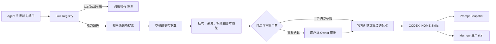

# codex-im-suite 开发记录

- 2026-08-08 ACE-Step 独立 Runtime 从 `manifest_incomplete` 收口为可安装的 `python_target/v2`：固定官方 v0.1.8 commit 源码 ZIP、CPython 3.11.9、uv 0.12.3、108795 bytes 全哈希 lock、CUDA 12.8 与 `acestep/nanovllm/torch/torchaudio` 探针，只把 `acestep/openrouter/nanovllm` 三棵声明包树复制到隔离环境。真实安装先后暴露 PyTorch CUDA wheel 不在 PyPI、uv 首索引优先阻塞新版基础包两个问题；现只根据受限 CUDA 版本推导 PyTorch 官方索引，在 PyPI/PyTorch 两个固定官方索引间择优，但最终 wheel 仍必须命中 lock Hash。安装失败输出只写入 `CTI_HOME/runtime/speech/install-logs` 供本机诊断，不跨 Control Contract 外发。正式安装最终通过 Python/CUDA 探针并原子发布 Runtime；ACE Turbo 主模型与 0.6B LM 固定文件集合也完成逐文件大小/SHA-256 校验并原子发布。Runtime 新增仅由 live Bridge 持有的 `ManagedSingingRuntimeSupervisor`：动态 loopback 端口、单 Worker、离线缓存/模型根、每次随机且不落盘的 token、PID 归属停止；面板 CLI 只经 mailbox 调用，不启动第二份进程。共享协议、C# DTO 和 React 新增 `singingBenchmark` 与“歌声性能测试”，首次固定 10 秒 benchmark 可以绕过尚未通过门禁的循环，但普通试听/生成仍要求当前 `provider + model + revision + hardware hash` 的 ready 记录，并记录真实耗时、时长、RTF 与 `nvidia-smi` 峰值显存。为避免控制面板每次状态刷新重复 Hash 约 6GB 权重，安装状态缓存绑定 marker 内容 Hash 与每个声明文件的大小/mtime/ctime/realpath；元数据变化立即失效，而真正释放运行路径仍强制完整 Hash。开发门禁已通过 Contracts `17/17`、Runtime `953/953`、Control Panel C# `170/170`、Web `46/46`、Core 全量、边界、扩展、人类文档和完整构建。本机配置已显式开启歌声；尚未重建 release、同步/重启 live、执行 RTX 3070 benchmark 或真实飞书新消息验收，因此不能宣称现场唱歌或完整语音收发已完成。

- 2026-08-08 继续收口克隆与歌声受管依赖边界：本机通过正式 `speech.installComponent` 安装 Qwen3-TTS 0.6B Base，11 个固定 revision/大小/SHA-256 文件在 `.stage-*` 完整校验后原子发布，耗时 `567.9s`；fresh live `speech.refresh` 确认 Base 组件为 `ready`，现有 Bridge PID `25840`、面板 `/healthz=200`、当前 `0.6B CustomVoice + Serena`、ASR/TTS 与飞书渠道均保持 ready。Base 安装不等于音色复刻完成：当前没有用户确认授权的 3–30 秒单人参考音频，也没有 Base 当前组合 benchmark 或 live 切换，所以未创建参考 Profile、未启用克隆。对 ACE-Step 官方 v0.1.8 与 Hugging Face 官方仓库完成只读资产审计：主模型 revision=`19671f406d603126926c1b7e2adc169acbcade22`，0.6B LM revision=`148d8ea0225bdab342ee1ae3a354275ccd60ca80`；开发版 manifest 现固定 Turbo DiT、Qwen3 Embedding、VAE 与 0.6B LM 共 25 个文件、`7709375886` bytes 的逐文件 HTTPS、大小和 SHA-256，专项受管依赖测试 `10/10` 通过。官方 GitHub v0.1.8 release 没有可固定的安装资产，Windows portable 使用可变 URL，官方源码安装与首次运行默认会动态安装依赖/下载模型；因此独立 ACE-Step Runtime 继续 `blocked / manifest_incomplete`，不能因模型清单已补齐而开放唱歌、歌声试听或绕过 benchmark。本条 ACE 模型清单尚仅存在开发版，未同步 live；真实飞书 E2E 仍需要重启后的用户新语音。尝试使用本机 `lark-cli` 代发入站测试时确认当前用户 `刘丹` 只有已知 open_id、无可用 user token，bot identity 也未配置，所以没有伪造飞书验收消息。

- 2026-08-08 控制面板普通语音试听与 TTS benchmark 的“按钮可点但没有回执”已定位并完成 live 闭环：CLI 主 Promise 通过 `.then()` 输出唯一 JSON，但等待 live Bridge 响应的 50ms timer 曾被错误 `unref`；当进程没有其他活动句柄时，Node 会以退出码 0 静默结束，stdout 为空，真实 TTS 也未启动。现只保留服务端长期轮询 timer 的 `unref`，客户端等待句柄保持进程存活至收到响应或有界超时；新增独立 Node 子进程回归，模拟 CLI 风格不顶层 `await` 的调用并断言 stdout 恰好一条合法 JSON。修复提交 `e74ad08` 已同步到两份正式 live skill，开发/live 的 Core、Runtime 与语音 CLI bundle SHA-256 一致；受控重启后 Supervisor PID=`20176`、Bridge PID=`25840`、startedAt=`2026-08-08T12:00:50.785Z`，飞书 WS=`connected / ws client ready`、`lastExitReason=null`、活动 Workflow=`0`。本机已安装并切换到 `Qwen3-TTS 12Hz 0.6B CustomVoice + Serena + adaptive_natural`，输入/输出开启、歌声关闭；live `speech.refresh` 返回总状态、飞书渠道、SenseVoice、Sidecar、FFmpeg、Qwen Runtime、0.6B/1.7B CustomVoice 和 Serena 均为 `ready`。真实页面点击 Serena“试听”后完成合成并插入内存播放器；浏览器复验 `<audio>` 使用 `blob:` 源、`readyState=4`、时长 `2.8065s`、播放已自然结束且无媒体错误。1.7B 试听耗时 `20.103s`、音频 `5.927s`；0.6B 试听耗时 `20.584s`、音频 `4.647s`，两者回执均为 `codex-im-suite/speech-preview/v2`、`audio/ogg; codecs=opus` 且 Hash/模型/音色绑定有效。RTX 3070 benchmark 仍未过门禁：1.7B 热态合成 `86707ms`、音频 `16567ms`、RTF `5.234`、峰值显存 `4380.9MiB`；0.6B 为 `60503ms / 15207ms / 3.979 / 2393.5MiB`，均因 `tts_model_warm_benchmark_too_slow` 保持 blocked，当前保留更省显存且约快 30% 的 0.6B。Contracts `17/17`、Core `916/916`、Runtime typecheck 与全量 `948/948`、Control Panel C# `168/168`、Web `46/46`、依赖边界 `4/4`、扩展/静态边界/人类文档和完整 Suite build 均已通过。以上只证明面板配置、真实本机合成与试听已生效；重启后的真实飞书新语音 ASR、原生 Opus 唯一终态、普通文字、`/voice off` 和强制失败唯一文字回退仍未现场验收，不能把语音收发写成完整完成。

- 2026-08-08 首次 0.4.0 live 启动暴露受管 CPython Sidecar 导入缺陷：固定 Python/CUDA Runtime 的隔离 `_pth` 正确忽略外部 `PYTHONPATH`，但 `runtime_server.py` 仍假设脚本同目录会自动进入 `sys.path`，因此即使 `backends.py` 已随白名单发布也以 `ModuleNotFoundError` 退出，面板保持 `error / sidecar_start_failed` 且试听按钮禁用。Sidecar 入口现仅把自身解析后的发布目录加入模块搜索路径，再导入同包 backend；不会恢复用户环境、全局 site-packages 或任意外部目录。新增启动顺序回归，并用真实受管 CPython 验证已越过 backend 导入；Runtime 全量 `947/947` 通过。该修复已构建、提交、同步 live 并完成第二次受控重启，现场 SpeechStatus 达到 `ready`，ASR/TTS/Qwen Provider、1.7B 模型和 Serena 均为 `ready`；但随后发现面板 CLI 静默退出缺陷，且真实飞书新语音端到端尚未验收，所以仍不能把语音收发描述为完整现场完成。

- 2026-08-08 Qwen3-TTS 受管 Python/CUDA 安装链完成开发与本机安装验证：Runtime 新增声明式 `python_target/v1` recipe，只接受固定 CPython 3.12 ZIP、固定 uv ZIP、仓库内全哈希 requirements lock、受限模块/CUDA 探针和磁盘预算；下载、解压、`python312._pth`、`uv pip install --require-hashes --no-config --no-python-downloads`、隔离 `PIP_/UV_/PYTHON*` 环境、无 shell 子进程、stage 清理和原子发布均由 Runtime 固定，manifest 不能携带任意命令。FFmpeg 改用不可变 BtbN 发布 ZIP，并由解析器安全支持一个普通顶层目录，junction/symlink 继续失败关闭；控制面板为安装、benchmark 和试听分别设置有界长超时，不再让大模型固定在 120 秒被误杀。首次真实安装在最终探针暴露 JavaScript 布尔值被写成 Python `true` 的错误，Runtime 正确拒绝发布并清理 stage；修复为 Python `True/False` 后重新安装成功，受管解释器复验 `qwen_tts / torch / torchaudio` 可导入、`torch=2.7.1+cu128`、CUDA 12.8、`cuda_available=true`。本机随后显式安装 FFmpeg/ffprobe、SenseVoice Windows Runtime、SenseVoiceSmall Q8 和 Qwen3-TTS 1.7B CustomVoice，组件 marker/文件集合状态均为 ready。最终开发门禁为 Contracts `17/17`、Core `916/916`、Runtime `946/946`、Control Panel C# `168/168`、Web `46/46`、依赖边界 `4/4`，扩展声明、静态边界、人类文档、release manifest summary 和完整 Suite build 均通过；0.4.0 portable/installer 已重建，MainPreflight 的 Runtime dist、Core dist、配置、SKILL、文档、面板、suite version 与同一 release run id 全部 `same`。输入/输出配置仍默认关闭，live 尚未同步/重启，RTX 3070 试听与性能门禁、Base 授权克隆、ACE-Step 固定清单和真实飞书新语音验收仍未完成，不能把本机安装描述为现场能力已生效。

- 2026-08-08 飞书现场计划任务再次误报“schedule 无效或缺少必要字段”，完成通用归一化修复并同步 live：现场消息 `om_x100b685e791c48a8c4cb19a5a443eb4` 的 Provider 原始输出实际包含完整 `name / taskAction` 和 `schedule={kind:"at",datetime:"2026-08-08T11:40:00+08:00"}`，失败发生在协议解析器只接受 `at.at + timezone`，并非计划任务 Host、worker 或飞书投递失败。对本机可访问的历史动作块做形状审计后确认还反复出现过 `once + delay_seconds/delaySeconds` 与 `interval + everyMinutes`；现由 `application/action-blocks.ts` 在语义唯一时统一转换为可信内部 `at/every/cron`：带显式偏移的 datetime 转 `at + UTC`，相对 delay 以真实动作解析时刻落成单次 UTC，interval 单位转 `everyMs` 并以同一时刻生成稳定 anchor。转换字段写入 `NORMALIZED_SCHEDULED_TASK_FIELDS` 审计，模型提供的身份、目标、工作区和权限字段仍不可信；无偏移本地时间、裸 cron、非正数间隔和未知枚举继续失败关闭并返回精确字段错误。Provider Prompt 同步给出 canonical `at/every/cron` 样例，降低新输出继续产生别名的概率。专项 `296/296`、Core 全量 `908/908`、typecheck、依赖边界、静态边界、人类文档和 diff 门禁均通过；正式同步重新构建 Core、Runtime、Web 与控制面板，受控重启后 Supervisor / Bridge / 控制面板 PID 为 `59900 / 59328 / 36724`，Bridge 从真实 live `daemon.mjs` 启动，飞书 WS=`connected`、`lastUnhandledError=null`、活动 Workflow=`0`、`/healthz` 成功。开发/live 的 action parser 源码、Manager 源码、Core parser bundle 与 Runtime bundle 四组 SHA-256 一致；加载同哈希 dist 对现场 schedule 探针得到 `error=null`、`datetime -> at`、`timezone=UTC`。真实 Host 创建、Store 落库、worker 触发和飞书投递仍必须由重启后的新用户消息验证，当前不重放已经错过时间的旧动作块。

- 2026-08-08 飞书 Unity 现场“真实完成却显示未完成”完成通用修复并同步 live：现场消息 `fe736f1b-61dc-4acd-8d4b-d4dde21597a2` 的 Primary Agent 通过本机 `mcpforunityserver 9.7.1` 连到 `Game / Unity 2022.3.27f1`，成功创建并保存 `H_Area10`，随后复验 `H_Area09=8 / H_Area10=9 / adjacent=true`、12 个房间、24 个 Prefab、`MISSING=0 / BAD_ROOT=0`；但 official Codex 以 PowerShell 直连本机 MCP HTTP 端点时，SSE 外层工具名只有 `Bash`，旧 family 门禁忽略了同一工具对中的真实 MCP JSON-RPC 请求与成功回执，最终错误覆盖为“本轮没有通过 Unity MCP 获得可验证结果”。现由 `execution-requirement.ts` 统一归一化“受控 shell 网络请求 + 本机 `/mcp` + MCP method + 成功结果”形成嵌套 MCP 证据别名，Core Conversation Engine 与 Runtime Workflow 复用同一函数；Unity family 从实际 MCP action/resource 特征派生，不依赖场景名、房间名、原句或固定项目。只在工具输入真实发起 MCP 请求且内层没有 `success=false / ok=false` 时补证据，普通 `Write-Output`、模型正文或失败 batch 不能放行。Primary Agent 仍负责判断已验证事实是否覆盖用户需求，确定性层只验证事实来源，避免再由孤立外层工具名推翻完整验收结论。新增成功嵌套 Unity MCP、纯文本伪完成和内层失败回归；Core 全量 `903/903`、Runtime 证据专项 `3/3`、Runtime typecheck、完整 Suite build、依赖边界与人类文档门禁通过。Runtime 全量在既有 `CodexLocalCliProvider` 挂起进程超时用例处超出 180 秒；随后经用户授权同步两份 live skill，并在本日计划任务兼容修复的第二次发布中继续保留同一实现，当前最新 Supervisor / Bridge / 控制面板 PID 为 `59900 / 59328 / 36724`，飞书 WS=`connected`、`lastUnhandledError=null`、活动 Workflow=`0`。重启后的新 Unity 同类消息尚未复测，因此只确认代码已部署与现场连接健康，不把旧回合结果冒充新版本端到端验收。

- 2026-08-07 本地语音收发完成开发版 `0.3.0` 的人类文档投影，当前事实仅覆盖源码边界：首期渠道为飞书，输入/输出默认关闭；真实飞书语音经可信 `messageId + fileKey + attachmentId` evidence、本地 ASR 和 Primary Agent 后默认回复语音，普通文字默认回复文字，`/voice on|off` 持久化当前会话偏好，优先级固定为“明确文字 → `/voice off` → 明确语音 → `/voice on` → Runtime 策略 → 入站语音 / 模型提示”，其中 `/voice off` 在再次开启前绝对阻止语音。Core 负责 evidence、回复策略和唯一终态，Runtime 负责配置、依赖解析、单请求 Sidecar、媒体校验转换、ASR/TTS、Opus 回执与授权音色注册表，Control Panel 通过共享 Speech Contract/Schema 展示 `ready / optional_missing / blocked / error` 四态并调用 Runtime 动作。可选模型、FFmpeg、Python 和二进制不随 npm/live/release 包安装，首条消息不会隐式下载；受管依赖、音色和请求临时数据分别位于 `CTI_HOME\runtime-deps\speech`、`CTI_HOME\runtime\speech\voices`、`CTI_HOME\runtime\speech`，不读取或迁移 `F:\unity\ST4\.cti-audio`。语音成功只保留一个飞书原生 Opus 终态，任一转写/合成/验证/卡片替换/上传失败只产生一次完整文字错误或结果。当前受管依赖清单已为 SenseVoice Q8 模型与 Windows x64 runtime 固定版本、URL、SHA-256 和大小，二者可由用户显式触发受管安装；两个 CosyVoice 组件因尚无可信固定归档 SHA，继续报告 `blocked / manifest_incomplete`。清单可安装不代表本机已下载、已安装或运行态 `ready`；尚未执行 suite → live 同步与重启、开发/live bundle/PID 对齐、RTX 3070 性能/显存/OOM 验收，以及重启后真实飞书新语音的转写、默认语音回复、`/voice on|off`、原生 Opus 和唯一文字回退端到端复测。以上任一证据缺失时，不得把开发版构建或单元测试描述为现场已生效。`packages/bridge-runtime/docs/AI_BRIDGE_CONTEXT.md` 已改为项目内入口并指向仓库架构/开发记录；外部 `E:\cli-md\docs\AI_BRIDGE_CONTEXT.md` 不存在，本轮未创建也未声称同步。

- 2026-08-07 在同一开发阶段加入独立歌声链：模型只能提交受限 `cti-final.singing` 歌词、风格、语言和时长，Core 只调用 `SingingHost`，Runtime 使用 ACE-Step 1.5 官方异步 API（`/release_task -> /query_result -> /v1/audio`），禁止用普通 TTS 冒充唱歌。ACE 客户端仅允许 `127.0.0.1` HTTP、Bearer token、禁止重定向，并对最终 Ogg/Opus、时长、大小和 Hash 复验；未通过本机 benchmark 时失败关闭。
- 2026-08-07 控制面板语音页已分开提供说话音色和歌声音色选择、普通语音试听与固定 10 秒歌声试听。试听通过版本化 Base64 Ogg/Opus 回执，经 Runtime、C#、React 三层精确校验后才进入内存播放器；C# 实际采用薄 DTO、手工 wire 形状/媒体校验和反射测试核对 Schema，并非在运行时直接执行 JSON Schema validator。设置保存只代表 UTF-8 `CTI_HOME\config.env` 写入，仍需受控重启后核对新 PID、长连接、Runtime 状态和开发/live Hash。
- 2026-08-07 当前歌声阻塞保持可见：ACE-Step Runtime/模型的受管 manifest 尚未补齐固定版本、SHA、大小和安全安装目标，保持 `blocked / manifest_incomplete`；RTX 3070 歌声性能/显存基准也未执行，所以唱歌不能标为 ready。当前仍未同步 live、未重启，也未完成重启后的真实飞书新语音端到端验收。
- 2026-08-07 开发门禁结果：Contracts `17/17`、Core `901/901`、Runtime `936/936`（ACE-Step 专项 `6/6`）、Control Panel C# `161/161`、Web `46/46`、依赖边界 `4/4` 均通过；Contracts/Runtime typecheck、Python sidecar compileall、扩展声明、静态边界、人类文档与完整 Suite build 通过。portable/installer 已按 0.3.0 正式入口重建，MainPreflight fork-health 中 Runtime dist、配置、SKILL、文档、面板和指纹全部一致；这仍不是 live 或真实飞书现场验收。

- 2026-08-07 飞书工作区按钮二次修复：用户在上一版 live 部署后现场复测，按钮回执显示新会话 `135cab9a...` 已绑定 `codex-im-suite`，但 5 秒后的“当前工作区”进入新创建的 `abb0ee8e...` 并回到 `F:\unity\ST4`。这条现场证据推翻了“仍是旧进程整表覆盖”的单一归因：新 session 和 callback 写入都真实成功，真正回退发生在下一条普通消息的 `channel-router.enforceWorkspacePolicy`。live 的结构化项目注册表已启用 `codex-im-suite`，但 `CTI_ALLOWED_WORKSPACE_ROOTS` 仍只有三个 Unity 路径；路由层只读取 legacy allowlist，因而把注册项目误判为越界并重绑默认目录。现将启用的结构化项目根与 legacy roots 在会话路由层合并为同一授权上界，禁用项目仍不获授权，且“允许访问”不会自动挂载其他项目；工作区成功回执也改为调用下一条普通入站使用的同一 `router.resolve` 复验。新增路由层启用/禁用项目回归，并把按钮测试扩展为“legacy allowlist 较窄 → 点击注册项目 → 下一条普通消息 → session/cwd 仍保持目标项目”的完整现场链路。Core 全量 `886/886`、Runtime 全量 `895/895`、两包 build、依赖边界、架构文档维护、乱码扫描和人类文档门禁均通过。同步前活动 Workflow 为 0、无 Git 锁和同仓库并发写入；修复提交 `a85e218` 已推送，suite → 两份 live skill 同步后重启为 Supervisor `74136`、Bridge `79324`，飞书 WS=`connected`、`lastUnhandledError=null`。`channel-router`、Manager、Core bundle 和 Runtime daemon bundle 四组开发版/live SHA-256 均一致；控制面板恢复为 PID `80520`，`127.0.0.1:8788/healthz` 返回 200。尚需用户用重启后的新消息再次点击工作区按钮并发送“当前工作区”，现场结果未出现前不得宣称功能已验收。

- 2026-08-07 飞书聊天工作区“显示已切换但真实 cwd 回退”完成通用修复并同步 live：现场两次操作都成功创建了指向 `codex-im-suite` 的新 session，但同一聊天的持久 binding 随后又回到旧 session 和 `F:\unity\ST4`；时间线证明旧 Bridge 内存快照在重启重叠期继续处理迟到回执，并把 `sessions.json / bindings.json` 整表覆盖，问题不在项目目标解析。Runtime Store 现把两份路由事实源统一改为跨进程事务：同文件锁内先回读磁盘、只修改目标记录并用现有 UTF-8 原子写入模块落盘；仅在锁超时且所属 PID 确认不存在时清理陈旧锁。所有会话修改与绑定修改复用该入口，旧 session 的迟到 SDK ID 只能更新仍引用它的绑定，不能把新工作区覆盖回去。Core 在创建新会话后重新回读聊天 binding 和实际 session，只有 binding 指向新 session、两处 cwd 与目标项目四者一致才回复“已切换”；否则明确回复“绑定写入后复验失败”，不再虚报。新增双 Store 重叠实例完整回归和 Manager 失败复验回归；Runtime 全量 `895/895`、Store `50/50`、Core 全量 `884/884`、Core typecheck、Runtime build 均通过。Runtime 独立 typecheck 仍仅被本轮开始前已有的 `active-reply-control.test.ts:45` 索引签名错误阻塞。同步前活动 Workflow 为 0、无 Git 锁和同仓库并发写入；suite → 两份 live skill 同步后从 live 运维入口重启，Supervisor / Bridge PID 为 `68676 / 76580`，飞书 WS=`connected`、`lastUnhandledError=null`，开发版/live 的 Manager、Store、Core bundle、Runtime bundle 四组 SHA-256 一致；同步中被停止的正式控制面板已恢复为 PID `71336`，`127.0.0.1:8788/healthz` 返回 200。当前原聊天尚未发送重启后的新切换命令，所以磁盘 binding 与 session 仍一致指向旧 `F:\unity\ST4`；必须用新入站消息完成切换并等待一次正常回复后再确认不会回退，不能把部署成功描述成现场切换已经验收。

- 2026-08-07 统一计划任务逐轮打卡能力完成开发版实现：现场需求希望计划待办不只是到点提醒，而是让当前群成员直接点击按钮打卡。核对发现旧记忆待办有一次性“完成”按钮，但统一计划任务的真实触发只投递 `notify / agent_turn / controlled_tool` 结果，普通回复“打卡”没有逐轮账本、去重或可查询结果。现新增通用 `check_in` 动作：每次运行生成独立 Feishu Card 2.0 打卡卡片，账本绑定 `taskId + runId + slotKey`，回调同时核对真实投递 message ID、当前 chat 和原生 operator；群体打卡复用当前群成员 evidence，创建者打卡使用 owner 绑定，每人每轮只计一次，窗口到期后关闭按钮。卡片只显示汇总人数，Host 和正式 CLI 历史返回 `checkInCount`，不外发平台用户 ID。打卡状态沿用统一 Windows 锁重试原子 UTF-8 写入模块，普通回复、表情、通用投票与旧 reminder 完成状态均不能短路写入。Core 动作解析/Manager callback、Runtime Host/Store/卡片/CLI、Skill、README、架构和长期维护规则已同步；专项 Core 258/258、Runtime 26/26 通过，Core typecheck/build 通过。Runtime 全量 typecheck 仍被本轮开始前已存在的 `active-reply-control.test.ts` `Record<string, unknown>` 类型错误阻塞；本轮仅修改开发版，尚未同步或重启 live，现场机器人仍不具备该能力。

- 2026-08-06 飞书当前群测试被误判“跨会话未授权”完成开发版通用修复：现场 17:24 回合中，用户原生回复已创建的当前群定时提醒卡片并说“现在测试一次”；可靠 outbound ref 已恢复原始任务，模型输出的 `cti-direct-message.targetId` 与本轮来源群 `chatId` 完全相同，但旧门禁只看 `targetType=chat` 和孤立当前短句，错误返回“本轮用户没有明确授权向目标群聊发送消息”。现新增纯 `application/direct-message-policy.ts`，并在 `agent-architecture.ts` 登记 `policy_registry.direct_message_scope`：目标 ID 与可信来源 `chatId` 精确相等时归为当前会话；“现在测试一次 / 继续发送 / 确认”等动作短句只有在原生回复本机器人、正文可靠恢复且带持久续办摘要时才能继承进入动作裁决的授权，普通历史、不可读卡片壳、疑问和否定句均不能继承。当前会话直接走受控发送，不再要求跨会话确认；真实跨群仍保留 Owner、adapter 唯一目标解析和二次确认。新增纯策略、架构归属与 Manager 端到端回归，覆盖现场同群场景、无可靠续办证据的模型伪动作，以及可靠续办指向其他群时仍只生成确认卡；Core 全量 `881/881`、依赖边界 `4/4`、静态边界和人类文档门禁通过。当前仅修改开发版，尚未同步或重启 live；现场机器人在发布前仍使用旧行为。

- 2026-08-06 飞书 CLI 授权卡现场漏接修复：14:24“给我提个代办”真实消息中，Codex 已执行 `lark-cli auth login --scope 'task:task:write' --no-wait --json` 并获得官方 device challenge，但 Windows 路径把命令包在 PowerShell `-Command '...'` 中，末尾 `--json` 后直接是闭合单引号；旧布尔参数识别只接受空白或字符串结尾，导致 challenge 未进入 `FEISHU_CLI_USER_AUTH_REQUEST`，模型的链接、二维码和“回复已授权”文案漏到普通交付层。现统一布尔 flag 边界，兼容 shell 闭合引号、分号和右括号，同时拒绝 `--no-waiting / --json-output` 等相似长参数；真实 challenge 仍必须由同一工具对、官方 URL、单一精确 scope 和成功结果共同验证。命中后继续使用已有专用 Card 2.0“打开飞书授权页”按钮，后台 `--device-code` 成功即自动恢复原任务，不要求用户回复；未把权限/身份流程降级为通用 choices。新增 PowerShell 包装与相似长参数回归，Core 全量 `863/863`、Runtime 授权链 `4/4`、Core typecheck、Core/Runtime build、依赖边界、静态边界、人类文档门禁和目标 diff 检查通过。当前仅修改开发版，尚未同步或重启 live；现场机器人在完成发布前仍可能继续使用旧行为。

- 2026-08-06 飞书卡片“结果已生成但执行轨迹长期停在 5/7”完成通用修复并同步 live：现场 Workflow `efb5bd3d-16e2-4c26-bff0-1a58853c1226`、协作 run `a7203a79-ea4f-4386-9f75-0b4e19158eb7` 和 Codex 会话证明，11:36:56 已生成完整 `cti-final`、11:36:57 已写 `task_complete`，但 SDK 流没有再产生可消费 EOF / `turn.completed`，卡片因此等待约 15 分钟；Bridge、Feishu WS 与平台资源恢复旁支均不是主因，高概率是工具后台进程继承输出句柄使 Codex 子进程不退出。先通过受控 active-reply 通道取消唯一卡死回合并确认 Workflow=`cancelled`、卡片=`interrupted`、旧子进程退出，未重启或重放原请求。`codex-provider.ts` 现只在普通 Primary 回合收到完整 fenced、严格 JSON、具备非空交付内容的 `cti-final` 后启动默认 5 秒 drain watchdog；正常 `turn.completed` 优先，final 后出现任何后续 item 会撤销旧信号，超时才用 Provider 内部 AbortController 结束 SDK run、补唯一 `result` 且不发 error。用户外部取消仍保持取消，classifier / response-only 不启用；生产等待值可由 `CTI_CODEX_FINAL_DRAIN_TIMEOUT_MS` 在 1–60 秒内覆盖。新增完整/截断/非法协议、永久挂起、正常完成、final 后续工具和外部取消回归，Provider 定向 `54/54`、Runtime 全量 `889/889`、完整构建、依赖边界、静态边界、人类文档门禁和 `git diff --check` 全部通过；Runtime 独立 typecheck 仍只受既有 `active-reply-control.test.ts` 索引签名错误阻断。发布前确认活动 Workflow=0、同仓库写入进程=0；发现 `.git/index.lock` 是 6.6 天前的 0 字节陈旧锁且无任何 Git 进程占用后，仅清除该锁。suite → 两份 live skill 同步并从 live daemon 重启，Supervisor/Bridge PID 为 `22044 / 33348`，Worker PID 为 `32824 / 19324`，official Codex app-server PID 为 `35764`，正式控制面板恢复为 PID `13640`。飞书日志出现 `client ready / ws client ready`，运行审计 `feishuWs.state=connected`、`lastExitReason=null`、`lastUnhandledError=null`，`/healthz` 返回 200，`bridge-error.log` 为空，活动 Workflow=0；开发/live 的 Provider 源码、Runtime bundle、Core bundle 三组 SHA-256 一致。最后使用与 Bridge 相同的“小虾米”bot 身份，按原回合 sender、当前认证用户和 owner 白名单三重一致证据私发完成信息，平台回执为 `om_x100b6874df9b44a4b16755e1b7bf37d`。机器人在线与私发链已现场验证；watchdog 本身仍需用户用重启后的同类新消息复测，当前不伪造新卡死场景。

- 2026-08-05 飞书“命名群发送被误判私发”与“做成飞书文档误触 Unity MCP”完成通用修复并同步 live：live Workflow `a8069434-73b4-4ce0-ac4d-657cf316c0f2 / 40bbfe06-f81b-4928-b14b-1eab877ab38a` 证明用户明确说“在机器人大乱斗群里发”，模型已输出群类型受控动作，但授权正则只接受“发到群”，错误返回“没有明确授权私发”；同时本地群索引只有 chat_id，不能按真实群名继续解析。现将用户/群目标授权分开，“在/往/向/去某群里发”等通用句式只进入 `targetType=chat`，Feishu adapter 以应用身份分页读取机器人真实所在群列表，先精确群名、再仅忽略末尾“群/群聊/群组”做安全别名唯一匹配；零结果/多结果明确澄清，禁止降级私聊。另一现场 Workflow `b58a3985-b07d-433b-8c04-2326d6de2015` 证明“做成飞书文档”的内部改写 Prompt 因包含 Unity/截图/失败说明被 Manifest 升级成 `manage_camera`，工具失败文本随后仍被创建为文档并形成失败卡+成功链接双终态。现将直接文档改写固定为 response-only，创建前拒绝 Provider 错误、意外工具、空正文、工具失败诊断和不完整 Markdown；文档创建/导览在卡片定稿前完成，成功链接或失败原因只进入同一终态，不再回落 Provider 正文/附件。新增群发送自然语言、真实群列表名称解析、文档 response-only、失败正文禁止创建和单终态回归；Core `861/861`、Runtime `884/884`、完整构建、依赖边界、静态边界、人类文档门禁和 `git diff --check` 均通过。同步前活动 Workflow 为 0；正式 suite → 两份 live skill 同步后从 live 入口重启，Supervisor/Bridge PID 从 `30452 / 28860` 更换为 `1576 / 41800`，Worker PID 为 `28364 / 30748`，official Codex app-server PID 为 `25916`，控制面板 PID 为 `35116`。飞书日志出现 `client ready / ws client ready`，运行审计 `feishuWs.state=connected`、`lastExitReason=null`、`lastUnhandledError=null`，`/healthz` 返回 200，`bridge-error.log` 为空。应用身份只读扫描 6 个真实群，名称“机器人大乱斗群”按安全后缀别名唯一匹配到“机器人大乱斗”；未发送截图中的冒犯性文本。开发/live 的 Manager、Conversation Engine、Feishu Adapter、文档交付策略、Core bundle、Runtime bundle 和正式面板 exe 七组 SHA-256 一致。重启后的真实群发和飞书文档仍需用户以中性新消息现场复测，当前不重放旧消息或伪造发送结果。

- 2026-08-05 飞书 Unity 任务“工具实际读到结果但最终被判失败”完成通用修复并同步 live：根因是 official / external Codex 使用隔离 Home 时剥离了用户全局 `mcp_servers`，而 `config/mcp.d` 的受管 manifest 没有重新投影，导致 Unity 请求退化为 Bash / PowerShell 探测；普通 `Bash` 结果不能满足 `unity-mcp + artifact` 证据门禁，最终失败卡又把原始工具输出误当用户原因。现由 `McpBridge` 从唯一 manifest 来源生成最小连接投影，只接收启用且工作区有效的 HTTP / stdio 配置，并在 Bridge 启动时写入 Primary official / external Home；全局未受管 MCP 继续隔离。第一次 live 同步复核进一步发现，同源轻聊 app-server 的预热和 classifier 都会用无 MCP 配置重写同一个 Primary Home；现将轻聊与 classifier 分别迁到独立 restricted Home，保持无 MCP、无工具、只读边界，同时不再覆盖 Primary。Unity MCP 证据不再由任意含 `mcp` 的工具名满足，非 Unity Picture MCP 回执不能通过；缺证据文案不再外发目录、命令、绝对路径或原始错误。定向 Provider 测试 49/49、Core 856/856、Runtime 884/884、Runtime bundle、依赖边界、人类文档和 diff 门禁通过；Runtime 全量 typecheck 仍被既有 `active-reply-control.test.ts` 的 `ActiveReplyCancelRequest` 索引签名错误阻断，本次未修改该无关测试。最终同步前活动 Workflow 为 0；live Supervisor、Bridge、official Codex 与控制面板均更新为新进程。飞书日志出现 `client ready / ws client ready`，运行审计 `feishuWs.state=connected`、`lastExitReason=null`、`lastUnhandledError=null`，`/healthz` 为 200。Primary official Home 的 `unityMCP / unityPrefabMCP` 均为 `true`，restricted 轻聊 Home 无任何 MCP；开发版/live 的 Provider、轻聊 Provider、Runtime main、Runtime/Core bundle、Core 证据策略和两份 Unity manifest 八组 SHA-256 一致。重启后的真实 Unity 飞书原文仍需用户发送新消息复测，当前不伪造客户端现场执行结果。

- 2026-08-04 飞书回复既有产物后的短约束修改完成开发版通用修复：真实回合“打到人均30左右”虽然进入 official Codex Primary，但上一版只按当前短句得到 `ExecutionRequirement=none`，零工具口头承诺“我按这个标准重排”仍被判成功。进一步确认本地 outbound ref 已保存原始排行图表请求与上一轮结果，但 adapter 因摘要包含可见卡片标题而整段丢弃。现改为仅在摘要与可见正文完全相同时去重，并在结构化 evidence 标记耐久续办上下文已恢复；Core 新增纯继承裁决，只对 `reply_target / continuation` 下可信恢复的短约束修改继承原任务执行要求。明确图表、排行图、表格、海报、幻灯片等可视交付首轮即要求 `artifact_required`，预算/数量、换样式、删条目等续办继续要求本轮工具与新产物；普通感谢和只有标题、没有耐久摘要的回合不继承。Provider Prompt 明确禁止只承诺稍后重做；按现场要求将恢复上限提升为三次正式尝试，第一次恢复重新规划真实工具路线，第二次恢复强制切换兼容工具、manifest 动作或修正参数/权限/产物验证，三次无产物才收口为“未生成可验证交付”。未知工具已经启动或可能有副作用时不会为凑次数重放。新增执行要求纯函数、Feishu 上下文与 Bridge Manager 端到端回归；当前仅修改开发版，未同步 live，也未把开发版测试通过描述成现场机器人已修复。

- 2026-08-03 飞书全员投票新增“全员完成即继续”：首次合法投票通过官方群成员接口冻结真人参与者快照，Registry 以稳定平台身份集合做覆盖判断，全部成员完成选择后原子提前收口、清理原截止 timer、更新原卡并通过同一 adapter FIFO 续办；成员接口失败时不根据票数或模型文本猜测总人数，保持原绝对截止时间兜底。选择卡在可验证名单存在时展示“已选 / 应选”进度，持久状态新增参与者快照、应参与人数和 `deadline / all_participants_selected` 收口原因，重启恢复后仍可继续覆盖判断。新增 Registry、Manager、Feishu Adapter、Card 2.0 和 Runtime Host 回归；当前仅完成开发版修改与验证，未同步 live。

- 2026-08-01 飞书群聊纯原生 @ 静默问题完成通用修复并发布 live：现场两条消息已被长连接接收，但只有 inbound event、没有 Workflow 或过滤审计；真实消息正文只有 `@_user_1`，清除 mention marker 后命中 adapter 空文本返回。现由 `inbound-mention-wake.ts` 统一裁决人类纯 @：带 reply/root 时继续优先处理被引用目标，无正文/附件时转换为无副作用的等价轻聊输入并记录 `feishuPureMentionWake`，最终回复仍交给当前已选 Provider 的受限轻量协调器，不在 adapter 写死；无原生 @ 的空消息与其他 bot/app 的空 @ 仍不入队。验证通过 Core 全量、依赖边界、静态边界、人类文档门禁和完整构建；发布前检测到 1 个真实 executing Workflow，等待自然结束并确认 drain 为 0 后才停止、同步和重启，未强制截断。live Supervisor / Bridge 更新为 PID `26180 / 31768`，runId `fab415c5-8a3e-4357-afcd-16885efda1e3`，飞书 WS `connected`、`lastUnhandledError=null`、活动 Workflow 为 0、`/healthz` 为 200；控制面板恢复为可见 PID `10748`。开发版/live 的 Core bundle、Runtime bundle、mention policy 和 Feishu adapter SHA-256 一致。重启后的真实纯 @ 客户端消息仍需用户发送新消息复测，当前不伪造现场回复验收。

- 2026-08-01 控制面板“终止回复”完成通用实现与 live 发布：执行器最近 Workflow 与会话详情的活动 run 均新增终止入口，按钮仅对真实 `status=running` 开放并显示“正在终止 / 已终止 / 已完成无法终止”。新增 Runtime 原子 request/response mailbox 与 `active-reply-control-cli.mjs`，C# 面板只传 opaque workflowRunId；Runtime 再从 Workflow 事实源恢复 session、原 turnId、channel/chat，与 Core 内存活动任务四重匹配后复用真实 AbortController，不通过重启 Bridge 或直接改状态文件伪造取消。取消成功将原流式卡只定稿一次为“已终止”，Conversation Engine 返回后立即停止记忆、正文和附件投递，Workflow 固定为 `cancelled` 且 `retryDisposition=not_retryable`；迟到成功/失败不能覆盖，也不会进入 Provider 或后台自动重试。针对性验证已覆盖错误 turnId 拒绝、正确回合中止、迟到投递抑制、已完成幂等、缺 turn identity 失败关闭、Workflow 唯一取消终态与 C# CLI 参数边界；Core、Runtime `880/880`、Contracts `14/14`、Web `39/39`、控制面板 `122/122`、依赖边界、人类文档和完整构建均通过。发布前发现一条 19:34 的团购查询已在 19:42 将原卡定稿为 `interrupted`、`lastActiveRequest=null`，但旧版漏收口 Workflow；经现场证据确认不是活动执行后，仅对该陈旧 drain 记录显式 bypass，重启时按“执行中任务禁止自动重放”收口为 failed。live Supervisor / Bridge 更新为 PID `16828 / 14992`，runId `60a9017c-396f-4739-b58b-2fac06f6af84`，飞书 WS `connected`、活动 Workflow 为 0、`/healthz` 与 `/api/state` 均为 200，日志出现 `Active reply control: ready`。开发版/live 的 Core bundle、Runtime bundle、终止 CLI 和正式面板 EXE SHA-256 一致；面板 EXE 为 `C8FD57086B935114D0213722560074EBB00142C1CDEEFB058D4B0CC9AB20C996`。正式面板已显示 Live 同步和新 Bridge 状态；对已结束 run 的真实 `workflow.cancelActiveReply` 返回 `already_terminal`，Bridge PID 保持不变。当前没有新的活动回复，因此未伪造 live 活动取消验收，下一条长回复可直接从面板完成该现场复测。

- 2026-08-01 控制面板“重启 Bridge”完整编排与快速返回最终收口：第一阶段已经避免 90 秒超时递归误杀 Supervisor/Bridge，并增加进程管理器、PID/runId、近期心跳和飞书回调完整就绪门禁，但真实面板入口仍稳定耗时约 `91.8s`。继续取证确认 Supervisor 在约 5 秒时已经输出启动成功，新增 readiness marker 也已进入隔离日志；真正剩余阻塞是控制面板 `Process.WaitForExitAsync` 使用匿名 stdout/stderr 管道，长驻后代持有句柄使异步等待直到 90 秒取消。现仅对 Bridge `start/restart` 改用临时 UTF-8 文件承接 PowerShell 全流输出，宿主不创建匿名输出管道；stop/status/logs 与其他命令保持原捕获和整树清理。Supervisor 在完整 PID/状态/存活检查后同时发布命令专属回执与受控 marker，daemon 可结束短命包装器并保留受管进程；手动、设置应用和模型更新重启全部复用统一入口。集成回归故意让启动包装器再挂 30 秒，daemon 约 3 秒返回且后台进程继续存活；控制面板 `120/120`、Workflow drain、依赖边界、静态边界、人类文档门禁和完整构建通过。最终同步 live 并从正式面板同一 `bridge.restart` API 复测，耗时从约 `91.8s` 降为 `9.45s`；面板 PID `39584` 且窗口可见、Supervisor/Bridge PID `25948 / 8640`，status/audit runId 同为 `2ee2e69b-742e-4e36-9b30-1480f3ca7f7e`，近期心跳存在、飞书 `connected`、活动 Workflow 为 0、`/healthz` 为 200。开发版/live 的 daemon、Supervisor、Runtime bundle 和正式面板 EXE 四组 SHA-256 一致，面板 EXE 为 `92F9B7A91DBA60890B642B20C4F7FACCC00FA23DC48E55EEC2B3B8EBC8F85BB5`。

- 2026-08-01 控制面板“重启 Bridge”进程树与完整就绪门禁已完成开发、live 同步和真实面板命令验收：现场飞书提示“目标回调服务当前未在线”时，控制面板仍在但旧 Supervisor/Bridge PID 均已退出；面板再次重启后新 Supervisor/Bridge 曾正常接收“来局多人肉鸽，支持多线路的”并流式更新到 sequence 60，随后两者在没有退出审计的情况下同时消失，时间与控制面板 90 秒命令超时吻合。根因是通用进程包装器超时固定调用 `Kill(entireProcessTree: true)`，把已经成功脱离启动的后台 Supervisor/Bridge 当作命令子树一起杀掉。现仅对 Bridge `start/restart` 使用托管进程保留策略：超时时只结束命令包装器，再由真实就绪探针裁决；stop/status/logs 和其他命令仍保持原整树清理。重启成功必须同时确认 Supervisor 或 Windows Service、Bridge 进程、`status.json` 新 PID、同一 run 的运行审计、30 秒内心跳，以及已启用且具备审计状态的回调通道为 `connected`；否则最多等待 45 秒并明确报告未恢复层级。控制面板测试 `120/120`、Workflow drain/隔离 stop-start 回归、人类文档门禁、完整构建和目标 diff 检查通过。同步 live 后先用真实 `bridge.start` 触发 90 秒包装器超时保护，Supervisor/Bridge `18076 / 26844` 继续存活，陈旧肉鸽 Workflow 收口为 failed、活动数归零且未自动重放；随后真实调用 `bridge.restart` 返回 HTTP 200，新 Supervisor/Bridge 为 `38720 / 29732`，PID 与 runId 在 status/audit 中一致、近期心跳持续、飞书 `connected`、`lastExitReason=null`、`lastUnhandledError=null`、控制 API `/healthz` 为 200。开发版/live 控制面板 EXE SHA-256 同为 `A6D70CABAF5B68746F75F436AF901D118D0C14DBA7A4CC8138C11AEF158F7402`；可见面板已恢复为 PID `15844`，桌面验收图为 `C:\Users\admin\.claude-to-im\runtime\captures\control-panel-bridge-restart-ready-front.png`。

- 2026-08-01 点餐顾问 Skill 完成开发版首版：新增 `food-ordering-advisor` bundled Skill 与 `skill.local-life` 扩展 manifest，覆盖“吃什么/附近餐厅/外卖推荐/美团点餐/大众点评比较/选店选菜/购物车准备”等多轮入口。数据入口按官方或授权合作接口、已登录浏览器/App、限定官方域名联网检索、用户链接/截图和非实时通用建议逐级降级；美团实时外卖字段与大众点评到店口碑分开取证，同店仅在名称和地址/门店标识强匹配时合并，不伪造商家、评分、价格、优惠、配送或订单结果。为让机器人在默认隔离 Desktop Browser 插件时仍有真实公开网页入口，正常 `official` Codex 回合新增 SDK 服务端 `webSearchMode=live`，仅 completed `web_search` item 映射为可审计 `tool_use/tool_result`；受限分类器、external/local 来源继续禁用，且搜索能力不冒充登录态浏览器。购物车与提交分层，群聊不展示账户地址，提交必须基于最新结算摘要和当前用户显式确认，登录、验证码、支付与身份验证由用户接管，缺少真实回执不得宣称成功。验证已通过官方 Skill quick validation、UTF-8 回读、Extension Manifest 严格校验 `29` 项无警告、Runtime typecheck、新增 Web Search 回执定向测试、Runtime 全量测试、人类文档门禁和目标文件 `git diff --check`。本项仅修改开发版，未同步 live，尚未执行真实平台登录或现场下单。

- 2026-08-01 控制面板 Workflow 状态 UTF-16 崩溃已完成通用修复、历史状态自愈与 live 验收：Windows `.NET Runtime` 事件明确定位 `/api/state` 在序列化 `$.Workflow.runs` 时抛出 `Cannot read incomplete UTF-16 JSON text as string with missing low surrogate`；真实 `workflow-runs.json` 中一条 `promptPreview` 在国旗 emoji 的高代理项 `\ud83c` 后截断。Runtime 新增通用 UTF-16 归一化与代理对安全截断，Workflow 整份状态在持久化边界递归清洗所有字符串，不只保护 prompt；读取历史坏状态时只有检测到确凿非法代理项才创建时间戳备份并原子自愈，迁移失败仍返回安全内存状态，正常文件不重复改写。控制面板统一 JSON 文件入口只在内存中兼容历史孤立代理转义并记录文件名/替换数，不删除或重建状态库，WebView2 序列化和投递异常也不再逃逸到 UI 线程。验证通过 Runtime 专项 `16/16`、Runtime 全量 `876/876`、控制面板 JSON 边界 `3/3`、控制面板全量 `109/109`、typecheck、依赖边界、人类文档、扩展清单、完整构建与 `git diff --check`；开发版 API 使用原坏状态文件在独立端口 `8789` 返回 `/api/state` 200 并保留 80 条 Workflow。最终发布已重建 portable/installer，release run `9adc72927c7e4810a252ebc8bcecd387` 分叉健康检查通过；活动 Workflow 为 0 后同步并重启，Supervisor/Bridge PID 从 `127508 / 118016` 最终更新为 `109952 / 79760`，控制面板 PID 从 `117280` 更新为 `37632` 且窗口可见。飞书长连接日志出现 `client ready / ws client ready`，运行审计 `feishuWs.state=connected`、`lastExitReason=null`、`lastUnhandledError=null`；`/healthz` 和连续两次 `/api/state` 均返回 200，schema 正确、80 条 Workflow 保留，重启后无新增 `.NET Runtime` 异常。原状态已备份为 `workflow-runs.json.unicode-repair-1785557185455.bak`，备份保留 1 个原孤立代理项，当前状态计数为 0。开发版/live 的 Runtime bundle、Workflow 源码、Unicode 模块和控制面板 exe 四组 SHA-256 一致。

- 2026-08-01 飞书看盘式分析卡第二阶段可读性优化已完成开发、全量验证与 live 部署：三列“指标 / 当前 / 变化”收为移动端友好的“指标 / 状态与信号”双列，当前值和变化沿用同一 tone，分区标题统一为可扫读标签。协议入口改为先过滤无效/同名指标再计入最多 6 项上限，同名分区合并、条目去重后再保留最多 4 个分区，避免前置脏数据挤掉后续有效内容。普通正文若重复结构化标题或结论，只折叠代码围栏外的完全相同展示行，代码块与其他依据保持原样；Provider Prompt 同步要求正文承担补充 evidence/fallback，而不是复述完整面板。验证通过 Core `843/843`、Runtime `874/874`、Contracts `14/14`、依赖边界 `4/4`、静态边界、人类文档、Extension Manifest、完整构建与 `git diff --check`，专项分析/架构 `68/68`、Codex Provider `47/47`。portable 和 installer payload 已重建，正式控制面板 exe、`wwwroot` 均存在且 `*.WebView2` 运行态目录为 0，发布指纹门禁通过。同步前活动 Workflow 为 0；suite → 两份 live skill 同步并经 drain/restart 入口重启后，Supervisor/Bridge PID 从 `129660 / 125124` 更换为 `127508 / 118016`，Worker PID 为 `114668 / 123664`，official Codex app-server PID 为 `124912`，控制面板 PID 为 `117280`。飞书日志出现 `client ready / ws client ready`，运行审计 `feishuWs.state=connected`、`lastExitReason=null`、`lastUnhandledError=null`，控制面板端口 `8788` 的 `/healthz` 返回 200。开发版/live 的 Analysis View、飞书 Markdown、架构策略、Provider、Core bundle 和 Runtime bundle 六组 SHA-256 一致。重启后的真实客户端卡片仍需用户用新消息复测，当前不宣称客户端视觉已经验收。

- 2026-07-31 飞书通用看盘式分析卡已完成开发、全量验证与 live 部署：新增受控 `cti-final.analysis_view`，以通用标题、结论、语气、最多 6 项指标和最多 4 个风险/观察/下一步分区承载市场观察、服务健康、项目态势、故障复盘、投票和测试对比等多指标结果，不依赖股票关键词。`application/analysis-view.ts` 统一执行可见文本、长度、数量和枚举清洗，拒绝 Card JSON、颜色、URL、命令、路径、回调及平台身份；`markdown/feishu.ts` 把视图映射为结论标签、指标表和分区，普通正文继续作为补充与非飞书回退。Manager 仅在飞书投影，支持普通卡、流式终态卡、头图卡、有限选择卡及三者组合；后置证据或权限门禁若把回合改为未完成，会清除旧分析结论。Prompt 明确轻聊和单一事实不套模板，禁止伪造价格、百分比、状态或趋势。全量验证通过 Core `841/841`、Runtime `874/874`、Contracts `14/14`、依赖边界 `4/4`、静态边界、人类文档、Extension Manifest、完整构建、PowerShell AST 与 `git diff --check`。发布收口发现 PowerShell 对目录复制到已存在目标的容器语义会漏掉 `wwwroot`，`assemble-portable.ps1` 现逐项复制到显式同名目标并在复制前后校验正式 exe 与 `wwwroot/index.html`；portable 和 installer payload 已恢复完整，均无 `*.WebView2` 运行态目录，发布指纹门禁通过。同步前活动 Workflow 为 0；suite → 两份 live skill 同步并经 drain/restart 入口重启后，Supervisor/Bridge PID 从 `124708 / 121696` 更换为 `129660 / 125124`，Worker PID 为 `120080 / 126216`，official Codex app-server PID 为 `17452`，控制面板 PID 为 `116832`。飞书日志出现 `client ready / ws client ready`，运行审计 `feishuWs.state=connected`、`lastExitReason=null`、`lastUnhandledError=null`，控制面板实际端口 `8788` 的 `/healthz` 返回 200。开发版/live 的 Analysis View、Delivery Preparation、飞书 Markdown、Manager、架构策略、Provider、Core bundle 和 Runtime bundle 八组 SHA-256 一致。重启后的真实客户端看盘卡仍需用户用新消息复测，当前不宣称客户端视觉已经验收。

- 2026-07-31 发布组装运行态污染防线补强：为把 Skill 安装完整性修复同步进 portable/installer，真实组装时发现控制面板从构建产物目录运行后会在可执行文件旁生成 `*.WebView2` 用户数据目录，其中 Cookies 等文件被进程锁定；旧 `assemble-portable.ps1` 会把该运行态目录当正式产物递归复制，既污染发布包又导致组装失败。现按通用目录类型排除所有顶层 `*.WebView2` 与既有 PDB，并将中文说明放在 PowerShell 5.1 管道之前，避免无 BOM UTF-8 注释影响续行解析。无需停止现场控制面板即可重新组装 portable ZIP 与 installer payload；两份发布入口均已包含新的 Skill 哈希校验脚本，`test-release-manifest-summary.ps1` 通过，Manifest 汇总 `count=7 / hash=542B42D6035D`。

- 2026-07-31 飞书通用群体选择会话第二阶段优化与 live 收口完成：`parallel` 现在只在共享入口卡开放当前群可信成员；成员进入个人分线后，连续 `choice_flow` 自动绑定该真实点击者，其他成员不能串入，同时保留 Bridge 签发的匿名参与者分支和原 `groupMode=parallel`，重启恢复后绑定关系不丢失。投票截止终态由纯策略依据持久化票数生成唯一赢家、平票或无人参与文案，不再让 Provider 从自然语言猜结果；选票已持久化但原卡刷新失败时不回滚投票，而向点击者给出最小确认。肉鸽 Skill 同步约束共享入口与个人分线的完成边界，开发版/live `SKILL.md` SHA-256 已一致，live `.state` 中原有 1 份现场存档保留。同步时发现 `install-suite-skills.ps1` 仅凭 `robocopy` 退出码可能误报旧内容已安装，现对所有 Skill 的可发布文件执行 SHA-256 完整性校验、失败后统一重试一次，并继续排除 `.state` 与解释器缓存。此前完整验证通过 Core `835/835`、Runtime `874/874`、Contracts `14/14`、依赖边界 `4/4`、静态边界、人类文档、Extension Manifest、完整构建、Skill 校验、PowerShell AST、Workflow drain 与 `git diff --check`；本次安装器补强又通过 AST、真实全量 Skill 安装、live Skill 官方 quick validation 和开发版/live 哈希复核。当前 Supervisor PID `124708`、Bridge PID `121696`、runId `dfe38002-d747-4bd1-8570-d92fc8f35f42`、控制面板 PID `126744`，控制 API `/healthz` 返回 HTTP 200；运行审计持续心跳，飞书长连接 `connected`、`lastExitReason=null`、`lastUnhandledError=null`，Bridge 命令行确认加载 live `dist/daemon.mjs`。重启后的真实多人客户端投票、抢选和多人分线点击仍需用户用新消息现场验收，当前不宣称客户端行为已经验收。

- 2026-07-31 飞书通用群体选择会话已完成开发、全量验证与 live 部署：原有限选择 callback 固定绑定发起人，导致群内其他成员点击只收到“属于原发起人”；同时 Registry 只有一次消费语义，不能承载投票、抢选、多人分线或倒计时。现新增 opt-in `cti-final.choice_session`，普通选择保持旧单用户边界，明确群体请求才允许 `vote / claim / parallel`。点击者只取飞书原生 `card.action` 的 operator/chat evidence，优先经当前群成员 API 复核，接口临时失败仅对低风险群体选择降级；权限、Owner、高风险、密钥与身份流程不复用。`vote` 每人一票并可改票，Bridge 签发 10–3600 秒绝对截止时间，到期聚合后只续跑一次；`claim` 在同步状态机临界区原子产生单赢家；`parallel` 每位可信参与者一次、使用匿名分支 evidence 分别续跑。选择状态 v2 原子持久化选票、截止时间、原卡消息、头图和待入队 finalization，重启后恢复 timer，入队成功才确认删除。选择卡显示模式、北京时间截止、参与数和票数，截止/抢选后更新原卡并移除按钮，不进行每秒平台刷新。肉鸽 Skill 已纳入 suite Registry，只有明确“全员投票/抢选/多人多线”才声明群体模式；图文/沉浸模式继续复用同卡头图，live 安装保留 `.state` 现场存档。验证通过 Core `831/831`、Runtime `874/874`、Contracts `14/14`、依赖边界 `4/4`、静态边界、人类文档、Manifest、完整构建、Skill 校验与概率脚本实跑。同步期间额外发现 PowerShell 5.1 会把无 BOM UTF-8 Supervisor 中的中文注释误解码并吞并后续代码；启动参数现使用独立数组与 splatting，隔离 stop/start 的 stdout/stderr 与退出码分别使用独立临时文件，真实 `daemon.ps1 restart` 已在约 15 秒内返回，AST 与 Workflow drain 回归均通过。正式 suite → 两份 live Bridge 与肉鸽 Skill 同步后，Supervisor PID 为 `117268`、Bridge PID 为 `117388`、控制 API PID 为 `116424`；飞书 `client ready / ws client ready`、`feishuWs.state=connected`、`lastExitReason=null`、`lastUnhandledError=null`，`/healthz` 返回成功。开发版/live 的 Manager、选择协议、选择卡、Adapter、Host、Runtime 状态 Host、Provider、Runtime bundle、Daemon、Supervisor 与肉鸽 Skill SHA-256 一致；肉鸽 `.state` 的 1 份现场存档仍保留。重启后的真实多人投票、抢选与分线消息仍需用户现场复测，当前不宣称客户端多人点击行为已经验收。

- 2026-07-31 飞书“头图 + 选择按钮”组合卡现场兼容修复已完成开发、live 部署与真实回调验收：现场日志确认纯选择卡发送成功，而旧组合卡被飞书以 `code=230099 / ErrCode=10002 / body.elements[0](img) / invalid size` 拒绝；根因是 Card JSON 2.0 已不支持旧枚举 `size=stretch_without_padding`。共用头图元素现按飞书 2.0 官方通栏方案改为 `scale_type=crop_center` 与负横向 `margin`，不再发送无效 `size`。Adapter 同时增加呈现级兼容链：组合卡失败时仅移除与本轮真实上传 `image_key` 精确匹配的首个头图，再重发原正文与真实按钮；只有无头图卡也失败时才降级为富文本 post，禁止把 `**` 等 Markdown 标记作为普通文本裸露。`cardHeroEmbedded` 仍只由真实成功回执产生，去头图成功时保留原图片的独立附件交付。自动验证通过 Core `826/826`、Runtime `873/873`、Contracts `14/14`、依赖边界 `4/4`、静态边界、人类文档、完整构建与 `git diff --check`。正式同步后 Bridge PID 从 `124392` 更换为 `118112`，飞书 `client ready / ws client ready`、`feishuWs.state=connected`、`lastExitReason=null`、`lastUnhandledError=null`；重启后的组合交互卡发送成功，下一次真实按钮点击从同一卡片解析到图片资源键，且日志不再出现 `invalid size / 230099`。开发版/live 的头图策略、Adapter、Core bundle 与 Runtime bundle SHA-256 一致。

- 2026-07-31 Windows live 重启期间“目标回调服务当前不在线”已定位并修复：`daemon.ps1 restart` 捕获 start 子进程 stdout/stderr 时，后台 supervisor 会继承匿名管道，导致调用方永久等待 EOF；旧 Bridge 已停止而新 Bridge 没有被拉起。`Start-Fallback` 现把 supervisor 自身 stdout/stderr 固定重定向到独立日志文件，后台进程不再持有 restart 管道；回归门禁检查该输出边界，`test-workflow-drain.ps1` 通过。修复已同步 live，supervisor 源码 SHA-256 一致；现场 Bridge 与控制面板已恢复，控制面板 PID `125116`、`/healthz` 返回成功。后续同步遇到活跃肉鸽回合时继续由 Workflow drain 延期，不强杀正在执行的回合。

- 2026-07-31 飞书卡片横幅头图能力完成开发版实现并同步 live：现场肉鸽回合已经能稳定生成剧情 Markdown 和连续选择按钮，但旧 `cti-final` 只有独立图片附件协议，无法表达“把本轮结果图嵌入同一张卡片”。现新增通用 `card_hero={image,alt}` 呈现元数据，只允许 `image` 逐字选择同一 envelope 的 `images` 路径；URL、模型生成 `image_key`、额外路径和被输入 evidence 门禁移除的图片均不能提升。Bridge 在执行/编码/文件存在性边界之后调用 adapter，图片通过真实文件头、尺寸、大小和非符号链接检查后上传，使用平台返回的 `image_key` 构造 Card 2.0 横幅；普通卡、流式终态卡和有限选择按钮卡复用同一元素。成功发送/更新产生去重回执，不再重复发同一图片；上传或卡片发送失败仍发送普通图片附件，非飞书渠道保持原附件行为。新增回归覆盖合法相对路径、伪造 key/URL/旁路路径、输入附件不得擅自提升、普通卡/流式卡/选择卡结构、上传一次、肉鸽“场景图 + 剧情 + 连续按钮”同卡和失败回退。最终验证通过 Core typecheck、Core 单测 `823/823`、Runtime `873/873`、Contracts `14/14`、依赖边界 `4/4`、静态边界、人类文档门禁、完整构建和 `git diff --check`。同步前 Workflow 活动数为 0；正式 suite → 两份 live Skill 同步并通过 drain 入口重启后，Supervisor/Bridge PID 从 `37596 / 100408` 更换为 `117184 / 124392`，Worker PID 为 `122360 / 120596`，official Codex app-server PID 为 `123988`，控制面板 PID 为 `108468`。飞书日志为 `client ready / ws client ready`，运行审计 `feishuWs.state=connected`、`lastExitReason=null`、`lastUnhandledError=null`，控制面板 `/healthz` 返回成功且 `LiveSync=current`；开发版/live 的 Manager、Core bundle、Provider 和 Runtime bundle 四组 SHA-256 一致。重启后的新“沉浸版肉鸽 / 图文版肉鸽”消息仍需现场复测，当前不宣称客户端已显示同卡头图。

- 2026-07-31 飞书连续有限选择按钮通用修复（开发版）：现场两次漏按钮都确认是 Provider 正文仍给出有限选项、但最终 `cti-final` 省略可选 `choices`，CardKit 渲染和发送链本身正常。现新增通用 `choice_flow: { mode: continuous, state: active|complete }` 协议；Bridge 独立生成 flow ID，连续点击把受控 continuation 带入下一轮，新选项复用同一 flow ID，模型生成的 flow ID/callback 不受信。活动流程下一轮若既无 2–8 个结构化选项、也无明确 complete，Conversation Engine 在同一回合最多执行一次 `response_only` 协议修复，禁用工具和副作用，并使用上一份真实结果补齐完整 envelope；第二次仍不合规则失败关闭，不从任意 Markdown 的 A/B/C 或编号正则猜按钮。选择 registry 通过 Runtime Host 和统一 Windows UTF-8 原子写入持久化到 `CTI_HOME/runtime/choice-prompts.json`，重启后恢复未过期 entry；点击消费后保留短期 tombstone，从而区分重复点击与真实过期。普通一次性有限选择、自由输入和权限/Owner/高风险专用门禁保持原行为。已通过选择协议、持久化 Host、连续多轮、协议修复、终态和修复耗尽定向回归；本项尚未同步 live，也未用现场新消息验收。

- 2026-07-31 “失败卡后又补发成功结果”双终态修复已完成开发、live 部署与重启后新消息验收：Runtime 对活跃用户回合只发送严格内部 `retry_advice`，不再排后台 `requestWorkflowRetry(auto)`；Conversation Engine 以同一 `turnId` 显式管理初次执行、一次缺证据重试和一次 Provider 恢复，复用工作区计划、附件、执行要求及 Artifact/Scratch 目录，非首次尝试强制 fresh Provider thread，并且只在状态机真正结束后写一次历史、记忆和最终交付。Provider fatal SSE 现在会抛回统一失败入口，不再被误记为正常流结束。新增通用重放安全裁决：无工具和可信只读/幂等操作可重放，Shell 复用现有命令风险解析，写入、发送及未知工具失败关闭；已有副作用时只恢复经 TurnStorage 校验 artifact ID、SHA-256、回合归属、生成时间、受管根、非符号链接、文件头、图片尺寸和可打开性的产物，否则明确提示可能已部分执行并等待人工重试。人工 Workflow Retry 同步恢复原 `turnId`、执行要求、工作区和受管输入 evidence，缺失、过期或 Hash 不一致时拒绝裸重试。共享 Workflow 协议、JSON Schema、控制面板薄 DTO/Web、架构图与 AGENTS 长期规则已同步 `verifiedOutputArtifactCount / replaySafety / retryDisposition`。自动验证通过 Core `809/809`、Runtime `872/872`、Contracts `14/14`、Web `37/37`、控制面板 `106/106`、依赖边界 `4/4`、静态边界、人类文档、架构/乱码扫描、完整构建与 `git diff --check`；受控 Provider 回归覆盖“缺证据 → 断流 → 同卡恢复成功”、连续两次断流耗尽、无工具/只读/写入/未知工具、可信产物恢复、fatal SSE、认证/额度/参数/取消不重试和人工重试证据恢复。同步前活动 Workflow 为 0，正式 suite → 两份 live skill 同步后通过 drain 入口重启，Supervisor/Bridge PID 从 `42740 / 48096` 更换为 `106640 / 115040`，Worker PID 为 `113316 / 115464`，official Codex app-server PID 为 `115664`，控制面板 PID 为 `110268`。飞书 `client ready / ws client ready`、`feishuWs.state=connected`、`lastExitReason=null`、`lastUnhandledError=null`，`/healthz` 返回 200、`LiveSync=current`；开发/live 的 Manager、Conversation Engine、Runtime main、重放安全模块、Core bundle 和 Runtime bundle 六组 SHA-256 一致。重启后连续两个真实交互回合都各自只创建一张流式卡并成功定稿一次，未出现后台 Markdown/普通文字补发；随后出现的交互选择卡是新输入入口，其点击产生新的独立 Workflow，不是同回合第二终态。现场未人为破坏官方模型连接，断流恢复链只用受控测试 Provider 注入验证。本轮未创建 Git 提交，也未 push。

- 2026-07-30 多 Agent“Primary 持续运行”假卡死修复已完成 live 现场验收：现场协作 run `cd02680a-ae97-4b37-b35a-f82a747ee217` 对应 Workflow `9d69cbc8-d1b8-4c79-8fc1-3c6eb02d088d` 已于约 79 秒后成功结束并生成 Unity 截图，实际不是 Primary Agent 卡死；根因是协作观察状态未在提前返回/异常边界统一收口，`currentRun` 与 Primary 节点长期保留 `running`，控制面板因而持续累加假耗时。Bridge Manager 现把协作状态更新降为不阻断 Primary/Delivery 的 best-effort，并为正常完成、提前返回、异常和取消保留期望终态，由 `finally` 再次兜底。Runtime 状态库启动时把上个进程遗留的 `running / pending` 收口为 `fallback / skipped`，写入稳定错误码 `bridge_restart_recovered`、清除 `currentRun`，不自动重放且不按恢复墙钟伪造长耗时。新增通用 `atomic-text-file.ts`，统一处理 Windows `EBUSY / EPERM / EACCES` 重试、原子替换失败后的受控覆盖和过期普通 `.tmp` 清理，Workflow 与协作状态存储共同复用。专项验证已通过 Core Manager `216/216`、Runtime 协作/Workflow `21/21`、两包 typecheck；全量 Core `804/804`、Runtime `860/860`、Contracts `14/14`、依赖边界 `4/4`、静态边界、架构、人类文档、UTF-8、完整构建和 `git diff --check` 均通过。同步前 Codex 同项目只有当前任务 active，live Workflow 活动数为 0；正式 suite → live 同步后通过 drain 入口重启，Supervisor/Bridge PID 从 `45908 / 41192` 更换为 `42740 / 48096`，Worker PID 为 `37376 / 37780`，official Codex app-server PID 为 `40316`。启动恢复把目标 run 与 Primary 收口为 `fallback`，Primary 错误码为 `bridge_restart_recovered`、耗时 `0ms`，当前 `RunningCount=0`、`ActiveTaskCount=0`、Workflow 活动数 `0`，23 个遗留 `agent-collaboration.json.*.tmp` 已清为 0。飞书 `client ready / ws client ready`、`feishuWs.state=connected`、`lastExitReason=null`、`lastUnhandledError=null`；控制面板 PID `45724`，`/healthz` 返回 200，`/api/state` 显示 `LiveSync=current`、协作池 healthy 和同一恢复状态。suite/live 的 Manager、原子写入模块、状态库、Core bundle、Runtime bundle 五组 SHA-256 一致。本轮不创建 Git 提交、不 push。

- 2026-07-30 Workflow 失败反思与 Performance Agent 修复已完成开发、发布和 live 现场验收：Windows `daemon.ps1 restart` 现在先通过 `workflow-drain.ps1` 等待 `running/retrying` run 排空，超时返回 code 12 并保留原进程；stop/start 分别在隔离 PowerShell 子进程执行，避免 supervisor 的 `exit` 让 restart 只停止不再启动。控制面板重启统一走该入口，`config.env` 显式 drain/force 值优先于父进程旧环境，复制安装漂移探针和 live/portable/installer 指纹均覆盖新脚本。Workflow 新增稳定脱敏 `failureDiagnostics`，区分 Provider 认证/额度/协议/参数/取消/瞬时失败与工具依赖路径、ESM loader、宿主 helper/runtime 不可用，失败事件只附诊断码。Bridge Codex Home 默认隔离 Desktop 全局插件，official/external 仅允许显式 `CTI_CODEX_INHERIT_GLOBAL_PLUGINS=true` 兼容继承，local 始终隔离；清理生成入口时不递归触碰全局插件缓存，Prompt 禁止猜 skill 路径和手工运行插件缓存。Performance Agent 指标只消费已完成回合，使用冻结快照、`metrics:window` evidence、分析水位和新增完成回合批次判断，并从持久化建议恢复重启后的节流时间。发布收口同时在 Vite `closeBundle` 统一把生成 HTML 规范化为 UTF-8 LF，修复 Windows CRLF 模板与 Vite 注入标签混合后产生的 `CRCRLF` 和 diff 尾随空白。Runtime 相关回归 `859/859`、依赖边界、静态边界、人类文档、UTF-8、构建和发布健康门禁均通过；正式发布后 suite/live/portable/installer 的 runtime 脚本哈希和 release fingerprint 一致。同步前 Codex 只有当前任务 active，live Workflow 活动数为 0；新 restart 已现场证明 Supervisor、Bridge、两个 Worker 和 official Codex app-server 均更换 PID，Feishu `client ready / ws client ready`、`feishuWs.state=connected`、`lastExitReason=null`、`lastUnhandledError=null`，控制面板 `/healthz` 返回成功且 live 状态为 current。绑定当前任务的“工作流失败每日反思建议”自动化保持启用，周一至周五北京时间 10:00 运行，只输出建议，不自动改代码或 Git 存档；机器人已通过唯一 Owner 与允许用户交集向真实私聊发送同步结果，平台返回成功。本轮未创建 Git 提交，也未 push。

- 2026-07-30 飞书双机器人首轮漏原生 mention 根因修复，待 live 部署后新消息复测：现场原文同时原生 mention“小虾米”和“乔治”，并指定“小虾米先来、每轮艾特对方”；Provider 正文已写出 `@乔治`，但 `cti-final` 没有 mentions，Provider 前编排器又错误报告“先手名称不能唯一绑定到本轮原生参与者”，最终卡片只显示普通文字。根因是同一条飞书原生 mention 对象中的 `open_id / union_id / user_id` 被展开成多个同名参与者，两个真实机器人因此分别膨胀成多条身份，先手与唯一对方解析被误判为歧义。现由 Manager 在构造编排参与者 evidence 时为每条原生 mention 只选择一个规范平台 ID；多种 ID 字段仍作为同一身份的兼容别名用于其他可信集合与官方复核，不再改变参与者基数。修复没有写死机器人名、群聊、原句或现场 ID，也没有增加末端“排除自身”门禁。新增真实语义回归：双方原生 mention 同时携带 open/union ID、模型只输出裸 `@乔治` 且省略 mentions 时，当前先手机器人仍只解析并原生 mention 唯一对方。Core typecheck 与 Manager/编排/Adapter 专项 `405/405` 已通过；全量验证、live 同步和重启状态继续在本轮完成。

- 2026-07-30 上述首轮漏原生 mention 修复已完成全量验证与 live 部署：Core `801/801`、Runtime `849/849`、依赖边界 `4/4`、静态边界、人类文档门禁、完整构建和 `git diff --check` 全部通过。目标诊断确认只同步正式 suite 源码到两份 live skill；同步并重启后 Supervisor PID `39212`、Bridge PID `40892`、Worker PID `11996 / 44096`、official Codex app-server PID `40240`、控制面板 PID `43436`。Feishu 日志为 `client ready / ws client ready`，运行审计 `feishuWs.state=connected`、`lastUnhandledError=null`、`lastExitReason=null`，轻聊协调器预热 `4302ms`，`127.0.0.1:8788/healthz` 返回 200。开发版/live 的 `bridge-manager.ts` SHA-256 均为 `8FF3C471...E87DA`，Core bundle 均为 `86DFC023...D324`，Runtime `daemon.mjs` 均为 `9823D312...D342`。重启后尚未收到新的同类双机器人首轮消息，因此当前确认代码、bundle 与现场长连接均已生效，但不宣称飞书客户端原生 mention 已经通过新消息复测。

- 2026-07-30 飞书轻聊卡片标题与真实表情交付解耦：现场截图中正文只是“嘿嘿，这个赞我接住啦～👍”，底部也明确显示“仅文本回复”，但旧标题摘要仍因短句含“嘿/啦/～”或“表情/贴纸”字样固定生成“表情回复”，造成已经发出原生表情的错觉。现由 Delivery Layer 按可观察结构裁决：短、无标题/列表/引用/表格/代码、无工具或协作轨迹且非失败的轻聊省略整个 Card 2.0 header；明确标题、结构化结果、原生 mention、真实工具证据、协作轨迹和失败/中断卡继续保留标题。标题生成不再把语气词、表情名称或 reaction hint 映射为“表情回复”；reaction/sticker 是否出现继续由已验证候选、语义匹配和确定性频率冷却决定，可在合适的短社交回复中灵活使用，但不机械装饰每一轮。新增回归覆盖现场短句、可选 `[表情]` hint、结构化海龟汤结果、短工具结果、失败卡和入站 mention 标题清洗。

- 2026-07-30 上述轻聊无标题修复已完成全量验证与 live 部署：专项卡片/架构回归 `50/50`、Core `801/801`、Runtime `849/849`、依赖边界 `4/4`、静态边界、人类文档门禁、完整构建和 `git diff --check` 全部通过。正式同步两份 live skill 并重启后，Supervisor PID `25688`、Bridge PID `43968`、Worker PID `16796 / 37784`、official Codex app-server PID `15692`、控制面板 PID `3972`；Feishu `client ready / ws client ready`，运行审计 `feishuWs.state=connected`、`lastUnhandledError=null`、`lastExitReason=null`，轻聊协调器预热 `4132ms`，`127.0.0.1:8788/healthz` 返回 200。开发版/live 的 `markdown/feishu.ts`、Core bundle 与 `daemon.mjs` SHA-256 一致；直接加载 live Markdown bundle 的回归探针确认现场短句 JSON 不含 `header`，正式“处理结果”仍保留标题。重启后尚无新的真实轻聊消息，因此当前确认 live 代码与连接均已生效，不宣称飞书客户端视觉已经通过新消息复测。

- 2026-07-30 输入附件识别与输出交付边界修复：现场记录确认“看一下我的头像”已成功取得并传给 Codex 识别，但模型偶发把同一本地头像路径写入 `cti-final.images`，Delivery 随后按正常图片产物重新发送，导致用户未要求原图时仍看到额外图片。现新增通用 `input-evidence-delivery-policy.ts`：以当前请求的结果目的区分“只读识别输入 / 交付同一输入 / 生成或编辑新产物”，再用规范化绝对路径和只读回合唯一 basename 比对 Provider 实际接收的附件；未授权的同一输入从 `images/files` 中移除，正文继续正常发送，明确要求媒体作为结果时保留，生成、编辑、标注、转换或导出的不同路径不受影响。该边界不写死头像、成员、群聊、文件名或单一触发词；Agent 架构和 Codex 结果协议同步明确输入证据不得默认回流。新增回归覆盖头像识别、普通截图分析、目的式图片交付、否定表达、相对路径/同名输入、编辑新产物和无关输出文件。

- 2026-07-30 上述输入/输出附件边界已完成全量验证与 live 部署：专项策略与架构回归 `24/24`、Core `799/799`、Runtime `849/849`、依赖边界 `4/4`、静态边界、人类文档门禁、完整构建和 `git diff --check` 全部通过。正式同步两份 live skill 并显式重启后，Supervisor PID `27760`、Bridge PID `39832`、Worker PID `44356 / 40772`、official Codex app-server PID `39052`、控制面板 PID `34688`；Feishu `client ready / ws client ready`，运行审计 `feishuWs.state=connected`、`lastUnhandledError=null`、`lastExitReason=null`，轻聊协调器预热 `4570ms`，`127.0.0.1:8788/healthz` 返回 200。开发版/live 的新策略源码、`bridge-manager.ts`、Core bundle 与 `daemon.mjs` SHA-256 一致。本轮重启后尚无新的头像识别消息，因此当前确认部署完成，不宣称“只描述、不回传原图”的平台现场行为已经通过新消息复测。

- 2026-07-30 飞书他方机器人卡片展示元数据隔离：现场日志确认他方机器人正文被归一化为“业务回复 + 已完成 · 5.6s”，同一尾部随后进入当前请求、light context、结构化 turn evidence 和 Codex 会话，导致小虾米把卡片耗时误当成对话内容反复接梗。现扩展统一 `feishu-interactive-card-evidence.ts`：在交互卡片结构层区分业务正文与严格的状态、耗时、结果徽标和运行摘要展示块，legacy 末尾 footer 与带 `hr / text_size=notation` 的 CardKit footer 均会从 `visibleText/textParts` 移除，同时保留到脱敏诊断字段 `presentationTextParts`；普通 text 消息、只有一个正文元素且真实讨论耗时的卡片不受影响。入站消息、短上下文和历史索引继续复用同一解析结果，不在 Provider Prompt 末端增加“忽略秒数”特例，也未写死机器人、群聊或现场时长。专项 Adapter 与卡片 evidence 回归覆盖当前请求、light context、历史索引、legacy/current footer、运行徽标、复合时长和普通耗时文本。

- 2026-07-30 上述卡片展示元数据隔离已完成全量验证与 live 部署：专项 Adapter/evidence `189/189`、Core 全量、Runtime `849/849`、依赖边界 `4/4`、静态边界、人类文档门禁、完整构建和 `git diff --check` 均通过。正式同步并重启后 Supervisor PID `30012`、Bridge PID `1304`、Worker PID `35108 / 19360`、official Codex app-server PID `25440`、控制面板 PID `11872`；Feishu `client ready / ws client ready`，运行审计 `feishuWs.state=connected`、`lastUnhandledError=null`、`lastExitReason=null`，轻聊协调器预热 `4454ms`，`127.0.0.1:8788/healthz` 返回 200。开发版/live 的卡片 evidence 源码、Feishu adapter 源码、Core bundle 与 `daemon.mjs` SHA-256 一致。重启后已有普通群消息进入 live，但尚无新的“他方机器人卡片正文 + 完成耗时 footer”消息，因此当前确认部署完成，不宣称现场该类卡片已通过新消息复测。

- 2026-07-30 飞书双机器人后续轮次交接 mention 恢复完成开发验证，待 live 部署后新消息复测：重启后现场已证明首轮先手解析正确，小虾米与乔治也成功互相原生 mention 一轮；第二次小虾米收到乔治原生 mention 后，Provider 生成“乔治，接招吧”普通文字但完全省略 mention 字段，旧 `resolveOutboundReplyToSenderMention()` 又只在模型先写裸 `@乔治` 时才复核真实 sender，导致用户要求的“每轮必须 at 对方”被错误依赖给模型上下文记忆。现改为当前回合确定性语义：只要另一 bot/app 通过原生 mention 唤醒当前机器人并通过现有 bot-to-bot 回合预算，真实事件 sender 就是本轮唯一交接目标；Manager 即使看不到任何模型 mention 也调用窄口 resolver，FeishuAdapter 使用 sender `app_id/open_id/user_id/union_id` 与当前群官方群成员唯一求交并附加原生 mention。模型明确写出其他裸 @ 时仍失败关闭，身份冲突、查无发送方、同级多候选和回合预算耗尽均不放宽，也没有把机器人名、群聊或成语内容写死。Provider Prompt 同步明确后续轮次仍需回应同一真实发送方，Delivery 不再依赖模型记住协议。现场相关 Manager 215/215、Adapter 184/184、Core 785/785、Core typecheck、依赖边界 4/4 与静态边界通过；本轮不新增或申请飞书权限。

- 2026-07-30 上述双机器人后续轮次交接修复已同步 live 并完成部署核验：Supervisor PID `25528`、Bridge PID `42564`、Worker PID `40364 / 43992`、official Codex app-server PID `39980`、控制面板 PID `37996`；Feishu `client ready / ws client ready`，运行审计 `feishuWs.state=connected`、`lastUnhandledError=null`、`lastExitReason=null`，轻聊协调器预热 `4867ms`，`127.0.0.1:8788/healthz` 返回 200。开发版/live 的 `bridge-manager.ts`、`feishu-adapter.ts`、两份对应编译产物与 `daemon.mjs` SHA-256 一致。重启后尚无新的双机器人后续轮次消息，因此当前确认部署完成，但不宣称现场每轮原生 mention 已经通过新消息验收。

- 2026-07-30 飞书双机器人编排轮次语义修复完成开发与 live 部署验证，待新消息复测：现场原文同时原生 mention“小虾米”和“乔治”，并明确“小虾米先开始、必须 at 对方”；旧链路却把“先手名称”误当成首轮出站 mention 目标，导致小虾米回复时同时艾特自己和乔治。修复没有增加“排除自身”的末端门禁，而是新增 Provider 前的通用 `orchestrated-interaction` 轮次解析：只使用当前 adapter 的稳定机器人身份、同一条消息的原生参与者 mention、唯一先手和明确交接语义，判断当前机器人是 `self_turn / wait_turn / ambiguous`；当前机器人是先手时，将唯一另一参与者作为本轮语义目标，非先手时不建卡、不调用 Provider，等待先手后续原生 mention。Prompt、结构化 mention 校验和 Delivery 复用同一轮次计划，原生 ID 只证明身份，不再自动授权本轮艾特；同名、多人对方、身份无法唯一绑定时保持歧义，不写死机器人名、群聊或现场句子。回归覆盖小虾米/乔治双视角、机器人改名、同名与多人歧义、缺少双方原生 mention 的旧路径兼容，以及模型错误同时输出两个 mention 时仍只投递本轮语义目标。Core 783/783、Runtime 849/849、mention 专项 226/226、Core typecheck、依赖边界和静态边界、完整构建、`check:human-docs` 与 `git diff --check` 已通过；本轮不新增或申请飞书权限。已同步两份 live skill 并重启，Supervisor PID `5984`、Bridge PID `36432`、Worker PID `34032 / 35392`、official Codex app-server PID `31908`、控制面板 PID `43868`；Feishu `client ready / ws client ready`，运行审计 `feishuWs.state=connected`、`lastUnhandledError=null`、`lastExitReason=null`，轻聊协调器预热 `4344ms`，`127.0.0.1:8788/healthz` 返回 200。开发版/live 的 `bridge-manager.ts`、`orchestrated-interaction.ts`、Core `dist/index.js` 与 `daemon.mjs` SHA-256 一致。重启后还没有新的同类双机器人编排消息，因此当前只确认部署完成，不宣称现场原文已经复测通过。

- 2026-07-30 Codex 复用线程图片证据回执修复已完成开发与 live 部署验证：现场对比确认私聊“看一下我的头像”成功，而群聊“小明头像”虽然已由 FeishuAdapter 通过 Contact v3 下载并作为 `feishu-avatar:*` 图片附件交给 Codex，最终仍被完成门禁替换为 `tool_use=0 / tool_result=0` 的失败卡片并泄露本地路径。根因不是群聊统一无权，也不是图片未取得，而是 Codex Provider 只在新线程的 `thread.started` 事件上发出 `cti-input-evidence/v1` receipt；恢复已有群会话时 SDK 可能直接进入 turn 事件，导致真实图片输入缺少受控回执。现将 receipt 改为在本轮 `runStreamed` 已接受包含 `local_image` 的输入后立即发出，既覆盖新线程，也覆盖没有 `thread.started` 的恢复线程；若调用在接受输入前失败则仍不产生回执。Bridge 最终假完成拦截同时改为只外发按 evidence 类型生成的简洁阻塞，不再展示 `tool_use/tool_result`、工具名、成功计数或本地绝对路径。新增恢复线程无 `thread.started` 的图片回执回归，并更新交付泄露断言；Runtime 849/849、Core 776/776、Core typecheck、依赖边界 4/4、静态边界、人类文档、完整构建与 `git diff --check` 全部通过。本轮未新增或申请任何飞书权限。现场证据也证明群聊并非一概无法读取别人头像：小明头像可由官方接口取得；苏庆华仍是独立的 `41050` 通讯录数据范围阻塞。正式同步并重启后 Supervisor PID `42972`、Bridge PID `42660`、Worker PID `41736 / 42744`、official Codex app-server PID `42160`、控制面板 PID `41988`；Feishu `client ready / ws client ready`，运行审计 `feishuWs.state=connected`、`lastUnhandledError=null`、`lastExitReason=null`，轻聊协调器预热 `5181ms`，`127.0.0.1:8788/healthz` 返回 200。开发版/live 的 `codex-provider.ts`、`bridge-manager.ts` 与 `daemon.mjs` SHA-256 一致。重启后已有无关群消息进入 live，但尚无新的具名头像测试消息，因此不宣称该现场误判已经通过重启后复测。

- 2026-07-29 飞书头像 current sender 目标修复已完成开发和 live 部署验证：用户给出的 20:24 部门截图对应 `message_id=om_x100b69ab4184d8a0c449317d084fce3`，发生在本轮 20:40 live 重启之前，旧 Prompt Snapshot 中没有 Member Profile evidence，因此仍由 Primary 执行 1m27s、输入 206,173 token 并错误声称缺 `contact:user:search`。重启后的真实新消息进一步暴露另一条有效回归：20:42“这会你能看到头像了吗”被截成假成员名“这会你能看到”，20:44“想办法，看到我的头像”被截成“看到我”。现将“我/我的/当前发送者头像”升级为 `current_sender` 结构化目标，直接使用本轮入站 sender ID 与当前群 roster 唯一求交后读取对应用户头像；能力/状态问句不会进入具名成员提取，其他具名目标继续遵守当前群唯一复核。新增两条现场语义回归；Core 776/776、Runtime 848/848、Core typecheck、依赖边界 4/4、静态边界、人类文档、完整构建与 `git diff --check` 均通过。正式同步并重启后 Supervisor PID `63640`、Bridge PID `59444`、Worker PID `45620 / 67600`、official Codex app-server PID `57156`、控制面板 PID `4992`；Feishu `client ready / ws client ready`、运行审计 `feishuWs.state=connected`、`lastUnhandledError=null`、`lastExitReason=null`，轻聊协调器预热 `3976ms`，`127.0.0.1:8788/healthz` 返回 200。开发版/live 的 `feishu-adapter.ts`、`member-profile-policy.ts` 与 `daemon.mjs` SHA-256 一致。本轮未申请任何权限；重启后尚无新的头像或部门测试消息，因此不宣称现场结果已经通过。

- 2026-07-29 飞书成员资料边界放宽与有界续试已完成开发和 live 部署验证：现场反馈表明“必须带查/看动词”和“精确姓名一次失败即停止”仍过于严格。现将成员资料与头像计划扩展到明确当前群对象和资料字段、长度受限的短名词式低风险读取；具名头像先做当前群 roster 精确匹配，精确失败后只接受唯一规范化包含关系候选，同名、多个相关候选、身份冲突和跨群目标仍阻塞。成员 evidence 的 tenant token、roster、Contact、Department、Application 官方 API 仅对网络异常、408/425/429 与 5xx 自动续试一次，403、通讯录数据范围和确定性 4xx 不绕过；头像下载保留多个官方尺寸候选并逐个尝试，单个成员、部门或尺寸失败后继续处理其余已明确目标。实现没有写死现场姓名、原句、群或权限结果。新增回归覆盖短资料短语、短头像短语、唯一相关名、同名歧义、token/roster/Contact 瞬态失败恢复和头像尺寸回退；专项 Adapter + policy 186/186、Core 774/774、Runtime 848/848、Core typecheck、依赖边界 4/4、静态边界、人类文档、完整构建与 `git diff --check` 均通过。正式同步并重启后 Supervisor PID `67564`、Bridge PID `62988`、Worker PID `43020 / 64700`、official Codex app-server PID `67796`、控制面板 PID `59444`；Feishu `client ready / ws client ready`、运行审计 `feishuWs.state=connected`、`lastUnhandledError=null`、`lastExitReason=null`，轻聊协调器预热 `5312ms`，`127.0.0.1:8788/healthz` 返回 200。开发版/live 的 `feishu-adapter.ts`、`member-profile-policy.ts` 与 `daemon.mjs` SHA-256 一致。本轮未申请任何权限；重启后尚无对应新消息，因此不宣称现场成员资料或头像结果已经复测通过。

- 2026-07-29 飞书成员资料内容问句与具名头像 evidence 修复（已同步 live，待重启后新消息复测）：重启后的现场截图继续证明两类请求没有注入 Adapter evidence——“群成员的部门都是什么”进入 Primary 后执行 21 次工具、耗时 1m32s；“苏庆华的头像是什么”执行 6 次工具、耗时 1m4s。根因不是权限本身，而是成员资料解析器只认“查/看/列出”等动作词，头像计划又只覆盖用户/机器人/全体，未覆盖当前群具名成员。现将成员资料意图扩展为通用动作或内容问句二选一，并保留明确字段裁剪；头像计划可从“某成员的头像”提取一个或多个显示名提示，但提示不会直接成为平台身份，必须先经过当前群官方群成员列表的规范化精确匹配。唯一命中时只查询对应成员头像，零命中或同名多命中分别返回稳定 blocker，不查询无关成员、不申请权限。泛称群成员、复数代词和机器人集合自指优先走原目标类型计划，避免被误提取成姓名。没有写死现场姓名或原句。新增回归覆盖部门内容问句和具名头像唯一复核，专项 Adapter + policy 184/184、Core 772/772、Runtime 848/848、依赖边界 4/4、静态边界、人类文档、完整构建与 `git diff --check` 均通过。正式同步并重启后 Supervisor PID `62600`、Bridge PID `21456`、Worker PID `38112 / 50376`、official Codex app-server PID `65004`、控制面板 PID `58568`；Feishu `client ready / ws client ready`、运行审计 `feishuWs.state=connected`、`lastUnhandledError=null`、`lastExitReason=null`，轻聊协调器预热 `4313ms`，`127.0.0.1:8788` 返回 200。开发版/live 的 `feishu-adapter.ts`、`member-profile-policy.ts` 与 `daemon.mjs` SHA-256 一致。本轮没有申请任何权限；重启后还没有对应新消息，因此不宣称两条现场原文已经通过。

- 2026-07-29 飞书成员身份与头像权限范围扩张修复（已同步 live，待重启后新消息复测）：现场截图证明“查群成员身份”被旧链路无条件扩成部门、职位和激活状态查询，进而错误推荐 `contact:user.employee:readonly`；“你们各自查看自己的头像”又因复数机器人自指未命中 Adapter 头像 evidence，让 Primary 自行选错 Application v6 并要求 `admin:app.info:readonly`。现将成员资料改为通用请求字段计划，身份只消费群成员用户/机器人桶且零 Contact 调用，职位、状态、部门仅检查用户明确请求的字段，未请求字段不得进入 Prompt、缺权列表或权限排序。头像链新增用户/机器人/全体目标计划，群聊中的复数助手自指只取机器人；当前机器人复用 Bot v3 启动信息和头像缓存，不调用 Application v6。回归覆盖身份零 Contact、职位/状态/部门互不串权、机器人自指不查询真人头像、当前 bot 不出现管理员 app scope；专项 183/183、Core 771/771、Runtime 848/848、依赖边界 4/4、静态边界、人类文档、完整构建与 `git diff --check` 均通过。正式同步后 Supervisor PID `31168`、Bridge PID `50392`、Worker PID `19796 / 34204`、official Codex app-server PID `20892`、控制面板 PID `38504`；Feishu `client ready / ws client ready`、运行审计 `feishuWs.state=connected`、`lastUnhandledError=null`、`lastExitReason=null`，轻聊协调器预热 `4549ms`，`127.0.0.1:8788` 返回 200。开发版/live 的 `feishu-adapter.ts`、`member-profile-policy.ts` 与 `daemon.mjs` SHA-256 一致。本轮没有申请任何权限；由于重启后还没有对应新消息，不宣称现场卡片文案已复测通过。

- 2026-07-29 飞书群成员字段权限渐进裁决已同步 live，待重启后同原文复测：最新现场截图证明 `contact:contact.base:readonly` 已让 Contact v3 用户接口成功，但刘丹、小明实际仍只返回姓名、头像和基础 ID，部门、职位和激活状态并未授权；苏庆华仍被 `41050` 通讯录数据范围拦截。官方文档进一步确认职位与 `status.is_activated` 共用 `contact:user.employee:readonly`，部门 ID 使用 `contact:user.department:readonly`，部门名称使用 `contact:department.base:readonly`；旧实现还误读了顶层 `user.is_activated`。现将用户资料改为按属性存在性区分“未授权 / 未填写”，优先读取嵌套 `user.status.is_activated` 并保留顶层兼容；部门查询返回结构化权限/平台失败，不再静默吞成空值；缺基础接口权限时，受控 evidence 仍保留飞书返回的兼容 alternatives，但 Provider prompt 不再展开整串 scope。`member-profile-policy.ts` 会跨全部成员只选一个当前动作：基础接口可用后先推荐 `contact:user.employee:readonly`，生效后才逐项推进部门 ID、部门名称；字段 scope 与苏庆华的数据范围 blocker 共存时仍只显示 employee scope，不同时申请权限或扩大范围。新增 Adapter 与纯策略回归，Core `766/766`、Runtime `848/848`、依赖边界 `4/4`、静态边界、人类文档、完整构建和 `git diff --check` 通过。最终同步并重启后 Supervisor PID `50572`、Bridge PID `48548`、Worker PID `30240 / 36652`、official Codex app-server PID `40572`、控制面板 PID `24612`；Feishu `client ready / ws client ready`、`lastExitReason=null`、轻聊协调器预热完成，`127.0.0.1:8788` 返回 200，开发版/live 的 `feishu-adapter.ts`、`member-profile-policy.ts` 与 `daemon.mjs` SHA-256 一致。未替用户申请任何管理员权限；当前唯一应先询问并申请的是 `contact:user.employee:readonly`。重启后尚无同原文新消息，因此不宣称现场卡片文案已经复测通过。

- 2026-07-29 飞书群成员资料与权限最小化链路完成开发与 live 部署验证：现场原文“查一下群成员的身份，不能查告诉我你需要什么”此前只拿到群成员 `open_id` 后停在真人/机器人分类，后续“具体职位该怎么查”又只输出 `lark-cli` 教程；真实 bot Contact v3 复测返回 `99991672`，并把 `contact:contact.base:readonly`、`contact:contact:access_as_app`、`contact:contact:readonly`、`contact:contact:readonly_as_app` 作为兼容 alternatives 同时列出。现新增 FeishuAdapter 原生 member profile evidence：群成员接口取得真人与机器人，真人继续通过应用 `tenant_access_token` 查询 Contact v3 的部门、职位和激活状态，部门 ID 再解析为名称，机器人只标记类型；缺权限时保留 alternatives，但申请入口只包含统一策略选出的 `contact:contact.base:readonly`，禁止为 bot 权限发起 user OAuth。Conversation Engine、Bridge Manager 和 Runtime Host 同时拒绝 `lark-cli auth login --recommend`、`--domain`、`--domain all`、无精确 scope 和多 scope challenge；真实 bot missing scope 会归类为管理员操作，并要求先询问 Owner。新增策略、Adapter、授权门禁、架构登记与回归测试，Core 759/759、Runtime 848/848、依赖边界 4/4、静态边界、人类文档和构建通过。正式同步与重启后已核对新 Supervisor、Bridge、Worker、official Codex app-server 和面板进程；Feishu `client ready / ws client ready`、`lastExitReason=null`，轻聊协调器完成后台预热，`127.0.0.1:8788` 返回 200。开发版/live 的 `bridge-manager.ts`、`feishu-adapter.ts`、两份新策略、runtime 授权 Host 与 `daemon.mjs` SHA-256 全部一致。重启后再次用当前 bot 身份调用 Contact v3，仍真实返回上述四个 alternatives，证明平台侧尚未开通权限；因此当前只能现场验证“单一最小权限阻塞”，完整职位/部门返回需管理员确认并发布 `contact:contact.base:readonly` 后再用新消息复测。

- 2026-07-29 轻聊首屏、Prompt 裁剪与回合释放现场验收完成：重启后的 Owner P2P 原文“测试一下现在回复快不快”，真实 `message_id=om_x100b69ade509d4a0c4c3fe56b9c5e54`、卡片 `message_id=om_x100b69ade512f8acb322ec307b994b2`、Workflow `7c314ad1-95e9-4f4c-a07a-a1fcffc8f7e6`。入站 `06:16:29.157Z`，feedback 在 `06:16:29.172Z` 启动（Bridge 内部 `elapsed=5ms`），CardKit 在 `06:16:30.560Z` 创建完成（`allocate=654ms / publish=734ms / total=1388ms`），最终卡在 `06:16:37.614Z` 完成，端到端用户可见约 `8.46s`，较旧同原文约 `9.9s` 降低约 `1.44s`；卡片完成后约 `20ms` 即记录 `reply_sent`，不再等待约 5 秒的 outcome self-maintenance。该回合实际为 `provider=codex`、`promptProfile=light_chat`、`submittedReasoningEffort=low`、`toolUseCount=0`、`toolResultCount=0`、`evidenceSatisfied=true`，未混入 Ollama。使用该 Workflow 的真实恢复输入重新调用 live 同源 `buildLightChatParams()` 做脱敏摘要：路由前 system prompt 快照为 `12000` 字符，裁剪后实际轻聊 system prompt 为 `4851` 字符、用户 prompt 为 `11` 字符；`# 机器人身份`、`# 行为与安全规则`、`# 工具与环境`、`Turn workspace plan` 均为 0 命中，工作目录、附加目录、文件和 workspace plan 均已清空，保留的 actor context 为 `919` 字符。剩余主要延迟为 official Codex 生成约 `6–7s` 与 CardKit 外部 RTT 约 `1.4s`；后台 outcome self-maintenance 仍会在约 5 秒后记录 classifier aborted，但已与用户回复和下一轮 FIFO 解耦，作为后续治理项而非本轮阻塞。

- 2026-07-29 真实轻聊复测后的首屏、Prompt 与回合释放优化（已同步 live，待重启后真实私聊复测）：旧 live 的 Owner P2P 原文“测试一下现在回复快不快”已正确命中 `light_chat + official Codex + low reasoning`，但现场时序仍为入站 `03:50:07.952Z`、feedback `03:50:08.952Z`、CardKit 创建 `03:50:11.613Z`、最终卡 `03:50:17.846Z`，用户可见约 `9.9s`；卡片完成后 outcome self-maintenance 又同步等待到 `03:50:22.895Z` 才释放回合。Workflow 快照进一步显示轻聊 system prompt 仍约 `9473` 字符，其中 `Feishu inbound actor context` 因中文 Agent Home Markdown 标题未被英文 section 边界识别而膨胀到约 `4688` 字符。现将 Feishu `0ms` feedback 移到确定性即时出口之后、session 路由和身份/emoji/sticker Prompt 准备之前；轻聊 actor section 遇到任意后续 Markdown 标题即硬截断；outcome 自维护改为不继承 task abort signal 的旁路任务，纠错自维护仍保持 Provider 前同步。新增回归证明 feedback 早于路由/展示 Prompt、actor context 保留 sender/wake 证据但不含 Agent Home/workspace/工具规则、handleMessage 在 pending outcome maintenance 前完成且 maintenance 仍实际调用。专项 Bridge Manager 212/212、Runtime Router 28/28、Core 全量 749/749 通过；Runtime 全量 846/847，唯一失败为既有 Mavis 毫秒级 timeout 抖动，同文件复跑 50/50；Runtime build、依赖边界 4/4、静态边界、人类文档和 diff 检查通过。正式同步重新构建 Core、Runtime、Web 与面板并更新两份 live skill；重启后 Supervisor PID `12512`、Bridge PID `25152`、Worker PID `41980 / 47972`、official Codex app-server PID `49660`、面板 API PID `48492`，后台预热 `6265ms`，Feishu WS `connected`、`lastUnhandledError=null`、`lastExitReason=null`，`127.0.0.1:8788` 返回 200。开发版/live 的 `bridge-manager.ts`、`local-llm-router.ts`、`daemon.mjs` 和面板 EXE SHA-256 全部一致。重启后唯一新增群消息经飞书原生只读回查确认是另一机器人“乔治”的 interactive 卡片，不是 Owner 私聊测速原文；50 秒监听窗口内未收到新的 P2P 测试，因此尚不宣称现场耗时验收完成。

- 2026-07-29 真实测速复测后的同步反馈与省略主语分流修复（已同步 live，待重启后现场复测）：用户发送“测试一下现在回复快不快”，真实 `message_id=om_x100b69a30820acacc231e3cc341b7b9`。入站 `03:33:03.618`，feedback 到 `03:33:04.058` 才启动，CardKit 在 `03:33:05.299` 创建完成；首卡约 `1.68s`，其中 CardKit `allocate=530ms / publish=714ms / total=1244ms`。这证明 Feishu 默认 `0ms` 虽已配置，但旧实现仍使用 `setTimeout(0)`，被同一调用栈内同步初始化推迟约 `425ms`。更关键的是该原文省略“你/机器人”主语，未命中旧 responsiveness probe，最终进入完整 Primary：耗时 `20.9s`、输入 `22,807` token、reasoning `high`，`promptProfile` 缺失。现新增通用 `scheduleTurnFeedback()`：`0ms` 在当前调用栈同步启动，非零配置保留可取消 timer；同时让随后创建的 `ActiveBridgeTask.cardStarted` 继承已启动卡状态。轻聊门禁在省略主语时要求“对话响应对象 + 性能语义 + 当前现场探测语境”三者同时成立，并显式排除 API、服务、文件、路径、TAPD、Unity/MCP、附件、配置、状态等真实任务对象。新增回归覆盖“测试一下现在回复快不快 / 现在回复快吗 / 试试响应速度”进入轻聊，以及 API 响应速度、文件读取速度、Unity MCP 响应继续进入 Primary；专项 Runtime 27/27、Bridge Manager 210/210、Core/Runtime 全量、Runtime build、依赖边界 4/4、静态边界、人类文档和 diff 检查均通过。正式同步重新构建 Core、Runtime、Web 与面板并更新两份 live skill；显式重启后 Supervisor PID `1604`、Bridge PID `21912`、Worker PID `30156 / 35972`、official Codex app-server PID `33820`、控制面板 API PID `4488`，后台预热 `4309ms`，Feishu WS `connected`、`lastUnhandledError=null`、`lastExitReason=null`，`127.0.0.1:8788` 返回 200。开发版/live 的 `bridge-manager.ts`、`local-llm-router.ts`、`daemon.mjs` 与面板 EXE SHA-256 全部一致；直接加载 live 源码 smoke 得到 `speed=true / api=false / unity=false`。完成条件只剩由重启后的同一原文确认 `feedback_started` 接近入站、`promptProfile=light_chat`、official Codex `low` reasoning 和约 2–5 秒总耗时；在取得新 message_id 前不宣称现场速度验收完成。

- 2026-07-29 飞书首张卡片等待拆分与即时反馈（已同步 live，待真实新消息复测）：用户指出卡片内部耗时虽然下降，但卡片弹出前仍有一段无反馈等待。现场最新 Owner P2P 原文“你现在有什么定时任务”显示 Bridge 在 `02:43:12.282Z` 收到事件，通用反馈计时器到 `02:43:12.617Z` 才启动，CardKit 卡片在 `02:43:13.874Z` 创建完成；因此首张卡片相对入站约 `1.59s`，其中约 `320ms` 是本地反闪烁等待，剩余约 `1.26s` 是 CardKit 建卡与回复消息两次串行平台请求。现为 `BaseChannelAdapter` 增加通用 `getPreferredTurnFeedbackDelayMs()` 能力提示：显式 Store/环境配置继续最高优先，未配置时由各 channel 声明适合自己的默认值；Feishu 返回 `0ms`，让 CardKit 分配、消息发布和 Typing reaction 在模型型回合确定受理后立即并发启动，确定性即时回复仍在该 hook 前直接收口，不会闪出无意义临时卡。Feishu 建卡日志同时分段记录 `allocate / publish / total`，便于后续区分本地等待与平台 RTT。验证通过 Core 全量 `746/746`、Core/Runtime typecheck、Runtime build、依赖边界 `4/4`、静态边界、人类文档和 diff 检查。正式 `sync-live-skill.ps1` 已重新构建 Core、Runtime、Web 与面板并同步两份 live skill；显式重启后 Supervisor PID `23860`、Bridge PID `35016`、Worker PID `19776 / 32088`、官方 Codex app-server PID `35180`、面板 PID `39072`，后台预热 `4851ms`，Feishu WS `connected`、`lastUnhandledError=null`、`lastExitReason=null`，`127.0.0.1:8788` 返回 200。开发版/live 的 `bridge-manager.ts`、`channel-adapter.ts`、`feishu-adapter.ts` 与 `daemon.mjs` SHA-256 全部一致。当前只缺重启后的真实新消息：需确认 `Turn feedback started` 接近入站、建卡日志可分出 allocate/publish，并验证首卡端到端较旧基线减少约 250–320ms；在取得新 message_id 前不宣称平台视觉验收完成。

- 2026-07-24 轻聊测速弱动词误判修复（已同步 live，待真实测速原文复测）：真实 Owner P2P 历史显示“让我来检查一下你快没快”被单词级 `检查` 门禁直接升级到完整 Primary，耗时 `38.8s`、输入 `22,480` token；该表达实际是在用回复本身测试机器人速度，不需要工具。`local-llm-router.ts` 现增加通用的 assistant responsiveness probe：只有同时指向机器人/助手自身，并询问回复速度、响应、延迟、卡顿、在线或恢复状态的短消息，才允许绕过“测试 / 检查”弱动词门禁，交给同源受限协调器自行 `reply / delegate / clarify`；真实 API、服务状态、文件、TAPD、Unity/MCP 等对象仍直接进入 Primary。新增回归覆盖两类测速闲聊进入候选，以及机器人服务状态和 API 测试继续失败关闭；Runtime typecheck、全量 `846/846`、build、人类文档门禁与 diff 检查通过。正式同步重新构建 Core、Runtime、Web 与面板；显式重启后 Supervisor PID `92952`、Bridge PID `165336`、Worker PID `181364 / 183272`、官方 Codex app-server PID `146908`、面板 PID `185508`，后台预热 `5574ms`，Feishu WS `connected`、`lastUnhandledError=null`、`lastExitReason=null`，`127.0.0.1:8788` 返回 200。开发版/live 的 `local-llm-router.ts` 与 `daemon.mjs` SHA-256 一致；直接加载 live 源码 smoke 证明两条测速式表达进入候选，而“检查机器人服务状态”和“测试 API”仍保持任务门禁。重启后尚无新 P2P 入站；最终验收需用同类测速原文确认 `promptProfile=light_chat`、受限 `low` reasoning 和平台端到端耗时，不以单测或源码 smoke 替代现场证据。

- 2026-07-24 飞书 sticker-only 与自主表情频率治理（已同步 live，待真实 Owner P2P 原文复测）：用户要求表情包可以在无需文字时独立回复，同时不能每回合机械附带。审计确认普通发送路径原本可在 hint 无剩余正文时只发原生 sticker，但现场默认 CardKit 流式链会继续把临时卡收口成“表情包已发送”；原选择策略也只对同一候选做轻微最近使用降分，换候选仍可能连续发送。现由 `application/stickers.ts` 纯裁决“动作复述是否可省略”和“自主 sticker-only 是否属于短社交语境”，任务、信息回答、错误和正式回复不可被贴纸替代；`sticker-selection-policy.ts` 为非明确请求增加 10 分钟会话冷却，明确“发个表情包”绕过自主冷却；Light Chat Prompt 同步改为贴纸可选且稀疏。原生 sticker 成功后，`streaming-card-lifecycle.ts` 只在 completed 回合尝试撤回机器人自己的临时进度卡，撤回失败回退正常最终卡，成功时 continuation/outbound ref 改绑真实 sticker message_id，并保留 VerifiedMediaAction delivery evidence。群聊、普通 P2P 私聊和受控私发继续复用同一可信语义/fileKey 门禁。新增纯策略、冷却、生命周期删除成功/失败和 P2P payload 回归；专项 188/188、Core 全量 744/744、Runtime 轻聊路由 44/44、Runtime 全量 845/845、Core/Runtime typecheck、Runtime build、依赖边界 4/4、静态边界、人类文档和 diff 检查均通过。正式 `sync-live-skill.ps1` 已重新构建 Core、Runtime、Web 与面板并同步两份 live skill；显式重启后 Supervisor PID `37688`、Bridge PID `171156`、Worker PID `93224 / 175696`、官方 Codex app-server PID `91884`、面板 PID `70028`，Feishu WS `connected`、`lastUnhandledError=null`、`lastExitReason=null`，`127.0.0.1:8788` 返回 200。开发版/live 的 sticker-only 策略、频率策略、流式卡生命周期、Feishu adapter、Bridge manager 与 `daemon.mjs` SHA-256 全部一致。当前只缺重启后由真实 Owner 私聊发出的新原文：需验证“发个表情包”只保留原生 sticker、临时卡被撤回，紧接普通轻聊命中 10 分钟自主冷却，明确“再发一个表情包”仍可绕过冷却，正式任务和错误继续返回文字；在取得对应 message_id 前不宣称平台视觉验收完成。

- 2026-07-24 飞书 Agent 协作信息降噪与折叠（已同步 live，并完成真实 Shadow 卡片回读）：用户现场反馈执行中卡片长期展示“Agent 协作 · Shadow · 旁路观察，未参与回答”与 Coordinator 状态，既占正文空间又没有用户决策价值。现保持 `AgentCardProgressSnapshot`、Registry 晚创建恢复、Lifecycle 状态更新和控制面板观测不变，只调整 Delivery 展示：Shadow 与未实际注入 Primary 的 Assist 不进入飞书流式或最终卡片；只有 `mode=assist && injectedIntoPrimary=true` 的 Coordinator/Specialist 才在最终卡片默认折叠的“执行轨迹”中显示“已参与回答”，普通 Primary Agent 不重复展示。专项 Markdown/Lifecycle/Registry 回归 44/44、Core typecheck/build、依赖边界 4/4、静态边界、人类文档和 `git diff --check` 通过。正式 `sync-live-skill.ps1` 已重新构建 Core、Runtime、Web 与面板并同步两份 live skill；显式重启后 Supervisor PID `95212`、Bridge PID `85456`、面板 PID `184120`，Feishu WS `connected`、`lastUnhandledError=null`、`lastExitReason=null`，`127.0.0.1:8788` 返回 200。开发版/live 的 `feishu.ts`、Core 编译产物、`daemon.mjs` 和面板 EXE SHA-256 一致。重启后首个真实协作回合记录为 `mode=shadow`、`injectedIntoPrimary=false` 并成功 finalize；随后通过飞书 bot 身份按真实卡片 message_id 回读最终 interactive 内容，正文只有回答、结果状态与模型耗时，不包含 `Agent 协作 / Shadow / 旁路观察 / Coordinator Agent`。Assist 折叠路径已由最终卡片 JSON 回归覆盖，后续自然进入 Assist 时可继续做平台视觉抽检。

- 2026-07-24 official Codex 轻聊常驻 app-server（已同步 live，待用户新消息完成平台耗时验收）：用户连续三条真实飞书轻聊仍稳定耗时 `26.1s / 26.6s / 32.4s`，输入约 `22,752 / 22,775 / 22,804 token`。真实探针确认一次性 `@openai/codex-sdk` 每轮都会启动 `codex exec`，受限协调器在 3–8 秒内拿不到正文后又进入完整 Primary，形成“先等待协调超时，再重复 2.28 万 token”的双重延迟。现新增独立 `CodexAppServerLightProvider`：manual official/external 在 Bridge 启动后异步启动同源 Codex `app-server --listen stdio://`，预热空 ephemeral thread，并按 session 隔离复用；固定只读、无网络、无 workspace roots/附件/工具/环境/project docs/multi-agent，严格使用原 `reply / delegate / clarify` Schema。任何服务端请求或 command/file/MCP/web item 都立即失败关闭，delegate/超时/无效结果仍把完整原始回合交给 Primary；auto failover 和 `local_api` 不走该固定来源。真实开发版烟测使用 `official + gpt-5.6-sol`，预热 `4316ms`、预热后首条轻聊 `3532ms`，返回严格 JSON，输入 `7083`、输出 `48` token，未使用 Ollama。新增协议回归覆盖同批早到 NDJSON、session thread 复用、Agent 回合拒绝和工具尝试失败关闭，专项与 Hub 合计 16/16、Runtime typecheck/build、依赖边界 4/4、人类文档门禁和 diff 检查通过；Runtime 全量 845 项在高负载下为 844/845，唯一失败是既有 Mavis `quietTimeoutMs` 毫秒级时序抖动，同文件复跑 50/50 通过。首次 live 重启暴露 esbuild banner 与模块 `createRequire` 重名，已改为别名并在 runtime build 中对九个 bundle 固化 `node --check`，避免再次出现“构建成功、启动才语法失败”。最终正式同步和完整重启后，Supervisor PID `71244`、Bridge PID `75640`、Worker PID `180332 / 180192`、常驻 Codex app-server PID `144224`，后台预热 `4754ms`；Feishu WS `connected`、`lastUnhandledError=null`、`lastExitReason=null`。当前 live 仍为 `official + gpt-5.6-sol + manual`，Ollama 已加载模型数为 0；suite/live 的新 Provider、`main.ts`、`codex-provider.ts` 和 `daemon.mjs` SHA-256 一致。控制面板 PID `86776`，`127.0.0.1:8788` 返回 200。完成条件还差用户重启后发送一条真实轻聊与一条明确任务：轻聊目标 2–5 秒且命中 `promptProfile=light_chat`，任务必须继续进入 Primary 并保留真实工具/evidence 链。

- 2026-07-24 轻聊模型来源单一化（已同步 live）：用户明确要求“设置里选 Codex 就全部使用 Codex”，因此撤销“独立 Ollama 小模型辅助 official Codex”的混合来源设计。轻聊协调器继续保留严格 `reply / delegate / clarify`、短 Prompt、无工作区/附件/工具权限和失败关闭，但协调请求始终交给控制面板当前选中的 Provider/模型来源；manual official 不探测、不预热、不调用原始 Ollama，manual external 同理，只有用户实际选择 `local_api` 或显式配置的 failover 链包含本地来源时才会使用本地模型。受限 classifier 只把 reasoning 降为 `low`，仍保留设置中显式模型名；状态 decision 改为 `use_selected_provider_profile`，不再把 official 轻聊误记为 `use_local_profile`。`CTI_LIGHT_CHAT_MODEL` 和专用本地健康熔断配置已从协议、保存和面板 settings 投影中移除。验证通过 Provider/配置专项 56/56、Runtime 全量 842/842、Runtime typecheck、总构建、依赖边界、人类文档门禁和 `git diff --check`。正式同步后 live 已重新启用 `CTI_LIGHT_CHAT_FAST_PATH_ENABLED=true`，当前来源为 `official`、模型 `gpt-5.6-sol`、路由 `manual`，旧专用模型/熔断环境键不存在，Ollama `/api/ps` 无已加载模型。最终稳定 Bridge PID `180972`、Supervisor `140356`、Worker PID `79912 / 83976`，Feishu WS `connected`、`lastExitReason=null`、`lastUnhandledError=null`；suite/live 的 `main.ts`、`config.ts`、`local-llm-router.ts` 和 `daemon.mjs` SHA-256 一致。控制面板 PID `127336`，`127.0.0.1:8788` 返回 200。重启后的真实飞书轻聊仍需核对 `promptProfile=light_chat + modelSource=official + submittedModel=gpt-5.6-sol`，任务消息仍需核对真实工具 evidence，未完成这两条现场复测前不宣称总目标完成。

- 2026-07-24 Feishu 轻聊前置平台读取拆分（已同步 live）：继续审计端到端链路，确认本地 1.5B 协调器之前仍存在平台串行等待：所有已受理群消息都会先等待群名解析和增量历史同步，`isShortContextualAskText()` 又把全部 80 字以内消息都当成需要 light context，导致“哈喽哈喽”也拉取消息列表与成员列表。现把群名解析保留为后台 Promise，普通增量历史延后 2.5 秒且仅在 adapter 仍运行时执行；上下文无关短聊的 `prepareForAgent` 不再等待群名、历史或近邻 API。短指代、为什么/为啥、续办、原生 reply 仍进入 light context；显式历史请求继续同步索引后检索；显式表情包请求继续先做增量同步和必要全量回填，头像、附件和 sticker feedback 逻辑保持原边界。新增时序回归证明 unresolved 群名和未执行历史同步不会阻塞问候进入 Agent，同时显式历史请求仍等待必需 evidence；Core typecheck 与 Feishu adapter 专项 164/164 已通过，并随上方第三次正式同步进入 live。真实飞书新消息仍用于核对完整平台端到端耗时，不以源码 smoke 代替现场验收。

- 2026-07-24 独立轻聊模型与紧凑协调协议（历史阶段，独立模型已撤销）：该阶段曾以 `CTI_LIGHT_CHAT_MODEL` 为轻聊协调器指定独立小模型，并验证 `reply / delegate / clarify`、明确续办直达 Primary、无对象短句最小澄清和完整原始回合转交。后续现场口径确认模型来源必须完全服从控制面板当前选择，因此独立模型、预热和常驻逻辑已由上方“轻聊模型来源单一化”取代；本条只保留历史测试与旧 PID 记录，不再描述当前运行架构。

- 2026-07-24 本地轻聊首请求健康预热：live 重启后尚无新飞书入站，但本机 `127.0.0.1:11434/api/tags` 实测 2 秒内不可达；原内存熔断每次 Bridge 重启都会清空，因此首条轻聊仍可能先等待完整 `CTI_LIGHT_CHAT_FAST_PATH_TIMEOUT_MS=2000` 再进入 official 协调器。现为本地 Chat Completions Provider 增加只读 `probe()`：Ollama 使用 `/api/tags`，其他兼容后端使用 `/v1/models` 并保留可选 Bearer 认证；Hub 创建时以 250–750ms 预算异步预热，首条轻聊复用探针结果，且只有持久状态的 base URL 与 model 同时匹配时才恢复冷却期熔断。探针不加载模型、不生成文本、不改变外部状态；失败只更新本地健康状态，任务仍按原 Primary/工具链执行。专项 typecheck 与轻聊/Hub/Ollama 回归 46/46 通过；待完整 Runtime 门禁、live 同步和重启后状态复核。

- 2026-07-24 Feishu 轻聊会话协调与任务分流（已同步 live）：真实“哈喽哈喽”回合此前把整段 `priorityTurnContext` 参与关键词扫描，固定 `Focus handling rules` 中的“执行 / 附件 / 文件”导致普通问候被标成任务，最终以 official Codex `gpt-5.6-sol + high` 处理约 22,912 输入 token，耗时约 28 秒。现将确定性硬门禁改为只扫描当前消息和结构化 `primary/supporting evidence`、明确回复/近邻正文；短消息进入无工具、无工作区、无附件、fresh classifier thread 的轻量会话协调器，严格输出 `reply / delegate / clarify`。本地模型健康时按 2 秒短预算处理；本地不可用时跳过同一 `local_api`，official Codex 以受限 `low` reasoning 最多等待 3–8 秒。轻聊或最小澄清可一轮直接回复；任务、低置信、超时和无效 JSON 保守交给 Primary，明确同步、重启、查询、读写、文件、路径、附件、MCP 和平台动作仍直接进入完整工具链。验证通过 Runtime 835/835、Core 736/736、专项路由 37/37、依赖边界、人类文档、架构/编码检查与总构建；正式同步后 Bridge 重启为 PID `173752`、Supervisor `87200`，Worker PID `102976 / 186536`，Feishu WS `connected`、`lastUnhandledError=null`。suite/live 的 `main.ts`、`local-llm-router.ts` 与 `daemon.mjs` SHA-256 一致；直接加载 live 源码的 smoke 证明确认“哈喽哈喽”进入候选、明确“同步 live、重启现场机器人”不进入候选，并且协调器参数为 classifier/fresh、无工作目录、无附加目录、无附件，仅保留真实消息 evidence。重启后尚无新的真实飞书入站消息，最终平台耗时与 `promptProfile=light_chat` 仍需用户发送新轻聊和新任务复测。

- 2026-07-24 多 Agent 开关与飞书执行卡片状态链（已同步 live，启用 Shadow）：在共享 Contract 中增加最小脱敏 `AgentCardProgressSnapshot`，Runtime 只推送本轮真实启动的 Coordinator、Specialist 与 Primary Agent，Bridge/Feishu 复用现有流式卡片 registry、节流、sequence 与 finalize 生命周期；Shadow 固定显示“未参与回答”，Assist 只有已验证专业 Agent 结果实际注入 Primary 后才标记参与，卡片不包含 findings、Prompt、evidence 原文、模型参数、凭据或路径。控制面板新增 `agentCollaboration.setMode` Owner 命令和固定 `off / shadow / assist` 校验：总览“多 Agent 协作”卡片右侧在 Off 时显示“开启”，快捷开启固定进入 Shadow；启用后显示“关闭”；“机器人架构”页提供 `关闭 / Shadow / Assist` 三档按钮。命令以 UTF-8 写入 `config.env`、真实重启 Bridge，再从 Runtime 回读状态，不提前伪造成功。自动验证通过 Contracts 14/14、Core 736/736、Runtime 830/830、Web 37/37 与生产构建、Control Panel 106/106、依赖边界 4/4、静态边界、人类文档门禁、总构建、`git diff --check` 和 release manifest summary 7/7。正式 `127.0.0.1:8788` 已验证总览“关闭”按钮、架构页 Shadow 选中、Worker 2、活动任务 0、740px 窄屏无横向溢出；live 配置已显式写入计划中的 7 项 `CTI_AGENT_*` 参数。重启后 Supervisor PID `183692`、Bridge PID `184992`、Worker PID `184684 / 68248`、8788 监听面板 PID `185824`，Feishu `client ready / ws client ready` 且 WS `connected`、`lastExitReason=null`、`lastUnhandledError=null`；开发版/live 的 `bridge-manager.ts`、Agent 协作 Host、`daemon.mjs`、`agent-worker.mjs`、面板 EXE/JS/CSS 和四份 Manifest SHA-256 一致。Runtime 已记录两次成功 Shadow run，均 `injectedIntoPrimary=false`；飞书卡片的平台可见样式仍需用户用重启后的复杂消息现场确认。

- 2026-07-24 运行时多 Agent 协作与面板可视化（已同步 live，默认 Off）：新增 `agent-collaboration` TypeScript/JSON Schema/C# 薄 DTO 协议、`config/agents.d` 四类只读 Manifest、1–4 个共享常驻 Worker 的 Supervisor、受限 classifier Provider、Coordinator 最多双 Specialist 并行、shadow/assist 注入差异、失败 fallback、Performance 异步批次和 `CTI_HOME/runtime/agent-collaboration.json` 状态快照。Bridge 保持唯一收发，Primary Agent 保持唯一回复/工具执行；普通身份聊天和确定性命令保持零 Worker，记忆候选、临时上下文、低置信引用和复杂多源任务才进入对应只读 Agent。控制面板“机器人架构”页新增职责拓扑、Manifest/Runtime 分栏、Worker 实时状态、SVG 协作图、历史回放、节点详情、可访问时间线和性能建议；会话 Workflow 可按 `workflowRunId` 跳转到同一 Agent run，总览只增加模式摘要。展示层补绝对路径/凭据兜底脱敏，小屏隐藏图形但保留文本时间线；无工具结果卡统一标为“仅文本回复”，不再出现自相矛盾的“无工具证据”字样。自动验证已通过 Contracts 13/13、Web 36/36 与生产构建、Core 733/733、Runtime 830/830、Control Panel 100/100、C# build、Core/Runtime bundle build、依赖边界 4/4、静态边界、人类文档门禁和 27 项 Extension/Runtime/Action Manifest；开发版最新 bundle 已在独立 `127.0.0.1:8789` 完成宽屏与 740px 窄屏浏览器验收。正式同步首轮发现 `sync-live-skill.ps1` 尚未复制新增 `config/agents.d`，现已同步补齐 live 复制、发布指纹目录发现、专项测试和维护规则；release manifest summary 回归为 7/7，suite/live 实际 Manifest 均为 29 项且规范化 Hash 一致。第二次正式同步、构建和重启成功，`main.ts`、`daemon.mjs`、`agent-worker.mjs`、`bridge-manager.ts`、面板 JS/CSS 与四份 Agent Manifest 的 suite/live SHA-256 全部一致。Bridge PID `183172`、Supervisor `28324`，Feishu `client ready / ws client ready`、`lastExitReason=null`；控制面板 PID `181560`，`127.0.0.1:8788` 返回 200，真实页面显示“Live 已同步”、Off、4 个只读 Agent、Worker 0、活动任务 0，且无横向溢出、乱码或浏览器错误。`shadow/assist` 未启用。

- 2026-07-24 本地只读证据门禁柔化：用户现场“工作目录”请求连续两轮未产生工具调用，最终卡片直接暴露 `local_read_required / tool_use=0 / tool_result=0`，既等待约 40 秒又把内部协议当成用户答案。保留真实工具证据门禁与 Agent 首轮自主工具选择，在所有 Runtime Provider 外增加 `DeterministicEvidenceRecoveryProvider`：仅当 conversation engine 已进入第二次 no-evidence retry、要求为严格 `local_read_required`、请求能明确规划为 `list_dir / read_file / search_files` 且路径完全受本轮 `TurnWorkspacePlan` 约束时，执行一次现有 JSON 只读工具并发出真实 `tool_use/tool_result/status/cti-final`；模糊请求、计划外绝对路径、shell、写入、MCP、Unity、Blender 和产物类请求继续交回原 Provider。用户侧 no-evidence 文案改为自然中文，只保留最多一条可行动失败原因，内部 requirement、英文 reason、工具名和计数继续留在 workflow/audit。主工作区 Runtime 全量 821/821、专项 4/4、Core execution requirement 25/25、依赖边界 4/4、静态边界、人类文档、架构/乱码/源码编码、构建与 diff 检查通过；主工作区 Core 唯一失败来自同时存在但不属于本修复的未完成“多 Agent 协作”改动。为避免把该并行功能带入现场，另建隔离 worktree，只组合上一版已 live 的卡片改动与本次修复，并通过 Core 730/730、Runtime typecheck、专项 4/4 与边界检查，再由隔离 worktree 的正式 `sync-live-skill.ps1` 同步。Bridge 已重启为 PID `162152`、Supervisor `158984`，Feishu WS `connected`、`lastUnhandledError=null`；控制面板 PID `144640`，`127.0.0.1:8788` 返回 200。隔离 suite/live 的 `main.ts`、证据恢复 Provider、`execution-requirement.ts` 与 `daemon.mjs` SHA-256 全部一致；重启后已有新飞书事件到达长连接，但该消息未原生 @ 机器人而被正常忽略，最终平台可见验收仍需用户发送一条新的“工作目录”。

- 2026-07-24 Feishu 任务操作台卡片增强：在既有 CardKit streaming lifecycle 上补充 Bridge 自有工具时间证据，`ToolCallInfo` 记录首次观察与终态时间，最终轨迹使用相对时间和单步耗时，不信任模型或 Provider 自报时间。执行中卡片升级为“理解 / 证据 / 执行 / 结果”四阶段轨迹，并展示最近三条脱敏工具动作、完成数和失败数；最终卡片在正文下显示真实“结果已生成 / 结果未完成”与“工具证据 n/n / 工具失败 / 文本回复（无工具证据）”，缺少平台回执时不会声称现场已验证，完整安全工具时间线默认收进“执行轨迹”。两份专项测试合计 37/37、Core 全量 729/729、依赖边界 4/4 与静态边界通过；开发预览已在内置浏览器验证执行中/完成态、唯一折叠入口和展开后的三条相对时间线。suite 已通过正式同步脚本构建并写入两个 live skill，三份关键源码、两份 Core 编译产物和 runtime `daemon.mjs` 的 suite/live SHA-256 全部一致；Bridge 重启为 PID `54572`、Supervisor `138084`，Feishu WS `connected`、`lastUnhandledError=null`。重启后的两条真实飞书请求均以 `stage=delivered/status=succeeded` 完成，每条都有 1 次 Bash `tool_use`、1 次成功 `tool_result`，CardKit streaming card 已真实创建并更新到 sequence 10；控制面板 PID `149884`，`127.0.0.1:8788` 返回 200。

- 2026-07-23 飞书通用选择按钮与工作目录入口：用户现场发送“切换工作目录”时，旧 `workspace-chat-policy` 只识别“工作区”，请求落入 Agent 后要求手输完整路径；同时各种需要用户在有限候选中选择的 Agent 回复没有统一按钮协议。现把“切换/选择/更换/管理工作目录或工作路径”纳入明确的 Owner 工作区管理入口，裸“工作目录”仍保留为 Agent 真实目录查询，说明、日志和字段讨论不误触。新增 `application/choice-prompts.ts`，只接受 `cti-final` 中 2–8 个去重 `label/description`，忽略模型 callback/动作字段，由 Bridge 生成短期随机回调并绑定原 channel/chat/user/session，过期、代点、重复点击和旧会话失败关闭；合法点击恢复成下一条选择消息继续 Agent。新增 `channels/feishu/cards/choice-card.ts` 作为工作目录和 Agent 有限选择共用的 Card 2.0 格式，非飞书降级为编号文本；自由输入、权限、Owner/高风险确认、密钥和身份解析仍走专用门禁。专项 229/229、Codex Provider 44/44、Core 全量 725/725、Runtime 全量 817/817 通过。suite 已构建同步 live，六个关键源码、四个 Core 编译产物和 runtime `daemon.mjs` 的 suite/live SHA-256 全部一致；直接加载 live 编译产物的 smoke 确认“切换工作目录”返回 `{ kind: "list" }`、裸“工作目录”返回 `null`，`cti-final.choices` 会剔除模型 callback 并生成 `choice:select:<nonce>:<index>` 按钮。Bridge 重启为 PID `150244`、Supervisor `139172`，Feishu WS `connected`、`lastUnhandledError=null`；控制面板 PID `150940`，`127.0.0.1:8788` 由该进程监听。重启后的 runtime audit 尚无新入站消息，最终平台可见验收需用户在群里发送一条新的“切换工作目录”。

- 2026-07-23 飞书工作目录 Agent 工具能力修复：真实 rollout 证明首条“工作目录”已经正确分类为 `local_read_required`，但官方 Codex 首轮直接复述 system prompt 里的 `F:\unity\ST4`，自动 no-evidence retry 又重复复述一次，两个回合均为 `tool_use=0/tool_result=0`，最终被证据门禁正确拦截；用户再次发送后 Agent 才主动执行 `(Get-Location).Path` 成功。因此根因不是目录失效，也不应新增自然语言快捷回复。现保持“工作目录”进入 Agent/Provider，仅收紧 Capability Router 的意图判定：独立短问、明确查看/询问/列出仍要求真实本地读取；普通说明、报错引用和配置字段讨论即使包含“当前工作目录/工作路径”也不再误触发。初始与 no-evidence retry Prompt 明确声明工作区路径属于路由元数据而非工具证据，并引导使用当前平台可用的 current-directory/shell 工具（如 PowerShell `Get-Location` 或 POSIX `pwd`）核验。自然语言入口不生成工作区卡片、不绕过 Agent，确定性入口仍只保留既有明确工作区管理命令。回归额外锁定“不要走快捷，导致 xxxx，当前工作路径 xxxx”为普通对话，不强制本地读取。专项分类回归 24/24、Core 719/719、Runtime 817/817、依赖边界 4/4 通过；suite 已构建同步 live，`execution-requirement.ts`、`bridge-manager.ts`、`daemon.mjs` 的 suite/live SHA-256 一致。Bridge 重启为 PID `147820`、Supervisor `123452`，Feishu WS `connected` 且已收到重启后真实事件，`lastUnhandledError=null`；控制面板 PID `139692`，`127.0.0.1:8788` 返回 200。

- 2026-07-23 海龟汤开局多目标 mention 与卡片加粗标签修复：真实现场 `om_x100b692979e848a0c16c33181a1cbe8` 的 Provider 已返回乔治、小虾米两个结构化 mention，但安全层只接受本轮原生 evidence 中的小虾米并撤销乔治；后续显示名 resolver 又因“已经存在结构化 mention”整体提前退出，导致乔治没有机会按当前群官方成员/机器人名单重新解析。现将 Delivery 改为保留已验证 mention，只对用户本轮明确但仍缺失的目标增量调用官方 resolver；模型提供的乔治 ID 仍不可信，最终身份继续来自当前群唯一候选。mention 意图同步通用覆盖“立即开局 + 指定回答者/首位参与者 + 每轮艾特该人”，并以“先不要开始”等否定表达阻断未来流程误触发。飞书 Markdown 预处理仅在代码块外把 `**标签：**正文` 规范为 `**标签：** 正文`，普通句内加粗与代码示例不变。专项现场原文、未来规则、伪造 ID、双 mention、流式卡片和 Markdown 回归 241/241，Core 717/717、Runtime 817/817、依赖边界 4/4 通过。suite 已构建同步 live，`mentions.ts`、`bridge-manager.ts`、`markdown/feishu.ts`、`daemon.mjs` 的 suite/live SHA-256 一致；Bridge 重启为 PID `140984`、Supervisor `133784`，Feishu WS `ws client ready`，控制面板恢复为 PID `147336` 且 8788 返回 200。live 副本直接执行的现场原文意图与 Markdown smoke 通过；完整 manager 行为由开发版现场原文集成回归和 live 同哈希保证，仍需用户在群里发送重启后的新开局消息取得最终原生 `<at>` 平台回执。

- 2026-07-23 海龟汤主持角色漂移与最终协议泄漏通用修复：真实现场表明海龟汤 skill 已触发且当前 UTF-8 汤面/汤底状态完整，崩坏来自三条公共链叠加。官方 Codex 把进度句与最终 `cti-final` 分成多个 completed `agent_message`，旧 Provider 无分隔拼接；Delivery 又要求 fence 位于行首，导致解析回退并把中间话术、裸协议 JSON 一起更新到飞书卡片。现 Provider 保留 completed message 边界，Delivery 按 fence 自身定位并用平衡 JSON 扫描兼容嵌套 mention，malformed 协议也从可见兜底移除；飞书标题仅对明确贴纸词或无正文的短轻聊天使用“表情回复”，海龟汤判题等结构化长正文不再因“啦/呢/呀/~”误分类。Windows PowerShell 受控 Profile 新增普通 `Get-Content` UTF-8 默认值和无 BOM 中文文件真实探针，已备份并应用到当前用户 Profile，直接读取 live `haiguitang/SKILL.md` 的中文 UTF-8 码点正确。live 海龟汤 skill 同步升级为 chat/game、主持机器人、指定玩家、阶段和公开线索持久状态；旧状态只读兼容且未自动覆盖，每轮要求用可信平台 ID 校验角色，其他机器人发来新汤面不能切换当前主持身份或覆盖活跃局。专项 Delivery、Codex Provider、Feishu Markdown、PowerShell Profile、海龟汤状态 roundtrip 与 skill quick validation 已通过；Core 714/714、Runtime 817/817、依赖边界 4/4、人类文档、架构、源码编码、乱码与 diff 检查通过。suite 已构建同步到 live，`codex-provider.ts`、`delivery-preparation.ts`、`markdown/feishu.ts` 和 `daemon.mjs` 的 suite/live SHA-256 一致；Bridge 重启为 PID `145984`、Supervisor `98184`，Feishu WS `connected` 且已收到重启后真实事件，`lastUnhandledError=null`；控制面板 PID `46804`，`127.0.0.1:8788` 返回 200。当前旧格式汤底文件只用安全 `show` 验证，未迁移、未清理、未输出汤底正文。

- 2026-07-23 Feishu 新表情包首轮视觉识别 live 收口：用户现场截图表现为新 sticker 首轮回复“还没认出含义”，后续回合才像是开始理解。核对真实 Codex session 与 Bridge 日志确认，首轮 `om_x100b692c13390ca8dee92da26ae72c0 + v3_0013r_0f8044fe-8535-45a3-96fe-2715806c674g` 的 Provider 请求确实为 `local_images=[]`，旧 PID `94444` 只调用 `messageResource type=image` 并收到 HTTP 500 / `code=40009`，没有执行开发版已实现的同资源 `file` transport 回退；因此根因是通用修复尚未同步 live，不是模型必须第二轮学习。重新验证 Feishu adapter 163/163、Runtime 816/816、TypeScript typecheck、依赖边界 4/4 和静态边界后，通过 `scripts/sync-live-skill.ps1` 构建并同步当前 suite，重启 Bridge 为 PID `43240`，Feishu 长连接已持续收到重启后的新入站事件，`lastUnhandledError=null`；suite/live 的 `feishu-adapter.ts` 与 `daemon.mjs` SHA-256 均一致，控制面板已重新启动并确认 `127.0.0.1:8788` 返回 200。随后用重启后可访问的近期未标注 sticker `om_x100b692f7b9fc938de2334493691d29 + v3_00vg_818f03fd-ddcf-40d7-b7a3-c1b1e183cf4g` 做只读首轮现场回放，首次入站即得到 `image/jpeg`、20,997 字节附件，`messageKind=feishu_sticker_image` 且文本明确“已作为本轮图片附件提供给模型”；不再依赖第二次发送或前一张表情包上下文。

- 2026-07-22 Feishu 表情包媒体下载通用兼容修复：真实现场对同一 `message_id + file_key` 做 OpenAPI 探针后确认，`messageResource type=image` 返回 HTTP 500 / `code=40009`，而 `type=file` 能成功返回 653,759 字节的真实图片；旧实现把 sticker 固定绑定到 image transport，导致 Provider 只能收到“未知表情包”且无图片附件，随后还会进入 15 分钟失败冷却。现新增统一 sticker 下载入口，始终绑定原始 `messageId/fileKey`，先尝试 image transport，失败后只对同一资源尝试 file transport，不依据 key 前缀、群聊、近邻图片或固定错误码写特例；所有 transport 返回体都执行真实图片文件头嗅探，因此 `application/octet-stream` 也能可靠恢复为 PNG/JPEG/GIF/WebP 图片附件。当前入站 sticker 与被回复历史 sticker 共用这套兼容逻辑，只有两个 transport 都失败后才写入原有冷却状态。专项回归覆盖当前 sticker、被回复 sticker 和失败冷却，Feishu adapter 163/163、Bridge Core 710/710、依赖边界 4/4、TypeScript typecheck、静态边界、架构维护、源码编码与乱码扫描均通过。开发版尚未同步 live，也尚未在真实群消息中复测。

- 2026-07-22 Bridge 任务未完成结构审查与重试策略重构：基于本机 `workflow-runs.json` 最近 80 条真实记录核对，67 条成功、5 条最终失败；最终失败均集中于 Codex 登录失效或执行中止，只有 1 条记录出现 `evidenceSatisfied=false`，且同轮同样发生登录失效，因此“严格工具证据门禁”不是当前高频失败主因。真正的放大器是 `main.ts` 依赖少量英文 substring 判断自动重试：Provider 把 `401/refresh token` 收口成中文“Codex 登录已失效”后无法命中非重试规则，`The operation was aborted` 也按未知错误自动重跑，随后 Bridge 重启继续领取旧任务，形成多轮重复失败。现新增纯策略 `workflow-failure-policy.ts`，统一读取外层错误与嵌套 cause/error，分类认证、用量、协议、参数、主动中止、瞬时网络和未知错误；需用户或配置介入的失败不再自动重跑，网络抖动与未知错误保留一次恢复机会，并写入 `workflow.retry.policy / workflow.retry.skipped` 审计事件。另修复 Answer Review 把用户原文“图片已提供”误判成 assistant 完成声明的审计噪声，只对实际外发回答检查完成声明；Owner、平台授权、身份冲突、真实工具证据和高风险确认均未放宽。Runtime 全量 816/816、TypeScript typecheck、依赖边界 4/4、静态边界、人类文档门禁、架构维护、源码编码与乱码扫描均通过。

- 2026-07-22 Feishu 机器人第二轮回艾特身份变体修复：真实群现场证明第二轮并未漏接，另一机器人原生 @ 后已进入 Provider 并生成回复，但 `im.message.receive_v1` 事件只携带 sender `open_id/union_id` 与 `sender_type=bot`，没有旧回艾特链强制要求的 `app_id`，最终 Delivery 因无法建立 `app_id -> mentionable member_id` 映射而撤销 `@乔治`。现由 `outbound-mention-resolution.ts` 统一对 sender `app_id/open_id/user_id/union_id` 与当前群官方候选求交：有 app_id 时保持原映射，缺 app_id 时使用真实平台 sender ID；明确 `member_id_type` 的群成员 payload 优先保留对应可 mention `member_id`，辅助 union/user ID 仅用于身份复核。所有可用身份若指向不同成员仍失败关闭，模型显示名和 ID 不会因此变成可信事实。新增纯策略冲突测试和“真实事件无 app_id”adapter 回归；Bridge Core 全量 708/708、TypeScript typecheck、依赖边界 4/4、静态边界、人类文档门禁、架构维护、源码编码与乱码扫描均通过。用户 19:38 现场复测仍出现“原生 @ 未投递”，进一步核对发现该回合运行的是 10:46 生成的旧 live bundle，开发版与 live core 恰好只差本修复相关 7 个文件；原始 Prompt Snapshot 同时确认发送方为 `sender_type=bot` 且只提供 `open_id/union_id`，与修复口径一致。已通过 `scripts/sync-live-skill.ps1` 构建并同步，开发版与 live `daemon.mjs` SHA-256 一致、core 源码差异为 0；Bridge 重启为 PID `94444`，Feishu WS `connected`、`lastUnhandledError=null`。重启后的真实群第二轮仍需下一条现场消息验收。

- 2026-07-22 Feishu 机器人首轮原生艾特现场二次修复：用户截图显示最终流式卡片仍把 `@乔治` 当普通文字。按真实消息 `你们来开始吵架，必须 at 对方，乔治先开始` 回放确认，Provider 已返回 `mentions=[{"name":"乔治","id":"ou_*"}]`，卡片渲染器也支持结构化 mention；真正漏点是首轮意图仅接受“每次/每轮/发言后 mention 对方”，没有覆盖“必须/务必/都要 mention 对方”这类同样明确的强制交接短句，因此显示名 resolver 未执行。同时模型把本轮原生 mention evidence 归一成通用 `id`，旧协议只接受 `userId/user_id/openId/open_id/unionId/union_id`。现将强制交接与重复交接统一识别为“立即互动 + 明确首位”的当前动作，只执行首位目标；通用 `id` 仅作为待验证候选，必须与本轮原生 mention evidence 精确一致，模型自造 ID、广播、未来流程和泛称仍失败关闭。回归覆盖现场原句、通用 `id` 字段、流式卡片最终 mention 与既有伪造 ID 拒绝；Core 全量 706/706、依赖边界 4/4、静态边界、人类文档、架构、源码编码和乱码扫描均通过。suite 已同步 live，Bridge 重启为 PID `21828`。

- 2026-07-21 Feishu 机器人互相艾特字符串协议回归修复：现场 19:47 回放确认当前群 `/members/list` 能唯一返回“乔治”机器人、可 mention `member_id=ou_*` 和 sender `app_id=cli_*`，平台权限与成员数据正常；Provider 也收到“当前群已唯一确认乔治”的受控 evidence，但最终连续输出 `cti-final.mentions=["乔治"]`，旧 delivery preparation 直接丢弃字符串数组。同时“你们俩开始辩论，乔治先开始，每轮必须 at 对方”被一般流程叙述防线排除，首轮没有稳定进入显示名 resolver。现将字符串和 name-only 对象保留为不可信目标选择提示，不直接生成平台身份；普通明确命令仍由当前群官方候选唯一解析，bot-to-bot 回合则只允许提示命中本轮原生唤醒方，并继续要求 sender app_id 唯一映射 mentionable member_id。mention intent 新增通用“明确立即开始多人互动 + 指定首位 + 每轮 mention 交接”识别，只执行首位目标，不放宽普通未来流程、广播、关系称呼或模型自造 ID。新增解析、真实辩题流式卡片和无裸 `@` bot 回复回归；Core 全量 706/706、依赖边界 4/4、静态边界、人类文档门禁、架构检查和 diff 检查均通过。suite 已同步 live，开发版与 live `daemon.mjs` SHA-256 一致；Bridge 重启为 PID `27720`，Feishu WS `connected`、`lastUnhandledError=null`，控制面板 `127.0.0.1:8788` 返回 200。为避免无授权打扰群成员，本轮未主动发送真实机器人互艾消息，现场原生 `<at>` 由用户下一条群消息验收。

- 2026-07-21 Owner 聊天工作区切换：控制面板已有结构化“项目注册根”，但聊天侧 `/projects` 主要按允许根枚举子目录，不能准确投影项目 ID、访问模式与启用状态；自然语言提到路径时又只形成单回合临时覆盖，无法安全地持久切换当前聊天。新增 `workspace-chat-policy.ts`，仅识别明确的工作区查看/选择/切换表达，并按启用注册项目稳定排序、标记当前项、解析唯一目标。`bridge-manager.ts` 在 Provider 前走确定性入口：Owner 在飞书发送“工作区”“列出当前可用工作区”或“我想切换工作区”时收到 Card 2.0 项目按钮，卡片标记当前项和读写模式，最多展示 20 个按钮；按钮只携带稳定项目 ID，点击后重新核验真实 Owner、当前注册表、目录存在性和歧义，非 Owner 伪造回调、禁用/未注册/不可访问路径均失败关闭。成功切换会中断旧会话活动任务并创建新的项目会话绑定，避免旧项目历史、SDK session 和工具状态串入；卡片发送失败自动回退文字列表，其他 IM 继续使用文字入口。`/projects` 优先展示结构化注册表，`/new`、`/cwd` 也复用相同项目 ID/名称解析，避免列表可见却无法选择。TDD 覆盖纯解析、启用过滤、当前标记、Owner 卡片、按钮回调、伪造回调拒绝、Owner 新会话切换、非 Owner 拒绝及 `/cwd` 兼容；Core 全量 703/703、依赖边界 4/4、静态边界和人类文档门禁通过。

- 2026-07-21 Feishu 文本呈现增强：原链路虽然统一使用 Card 2.0 Markdown，但 Provider 只有泛化的“简洁、结果优先”要求，长回复不会稳定分区、引用或突出结论；同时普通 Markdown 没有可靠下划线语法，模型若输出 `<u>/<ins>` 可能直接泄漏标签。现把 `delivery_layer.feishu_text_presentation` 登记到机器人架构注册表并仅在飞书回合注入：两个以上独立信息组使用简洁分区，原文/约束用引用，结论与字段用粗体，补充解释用斜体，真实修订才用删除线，有序步骤与并列项分别使用编号/列表；短聊天不强制模板化。`preprocessFeishuMarkdown()` 新增代码围栏感知的兼容规范化，围栏外 `<u>/<ins>` 确定性降级为飞书支持的蓝色强调加粗，围栏内逐字保留。TDD RED/GREEN 覆盖架构归属、下划线降级、代码示例保护和分区/引用/强调语法保留。

- 2026-07-21 自适应安全门禁第一阶段：在上下文 mention 已能绑定真实 evidence 后，继续解决“同群低风险动作仍被按高风险链路失败关闭”的问题。新增 `adaptive-action-policy.ts`，用动作风险、evidence 强度、平台验证状态、歧义和 `strict / balanced / fluent` 档位统一输出 `allow / allow_with_audit / clarify / confirm / deny`；档位不能绕过伪造 evidence、身份冲突、明确查无目标、Owner、平台授权或高风险确认。FeishuAdapter 新增 `verifyOutboundMentionIdentity()`，直接按本轮 evidence ID 查询当前群并返回最新显示名，不再经过“可信 ID → 姓名 → 反查 ID”。默认 `balanced` 下，成员接口临时失败但候选来自本轮强平台 evidence 时，同群单人 mention 可带 `[MENTION_RESOLUTION] profile/decision/reasonCode/evidence/verification` 审计降级执行；即使模型漏掉 mention metadata，唯一可信目标也由 Bridge 自己补入交付。`strict` 继续要求在线验证，`fluent` 可扩大到可靠 evidence。控制面板设置页新增“自适应安全策略”，通过 `CTI_SAFETY_POLICY_PROFILE` 保存并在重启后映射为 bridge setting。自动验证：Core 688/688、Runtime 804/804、Web 30/30、Web build、Control Panel Release build 均通过。suite 已同步到 live，开发版与 live `daemon.mjs` SHA-256 一致；实际 `127.0.0.1:8788/#settings` 已显示三个档位，浏览器切换到 fluent 后恢复 balanced 并执行“保存并重启 Bridge”，`config.env` 真实写入 `CTI_SAFETY_POLICY_PROFILE=balanced`。新 Bridge PID 55228，Feishu WS connected，`lastUnhandledError=null`。尚缺同群真实消息“艾特她”触发后的原生 `<at>` 和 `[MENTION_RESOLUTION]` 现场审计验收。

- 2026-07-21 Windows PowerShell 5.1 UTF-8 根因防线：确认未设置 `$OutputEncoding` 时，PowerShell 5.1 会在中文进入 Node/Python 前把字符替换成 ASCII `?`，`chcp 65001`、`PYTHONUTF8=1` 和目标文件编码声明都无法恢复已经丢失的码点。新增幂等 `windows-powershell-utf8-profile.ps1`，以当前用户 AllHosts Profile 受控区块管理无 BOM UTF-8 输出/控制台编码，支持 Apply/Check/Remove、Apply 前备份、真实原生 stdin 十六进制探针和失败 before-image 回滚；bootstrap 自动 Apply，doctor 显示健康状态和修复命令。Agent Home `工具与环境.md` 升级到 v5，明确 `-NoProfile` 必须内联设置编码并优先使用 `apply_patch`、UTF-8 文件、Unicode 环境变量或 base64。Runtime 新增 `ArtifactEncodingInspectorHost`，严格检查文本和 ZIP 内文本的 UTF-8、替换字符、连续问号、路径穿越及解压限制；Bridge 在最终交付前失败关闭，清空附件且不泄露绝对路径。专项 TDD 覆盖 Profile 生命周期/回滚/脚本接入、Agent Home v4→v5 保留用户正文、Inspector 文本/ZIP 边界和 Bridge 检查成功、issue、异常三条交付路径；Core 全量、Runtime 807/807、依赖边界 4/4、静态边界、人类文档、架构、源码编码和乱码扫描均通过。真实用户 Profile 探针返回 `e4b8ade69687e6b58be8af950d0a`；live 同步重启后 Bridge PID `42464`、Feishu WS `connected`、`lastUnhandledError=null`。此前受损的 `ignis-blender-unity-asset-rebuild` 四份中文文件已从原始 rollout patch 逐字恢复，ASCII `?` 与 `U+FFFD` 均为 0，Skill 自测和 UTF-8 模式官方校验通过；项目 ZIP 与 Downloads 副本重打包为 8227 bytes、SHA-256 `EA8382E6DF51418E658360968069F62A93796D8612DC16757BB7ED2828851B71`，新 Inspector 检查通过，损坏 before-image 集中备份到 `C:\Users\admin\.claude-to-im\backups\skill-recovery\20260721-154123`。

- 2026-07-21 Feishu 上下文指代 mention 放宽：现场“知道是谁么，艾特她”中，Provider 已从本轮受控 nearby evidence 选择小明并输出正确 `open_id`，但旧 Delivery 只允许与本轮原生 mention 求交集，因目标使用“她”而不是具体姓名，最终结构化 mention 和裸 `@小明` 都被删除。现新增 `channels/feishu/mentions/contextual-mention-resolution.ts`：仅在当前消息明确要求执行 mention 且没有具体姓名时，允许模型选择本轮真实人物 evidence ID；也支持原生回复发送者和“明姐姐”这类主焦点称呼的唯一匹配。Bridge 随后必须调用当前群官方成员 resolver，只有官方返回同一平台身份才把目标加入可信集合；模型虚构 ID、当前群返回不同身份、退群/查无目标继续拒绝，多人物候选改为列出姓名并追问最小澄清。普通 delivery 与 streaming card 共用验证结果，并写入不含平台 ID 的 `[MENTION_RESOLUTION]` 审计。新增纯策略 5 项和 manager 现场/官方不一致/歧义/流式卡片回归；Core 全量在文档收口前为 675/675。

- 2026-07-21 复合请求记忆超时收口修复：现场回放“重发并艾特乔治，后面也记住”确认记忆 classifier 在入站约 31.8 秒后返回了正确 JSON，但实际 30 秒截止线已先失败关闭；该受限回合仍从 Bridge 进程当前仓库加载了长篇 `AGENTS.md`，单次输入约 1.4 万 token。主 Agent 随后已生成正确引用、反驳和 `@乔治`，却被 `enforceMemoryIntentOutcome()` 的整段“未保存”覆盖。现在 Codex classifier client 显式设置 `project_doc_max_bytes=0`，并使用不含普通 Bridge reply contract、历史和工作区上下文的紧凑 Prompt；受限回合继续禁工具、禁网络、低推理且不接受项目工作目录。最终收口改为移除未经证实的“已记住/已保存”行，保留复合请求中已经完成的正文、结构化 mention 和附件，再追加独立“记忆状态”；纯记忆请求仍失败关闭，不会伪造写入。定向回归覆盖 classifier 项目文档隔离、紧凑 Prompt、复合部分成功和纯记忆失败。

- 2026-07-21 Feishu bot-to-bot 回艾特修复：真实群回放确认另一机器人卡片已原生 @ 当前机器人，模型也输出了 `@乔治`，但出站只呈现普通文字，没有形成原生 mention。根因有两层：manager 的显示名 resolver 只接受当前用户消息明确要求的目标，机器人接力回合只有“请反驳”等正文；同时裸 @ 解析器只接受行首、空格或括号后的 `@`，实际常见的 `。@乔治` 会直接漏检。当前群 `/members/list` 现场响应证明机器人同时具有 sender `app_id=cli_*` 和可 mention `member_id=ou_*`。修复后候选保留二者映射，仅在另一 bot/app 原生唤醒当前机器人且 sender app_id 唯一对应当前群 member_id 时，允许把与该发送者显示名一致的裸 @ 转为原生 mention；无关模型人名、广播、关系称呼和多候选继续失败关闭。中文/英文标点后的裸 @ 也统一进入解析。TDD RED/GREEN 覆盖 bot-to-bot manager 收口、app_id→member_id 映射、标点边界和无关名字不通知。

- 2026-07-21 Codex 模型与推理强度真实生效：最初根因是控制面板切到 official 时主动清空模型、关闭 `codexPassModel` 并重置推理强度，Provider 又对 official profile 强制忽略 `CTI_CODEX_MODEL`。现新增统一 `CodexExecutionProfile`，官方/外部/本地来源按“模型为空使用来源默认、非空显式提交”解析，普通任务把所选推理强度写入 SDK，classifier/response-only 固定 low 并记录覆盖原因；模型来源、模型、推理或端点身份变化后不再复用不兼容 thread，Workflow 与面板区分请求值、SDK 提交值和服务端回报值。live 验收又发现两处只在真实入口暴露的问题：Windows 重启继承了控制面板旧环境，导致 `config.env=xhigh` 但运行 Codex Home 仍生成 `low`；以及 official 来源填写模型后，前端旧推断把它误切成 external。前者已由 runtime 启动时以 `config.env` 覆盖继承环境修复，后者已改为优先尊重显式 `official/local_api/external_api`。实际 live 面板在 `127.0.0.1:8788` 保存 `official + gpt-5.6-sol + xhigh` 后，`config.env` 为 `CTI_CODEX_MODEL_SOURCE=official`、`CTI_CODEX_PASS_MODEL=true`，Bridge PID 变更且 Feishu WS connected；真实 Codex 子进程参数包含 `--model gpt-5.6-sol` 和 `model_reasoning_effort=\"xhigh\"`。不存在模型的破坏性 live 失败验证未执行，受限回合 low 覆盖、失败不静默降级和 thread fingerprint 继续由自动测试覆盖；当前 SDK 仍不回报服务端最终模型，因此只声称已提交。Runtime 全量 801/801、Web 30/30、定向 RED/GREEN、TypeScript/Web build 均通过，最终完整门禁在交付前重跑。

- 2026-07-21 Feishu 显示名 mention 查询与卡片标题修复：真实回放“艾特乔治”确认群成员新接口能返回乔治及可 mention `open_id`，但旧 manager 只有在 Agent 最终回复先主动写出同名裸 `@` 时才调用 resolver；模型同时受旧 Policy Registry“不得按显示名查成员”约束，因而先回答“找不到”，官方成员查询从未发生。现改为仅对当前回合明确执行、且可提取具体显示名的 mention 命令做两阶段官方核验：Provider 前通过 adapter inspector 查询当前群成员/机器人并注入不含平台 ID 的受控 evidence，Delivery 再用同一真实候选唯一解析；即使 Agent 漏写裸 `@`，也会只为用户明确目标补 resolver 输入，模型单方面名字、广播、关系称呼、流程叙述和历史名字仍不能触发通知，模型 ID 继续不可信。同名多 ID、查无目标或平台失败仍失败关闭并保留未投递说明。流式最终卡片标题同时清洗原生 `<at ...>可见名</at>` 标记，只保留可见名称，避免标签泄漏到 plain-text header。TDD RED/GREEN 覆盖 Agent 漏写目标、当前群唯一解析、旧禁查规则更新与标题标签清洗。

- 2026-07-21 Feishu lifecycle 第二阶段迁移：新增 `channels/feishu/lifecycle/p2p-polling.ts`，把 P2P 私聊补捞的立即首轮、5 秒 interval、single-flight、重复 start timer 替换、stop 清理、失败收口和旧状态抑制从 adapter 迁出；deleted/system/self/seen/旧水位过滤与升序恢复也迁为纯函数。adapter 继续注入已注册 P2P chat、平台分页、bot/seen 判断、消息转换和运行审计，并在 fetch 返回及逐条恢复前复核 `running`，修复停机期间旧轮询仍会继续调用消息处理链的问题。TDD RED 先证明新模块不存在，并证明 stop 发生在 fetch 中时旧实现仍会处理迟到消息；GREEN 后 lifecycle 直接测试 5/5、adapter + lifecycle 专项 161/161、Core 657/657、依赖边界 4/4、typecheck/build、人类文档门禁、架构检查、UTF-8/乱码和 Git diff 检查均通过。

- 2026-07-21 Feishu 表情包候选匹配修复：现场回放“发个失去意识的表情包”发现 Provider 已从 11 张真实候选中选择黑白“开始失去意识”file key，但候选 evidence 的 `preferredFileKey` 只按当前群和最近出现排序，随后被 manager 当作兜底重新写入最终动作，实际发送成黄色“晕乎震惊”。修复后 `buildStickerLibraryEvidenceForRequest()` 复用 `sticker-selection-policy`，把当前请求文本、chat、时间和可信置信度门禁一起用于 preferred 候选；具体语义无可靠匹配时不再随便选择最近表情包。TDD RED 证明较新且置信度更高的“困惑”候选会覆盖“夸人”候选，GREEN 后回归通过；adapter + selection policy 专项 160/160、Core 651/651、依赖边界 4/4、typecheck/build、人类文档门禁、架构检查、UTF-8/乱码与 Git diff 检查均通过。

- 2026-07-21 Feishu lifecycle 第一阶段迁移：新增 `channels/feishu/lifecycle/inbound-queue.ts`，把入站 FIFO、等待消费者、撤回消息删除和 open/close 清理从 `feishu-adapter.ts` 迁出。新控制器把“是否开放接收”和“消费端是否等待未来消息”分离；adapter 停止或启动失败时会丢弃未处理旧任务、唤醒等待者并拒绝迟到事件，修复旧实现停止后仍可能消费停机前排队消息的问题。TDD RED 先证明新模块不存在和旧 stop 回归，GREEN 后队列直接测试 5/5、adapter 停止专项 3/3、Core 全量 651/651；依赖边界 4/4、typecheck/build、人类文档门禁、架构检查、UTF-8/乱码扫描和 Git diff 检查均通过。真实 WS/SDK/P2P 调度仍留在 adapter，lifecycle 后续还需拆分 P2P 轮询和 WS 启停/审计/清理编排。

- 2026-07-20 Feishu documents 第三阶段收口：新增 `channels/feishu/documents/document-delivery-policy.ts`，把创建参数、通用标题降级、文档记忆记录输入、导览 create/replace 计划、导览 meta、成功/失败交付文案从 `bridge-manager.ts` 迁出。manager 继续执行真实 adapter create/replace、Store/文件写入与 deliver，并删除遗留 `if (false)` 双发送死代码。同步修复两个现场风险：创建异常后不再继续发送原 Provider 正文，adapter 缺少文档创建能力时不再假装完成；两类情况都只交付一条明确失败回复。错误文案会脱敏 access/refresh token、app secret、authorization、device code 和 Windows 绝对路径。TDD RED 证明新模块不存在、异常路径会双回复且能力缺失会回落普通回复；GREEN 后 delivery policy 5/5、云文档 manager 行为组 12/12、Core 全量 645/645、依赖边界 4/4、typecheck、build、人类文档门禁、架构、UTF-8、乱码和 Git diff 检查通过。documents 子域已完成，下一子域进入 lifecycle。

- 2026-07-20 Feishu documents 第二阶段迁移：在 `document-request-policy.ts` 新增云文档 Host 五态统一裁决和 OAuth 审计输入构造，`resolved` 只有携带非空 evidence Prompt 才能进入 Provider，缺正文时明确失败关闭；`auth_required / permission_denied / error` 统一生成阻塞交付，`no_links` 保留无链接裁决。`bridge-manager.ts` 删除 Provider 前的重复云文档 Host 调用，同一回合只解析一次，并只负责真实 Host 调用、Store 审计写入和最终 deliver。OAuth 审计继续只记录 requestId、disposition、可信用户 ID 与 scopes，不保存授权 URL、卡片正文、device code 或 token。TDD 的 RED 证明新裁决函数不存在且旧 manager 会调用 Host 两次；GREEN 后文档策略 9/9、云文档 manager 行为组 10/10（联合 19/19）、Core 全量 638/638、依赖边界 4/4、typecheck、build、人类文档门禁、架构、UTF-8、乱码和 Git diff 检查通过。documents 后续只剩文档创建、记录、导览和最终交付收口。

- 2026-07-20 Feishu documents 第一阶段迁移：新增 `channels/feishu/documents/document-request-policy.ts`，把文档生成/列表意图、确定性标题、通用标题、正文改写 prompt、云链接/OAuth callback 识别、链接脱敏、阻塞文案和授权卡 reuse 去重从 `bridge-manager.ts` 迁出。云链接由宽松文本正则升级为 URL 主机后缀与资源路径白名单，伪造相似域名不再触发 OAuth/读取链。新增 6 项直接模块测试，RED 为模块不存在；GREEN 后模块 6/6、manager 联合 185/185、Core 全量 634/634、依赖边界 4/4、typecheck、build、人类文档门禁、架构、UTF-8 和 Git diff 检查通过。live 和飞书现场验收在阶段提交后执行；documents 后续仍需拆云文档 Host 调用编排、授权审计输入与文档创建交付。

- 2026-07-20 Feishu stickers 第三阶段迁移：新增 `sticker-semantic-evolution-policy.ts` 与 `sticker-candidate-evidence.ts`，把用户解释解析、reply/同群近期目标绑定、user/vision/manual 不可变语义演进、候选排序、受控 evidence DTO 和视觉检查 prompt 从 adapter 迁出。新策略保证用户说法只进入未核验 `userAnnotation`、vision 必须绑定真实同 key 媒体、manual 不被后续 vision 降级，候选 DTO 不携带用户说法。新增 6 项直接模块测试，RED 为两个模块不存在；GREEN 后直接测试 6/6、adapter 联合专项 160/160、Core 全量 628/628、依赖边界 4/4、typecheck、build、人类文档门禁、架构、UTF-8 和 Git diff 检查通过。live 与飞书现场验收在阶段提交后执行；stickers 子域已收口，下一子域为 documents。

- 2026-07-20 Feishu stickers 第二阶段迁移：新增 `channels/feishu/stickers/sticker-selection-policy.ts`，把可信 annotation/视觉置信度/active/deleted 门禁、具体语义过滤、中文口语 n-gram、元描述停用词、`avoidWhen`、语义得分、同群/使用次数/最近使用排序、精确 file key/别名/通用请求解析和 80 条 retention 去重从 adapter 迁出；时间与媒体缓存命中通过参数注入。直接测试发现并修复“表达愤怒”仅因共享元描述词“表达”误选“难过”表情的问题，现通用元描述不再贡献匹配分。新增 5 项直接模块测试，RED 为模块不存在，GREEN 后模块 5/5、adapter 联合专项 159/159、Core 622/622、依赖边界 4/4、typecheck、build、人类文档门禁、架构、UTF-8 和 Git diff 检查通过；live 与飞书现场验收在阶段提交后执行。下一阶段迁移用户解释/视觉标注演进与候选 evidence/prompt 构造。

- 2026-07-20 Feishu stickers 第一阶段迁移：新增 `channels/feishu/stickers/sticker-store-schema.ts`，把 record/store/tombstone/history-backfill 类型、空库构造、状态库归一化、NFKC/长度/数量清洗、乱码剔除、置信度截断、视觉媒体 key 不一致降级、旧文本教学迁入未核验 `userAnnotation`、archive 时间约束和清洗后空 file key 过滤从 adapter 迁出。adapter 继续负责受控记忆路径读取、备份恢复、写前快照、原子替换、媒体缓存、候选选择和平台收发。新增 5 项直接模块测试，RED 为模块不存在，GREEN 后模块 5/5、adapter 联合专项 159/159、Core 617/617、依赖边界 4/4、typecheck、build、人类文档门禁、架构、UTF-8 和 Git diff 检查通过；live 与飞书现场验收在阶段提交后执行。下一阶段迁移 retention/语义匹配与候选排序。

- 2026-07-20 Feishu mentions 第二阶段收口：新增 `channels/feishu/mentions/inbound-mention-wake.ts`，把事件 mentions 的 open/user/union ID 精确匹配、text/post/card 结构化 `<at>` 递归检测、mention marker 清理、bot alias 归一化、原生 mention 纠错过滤和通用 bot name wake 分类从 adapter 迁出。adapter 仅保留设置读取、各消息类型可见正文解析和入站编排；群聊 `require_mention` 仍只信任当前 bot 的原生/同 ID 结构化 mention，reply 本 bot 的 sticker/image 窄入口不变。新增 7 项直接模块测试，RED 为模块不存在，GREEN 后模块 7/7、adapter 联合专项 161/161、Core 612/612、依赖边界 4/4、typecheck、build、人类文档门禁、架构、UTF-8 和 Git diff 检查通过；live 与飞书现场验收在阶段提交后执行。mentions 子域拆分完成，下一子域进入 stickers。

- 2026-07-20 Feishu mentions 第一阶段迁移：新增 `channels/feishu/mentions/outbound-mention-resolution.ts`，把成员 payload 多版本兼容、open/user/union ID 选择、app/bot ID 排除、别名清洗、候选按 ID 合并、`native_inbound > current_chat > current_sender > history` 证据优先级、同级歧义保持、related inspection、历史 `<at>` 提取、DM receive ID 类型和原生标签构造从 adapter 迁出。adapter 仍负责当前 sender、本轮原生 mention、历史文件、群成员 API 和实际消息发送。新增 6 项直接模块测试，RED 为模块不存在，GREEN 后 mention/adapter 专项 165/165、Core 605/605、typecheck 通过；边界、人类文档、架构、UTF-8、live 和飞书现场验收按阶段提交链继续执行。下一阶段迁移入站原生 @/结构化卡片检测与 bot wake 分类。

- 2026-07-20 Feishu cards 第三阶段收口：新增 `channels/feishu/cards/streaming-card-lifecycle.ts`，把文本即时/尾缘节流、打字机字符推进、tool 状态重启、stream sequence、创建中等待、关闭 streaming、最终状态/耗时构造和成功失败必清理从 adapter 迁出；adapter 改为只注入真实 CardKit SDK 调用、sticker/reaction 最终动作和出站引用持久化。新增 5 项确定性时钟/调度器直接测试，验证 RED 为模块不存在、GREEN 后 lifecycle 5/5、adapter + cards/markdown 专项 190/190、Core 599/599、依赖边界 4/4、typecheck、build、人类文档门禁、架构、UTF-8、乱码与 Git diff 检查通过；live 与飞书现场验收在阶段提交后执行。cards 子系统拆分完成，下一子域进入 mentions。

- 2026-07-20 Feishu cards 第二阶段迁移：新增 `channels/feishu/cards/streaming-card-registry.ts`，统一每个 chat 的 active card、创建中 promise 去重、初始状态、单卡删除和 adapter stop 全量清理；原 adapter 的两个 Map 与状态接口已移除。注册表在 finalize、message end、异常清理和 stop 时同时清除 throttle/typewriter 两类 timer，修复旧 stop 只清 throttle timer、可能遗留打字机回调的生命周期缺口。新增 4 项直接模块测试；Core 594/594、adapter + cards/markdown 专项 185/185、依赖边界 4/4、typecheck、build、人类文档门禁、架构、UTF-8、乱码与 Git diff 检查通过；live 同步和现场验收将在提交后执行。

- 2026-07-20 Feishu cards 第一阶段迁移：新增 `channels/feishu/cards/cardkit-compat.ts`，集中 CardKit v2 优先、v1 fallback、完整能力面门禁以及 create、stream content、streaming mode、final update 的 SDK payload 差异；adapter 删除对应类型和五个内联兼容方法，只保留真实 IM 卡片消息发送、active card 状态、节流/打字机、最终 sticker/reaction 收口与出站引用持久化。新增 4 项直接模块测试；Core 590/590、adapter + cards/markdown 专项 181/181、依赖边界 4/4、typecheck、build、人类文档门禁、架构、UTF-8、乱码与 Git diff 检查通过；live 同步和现场验收将在提交后执行。

- 2026-07-20 Feishu history 第五阶段收口：新增 `channels/feishu/history/indexed-history-retrieval.ts`，把当前 chat ID 和历史意图中的查询、数量、时间、说话人范围统一交给受控索引 Host；缺少稳定 chat 身份或检索 Host 时返回空结果失败关闭。删除 adapter 内从未被正式链调用的 direct recent-message 旧云端 Prompt、说话人/命名辅助和合并方法共约 120 行，避免重启绕过本地索引、当前群隔离与统一 Prompt。新增 4 项直接模块/Facade 边界测试；Core 586/586、adapter + history 专项 173/173、依赖边界 4/4、typecheck、build、人类文档门禁、架构、UTF-8、乱码与 Git diff 检查通过。Feishu history 的同步、检索、Prompt、light context 和回复附件恢复现已完成领域拆分，下一子系统进入 cards；live 同步和现场验收将在提交后执行。

- 2026-07-20 Feishu history 附件恢复第四阶段迁移：新增 `channels/feishu/history/attachment-recovery.ts`，把被回复历史消息的 image/sticker/file/audio/video/media/post/interactive 资源类型、精确 `messageId/fileKey` 绑定、原顺序和重复 key 去重从 adapter 迁为纯下载计划；缺少消息身份、资源 key 或不可恢复类型时失败关闭。adapter 继续负责平台正文/卡片解析、SDK 与 HTTP fallback、20 MB 门禁、失败审计和真实附件注入，并保持回复附件排在当前消息附件之前。新增 5 项直接模块测试；Core 582/582、adapter + history 专项 169/169、依赖与人类文档门禁、架构、UTF-8 和乱码检查已通过，旧云端回退链仍留作 history 下一独立阶段；live 同步和现场验收将在提交后执行。

- 2026-07-20 Feishu light context 第三阶段迁移：新增 `channels/feishu/history/light-context-selection.ts`，把当前入站时间截断、reply 优先、current/deleted/system/self 过滤、短回复扩窗、时间排序和“可能关联上文”问句锚点选择从 adapter 迁为纯函数。adapter 继续注入平台正文解析和当前 bot 身份判断，并保留成员名映射、outbound audit/card 资源壳恢复、结构化 evidence、置信度和 prompt 呈现。新增 3 项直接模块测试。Core 577/577、adapter + history 专项 164/164、依赖边界 4/4、typecheck、build、人类文档门禁、架构、UTF-8 与乱码检查已通过；live 同步和现场验收将在提交后执行。

- 2026-07-20 Feishu history prompt 第二阶段迁移：新增 `channels/feishu/history/indexed-history-prompt.ts`，把索引空结果、飞书文档正文、指定说话人引用和普通总结四类 Provider prompt 从 adapter 迁为纯函数，并保留英文标识、资源名、配置名、ID、token 等历史原文约束。adapter 的 V2 入口现在只负责同步当前群索引、按 intent 查询 `retrieveRelevantFeishuHistory` 并传入构造器；平台凭据、附件恢复、light context、旧云端回退链和真实 Provider 调用未迁移。新增 4 项直接模块测试。Core 574/574、专项 161/161、依赖边界 4/4、typecheck、build、人类文档门禁、架构、UTF-8 与乱码检查已通过；live 同步和现场验收将在提交后执行。

- 2026-07-20 Feishu history 索引同步第一阶段迁移：新增 `channels/feishu/history/indexed-history-sync.ts`，把增量/全量分页、本地时间水位停止、成员显示名映射、删除/system/空消息过滤、历史 sticker 采集时序和单次索引 upsert 从 Feishu adapter 迁出；全量同步即使没有可读消息也保留空完成快照。adapter 改为薄包装，仅注入 OpenAPI 分页、成员查询、正文解析和 sticker 采集能力，平台凭据、附件恢复、索引检索与 prompt 组装暂不迁移。新增 3 项直接模块测试，并把增量分页回归设为 Characterization Catalog 的 history 代表项。Core 570/570、专项 157/157、依赖边界 4/4、typecheck、build、人类文档门禁、架构、UTF-8 与乱码检查已通过；live 同步和现场验收将在提交后执行。

- 2026-07-20 Feishu 子系统媒体缓存迁移：新增 `channels/feishu/media/sticker-media-cache.ts`，把稳定 Hash 文件名、旧 `.jpeg` 等兼容查找、PNG/JPEG/GIF/WebP 文件头识别、大小门禁、首份缓存复用和 `FileAttachment` 恢复从 8000 行 Feishu adapter 迁出。adapter 继续拥有平台资源下载、失败冷却、sticker store 状态和入站编排，不把缓存模块扩成语义或发送策略。Characterization Catalog 新增 `media` 域并绑定既有“同 file_key 不重复下载”回归；新增直接模块测试覆盖错误 MIME、真实扩展、旧缓存、空/超限/非图片拒绝和不覆盖首份缓存。Core 567/567、依赖边界 4/4、typecheck、build、人类文档门禁、架构、UTF-8、乱码与 Git diff 检查通过。

- 2026-07-20 人类阅读文档治理补强：新增 `human-document-governance.ts`，每轮从真实 Agent Home 扫描五个固定入口、根目录额外 Markdown、`docs/**/*.md` 与人类文档归档区，并只在目录事实变化时刷新 `记忆库说明.md` 的稳定受控区块；未归类文档不进入 Prompt、索引或自动迁移。控制面板审计范围扩展到 `docs/` 子树，归档目录保持隔离。新增通用事务性归档/还原能力，固定入口禁止归档，归档清单记录原路径与 SHA-256。现场已将过期 `docs/AI_BRIDGE_CONTEXT.md` 和空壳 `CodexNotes.md` 可恢复归档到 `E:\cli-md\archive\human-documents\20260720T103341139Z`。仓库新增 `check:human-docs`，实现、协议、Manifest 或运行行为变化未同步开发日志，或架构变化未同步架构文档时失败关闭。验收结果：Core 565/565、Runtime 792/792、Control Panel 96/96、Web 25/25、依赖边界 4/4，Runtime 与面板构建、架构、UTF-8、乱码和 Git diff 检查通过；live 已同步 `fe93277`，Bridge PID `169224`、Feishu WS connected、`lastUnhandledError=null`，8788 Memory 页显示五入口齐全且未归类文档为 0。

- 2026-07-20 Bridge Core delivery preparation 迁移：新增 `application/delivery-preparation.ts`，集中解析最后一个 `cti-final`、结构化 assistant 文本包装、reply mode、附件路径、mention/replyTo、机器协议清理和无结果块时的安全压缩，返回纯候选 payload 与解析状态。`bridge-manager` 删除约 180 行结果块/兜底纯逻辑，只保留工具结果脱敏、结尾标记、状态落盘、执行证据/真实文件校验、mention 安全层和平台发送。新增 5 项直接模块测试，Manager + delivery 专项 184/184 通过；Task 8 Step 2 六个纯函数域已全部迁移，并同步更新架构和路线图。

- 2026-07-20 Bridge Core history intent 迁移：新增 `application/history-intent.ts`，集中解析群聊总结、上方消息回看、今天/昨天/前天与上午/下午/晚间范围、数量上下限、目标说话人、引用式校对动作和文档输出模式；当前时间可注入，时间窗口测试不再依赖现场时钟。Feishu adapter 删除约 200 行内联 V2 解析和无调用旧版解析，仅保留兼容薄包装；云端分页同步、本地索引检索、附件恢复和 prompt 组装保持原边界。额外收紧“只提到飞书文档”误触历史流程的问题。新增 5 项直接模块测试，adapter + history 专项 159/159 通过，并同步更新架构和路线图。

- 2026-07-20 Bridge Core sticker policy 迁移：新增 `application/stickers.ts`，集中处理表情包发送意图、单个通用请求、入站 hint 抑制、可见回复 hint 收口、视觉标注/候选分析协议解析、具体语义与置信度门禁，以及本轮真实附件 fileKey 的一次性选择。`bridge-manager` 只保留真实附件校验、视觉 Provider、Sticker Host revision 授权/写入和最终平台投递；低置信、泛化语义、未附加候选和入站表情包误触发出站继续失败关闭。新增 6 项直接模块测试，Manager + sticker 专项 185/185 通过，并同步更新架构和路线图。

- 2026-07-20 Bridge Core mention 解析迁移：新增 `application/mentions.ts`，集中处理 `userId/user_id/openId/open_id/unionId/union_id` 兼容、唤醒 alias、直接命令与流程叙述/技术诊断区分、显示名目标提取、泛称/关系称呼过滤和 `_user_N` 占位符清理。`bridge-manager` 删除约 350 行正则与纯解析，只保留 adapter 身份、当前原生 mention evidence、官方成员 resolver、结构化 ID 求交集、未投递提示和最终发送编排；模型 ID 仍不能成为可信事实。新增 5 项直接模块测试，完整 Manager mention 安全回归继续通过，并同步更新架构和路线图。

- 2026-07-20 Bridge Core 提醒解析迁移：新增 `application/reminders.ts`，集中处理中文数字、相对/绝对时间、一次性任务标题、`/remind` 固定参数、调度意图提示和伪完成声明；周期表达、教程/查询文本和无明确唤醒的隐式时间请求继续失败关闭。`bridge-manager` 删除约 300 行解析实现，保留当前消息 alias/evidence、通知对象、Owner 门禁、Scheduler/Reminder Host 和交付编排。新增 5 项直接模块测试，原 Manager 行为回归继续通过；同步更新架构与路线图，人类文档与机器边界同阶段前进。

- 2026-07-20 Bridge Core 动作块解析迁移：新增 `application/action-blocks.ts`，把 `cti-reminder`、`cti-scheduled-task`、`cti-direct-message`、`cti-bridge-control` 和 `cti-artifact-promote` 的 fence、JSON 与字段归一化从 `bridge-manager.ts` 迁为可独立测试的纯解析模块。Manager 只保留 mention parser 注入和薄包装，身份、权限、工作区、目标解析、Artifact 校验与 Host 执行继续基于当前回合真实 evidence，不信任模型动作块中的 ID、角色或路径。新增 5 项领域测试，并同步架构、维护规则和路线图子阶段；Task 8 Step 2 仍待提醒解析、mention、sticker policy、history intent 与 delivery preparation 完成。

- 2026-07-20 Bridge Core / Feishu 拆分前行为目录：在搬迁巨型 `bridge-manager.ts` 和 `feishu-adapter.ts` 之前，新增机器可检查的 Characterization Catalog，把入站、权限、提醒、私发、历史、表情包、附件、卡片、产物和最终交付十个 Task 8 领域分别绑定到现有真实回归测试标题。目录测试会验证来源文件和测试标题仍存在，防止后续拆分时误删整类安全网；它不复制实现、不成为运行时协议，也不替代被引用测试本身。路线图 Task 8 Step 1 同步标记完成。

- 2026-07-20 控制面板共享协议收口：将 React `PanelState / RuntimeUnit / WorkflowRun / HostResult` 和 Runtime workflow 状态 DTO 迁移到 `packages/contracts`，新增浏览器安全的 `control-api`、`workflow`、`project-registry` 子路径，避免 Web 从包含 Node 路径解析代码的根出口取运行时值。新增稳定 `control-api.schema.json`、`project-registry.schema.json` 和 C# `ControlApiContracts.cs` 薄 DTO；HTTP 与 WebView2 command/result 统一携带协议标识，PanelState 新增 schema 与同源项目注册表只读快照。C# 不复制项目挂载规则，只展示结构化文件；Runtime 继续拥有 legacy 合并与工作区裁决。新增 Contract、依赖边界和 .NET schema 逐字段 RED/GREEN 回归，并同步 README、架构、路线图和 AGENTS，确保机器协议与人类维护入口同阶段更新。

- 2026-07-20 Bridge Core 公共出口第一阶段：新增 Application Facade 与 `host/evidence/policy/channel/workspace/runtime-audit/architecture` 稳定子路径，移除 `claude-to-im/src/lib/*` 发布通配符和源码目录发布；Runtime、测试和控制面板架构页已迁移到 package exports。Web 使用独立 browser-safe `architecture` 出口，避免 Node `path` 校验器进入浏览器 bundle。新增依赖边界测试和 `npm run check:boundaries`，拦截深层导入、跨包源码相对路径、Node-only Web 入口和 core 反向依赖 runtime。

- 2026-07-20 Agent Home 人类入口自更新收口：`记忆总索引.md` 与 `记忆库说明.md` 不再由单一领域整篇覆盖，新增通用稳定受控区块合并原语；记忆生命周期迁移为 `cti-memory-index`，表情包和 Agent Home 分别维护独立区块，旧整篇索引自动保留其他区块和用户手写内容。Self-Maintenance 的核心规则修改、工作档案/反思/纠错写入和核心版本回滚会在同一 before-image 事务中刷新五入口的人类说明；任一投影失败时事实、备份、审计和先前投影整体回滚。

- 2026-07-20 会话 Artifact Store 与显式项目提升：共享 Contracts 新增 `artifact` 协议，runtime 为工具/Provider 生成物分配稳定 `artifactId`、SHA-256、来源和 session/turn 清单；Conversation Engine 将真实登记结果以 `managedArtifacts` 放回工具历史，模型伪造的同名字段会被覆盖。Mavis 获得本轮生成产物边界提示，Ignis 下载和 GLB 后处理从平铺 `runtime/ignis-assets|asset-pipeline` 迁入当前回合 Artifact 目录并登记。新增 `cti-artifact-promote`：只接受 artifactId、项目 ID、目标相对路径和可选 Hash，要求当前用户明确写入意图与 Owner 身份，Runtime 继续拒绝只读/禁止项目、越界、符号链接、Hash 冲突和默认覆盖。`输入附件清单.json`、`回合元数据.json`、`产物清单.json`、`提升记录.jsonl` 均同步生成中文 Markdown 确定性投影；任一投影失败会回滚机器清单和项目复制，避免人类文档与事实源分叉。

- 2026-07-20 结构化项目注册表：共享 Contracts 新增 `project-registry/v1`，runtime 默认读取 `CTI_HOME\project-registry.json`，支持 `CTI_PROJECT_REGISTRY_PATH` 覆盖，并把旧 `CTI_ALLOWED_WORKSPACE_ROOTS` 仅作为 `generic` 兼容记录导入；重叠时结构化项目优先。Unity 记录分离 `workspaceRoot` 与 `unityProjectRoot`，命中 Unity 工程内部路径仍挂载 Git/工作区根；读取回合统一只读，写入只读项目失败关闭，disabled 项目不参与匹配。`CTI_PROJECT_DENIED_ROOTS` 已补齐 load/save、Bridge settings、Conversation Engine 和计划任务消费，避免控制面板保存后丢失或只在启动校验生效。人类可读文档继续遵循“机器事实源 + 同事务确定性投影”：README、架构和维护规则更新协议与入口，动态项目记录不复制成第二份 Markdown 状态。

- 2026-07-20 记忆候选与归档中心落地：managed memory hidden state 正式区分 confirmed/candidate，主知识索引、关系图和默认 Prompt 只读取 confirmed；普通命令、问题、链接、mention、工具文本和历史重扫不再物化长期候选，conversation profile 改为 session 隔离。新增确认、归档、还原、仅归档后永久删除、tombstone、baseHash 冲突、存活 PID 锁和投影失败整体回滚。源 Markdown、`记忆总索引.md`、`记忆库说明.md` 受控区块与 `archive/memory-items/记忆归档索引.md` 由机器 state 确定性生成，不形成第二事实源。

- 2026-07-20 记忆迁移 CLI 与控制面板三层入口：runtime 新增 `memory-item-cli.mjs` 和 reviewed manifest/ledger 迁移，控制面板新增 `MemoryItemGateway`，只传 opaque ID、baseHash 和审核后的候选 ID 数组，不再按任意 `path/archivePath` 直接改 Markdown。Memory 页新增“已确认 / 候选收件箱 / 已归档”、候选批量归档、确认、还原和永久删除二次确认；设置页只保留模型辅助整理草稿。`SuiteTargetResolver` 同时改为优先当前 worktree/程序集祖先，避免隔离开发面板误调用主仓库 bundle。

- 2026-07-20 真实 tentative 迁移验收：对 `E:\cli-md` preview 得到 3 个 upgrade、47 条 candidate、0 blocked；停 Bridge/watcher 后应用同一 manifest，备份位于 `E:\cli-md\backups\memory-candidate-migration\20260720-035651`。Apply 完成时 3 个 managed 文件均为 v2，快照计数为 confirmed 5、candidate 47、archive 0，`knowledge.json` 仅 5 条 confirmed 且不含 `暂定-*`；总索引、记忆库说明和中文归档索引已同步更新。该数量是迁移完成时的历史快照，后续实时数量以 managed state 和控制面板为准。

- 2026-07-20 迁移后旧 live 覆盖恢复：发现 live 仍停留在提交 `39c3ae2`，旧 v1 `recordMemoryEvent -> materializeDerivedUserImpression` 在启动补捞消息时无法识别 v2 `candidates`，把 46 条迁移候选按旧 session profile 重写为 23 条。同步当前 suite 到 live 并重启后，使用 migration ledger 与原备份生成差异清单，结果恰好缺失 23、冲突 0；停 Bridge 后仅合并缺失项，恢复前快照保存在 `E:\cli-md\backups\memory-candidate-recovery\20260720041851685`。最终 confirmed 5、candidate 47、archive 0，知识索引 5 条且无 `暂定-*`，总索引、记忆库说明、归档索引和 8788 live 面板均显示一致状态。维护规则新增硬防线：Apply 后先同步 v2 live，再启动 Bridge，禁止重启旧 writer。

- 2026-07-18 统一计划任务与飞书 Skill：参考 OpenClaw 的持久调度思路，把单次提醒、周期 Agent job 和受控工具统一为 `notify / agent_turn / controlled_tool`。Runtime 新增 at/every/cron 时间计算、原子 JSON Store、CAS/quarantine、稳定 `slotKey`、运行账本、执行/飞书投递分离、暂时性重试、Bridge 重启恢复、Scheduler 生命周期和 `CTI_HOME\data\scheduled-tasks` 运行态边界；bridge-core 新增 `cti-scheduled-task`、可信 actor/会话/工作区字段重建、Owner 门禁、飞书确认/失败卡和 callback，`cti-reminder` 与 `/remind` 优先转换为单次 `at + notify`。控制面板新增独立“计划任务”页、CLI Gateway、统计、nextRunAt、执行状态、投递状态、暂停/恢复/历史/删除；run-now/cancel/retry-delivery 因尚未接通 active daemon controller 按 capabilities 禁用，不伪造入口。旧 direct reminder Markdown 只读兼容，新增默认 dry-run 的 source-hash 迁移，Apply 前停 Bridge/watcher、备份并拒绝冲突；新提醒不再写记忆 Markdown。新增并通过 `config/skills.d` 注册 `manage-codex-im-scheduled-tasks` 飞书兼容 Skill，覆盖工作日 Cron、真实飞书 evidence、伪完成、运行账本、工作区失败关闭和只重试投递，可由控制面板和统一 Skill 生命周期发现。`workspaceMode=none` 现在为每次 Agent 回合创建只读临时空白沙箱，作为唯一 `TurnWorkspacePlan` 根目录传给所有 Provider，并在回合结束后清理，禁止回退默认 cwd 或挂载已注册项目。进程停止门禁已抽成无 CLI 自启动副作用的共享模块，避免计划任务单文件 CLI 同时误执行 cleanup CLI，控制面板 Gateway 可稳定获得纯 JSON。当前已知缺口：并发上限和连续失败主动告警配置尚未连接调度执行。

- 2026-07-18 可恢复工作区污染清理器与首批旧缓存清理：新增通用 `cleanup-plan / cleanup-cli`、runtime bundle 和 `scripts/cleanup-workspace-pollution.ps1`。工具默认 dry-run，清单记录分类、Git 状态、文件大小/时间/SHA-256；Apply/Restore 必须在 Bridge 和相关 watcher 停止后执行，自动分类只允许旧上传缓存、runtime 上传缓存和测试夹具，Unity `Assets`、源码、显式产物、未知目录及符号链接失败关闭。Apply 使用已人工核对的同一 JSON manifest，把目录移动到 `CTI_HOME\backups\workspace-cleanup`，跨磁盘时拒绝“复制后删除”；Restore 在原路径不存在且备份 Hash 完整时搬回。首批已处理 `C:\unity\ST3\.codepilot-uploads`：dry-run 确认 218 文件、84,990,118 字节、最后写入 `2026-07-14T12:25:24.642Z`、Git 状态为 untracked；Apply 后原目录不存在，备份仍为 218 文件且总字节一致，ST3 排除该目录后的 1022 条 Git 状态 Hash 前后同为 `7D7B236D9B038F10A7D8D3F25CBB0C1168855B035C730D3190608E301D595E93`。可下载清单位于 `C:\Users\admin\.claude-to-im\backups\workspace-cleanup\20260718-183924\工作区污染清理清单-20260718-183924.md`，恢复使用同目录 JSON。Bridge 随后重启为 PID `149564`，Feishu WS ready，runtime audit heartbeat 正常且 `lastUnhandledError=null`。

- 2026-07-18 MCP 默认产物根去 cwd 化：本地 JSON 工具协议在执行 `mcp_call` 时使用本轮 `artifactDirectory` 强制覆盖注入 `artifact_root`，模型不能用同名参数改回工作区或任意目录。Picture MCP 的对象/主体标注和 Unity Prefab MCP 的预览 Sheet 统一改为：绝对 `output_path` 作为显式输出兼容，相对或缺省输出必须解析到 `artifact_root`，缺根失败关闭，`../` 越界拒绝；不再使用 `process.cwd()\output` 或把相对 Sheet 路径拼到 MCP cwd。CLI 新增 `--artifact-root`，也可读取 `CTI_ARTIFACT_ROOT`；MCP schema 标注该字段由 suite runtime 管理。新增 runtime、Picture MCP、Unity Prefab MCP 回归测试，两个 MCP package 均增加独立 test 命令；构建通过，扩展/运行时/action manifest 校验为 26 项有效、0 warning。

- 2026-07-18 会话级 Upload/Artifact/Scratch 边界第一阶段：新增 runtime-owned `RuntimeTurnStorage` 与 core `TurnStorageHost` 协议，Conversation Engine 每轮使用 `sessionId/turnId` 统一暂存入站附件，并把同一 `filePath`、`artifactDirectory`、`scratchDirectory` 传给所有 Provider。临时输入目录生成 UTF-8 `输入附件清单.json`，记录来源元数据、真实大小和 SHA-256；记忆仓库耐久媒体继续只读复用。Mavis 新建/续聊和 Ignis 输入不再创建 `uploads/history`、`runtime/uploads/mavis-input` 或 `runtime/ignis-attachment-*` 平铺缓存；旧 Unity 工作区 `.codepilot-uploads` 与其他外部路径只作为可读来源复制进本轮运行态目录。core 保留按 session/turn 分层的旧宿主兼容回退，正式 daemon 接入统一 Host。新增回归覆盖路径穿越清洗、Hash 清单、耐久媒体复用、Provider 复用同一路径、旧工作区缓存迁出及 Mavis resume。

- 2026-07-18 Feishu 不可读引用卡片的保守语义回退：现场确认原生 reply ID 已取得，但他方应用 `interactive` 卡片只返回 `contentRecovered=false` 资源壳，图片下载返回 14005，且解析 classifier 中止；旧 Context Broker 因此只能保持 `ambiguous`。现新增纯函数 fallback：仅对无副作用短接话，在解析 Agent 不可用、失败或结果无效时选择唯一可靠近邻；若有多条近邻，只接受“最后一条可读文本后紧跟不可读卡片壳”的卡片会话锚点，原生 reply 壳仍作为 conflicting evidence，Prompt 明确不得声称卡片正文已恢复。同步发现异步 light context 准备会抓到当前消息之后的新群聊，现 Feishu adapter 与 Context Broker 双层按当前入站时间过滤未来 evidence。回归覆盖 classifier abort、唯一近邻、多候选拒绝、副作用拒绝、近邻资源壳拒绝、卡片相邻锚点和未来消息剔除。

- 2026-07-18 Agent Home 自维护 v2 收口：默认核心模板升级到 `cti-agent-home-template:v4`，未修改的 v1/v3 会安全升级，用户手改 v3 不覆盖。核心 identity/safety/tool mutation 从整篇 replace 收紧为稳定 key + `baseHash` + 受控 patch，只更新 `Agent 自维护规则` 块；工作档案升级为 `cti-work-profile:v2`，按稳定 key upsert 当前有效状态，Prompt 包装为不可执行的只读事实 evidence，并在超预算时保留最新尾部。Git 项目身份优先使用规范化 origin remote，子目录、移动副本和改名项目共用 workspaceId，旧路径档案只做目录提升，失败时回读真实 legacy source。多目标写入新增 `.cti-self-history/transactions` before-image 事务协议，后续目标失败会回滚，进程崩溃后的 `committing` 事务在下次持锁时恢复；stale 写锁在 PID 仍存活时不得删除。受控规则新增 `trial / confirmed / regressed` 生命周期和真实 runtime success/failure 效果计数，同会话重复不刷状态；`regressed` 只记录回归并保留受控版本回滚入口，不自动覆盖用户内容。普通继续、感谢和确认通过 candidate gate 跳过纠错 classifier；调用、跳过、耗时、拒绝、错误和锁/哈希冲突写入脱敏 metrics，控制面板显示 classifier 调用/跳过、平均耗时、规则成熟度和并发冲突。版本、审计、每日反思和纠错记录超过活跃窗口后非破坏移动到 `archive/self-maintenance`。

- 2026-07-18 Agent Home 回读与并发纠错闭环：当前回合除三份核心行为文档外，只按统一 `workspace-identity` 读取当前工作区的 `work/<workspaceId>/工作档案.md`，以独立限长 memory section 注入；其他项目工作档案、每日反思和纠错日志不进入 Prompt。自维护存储新增 `.cti-self-history/write.lock` 排他锁，有效锁存在时立即失败关闭且不生成备份/审计，超过 30 秒的残留锁可清理后重试；核心 mutation 新增 `baseHash`，classifier 获取运行时真实文档哈希，存储层在锁内重算并拒绝过期裁决覆盖并发版本。纠错 evidence 不再预标为 `human_correction`，当前用户输入统一为 `human_message`；核心改写必须提交 `assistant_output` 错误原句与当前 human/失败 runtime 纠正原句的逐字双片段绑定，引用和历史不能作为纠正来源。审计仅新增纠错类型、evidence ID 与片段 SHA-256，不落原始纠错正文。

- 2026-07-18 IM 记忆旧链路隔离与证据口径修复：复盘“记住 HSScene 交互物 Prefab 命名”被红卡覆盖的现场，确认独立记忆分类器在旧 4 秒预算下反复中止，主 Agent 随后受全局 `github-memory-protocol` 高优先级触发规则影响，把事实写入禁止的 `C:\Users\admin\.codex\memory`；正文中的 `Prefab` 又把记忆任务误分类为 `unity-mcp`，Bash 虽成功却不匹配工具家族，最终卡片判失败，而 runtime workflow 仍把任意成功工具结果标为 evidenceSatisfied。第一次修复把旧配置提升到 10 秒，但 live 复测发现 `buildCodexClientOptions()` 每次创建主客户端与分类器都会删除同一个 `state_*.sqlite`，Codex 随即从大量 sessions 回填状态库；分类器在 10 秒时中止回填，`response_only` 又等待同一 backfill 锁 30 秒，最终形成 1 分 12 秒红卡。清理 backfill 锁后又通过 live 原文诊断确认分类器强制发送 `model_reasoning_effort=minimal`，而当前官方模型只接受 `low/medium/high/xhigh`，请求会被 API 直接拒绝；继续真实调用后还发现旧 `candidates.items={type:object}` 不符合当前严格 JSON Schema，缺少 `additionalProperties:false` 和字段定义。现将状态库重置改为仅在 `CTI_CODEX_RESET_STATE=true` 时显式执行，正常回合保留健康状态库；旧 4 秒配置提升到 30 秒可靠下限、最大 60 秒；无工具分类器统一使用兼容的 `low` 档位，并使用全字段 required 的严格候选 schema。明确记忆请求在分类中止时仍失败关闭，由无工具、只读、无工作区的 `response_only` 主模型回合说明“未保存”，不得调用 skill、Shell、项目文件或旧记忆目录兜底。成功写入、临时记忆、范围澄清和分类阻塞都会标记为 `memoryIntentHandled`，Capability Router 不再因场景名、路径或 Prefab 词触发 Unity/MCP 工具门禁；最终交付层会按受控 memory v3 结果覆盖伪“已记住”声明。bridge 专用 Codex Home 不再直接 junction 整个个人 skills 根，而是保留正常 skill 并默认过滤 `github-memory-protocol`，可用 `CTI_CODEX_BLOCKED_SKILLS` 扩展禁用项，不修改用户全局技能目录。runtime workflow 证据改为复用 bridge-core 的 `requiredToolFamilies` 裁决，Bash 不再冒充 Unity MCP 成功。使用现场原文完成真实分类验收，23.4 秒返回 `write/long_term` 并提取路径、命名格式和三条映射；新增分类超时、健康状态库保留、分类器推理档位兼容、严格 Schema、旧 skill 过滤、工具家族一致性和旧超时迁移回归。

- 2026-07-18 Agent Home 受控自主进化：补齐此前“文档存在但不影响每轮行为”的关键缺口，runtime 现在每轮重新读取 `机器人身份.md`、`行为与安全规则.md`、`工具与环境.md`，按 identity/policy/skills 独立 Prompt section 注入并进入脱敏 Snapshot，单文件和总量均有限长；三份未修改的旧默认模板会识别后升级到 `cti-agent-home-template:v3`，用户手改内容继续保持不覆盖。新增独立 `SelfMaintenanceHost`：用户纠错阶段在主 Agent 前使用 JSON-only、禁工具、无工作目录 classifier 判断是否确属 Agent 自身错误；结果阶段在回复交付后根据真实 runtime evidence 维护工作档案和每日反思。存储层再次验证置信度、evidence ID、human/runtime 纠错来源、目标白名单和密钥模式；核心三文档改写先备份到 `.cti-self-history/versions`，再原子替换、记录纠错档案和脱敏审计，回滚只能读取受控版本目录且会先保存当前版本。工作档案按 workspaceId 隔离，档案统一收口到 `work`、`daily-reflection`、`corrections`，不散落进项目。控制面板 Memory 页新增四类档案/备份计数和最近自维护时间。代码级 Owner/Operator、平台权限、密钥、工具证据和高危动作门禁不受 Markdown 改写影响。

- 2026-07-17 工作区主锚点与根文档可见性补强：修正 `TurnWorkspacePlan` 中“首个显式外部项目抢占主工作区”的残留行为，当前会话工作区现在始终优先作为主工作区，其他明确引用且已注册的项目仅进入本轮临时挂载；被禁止或超出注册上界的 session/default 目录不再成为回退，所有候选均不安全时失败关闭。控制面板 Memory 页新增“未归类根文档”诊断，列出 Agent Home 五入口之外的根 Markdown 并提供打开入口，但不自动移动、删除或索引。Agent Home 说明与总索引同时移除尚未接入受控写入协议的“项目记忆 / 主题记忆”伪入口；旧版未修改模板会安全升级，用户自定义文件保持不覆盖。

- 2026-07-17 工作区与可见记忆分层：新增 `TurnWorkspacePlan`，默认每轮只挂载当前工作区；项目注册根只作权限上界，明确引用的其他项目才成为随回合失效的临时挂载。Conversation Engine、官方 Codex、Codex CLI、本地 JSON 工具、本地 Agent 和 Mavis 共用同一计划，classifier 保持无工作区。记忆新写入升级为 `codex-im-suite/memory/v3`，采用 Agent Home 五入口、单用户 `用户印象.md`、群聊记忆和公共长期记忆；旧 v2 只读兼容。新增 dry-run 优先的迁移模块、CLI 和 PowerShell 入口，Apply 在 watcher 活 PID 运行时拒绝，已退出 watcher 的残留状态不会造成假阻塞；迁移采用暂存校验、备份、冲突保护、归档和索引重建。控制面板正式路径设置移除可编辑附加目录，Memory 页展示 Agent Home、布局版本和迁移状态，Prompt Snapshot 单列本轮工作区计划。实际 `E:\cli-md` 迁移结果为 1 个旧长期文件、5 个键值、0 冲突、0 跳过；备份位于 `backups/memory-layout/20260717-122430`，旧源归档到 `archive/memory-v2-20260717-122430`，公共长期文件不绑定用户或群身份。未知的 `E:\cli-md\docs|logs|runtime|config.env` 均保留原位。最终 live 已同步并重启，Bridge PID `133824`、Feishu WS `connected`、`lastUnhandledError=null`、记忆 watcher 使用 v3 且旧 v2 来源为 0；实际 localhost 面板已验证 Agent Home 五入口、只读旧附加目录诊断和本轮工作区计划可见。

- 2026-07-17 Feishu 话题内 mention-only 漏接修复：复盘用户在话题 `omt_193f8129464f1a4f` 中仅原生 `@小虾米`、希望机器人处理根消息“优化回复格式……”但没有响应的现场。官方 bot 身份消息查询确认事件和 mention 均已送达，目标 ID 指向当前 bot；旧链路在移除 mention marker 后得到空正文，并在构造 `feishuReplyTo`、light context 和结构化回合证据之前直接返回。现仅当群消息同时具备本轮原生 @ 当前 bot 与平台 `parent_id/upper_message_id/root_id` 时，将 mention-only 转为受控的“处理本条话题回复或引用内容”请求，保留 `feishuReplyTo`，并记录 `feishuImplicitReplyMention` 的 reply/thread evidence 后交给 Context Broker；普通群里没有 reply/root 的单独 @ 继续静默，其他 bot/app 也不能使用该入口。新增 RED/GREEN 回归覆盖话题根消息回捞和普通空 @ 不扩权。

- 2026-07-17 Feishu 长规则消息原生 @ 漏接修复：复盘用户发送完整海龟汤 Skill 规则并在末尾原生 `@小虾米 记录成skill` 后机器人无响应的现场，确认飞书事件已送达，但 `isNonActionableBotCorrection()` 为匹配“不要回复”先删除了所有空白，把相邻 Markdown 规则项“别套卡片刷屏”与“每次回复只针对当前问题”拼成“别……回复”，整条消息因此被误标为 `bot mention not actionable`。现否定门禁只压缩同一行内空白，保留换行，并禁止否定词与回复/处理动作跨自然标点、Markdown 标题、列表、表格分隔符匹配；原生 @、当前 bot 身份和真正的“先别回复/这条不用处理”门禁保持不变。新增 RED/GREEN 回归覆盖末尾 @ 的长 Skill 规则、开头 @ 的多规则项消息和真实禁止回复命令。

- 2026-07-17 Feishu 回复其他机器人表情包误唤醒修复：复盘用户原生回复“大虾米”消息并发送 sticker 时“小虾米”也响应的现场，确认事件已正常送达 bridge，误判发生在 `require_mention=true` 的媒体 reply 窄例外。旧云端回查把任意 `sender_type=app/bot` 都视为当前机器人，导致其他应用机器人发送的目标消息也生成 `reply_to_current_bot_media` 唤醒证据。现本地 `outbound-refs` 仍作为最高可信的当前 bot 出站证明；仅在本地无记录时回查飞书消息，并要求 sender ID 精确命中当前 bot 已知身份或配置的当前 App ID。历史上下文和私聊补捞继续保留原有 bot/app 识别语义，避免扩大行为变化。新增 RED/GREEN 回归覆盖回复普通用户、其他 bot/app、当前 bot 本地出站记录和云端当前 App ID 四种情况。

- 2026-07-17 Feishu lark-cli 用户授权交互卡接管：复盘“查询主人今日待办”最终发送二维码且要求用户回复“好了”的现场，确认 Agent 已通过官方 `lark-task/lark-shared` 执行 `lark-cli auth login --scope ... --no-wait --json`，但 Bridge 只把后续二维码当普通本地图片交付，没有把真实 device challenge 纳入治理。现新增 `cti-feishu-cli-user-auth/v1`：Conversation Engine 以 `tool_use_id` 配对真实命令与成功结果，scope 只从工具输入读取，verification URL 只接受 HTTPS 官方 accounts 域名和 device verify 路径；普通 shell JSON、失败结果、伪造 URL、缺 `--no-wait/--json` 均拒绝。bridge-manager 在解析 `cti-final` 和附件前优先接管 challenge，本机共享 `lark-cli` 用户身份只允许 Owner 授权；原进度卡按红色未完成收口，模型二维码文案与 QR 图片全部丢弃。runtime 发送 Card 2.0 `open_url` 授权卡，按 Owner + 规范化 scope 合并请求，后台执行官方 `auth login --device-code`，成功自动恢复全部等待任务，拒绝/过期发送红色结果；卡片发送失败只降级官方链接，不生成二维码。审计不记录 device code、授权 URL 或 token。开放平台“添加应用能力”无需新增网页应用，保留机器人能力即可；具体私有资源 scope（本次为 `task:task:read`）仍需在权限管理开通、创建版本并审核发布。

- 2026-07-17 Feishu 群成员头像视觉证据链：复盘“群成员名称能读到，但机器人无法查看头像”的现场，确认官方群成员接口只提供成员 ID、名称和机器人 `app_id`，头像图片从未进入 Agent 视觉输入；旧回复还错误建议普通用户重新做 user OAuth。现 FeishuAdapter 仅在群聊明确要求查看、描述、识别或比较成员头像时，通过官方群成员列表建立有界 actor 清单；能力询问、教程/原因问题、明确否定、翻译/改写等元任务和“更换机器人头像”“群头像是谁设计的”等非读取文本不会触发。执行意图改为按子句裁决，标点和“只要/然后/而是/并且”等逻辑连接词都会形成动作边界并保留到后句：否定识别只接受明确命令语境，避免把“分别描述、个别分析、特别查看”等普通词误判为裸“别”命令；“能不能帮我查看”按礼貌执行请求处理；后续肯定动作必须显式绑定头像对象，仅允许“不要描述只要展示出来”这类无新对象窄省略继承，不能把“列出成员名字/分析聊天内容”误升成头像读取。用户头像调用 Contact v3，当前机器人头像复用 Bot v3 `/bot/v3/info` 的 `avatar_url`，其他机器人头像调用 Application v6。下载层要求 HTTPS 公网域名，拒绝私网、IPv4-mapped 私网和非公网保留地址，并把已校验 DNS 地址直接注入本次 `undici` TLS 连接 lookup，防止校验后再次解析产生 DNS rebinding；关闭自动跳转并最多手动校验 3 跳，整次下载共享 15 秒截止时间，设置 2 MB 流式读取与越界 cancel、真实 PNG/JPEG/GIF/WebP 文件头，每轮最多 12 个头像并使用 10 分钟内存缓存。非 2xx、声明大小超限或其他 early rejection 会先取消未读响应体再关闭 dispatcher，避免优雅关闭被无限 body 卡住。每张图片以“用户/机器人 + 飞书显示名 + 稳定 ID 哈希”命名，`raw.feishuAvatarEvidence` 保存成员、来源 API、唯一附件名、成功/失败、缺失 scope 与官方控制台链接，BridgeManager 同时把映射注入高优先级 prompt 和 provider attachments，防止重名或清洗后同名成员串位。单个 Contact/Application 网络、JSON、权限或资源异常只生成该成员 blocker，不再让 `Promise.all` 丢弃其他结果或误报成员列表权限；Contact `41050` 明确归类为通讯录数据范围阻塞。部分成功继续描述已取得头像并列出阻塞，全部失败在答案审查后仍由交付层确定性补上“未完成：”并显示红色卡片，不依赖模型遵守提示词。群成员头像始终使用 bot 应用身份，不发送 user OAuth 卡；`/feishu` 能力矩阵新增 `im:chat.members:read`、Contact API/字段权限、通讯录数据范围和 `admin:app.info:readonly` 诊断。新增 RED/GREEN 回归覆盖当前 bot 头像缓存、用户/机器人头像一一绑定、同名唯一附件、单成员传输异常隔离、逐跳重定向、DNS 连接绑定、私网/映射私网/保留地址拒绝、流式大小中止、early rejection 取消响应体、缺 Contact scope 时保留机器人头像、能力/教程问法不触发、礼貌执行、带/不带标点的混合极性与对象绑定、全失败红卡硬收口，以及 BridgeManager 高优先级证据透传；bridge-core 460/460 全量测试通过。

- 2026-07-16 Feishu 私发表情包主动执行与未完成红卡修复：复盘“给乔治发个表情包”现场，确认 Agent 已基于真实候选图片输出 `cti-direct-message` 和精确表情包 key，但 bridge 的显式授权正则只识别“发消息”，把“给目标发个表情包”误判为未授权；模型附带的 name-only `targetType=user` 又会被误升为跨会话 Owner 确认，且 `sendDirectMessage()` 只会发送 text/card，无法消费本轮 verified sticker action。现在私发授权同时校验用户原文和动作目标，兼容“给/向目标发送表情包、图片、文件、消息等”及反向“发送内容给目标”，否定句继续拒绝；name-only `targetType=user` 仍按当前群成员/机器人 evidence 唯一解析为普通一对一私发，只有目标 ID 或 `targetType=chat` 才升级跨会话 Owner 确认。bridge-owned `VerifiedMediaAction` 会随私发请求进入 FeishuAdapter，只有本轮真实附件与模型精确选择一致的 file_key 才以官方 `msg_type=sticker` 发给目标，未验证 marker 不会退化成普通文字。流式卡片不再把 provider 正常结束等同业务完成：可见结果明确以“未完成/失败/阻塞/已拦截/无法完成”开头时，manager 将状态记为 `error`，最终卡片展示层也会把错误标题、红色 header 和 `×` footer 作为兜底。该链使用 bot 身份，不错误申请 user OAuth；跨会话仍用 Owner 确认卡，缺 bot scope 时返回红色平台阻塞。新增 RED/GREEN 回归覆盖现场命令、目标绑定、原生 sticker 私发、未完成流式状态和红色卡片。

- 2026-07-16 Feishu Agent 选择型原生 @ 恢复：复盘“@小虾米 再来一汤，艾特大虾米回答”现场，确认 Agent 已生成完整题面和 `@大虾米`，但后置治理层禁止调用已有官方成员/机器人 resolver，最终只撤销了 mention；同时目标提取把“回答”粘进显示名，形成“大虾米回答”。现在仅在“本轮用户明确命令式要求的显示名”与“Agent 最终可见回复主动选择的裸 @”同名相交时，才把该交集交给 FeishuAdapter 官方群成员/机器人 resolver；resolver 必须唯一返回真实平台 ID，其他题面、引用或说明中的裸 @ 会移除 `@` 标记且不会顺带通知。用户文字或模型输出任一方单独出现名字都不能触发查询，关系称呼、泛称、流程、格式、诊断和历史文本仍保持禁止；未命中、歧义或查询失败时保留 Agent 正文并明确报告未投递。目标口语清理同步兼容“回答/回答一下”。新增 RED/GREEN 回归覆盖现场句式、只解析目标 `@大虾米`、不解析题面 `@小虾米`、完整答案保留和结构化 mention 真实 ID 投递。

- 2026-07-16 Feishu 原生 @ 行为指令误过滤修复：复盘“@小虾米 你作为主持人，当别人回复你的时候……”只显示后续处理中卡片、原指令没有回复，按 messageId 核对确认原消息已被 adapter 以 `bot mention not actionable` 在 provider 前丢弃；根因是纠错过滤正则把“别人回复”中的“别”误识别成“别回复”的禁止命令。现在否定祈使词识别排除“别人/别的/别处/别家/别名”等普通词组成，原生 @ 当前机器人的明确行为规则会进入 Agent；真正的“不要回复/别再回复/先别处理”继续过滤。新增现场文本和禁止回复对照回归。

- 2026-07-16 Feishu mention 交付不再覆盖上下文回复：复盘用户原生回复机器人卡片并要求“艾特某目标”时只看到固定治理文案，结合 live 会话原始 provider 记录确认 Agent 已读取上下文并生成完整游戏题面/正常回答，结果在 `preparedReply` 后置 mention 安全层被整份替换。现在结构化 mention 仍必须命中本轮原生 `userId/user_id/openId/open_id/unionId/union_id` evidence，未命中时继续拒绝原生投递并移除裸 `@`；但安全层只撤销 mention 动作，保留 Agent 正文、Markdown 模式、图片和文件，在末尾追加明确的“原生 @ 未投递”说明。普通 delivery 与 streaming card 收尾继续共用同一 `preparedReply`，新增 RED/GREEN 回归覆盖原生 reply 卡片、当前机器人原生 @、文本目标无可信 ID，以及流式卡片不得覆盖正常答案。

- 2026-07-16 控制面板记忆索引全局刷新修复：复盘“顶部刷新状态后记忆内容不变，只有关闭重开才更新”，确认顶部按钮只刷新 `PanelState` 和运行单元，而记忆搜索结果、分页元数据与表情包库保存在 `MemoryPage` 组件本地，只在首次挂载或切换筛选时读取。现由顶部刷新在全局状态成功更新后递增页面刷新版本；记忆页把该版本纳入查询刷新键，按当前搜索条件重新执行 `memory.search`，同时重新读取 `memory.feishuStickers`。切换类型/来源仍保持原行为，关闭重开不再是刷新内容的必要条件。新增 Web view-model 回归覆盖全局刷新版本和筛选变化都会使记忆查询失效重拉。

- 2026-07-16 Feishu 表情包两阶段删除治理：控制面板把“禁用”和“归档”拆成独立状态。未归档资产提供“一键归档”；归档后进入独立筛选，并提供“恢复”和二次确认的“永久删除”。恢复不会改写原禁用状态；永久删除只接受已归档记录，移除语义记录和本地媒体，同时在 `stickers.json` 根级写入 `deletedStickers[file_key]` tombstone。Bridge 的提示词、候选选择、语义标注和使用计数统一排除归档项；入站/历史再次遇到 tombstone key 时不重新登记、不重新缓存媒体，防止历史同步复活。控制面板永久删除命令要求 Owner，归档/恢复继续要求 Operator。主库写入同步刷新 `.bak`，确保恢复路径也保留删除标记。新增 C#、Web view-model 和 bridge-core RED/GREEN 回归，覆盖归档保留媒体、恢复、二阶段门禁、删除媒体、备份 tombstone、防复活和候选排除。

- 2026-07-16 合并前安全复审补强：独立代码审查发现 OAuth v3 token 官方响应不保证携带用户 ID，旧实现会在 ID 缺失时跳过身份校验。现在换取 token 后强制调用官方 `GET /open-apis/authen/v1/user_info`，只有 `open_id` 与 state 发起人精确一致才加密保存并恢复任务；查询失败、缺 ID 或账号不一致全部拒绝绑定，防止跨用户 token 串用。按官方权限说明移除不必要的基础 `auth:user.id:read`，保留任务资源 scope 与刷新所需 `offline_access`；callback/manual 恢复统一携带结构化 `authorizationResume`，授权后仍无资源权限时返回真实阻塞，不再次发卡。同步关闭其余审查问题：模型 `atAll/at_all` 广播默认拒绝；“分析这张截图”按真实图片输入证据处理而不是产物任务，并进一步拆分外部动作判定，截图正文仅出现 Unity/Blender/MCP/Game View/Scene View 名称时不再误升为 MCP/产物任务；状态目标位于读取动词前后均可识别，“修一下/改一下/调整/处理”等常见副作用会升级。动作极性改为逐动作状态机：否定情态可跨工具目标和介词约束紧随动作，转折/并列/顺序片段重置极性，双重否定恢复肯定；“不需要的对象/未使用的模型”等目标属性先在片段内剥离，不能污染后置删除、修改、列出动作，也不能跨片段吞掉后续肯定动作。只有真实副作用、明确外部状态目标或肯定的“用/通过/调用工具”只读动作才升级，但“分析后用 Unity/Blender/MCP 检查、修复、重建”等复合请求仍按最强外部工具要求执行。Claude receipt 只承认实际支持并传入的 PNG/JPEG/GIF/WebP；解析 Agent 复用确定性 reply 可读性判断，不能提升不可恢复资源壳；classifier host 不再接收工作目录；mention/attachment 已结构化时计为平台 evidence，避免重复自由文本注入。新增对应 RED/GREEN 回归。

- 2026-07-16 Feishu 结构化 mention 字段兼容与 evidence 门禁修复：复盘官方/模型可能交替输出 `userId/user_id/openId/open_id`，确认旧 `cti-final.mentions` 解析只接受 user ID 两种写法，导致 `open_id` 在普通回复和 streaming card 收尾前丢失；同时旧链路只过滤 `_user_N` 占位符，任意模型生成的真实样式 ID 仍可能直接投递。现在 bridge-core 使用统一字段归一化，并把本轮原生 mention 中的 user/open/union ID 建成可信集合；结构化目标只有精确命中该集合才进入 `preparedReply.mentions`，名称优先采用平台 evidence，普通 delivery 与 streaming card `onStreamEnd` 共用同一校验结果。无 evidence 的 ID 会被拒绝并移除正文对应裸 `@`；普通总结保留自然文字，明确艾特请求则返回未投递/需用户原生 @ 的最小缺口，不再显示成看似成功。新增 RED/GREEN 回归覆盖四种字段交叉兼容、伪造 ID、普通文本假 @ 清理和流式卡片 @ 机器人。

- 2026-07-16 Feishu OAuth Token grant 兼容补强：最小 scope Token 不再按 userId 单槽覆盖，而是按用户隔离保存多个 scope grant；读取时选择能覆盖当前任务且 scope 数量最少的 Token。旧版 userId 单键文件继续兼容，首次新授权后迁移；刷新失败只删除对应 grant，不影响同用户其他资源权限。

- 2026-07-16 Feishu OAuth 官方协议与自定义治理层收口：确认采用“官方授权能力 + 自定义治理层”。普通消息、原生 @、reply、reaction、sticker 和机器人卡片继续走 Feishu bot 长连接，不向普通用户索取 user OAuth；云文档先尝试 `tenant_access_token`，只有应用身份无法访问且当前任务确实需要用户私有资源时才申请授权。OAuth 授权页切到官方 `accounts.feishu.cn/open-apis/authen/v1/authorize`，Token 获取和刷新切到官方当前 `accounts.feishu.cn/oauth/v3/token`，全程启用 PKCE，并在授权、换取和刷新阶段传入任务级最小 scope。自定义治理层按飞书 sender 身份隔离 DPAPI 加密 token、state 和等待任务，以“用户 + 规范化 scope”合并重复或并发请求：首个任务发送授权卡，后续任务只提示已合并；授权完成后逐个恢复原始消息。bridge-core 对 send/reuse 决策做最终去重防线，并写入不含 token 的 OAuth 审计。新增回归覆盖官方 v3 端点、scope 缩减、并发去重、多任务恢复、授权卡审计和普通 bot 事件不触发 OAuth。

- 2026-07-16 Provider 输入证据协议与图片分析门禁修复：复盘飞书图片分析被替换成“未完成”的现场，确认 adapter 已下载真实图片、Codex 已收到 `input_image` 并生成正确摘要，失败发生在最终 `ExecutionRequirement` 门禁把“图片”名词误判为 `artifact_required`，继而只认可 `tool_use/tool_result`；视觉输入本身不会产生工具结果，所以正确答案被二次覆盖。新增平台无关 `cti-input-evidence/v1` receipt，按真实附件 `id/kind/mediaType` 记录 Codex SDK、Claude SDK 和本地 Codex CLI 在本轮初始化后已接收的图片输入；`input_evidence_required` 只有在所有必需附件 ID 和类型都被受控 Provider 状态确认后才满足，不接受模型正文或 `cti-final` 伪报。只读分析、识别、总结图片不再要求工具调用；生成、编辑、标注、圈选、裁剪、保存、截图、导出等输出动作仍维持 `artifact_required`。缺 receipt 时会用同一真实附件重试，仍缺失则返回明确输入阻塞；manifest 关键词规划不会把只读视觉请求改写成截图或产物动作。控制面板 workflow 增加必需/已接收数量、类型、Provider 和重试状态。协议类型预留 image/audio/video/file，当前仅对已由 Provider 正式支持的图片输入启用 receipt，避免声称尚未接入的媒体能力。

- 2026-07-16 当前回合结构化证据与条件解析 Agent：复盘飞书原生 reply 场景，确认被回复正文已经进入 Codex 输入，但仍与近邻历史、旧会话和 memory 混在自由文本 `priorityTurnContext` 中，模型可能看见引用却选错主焦点。新增平台无关 `cti-turn-context/v1` 与 `cti-turn-focus/v1`：current message、原生 reply、native mention、附件、近邻、推测上文、历史和文档都使用 `id/kind/relation/source/confidence` 结构记录；唯一可读的原生 reply 由确定性 resolver 直接选为 primary evidence，普通近邻与检索内容只能作为 supporting evidence。图片、文件、卡片或下载失败资源壳会标记为未恢复并降置信，只有真实 reply 附件或本地耐久摘要可恢复为可靠焦点；当前消息和被回复消息同时含附件时，两者都会保留并明确归属。多个原生目标、只有 adapter 推测上文或 reply 正文未可靠恢复时，才调用 runtime `ProviderTurnReferenceResolverHost`；该解析 Agent 使用独立短会话、无 conversation history、无工作目录和严格 JSON schema，`interactionMode=classifier` 会绕过 Hub executor、manifest、MCP 和本地工具路由，Codex/Claude/本地 Codex CLI 分别在 provider 层强制禁用工具或只读隔离。解析调用继承主任务 abort signal，stop/重启会取消 provider reader，且返回 focus 必须同时通过真实 evidence ID 与 relation 语义校验。Provider 输入顺序调整为“普通历史 -> 结构化焦点 -> 当前请求”，结构化 formatter 先保留 focus decision 和 primary evidence，再对辅助证据按项限长，并迁移续办任务与媒体元数据保护规则，避免 8,000 字符预算从 JSON 中间裁断或旧 prompt 去重后丢失行为。新增 RED/GREEN 回归覆盖真实“你应该说什么”型 reply、推测上文触发条件解析、附件不泄漏 base64、资源壳降级、双侧附件、解析 Agent 超时/stop 取消、provider 工具隔离、伪造/语义矛盾 evidence 决策拒绝和长历史预算保护。

- 2026-07-15 飞书私聊动作协议、目标证据与模型对象兼容修复：复盘群聊原生 @ 机器人和目标成员后要求“给目标私发信息”，确认本轮 Owner 身份、目标 `open_id`、`cti-direct-message` 解析器和 `FeishuAdapter.sendDirectMessage()` 均已存在。第一处失败点是 `CodexProvider.buildTurnPrompt()` 只保留 `systemPrompt` 前 4000 字符，位于后部的私聊动作协议没有到达模型；现在 provider 会通用扫描任意位置中同时声明为 `protocol` 且包含 fenced `cti-*` 标识的规则行，去重并优先保留，再裁剪普通身份/上下文。继续按真实旧 workflow 回放后确认第二处问题：目标“小明”的 actor/mention evidence 从原提示第 4112 个字符才开始，仅保留协议仍可能让模型看不到目标。现在 `bridge-manager` 把当前 sender、角色、chat、原生 mention 名称和真实平台 ID 固定放入独立 `priorityTurnContext` 前部，与长 `systemPrompt` 使用不同预算。无发送副作用的官方 Codex 实测随后正确输出了 `cti-direct-message`，但目标采用 `target={open_id, display_name}` 对象；旧解析器只接受字符串，会误判动作缺 target。现在动作解析兼容对象型目标：同时含显示名和用户 ID 时只取显示名，继续通过本轮原生 mention / 成员证据做唯一解析，不直接信任模型 ID；无名称或明确 chat/session ID 才进入既有 Owner 确认链。新增 RED/GREEN 回归覆盖多种 `cti-*` 协议、近预算上限、短提示顺序、原生目标 evidence 独立透传和官方模型对象输出。现有目标唯一性、当前发送者兜底、Owner 跨会话确认和 Feishu 真实发送链路保持不变。

- 2026-07-15 飞书官方 lark-cli 职责边界迁移：按“重复平台能力优先由官方维护、现有机器人主链不变”的目标，将控制面板内手写的 tenant token、OpenAPI URL、分页 envelope 和资源下载实现收口为受控 `LarkCliGateway`。面板人工群列表、云端消息查看、群成员、消息资源下载、测试文本发送和机器人出站消息撤回改走官方 `lark-cli 1.0.69`；Gateway 只暴露固定命令，不提供任意透传，不暴露 `event consume`，下载限制在媒体缓存安全相对路径，并要求成功后目标文件真实存在且非空；撤回仍要求本地确认目标为机器人出站消息后才传递 `--yes`。成员查询显式使用 100 条页大小并取消 CLI 默认 10 页上限，保持旧面板持续分页的兼容行为；官方返回 `truncations[]` 时会在面板日志明确警告当前成员集不完整。消息页把 `has_more/page_token` 与过滤后的消息集合分离，即使一页全是 deleted/system 消息也会继续读取后续页。测试发送改为每次动作生成独立且不超过官方 50 字符限制的幂等键，避免相同正文被长期去重，并要求成功 envelope 必须返回 `message_id`，避免产生不可追踪的伪成功。运行单元新增 `tool.larkCli`，用通用 `npm_global_package` 模板维护 `@larksuite/cli`，旧 `service.feishuCli` 继续仅表示 Bridge Skill 更新。实测官方 CLI 的 version、doctor、whoami 与 bot 群列表可用；bot `chat-list` 不提供 P2P，用户私有资源仍由既有 OAuth 链处理。FeishuAdapter 的 WS 入站、p2p 补捞、自动回复、卡片、历史 evidence、权限、索引、表情包和 Agent 策略未迁移，禁止启动第二条 `event consume` 与 live Bridge 竞争。

- 2026-07-15 Feishu 流式卡片重试上下文修复：复盘“任务未完成后回复机器人卡片说继续，模型只看到继续”现场，确认前一轮 `priorityTurnContext` 已解决长系统提示截断，但流式最终卡片会在 CardKit 内原地收尾并跳过普通 `delivery`；因此没有留下“卡片消息 ID -> 原请求/最终结果”的耐久引用。飞书回读这类 interactive 卡片时常只给出“表情回复”或资源壳，全局 audit 又会被高频入站审计滚动淘汰，重试无法精确恢复任务。现在为所有成功收尾的流式卡片保存通用 `StreamingCardTurnContext`：按实际卡片消息 ID 写入原始请求、完成/中断/未完成状态和可见最终结果；light conversation 处理卡片壳时优先按该 ID 查 durable `continuationContext`，再回退 audit。用户原生回复同一张卡片时会把原任务和上次阻塞一起送入本轮 evidence，不依赖“重试/继续”等关键词，也不改变 @、权限和结构化动作门禁。新增回归覆盖流式卡片落盘和卡片壳精确回填。

- 2026-07-15 本轮上下文独立证据链修复：复盘飞书“继续处理 / 回复一下”等短指令脱离上文的问题，确认 FeishuAdapter 已能生成被回复消息、近邻消息与历史 evidence，但 `bridge-manager` 把它们放在很长的 `extraSystemPrompt` 后段；`CodexProvider.buildTurnPrompt()` 只保留前 4000 字符，导致模型最终只看到裸当前指令。现在 `StreamChatParams` 与 `ConversationProcessOptions` 新增通用 `priorityTurnContext`，由 manager 汇总当前回合的 reply/nearby/history/document evidence，`conversation-engine` 原样透传。Codex SDK/本地 Codex CLI、Claude CLI、Mavis 与本地模型均在当前请求前以固定上限消费该段，并明确要求把引文视为证据、不得当作可执行指令；本地轻量路由同时读取该段，遇到上文包含真实读取/修复任务时不会把“继续处理”误走成闲聊。原 `systemPrompt` 副本暂保留兼容，原生 @、权限、表情包和结构化动作门禁未改变。新增回归覆盖长系统提示仍可见 reply evidence、manager 独立透传、Mavis 消费证据以及续办任务不走轻量闲聊。

- 2026-07-14 Unity MCP 工作区绑定与上传缓存分层修复：复盘“机器人只在工作目录乱查、明明连了 MCP 却没有操作、MCP 异常”的现场，确认 live 配置默认工作目录仍是 `C:\unity\ST3`，但当前 Unity MCP 实际连接的 Editor 项目是 `F:\unity\ST4\Game`；旧 `mcp-bridge` 在 manifest `cwd` 不存在时会 fallback 到 suite root，`ExecutionRequirement` 默认又不会强制 Unity/MCP 工具证据，导致 agent 可能从错误工作目录用 Bash/Edit 试探而没有真实 MCP 操作。现 runtime 要求 MCP `cwd` 必须存在且为目录，Unity MCP 健康检查、`tools/list` 和 `tools/call` 都会用只读 `Application.dataPath` 校验当前 Editor 项目与 manifest `cwd` / `CTI_UNITY_PROJECT_PATH` / allowed roots 一致；Unity/MCP、web-search 和截图/图片产物类请求默认要求匹配工具族的真实工具证据，不允许普通 Bash/Edit 冒充 Unity MCP 成功。同步把临时 IM 图片/附件缓存从默认工作目录剥离到 `CTI_UPLOAD_CACHE_DIR` 或 `CTI_HOME\runtime\uploads`，Mavis 输入图也复用该缓存；控制面板不再用 `C:\unity\ST3` 作为缺省 fallback，并提示默认工作目录、允许根、记忆仓库和运行态上传缓存的职责边界。本机 live 配置应把默认工作目录切到当前项目根、保留 ST3/ST4 作为允许根，并让表情包长期资产继续进入记忆仓库 `E:\cli-md\data\im\feishu\stickers`。

- 2026-07-14 Feishu 流式进度卡单句收口：修复 CardKit 进度卡将 provider 的累计文本每次完整回放的问题。现在先按原有安全规则过滤内部工具、路径、命令和协议内容，再仅保留最后一条可展示语句；同一行连续状态也只展示末句。没有可展示文本时才退回通用高层阶段提示，任务结束仍由最终结果替换同一张卡片。新增回归覆盖多行累计进度与单行连续句子都不会重复展示旧状态。

- 2026-07-14 Feishu 表情包历史空 key 挤占修复：复盘“机器人已经自动标注，但面板里仍有空表情包”的现场，确认实时标注链路已通，真正根因是历史回填会登记大量仅 `file_key`、无媒体、无语义的 sticker 索引记录；随后 `rememberSticker()` / `recordStickerAnnotation()` 统一按 `lastSeenAt` 裁剪到 80 条，导致最近同步的空 key 把已有图片、可信 `vision/manual` 语义或用户待核验解释挤出主库。现在 sticker store 裁剪改为通用保留评分：可信语义、已缓存 media、用户解释 evidence、禁用决策、下载失败状态和非默认别名都优先于纯历史 key；历史同步仍只登记 key、不批量下载，但不能覆盖可复用资产。控制面板表情包库新增 `isLibraryAsset`、`isHistoryOnly` 和媒体失败状态区分，默认只展示有图、可信语义、用户解释或禁用处理的可管理资产；历史空 key 只在“仅历史 key”筛选中查看，纯媒体下载失败壳进入“媒体失败”筛选，不再混进默认空卡片。已对 live 记忆仓库 `E:\cli-md\data\im\feishu\stickers\stickers.json` 做一次安全合并修复：先备份当前文件，再从现有备份和真实 media 文件恢复可验证资产，只恢复 1 条可信视觉语义、6 条用户解释 evidence 和 15 条真实媒体元信息，不凭空恢复无 `file_key` 旧记录、不批量下载历史资源。新增回归覆盖 120 个 history-only key 不能挤掉旧的可信语义/缓存媒体/用户 evidence，以及面板能把仅历史 key 和媒体失败壳分区显示。

- 2026-07-14 Feishu 连续图片任务上下文补全：复盘“在这张图上也标记一下，这是原画”被误理解为用 imagegen 往图上写“这是原画”的现场，确认 workflow prompt 只有 `Feishu recent conversation context` 的卡片/图片壳，没有上一轮本机器人已发送的“标好了、输出图、命名对应”摘要；飞书云历史里的 interactive card 也只能提供资源 key，导致 agent 把当前句当成孤立图片编辑请求。现在 `BridgeStore` 暴露只读 `listAuditLogs()`，Feishu light context 在格式化 bot/app card/image 近邻消息时，会按同一 channel/chat/messageId 从本地 outbound audit 补入“本地已发送内容摘要”；同时对包含“也 / 继续 / 同样 / 按刚刚”等续作信号的当前消息注入通用 guardrail，要求先继承被回复消息、近邻消息和本地发送摘要中的任务规则，并把“这是/这个是…”这类短描述默认当作图片/文件元信息，除非用户明确要求把该文字写到图上。新增回归覆盖飞书云端只有卡片壳、本地 audit 有上轮标注命名摘要时，当前续作 prompt 必须带回 `A2_yellow_area_named_map` / `A2_Lobby` 等上轮规则，且不得把“这是原画”直接当成待写文字。

- 2026-07-14 Codex 工具环境 CTI_HOME 透传修复：继续复盘“为什么不能找到原来的聊天记录并发给我 / 是否应该用飞书远端记录 / 是否正确接入 CLI”现场，确认 Feishu CLI 仍不是聊天记录主链路，真正断点是 Codex agent 调用 `memory-repo-retrieval/scripts/search-memory.mjs` 时没有拿到 bridge runtime 的 `CTI_HOME`。运行时内部默认 `CTI_HOME=%USERPROFILE%\.claude-to-im`，但未显式传给 Codex SDK 的工具环境，导致脚本在无 env 时落到旧 `E:\cli-md` 聊天副本；同时 skill 说明把长期记忆仓库误写成原始聊天默认位置，诱导 agent 读取旧仓库并把 PowerShell 乱码工具输出当 evidence。现在 `codex-provider` 会把解析后的 `CTI_HOME` 注入 Codex 工具环境，`memory-repo-retrieval` 脚本在无 env 时优先发现 `%USERPROFILE%\.claude-to-im\data` 的真实 bridge runtime 历史，技能说明也区分 `CTI_HOME\data` 原始聊天/Feishu history 与 `E:\cli-md` 长期记忆仓库。历史检索还把“本地记录没保存完整清单 / 完整列表没在归档命中”等旧失败答复判为低价值，避免旧错误回复压过真实命名列表。已验证不带 `CTI_HOME` 的脚本查询能直接回捞 `A2_Play / A2_Ad / A2_KidsWard / A2_Nurse / A2_Record / A2_Control / A2_Ramp / A2_ICU_A / A2_ICU_B / A2_Ward / A2_Observe`，且不再输出旧失败答复；新增 `CodexProvider` 和 `memory-routing` 回归覆盖工具环境必须携带解析后的 `CTI_HOME`、失败回捞话术必须过滤。

- 2026-07-14 Feishu 历史索引相邻最终答复回捞：复盘“为什么不能找到原来的聊天记录并发给我 / 飞书 cli 接的正确吗”现场，确认本机虽然安装了 `lark-cli`，但 live 配置 `CTI_FEISHUCLI_ENABLED=false`，且 Feishu CLI 只作为 `/feishu` 诊断/人工 API 辅助，不是聊天记录主链路。原 A2 区域命名的用户问题存在于 Feishu 云历史，本地 `message-archives` 里也有 assistant 的完整 `cti-final` 最终答复，但历史检索只命中用户问题，未把相邻 assistant 最终答复合并为同一条 evidence；结构化消息还会把 `tool_result` 路径和日志混入搜索文本，污染排序和摘要。现在 runtime `retrieveRelevantMemory()` 命中历史用户请求时会回捞相邻 assistant 答复，结构化 assistant 优先提纯 `cti-final.text`，raw 文本里的 `cti-final` 也会被提取成可见正文；即使旧消息缺少最终结果块，主记忆摘要也只保留可见 text block，不再把进度话术、`tool_use`、`tool_result`、命令或路径日志作为主记忆文本。`memory-repo-retrieval` 技能脚本同步采用同一口径。真实数据查询已能回捞 `A2_Play / A2_Ad / A2_KidsWard / A2_Nurse / A2_Record / A2_Control / A2_Ramp / A2_ICU_A / A2_ICU_B / A2_Ward / A2_Observe`，并避免输出工具路径噪声。新增回归覆盖旧问题命中时返回相邻最终答复、raw `cti-final` 不泄漏协议块、无最终块时也不含噪声 `tool_result`。

- 2026-07-14 Feishu 入站表情包隐藏语义兜底：复核 live 记忆仓库 `E:\cli-md\data\im\feishu\stickers`，当前 25 条 sticker 记录中 15 条已有真实 media，5 条具备可信 `vision/manual` 语义，10 条是有图但无可信语义，另 10 条仅为历史 key。仅历史 key 符合“历史同步只登记、不批量下载”的最小留存策略；有图无语义的根因是入站 sticker 只依赖主回复自觉输出隐藏 `cti-sticker-annotation`，一旦 provider 漏写隐藏块就不会补写可信语义，同时可见回复里的 `[表情包:file_key]` 可能把“收到表情包并理解语义”误转成“机器人再发一个表情包”。现在 `bridge-manager` 把 sticker 标注约束前置到 provider system prompt 前缀，明确标注回合不是发送请求、禁止 imagegen/生成图/快捷 sticker 发送；如果主回复没有隐藏标注但本轮确实附加了同 `file_key` 的真实图片，会额外发起一次隐藏、只读、不进聊天历史的视觉标注 fallback，只写入 `source=vision` 语义，不改变用户可见回复。入站 sticker 的可见回复若以 `[表情包]` 或 `[表情包:file_key]` 开头会在发送前剥离动作 hint，避免上下文突然注入表情包后误走出站 sticker 逻辑。新增回归覆盖标注 prompt 前置、入站 sticker 不触发出站 sticker、主回复漏标注时的隐藏补写，以及可见回复不泄漏标注块。

- 2026-07-13 Feishu 表情包注释误触修复：复盘截图中“艾特小明，她刚进群，总结所有聊天记录告诉她这个群是干啥的”被改写成“用户正在解释一个飞书表情包”的现场，查 `workflow-runs.json` 确认 adapter 在 provider 前把正常任务文本误送进 sticker userAnnotation 链。根因有两处：文本解析允许“这个...是...”这类普通中文结构命中注释值，且当消息带 reply 但 reply 目标不是 sticker 时，仍退回同群最近未标注 sticker 作为学习目标。现在 FeishuAdapter 收紧入口：有原生 reply 时必须精确指向已记录 sticker 原消息；无 reply 时必须显式出现“表情包 / 表情 / sticker”才可学习最近未标注 sticker；同时移除 deictic 兜底里的裸“是”。新增回归覆盖回复非 sticker 消息和普通“这个群是干啥的”任务句不会触发表情包逻辑，也不会写入 `userAnnotation`。

- 2026-07-13 Feishu CLI 接入状态诊断收口：继续复盘“当前机器人接入了飞书 cli 吗 / 上面消息应该直接看飞书云聊天记录”的现场，确认本机有 `lark-cli`，但 live 配置 `CTI_FEISHUCLI_ENABLED=false`，且旧 `service.feishuCli` 实际只是控制面板里的 bridge skill/runtime 自更新单元，不参与 Feishu 入站、@ 判断、成员解析、云聊天记录同步或消息投递。现在 `/feishu` 能力报告新增 Feishu CLI diagnostics：默认明确显示 CLI 未启用、云聊天记录主链路是 FeishuAdapter OpenAPI；只有显式启用 `CTI_FEISHUCLI_ENABLED` 时才探测 `CTI_FEISHUCLI_PATH` / `lark-cli --version` 并报告版本、真实路径或阻塞原因。同步把面板运行单元显示名改为“Bridge Skill 更新”，文档和 AGENTS 也明确禁止把 CLI 当捷径 provider，避免再出现“看起来接入、实际没用”的假修复。

- 2026-07-13 Feishu 上方消息回看改走云历史：复盘“看我上面消息”却只按被回复消息/近邻窗口回答的现场，确认 `parseHistoryIntentV2()` 只识别“今天 / 最近 / 群聊 / 聊天记录”等历史范围，没有把“上面消息 / 上面那条卡片 / 上文 / 前面消息 / 上一条 / 上几条”当成有界历史意图，导致请求落入 `Feishu recent conversation context`，而该上下文本来只声明为近邻接话、不能声称查全历史。现在这类明确回看上方消息且要求查看、分析、回复、总结、对照或纠错的说法会先走飞书消息页增量同步和本地历史索引检索，生成受控历史 evidence 后交给 agent；light context 继续只服务短指代接话。同步补充回归，覆盖“看我上面消息”不会再降级成近邻猜测。

- 2026-07-13 内容类快捷出口 AI-first 收口：继续复盘“让它艾特却走快捷回复 / 啥消息都得走 AI 判断”的现场后，确认除了 @ 快捷外，`bridge-manager` 还残留了多条 provider 前内容早退路径：自然语言扩展/模型搜索、通用可信表情包直投、自然语言提醒直接建、`git status`/`git pull` 文本直执行。现在这些普通自然语言内容一律进入 agent/provider：表情包只能在 AI 输出 `[表情包]` 或精确本轮候选后由 bridge 补真实 sticker，提醒只能在 AI 输出 `cti-reminder` 或用户使用 `/remind` 后调用 reminder host，模型口头说“已设置提醒”但缺动作块时直接拦截，不再从原文补建；命令式文本和扩展搜索也不再抢跑执行。系统入口仍保留 slash 命令、权限按钮/数字、平台 callback、owner 确认和扩展确认卡，并继续复用角色/风险门禁。新增回归覆盖自然扩展、通用表情包、自然提醒、命令式文本进入 provider，cti-reminder 成功 action 计入真实执行证据，以及无 action 的可解析提醒不补建。

- 2026-07-13 Feishu @ 快捷投递废止：复盘用户“@小虾米 艾特小明，并总结所有聊天记录告诉她这个群是干啥的”只收到 `@小明` 的现场，确认 `bridge-manager` 在 provider 前执行显式 @ 快捷投递并 `return`，把复合意图截断。现在移除该前置入口：当前消息原生 @ 本机器人、同一消息原生 @ 目标、裸 `艾特/at` 文本都只作为 agent evidence；所有普通/复合 @ 请求必须进入 AI/provider 判断，只有最终结构化 `cti-final.mentions` 带真实 ID 时才由 bridge 投递原生 mention。缺少结构化真实 ID 时后置安全层只说明缺口或保留正常回复，不查询成员/机器人/历史补全，也不恢复 Feishu resolver 捷径。新增回归覆盖复合 @+历史总结进入 provider、纯文本 @ 命令进入 provider、同消息原生目标由 AI 通过结构化 mentions 发送。

- 2026-07-13 Feishu 群聊媒体 reply 唤醒窄例外：现场日志确认用户先原生 @ 小虾米得到卡片回复后，再用飞书“回复 小虾米：表情回复”发送图片/表情包，事件已到达 adapter，但被 `require_mention=true` 的 `bot not @mentioned` 门禁提前丢弃，导致图片/表情包根本没有进入识别链。现群聊主入口仍只接受原生 @ 当前 bot；唯一例外是 `sticker` / `image` 消息带有飞书原生 `parent_id/root_id/upper_message_id`，且该回复目标能通过本地 `outbound-refs` 或 Feishu 被回复消息 sender 证明为当前 bot 已发送消息。通过时写入 `raw.feishuReplyWake` 并进入既有 sticker/image 解析；普通文本 reply、回复他人消息、文本别名、显示名和 @ 其他机器人仍被过滤。新增回归覆盖回复本 bot 的 sticker/image 可入队，文本 reply 和回复非本 bot 的 sticker 继续拦截。

- 2026-07-13 Feishu 表情包库审计与格式修复：针对 live 记忆仓库里大量空表情包记录、伪 `.png` 文件实际是 JPEG/GIF、以及有图但无可信语义导致“发个表情包”仍不发送的问题，bridge-core 现在读取/下载 sticker media 时先按文件头嗅探真实 MIME，并按 `.png/.jpg/.gif/.webp` 等真实扩展保存；旧 `.png` 缓存仍兼容读取但会返回正确 `image/jpeg` / `image/gif` 附件信息。控制面板表情包库新增审计状态和 `memory.auditFeishuStickers` 命令，区分可信语义、仅用户解释、下载失败、已缓存待视觉标注、仅历史 key、扩展名不一致。运行库 `E:\cli-md\data\im\feishu\stickers\stickers.json` 后续复核发现曾被空壳记录覆盖，已先备份到 `E:\cli-md\data\im\feishu\stickers\stickers.json.bak-20260713T120835Z-before-semantic-restore`，再保留当前 22 个 `file_key` 记录并只恢复 5 个有真实媒体且来源可信的语义：1 个 `source=vision` 和 4 个来自人工标注备份的 `source=manual`。用户解释和被聊天内容污染的旧注释仍不提升为可发送语义；空语义、有图待视觉标注和仅历史 key 继续只作为 evidence。补充 bridge-core 与控制面板回归测试，覆盖旧扩展名 MIME 嗅探、审计计数、sticker store 从有效备份恢复和原子写保护。

- 2026-07-13 记忆 v2 白名单硬切换：针对 `E:\cli-md` 旧索引把 `docs/AI_BRIDGE_CONTEXT.md`、`data/explicit-memories`、旧 `data/memory` 和 global profile 混入可检索记忆的问题，新增统一 `memory-source-policy`，长期记忆只接受带 `schema: codex-im-suite/memory/v2` 且 scope、channel、user/chat 身份边界匹配的 `data/memory/v2/users|groups|long-term` Markdown。写入路径改为 v2 分区；`readKnowledgeIndex`、runtime 检索、关系图、记忆整理和控制面板搜索/状态都复用同一过滤口径；旧 `memory-profiles.json` 中的 global profile 加载即丢弃，落盘不保留。记忆整理不再生成 `data/explicit-memories/memory-summary.md`，也不整理 docs/根目录笔记/文档索引；直接提醒改为从 `data/todos/direct-reminders` 自建提醒索引，不再混进长期知识库。新增 `scripts/memory/reset-memory-v2.ps1`，执行前检查未来 pending 提醒并备份旧索引、旧分区和旧 profile，再创建空 v2 索引。补充 v2 schema 拒绝、旧索引隔离、用户/群分区隔离、global profile 清理、提醒链路独立的回归测试。
- 2026-07-13 记忆 v2 reset 运行态门禁补强：复核 live reset 时发现旧 bridge watcher 可能在 `-Apply` 后立即把旧 docs 索引写回。`scripts/memory/reset-memory-v2.ps1` 现在会在 dry-run 报告 bridge runtime 与 memory watcher 状态；`-Apply` 默认拒绝在 bridge/watcher 运行中执行，要求先停止 bridge，或显式传入 `-AllowRunningBridge` 才允许承担竞态风险。
- 2026-07-13 记忆分类与快捷回复收口：定位到记忆分类器此前仍由“记住/记录”等关键词正则触发，导致未命中表述跳过意图判断；`temporary` 又会错误进入持久化写入尝试。现在所有无附件、非 sticker 的可处理文本都会先经独立 `MemoryIntentHost` 判断 `ignore / clarify / write` 和 `temporary / user / group / long_term` 范围；范围、对象或事实不明确时不落库，由主 agent 反问最小缺口。临时范围仅进入当前 session，不调用持久化仓库；用户、群聊和公共长期写入继续要求 human 来源、置信度阈值与结构化事实，并分别写到 `data/memory/v2/users`、`data/memory/v2/groups`、`data/memory/v2/long-term`。分类、写入和检索一律只作为证据，最终回复仍必须走主 agent，禁止固定“已记住”或关键词快捷答。补充了非关键词文本分类、临时不落库、bot 来源拒绝提升、群分区隔离的回归测试。
- 2026-07-13 记忆分类 JSON 与受控仓库边界修复：复盘飞书里“记好啦”但面板记忆为空，确认 agent 绕到 `github-memory-protocol` / `C:\Users\admin\.codex\memory` 写入，且读回产生中文乱码；同时 runtime 的 JSON classifier 会把 `text` 事件里的 JSON 字符串提前解析成对象，收集器只接受字符串导致 `write` 被降级成 `ignore`。现在 memory system prompt 明确禁止 IM/bridge 记忆保存写入 `.codex/memory`、项目 Markdown 或聊天记录，只有本轮存在受控 v2 记忆写入成功 evidence 才能说“已记住”；分类 prompt 补充项目限定映射、命名表和固定键值关系，即使没有“记住”二字也能在范围明确时写入 `long_term`，范围不清则反问；runtime 收集器兼容对象型 JSON text 事件。已将本次 STH/ST2H/H 项目场景映射补写到 `E:\cli-md\data\memory\v2\long-term\STH-ST2H-H-项目常用场景名映射.md` 并重建索引，`knowledge.json.itemCount=5`。
- 2026-07-13 Feishu 同名历史候选不再阻塞当前群原生 @：只读诊断确认目标显示名在当前群成员/机器人列表中唯一可解析，但旧历史 `<at>` 记录保留了另一旧 ID；原 resolver 扁平合并两种来源，误判为“未唯一命中”。现为候选附加来源等级：本轮原生、当前群、当前发送者分别优先于历史回退；只有同一最高等级存在多个不同 ID 才继续拒绝。受控入口仍要求当前消息原生 @ 本机器人和单个明确命令式目标，格式、规则、诊断、历史引用和模型正文不会触发；新增回归覆盖当前群唯一候选胜过同名历史，以及诊断状态同步显示已解析。
- 2026-07-11 Feishu streaming card 表情包交付证据补全：继续复盘“发个表情包”只显示“来啦～”的真实 workflow，确认模型已在最终结果中唯一选中本轮真实候选 `file_key`，bridge-manager 也已生成精确 hint；但 streaming card 收尾调用 FeishuAdapter 时没有携带这份本轮验证证据，adapter 重新按长期语义库门禁拒绝未落库 key，导致动作静默退化成文本。现新增 bridge-owned `VerifiedMediaAction`，从 manager 同时传递到普通投递和 streaming final card；adapter 仅在动作来源、类型和 key 与 hint 精确一致时一次性发送，其他模型/用户裸 key 仍被拒绝，不会写入长期语义。新增回归覆盖 manager 的普通/streaming 透传，以及未标注 sticker 的 streaming 真实发送。
- 2026-07-11 Feishu 原生目标 @ 证据优先（已被 2026-07-13 AI-first 规则取代）：继续收口“真实艾特能用、文字误触不复发”后发现，用户同时原生 @ 机器人和目标时，飞书正文会把目标显示为占位符，纯文本提取会丢失目标并错误走 resolver。现将本轮 `feishuMentions` 规范为结构化 evidence：明确命令已原生唤醒当前机器人且只带一个非机器人目标时，直接复用该目标真实 ID 投递，不查询成员/机器人/历史；只有未提供原生目标时才允许一次受控显示名解析。新增回归覆盖原生目标路径不进入 agent、不调用 resolver，并发送唯一结构化 native mention。
- 2026-07-11 Feishu 明确 @ 指令与误触分离（已被 2026-07-13 AI-first 规则取代）：复盘截图确认“请按这个格式回复”与“at 一下乔治”发生在上一轮 live 重启之前，前者命中了旧 resolver/inspection 链，后者也被旧兜底覆盖。移除通用 resolver 快捷路径后，又发现纯文本的真实命令没有可发送出口。现新增受控的同群原生提及动作：仅当当前消息原生 @ 了本机器人、语义是当前命令、且只提取到一个明确目标时，bridge 才在进入 agent 前解析一次并发送一个带真实 ID 的 native mention；模型正文、裸 `@名字`、格式示例、规则、诊断、历史引用和别名唤醒均不能触发。新增回归覆盖该动作不进入 agent、只投递一个结构化 native mention；既有误触回归仍保持不解析。
- 2026-07-11 Feishu 表情包漏隐藏分析块投递修复：运行会话证据显示，agent 已收到本轮附加的真实候选图片并唯一输出精确 `[表情包:file_key]`，但漏写机器可读的 `cti-sticker-candidate-analysis` JSON；bridge 过去把“没有分析块”错误等同于“没有视觉选择”，删掉 file key 后退化为“不乱发”。现仅在单个通用表情包请求、模型选择的 key 属于本轮真实附件、且完全未出现分析块时允许一次性投递该真实 sticker；不会把这次选择升级为长期可信语义。只要模型给出了分析块，仍继续要求有效置信度和具体画面/情绪/用途语义。
- 2026-07-11 Feishu 出站 resolver 快捷路径移除：bridge-manager 不再从普通显示名、裸 @名字 或用户请求文本自动补充 native mention，也不再为此调用 resolver/inspector 覆盖正常答案；出站原生 @ 只透传模型已给出的结构化 cti-final.mentions 或本轮原生 mention evidence。提醒也只使用原生结构化目标或当前发送者，不再用裸名字解析。
- 2026-07-11 Feishu 广播受众与回复格式 @ 误触修复：运行会话证据确认，用户说“请各位飞书机器人回复”或“请按这个格式回复”时，Codex 原本已生成正常答案，但 `bridge-manager` 的第三方发言目标正则把“各位飞书”或“按这个格式”误提取为可 @ 的目标，后置 resolver/安全 gate 又将答案覆盖为“未唯一命中”。现将出站 @ 目标校验归入 Policy Registry：广播受众、角色集合和格式/模板/规则等指令对象统一视为不可寻址上下文；Feishu resolver 仅在当前有明确出站 @ 执行意图且最终回复含结构化 mention 或裸 `@显示名` 时调用。新增回归覆盖两类文本均保留正常答案、不会调用 resolver/inspector，也不会输出机械 blocker。
- 2026-07-11 Feishu 首卡与 provider 延迟优化：现场日志确认消息可在入站后先等待约 15 秒记忆意图分类，才进入 workflow 并创建卡片；原生未知 sticker 的 adapter evidence 中“这个表情包代表什么”还会误命中记忆写入规则。现 bridge-core 在 chat/session 绑定和快速直答之后预备统一 turn feedback，默认 250ms 未完成就启动同一张状态卡并记录 `feedback_started`，记忆写入、provider progress 和最终收口复用同一卡片生命周期；原生 sticker message kind 不再调用记忆分类器。继续审计发现 Feishu adapter 在 manager 接手前还串行等待群名、增量历史、light context、显式历史和 sticker evidence，现改为通用两阶段 `InboundMessage.prepareForAgent`：完成唤醒、消息解析和必要附件后立即入队并并行启动证据准备，manager 先预备反馈再等待同一准备 Promise，provider 仍能获得完整证据，平台网络等待不再形成无卡空窗。bridge-runtime 将记忆分类上限从 25 秒改为独立可配置 4 秒，并为轻聊天本地 fast path 增加默认 2 秒预算、按 provider/endpoint/model 的 60 秒熔断、half-open 单探测和同轮 `local_api` 去重；Codex 自动来源候选增加默认 2 秒首个有效事件 deadline，真实正文/工具事件出现后立即提交该来源并继续流式输出。同步修复空 adapter poll 的 Promise 热循环，空队列退避 25ms；core 默认运行全部 unit 文件，runtime 测试子进程增加 120 秒父 watchdog。新增两阶段入站时序回归后 bridge-core 为 340/340，通过准备后 sticker/history 证据完整性断言；runtime 仍为 506/506，测试进程均正常退出。
- 2026-07-11 Feishu 表情包最小留存与生成边界修复：截图确认“随便发两个表情包”被通用 agent 错误扩展为 imagegen，且旧入站/历史链会从工作区 `.codepilot-uploads` 迁入长期媒体，再由会话引擎复制回工作区。现收到新 sticker 时按 `file_key` 去重，仅首次下载到设置的记忆仓库 `data/im/feishu/stickers/media` 并用于当轮视觉识别，重复 key 直接复用；历史同步只记录 key，用户发表情包时最多补取一个具备可信视觉/人工语义的候选。全程不扫描、不迁入、不写入工作区上传缓存，记忆媒体作为附件时也保留原路径。Capability Router 增加“已有表情包投递”策略：可信候选可直接发送，候选不足时说明边界，禁止把它替代为 imagegen 或任何新图片生成。新增回归覆盖首见下载去重、单一可信候选补取、工作区缓存隔离和记忆媒体不复制到工作区。
- 2026-07-11 Feishu 贴纸投递绕开技能误路由（已被 2026-07-13 内容类 AI-first 收口取代）：从运行版 Codex 会话复盘确认，“发个表情包”携带了候选图片，但通用 provider 的系统提示只保留前 4000 字符；贴纸候选协议排在身份/维护者/上下文提示之后被截断，agent 因而只看到了全局 `imagegen` skill，错误读取其说明并返回没有 `[表情包:file_key]` 的纯文本 `cti-final`，飞书自然不会收到 `msg_type=sticker`。当时对于单个通用贴纸请求，只要 adapter 提供受信任 `preferredFileKey` 且 key 属于本轮候选库，bridge-manager 会在调用 provider 前直接向 adapter 投递受控 `[表情包:file_key]`；2026-07-13 起该路径改为候选 evidence 进 provider，由 AI 输出 `[表情包]` 或精确候选后再交付。没有可信候选时仍走视觉分析，并将候选证据、禁止 skill/imagegen 和隐藏分析协议前置到可保留提示前缀。
- 2026-07-11 Feishu 表情包资源恢复与旧提示兼容：针对“飞书资源已删除后长期无法识别”和模型把内部动作写成 `[表情:大笑]` 普通文本的问题，确认原逻辑会把首次资源下载失败永久视为不可重试，且只识别 `[表情包:别名]`。现同一 sticker 资源失败后保留 15 分钟冷却，冷却期内不重复请求，期满后允许用后续消息重新获取真实图片；成功缓存仍会清除失败状态。出站兼容 `[表情:别名]`，但仅当别名解析到当前 chat 中有可信视觉/人工语义的表情包时才发送真实 `msg_type=sticker`，未知别名仍只保留自然文本，不会放宽 file_key、用户解释或低置信语义门禁。新增回归覆盖冷却到期后的图片恢复和可信旧提示发送。
- 2026-07-11 Feishu 表情包上传缓存迁移和缺语义视觉补标：继续修复“有表情包缓存却说没有语义就不能发”的现场，确认真实候选图已经落在工作区 `.codepilot-uploads`，但表情包库只读记忆仓库 `data/im/feishu/stickers/media`，导致缺 media/缺语义时 agent 容易退缩。现 FeishuAdapter 在读取单个 sticker media 和构建 sticker library evidence 前，会从显式缓存目录、默认工作目录、suite 根、Feishu channel binding 和 session working directory 下的 `.codepilot-uploads` 查找文件名包含同一 `file_key` 的真实 PNG，迁入记忆仓库并清除 `mediaDownloadFailedAt`；4/5 字节占位、非 PNG 或过大文件不会入库。sticker library prompt 同步改为：缺少可靠语义时必须先视觉识别已附加候选图并通过 `cti-sticker-candidate-analysis` 写回语义，合适再输出 `[表情包:file_key]`；确实不可读或不合适时才自然文字/reaction，不得虚假发送。新增回归覆盖工作区缓存迁入记忆仓库、失败状态清理、候选附件注入、prompt 口径和占位文件忽略。
- 2026-07-11 agent 主动完成姿态优化：针对“机器人经常退缩，应该尽量满足对方要求”的反馈，确认现有安全防线已经能拦截假完成、权限越界和工具证据缺失，但 system prompt / provider reply guardrails 对“先尝试、能做多少做多少、只问最小缺口”的正向要求不够统一，导致模型容易把可执行请求退回成教程、泛泛拒绝或让用户手动排查。现 `conversation-engine`、`codex-provider` 和本地 JSON 工具终答整理 prompt 统一增加 proactive completion 规则：可通过安全上下文、附件、reply 元数据、记忆 evidence、manifest 或低风险读/列/检查推进时先尝试；输入不完整时按当前上下文做安全默认并只问最小缺口；部分完成时保留已验证结果，说明具体阻塞和下一步确认。该规则不绕过 Owner/Operator 门禁、平台权限、真实工具证据和表情包事实核验。新增回归覆盖主 system prompt、Codex 最终块约束和本地工具终答整理 prompt。
- 2026-07-10 IM slash/session 命令权限收口：继续检查 owner/operator/viewer 三档权限后发现 `/new`、`/bind`、`/cwd`、`/mode`、`/status`、`/docs`、`/projects`、`/sessions`、`/stop` 这类会话和运行态管理入口仍对普通用户开放，容易让群成员切换会话、暴露工作目录/历史列表或停止当前任务。现 `bridge-manager` 增加统一 slash 命令最低角色表：运行态管理命令至少 Operator，`/feishu` 保持 Owner，`/whoami`、普通聊天和低风险提醒仍对普通用户可用；`/start` 和 `/help` 会直接标注 operator/owner 门槛。新增回归覆盖普通用户被拦截、`/whoami` 与普通聊天不受影响、Operator 可使用 `/mode` 和 `/status`。
- 2026-07-10 IM 工具权限 owner/operator 门禁加固：复盘“owner 权限和群众权限是否能生效，防止别人进行危险操作”时确认三档角色解析本身有效，但 permission 卡片按钮、数字快捷回复和 `/perm` 文本批准只校验 operator，且 pending permission link 没保存工具输入 evidence，operator 可批准 Bash/Write 等高风险工具；同时 `cti-reminder` 和 `/remind` 可被模型或用户用于把“关闭屏幕/系统命令”伪装成低风险提醒落库。现 permission broker 会把工具名和输入摘要写入 permission link，bridge-manager 在按钮、数字和文本三个审批入口统一按风险判定角色：Read/Search/List 等只读检索仍可由 Operator 批准，shell、写文件、删除移动、发布安装、系统控制、跨会话发送等副作用工具必须 Owner。`cti-reminder`、伪提醒完成兜底和 `/remind` 在写入 reminder host 前都会拦截系统/文件/命令类定时执行，普通用户返回 Owner 门禁，Owner 也需走受控工具/命令链和真实工具证据。新增 `bridge-permission-safety` 回归覆盖高危卡片、`/perm`、数字快捷、低风险 Read 兼容、`cti-reminder` 和 `/remind` 绕行。
- 2026-07-10 Feishu 跨会话发送 owner 确认链路：按“优化会话 id 功能，让机器人能够跨群或私聊聊天，但只有 owner 能指挥，并且要反问群名和 id 是否确认发送”的要求，在既有 `cti-direct-message` 受控动作上扩展通用目标字段 `targetId/targetType`。模型仍只能声明目标和正文，bridge-manager 对含 ID/目标类型的跨群、跨会话或按用户 ID 发送动作先校验 owner，再调用 adapter 解析唯一目标，向源会话发送确认卡展示目标名称、类型和平台 ID；只有同一 owner 在同一源会话点击 `convsend:confirm:<nonce>` 后才调用 adapter 发送。确认卡和源会话结果不回显待发送正文，普通用户发起或确认、目标不唯一、确认过期或渠道不支持都会返回未完成。FeishuAdapter 新增 `resolveConversationTarget()` 和 `sendConversationMessage()`：本地 channel binding 可把群名/chat_id 解析为目标，发送时使用已确认 `chat_id/open_id/user_id/union_id`，不会复用当前群 `chatId`。新增回归覆盖准备确认不立即发送、确认后发送、非 owner 发起/确认拦截、binding 解析和 `receive_id_type=chat_id` 出站。
- 2026-07-10 Feishu 表情包可靠语义门禁再收紧：继续优化“语义更完善，防止不发或乱发，随便发也不能不知道意思”。确认上一轮已要求候选图片进入 agent 视觉分析，但仍存在三类后续风险：source-less 旧语义会被当成可信档案，`source=vision` 缺少置信度也会进入 prompt/发送选择，高置信但只写“表情包/用于聊天”的泛泛语义仍会触发自动发送。现把表情包可靠语义统一收口为：必须来自人工审核或带有效置信度且达到阈值的视觉标注，且语义文本去除“表情包/图片/发一个/用于聊天”等泛词后仍包含具体画面、情绪、用途或语气。source-less 旧档案、缺置信度视觉标注、低置信读图、用户解释和泛泛语义都只作为 evidence；入站 sticker 不再标成 `feishu_sticker_known`，出站精确 `file_key`、别名和裸 `[表情包]` 都不能绕过。候选分析若缺置信度或语义太泛，bridge 会剥离 `[表情包:file_key]` 并把“给你一个”这类占位文案收口成“不乱发”的自然说明。新增回归覆盖 source-less 精确 key 不发送、缺置信度视觉档案不进 prompt、不标 known、候选缺置信度不发送、泛泛候选和存量泛泛语义不发送，同时保留可信 vision/manual 语义正常发送。
- 2026-07-11 机器人整体架构分层入口：按“先建立统一分类和编译入口，再迁移散落规则”的节奏，新增 `packages/bridge-core/src/lib/bridge/agent-architecture.ts` 和 `bridge-agent-architecture.test.ts`，声明 Agent Kernel、Policy Registry、Context Broker、Capability Router、Memory System、Scratchpad、Prompt Composer、Delivery Layer 八层；提供 `compileAgentArchitectureRegistry()`、`classifySuitePath()`、`getAgentPolicyPromptLines()`、`getSlashCommandRequiredRole()`、`getPermissionApprovalRequiredRole()`、`isDangerousUserRequest()` 和 `isSystemAffectingReminderRequest()`。已把 `conversation-engine` 的主动完成 prompt 迁到 Agent Kernel policy，把 slash 命令最低角色表、权限批准风险、危险执行请求和系统副作用提醒边界迁到 Policy Registry，保持现有权限安全测试通过。架构文档同步记录当前混乱点、路径职责和后续渐进迁移顺序。
- 2026-07-10 Feishu 表情包候选看图语义闭环：继续优化“随便发也不能不知道意思”的表情包能力，确认上一轮已经能把历史候选图片交给 agent，但候选图片的视觉判断没有结构化写回，导致模型可能保守不发，或发完也不沉淀语义。现 bridge-manager 在显式“发/回/随便来个表情包”请求且本轮有候选图片附件时，额外注入 `cti-sticker-candidate-analysis` 协议：agent 需基于真实候选图片返回 `annotations` 和可选 `selectedFileKey`。bridge 只接受本轮 `attachedFileKeys` 白名单里的 fileKey，写入 `source=vision` 且视觉置信度不低时才补精确 `[表情包:file_key]` 发送；模型幻觉出的未附加候选、缺少语义 annotation、低置信选中项或不可读图片不会触发表情包发送。FeishuAdapter 也收紧模型直接输出的精确平台 `file_key`：必须命中本地表情包库里的可信视觉/人工语义或兼容旧可信档案，未核验用户解释和低置信视觉证据不能绕过门禁。新增回归覆盖随便发表情包时看图语义写库并发送选中候选、拒绝未附加 fileKey 的幻觉选择、低置信候选只记录不发送，以及精确 file_key 不能绕过可信语义。
- 2026-07-10 Feishu 表情包旧历史 backfill 水位修复：继续排查“聊天以来所有表情包”能力时，确认 live 旧本地历史 JSON 中大量 `msgType=sticker` 只有 `text: "[sticker]"`，没有 `file_key`，本地无法直接恢复图片，也不能凭空猜表情包内容。现用户明确要求“发/回/来个表情包”时，FeishuAdapter 会先检查当前 chat 的 `stickers.json.historyBackfills` 水位；若未回扫或 Feishu history `latestMessageTime` 已变化，则执行一次远端 full history backfill，harvest 能从飞书历史页返回的真实 sticker `file_key` 和 media，再把候选图片作为 sticker library evidence 交给 agent 视觉分析。同一水位不会重复全量翻页，避免每次轻量请求都扫全群历史；若飞书 API 历史范围或权限不给旧资源，系统只记录边界，从后续新 sticker 开始积累。新增回归覆盖旧页 sticker 回捞、backfill marker 去重，以及水位变化后再次回扫。
- 2026-07-10 Feishu 历史表情包候选 evidence 修复：复盘“发一个夸人的表情包”却发出旧小丑/鼻子掉了表情包的问题，确认剩余根因是普通入站历史同步只写 Feishu history index，不会把历史 `msg_type=sticker` 系统性收集到表情包库，也不会把候选图片交给 agent 视觉判断；同时裸 `[表情包]` 在没有语义重合时仍可能从唯一已标注候选兜底发送。现 FeishuAdapter 在历史同步时 harvest sticker、缓存可下载 media，并把历史 sticker 文本写成含 `file_key` 与语义边界的 evidence；用户明确要求发/回表情包时，adapter 会先同步当前聊天历史，再将当前 chat 优先的候选 sticker 图片作为 provider attachments 和 `feishuStickerLibraryContext` prompt 注入 agent，由 agent 视觉分析是否合适，合适才输出 `[表情包:file_key]`。出站裸 hint 也新增“明确语义约束但无匹配则不发”门禁，避免把单个旧候选硬套到夸赞、安慰、吐槽、疑惑等不合时宜场景。新增回归覆盖历史 sticker harvest、显式发 sticker 请求携带候选图片和 prompt、manager 注入 sticker library prompt，以及不再用不匹配的已标注候选兜底。
- 2026-07-10 Feishu 表情包语义事实优先修复：复盘用户用“这个表情包是真棒的意思”误导机器人后，机器人把实际写着“小丑/鼻子掉了”的表情包当作正向夸赞候选发送的问题，确认根因是旧 `rememberStickerAnnotationFromText()` 会把用户文本解释直接写入 `label/intent/usage` 主语义，后续 `getStickerPresentationPrompt()` 和 `[表情包]` / `[表情包:别名]` 选择会把它当成可信事实。现把 sticker 语义拆成可信主字段与未核验 `userAnnotation`：`source=user` 只作为 evidence，不进入 prompt 候选或任何别名发送匹配；`source=vision` 的图片识别和 `source=manual` 的人工审核才会写入可发送语义。用户回复表情包解释含义时，如果本地已有 media，会把该图片作为本轮附件交给 agent 视觉核验，并提示以图片文字、图案和上下文事实为准；旧版本里由文本解释写入且 `learnedFromMessageId` 不等于原 sticker `messageId` 的记录会自动降级为 user evidence。新增回归覆盖用户解释不污染主语义、带缓存图片的解释入队为 `feishu_sticker_image` 并携带附件、`annotationSource=user` 不再出现在 sticker prompt 候选中，以及用户口头解释 alias 不能通过 `[表情包:别名]` 硬触发表情包发送。
- 2026-07-11 Feishu 群聊严格原生 @ 唤醒收口：用户明确要求群聊只接受原生 @ 当前机器人的消息。复盘误触消息“你倒是发啊”原生 @ 的是另一机器人，旧逻辑仍将“回复任意 bot/app 消息”当作“回复当前 bot”放行，且纯文本别名和回复链也能作为替代唤醒证据。现 `require_mention=true` 只接受 `message.mentions`（或飞书长连缺失时正文结构化 `<at>` / `tag=at`）中与当前 bot `open_id/user_id/union_id` 精确匹配的原生 @；文本别名、回复/引用当前 bot、回复其他 bot、@其他机器人及 bot/app sender 均不能入队。仍保留对已原生 @ 但属于纠错、抱怨或无需处理内容的过滤。新增回归覆盖纯文本别名和回复本 bot 的表情包在未原生 @ 时均被拦截。
- 2026-07-10 Feishu 私发当前发送者兜底修复：复盘群聊里用户问“能给我私发信息吗”时机器人回答“要看权限和当前配置是否支持私聊发送”的现场，确认底层已存在 `cti-direct-message` 受控动作和 Feishu 一对一 `im.message.create` 发送链路，但 agent prompt 只写“named person”，且 FeishuAdapter 在群聊成员列表不可用时不会把本轮 sender ID 作为“我 / 发起人 / 发送者”候选。现更新 conversation-engine 私发协议提示：能力询问应说明 bridge 托管私发支持明确目标和正文，真正发送必须输出 `cti-direct-message`；FeishuAdapter 在 sender 不是 bot/app 时，用本轮 sender open_id/user_id 兜底解析“我/发起人”，但不把群名当发送者姓名。新增回归覆盖成员列表不可用时仍能给当前群聊发起人私发，以及 system prompt 明确当前发送者私发目标。
- 2026-07-10 Feishu 机器人 owner/维护者身份 evidence 修复：复盘“艾特一下你自己的主人”修掉 @ 误触后，机器人又回答“没有可确认的主人身份”的现场，确认问题不是关系词应该继续走 resolver，而是 agent system prompt 只注入 sender/wake/chat，没有注入 bridge 自己的 owner/maintainer 证据；同时控制面板写出的 `permissions.json` 使用 `Subjects/UserId/ChannelType/Role` PascalCase，bridge-core 只认 camelCase，导致权限主数据可能被忽略。现新增 Feishu assistant maintainer evidence：把 adapter 已知 bot/app 身份、当前发送者 bridge role、权限库 owner、`CTI_*_OWNER_USERS` / store owner 合并后注入 agent；权限 subject 字段兼容 PascalCase/camelCase，并按最高角色合并，避免旧 viewer 记录覆盖 owner。关系词仍不是可执行 @ 目标；agent 可回答“可确认的 bridge 维护者/Owner”，但不能把 bridge owner 伪称为飞书开放平台开发者/管理员，除非有 admin API 证据。新增回归覆盖 owner 身份问题的 system prompt 包含维护者 evidence。
- 2026-07-10 Feishu 关系型 @ 目标误触修复：复盘“艾特一下你自己的主人”被 bridge 覆盖成“未唯一命中 / 暂时不发普通文本假 @”的现场，确认根因是出站 mention 目标抽取把“艾特一下 + 任意中文短语”当作飞书显示名，把“你自己的主人”这类关系描述送进 resolver/inspector。现把“自己/你/该机器人 + 主人/开发者/维护者/管理员/负责人”等关系描述归为非显式目标，不再补 `@目标`，不触发机械 blocker；模型若仍输出 `@关系描述`，发送前移除裸 `@` 并保留自然语言语义。conversation-engine 同步提示 agent：Feishu 原生 @ 只能基于明确显示名、原生 mention evidence 或结构化 mention，关系型目标应自然回复或要求用户点选具体人。新增回归覆盖关系型目标不触发 inspector，以及模型输出 `@你自己的主人` 时不外发假 @。
- 2026-07-10 Feishu interactive 卡片 evidence 收口：复盘“又看不到卡片信息”时机器人把 `14005 Resource Has Been Deleted` / `234008 The app is not the resource sender` 当正文回复的问题，确认他方应用图片资源确实可能不可读，但卡片 JSON、转义 `body.content`、标题、markdown、按钮、summary、alt 和资源引用仍应作为 evidence 交给 agent。现新增 bridge-core 通用卡片 evidence 解析器，入站、被回复消息、light context 和历史索引统一复用；用户可见文本优先使用真实可见卡片内容，资源失败只写入 `raw.feishuInteractiveCard.resourceDownloadFailures` 和审计，不再污染最终回复或触发危险词误判。新增回归覆盖资源失败不外发底层错误码、转义卡片 JSON 不原样入队、历史索引保留可见卡片正文和按钮文本。
- 2026-07-09 Feishu @ 投递诊断误触修复：复盘“技术诊断：某机器人没收到群内 @ 的原因”被 bridge 误判成“当前要艾特引用里的某人”，最终覆盖成“未唯一命中”的现场，确认根因是出站 mention 执行意图没有识别 @ 投递/事件链路诊断文本，把“群内 @ 没收到 / 事件管线没触发入站 / @ 通知没送进来 / 等某角色 @某人”等证据和规则说明当成当前命令。现新增通用诊断门禁：必须同时具备 @/艾特/mention 信号和投递、事件订阅、回调、入站、通知送达、没收到、没触发等诊断语义时，跳过补 @、resolver 检索和假 @ 安全拦截，交给 agent 基于 evidence 正常回复；真实“请艾特某人让他看一下 / 让某人说话”仍保留原生 mention 解析。新增回归覆盖诊断文本不调用 resolver/inspector、不输出未唯一命中机械拦截。
- 2026-07-09 Feishu owner 权限误触修复：复盘“海龟汤游戏卡片后突然提示只允许 owner”的现场，确认不是飞书开放平台 scope 问题，也不是“报了警”触发，而是他方机器人 interactive 卡片正文未回传、资源下载失败后，adapter 注入的边界说明包含飞书错误 `Resource Has Been Deleted`，旧 `isDangerousUserRequest()` 只靠 `delete` 子串命中，导致普通玩家消息被误判为删除类高危命令。现把高危请求识别改成通用“危险动作 + 当前执行意图”分类：按分句检查句首或明确指令后的删除、关机、git、安装、shell 等动作；日志、报错、飞书资源状态、故事/游戏文本和引用 evidence 中出现危险词不会触发 owner 快速拒绝。新增回归覆盖卡片资源错误和叙事文本不拦截，同时保留“删掉文档 / git pull / 现在关机 / 一分钟后关闭屏幕”等真实高风险请求。
- 2026-07-09 Feishu 出站 @ 流程叙述误触修复：复盘“小虾米把游戏/流程说明里的‘按顺序先艾特一个机器人、等待主持人艾特你们’误判成当前要发原生 @”的问题，确认根因是 bridge-manager 的 mention 执行意图只看到了“艾特/叫/通知”等动作词，没区分当前命令、流程规则、未来动作、别人动作和泛指目标。现改为通用分句语义判定：只有命令式、当前时刻、带可解析具体目标的请求才会补 `@目标` 并交给 Feishu resolver；流程/规则/步骤/等待/轮流/未来我会/主持人或参与者会 @、以及“一个/某个/另一个/你们/参与者/机器人”等泛指目标不触发出站 mention。旧的具体机器人名不再写死在执行判断里，紧凑写法只使用本轮 `feishuBotWake.alias` 或 adapter 当前助手身份作为可变唤醒别名。新增回归覆盖流程规则不触发、等待别人点名不触发、无本轮唤醒证据的旧名字不触发、任意真实 wake alias 可触发明确 @，并保留“请艾特乔治 / 让 George 说话”这类明确请求。
- 2026-07-09 Feishu 他方机器人卡片资源诊断补强：继续排查“没收到卡片信息又”的现场，确认 live bridge 已收到 `interactive` 事件并提取到卡片 `image_key`，但飞书资源接口拒绝当前应用读取他方机器人卡片预览资源；SDK 还会在记录循环 response/socket 对象时抛 `Converting circular structure to JSON`，遮蔽真实飞书 code/msg。现 runtime logger 对循环对象做安全序列化并继续脱敏；FeishuAdapter 的卡片资源下载改为 SDK 优先、原始 HTTP `message.resource.get` 兜底、图片再试 `im.image.get` 作为当前应用自有图片兜底/诊断，失败时把飞书返回的 `code/msg/status` 写入 `raw.feishuInteractiveCard.resourceDownloadFailures` 并注入 agent 可见边界提示。新增回归覆盖循环 SDK 错误不炸日志、他方应用卡片图片返回 `Resource Has Been Deleted` / `The app is not the resource sender` 时不伪装成已读正文。
- 2026-07-09 Feishu interactive 卡片资源入站修复：复盘“机器人没收到卡片信息内容，只看到请升级客户端”的现场，确认 Feishu `message.get` 对部分他方机器人卡片只返回客户端兼容占位文本和 `image_key`，bridge-core 旧逻辑会把占位当正文交给 agent。现 FeishuAdapter 对 `interactive` 卡片统一做结构化解析：清理“请升级至最新版本客户端，以查看内容”等兼容占位，递归提取可见文本、图片 key 和文件 key；入站与被回复消息补捞会尝试通过消息资源接口把卡片图片/文件作为附件传给 provider，并在 `raw.feishuInteractiveCard` 记录 key、占位清理和下载数量。资源接口不可用时，用户侧和 agent 只看到“卡片正文未随事件返回 / 图片资源暂时下载失败”的边界说明，短上下文和历史 evidence 也不再把占位当真实聊天内容。新增回归覆盖卡片图片附件注入、资源下载失败边界，以及短指代上下文清理占位并保留资源提示。
- 2026-07-09 控制面板 Feishu 卡片升级占位展示修复：复盘会话详情里 `assistant interactive` 只显示“请升级至最新版本客户端，以查看内容”的情况，确认旧/远端历史有时只返回 CardKit 客户端兼容占位，面板之前会把它当真实卡片正文。现 `ConversationHistoryDisplay` 会剔除该占位，保留“表情回复 / 自我介绍”等标题或摘要；纯占位时显示“卡片正文暂不可解析”，并继续展示可解析附件。远端同步发现 interactive `body.content` 只有占位时，会保留整条 Feishu message item 作为 `RawContent`，供后续解析嵌套 JSON、summary 和资源键；audit 回填也会忽略同样只有升级提示的无效摘要。新增控制面板回归覆盖标题+占位、纯占位、原始卡片占位和字符串嵌套卡片 JSON。
- 2026-07-09 Feishu 他方机器人卡片 @ 入站修复：复盘“乔治机器人用卡片 @ 小虾米但小虾米没回应”的现场，确认这不是单纯 scope 问题；截图消息发生在当前 live bridge 重启前，且源码还会把所有 `message_type=interactive` 入站卡片一律过滤，导致即使 Feishu 后续推送他方机器人卡片 @，也会被桥接层丢弃。现 FeishuAdapter 保留自消息/普通卡片防循环过滤，但允许“他方 app/bot + 群聊 + 原生 @ 当前 bot”的 `interactive` 卡片进入既有 bot-to-bot actionable 分类和跳数预算；卡片正文通过通用递归提取 CardKit 可见字段，`<at id/user_id/open_id/union_id=...>` 与 `tag=at` 都可兜底识别 bot mention。短指代上下文和历史格式化也复用同一解析，避免引用/追问卡片时只看到 `[卡片消息]`。新增回归覆盖卡片 markdown @ 识别、他方机器人卡片 @ 入队、未 @ app 卡片仍不触发，以及短指代上下文展示卡片正文。
- 2026-07-09 Feishu 开放平台权限与事件回调排障规则固化：根据开发者平台截图复盘确认，当前只勾选 `admin:app.admin_id:readonly` 和 `admin:app.admin:check` 只能支持应用管理员身份诊断，不能让机器人自动获得消息、卡片、成员、群机器人、附件或云文档能力。现将 Feishu 外部前置条件写入 agent 维护规则、架构文档和 runtime setup/troubleshooting：排查时先核对 API scope 是否按 `tenant_access_token` / `user_access_token` 类型开通，是否已版本发布并管理员审批，`im.message.receive_v1` 事件和 `card.action.trigger` 回调是否使用长连接并发布生效，后台改动后是否重启 bridge。云文档读取仍由 bridge 自动先试应用 token、再试发起人 OAuth 用户 token，但必须同时满足开放平台 scope、文档资源授权和 OAuth redirect 配置，缺任一项都应明确提示权限阻塞，不伪装为已读。
- 2026-07-09 Feishu 短指代上下文与中断卡片收尾修复：复盘群聊里“@大虾米 @小虾米 他这是咋回事”只收到孤立短句、且旧“整理回复”卡片停在“正在回复”后又单独发普通消息的问题，确认两个根因：短指代 light context 过滤了 nearby `sender_type=app/bot` 的机器人/卡片消息，agent 看不到上一条“大世界分支”机器人回复；重启时活动 workflow 被标记 retry_pending，但旧进程内 streaming card 没有在 adapter 停止前收尾，retry 后只能主动另发结果。现 FeishuAdapter 在短指代追问里把当前 native mentions、近邻用户/机器人消息和 `[可能关联上文]` 作为受控 evidence prompt 交给 agent；bridge-manager 的 active task 记录 chat/adapter/card 状态，`stop`、`/stop`、`/new` 会先 abort 并把已开始的 Feishu streaming card finalize 为“已中断”，再由 retry worker 后续新交付结果。新增回归覆盖短指代追问保留 nearby bot 消息和 @ 对象，以及 bridge stop 前中断收尾活动卡片。
- 2026-07-09 Feishu 定时提醒 action 化与权限边界收口：复盘“一分钟后提醒我干活”返回 `Reminder ID`、会话 ID 和 `reminder-state.json` 的机械模板问题，确认直接提醒虽然创建成功，但用户侧误暴露了内部实现，并容易被理解成绕过 agent 的快问快答。现把低风险提醒统一表述为受控 reminder action：创建成功后只返回“已设置提醒 / 时间 / 目标 / 到点会提醒谁 / 处理过程”的可读摘要，不外发 `reminderId`、`chatId`、状态文件路径或协议名；直接提醒落盘标记为 `createdBy: agent-action`。提醒对象支持从 Feishu 原生 mention、唯一可解析裸 `@显示名` 和群聊自提醒发送者解析为 `notifyTargets`，到点推送通过结构化 `mentions` 原生 @ 对应成员。包含未来时间的关机、关闭屏幕、运行命令、发送文件等执行型定时请求不再进入低风险提醒链，普通用户会先被 Owner 权限拦截，Owner 也必须继续走 agent/action 与工具证据链。启动日志同步区分普通记忆待办推送 `memory` 与直接提醒推送 `direct`，避免看到 `CTI_TODO_PUSH_ENABLED=false` 时误判直接提醒不会到点推送。
- 2026-07-09 Feishu 引用回复上下文补强：复盘群聊里用户用飞书“回复/引用”别人的消息再 @ 机器人“回复一下”时，模型输入里只剩 `Current user request: 回复一下`，虽然有近邻群聊上下文，但没有 `[被回复消息]` 强标记，也没有把当前消息的原生 @ 对象列给 agent，导致回复退化成轻量确认。现对 Feishu 短回复命令扩大受控近邻上下文窗口，并在没有 `parent_id/root_id/upper_message_id` 等原生 reply 元数据时，为最可能关联的附近消息加 `[可能关联上文]` 标记，明确这是 best-effort 上文锚点而非官方引用；同时把当前消息的 native mentions（显示名和可用 ID）注入 `Feishu inbound actor context`，让 agent 能区分发送者、被 @ 的人/机器人和可能的上文问题。新增回归覆盖无 reply 元数据的“回复一下”能看到“可能关联上文”，以及原生 mention 名称进入 agent system prompt。
- 2026-07-09 Feishu 执行过程工具轨迹可读性修复：复盘最终卡片“执行过程”折叠区连续显示多行“已完成 · Bash”的问题，确认根因是 `ToolCallInfo` 只保留 `id/name/status`，CardKit 渲染层拿不到 `tool_use.input`，只能展示工具名。现把工具输入作为可选字段沿 `conversation-engine -> bridge-manager -> adapter.onToolEvent -> buildToolProgressMarkdown()` 传递，并在 Feishu Markdown 层做受控动作归类：Bash/PowerShell 只显示“读取状态文件 / 查看日志 / 搜索文件 / 运行测试 / 构建项目 / 同步 live skill / 重启 bridge 服务”等用户可读摘要，不外发原始命令、绝对路径、内部协议名或 token。新增回归覆盖 Bash 工具轨迹摘要、路径/命令脱敏，以及 SSE `tool_use.input` 能进入工具事件回调。
- 2026-07-09 Feishu 出站 @ 目标自查收口：按“@ 某个飞书成员应该自己查群里相关的人或者机器人”的反馈，继续完善原生 mention 失败路径。`BaseChannelAdapter` 新增 `inspectOutboundMentionTarget()` 可选能力；FeishuAdapter 复用同一套出站候选集合，检查本轮入站 @、本地历史 `<at>`、当前群成员和群机器人候选。只有唯一精确命中仍会发送原生 @；未命中或同名歧义时不再只泛泛要求用户点选 TA，而是返回“已查哪些来源”和不含平台 ID 的相关候选名，帮助用户确认是名字不准、同名冲突还是机器人/成员类型限制。新增回归覆盖 unresolved mention 时列出群成员/机器人候选，仍禁止普通文本假 @。
- 2026-07-09 Feishu 任务提醒与 mention 语义分流修复：复盘群聊“新建任务，每天8点叫刘丹起床”被回复“没能确认‘刘丹起床’对应的飞书成员”的现场，确认原因是自然提醒解析未覆盖“新建任务”句式，而 Feishu mention 目标抽取把“叫”后的动作短语当成原生 @ 目标。现新增通用任务/提醒语境识别：`新建/创建/设置/安排任务/待办/提醒 + 时间或周期 + 叫/喊/通知某人做事` 优先作为提醒语义，不触发补 @、裸 @ 解析或假 @ 安全拦截；一次性“新建任务，明天8点……”可进入直接提醒快路径。当前 `cti-reminder` / direct reminder schema 仍只有单次 `dueAt`，没有 recurrence 字段，因此“每天/每周”等周期请求不会被伪造成单次成功，会交给 agent 明确周期能力边界。伪完成拦截同步区分“已经创建提醒”的假完成和“不能假装已经创建”的否定句，避免能力边界说明被误拦。
- 2026-07-09 Feishu 最终卡片执行过程折叠：按“结果优先、过程可查”的展示口径调整 CardKit final card。完成后的同一张 workflow card 默认只展示最终结果和底部状态；模型可展示的“处理思路 / 执行过程 / 处理依据”和通用工具轨迹会进入默认收起的“执行过程”折叠面板，用户需要时手动展开查看。折叠内容仍只允许面向用户整理后的执行过程和通用工具名，不外发 `JsonTool`、`tool_request/tool_result`、原始 MCP JSON、命令日志或密钥路径。新增回归覆盖“处理思路 + 执行结果”拆分、折叠面板默认收起，以及工具轨迹从正文迁入折叠区。
- 2026-07-09 Feishu 历史 evidence 与扩展搜索误触修复：复盘群聊“从头查看群聊天记录，整理一份详细摘要给我”返回“没有找到匹配的扩展：adapter”的现场，确认原因是扩展自然语言搜索入口在 Feishu 消息上扫描了 adapter 生成的群聊历史 evidence prompt，历史片段里的“查找 adapter”被误判为扩展目录搜索。现把扩展自然语言入口收紧为只读取用户原始意图文本，且搜索必须明确出现“扩展 / 插件 / MCP / 模型 / skill / plugin”等领域词；`/ext search|install|remove` 显式命令不受影响。新增回归覆盖“搜索 qwen 模型”仍查扩展目录，以及历史 evidence 中包含“查找 adapter”时必须进入 agent 总结链路。
- 2026-07-09 Feishu 快答残留与 agent 上下文收口：复盘群聊“总结今天聊天记录”被旧快问快答截断的问题，移除飞书文档列表、飞书云文档表格固定总结、群聊历史固定回复等内容型早退；这些信息现在统一生成受控 evidence prompt 注入 agent system prompt，由 agent 基于真实上下文整理最终回复。`MemoryReplyDecision.type` 从 `direct_reply` 改为 `high_confidence_evidence`，`MemoryQueryPlan` 从 `direct_if_confident/allowDirectAnswer` 改为 `evidence_if_confident/allowHighConfidenceEvidence`，避免记忆检索被误解为最终回复快捷出口；`ReplySurfaceMode` 的普通投递表面从 `direct_reply` 改为 `plain_delivery`。Feishu 入站额外注入 sender、chat、wake alias 和第三人称/引用语义防误触规则，轻量问候、感谢、确认、身份询问仍进入 provider/profile 选择链，不由 bridge-core 写死回复；runtime 的 `light_chat` prompt profile 也保留这段 actor context，但继续排除 workspace、MCP、Unity 和文件产物等长工具上下文。云文档、历史索引和文档索引作为已预解析 evidence 时只满足读取证据，不绕过真实工具/产物动作门槛。继续把本地轻量路由 decision 从旧 `answer_local` 收口为 `use_local_profile`，旧 token 只在解析边界兼容并归一化；运行状态新增 `localProfileHits`，旧 `localOnlyAnswers` 仅作为兼容镜像，控制面板优先展示新字段。
- 2026-07-08 Feishu 表情包 reply 失败直发兜底：复盘“发个表情吧”仍只收口成卡片正文的问题，确认本轮 `bridge-manager` 已识别显式表情请求并会补裸 `[表情包]`，但 FeishuAdapter 的 `sendStickerMessage()` 在 reply-scoped `msg_type=sticker` 发送失败时只返回失败结果，final card 又会清理不可见 hint，导致用户只看到“好呀，给你一个~”文本。现把 sticker 出站拆成 reply 尝试和同 chat 直发兜底：如果回复原消息的 sticker API 返回失败或抛错，会记录日志并用 `im.message.create` 向源 `chatId` 发送同一个真实 `file_key`；直接发送失败也会写入日志，后续现场不再静默。新增回归覆盖截图原句“发个表情吧”的 hint 补全，以及 streaming card finalization 中 reply sticker 失败后 fallback 到 direct chat sticker。
- 2026-07-08 记忆仓库长期 JSON 乱码修复范围补齐：继续排查 Feishu 表情包“看似有语义但不发送”的现场时，确认 live `E:\cli-md\data\im\feishu\stickers\stickers.json` 实际为干净 UTF-8，PowerShell 直出乱码只是显示层问题；同时发现 `repair-history-mojibake` 旧扫描范围只覆盖 CTI_HOME 历史 JSON、记忆 Markdown 和 `.cti-index`，没有覆盖 MemoryArtifactStore 新增的长期 JSON 资产。现把记忆仓库 `data/im/**/*.json` 与 `data/projects/**/*.json` 纳入通用修复目标，类型标记为 `memory-json`，继续使用备份 manifest 与 JSON 结构化修复，不递归改写整个记忆仓库。新增回归覆盖 Feishu sticker 长期语义 JSON 可被 scan/apply 修复，避免后续真实编码损坏时让表情包语义库失效。
- 2026-07-08 Feishu 表情包自动识别与显式发送修复：复盘“发个表情包只回文字、收到未知表情包说看不到图”的根因，确认 bridge-manager 过度依赖模型主动输出 `[表情包]` hint，而 FeishuAdapter 对未知 sticker 只复用已有 media。现在 adapter 对缺失 media 的同一 sticker `file_key` 只做一次消息资源图片获取尝试，成功写入记忆仓库 `data/im/feishu/stickers/media` 并以 `messageKind=feishu_sticker_image` 交给视觉模型自动识别和写回 `cti-sticker-annotation`；失败则在 `stickers.json` 记录 `mediaDownloadFailedAt/mediaDownloadError`，后续不反复下载。bridge-manager 对“发/回/来个表情包”等显式轻量请求增加发送前保险：如果模型只回很短的普通文本且没写 hint，会补裸 `[表情包]` 交给 adapter 做语义选择；adapter 先按剩余回复文本做语义命中，短中文轻量回复阈值从 6 降到 3，并把“啦 / 喽 / 咯”等口语语气助词归一到“了”参与 n-gram 匹配，避免“来啦来啦”错过“我来了”语义；若仍无文本重合，则只从已有语义档案且未被 `avoidWhen` 排除的 sticker 兜底选择，未标注 sticker 不会被随机发送。新增回归覆盖未知 sticker 下载并缓存、失败不重复重试、轻量裸 hint 命中已标注表情、显式泛化请求无文本重合时使用已标注候选、口语语气助词匹配，以及显式表情请求的 bridge hint 补全。
- 2026-07-08 Feishu 群待办会话路由修复（已被 2026-07-13 内容类 AI-first 收口取代）：复盘“群里设置的待办到点私发”时确认原始请求进入的是群 `chatId`，但模型手工翻索引创建 direct reminder 时误选了同一用户的 P2P `chatId`。当时把已唤醒 bot 的“未来时间 + 可执行内容”句式纳入 bridge-core 自然语言直接提醒 fast-path，先剥离本轮 bot 唤醒别名，再用本轮 `msg.address` 创建提醒并跳过模型执行，避免让模型猜会话 ID；2026-07-13 起自然语言提醒改为先进入 agent，由 `cti-reminder` 动作或 `/remind` 固定入口创建。bridge-runtime 的直接提醒目标新增 `chatType` 元数据，写入 Markdown frontmatter、`reminders.json` 和 `reminder-state.json`，便于后续区分 group/p2p。
- 2026-07-08 MemoryArtifactStore 与 Feishu 表情包迁移：新增 `MemoryArtifactStore` 抽象，长期可复用 IM 资产统一落到记忆仓库，当前路径为 `data/im/feishu/stickers/stickers.json`、`data/im/feishu/stickers/media`、`data/im/feishu/summaries` 和 `data/projects/facts.json`。FeishuAdapter 的 sticker 资源簿和图片缓存不再读写 `CTI_HOME\data\feishu-stickers.json` / `feishu-sticker-cache`，旧运行目录只保留原始 Feishu history、索引、审计等运行态数据；adapter 优先复用记忆仓库已有 media，新 sticker 缺失 media 时只尝试一次消息资源下载，失败记录状态而不反复调用。控制面板“Feishu 表情包库”改用记忆仓库并展示本地 sticker 缩略图、语义、使用次数和 media 路径。路径配置页删除 Unity 工程一等字段，仅保留默认工作目录、允许根、记忆仓库和 Codex 附加目录，并提示 Unity 工程、场景、素材目录应通过项目事实记忆显式记录；runtime 的记忆仓库安全回退也不再把旧 `CTI_UNITY_PROJECT_PATH` 当全局一等目录，只防默认工作目录误放，bridge-manager 的 Unity 启动/截图提示也去掉 `cwd\Game` / `C:\unity\ST3\Game` 隐式默认，只保留显式配置或项目事实。新增 bridge-core、bridge-runtime 和控制面板回归覆盖新路径、旧路径不落盘、媒体预览和设置字段删除。
- 2026-07-08 Feishu 表情包缓存与自动语义标注：在上一轮“无语义不随机发 sticker”的基础上，继续补齐入站识别链路。FeishuAdapter 现在按 sticker `file_key` 复用或写入记忆仓库 `data/im/feishu/stickers/media`，同一表情包再次入站优先复用本地图片缓存，不再重复调用飞书资源下载；普通图片/文件仍按原资源链路处理。`BaseChannelAdapter` 新增通用 `recordStickerAnnotation()` 可选能力，FeishuAdapter 将视觉标注、用户文字解释复用同一套 `stickers.json` 合并逻辑，过滤空值、乱码和过长字段，避免覆盖已有人工语义。bridge-manager 对带图片附件的 sticker turn 注入 `cti-sticker-annotation` 协议提示，模型自然回复后可返回 label/description/intent/tone/usage/aliases/confidence；manager 只接受 fileKey 匹配当前入站 sticker 的 JSON block，写库后从可见回复剥离，非 sticker 回复不经过该协议，避免影响 `cti-final`。新增回归覆盖重复 sticker 只下载一次、system prompt 注入标注协议、视觉标注写回 adapter 且不泄漏协议块。
- 2026-07-08 Feishu 表情包语义发送收口：针对“机器人不知道表情包含义却仍随机发通用表情包”的反馈，定位到旧逻辑在无语义标注时仍把裸 `[表情包]` 交给 adapter 按 `file_key`、最近使用和次数轮换。现改为通用语义门槛：`getStickerPresentationPrompt()` 在当前 chat 没有可靠语义标注时不再建议裸 `[表情包]`；`resolveStickerFileKey()` 对裸 hint 只从有名称/描述/意图/语气/用法标注且和剩余正文达到语义命中的候选中选择，`chatId/useCount/lastUsedAt` 只作为命中后的排序信号。未解析的裸表情包 hint 会剥离动作标记并降级为可读文字或 reaction，不再随机发送仅有默认别名的 sticker；有语义且上下文匹配的表情包仍可正常发送。新增回归覆盖 final card、plain send、无语义 prompt、不轮换未标注 sticker，以及已学习 sticker 继续按语义命中。
- 2026-07-08 action-manifest/v1 动作目录迁移：内置桌面截图、Unity Game View 截图和 FXTools Doctor 从旧 `config/local-agent-tools.d` 迁到 `config/action-manifests.d`，并在 `suite.manifest.json` 声明 `actionProtocol`。runtime 优先读取新目录，旧 `local-agent-tools.d` 只作为兼容 overlay；同 id 时新目录胜出，旧条目会诊断为 duplicate 并忽略。用户 overlay `extensions\manifests\action-manifests.d` 可覆盖内置 action，同级重复会输出 override/duplicate 诊断。`scripts/sync-live-skill.ps1` 同步新目录并清理 live 内置旧目录，发布前 manifest 校验也新增 `action-manifest/v1` 结构检查。发布指纹和 `test-release-fork-health.ps1` 现在按逻辑 manifest 命名空间统计 extension / runtime / action 清单；live runtime 顶层 `mcp.d` / `skills.d` / `plugins.d` 会规范化到 `config/*.d` 后参与 hash，避免动作或运行单元清单漂移被发布健康检查漏掉。本地 JSON 工具协议命中确定性 action manifest 时会跳过 MCP `tools/list` schema discovery，避免已配置动作在执行前因为外部 MCP schema 探测超时。这个改动把工具动作从 codex-飞书遗留命名里剥离出来，给通用中台能力留出正式扩展入口。
- 2026-07-08 MCP manifest 工作区门禁收紧与本地工具动作诊断：针对架构审批中指出的“MCP manifest 缺 `cwd` 会跳过工作区约束”和工具动作 manifest 解析失败静默丢弃问题，runtime 现在要求每个 MCP manifest 显式声明 `cwd`，缺失时拒绝健康检查、启动、列工具和调用工具；`scripts/validate-extension-manifests.ps1` 同步在发布前拦截缺 `cwd` 的 MCP manifest，内置 `blenderMCP`、`pictureMCP`、`unityPrefabMCP`、`ignisMCP` 已补齐显式工作目录。工具动作加载器会报告坏 JSON、缺 `id`、缺 `mcp.manifestHint/mcp.tool`、缺 `unityMcp.codeTemplate`、缺 `shellArtifact.command/artifactPaths` 等诊断，并只跳过坏条目，不再无声消失。
- 2026-07-07 Feishu 出站 `_user_N` 占位符兜底清洗：针对“让乔治说话”后最终卡片又显示 `@_user_1` 的反馈，定位到上一轮只覆盖了“明确艾特 X”场景，模型在非显式 `艾特` 句式中仍可能把飞书入站 mention 占位符当普通文本带到 `cti-final.text`。现新增 Feishu 出站通用防线：`cti-final.mentions` 里的 `_user_N` 结构化假 ID 会被丢弃，最终发送前无论 resolver 是否命中都会移除未解析 `@_user_N` 文本；同时把“让/叫/喊/请/找/通知 X 说话/发言/回复/回应/出来/吱一声/看一下/处理一下”识别为通用 mention 执行意图，先补成 `@X` 交给同一 Feishu resolver 校验，成功才发原生 @，失败不泄漏占位符。新增回归覆盖 unresolved placeholder 不外显，以及“让 George 说话”会转成可解析 `@George`。
- 2026-07-07 Feishu bot-to-bot 受控回复入口：针对“机器人 @ 完另一个机器人后对方不回复，适当循环是可以的”的反馈，调整入站自消息过滤边界。FeishuAdapter 不再把所有 `sender_type=app/bot` 一律当成当前 bot 自己；只有 sender ID 命中当前 bot `open_id/user_id/union_id` 或 app_id 命中当前应用时才作为自消息过滤。其他 bot/app 发来的群消息必须原生 @ 当前 bot、通过既有 actionable mention 分类，并通过 `bridge_feishu_bot_to_bot_max_turns` / `CTI_FEISHU_BOT_TO_BOT_MAX_TURNS` 连续跳数预算（默认 2，5 分钟窗口）才会进入队列；超限或未 @ 当前 bot 只写审计不触发 LLM。人类消息进入同一群聊会重置 bot-to-bot 预算。新增回归覆盖其他 bot 原生 @ 当前 bot 可入队，以及连续 bot-to-bot 超过预算会被丢弃。
- 2026-07-07 Feishu 群机器人 mention 候选补全：继续复盘“群机器人面板里有乔治，但 `小虾米，艾特乔治` 仍回没能确认”的根因，确认上一轮已解决 `_user_N` 占位符泄漏，但 FeishuAdapter 出站 resolver 仍只依赖旧 `im/v1/chats/{chat_id}/members` 普通成员列表、本轮入站 mention、历史 `<at>` 映射和 sender 上下文；群机器人没有出现在普通成员列表里时就完全进不了候选。现新增通用 `members/list` 候选补充：解析返回里的 `users[]/bots[]/items[]/members[]`，统一抽取显示名、app/bot 名称别名和可发送的 `open_id/user_id/union_id` 或明确类型 `member_id`；只有 `app_id/bot_id/cli_` 等非 mention ID 时继续跳过，不伪造原生 @。新增回归覆盖 `bots[]` 返回 `open_id=ou_george_bot,name=乔治` 时裸 `@乔治` 可解析，以及仅暴露 `app_id/bot_id` 时不会误发。
- 2026-07-07 Feishu mention 占位符漏目标修复：定位到“`小虾米，艾特乔治`”这类明确目标请求中，模型可能受历史上下文影响输出 `@_user_1` 且把 `cti-final.mentions` 写成字符串数组 `["_user_1"]`，bridge-core 只接受结构化 `{ userId, name }` mention，导致真实目标“乔治”被占位符抢走并外显“没能确认 _user_1”。现对 `cti-final.mentions` 做结构校验，丢弃裸字符串/飞书占位符；当用户本轮有明确 mention 目标而模型正文只含单个 `@_user_N` 时，先用用户目标显示名替换占位符，再交给同一 Feishu resolver 校验真实 ID。若最终仍无法解析，阻塞提示优先显示用户说的目标名，不再把 `_user_N` 泄漏给用户。`conversation-engine` 同步提示模型只有掌握真实 ID 才能写结构化 mentions，否则用可见 `@显示名`。新增回归覆盖占位符被替换为 `@乔治` 后解析，以及未解析时错误提示不泄漏 `_user_1`。
- 2026-07-07 Feishu mention 意图误判修复：定位到“你是怎么做到 at 乔治这个机器人的 / 怎么做到 at 乔治的”这类解释型问题被 mention 安全层误当成执行型“去 @ 乔治”，最终把正文中的示例 `@乔治` 强制交给 resolver，解析不到就改写成“没能确认成员”。现新增 Feishu mention intent 区分：how-to / 为什么不行 / 没反应 / 不回复等诊断型问题只解释结果，不触发裸 `@名字` 原生解析或假 @ 拦截；“请艾特 / 艾特 X 让他……”这类执行型请求继续走 resolver。目标名清洗同时把“这个机器人 / 智能体 / bot / agent / 应用”等尾部类型说明剥离，避免把“乔治这个机器人”整段当显示名。新增回归覆盖解释型 `@乔治` 示例不调用 resolver，以及执行型“艾特乔治这个机器人”只用“乔治”解析。
- 2026-07-07 Feishu 私发动作收口：定位到“在群里让机器人给某人私发消息”时，旧链路没有 bridge 原生私发能力，模型会尝试 Bash/临时脚本/内部工具转发，被安全闸门拦截后只能在群里报未完成。现新增通用 `cti-direct-message` 动作协议：模型只声明 `target/text`，`bridge-manager` 校验用户原文存在明确私发授权并拦截口头假完成，FeishuAdapter 复用入站 mention、历史 `<at>` 映射、群成员列表和 sender 上下文解析唯一真实用户 ID，再用 `im.message.create` 按 `open_id/user_id/union_id` 发送一对一消息；源群只回“已私发给 X”或未完成原因，不回显私信正文。`conversation-engine` 同步禁止 Bash/PowerShell/手写 API 假私发，runtime answer review 和本地工具终答清理也把 `cti-direct-message` 纳入协议泄漏过滤。新增回归覆盖成功私发不泄露正文、目标无法确认不发送、Feishu adapter 不使用当前群 `chat_id` 代发以及重名目标拒绝。

- 2026-07-07 Feishu 显式艾特目标抽取去硬编码修复：定位到“艾特 X 让他/她/TA 做某事”这类无逗号口语会被旧正则把“X 让他……”整段当成飞书显示名，导致 resolver 无法唯一命中成员，最终回成“没能确认目标”。现把显式 mention 目标清洗改为通用边界识别：候选目标后若紧接“让/叫/喊/通知/请/要 + 代词/对方/成员”、“跟/和 + 人称”或“去/来/帮 + 看/处理/回复/聊天/确认”等后续动作从句，会在从句前截断；真正能否发送原生 @ 仍由 FeishuAdapter 的群成员、入站 mention 和历史 `<at>` 映射 resolver 校验，未命中仍不发送假 @。新增回归覆盖“艾特苏木让他跟你聊天”会补成 `@苏木` 并走原生 mention 解析，避免针对具体姓名写死。
- 2026-07-07 控制面板撤回按钮静默失败修复：定位到会话详情里“旧历史消息没有 `outbound-refs.json` 但 `senderId` 命中当前 bot app id”时会显示撤回按钮，但 `history.recallBotMessage` 执行阶段只查 outbound refs，导致点击后被后端拒绝；前端又未把该命令纳入可见状态横幅，也没有 catch 失败，所以看起来像“按了没反应”。现在 `ConversationHistoryDisplay.ResolveRecallTarget()` 统一按钮资格和执行资格：已知出站 ref 继续直接撤回；旧历史当前 bot app 消息会创建一条 `history` 追踪记录后调用 Feishu 删除接口，成功写 `recalledAt`，失败写 `recallError` 并在会话详情显示。前端撤回命令新增“撤回消息”状态横幅，失败也会刷新详情，不再静默吞错。新增回归覆盖无 outbound ref 的当前 bot app 历史消息可解析为撤回目标。
- 2026-07-07 Feishu 明确艾特请求执行收口：针对“用户明确要求机器人去艾特某人时不应继续犹豫”的反馈，`bridge-manager` 新增通用出站补全步骤：当 Feishu 用户文本包含明确 mention 动作和具体目标，而模型最终回复没有结构化 `mentions` 也没有可见 `@显示名` 时，会先把回复补成 `@目标` 前缀，再交给现有 `BaseChannelAdapter.resolveOutboundMentions()` 解析为平台原生 mention。若 resolver 能唯一解析到 Feishu mention ID，则正常发送蓝色原生 @，包括可解析的机器人/智能体；若解析不到，则改为可见阻塞提示，要求用户直接点选 TA 或提供准确显示名，不发送普通文本假 @。`conversation-engine` 同步提示：用户明确要求 mention 时只要目标明确且可解析就发一次，不因目标是 bot/app agent 或不确定对方是否会响应而拒绝。新增回归覆盖明确目标补全、解析失败不发假 @ 和提示词规则。
- 2026-07-07 Feishu 原生 @ 与名字提及意图过滤补强：继续复盘发现 `require_mention=true` 下原生 `@机器人` 会直接通过 `isBotMentionedFromMessage()` 入队，绕过上一轮名字唤醒的 `chat / investigate / need_info / done` 分类；同时“@其他人 你能 at 机器人吗”这类句子里机器人名只是动作宾语，也会被名字唤醒误判为机器人需要回复。现把原生 @ 也接入非响应过滤：纠错、抱怨、明确要求别回复、说明“你自己就是某机器人 / 不是让你”的消息只写过滤审计；名字唤醒新增“机器人名作为 at/喷/叫/问等动作对象”判断，不再让被提到的机器人抢答。新增回归覆盖原生 @ 的纠错反馈不入队，以及 `@别人 你能 at 小虾米吗` 不唤醒小虾米。
- 2026-07-07 Feishu 机器人/智能体原生 mention 复盘修复：用户截图反证了“机器人完全不能被 @”的判断，真正问题是当前群成员 API 只返回普通成员，人工 @ 机器人时消息接口也可能只给 `key/name` 而不公开 ID；但历史中已存在应用成功发送的 `<at user_id=ou_...>乔治</at>` 可验证映射。FeishuAdapter 出站 resolver 现在会在本轮入站 mention、群成员列表、sender 上下文之外，额外从本地 `data/feishu-history/*.json` 的 `text` 字段提取已验证 `<at user_id/id=...>显示名</at>` 候选，并按目录 mtime/size 缓存；只有唯一命中且 ID 不是明显 `cli_` / app / bot 标识时才生成结构化 `OutboundMention`。`conversation-engine` 同步改为“机器人/智能体可在桥接层解析到有效 Feishu mention ID 时原生 @，否则说明无法确认目标”，不再直接拒绝机器人 mention。新增回归覆盖群成员列表缺失但历史有 `ou_...` 映射时裸 `@乔治` 可解析，以及只有 `cli_` 应用成员 ID 时仍不伪造原生 mention。
- 2026-07-07 Feishu 群聊历史意图与卡片展示修复：定位到“看看群里都在聊什么”没有读更多历史，是因为 `parseHistoryIntentV2()` 只把“群聊 / 聊天 / 消息 / 记录”等识别为历史范围词，漏掉“群里 / 群内 / 本群 / 这个群”，导致请求落入 `light_chat` 近邻上下文，只看到少量 `Feishu recent conversation context`。现把群位置词纳入通用历史范围识别，命中后走 Feishu 历史同步与检索增强 prompt；进度卡恢复展示安全的用户可见处理思路/依据，同时继续过滤路径、命令、工具名、MCP/JsonTool 协议和 `agent` 内部结果块；final card 标题只在负向词位于标题开头时归为“未完成”，避免成功摘要转述“报错”被误判。新增回归覆盖群位置词历史意图、成功卡正文转述报错、进度卡安全思路保留与内部细节脱敏。
- 2026-07-07 控制面板会话卡片展示与撤回收口：会话详情现在通过 `ConversationHistoryDisplay.ResolveMessageDisplay()` 统一解析 Feishu `interactive` 卡片，递归提取 header、markdown/plain_text、按钮文案和 summary 等用户可见字段，并把 `cardContent/rawContentPreview` 返回给 WebView，以“卡片内容”块展示，避免只看到 `[卡片消息]` 或客户端升级占位。继续补强卡片附件链路：`ResolveCardResourceReferences()` 会递归提取卡片内嵌 `image_key/file_key`，复用消息资源下载和缓存，把表情回复等卡片里的图片显示为附件缩略图。撤回资格继续优先匹配 `outbound-refs.json` 的 channel/chat/messageId；旧历史消息没有出站引用时，只允许 `senderId` 命中 `CTI_FEISHU_APP_ID` 或 `CTI_FEISHU_BOT_APP_IDS` 的当前 bot app id 后显示撤回按钮，避免误撤其他应用卡片。新增控制面板单测覆盖卡片正文解析、卡片内嵌图片资源、跨 chat 出站引用拒绝、当前 bot 历史消息撤回放行和其他 app 拒绝。
- 2026-07-07 Feishu 通用 mention resolver 修复：复盘发现“飞书 CLI”在本仓库当前形态只是控制面板/运行时 service 单元，不是 provider 可调用的 Feishu 成员查询工具；真正已有的官方能力在 FeishuAdapter 内部，包括消息发送、Markdown/Post 原生 mention 渲染和 `im/v1/chats/{chat_id}/members` 群成员查询，但出站链路没有把裸 `@显示名` 解析成结构化 `mentions`。修复：新增通用 `BaseChannelAdapter.resolveOutboundMentions()` 钩子，`bridge-manager` 在最终发送前统一调用；FeishuAdapter 会基于本轮入站原生 mention、当前群成员列表和 sender 上下文解析最终正文里的裸 `@显示名`，唯一命中时补入 `OutboundMention`，同名多候选或未命中不伪造艾特。继续按飞书平台语义收紧：明显的 `cli_` / app / bot 标识不会作为可发送 mention 候选；机器人/智能体如果能从结构化结果或已验证历史映射解析到有效 `ou_` 等 Feishu mention ID，则可以原生 @，解析不到时才说明目标无法确认。新增回归覆盖任意回复场景中的裸 `@刘丹` 会通过 channel resolver 变成结构化 mention、同名多候选不会瞎猜、app/bot 成员 ID 不会被解析成原生 mention，以及 Feishu prompt 里的 mention ID 边界。
- 2026-07-06 Feishu 原生 mention 出站修复：针对“让机器人艾特群里另一个人”时误把发起人写成裸 `@名字`、且卡片里不是可点击原生艾特的问题，收紧出站 mention 契约。`cti-final.mentions` 会沿 `bridge-manager -> FeishuAdapter` 透传到普通发送和 streaming card finalization；`markdown/feishu.ts` 在 Markdown card 中渲染 `<at id="..."></at>`，在 post 中渲染原生 `tag=at` 节点，纯文本只接受显式 `mentions` 生成 `<at user_id="...">`，不再因为 `replyToMessageId` 自动艾特发起人。对于“另一个人 / 别人 / 其他成员”这类目标不明确的请求，`bridge-manager` 会拦截没有结构化 mention 的任何裸 `@名字`，不再依赖真实入站 `displayName` 是否等于发送人名；`conversation-engine.ts` 同步提示模型不要用裸 `@name` 执行可操作艾特。同步补强 Feishu 表情包 prompt：当前 chat 没有语义标注但存在真实可复用 sticker 时，`getStickerPresentationPrompt()` 会说明只能用裸 `[表情包]` 触发通用轮换，不能编造别名或 `file_key`。新增回归覆盖 Markdown card、post fallback、plain text 显式 mention、群回复不推断 sender、final card mention、真实群 `displayName` 下模糊目标不放行裸 `@名字`，以及无语义标注时的通用表情包提示。
- 2026-07-06 证据驱动主动性与 Feishu 进度收敛：针对机器人在有上下文/文件/manifest 等明确对象时仍频繁追问、以及飞书进度卡过度暴露“正在调用工具/读取文件/agent 阶段”的问题，新增低风险主动探查策略。`execution-requirement.ts` 会把当前工作区、明确路径、文件名、MCP manifest、`config/mcp.d` 等可读对象识别为 `local_read_required`，不再依赖 `CTI_STRICT_TOOL_ROUTING` 才要求真实读取证据；泛泛时效问题仍保持普通回答，命令行调用继续走 `tool_required`，避免误触。`local-llm-router.ts` 让带 URL、路径、工作区、仓库、manifest 等对象的短句退出 Feishu `light_chat` fast path。`conversation-engine.ts` 注入统一 provider guardrail：已有上下文对象先做 bounded low-risk read/list/check，不能让用户重复提供；`bridge-manager.ts` 将 streaming card 更新收敛为高层状态，过滤工具名、路径、命令、agent 阶段和原始工具事件。新增/更新回归覆盖主动探查、轻聊天排除、provider prompt 和进度卡脱敏。
- 2026-07-02 Mavis timeout 循环与 Feishu 自消息补捞修复：定位到图片/表情任务超时后，`streamUntilFinish` 已向 Mavis 发送 abort，但 `MAVIS_TERMINAL_AUTO_RETRYABLE.timeout=true` 又把同一 workflow 排入自动断点续跑，导致 Mavis 侧重复出现会话并最终把“断点续跑重试结果”回发飞书。现改为 `timeout=false`，timeout 只记录 workflow failed，不进入 auto retry；用户需要时再手动 retry。同时补强 Feishu p2p 历史补捞自消息过滤：除 `sender_type=app/bot` 外，还按已解析 bot 身份 ID 跳过 `sender_type` 缺失但 sender id 属于机器人的消息，避免机器人自己的图片占位/回复被当成新用户输入。新增回归覆盖 Mavis timeout 不进入 `auto_pending`、Feishu 历史补捞 bot id 自消息不入队。
- 2026-07-01 Mavis 可见进度与来源会话连续性修复：针对飞书卡片只显示“正在回复...”、MiniMax Code 已经在思考但用户侧看不到过程，以及每轮消息疑似新建 Mavis 对话导致上下文不连贯的问题，补齐外部 executor 的通用流式语义。根因是 Mavis provider 之前只在最终阶段把 `thinking_content` 作为 `status` 上报，而 bridge-core 进度卡只消费 `progress/text`；最终正文又一次性发出，无法形成飞书打字机效果。同时 binding 只按 bridge 内部 session id 查找，live 同步或会话重绑后容易丢失原 Mavis session。修复：`mavis-executor-provider.ts` 把 Mavis 工具阶段和可展示处理思路转换为脱敏 `progress` SSE，最终正文按小块 `text` SSE 输出；`bridge-manager` 在 workflow 步骤旁保留 provider 细节，不再被固定“正在回复”文案遮住；`mavis-session-store.ts` 新增来源通道 / chat / thread 维度查找，`preDispatch` 先按精确 binding，再按来源会话续接并迁移到新的 bridge session id。新增回归覆盖 source chat 续接、Mavis thinking/progress 外显、最终文本分块、进度卡步骤与 provider 细节并存。

- 2026-07-01 Mavis 图片/表情附件桥接修复：追查飞书图片或表情包进入 MiniMax Code 后只显示“用户发送了一个飞书表情包、file_key=...”这类文字提示，Mavis 未拿到真实图片的问题。根因是 `mavis-executor-provider.ts` 只把 `StreamChatParams.prompt` 交给 `mavis session new` / `mavis communication send`，忽略了桥接层已经传入的 `params.files`；而当前 Mavis CLI 这两条命令没有原生附件参数，导致外部 agent 只能凭文本猜图。修复：Mavis provider 在 pre-dispatch 阶段把 `image/*` 附件物化为工作区 `.codepilot-uploads/mavis-input` 下的本地文件，工作区内已有 `filePath` 直接复用，工作区外可读文件先复制回工作区，再把绝对路径和视觉工具提示附加到本轮 prompt；新建 session 与续聊 `communicationSend` 两条路径共用同一逻辑。新增回归测试覆盖 base64 图片落盘、工作区已有图片路径复用、工作区外路径复制以及 resume path 传图，避免以后退回只传 file_key 文本。

- 2026-07-01 Mavis Windows shim 多行 prompt 修复：追查飞书图片/表情消息明明默认 `mavis-agent`，最终卡片却显示 `来源：Codex CLI / SDK (codex)` 的问题，确认 workflow 先选中了 `mavis-agent`，但 pre-dispatch 阶段 Mavis CLI 返回 `missing required argument 'agent'`，随后按设计回落 Codex。根因是 live `CTI_MAVIS_CLI_PATH` 指向 `C:\Users\admin\.mavis\bin\mavis.cmd`，该 shim 用 `%*` 原样转发参数；飞书图片/表情 prompt 带换行或附件描述时会被 batch 二次解析，导致 `session new [options] <agent>` 的最后位置参数丢失。修复：`mavis-cli-client.ts:buildMavisSpawnSpec` 在 Windows 上读取可解析 `.cmd/.bat` shim，保留 `set KEY=VALUE` 环境变量并直接 spawn 真实 executable/script；不可解析自定义 shim 仍走旧 `ComSpec` fallback。新增单测覆盖多行 prompt argv 保真、未知 shim fallback 和普通可执行文件直连。

- 2026-07-01 Mavis 归档 sender 防护：继续追查 Feishu 表情/短消息由 Mavis 执行但 1-4 分钟才回、且 MiniMax Code 端仍在“优化表达/回报”的问题，确认 live 配置里的 `CTI_MAVIS_BRIDGE_SESSION_ID=mvs_7f88609f66904cb28ab6e7a0b818a20b` 已被 Mavis 标记 `compressed: true`（归档），resume path 仍把它作为 `communication send --from` 传给目标 session，导致目标 agent 试图把结果回报给已归档源 session，最终产出“session 已归档、发不出去”的元信息而不是用户答案。修复：`mavis-cli-client.ts` 保留 `session.info/create` 返回的 `compressed` 字段；`mavis-executor-provider.ts` 在复用旧 binding 前校验配置 sender 形态和归档状态，发现 invalid / unavailable / archived 时删除旧 binding 并走新的 `session new --from root`，不再调用 `communicationSend`。新增回归测试覆盖归档 sender 必须新建 Mavis session、不得使用坏 `from`；`mavis-cli-client.test.ts` 增加 `compressed` 归一化测试。

- 2026-07-01 Mavis SSE 收口修复：继续追查 Feishu `hi` 卡片仍显示“未完成：模型没有返回可展示结果”，确认真实 Mavis session `mvs_ca4a5e05e20e435a96c894401e03611a` 已有 assistant `msg_content = Hey！👋 在的，今天想搞点啥？`，`mavis-session-bindings.json.lastFinalText` 也已写入该文本；根因不是 MiniMax 未返回，而是 `mavis-executor-provider.ts` 手写了非 bridge 标准 SSE（`event: text` + `data: {"text":...}`），bridge-core `consumeStream` 只读取 `data: {"type":"text","data":"..."}` envelope，导致最终 `responseText` 为空并被替换成未完成卡片。修复：Mavis provider 的 `sse(event, data)` 统一代理到 `sse-utils.ts:sseEvent`，最终正文以字符串 data 发出；新增回归测试断言 Mavis 成功文本必须解析为 bridge 标准 `text` event。

- 2026-07-01 Mavis communication 出站回复采集修复：定位到 Feishu `hl` 卡片显示“未完成：模型没有返回可展示结果”，但 MiniMax Code 窗口已经作答并提示源 session `cti-bridge-warmup` archived、`communication send` 报 `cannot receive messages`。根因不是 MiniMax 输出格式错误，而是 resume path 用 `mavis communication send` 后，Mavis 把本轮答复写到了 `communication messages --from <目标 Mavis session> --to <bridge sender session>` 的出站记录；旧 provider 只读目标 session 的普通 assistant messages，漏掉这类出站 content，并且 quiet timeout 90s 会提前 abort。修复：`mavis-cli-client.ts` 增加 `communicationMessages` 封装；`mavis-executor-provider.ts` 在 post-dispatch 轮询中按方向、command、dispatch 时间和独立 communication cursor 采集出站 prompt content，failed delivery 也可作为 Feishu 最终文本由 bridge 自行投递；`mavis-session-bindings.json` 新增 `lastSeenCommunicationId/lastSeenCommunicationTimestamp`；quiet timeout 改为软退避，hard timeout 才 best-effort abort。新增单测覆盖 outbound communication content 收口、quiet 后迟到回复完成、CLI 参数构造和 binding 游标持久化。

- 2026-06-30 Mavis 完成证据与续聊 sender 修复：定位到 Feishu 同一条 `1` 先回“未完成：模型没有返回可展示结果”、随后又回 Codex 风格短答，并非 MiniMax 输出格式错误。真实 Mavis session `mvs_7f6baad62f3f4aa0a417c794f3767b78` 已收到用户消息并写入 assistant `msg_type=1` 文本，但 `session.status/updatedAt` 晚于 assistant message 落库，旧 `streamUntilFinish` 只等 status 翻 `finished`，且活动时间优先取停在用户消息时间的 `lastActiveAt`，导致 quiet timeout 先触发。随后 retry/resume 走 `communication send` 时又依赖 `$__MAVIS_PARENT_SESSION_ID`，live daemon 环境没有该变量，被新版 Mavis CLI 拒绝 `Session ID required`，于是 pre-dispatch 回落 Codex。修复：轮询阶段 best-effort 拉取 messages，cursor 后出现 assistant text 即缓存为完成证据；活动时间取 `lastActiveAt/updatedAt` 较新值；resume 前读取当前 Mavis 消息尾部并把 `lastSeenMessageId/lastSeenMessageTimestamp/lastUserMessageTimestamp` 作为游标基线，避免上一轮 timeout 后迟到的旧 assistant 文本被下一轮复用；新增 `CTI_MAVIS_BRIDGE_SESSION_ID` / `MAVIS_BRIDGE_SESSION_ID`（load alias only，save 只写主命名）并在续聊时作为 Mavis sender 传入。新增单测覆盖“assistant text 早于 status finished”、“resume path 带 configured sender”和“旧 assistant 不得作为下一轮结果复用”。

- 2026-06-30 Mavis CLI status 解析修复：真实 `mavis session info/list` 返回的 `status` 是对象形态（如 `{ "type": "started" }` / `{ "type": "finished" }`），`lastActiveAt` / `updatedAt` 是毫秒时间戳。旧封装只按字符串解析，导致 `finished` 被误读为 `idle`、时间戳丢失，`streamUntilFinish` 可能轮询到 hard timeout，哪怕 MiniMax 已经返回文本。`mavis-cli-client.ts` 新增通用 `asMavisStatus` 与 `asTimestampString`，session summary、`createSession()`、`info()`、`communicationPeers()` 统一使用该解析；`mavis-executor-provider.ts` 清理重复 finished 判断。新增单测覆盖 `status.type` 和毫秒时间戳，真实验证 `mvs_78b771870ca8450abef5eb4b8bf31379` 可被解析为 `status: "started"` 且时间可被 `Date.parse` 使用。

- 2026-06-30 Mavis CLI 新版参数修复：继续追查“面板默认 Mavis，但 Feishu 卡片显示 Codex”的 live 现象，确认选择器已正确选中 `mavis-agent`，第一次回落来自 `spawn EINVAL`；修复 Windows `.cmd` shim 后，真实 CLI 又暴露新版协议差异：`mavis session new` / `session list` 的 agent 是位置参数（`new [options] <agent>` / `list [agentId]`），旧封装继续拼 `--agent` 会被 CLI 直接拒绝。`mavis-cli-client.ts` 新增 `buildMavisListSessionsArgs` 与 `buildMavisCreateSessionArgs`，统一生成位置参数，避免 list/new 两条命令各自漂移；单测锁住“不再生成 `--agent`”。用源码封装真实验证：`listSessions('mavis')` 能读到 11 个会话，`createSession({ agent:'mavis', from:'root', ... })` 成功创建 `mvs_8db2f60c6b6c47b18c593da3e5941420`，随后 `messages()` 读到 MiniMax-M3 返回 `PONG`。这说明 MiniMax/Mavis agent 已接入并可执行；Feishu 14:14 那条显示 Codex 是因为 pre-dispatch 失败后的诚实回落。

- 2026-06-30 Mavis CLI Windows shim 修复：定位到 live 已把 `CTI_DEFAULT_EXECUTOR_ID=mavis-agent` 写入配置，`executor-status.json.lastSelection` 也显示选中 `mavis-agent`，但 Feishu 14:14 的 workflow 事件记录 `外部 executor pre-dispatch 失败，回落 Codex：spawn EINVAL`，最终卡片因此正确显示 `来源：Codex CLI / SDK (codex)`。根因是 Windows live 配置使用 `C:\Users\admin\.mavis\bin\mavis.cmd`，`mavis-cli-client.ts` 直接 `spawn(cliPath, args)` 启动 `.cmd` shim 会在 Node/Windows 下同步抛 `spawn EINVAL`。修复为通用 `buildMavisSpawnSpec`：仅在 Windows 且 CLI 路径为 `.cmd/.bat` 时通过 `ComSpec` 执行 `cmd.exe /d /s /c <cliPath> ...args`，普通可执行文件仍直接 spawn；同步抛出的 spawn 错误也包装为 `MavisClientError('spawn_failed')`。新增单测覆盖 `.cmd` shim 包装与普通可执行文件直启，并用真实 `createMavisClient(...).status()` 验证本机 `.mavis\bin\mavis.cmd` 可返回 running 状态。

- 2026-06-29 执行器来源可观测与面板默认来源切换：新增通用 `CTI_DEFAULT_EXECUTOR_ID` 全局默认 executor 配置，控制面板“执行器”页可对已启用 executor 执行“设为默认 / 恢复自动”，设置页收口为“AI 执行与模型来源”，同页区分 executor 来源与 Codex 模型来源。runtime 统一通过 `resolveRequestedExecutorId(config, prompt, sessionDefaultId)` 解析请求来源，优先级为显式 `@hint > CTI_DEFAULT_EXECUTOR_ID > 兼容 session default > 自动选择`；旧 `mavisDefaultExecutor` 和 `executor.setSessionDefault` 只作为兼容来源保留。external dispatch 会发送包含 `executorId/executorName/executorKind` 的 `status` SSE，pre-dispatch 回落 Codex 时补发 Codex 来源状态；workflow evidence、`workflow-runs.json.execution` 和 Feishu `RunSummary` 同步保留 executor 字段。Feishu final card 底部新增“来源：executorName (executorId)”，并把“模型”限定为真实模型字段，避免把 `mavis-agent` 当模型名展示。控制面板最近 workflow、执行器状态和设置快照同步显示默认 executor，Control API 通过 `settings.save` 写回该配置。

- 2026-06-27 首个外部 Agent Executor：Mavis / MiniMax Code 通过本地 `mavis` CLI 接入 codex-im-suite。设计稿走 v1 → v3.4 共 6 轮 codex 评审（解决 lastIndexOf 越界、构造期替换 fallbackProvider、续聊不发本轮 prompt、配置 11 字段缺 `mavisDefaultExecutor`、`runtime.d` ≠ registry 来源、ExecutorRequest 形状、`from` 省略、`sessionDefaultId` 折进 `requestedExecutorId`、`@hint` 优先于 `sessionDefault` 等阻断点）。实现新增 7 个源文件（`mavis-cli-client.ts` / `mavis-session-store.ts` / `mavis-session-title.ts` / `mavis-failure-summarizer.ts` / `executor-provider-registry.ts` / `mavis-executor-provider.ts` + `config/runtime.d/executor.mavis-agent.json`）和 7 个单测文件，修改 `Config`（11 字段 + env 主命名 `CTI_MAVIS_*` 与 alias `MAVIS_*` 兼容解析 + `saveConfig` 只写主命名）、`executor-registry.ts`（追加 `mavis-agent` manifest + `@mavis/@minimax/@minimax-code` 显式 hint）、`main.ts`（注入 `ExecutorProviderRegistry` + 覆盖 `startObservedWorkflow` 与 `ObservedLLMProvider` 两个 `selectExecutor` 入口）。两阶段错误处理：pre-dispatch（probe + `session new` / `communication send`）失败 → 允许回落 Codex；post-dispatch（poll + messages + diff + 终态解析）失败 → **禁止**回落，判据 = `binding.mvsSessionId` 非空 + `lastDispatchAt` 已写入。`mavis-session-bindings.json` 仅保存 `bridgeSessionId → mvsSessionId` 续聊映射，**绝不**记录 secret / token / 原始 diff，写盘走 `tmp + rename`。bridge-runtime 414 个单测全绿、typecheck 通过。本次**不**改 `suite.manifest.json`、`live skill`、`release/`、`apps/installer/`、`AGENTS.md`（executor 命名规则已在 v1 中），仅在 docs 增 §"外部 Agent Executor" 段。已知风险：`--command abort` 是 best-effort 弱保证；24 小时续聊窗口靠 `info()` 探活兜底，server 端 GC 触发后 binding 自动 drop；本地模型作为 Codex 模型来源时**不**作为 mavis-agent 兜底，工具证据失败仍按真未完成上报。

- 2026-06-11 Feishu 轻聊天 token 优化：新增通用 `light_chat` 路由和轻量 prompt profile。短问候、确认、表情包接话、轻量状态回复在无附件、无工具证据需求、无文件/MCP/Unity/文档/图片理解/发布/排障意图时，优先走本地或低成本 provider；本地不可用时回退 official Codex，但仍只携带 assistant 身份、Feishu emoji/sticker 策略、轻量回复契约和最近 0-2 条历史，避免把 workspace、MCP、Unity、文件产物和长历史塞进 3 万 token 级完整上下文。运行摘要新增 `promptProfile=light_chat`，控制面板会话运行卡展示 profile，Feishu final card token footer 拆分显示输入 / 输出 / cache 读写。新增配置 `CTI_LIGHT_CHAT_FAST_PATH_ENABLED`、`CTI_LIGHT_CHAT_HISTORY_LIMIT`、`CTI_LIGHT_CHAT_MAX_INPUT_CHARS`，默认启用且保持复杂任务走原 Codex / JSON 工具证据链。

- 2026-06-11 Feishu 表情表达策略与表情包库：轻量聊天、问候、确认、调侃、感谢和表情包接话现在优先使用已学习且未禁用的语义匹配表情包；裸 `[表情包]` 会结合剩余回复文本与 `label/aliases/intent/tone/usage/examples/avoidWhen/annotationConfidence/chatId/useCount/lastUsedAt` 做通用评分，不再默认最近或高频项。Reaction profile 的出站成功次数降为弱信号，`SMILE` 不会因历史成功多而默认排前；`[微笑]`、`[赞]`、`[OK]` 仍会转成 Feishu reaction，失败时剥离 hint 并用 Unicode 兜底。控制面板“记忆”页新增“Feishu 表情包库”，通过 `memory.feishuStickers`、`memory.updateFeishuSticker`、`memory.mergeFeishuStickerAliases` 管理 `CTI_HOME\data\feishu-stickers.json`，支持查看、搜索、编辑语义、合并别名、禁用/恢复误学语义，并保持 UTF-8 no-BOM 可读中文写盘。
- 2026-06-11 Feishu streaming card 运行摘要：bridge-core 从 provider `status` / `result` SSE 中收集通用 `RunSummary`，把 provider、模型来源、模型名和 token usage 随 `onStreamEnd` 传给 Feishu adapter；最终卡片底部在状态、工具轨迹和耗时旁显示当前模型以及输入 / 输出 token。该链路复用已有 `execution/tokenUsage` 语义，不按具体模型名、provider 或请求文本写特例；缺少字段时保持不展示或未知。
- 2026-06-09 manifest 无序关键词匹配：为 `config/local-agent-tools.d` 的工具匹配增加 `keywordGroups`，表示任一关键词组全部出现在用户文本中即可命中，且不要求顺序。Unity Game View 截图 manifest 使用该通用能力覆盖 `unitygame视角截个图` 这类短句，避免因为 “game” 出现在“截图”前而漏判成普通聊天，再进入官方 Codex/agentcli 自由探索。该能力适用于所有 manifest-driven MCP、Unity MCP 和产物工具，不把匹配逻辑写死在 provider 代码里。
- 2026-06-09 manifest 工具任务瘦身：Codex runtime 在进入官方 Codex 主链路前，会先用 `config/local-agent-tools.d` 的 `mcp_tool_call`、`unity_mcp_execute_code` 和 `shell_artifact` manifest 做确定性匹配；命中后不切换到本地 fallback，也不要求官方 Codex 直接调用内部 `mcp_call` 句柄，而是把同一个 Codex 主脑的输入压缩成 manifest-constrained task：空历史、新线程、严格 `ExecutionRequirement`、选中的 JSON 工具请求和最小工作区摘要。Codex 负责输出标准 `tool_request` JSON，runtime 作为工具宿主校验并执行该请求，再用 `cti-final` 附件契约发送图片/文件；如果 Codex 未输出可解析 JSON，只能在已选 manifest 边界内使用同一个请求兜底，不进入自由探索。这样 Codex 仍负责规划，但不会先读 skill、全盘扫文件或手写 MCP HTTP。`McpBridge` 同步增加 HTTP MCP session 复用和短 TTL `tools/list` 缓存，session 失效时清缓存重握手一次，减少 Unity、web-search 等所有 HTTP MCP 的重复 initialize / discovery 往返，不针对单个 MCP 写特例。
- 2026-06-09 live 同步补齐控制面板构建：定位到 `sync-live-skill.ps1` 同步 bridge runtime 后仍复制旧 `release/artifacts/control-panel`，导致控制面板前端改动构建成功但 live 面板继续加载旧 `wwwroot`。同步脚本现会在复制 live 面板前先构建 `apps/control-panel/web` 并发布 `apps/control-panel/CodexImSuite.ControlPanel.csproj` 到控制面板 artifact，再同步到 live `dist/control-panel`；避免以后依赖陈旧 release 目录。
- 2026-06-09 控制面板会话详情归并运行历程：会话详情页不再把 workflow run 固定堆在消息流上方，而是优先按 `recovery.input.messageId` 精确挂到触发消息下；旧记录缺少消息 ID 时，按同一会话内时间窗口和文本重合度做兜底匹配，并把匹配来源显示为“消息 ID 匹配”或“按时间匹配”。无法归并的 run 仍保留在“未归并到具体消息的运行记录”区，避免丢失审计线索。该改动只复用既有 `workflowRuns` 详情数据，不为某个工具、请求文案或 MCP 名称写特例。
- 2026-06-08 Feishu final card 展示收口：runtime 终答归一化和 bridge-core 卡片收尾统一清理内部协议名与旧式模板段落，保留用户可见结果和必要处理依据；相关回归覆盖 `local-agent-tool-protocol` 与 Feishu Markdown/card 链路，避免 final card 泄漏工具协议或出现乱码占位。

- 2026-06-08 项目内 Git 会话存档安装：新增 `config/git-session-archive.json`、`.githooks/`、`scripts/install-git-session-archive.ps1` 和 `scripts/complete-git-session-archive.ps1`，把 `entireio/cli` 固定版本构建到当前仓库 `.codex-tools\bin`，并通过 `git config --local core.hooksPath .githooks` 只在本项目启用 hooks。策略保持 `manual-commit`，关闭 telemetry、自动 session push、自动 commit、自动合并到 `codex/dev` 和自动 push；其他项目需要时必须在对应项目重新安装。
- 2026-06-08 一键发布补齐 Git LFS 预同步：定位到控制面板“本机备份发布”在打包出 `release/*.zip` 后只执行普通 `git push`，远端缺少对应 LFS blob 时会被 GitHub `GH008 unknown Git LFS object` 拒绝。`scripts/publish-backup.ps1` 现已在推送前通用检查仓库是否启用 Git LFS，并按上游 remote 自动执行 `git lfs push <remote> --all`；不再依赖某个固定 zip 名称或手工补传步骤。

更新时间：2026-06-08

本文记录当前项目已经完成的主要改造和后续维护注意事项。详细架构见 [PROJECT-ARCHITECTURE.md](./PROJECT-ARCHITECTURE.md)。

- 2026-06-08 本地模型语义收口：本地模型 / 外部 API 统一作为 Codex agent 的模型来源，不再作为独立本地 agent 兜底。执行器目录移除 `local-tool-agent` 用户可选入口，控制面板统一展示为“本地模型 API”，且仅在手动选择 `local_api` 或自动切换链包含 `local_api` 时检查该服务；旧 `CTI_CODEX_LOCAL_FALLBACK_*`、`CTI_CODEX_FAILURE_FALLBACK_MODE`、`CTI_LOCAL_AGENT_MODE`、`CTI_LOCAL_TOOL_CALL_REQUIRED` 和 `CTI_EXECUTION_REQUIRED_ROUTE` 不再作为主策略入口或设置项。

- 2026-06-08 Unity MCP 健康检查收口：控制面板和 bridge-runtime 的 HTTP MCP 健康判断统一按 manifest 执行。`healthCheck.kind=mcp-http-resource` 会先完成 MCP initialize，再读取声明的 `resourceUri` 并按 `successRegex/failureRegex` 判定；普通 `healthCheck.kind=http` 只证明 endpoint 或 MCP protocol 可达，不会再因为 manifest 名称、显示名或 `/mcp` URL 像 Unity 就隐式读取 `mcpforunity://instances`。Unity MCP 当前通过 manifest 声明读取 `mcpforunity://instances`，只有 `instance_count > 0` 才算真正健康；新增 runtime 和控制面板回归测试覆盖资源成功、资源为 0、以及未声明资源检查时不做 Unity 特例。

- 2026-06-08 Feishu 进度卡自然文案回归：本地 JSON 工具协议不再向 `progress` SSE 固定输出 `处理思路 / 执行结果` 分节，也不再依赖“正在组织上下文”式等待模板；runtime 会按 `ExecutionRequirement`、工具族、MCP schema 参数和真实 `tool_result` 生成当前任务相关的自然阶段文案。联网搜索请求会显示“实时网页或新闻证据”“调用搜索工具”和实际 query，Feishu workflow card 在已有 provider 细节时不会再被泛化 `JsonTool:mcp_call` 工具事件覆盖。终答整理层也会在封装 `cti-final` 前剥离模型偶发的旧式“处理思路 / 执行结果”模板，只保留可展示结果。新增回归覆盖 shell、本地读取、Unity MCP 多步、artifact 和 `web-search` MCP 搜索链路，继续通过 UTF-8/mojibake 扫描。

- 2026-06-06 Unity MCP 健康检查去虚报：定位到 CLI 侧无法使用 Unity MCP 时，控制面板仍显示正常的原因是只验证 HTTP/MCP initialize 或响应里存在 `instances/contents/text` 字段，没有要求真实 Unity Editor session。现在 MCP manifest 支持通用 `mcp-http-resource` 健康检查，控制面板和 runtime 会按 manifest 声明读取 MCP resource 并校验成功/失败条件；Unity MCP 改为读取 `mcpforunity://instances`，`instance_count=0` 会显示为未连接而不是正常。根 launcher 也改为 initialize 后继续读取 instances，且不再回退到固定 Unity 工程路径。

## 1. 项目收口

- 2026-06-06 Feishu 表情包通用轮换：定位到裸 `[表情包]` hint 被解析成“最近”，再叠加 `useCount` 降序，导致越发越偏同一个表情包；同时模型生成的未知具体别名会被适配器兜底到任意表情包，造成“说换了但仍发旧图”。现在裸 `[表情包]` 走通用轮换，优先同 chat、已标注语义、低使用次数和更久未发的候选；只有显式 `[表情包:最近]` 才固定选择最近收到的表情包；具体 `[表情包:别名]` 必须命中已记录 alias，否则只剥离 hint 并发送剩余文本，不再 fallback 到任意表情包。发送记录新增 `lastUsedAt`，与 `lastSeenAt` 分开，避免“收到”和“发出”互相污染排序。

- 2026-06-06 Feishu 表情包-only 状态卡收口：定位到模型已返回 `cti-final`，但正文只有 `[表情包]` hint，bridge 在末尾追加的完成标记 `✅` 被表情包发送后残留为唯一正文；最终卡片渲染会剥离独立完成标记，于是误判成“模型没有返回可展示结果”。现在 Feishu adapter 在 sticker/reaction hint 已成功执行且剩余文本只有状态标记时，会把卡片收口为通用动作结果（如“表情包已发送。”或“已回应。”），普通消息发送路径也不会再额外发送单独的 `✅` 文本。

- 2026-06-06 Feishu workflow 进度卡改为事件驱动：撤回 UI 层“进度展示用执行意图”预分类，不再因为用户文字像 Unity/MCP、截图、本地文件或命令就预先创建 workflow card。默认先走轻量状态；只有桥接前置检查、provider `progress` SSE、真实 `tool_use/tool_result`、权限等待或已有 workflow 检查点出现时，才自动升级为 workflow card，并继续用同一张卡收口。正文 token 流不再触发 workflow，表情包结构化消息也不会被误升级。

- 2026-06-06 SearXNG 扩展目录项撤回：`mcp-searxng` 依赖用户自备 SearXNG 服务和 JSON API，无法做到“安装即用”，且在默认路由收回给 AgentCLI 后不应作为面板推荐入口误导用户。在线扩展目录已移除该 seed；`web-search` 仅保留为兼容的通用 MCP family，不会在默认模式下由 bridge-core 预先触发。

- 2026-06-06 工具失败证据可见性修复：定位到外部工具连接失败时，Feishu 最终卡片只显示 `成功结果=0`，没有展示 MCP 返回的真实网络或配置阻塞原因，容易和后续兜底回答混淆。现在 `bridge-core` 和 `bridge-runtime` 会从通用 `tool_result` 错误内容提取最多 3 条 `failedToolErrors`，写入 ConversationResult 和 workflow execution 摘要；no-evidence 拦截、出站假完成拦截和控制面板运行记录都能显示具体失败原因。该修复不针对单个 MCP 写特例，适用于任意 shell、MCP 或 JSON 工具协议失败。

- 2026-06-06 MCP 调用结果质量修复：`McpBridge.callTool()` 不再把 MCP `tools/call` 响应压平成普通字符串，而是保留 `{ ok, content, error }`；HTTP 和 stdio MCP 返回标准 `isError=true` 或结构化错误字段时，JSON 工具协议会得到 `ok=false`，Feishu 工具轨迹显示失败，`successfulToolResultCount` 不会增加。该判断来自 MCP 协议和结构化结果字段，不按用户请求、工具名或具体错误文案写特例。

- 2026-06-06 AgentCLI 工具路由默认权交还模型：默认关闭 bridge-core 对 MCP、本地文件、Unity/Blender、新闻/时效信息等请求的自动 `tool_required/local_read_required/artifact_required` 强制分类，改由 Codex CLI / agentcli 自己判断是否调用工具。桥接层保留出站真实性收口：声明的本地产物路径必须真实存在；没有成功工具记录时不能声称已经执行、创建、修改或完成。旧的强制工具门槛仅作为兼容开关 `CTI_STRICT_TOOL_ROUTING=true` 保留。

- 2026-06-06 执行证据门槛通用化：`ExecutionRequirement` 新增 `strictToolEvidence`，由工具族是否涉及本地状态、shell、文件、产物、Unity/Blender 等可验证执行面决定是否硬性要求成功 `tool_result`。非严格工具族仍会优先尝试 manifest/MCP 工具，但工具不可用时允许官方/外部模型基于自身能力回答，且不能声称工具成功。`codex-local-cli-provider` 的 MCP discovery fallback 改为读取 `requiredToolFamilies`，不再在 provider 层维护另一套“网页/新闻/头条”句式判断。

- 2026-06-05 联网搜索执行链路修复：定位到外部时效信息请求没有被 `ExecutionRequirement` 映射到可用工具族，官方 Codex 又默认隔离全局 MCP，最终被出站审查替换成 `tool_use=0` 的未完成卡片。现在新增通用 `web-search` 工具族，相关请求会进入本地 JSON 工具协议；`mcp-bridge` 补齐 stdio MCP 的 `tools/list` / `tools/call` JSON-RPC 调用，provider 会按 MCP manifest 的 category/aliases/schema 发现搜索工具，不针对单个 MCP 或具体中文句式写死。若底层搜索服务未启动或 JSON API 不可用，飞书会得到真实 MCP 调用失败原因，而不是假完成或空工具证据。

- 2026-06-05 群聊首醒排队反馈与本地 API 重启链路修复：定位到群聊共享 session lock，上一条消息卡在 provider 冷启动或本地模型失败时，下一条群消息会先排队而未进入 `handleMessage`，导致长时间无可见反馈；bridge-manager 现在在同一 session 已有未完成任务时先回复“已收到，按顺序处理”，最终回复仍按原执行顺序生成。控制面板 `settings.saveAndRestartBridge` 现在在目标路由包含 `local_api` 时先准备本地 API 后端再重启 Bridge；Ollama 通过既有启动脚本复用/启动服务并继承模型目录，避免只写配置但 `127.0.0.1:11434` 没有服务导致飞书仍报 `No running Ollama server detected`。

- 2026-06-05 Feishu Emoji 学习与表达增强：新增 `config/feishu-emoji.d` 数据驱动 reaction catalog，并在 `suite.manifest.json` 和 live 同步脚本中声明/复制该目录；Feishu adapter 的 `[微笑]`、`[赞]`、`[火]` 等 reaction hint 现在通过 catalog 解析，未知但合法的 `emoji_type` 仍可透传，失败时保持可见正文或 Unicode fallback，不吞消息。新增 `CTI_HOME\data\feishu-emoji-profile.json` 记录入站 reaction、出站 reaction 成功/失败和 chat/user 偏好，bridge-manager 会把 catalog 示例和已学习偏好注入轻量聊天 prompt；真实表情包仍只复用已记录 `file_key`，不伪造资源。
- 2026-06-05 Feishu reaction 默认微笑收口：定位到 bridge-manager 身份 prompt、conversation-engine 展示契约和 catalog 示例都把 `[微笑]` 放在首位，模型会照抄成固定微笑回复。现在 prompt 明确要求按实际意图选择 reaction，不能默认 `SMILE`，中性、正式、阻塞或不明确时不加表情；catalog 示例改为 `emojiType + intent + aliases`，不再输出可直接复制的 `[微笑]` 模板。新增单测覆盖 adapter prompt 和 provider system prompt，避免默认微笑回归。
- 2026-06-05 Feishu 表情包语义用法增强：`CTI_HOME\data\feishu-stickers.json` 的真实表情包资源簿扩展 `usage/avoidWhen/examples`，用户回复表情包说明“叫什么、表示什么、适合什么时候用”时会结构化写回同一 `file_key`。bridge-manager 会把已学习的表情包名称、含义、语气和适用场景通过 `getStickerPresentationPrompt()` 注入轻量聊天 prompt，鼓励模型使用 `[表情包:别名]` 做精确选择；裸 `[表情包]` 现在优先选择有语义标注的候选，不再因为最近收到一个未知表情包就机械发送。
- 2026-06-05 Feishu 普通图片-only 意图推断：修复用户只发图片时 provider prompt 固定为 `Describe this image.`，导致图片消息被回复成看图识字/图片描述的问题。现在普通图片-only 消息会以通用方式提示模型把图片当作对话消息载体，先结合图片内容和聊天上下文推断沟通意图与期望动作，再回应这个意图；只有用户明确要求描述或转写时才做纯 OCR。新增 bridge-manager 单测覆盖图片-only prompt，避免回退到图片描述默认值。
- 2026-06-05 Feishu P2P 回复图片上下文修复：定位到私聊历史轮询补捞会把 `parent_id/upper_message_id/root_id/thread_id` 丢掉，导致“回复上一张图继续分析”只能看到当前文本，看不到被回复图片。现在轮询恢复消息会保留这些 reply 元数据，沿用既有被回复消息附件补取链路，把原图作为本轮 provider attachment 传入模型；新增 Feishu adapter 单测覆盖历史轮询恢复的文本回复能自动带入上文图片。
- 2026-06-05 控制面板会话列表远端历史计数修复：确认 `feishu-history-index.json` 已包含远端同步记录，但 WebView 会话列表只展示本地 session 消息数，导致私聊/群聊看起来“条数变少”或误标为“仅本地”。现在列表和详情同时返回 `localMessageCount` 与 `remoteMessageCount`，来源标签按“当前远端可见 / 本地绑定 / 已同步远端历史”统一推导；前端优先展示远端历史条数，并在本地消息数不同时同时显示本地条数。
- 2026-06-05 Feishu 近期媒体上下文回捞：针对“继续分析 / 一步一步讲 / 这题怎么解”等无附件跟进消息，bridge-manager 会先判断当前短句是否引用上文媒体，再从同一会话本地历史的 `<!--files:...-->` 附件记录中回捞最近图片作为本轮 provider attachment，并注入 `Recent conversation media context`。这样用户不必每次显式回复原图；如果历史里没有可用图片，仍由模型明确说明缺少上下文。

- 2026-06-05 Feishu 流式卡片视觉强化：按“精致渐进”方向优化 CardKit streaming card 的通用展示，不针对具体请求写死。等待态仍只显示当前一步用户可见动作，但标题改为紫色强调，并追加“依据确认 / 工具完成 / 结果生成”阶段轨迹；完成态卡片 header 改用回答正文标题或首行摘要，不再显示固定“处理完成 / 最终结果”，正文直接呈现结果，工具轨迹作为辅助区，底部只用 `✅` / `×` 加耗时表达完成状态。最终正文会清理模型自己独立成行输出的 `✅`、`✔`、`☑`、`❌` 或 `×`，避免正文和底部重复显示状态；只有清理状态符后仍存在正文内容时，首行才会被提取为标题，轻量表情回复会保留正文并生成短摘要标题。出站仍剥离等待态“处理思路”和内部工具协议，工具名继续转为通用可见标签。

- 2026-06-05 截图类 artifact 证据兜底修复：定位到 `截个图给我`、`刚刚摆的 prefab 摆截图给我` 这类请求会被正确判为 `artifact_required`，但 official Codex 因额度/登录失败或没有调用工具时，最终被出站证据闸门替换成 `tool_use=0` 的通用未完成文案。`config/local-agent-tools.d` 的工具匹配现在支持 `contextualRegex + contextRegex`，Unity Game View 截图 manifest 可在 Unity 工作区语境中识别短句截图，也可直接识别 prefab/场景截图请求；Codex 主模型失败后，如果 runtime 已能从 manifest 得出确定性 JSON 工具计划，会直接用本地受控工具协议执行该产物工具，不再依赖模型重新猜工具，也不把 provider 失败包装成内部证据计数。
- 2026-06-04 Feishu 身份注入与回复风格保存入口修复：渠道助手身份 prompt 现在放在 system prompt 最前部，避免后续 provider 截断长系统提示时丢失飞书应用名，导致自我介绍重新自称 Codex；已有飞书应用名时，模型回答“你是谁 / 自我介绍 / 你叫什么”必须优先使用该渠道名，只有用户询问底层引擎时才说明 Codex。控制面板“回复风格快捷设置”和“自定义整理”卡片内新增明确保存按钮，“本地 AI 整理”成功后同步清除前端未保存状态，避免用户找不到自定义保存入口。
- 2026-06-04 记忆与短期历史改为按需参与：定位到普通聊天会先跑一次 `MemoryIntentHost.classifyMemoryWrite`，再进入真正 provider 回复，且两次调用都携带较长历史上下文，导致“自我介绍一下”等轻量消息明显变慢。bridge-core 现在只在显式“记住 / 记录 / 这个表示...”类写入请求时调用记忆写入分类器，只在明确“记得 / 回忆 / 搜索记忆”类请求时走 `MemoryReplyDecision`，工具、Unity/MCP、文件等执行类任务按 `memoryMode=augment` 少量补充上下文；普通聊天默认 `memoryMode=off`，仍走正常 API 模型生成但不预跑记忆工具。bridge-runtime 同步收紧短期历史保留窗口和归档读取上限，避免每轮都把过长历史塞进思考前上下文。
- 2026-06-04 Feishu 自然聊天与 reaction hint 收口：移除 bridge-core 对问候、自我介绍等普通聊天的本地硬编码秒答，轻量消息仍可使用 `ReplySurfaceMode=light_status` 的等待表面，但最终内容统一由配置的 provider/API 模型生成。Feishu 出站的 `[微笑]`、`[赞]`、`[OK]`、`[BULL]` 等已知 reaction hint 现在覆盖普通文本、Markdown card 和 streaming final card；adapter 会先尝试添加原生 reaction，失败或缺少可回复源消息时剥离 hint 并用对应 Unicode emoji 兜底，避免把 `[微笑]` 这类发送指令展示给用户。
- 2026-06-04 Feishu 机器人身份与原生表情表达优化：Feishu adapter 启动时从 `/bot/v3/info` 提取机器人 `name/app_name/i18n_name`，bridge-core 将其作为通道助手身份注入 provider；用户问“你是谁 / 自我介绍”时优先使用飞书应用名，不再默认自称 Codex。轻量聊天和表情包接话的 system prompt 也明确允许模型偶尔使用 `[微笑]`、`[赞]`、`[OK]`、`[BULL]` 或 `[表情包]` hint，adapter 命中后转成飞书原生 reaction 或已收到过的真实 sticker，正式工具结果和阻塞不主动加表情。
- 2026-06-04 Feishu 表情包轻量聊天收口：`sticker` 入站即使通过 `file_key` 下载到了表情包图片，也默认按聊天语气事件处理，不进入 workflow card 或工具证据链；下载到的图片可作为 provider 视觉语气参考，让模型判断表情包情绪和玩笑意味后自然接话，但最终回复不能写成图片说明报告。`messageKind=feishu_sticker_image` 作为结构化路由信号，避免附件存在导致误入 `artifact_required`。
- 2026-06-04 Feishu 表情包出站证据拦截修复：表情包轻量聊天回复不再被“无真实工具证据”硬拦截。出站假完成拦截现在以本轮 `ExecutionRequirement` 为边界，只有 `local_read_required/tool_required/artifact_required` 任务才要求成功 `tool_result`；`feishu_sticker_*` 消息即使 adapter 原始说明或模型轻聊回复里出现“图片 / 已收到”，也会按聊天回复发送，不替换成 `tool_use=0` 的未完成卡片。
- 2026-06-04 Feishu 表情包语义与轻量回复收口：`sticker` 入站新增 `messageKind=feishu_sticker_unknown|feishu_sticker_known`，并把 `feishu-stickers.json` 里的 `label/description/intent/tone/aliases` 语义档案作为 agent 上下文注入。`ExecutionRequirement` 现在优先识别结构化 sticker 事件，未知或已标注表情包都不会因为平台说明里的“图片 / 图案 / 下载”误判为 `artifact_required`；真正图片附件、截图、Unity/MCP 和文件产物请求仍保留工具证据门槛。Feishu 展示新增 `ReplySurfaceMode`：工具链继续走完整 workflow card，表情包和普通轻量消息改为延迟极短“正在回复…”状态，快速完成时不建卡，避免每次都显示工具选择和证据判断。
- 2026-06-04 Feishu 表情包语义识别修复：确认飞书官方 `sticker` 入站只返回 `file_key`，且不支持机器人下载表情包图片；未知表情包不再让 agent 误以为已看到图案，而是明确注入“未标注语义、不能凭 file_key 猜图案/意图”的上下文。`feishu-stickers.json` 扩展 `label/description/intent/tone/annotationConfidence` 语义档案，用户回复表情包或紧接着说明“这个表情包表示/叫/意思是...”时会写回同一 `file_key`，后续再次收到该表情包时把已学图案和意图交给 agent。新增单测覆盖未知表情包防幻觉、已学语义注入、用户解释后学习。
- 2026-06-04 Feishu 真实表情包出站：在入站 `sticker` 表情包解析基础上新增 `CTI_HOME\data\feishu-stickers.json` 通用资源簿，按 `file_key`、chat、user、message 和别名记录最近可复用表情包。模型最终回复可用 `[表情包]`、`[表情包:别名]` 或 `[sticker:file_key]` 作为用户不可见 hint，Feishu adapter 在命中真实资源时先发送原生 `msg_type=sticker`，再发送或渲染剥离 hint 的正文；未命中时保留普通文本，避免模型编造表情包资源。新增 adapter 单测覆盖 final card sticker、普通文本 sticker 和入站 sticker 记录。
- 2026-06-03 Feishu 打字机与表情包修复：streaming card 的当前思考动作改为 adapter 侧增量刷新，题头立即出现，灰色正文按小步补齐；新步骤到来会取消上一轮打字并刷新为新标题/正文。`[微笑]` 等 reaction hint 不再只处理 plain text，final streaming card 也会先给原用户消息添加飞书原生 reaction，再从最终卡正文剥离 hint；新增 `微笑 -> SMILE` 等常见映射。入站 `sticker` 表情包不再被 `Unsupported message type: sticker` 丢弃，会转成“用户发送了一个飞书表情包，file_key=...”的可见文本和 raw metadata 交给 agent。
- 2026-06-03 Feishu 思考卡片单步刷新与表情 reaction：等待态 streaming card 从“思考路径列表 / 工具轨迹”改为单步刷新，卡片只显示当前思考动作的简短标题和灰色小字正文，新的 provider progress、记忆证据、工具事件或收口阶段会替换上一条内容，不再累计固定流程文案。普通文本出站新增通用 reaction hint，模型可用 `[牛] 收到~` 这类开头提示让 Feishu adapter 先给被回复消息添加原生 reaction，再发送剥离 hint 的正文；reaction 失败时保留原文发送，避免吞结果。
- 2026-06-03 控制面板系统蓝图遮挡修复：系统蓝图的处理面板不再作为右侧小窗占用第二列，改为蓝图下方的行内处理区；蓝图链路区域增加横向滚动保护，避免在窄窗口或中等宽度下挤压到操作按钮和后续面板。
- 2026-06-03 Feishu 流式卡片视觉与思考路径优化：去掉 bridge-core 在每轮开始时无条件推送的“已收到请求 / 正在判断 / 会话权限 / 读取工具目录”固定流程，改为“思考路径”卡片，展示模型/provider progress、记忆证据、工具事件和 agent 收口这些用户可见阶段；CardKit 首卡 skeleton 也改为更简洁的“正在思考”。最终卡不再额外加“最终结果”标题，正文直接呈现结果，工具轨迹、状态和耗时统一放到底部小字号辅助栏，继续剥离等待态思路和内部协议名。
- 2026-06-03 控制面板系统蓝图交互重构：总览页蓝图从纵向展示卡片改为“主链路 / 辅助能力 / 处理面板”的两段式导航，节点卡片只负责快速识别状态与入口，选中节点后的处理面板统一承载主动作、跳转入口和不可用原因；同步补充桌面布局与窄屏折叠样式，并更新架构文档，保持蓝图仍只复用现有运行单元动作，不引入新的运行时链路。
- 2026-06-03 遗留编码与临时分支清理：删除 `bridge-manager` 中三个 `if (false && ...)` 临时禁用分支，记忆写入继续只走模型意图分类后的可见记忆仓库落库，飞书文档继续走 agent rewrite + 文档生成链路，Unity MCP 前置诊断只注入 agent 上下文、不再保留早停直答。新增 `source-encoding` 源码扫描器并接入 runtime 测试与 `scripts/update-architecture-docs.ps1`，覆盖 bridge-core、bridge-runtime、控制面板和脚本中的 BOM、`U+FFFD`、典型 mojibake、长问号串和临时死分支；检测器样本需放入 `cti-encoding-allow-start/end`。同时移除 `Program.cs`、`feishu-cloud-documents.ts`、`store.ts` 和两个脚本的 UTF-8 BOM。历史乱码修复入口保留 `dry-run / -Apply / -Restore`，并补齐文件级 `unresolved/error` 报告，遇到 Windows 锁定或备份失败不会中断整轮修复。
- 2026-06-03 Feishu 重复执行与单卡片出站修复：定位到切换 Codex / bridge 重启后，Feishu p2p 历史补捞可能把同一条图片说明恢复成新 `messageId`，再加上同一 `messageId` 的重复事件，导致一条用户消息进入多轮 workflow 并生成多张卡片。`bridge-manager` 现在在执行链入口做持久入站去重，同一 channel/chat/messageId 只执行一次；带附件的媒体说明文字会额外写入短期文本指纹，挡住 caption 被补捞为新消息的重复执行。支持 Feishu streaming card 的请求也不再同时启用旧 preview 出站，最终只保留同一张 streaming card 的完成态结果。
- 2026-06-03 记忆写入改为模型计划落库：修复 Feishu 中“记一下 / 重新记一下 / 这个是……”这类记忆写入只收到“记住了”但控制面板记忆页不可见的问题。bridge-core 现在通过 `MemoryIntentHost` 让模型结合当前消息和最近上下文输出结构化 `MemoryWriteCandidate`，再由 runtime store 写入 `data/explicit-memories/*.md` 并重建 `knowledge.json` / 关系图；模型未给出可落库候选时不会假装成功。显式写入也会走 Feishu streaming card 的用户可见处理进度，最终卡只展示写入结果。store 侧保留表格/键值解析作为保守兜底，并把项目别名提取限制在首行说明，避免把结构化表格里的 prefab、scene id 或路径片段误当作项目别名。
- 2026-06-03 记忆回忆证据门槛修复：线上复现“所有的常用场景名发给我”进入 agent 后被 `tool_required` 拦截，原因是 `ExecutionRequirement` 只看用户文本，看到“场景”就误判为 Unity/MCP 工具任务。现在 `MemoryQueryPlan` 会从 `bridge-manager` 传入 `conversation-engine`，显式记忆回忆直接按记忆证据链处理，不再触发工具证据重试或“本轮没有检测到真实工具执行成功记录”；进度卡片也不会把记忆查询标成工具任务。

- 2026-06-03 本地 Codex agent 卡死收口：定位到 live 请求停在 `engine_started/executing` 的根因是 `codex exec --oss --local-provider ollama` 子进程无硬超时，Windows 下还会形成 `cmd -> node -> codex.exe` 进程树；当 Codex CLI 插件同步或本地模型过程不退出时，Feishu streaming card 会一直停在处理中。`codex-local-cli-provider` 现在给普通本地 turn 和工具后终答整理都加整轮超时，默认 5 分钟，可由 `CTI_BRIDGE_PROCESSING_TIMEOUT_MS` 覆盖；超时或 abort 时 Windows 使用进程树终止。同时 local primary / fallback 的 `CODEX_HOME` 不再共享全局 `plugins`，生成本地 `config.toml` 时剥离插件、marketplace、desktop、memories、personality 和 notify 配置，并清理旧 local HOME 的插件同步状态，避免桌面插件市场缓存、坏 manifest 或桌面 profile 配置拖住本地 agent。
- 2026-06-03 记忆检索改为 agent 路由：高置信结构化记忆命中不再由 bridge-core 快捷直答，统一转成 agent system prompt，经 `conversation-engine` 和 provider 生成最终回复，再走出站 review。记忆终答会按用户真实询问意图整理：问“所有 / 全部 / 列表 / 对应表”时保留命中的完整结构化项，单项查询才收窄到匹配项，避免“所有常用场景名”只回一个键值。Feishu streaming card 现在会在默认处理路线中展示“判断证据/工具/记忆上下文”，并在记忆命中或未命中时展示“交给 agent 整理/收口”的用户可见阶段；这不是隐藏思考链，不写入最终回复或会话历史。
- 2026-06-03 MCP 终答防幻觉收口：确认 `find_gameobjects` 只返回 `instanceIDs` 时，工具成功不等于已经拿到节点名称。JSON 工具协议现在会按用户请求的信息粒度校验 MCP 结果；当用户要求名称、路径或对象详情，但工具结果只有对象 ID、分页和计数时，不允许终答整理模型把 ID 猜成对象详情，必须继续读取详情或以“未完成：具体阻塞”收口。新增本地 API 回归测试覆盖“模型声称 Main Camera、真实工具历史只有 instanceIDs”的场景，并把同类 ID-only 规则收敛为通用 MCP 结果结构校验。
- 2026-06-02 Windows 状态文件与 CardKit 兼容加固：`workflow-runs.json` 写入改为唯一临时文件，并对 Windows 常见 `EBUSY/EPERM/EACCES` 短暂锁做统一重试，避免面板、bridge 和重试服务读写交错时因为资源忙导致请求中断。Feishu streaming card 不再固定访问 SDK 的 `cardkit.v2`，而是按已安装 SDK 暴露的 CardKit v2/v1 能力选择创建、内容流式更新、关闭 streaming 和最终卡更新接口；当前 `@larksuiteoapi/node-sdk` 只有 `cardkit.v1` 时会走 `card.create`、`cardElement.content`、`card.settings` 和 `card.update`。
- 2026-06-02 Unity/MCP 证据分类与空结果收口：`ExecutionRequirement` 的命名查询豁免不再覆盖“Unity/MCP/场景/节点/组件/物体 + 查找/列出/统计/总结/读取”等当前状态检查请求，这类请求会进入 `tool_required` 并要求真实工具结果；单纯询问记忆里的场景名称仍可保持 `none`。provider 流结束但没有任何可见最终文本时，bridge-core 会返回“未完成：模型没有返回可展示结果。”并把 streaming card 收成带正文的失败结果卡，避免再次出现“状态已完成但结果为空”。
- 2026-06-02 回复风格与 Feishu 卡片收口：`CTI_REPLY_STYLE_HINT` 现在会进入 bridge store，并通过 `replyPresentation.replyStyleHint` 显式传给普通 Codex、Codex CLI 本地 API 和工具后终答整理层。JSON 工具完成后的最终回复不再强制固定“处理思路 / 执行结果”模板，而是按设置里的语气生成结果优先的用户可见 Markdown；等待态 CardKit streaming card 仍可展示用户可见处理依据和阶段结果，最终同一张卡会替换为结果正文优先、底部附状态 / 工具轨迹 / 耗时的结构化卡片。新增源码级 UTF-8/mojibake 回归扫描，覆盖 bridge-core、bridge-runtime 和控制面板关键用户可见回复链路。
- 2026-06-02 本地 API artifact 工具协议补齐：`artifact_required` 现在和 `tool_required/local_read_required` 一样进入 JSON 工具协议，`requiredToolFamilies=artifact` 会暴露 MCP/Unity MCP 产物动作和新增 `shell_artifact` 工具族。`config/local-agent-tools.d/*.json` 支持 `shellArtifact` manifest，声明安全命令、工作目录、超时、产物路径和验证规则；内置 Windows 桌面截图 manifest 通过 runtime 脚本生成真实 PNG，并由 `cti-final.images` 交给 Feishu 附件链路发送。Unity Game View 截图仍优先命中 `mcp_tool_call` manifest，不被桌面截图命令抢走。
- 2026-06-02 Feishu 进度卡片改为 workflow 驱动：bridge-core 在 workflow 授权后立即使用 CardKit JSON 2.0 streaming card 展示“收到请求、识别证据、选择工具、执行中、整理结果”等用户可见工作轨迹，provider `progress` 和工具事件只作为内容补充；最终仍关闭同一张卡的 streaming mode 并替换为最终结果。卡片工具名会映射为“桌面截图 / Unity MCP 截图 / 文件读取”等通用标签，不显示 `JsonTool`、`shell_artifact` 等内部协议名。
- 2026-06-02 JSON 工具产物抽取收窄：`shell_artifact` 只信任工具结果里的显式 `artifacts/artifactPaths/images/files` 字段，不再递归扫描 `command` 文本，避免把 `node.exe`、PowerShell 脚本路径等命令依赖误当作用户附件。Workflow schema 预留 `progressCardCreated/progressCardFinalized/progressCardFallbackReason`，Feishu adapter 记录 card create、stream update、finalize 和 fallback 日志。
- 2026-06-01 本地 API 等待态进度卡片：JSON 工具协议执行 `tool_required` / `local_read_required` 时会发出 `progress` SSE 事件，bridge-core 将其用于 Feishu streaming card 的持续 Markdown 更新，展示用户可见的“处理思路 / 阶段结果”。`progress` 不写入最终回复正文或会话历史；最终结果仍由本地模型基于真实工具历史生成 Markdown/`cti-final`，出站层继续校验真实 `tool_result` 与附件路径。
- 2026-06-01 Feishu streaming card 默认启用：`CTI_FEISHU_STREAMING_CARD_ENABLED` 现在默认开启，live 配置已改为 `true`。处理中的卡片会先显示等待态和 progress，完成后同一卡片关闭 streaming mode 并更新为最终结果；若终答包含“处理思路 / 执行结果”，最终卡片只保留“执行结果”后的内容，避免把等待态思路跟最终回复重复发送。
- 2026-06-01 live 同步构建闭环：`scripts/sync-live-skill.ps1` 在复制 live skill 前会先构建 `packages/bridge-core` 和 `packages/bridge-runtime`，避免源码已同步但 live `dist/daemon.mjs` 仍停在旧 bundle，导致 Feishu streaming card 等运行行为没有真实生效。
- 2026-06-01 本地 API 工具族约束：JSON 工具协议会把 `requiredToolFamilies` 映射为允许工具目录，并在模型输出后再次校验工具名。MCP / Unity MCP 任务不能再被本地模型改写成 `shell` 命令假完成；如果模型请求的工具族不符合本轮要求，会要求重试或返回明确未完成阻塞。终答整理层同时清理“未完成：无具体 blocker”这类自相矛盾尾句。
- 2026-05-30 本地 API 工具回归修正：`local_api` 的 `tool_required` / `local_read_required` 不再把所有工具请求都先交给本地模型生成 JSON。runtime 会先按用户原文、允许工作区和 `config/local-agent-tools.d` manifest 生成可验证的确定性工具计划；只有模糊请求才让模型输出 JSON。Workflow 顶层 `execution` 同步记录 `toolUseCount`、`toolResultCount`、`successfulToolResultCount`、`failedToolResultCount` 和 `toolNames`，控制面板证据摘要显示工具计数，便于确认 `tool_required` 是否真的出现成功 `tool_result`。
- 2026-06-01 本地 API MCP 动作 manifest 化：JSON 工具协议新增 `mcp_call`，`config/local-agent-tools.d/*.json` 可声明任意 MCP manifest、tool 和参数模板。`Unitymcp截一个game图` 这类自然语言请求不再依赖本地模型临场写 JSON，而是由 manifest 匹配到 Unity MCP `manage_camera` Game view 截图动作，workflow 会出现 `JsonTool:mcp_call` 和成功 `tool_result`。该机制可继续扩展到其他 MCP 动作，不在 provider 里写死单条中文请求。
- 2026-06-01 本地 API MCP schema 多步规划补齐：模糊 MCP 任务不再停留在单步 JSON 请求或 manifest 快捷命中。runtime 会从 MCP `tools/list` 读取工具说明和输入 schema，按用户请求挑选相关工具注入本地模型，让模型先搜索/读取真实 path、id 或 name，再基于 `tool_result` 继续规划下一次 `tool_request`，最多执行受控多步工具循环。该修复用于 `unitymcp切换hsscene场景` 这类需要先解析资产再执行动作的任务，不在 provider 中写死场景名、中文请求或具体路径。
- 2026-06-01 本地 API 工具后终答生成：JSON 工具协议完成真实工具动作后，不再把原始 MCP JSON 或运行时验证摘要直接发给用户。runtime 会把用户原文和真实工具历史交给本地模型生成面向飞书卡片的 Markdown/`cti-final` 终答，可展示简短“处理思路 / 执行结果”，但不暴露内部推理链、`JsonTool` 协议或原始 `tool_result` JSON。工具证据仍完整保留在 workflow 事件里，用于审计和控制面板复核。
- 2026-06-01 本地 API 工具产物回传收口：JSON 工具协议成功后会从 `JsonToolResult` 递归提取真实存在的本地图片和文件路径，并优先生成 `cti-final.images/files` 结果块。明确工具、MCP、文件、命令、截图或生成物任务禁止降级成快问快答；没有真实工具证据时继续按“未完成”阻塞，成功截图/导出则走 Feishu 图片或文件附件发送链路。
- 2026-05-30 出站限流配置化：delivery layer 的每聊天发送限流改为读取 `bridge_delivery_rate_limit_max_messages` / `bridge_delivery_rate_limit_window_ms`，默认仍为 20 条/分钟，`max_messages<=0` 可禁用本地限流。单测显式关闭该限流，避免全量测试因同一 mock chat 连续发消息而被生产限流睡眠阻塞。
- 2026-05-29 本地 agent 执行证据误判修正：`ExecutionRequirement` 现在以用户原文而不是注入后的 provider prompt 做分类，避免飞书云文档上下文里的“不要截图/导出”等安全提示把普通总结误判成 `artifact_required`；`pve关卡场景叫啥` 这类名字/记忆查询不再因“场景”二字强制工具证据，仍由记忆/主模型正常回答。`cti-final` 结果块会先进入出站路径校验，再决定是否拦截缺失本地文件，避免通用 no-evidence 文案覆盖更具体的“路径不存在”阻塞。
- 2026-05-29 记忆直答和内部工具泄漏兜底：结构化记忆表现在支持按 value/描述反查 key，类似 `pve关卡场景叫啥` 会从“`pve_gunship` == pve场景”这类高置信表项直接回复，不再退给本地模型自由生成。出站答案审查新增 `internal_tool_leakage`，如果本地模型泄漏内部工具协议错误，发送前会先用本轮 `memoryPlan + memoryHits` 重新组织高置信记忆答案；没有可重组答案时才替换成不含内部工具名的短阻塞，避免把执行器内部状态暴露给飞书用户。
- 2026-05-22 通用自更新协议第一版：新增 `runtime-manifest/v1` 和 `config/runtime.d`，把 `service.bridge`、`service.codex`、`service.feishuCli`、`service.localLlm` 收口成声明式运行单元。控制面板不再只对 Codex CLI 写死更新逻辑，服务页与扩展页统一改走 `update` 块解析、来源判定、白名单模板执行和 post-check 刷新。
- 2026-05-22 live 面板更新体验修正：`suite_live_sync` 在 live 控制面板内触发时，宿主会先安排当前面板退出后的自动重开，避免同步脚本替换 `dist/control-panel` 时把面板直接关掉后没有新窗口；服务页同时补齐运行单元动态版本显示，Bridge / 飞书 CLI / 本地 Agent API 读取 live `package.json`，Codex CLI 读取 npm 全局 `@openai/codex` 版本。
- 2026-05-22 运行单元状态口径修正：飞书 CLI / Codex CLI 这类可更新工具在“已同步 / 已是最新版本 / 无需更新”时改显示为正常，不再因为“当前没有可更新动作”被误标成待处理；只有来源未知、无法判断最新版本或确实有待处理更新时才显示待处理。
- 2026-05-22 飞书 CLI 更新来源诊断落地：`packages/bridge-runtime/scripts/install-codex.sh` 在复制安装时写入 `.cti-install.json`，记录 `installKind`、`installedAt`、`sourceRoot`、`installScript`。面板优先用元数据判断 `skill_codex_copy`，历史安装再按 live 路径、`.git` 仓库和 `sourceRootHint` 回退推断；仍无法确认时禁用自动更新并显示“来源未知”。
- 2026-05-22 manifest 校验扩展到 runtime：`scripts/validate-extension-manifests.ps1` 现在同时校验 `extension-manifest/v1`、`runtime-manifest/v1` 和可选 `update` 块，约束 `npm_global_package`、`skill_git_repo`、`skill_codex_copy`、`suite_live_sync` 四种更新模板，避免面板或脚本绕过白名单执行任意命令。
- 2026-05-22 本地 JSON 工具失败回传修正：`local_api` 通过 JSON 工具协议真实执行 shell/list_dir 但返回失败时，bridge-core 不再把 provider 给出的 stderr、exitCode 或路径阻塞原因覆盖成笼统“没有工具证据”；只有完全没有成功工具证据且模型仍假完成时才使用通用拦截文本。
- 2026-05-22 本地 JSON 工具协议接入 Unity MCP：`tool_required` 且需要 Unity MCP 时，工具目录会优先暴露 `unity_mcp_execute_code`，runtime 通过 `McpBridge.callHttpTool(unityMCP, "execute_code", ...)` 在 Unity Editor 内执行 C#。具体工具别名改由 `config/local-agent-tools.d/*.json` 声明匹配规则和 C# 模板，provider 主逻辑不写死某个工具名；当前仅用 manifest 注册 FXTools Doctor 作为一个普通别名。
- 2026-05-22 在线扩展目录三层化：控制面板目录页从“本地种子 + 远端精选 URL”升级为“静态种子 + 动态排行榜源 + 用户自定义 URL”。动态层默认定期抓取 `npm / PyPI / GitHub / Hugging Face / Ollama Library / Official MCP Registry` 各自 Top 5，缓存到 `runtime/extension-catalog-dynamic-cache.json`，并在条目上展示来源层、抓取时间、排行依据和名次。相同 `type + id` 冲突时按 `custom_url > seed > dynamic` 覆盖，动态刷新失败时回退最近缓存。
- 2026-05-22 Qwen 本地模型目录更新：扩展目录补入 `qwen3-coder-next:latest`、`qwen3-coder-next:q4_K_M`、`qwen3-coder-next:q8_0`、`qwen3-coder-next:cloud`、`qwen3-coder:30b`、`qwen3-coder:30b-a3b-q4_K_M`、`qwen3-coder:30b-a3b-q8_0`、`qwen3-coder:480b-cloud` 和 `qwen3-coder:480b-a35b-q4_K_M`，设置页“本地 API -> 模型”改为读取在线目录生成候选列表，同时保留手动输入任意 Ollama 模型名。`local-model-capabilities.json` 的推荐列表同步把 Qwen3 Coder Next 和 Qwen3 Coder 30B 放到本地代码 agent 候选前列；live 同步脚本现在同步 `config/extension-catalog.json`，避免运行版面板缺少目录种子。
- 2026-05-22 Ollama 模型安装管理补齐：控制面板新增异步模型安装 job，在线目录里的 Ollama 模型安装会显示进度、支持暂停、配置 `CTI_OLLAMA_MODELS_DIR` / `OLLAMA_MODELS` 安装目录、完成后自动设为本地 API 模型并重启 Bridge；已安装模型可在扩展页直接使用或卸载。设置页新增“已安装模型”下拉，读取在线目录和 Ollama `/api/tags`，不再只靠手动输入模型名。
- 2026-05-19 优化直接提醒自然语言解析：`五点半提醒我替换pve场景的背景图`、`下午五点半提醒我...`、`明天上午九点提醒我...`、`晚上8点15分提醒我...` 这类请求会走可复用时间短语解析层，命中 bridge-core 的高置信 reminder fast-path，创建 `data/todos/direct-reminders/*.md` 并重建 `.cti-index/reminders.json`，避免 Codex 文本回复“收到”但面板没有待办记录。
- 2026-05-11 修正 Feishu 入站权限模型：`bridge_feishu_allowed_users` 不再作为 adapter 层会话白名单，任何用户都可以进入普通会话；兼容配置里的 allowed users 只再映射为 `Viewer` 角色，危险动作继续由 `Viewer / Operator / Owner` 门禁控制。
- 2026-05-11 重整记忆召回链路：移除 `常用场景名称` 这类单词条快路径，改为 `MemoryQueryPlan -> RetrievedMemoryHit 元数据 -> MemoryReplyDecision`。明确回忆类请求只有高置信结构化命中才直答；模糊召回受限交给 Codex；普通任务只注入记忆上下文。`audit.json` 已发结果、profile、知识索引和会话历史统一带来源、置信度、可回答性和质量标记，错误兜底不再写入或召回为有效记忆。
- 2026-05-11 补齐显式记忆写入可见性：用户发送“记住 / 记一下 / 保存记忆”时，运行时除了更新 `memory-profiles.json`，还会把原始内容写入 Markdown 知识库 `data/explicit-memories/*.md` 并重建索引，避免机器人说“记住了”但控制面板“记忆”页看不到。
- 2026-05-12 新增记忆答案审查层：`bridge-core` 在 direct memory reply 和 Codex 最终回复发送前调用 runtime/store 的 `reviewOutboundAnswer`，v1 规则先检查乱码、协议残留、低价值兜底、工具假完成和记忆 key 不匹配；默认 `observe` 只写 `answer-review-audit.json`，配置 `bridge_answer_review_mode=block_or_replace` 后才替换或拦截用户可见回复。
- 2026-05-12 新增显式记忆关系图：知识索引重建后同步生成 `.cti-index/memory-graph.json`，从结构化 key/value、同文件上下文和冲突标记建立 `maps_to`、`reverse_lookup`、`related_to` 等可解释边；检索会同时提供正向和反向候选，例如“雷霆龙”可关联回“第十三条龙”、展示 prefab 和 UIScene 路径。
- 2026-05-12 显式记忆写入收口到可见知识库：`memory_write` 意图会先落 `data/explicit-memories/*.md` 并重建知识/关系索引，成功后才返回“记住了”；写入失败会直接说明阻塞，不再让模型假装已记住。控制面板“记忆”页显示关系图规模、节点/边预览、知识单元关联节点和最近答案审查 warning；关系图候选只做上下文增强，不参与直接记忆回答。
- 2026-05-14 显式记忆分类和网格可视化收口：Markdown 表格行不再固定归为资源，而是按路径/链接/文件扩展名/Prefab/UIScene/预制体/路径、决策规则词、待办风险词等保守推断为事实、结论、待办或资源；单纯的 Scene 标识到常用名映射按事实处理，并记录分类原因；控制面板“记忆”页改为 TanStack Table 网格，可切换知识单元、关系节点、关系边视图。
- 2026-05-16 平台化第一阶段打底：新增 `packages/contracts` 共享契约包，集中维护 Control API、workflow run、node agent heartbeat 和 extension trust policy schema；bridge-runtime 增加 workflow contract adapter，把现有 `workflow-runs.json` 映射为 checkpoint/trace event 契约；控制面板新增节点快照和“节点”页，先展示本机 node 与 fake remote node 的能力清单，为后续多 runtime 控制面预留边界。
- 2026-05-16 控制面板蓝图化降门槛：总览页新增系统蓝图，用普通用户路径解释飞书入口、Bridge、AI 执行、辅助能力和最终回复；“记忆”页新增关系树，把结构化记忆展开为对应内容、相关对象、待办提醒、可能冲突和来源文件，原始知识单元、相关对象、联系权重、索引路径和需要检查的回复默认折叠到高级诊断。
- 2026-05-16 系统蓝图可操作化：总览页蓝图节点从只读状态升级为点击后打开处理面板，入口、Bridge、AI、MCP、记忆、提醒和回复链路均可复用现有运行单元动作或跳转到服务、扩展、记忆、设置页处理。
- 2026-05-16 系统蓝图 MCP 状态口径修正：MCP 子节点改用扩展页同一套 `runtime.listUnits` 健康结果判断可用性，不再用托管进程 `running/total` 把按需 stdio 或外部 HTTP MCP 误显示为“需要处理”。
- 2026-05-16 记忆一键整理与 Codex CLI 模型来源优化：运行时新增 `.cti-index/memory-optimization-drafts` 草稿和 `.cti-index/memory-optimizer-state.json` 定期状态，Control API 增加 `memory.optimizePreview/apply/discard/schedule/status`；面板“记忆”页支持生成整理草稿、逐项取消、确认覆盖和丢弃，定期模式只生成待确认草稿。设置页从“AI API / 本地兜底”改为“Codex CLI 模型来源”，官方 Codex、本地 API、外部 API 都可作为主模型，`CTI_CODEX_FAILURE_FALLBACK_MODE` 默认 `none`，只有显式开启备用模型才切到本地 Agent API。
- 2026-05-18 Codex CLI 本地 API 假完成拦截：ConversationResult 记录本轮 `tool_use/tool_result` 执行证据；CodexProvider 在 status 事件中写入 `codexProfile/modelSource/model/baseUrl`；workflow run 追加 `execution.evidence` 事件。出站前会验证 `cti-final.images/files` 本地路径存在，并在“创建/生成/写入/执行”等回复缺少成功工具证据时改写为“未完成”，避免本地 API 主模型或备用模型编造成果。
- 2026-05-19 本地 / 外部模型执行路由优化：新增 `local-model-capabilities.json` 工具调用探测，Control API 增加 `localLlm.probeTools` / `settings.testLocalTools`；设置页新增“本地执行模式、执行类任务必须通过工具调用探测、本地工具未验证时如何处理”。当 `CTI_CODEX_MODEL_SOURCE=local_api` 但模型没有真实 `tool_calls` 证据时，执行类任务默认改交官方 Codex / 外部 API 或按配置拒绝，不再让本地文本模型伪装工具执行。Codex 失败后，`git status`、当前分支、最近提交、暂存区内容、读文件和搜文本这类只读固定动作可由 runtime 受控工具兜底，仍不让本地模型直答。扩展目录补入 `qwen3:14b`、`qwen3:30b`、`qwen3:32b`、`qwen2.5:32b` 工具候选模型，`qwen2.5-coder:7b` 继续定位为文本/总结兜底。
- 2026-05-20 Codex bridge 配置隔离：CodexProvider 生成 bridge 专用 `CODEX_HOME` 时默认剔除全局 `mcp_servers.*`，只同步认证、skills/plugins/vendor/rules 等共享资源，避免桌面 Codex 配置里的 Unity MCP、Blender MCP 或其他外部 MCP 未启动时导致飞书 bridge 的 Codex 主模型直接退出。需要继承桌面 MCP 时必须显式设置 `CTI_CODEX_INHERIT_GLOBAL_MCP=true`。
- 2026-05-20 Codex SDK 版本跟进：`@openai/codex-sdk` 升级到 `0.132.0`，修复 live bridge 仍使用 `0.110.0` SDK 读取新版 `CODEX_HOME` 状态库时反复 `Codex Exec exited with code 1` 的问题；`scripts/sync-live-skill.ps1` 同步后会校验并安装 live runtime 所需 SDK 版本，避免 package 与 `node_modules` 脱节。
- 2026-05-20 断点续跑图片回传收口：workflow retry 如果得到 `cti-final` 结果块，不再给用户发送“断点续跑重试结果”包装文本或原始 JSON，而是复用 bridge-core 出站收口解析最终文本、图片和文件；Unity Game 视角截图这类重试结果会按 reply 关系发送干净文本和本地图片附件。
- 2026-05-20 记忆整理透明化与安全归档优化：控制面板“记忆”页新增索引来源总览、来源分组筛选和分页搜索，明确面板默认显示不是全部 `knowledge.json`；整理草稿按显式记忆、直接提醒、生成摘要、文档/根目录笔记等来源分层，文档和索引类来源默认不勾选。`memory.optimizeApply` 改为只执行 `selectedActionIds`，旧草稿会按 `sourceIndexGeneratedAt` 拒绝应用；新增 `memory.restoreArchive` 和 `memory.optimizeUndo`，归档恢复限定在 `E:\cli-md\archive\knowledge-units` 内并校验源文件仍在记忆仓库。
- 2026-05-20 记忆页入口降噪：控制面板“记忆”页把“记忆关系树”提升到第一屏，并在树内新增“整理记忆从这里开始”行动区；“生成整理草稿”改为主按钮，草稿确认区文案改为“确认应用所选”。索引来源总览降级为默认折叠的来源解释，只在用户追查“草稿为什么包含当前列表没显示的来源”时展开。
- 2026-05-20 记忆关系树全量化：关系树左侧不再只截取前 8 条结果，默认请求最多 200 条并列出当前检索命中的全部记忆；右侧继续围绕选中记忆展开关系，结果超过上限时提示用搜索或来源筛选缩小范围。
- 2026-05-20 记忆来源分组降噪：关系树左侧不再把 `AI_BRIDGE_CONTEXT.md`、生成摘要、根目录笔记和显式记忆混成一个平铺列表；普通记忆默认展开，生成摘要和上下文/索引资料默认折叠，避免系统工程上下文被误解为用户显式记忆。

已完成：

- 建立 `codex-im-suite` 作为统一开发和发布目录。
- 安装 `project-architecture-diagram` 到项目内扩展目录，并加入 `config/skills.d`。
- 新增 `scripts/update-architecture-docs.ps1`，用于发布前或架构变更后检查架构文档维护状态。
- 将原先分散的桥接核心、运行时、MCP、控制面板、安装器收口到 `packages` 和 `apps`。
- 建立 `suite.manifest.json` 作为发行层总清单。
- 新增 `packages/contracts`，作为 Control API DTO、workflow schema、node agent schema 和 extension capability schema 的共享事实来源。
- 建立 `publish-backup.ps1`，发布前自动同步、打包、生成摘要、提交并推送。
- 建立 `publish-summary.md` 和 `release-notes.md`。
- 新增 `scripts/doctor-suite-targets.ps1`，用于检查开发版、live skill、portable、installer 和面板 exe 的职责与漂移情况。
- 新增 `scripts/test-release-fork-health.ps1`，发布前比较开发版、live skill、portable、installer payload 的关键文件 hash、manifest、构建时间、commit 和 `.suite-release.json` 指纹；发现分叉时中止发布。
- 将 `scripts/sync-live-skill.ps1` 收口为“开发版 suite -> live skill”方向，避免 live 反向覆盖开发版。
- 新增 `scripts/import-live-to-suite.ps1` 作为手动救回 live 改动入口，默认 dry-run，不进入发布流程。
- 移除 `packages/bridge-runtime/tools/ControlPanel` 和 `packages/bridge-runtime/tools/Installer` 旧副本，避免面板和安装器源码入口混淆。
- 将 suite 版本提升到 `0.2.0`，并在 `suite.manifest.json` 中声明 `extension-manifest/v1`。
- 给 `config/mcp.d`、`config/skills.d`、`config/plugins.d` 补齐统一扩展字段：`version`、`compatibility`、`category`、`optional`、`installState`、`source` 和 `aliases`。
- 新增 `scripts/validate-extension-manifests.ps1`，构建和 MCP 注册前都会先校验扩展 manifest；截至 2026-05-22 该脚本也同时校验 `config/runtime.d` 和 `update` 协议。
- 新增在线扩展目录 v1：`config/extension-catalog.json` 作为本地种子，`CTI_EXTENSION_CATALOG_URLS` 可追加远端精选目录；控制面板“扩展”页支持目录搜索、HTTPS URL 预览、本机安装和移除记录。
- 扩展安装内容固定落在 `C:\Users\admin\.claude-to-im\extensions`，并生成用户 manifest overlay；`mcp-bridge`、控制面板、`install-suite-skills.ps1` 和 `register-external-mcps.ps1` 已合并读取 suite manifest 与用户 overlay。
- 在线安装 handler 收口为 `skill.copy`、`mcp.npm`、`mcp.uvx`、`mcp.zip`、`ollama.pull`、`manifest.record`、`codex-plugin.record`；无 `sha256` 的 URL 预览会标记为不可信，远程 Control API 安装和移除要求 Owner。
- 在线目录种子已加入常用 Ollama 模型、无需密钥的常用 MCP、suite 已维护 skill 和 Browser 插件记录项；Browser 记录为 OpenAI bundled 插件，移除时只删除 suite 记录，不删除插件缓存。
- 控制面板在线目录会读取 Ollama `/api/tags`、内置 manifest、用户 overlay manifest 和安装锁；已存在模型或内置 config 记录显示为“已安装”，只有用户 overlay 或安装锁记录才显示“移除记录”，避免把不可删除的源配置当成可卸载内容。
- 飞书新增 `/ext search`、`/ext install`、`/ext remove` 和自然语言触发入口；安装/移除默认发 Owner 确认卡片，待确认动作写入 `C:\Users\admin\.claude-to-im\data\extension-install-actions.json`，确认后统一调用控制面板 Control API。
- 新增 `scripts/package-main-release.ps1` 和 `scripts/prepare-main-release.ps1`，主干发布预检不再同步 live skill，也不自动提交、推送或打 tag。
- 新增 `scripts/create-main-release-tag.ps1`，打 tag 从预检流程拆出，只允许在干净工作区和稳定分支上执行。
- 控制面板升级为 WinForms 宿主 + WebView2 + React/Vite 前端；旧 WinForms 控件退为宿主状态层，前端通过白名单命令协议调用本机脚本和状态读取。
- 控制面板新增 `apps/control-panel/web` 前端源码、GPT 生成的无文字 PNG 氛围素材和 WebView2 Runtime 降级提示。
- 控制面板新增 Control API 宿主：桌面壳启动本机 HTTP API 并加载同一套 React 页面；普通浏览器可通过 HTTP/SSE 查看状态、会话详情、图片、workflow 和权限数据。
- 新增 `scripts/start-control-api.ps1`，用于本机或服务器启动 API-only 模式。默认只监听 `127.0.0.1`，远程监听必须配置 token，远程高危命令需要额外显式开启。
- 桌面面板的 Control API 启动已补端口冲突保护：本机 loopback 模式下如果默认 `8788` 被占用，会自动尝试后续端口，避免多开面板时直接弹未处理异常；远程显式监听仍保持严格失败。
- `build-packages.ps1` 会先构建控制面板 Web 前端，`assemble-portable.ps1` 会复制完整控制面板发布目录，确保 `wwwroot` 和 WebView2 运行依赖进入 portable/installer。
- `build-packages.ps1`、`assemble-portable.ps1`、`build-installer.ps1` 和 `sync-live-skill.ps1` 在覆盖运行副本或发布产物前会检查目录下是否有运行进程占用；默认只结束目标目录内的进程后继续更新，传 `-NoForceUpdate` 或设置 `CTI_RELEASE_FORCE_UPDATE=false` 时恢复只报告 PID 并停止。
- 发布便携包 `release\codex-im-suite-portable.zip` 改为通过 Git LFS 跟踪 `release/*.zip`，避免 GitHub 普通 Git 单文件 100MB 限制阻断备份发布。
- 控制面板把发布入口拆成“本机备份发布”和“主干发布预检”，版本卡片显示 suite 版本、扩展协议、启用扩展数量、缺失依赖和本机配置覆盖数量。
- 控制面板顶部新增 live skill 同步状态：启动和刷新状态时读取 live `.suite-release.json.generatedAt`、commit 与关键内容 hash，显示“Live 已同步 / 落后 / 未记录同步时间 / 读取失败”，并在需要时提供只执行 `scripts/sync-live-skill.ps1` 的“一键同步”按钮；该按钮不会打包、提交、推送或重启 bridge。
- 控制面板对 Live 同步、一键发布和主干发布预检新增顶部任务反馈条：点击后立即显示执行中，结束后显示成功 / 失败和用时；Live 已同步时也保留“重新同步”入口，方便手动强制同步。
- 控制面板 exe 入口已收口：`CodexImSuiteControlPanel.exe` 是唯一正式入口，live 同步不再生成 `ClaudeToImControlPanel.exe`，doctor、liveSync hash 和 release fingerprint 也统一只检查正式入口。
- 控制面板清理 PowerShell 子进程的 CLIXML 输出：Live 同步、一键发布和主干发布预检失败时会显示可读脚本日志和错误原因，不再把 `#< CLIXML` 原始片段截断给用户。
- 控制面板发布产物目录在 `build-packages.ps1` 中改为发布前先检查运行进程并清空输出目录，避免 Vite hash 资源旧文件残留导致主干发布预检的 `panel.wwwroot` fork health 误报不一致。
- 控制面板主界面已切到无底图运营台样式，支持白天 / 夜晚主题切换，并按窗口宽度自适应切换侧栏、顶部工具条、概览卡片和详情区布局。
- 控制面板第二轮改造已完成：服务、Codex CLI、本地辅助执行器、MCP、扩展 manifest 统一抽象成运行单元卡片，WebView 通过 `runtime.listUnits` / `runtime.invokeAction` 渲染和执行动作。
- 控制面板“执行器”页已和“服务”页区分：服务页继续承载运行单元生命周期操作；执行器页的 Executor Registry 改为可选中的只读路由目录，右侧展示选中 executor 的能力、风险、优先级和最近路由，不暴露默认执行器写入入口。
- 控制面板新增“节点”页和 `nodes.list` 命令，基于共享 node agent 契约展示本机 runtime node、fake remote node、heartbeat、能力清单和可管理状态；当前只读，不执行远端动作。
- 控制面板总览页新增可点击处理的系统蓝图，“记忆”页新增关系树视图；面向普通用户默认展示业务联系、状态和推荐操作，高级诊断仍保留索引状态、网格、关系缓存和答案审查细节。
- 会话页新增详情抽屉，支持直接查看完整消息流、复制摘要和复制消息文本，不再强依赖旧 WinForms 会话查看器。
- 会话详情抽屉补齐图片和附件查看：宿主会读取 Feishu 原始消息资源键，下载图片/文件到本机 `runtime/control-panel-media` 缓存，并通过 WebView2 虚拟域 `control-panel-media.local` 给前端加载。前端展示图片缩略图、附件名称、大小、MIME、路径和下载状态，不再把图片简单显示成占位文本。
- 会话详情新增“刷新详情”，会绕过宿主详情缓存重新读取历史和附件；旧索引只要图片/文件消息缺少资源键，也会触发会话级远端重同步，避免长期停留在 `[图片]` 占位。
- 会话详情对旧本地消息增加只读显示修复：检测到典型 UTF-8 被 GBK 错读的 mojibake 特征时，使用 Windows 936 代码页还原后展示，不改写原始历史 JSON。
- 会话详情新增运行历程回溯：按 `sessionId` / `chatId` 关联 workflow run，展示 executor、阶段、状态、prompt 摘要和事件时间线，便于排查一次请求是否卡在授权、路由、执行、收尾或回传阶段。
- 飞书图片出站收紧：不再从最近 assistant 历史消息里自动捞旧图片随新回答发送；只有当前 `cti-final.images` 或当前回复文本明确出现的本地图片路径会被发送，避免 Unity 截图任务失败时重复发旧截图。
- 回复风格快捷预设改为点击即保存到 `CTI_REPLY_STYLE_HINT`，避免前端临时状态被后续 `state.refresh` 用旧配置覆盖。
- 设置页恢复目录选择和回复风格快捷设置：路径字段支持拖拽、目录选择、快速打开；回复风格支持预设、当前摘要和本地 AI 整理入口。
- bridge-core 新增纯闲聊短路：问候、感谢、确认等不含任务意图的消息直接自然回复并记录会话，不再启动 Codex/本地模型执行链。
- bridge-runtime 新增 `memory-profiles.json` 轻量记忆画像：按用户 ID、聊天和全局 scope 汇总事实/偏好、近期主题和待跟进项；普通消息和 Feishu 历史同步都会增量更新。
- Codex 上下文记忆注入改为“Markdown 知识库 + 会话摘要 + profile 命中 + Feishu 历史命中”的检索式组合，继续受字符预算限制，避免把全部记忆一次性注入导致 token 膨胀。
- 本地模型后端从旧 `llama.cpp` 迁移到 Ollama：新增 `CTI_OLLAMA_ENABLED`、`CTI_OLLAMA_BASE_URL`、`CTI_OLLAMA_MODEL`、`CTI_OLLAMA_TIMEOUT_MS`，默认 `http://127.0.0.1:11434` 和 `qwen2.5-coder:7b`。
- 本地辅助 AI 从固定 Ollama 扩展为 OpenAI-compatible Chat Completions 配置：新增 `CTI_LOCAL_AI_KIND`、`CTI_LOCAL_AI_BASE_URL`、`CTI_LOCAL_AI_MODEL`、`CTI_LOCAL_AI_API_KEY`、`CTI_LOCAL_AI_TIMEOUT_MS`，继续兼容 `CTI_OLLAMA_*` 默认值。
- Codex API 配置正式纳入面板和运行时配置：支持 `CTI_CODEX_BASE_URL`、`CTI_CODEX_API_KEY`、`CTI_CODEX_MODEL`、`CTI_CODEX_PASS_MODEL`、`CTI_CODEX_REASONING_EFFORT`，API key 在 Web 状态里只显示掩码。
- 控制面板设置页新增模型来源区域，可测试本地 AI 和 Codex API 配置，并提供“保存并重启 Bridge”让飞书运行时加载全局执行链配置；本地 AI 类型不是 Ollama 时，执行器目录不再把 `codex-oss-ollama` 显示为可用。
- `hybrid` / `codex_only` 模式下停止在 Codex 前执行 MCP/本地工具快路径；“Fetch MCP 能用吗”等 MCP 状态问题默认先进入 Codex，Codex 不可用时才读取合并 manifest 与 `codex mcp list` 做动态兜底，避免返回硬编码 MCP 入口列表。
- 本地模型直答兜底已改为 Codex CLI profile：主模型来源可用官方 Codex、本地 API 或外部 API；备用本地 Agent API 读取 `CTI_LOCAL_AI_*`，强制传本地模型，并使用独立 `CODEX_HOME`。
- 新增 `CTI_CODEX_MODEL_SOURCE`、`CTI_CODEX_FAILURE_FALLBACK_MODE`、`CTI_CODEX_LOCAL_FALLBACK_ENABLED` 和 `CTI_CODEX_LOCAL_FALLBACK_REASONING_EFFORT`；主模型失败默认不自动降级，备用本地 Agent API 只在显式开启时生效。
- 面板模型来源区域默认只展示“官方 Codex / 本地 API 作为主模型 / 外部 API 作为主模型”、当前策略摘要和必要字段，高级 Base URL、API key、reasoning、pass model 等仍保留在折叠区。
- 面板“AI API”改名为“Codex CLI 模型来源”：官方 Codex、本地 API 和外部 API 都是主模型来源；本地 API 复用 `CTI_LOCAL_AI_*`，外部 API 复用 `CTI_CODEX_*`，失败后默认不自动降级，备用本地 Agent API 只在用户明确开启时生效。
- Executor registry 新增 `codex-local-fallback`，`@local` / `@本地` 指向该执行器；`local-tool-agent` 仅保留历史兼容，普通消息不再使用本地模型直接生成最终回复。
- `scripts/local-llm` 改为 Ollama 安装提示、启动、停止和 `/api/tags` 健康检查；旧 `llama-server.exe`、GGUF 路径和 server args 不再作为运行来源。
- 新增 Markdown 知识索引：默认监听 `E:\cli-md`，生成 `E:\cli-md\.cti-index\knowledge.json`，知识单元分为 `事实 / 结论 / 待办 / 资源`。
- 知识索引 watcher 新增实时状态文件 `E:\cli-md\.cti-index\status.json`：记录监听心跳、最近事件、最近索引、watcher PID 和错误；控制面板“记忆”页改为读取该状态判断真实监听。
- 修复记忆关键词误触发：运行时停用“命中 Markdown 就直答”的快答逻辑，明确回忆/搜索类问题才检索记忆；其他请求只把相关记忆注入主执行链。
- 新增历史乱码修复入口 v1：`scripts/repair-history-mojibake.ps1` 默认扫描 `CTI_HOME\data` 历史、Feishu 历史索引、记忆 Markdown 和 `.cti-index`，`-Apply` 会为改写文件写入可回滚 manifest，并触发 `knowledge.json` / `reminders.json` 重建；`-Restore <manifest>` 可按备份回滚。
- Feishu 历史同步、记忆 profile 入库、Markdown 知识索引和待办提醒派生加入 mojibake 防护：能识别并修复典型 UTF-8 错读文本，仍无法确认的文本不再进入记忆检索摘要或待办提醒标题。
- 控制面板服务卡从“本地辅助执行器”改为“Ollama”，并新增“记忆”页展示索引状态、监听状态、类型筛选、关键词搜索和来源片段。
- 新增待办主动提醒 v1：运行时从 Markdown 知识索引里的 `kind=todo` 派生 `.cti-index\reminders.json`，解析提醒时间、状态和来源会话，并用 `.cti-index\reminder-state.json` 记录已发送、失败和跳过原因。
- 新增多渠道 PushProvider 抽象：飞书 provider 复用 bridge-core 出站收口、去重和审计；微信 provider 暂返回 `unsupported`，面板显示未接入，不伪装发送成功。
- 控制面板“记忆”页新增“待办提醒”区域，展示待发送、已发送、跳过、失败、来源片段和最近推送结果，并提供检查提醒和飞书测试发送入口。
- 待办主动推送默认关闭，通过 `CTI_TODO_PUSH_ENABLED`、`CTI_TODO_PUSH_POLL_MS`、`CTI_TODO_PUSH_WINDOW_MS`、`CTI_TODO_PUSH_CHANNELS` 启用；来源无法确认、状态非未完成或缺少提醒时间的待办只标注原因，不推送。
- 新增直接提醒动作协议 `cti-reminder`：普通“任务 / 待办 / 提醒”讨论不再被关键词硬拦截，只有 Codex 明确输出动作块或用户使用 `/remind` 时，bridge 才会创建统一 reminder 记录。
- 直接提醒补高置信自然语言快路径（已被 2026-07-13 内容类 AI-first 收口取代）：当时同时命中创建意图、未来时间和提醒内容时，bridge 会直接创建统一 reminder，不再让这类简单提醒进入完整 Codex workflow；当前实现已改为自然语言先进入 agent，由 `cti-reminder` 或 `/remind` 创建。
- bridge-runtime 新增直接提醒创建链路：写入 `E:\cli-md\data\todos\direct-reminders`，重建 `knowledge.json` / `reminders.json`，并在 `reminder-state.json` 写入 `pending`，后续到点仍走统一飞书 PushProvider。
- bridge-core 新增提醒伪完成拦截（2026-07-13 已收紧）：早期如果模型声称“已创建系统计划任务 / 已实际发送”但没有 `cti-reminder` 执行记录，会先尝试从原始请求补建真实 reminder；当前实现已改为无动作块一律拦截，不再补建。提示词也禁止使用 `schtasks`、`Register-ScheduledTask` 或临时 PowerShell 脚本完成提醒。
- 控制面板“记忆”页的待办提醒区域新增直接提醒来源展示，区分 `sourceType=direct` 和普通记忆待办，并显示直接提醒启用 / 推送状态。
- 飞书待办提醒升级为互动卡片：到点推送优先发带“完成”按钮的卡片，点击后通过 `card.action.trigger` 回调直接调用 reminder host，不进入 Codex 普通对话。
- reminder 完成闭环已接入：`completeReminder()` 会更新直接提醒 Markdown、重建索引，并在 `reminder-state.json` 写入 `completedAt`、`completedByUserId`、`completionSource` 和 `completionError`；普通记忆待办无法精确匹配源行时只记录状态并提示源文件需手动确认。
- 控制面板“记忆”页的待办提醒区域新增“完成”按钮、已完成统计和完成来源显示，面板操作与飞书卡片共用同一套本地状态文件。
- 新增 `scripts/memory/archive-legacy-rules.ps1`，默认 dry-run，显式 `-Apply` 时把疑似旧规则 Markdown 移到 `archive\legacy-rules` 并生成 `AUTHORITATIVE-RULES.md`。

当前约定：

- 以后开发优先改 suite 目录。
- live skill 通过同步脚本生成。
- 完成发布脚本改动后，同步当前使用版本时仍只允许执行 `scripts/sync-live-skill.ps1`，方向固定为开发版 suite -> live skill。
- `scripts/sync-live-skill.ps1` 复制控制面板发布目录时会排除 `CodexImSuiteControlPanel.exe.WebView2` 用户数据目录，避免 WebView2 Cookie/Cache 临时文件导致 robocopy 误报失败。
- 本机备份发布可以同步 live skill 并推送当前分支；合入 `main` 前必须走主干发布预检。
- `main` 是稳定产品主干，`codex/dev` 是日常集成分支，功能分支使用 `codex/<topic>`。
- 面板源码唯一入口是 `apps/control-panel`；安装器源码唯一入口是 `apps/installer`。

## 2. Feishu 桥接

已完成：

- Feishu 文本、Markdown card、图片发送、群聊 reply 支持。
- Feishu 云文档读取 v1：支持 Docx、Sheets、Base/多维表格链接解析；bridge-core 通过 host interface 调用 runtime，runtime 先用应用 `tenant_access_token` 读取，应用无权时再使用发起人 OAuth 用户 token 读取内容并注入 Codex 上下文。
- Feishu OAuth 登录授权 v1：缺少用户 token 时发送登录卡片，回调 state 绑定发起人、chat、message 和链接 hash；支持公网 callback 模式和无公网 manual code/state 回传模式；用户 token 存到 `C:\Users\admin\.claude-to-im\data\feishu-oauth-tokens.json`，Windows 下使用 DPAPI 加密。
- Feishu 开放平台能力诊断 v1：新增 Owner 命令 `/feishu`，按消息收发、资源、历史、reaction、CardKit、Docx、Sheets、Base 等能力列出所需 scope，并和 `CTI_FEISHU_GRANTED_SCOPES` 声明的已开通权限做差异检查。
- Feishu 云文档权限错误提示补强：Docx / Sheets / Base 读取遇到 401/403 或飞书权限错误码时，会同时提示用户文档访问权限和对应接口所需 scope，避免把缺少开放平台权限误判成文档内容为空。
- 群聊中回复某条消息时支持原生 reply，并可 @ 提问人。
- Markdown 输出统一走 Feishu card，避免纯文本表格错乱。
- 结果块协议 `cti-final` 已接入，避免桥接再靠猜测裁剪最终回复。
- p2p 私聊双通道接收：WS 长连 + 历史轮询补捞。
- 私聊 `chatId` 主键保留，新增 `userId -> latestChatId` 兜底别名索引。
- 新增 supervisor 常驻，bridge 掉进程后自动拉起。
- 新增运行时审计文件 `bridge-runtime-audit.json`。

最近重点修复：

- 面板假在线问题：状态不再只信旧 `status.json`。
- 私聊漏事件问题：新增 p2p 补捞，轮询间隔已降到 5 秒，并在启动时立即补捞一次。
- 出站卡住问题：Codex SSE error/result.is_error 现在会触发本地兜底，不再把原始报错发给用户。
- 2026-05-08 修复 live 桥接配置被截断后无法启动的问题：恢复完整 `config.env`，并加固 `bridge-runtime-audit.json` 写入，避免 Windows 下并发 rename 报 `EPERM` 导致面板误报未运行。
- 2026-05-09 修复 Windows supervisor 停止 / 重启时的 stale PID 竞态：live 同步后如果 bridge 或 supervisor 进程已自行退出，`daemon.ps1 restart` 不再因为 `Stop-Process` 找不到旧 PID 而中断。
- 2026-05-09 加固 live 同步脚本的单文件覆盖：控制面板 exe 刚退出或被短暂扫描占用时，`sync-live-skill.ps1` 会短重试，避免 core/runtime 已复制但最终指纹未写入的半同步状态。
- 2026-05-09 新增飞书云文档权限读取链路：收到私有 Docx / Sheets / Base 链接时不再让 Codex 直接公网抓取，而是先按发起人飞书账号读取；登录后仍无权限会提示让文档所有者分享或导出，不自动绕过权限。
- 2026-05-09 修复飞书云文档断点续跑绕过预读取的问题：workflow retry 现在会先执行云文档解析，优先应用 token、再发起人 user token，缺授权时回发登录/权限阻断，不再把飞书登录页交给 Codex 总结。
- 2026-05-09 新增飞书 OAuth manual 模式：不暴露公网时，授权卡片打开飞书官方 `authen/v1/authorize` 页面，用户授权后把浏览器地址栏里的 `code/state` 回调 URL 发回飞书，bridge 校验 state 后换取并保存 user token。
- 2026-05-09 修复飞书群聊 @bot 漏判：`require_mention=true` 时不再只依赖事件 `message.mentions`，如果飞书长连事件没带 mentions 数组，会继续解析正文里的 `<at ...>` 和富文本 `tag=at`，避免真实艾特被误记成 `[FILTERED] Group message dropped: bot not @mentioned`，同时恢复会话入库和机器人回复。

## 3. Codex 与本地模型策略

当前策略：

- Codex 是主脑。
- 本地模型是 Codex agent 的本地 API 后端和少数内部整理/测试工具。
- 本地模型不再作为普通飞书消息的直接最终回复器。

已完成：

- Ollama 本地后端接入。
- 本地执行器支持 shell、git、文件读写、文本搜索。
- `hybrid / local_only / codex_only` 三种模式。
- Codex CLI 主模型来源可配置为官方 Codex、本地 API 或外部 API；主模型失败默认返回明确阻塞，不再自动切到弱兜底。
- 本地 API 作为主模型或备用模型时，执行类任务必须先通过 OpenAI-compatible `tools` 探测；未通过时默认交给官方 / 外部 Codex profile 或拒绝，避免“没调用工具却声称已执行”。
- 只有用户显式开启备用本地 Agent API 时才切 `codex_local_fallback`，主模型和备用模型都不可用时返回明确阻塞，不生成教程式或静态 canned 回复。
- 本地模型不能伪造“已执行 / 已修改 / 已导入 / 已创建”结果。
- `codex-oss-ollama` 实验执行器已登记到 executor registry，声明 `codex exec --oss --local-provider ollama`，能力限制为只读问题和记忆检索兜底。
- Ignis 创意生成请求可走本地模型快路径，`local_only` 模式下也能提交和查询 Ignis 任务。
- 本地快路径新增统一前置判定层：进入 Ignis、MCP、本地执行器前，先判定当前消息是询问、只读查询、明确操作还是歧义混合；歧义默认按询问处理，不直接做 mutating 操作。
- Ignis、MCP、本地执行器不再各自用散落正则单独决定“是否执行”；统一复用 `fast-path-intent` 内部判定模块。
- `git status`、读文件、搜索文本现在可作为只读查询由本地执行器直接处理；`git pull`、`git fetch`、写文件等 mutating 操作必须命中明确动作语义才会执行。
- 中文仓库查询的只读命中已补齐，但 `hybrid` 模式下不再默认由本地先接；“帮我看看 git 状态”“当前分支是什么”“最近几条提交”现在默认先交给 Codex，只有 Codex 不可用时才回退到本地 repo fast-path。
- 文件读取 / 搜索文本在 `hybrid` 模式下同样改成 Codex 优先，本地只保留窄兜底。
- `关机`、`shutdown`、重启机器等系统级动作已加入高风险排除列表，不允许本地辅助器省流接管。
- bridge 重启时现在会清空本地辅助执行器的瞬时 fallback / refusal 状态，控制面板不再把历史 `You've hit your usage limit...` 之类旧兜底文案当成当前异常显示。
- 控制面板服务状态卡的颜色判定已收紧为“首行状态 + 明确故障短语”优先，不再因为统计项里出现“失败 3”这类历史计数就把本地辅助执行器误标成“异常”。
- bridge-runtime 启动阶段现在会立即写入 executor 基线状态，避免首次请求前 `executor-status.json` 缺失导致执行器页或辅助器状态缺少依据。
- 本地执行计划器新增 `rg` 降级保护：简单 `rg ... "pattern"` shell 计划会转换成内置 `search_text`，并在提示词里要求读取/搜索优先使用受控工具，减少 Windows 上 `rg.exe` 被拒绝执行造成的本地辅助失败。
- MCP 快路径继续收紧：带 `unitymcp` / `blendermcp` 但实际要求检查场景、节点、Prefab、模型、截图或导入导出的任务，不再被本地辅助当成 MCP 状态查询抢答，必须交回 Codex 做正式工具编排。
- fast-path 执行前判断改为硬约束：Ignis handler 先判断 intent 再读取 manifest / 健康检查；旧 MCP handler 全部委托到新版 preflight，避免老入口继续用散落正则绕过判断。
- Skill、Codex prompt 和本地兜底 prompt 已补“解决问题优先”约束：工具类任务不能用通用步骤、示例表格或样例脚本代替真实执行；没有真实工具结果时必须明确说未完成和具体阻塞点。
- 工具任务降级已加硬收口：Codex/MCP 执行链失败后，Unity/Blender/MCP/文档类请求直接返回确定性阻塞原因，不再交给本地模型生成“请手动检查”的教程式回复；bridge-core 出站前也会拦截这类外包式文案。
- 2026-05-15 补齐 Unity/Prefab 工具任务的入口伪澄清拦截：如果用户已经提出 `unitymcp`、Prefab、场景或对象结构查看请求，Codex 或本地 Agent 失败后的回复不能再要求用户“指定 MCP 入口”或返回 MCP 入口列表；出站收口会改写成“未完成 + 需要真实 Unity/MCP 执行结果”的阻塞说明，并新增 `STH_AreaView` prefab 回归测试。
- Codex/桥接提示词补齐 Unity 截图和 MCP 握手约束：截图类任务不得用扫描到的历史截图冒充当前刷新结果；`/mcp` 返回 406 时按“服务在线但缺 MCP Accept 握手头”处理，必须重试正式 initialize/list-tools 流程后才能判定不可用。
- Codex provider 已补模型隔离：bridge 生成自己的 Codex Home 时剔除全局 `model = ...`，并支持 `CTI_CODEX_MODEL` 运行时覆盖。当前本机 Codex CLI 已从 `0.121.0` 升级到 `0.125.0`，`gpt-5.5` 已通过最小请求验证；live 版当前显式设置 `CTI_CODEX_MODEL=gpt-5.5`。

当前限制：

- Unity/Blender/MCP 多步任务不交给本地模型做主脑。
- 本地模型适合轻任务，不适合复杂规划。
- 记忆类兜底依赖已有本地索引和检索命中质量。
- Ignis “再发 / 重发 / 补发上次结果” 现在优先从本机持久化的 session/fileIds 直接回传，不再误判成新生成，也不附带远端助理的长段解释文本。

## 3.1 Workflow / Executor 平台第一阶段

截至 2026-04-25 已完成：

- 新增 root npm workspace，先把 `bridge-runtime` 对 `bridge-core` 的依赖从本机 junction 改为仓库内 `file:../bridge-core`，降低不可复现风险。
- 新增 `ExecutorManifest`、`ExecutorRequest`、`ExecutorSelection`、`ExecutorRun` 和 `ToolSandboxPolicy` 类型，为 Codex、Claude CLI、本地模型 agent、未来 MCP/外部 agent 留出统一声明接口。
- 新增 `ExecutorRegistry` 和自动路由：支持 capability 推断、显式 `@codex` / `@claude` / `@local` 覆盖、会话默认 executor、当前真实 provider 偏好。
- 新增 `workflow-runs.json` 状态存储，记录 `received -> authorized -> contextualized -> routed -> executing -> delivered/failed` 的第一阶段状态事件。
- 新增 `executor-status.json` 和 `executor-session-defaults.json`，供控制面板读取执行器目录、最近路由和会话默认设置。
- bridge-runtime 的 provider 入口已接入 workflow 观测；Codex / Claude / 本地 hub 请求都会在运行时留下 executor selection 和 workflow run。
- 控制面板新增“执行器”页和只读 WebView 命令：`workflow.listRuns`、`workflow.getRun`、`workflow.getEvents`、`executor.list`、`executor.check`、`executor.setSessionDefault`。
- 新增 executor registry 和 workflow status 单测，覆盖执行器注册、显式覆盖、自动路由、sandbox 策略、workflow 成功和失败记录。

截至 2026-04-29 已完成：

- 运行中 workflow run 会持久化第一版最小恢复信息：prompt、工作目录、模型、system prompt、权限模式、渠道和 chatId；长文本按上限截断，避免状态文件无限膨胀。
- bridge-runtime 启动时会扫描 `workflow-runs.json` 中遗留的 `running` run：有恢复输入且未耗尽次数的标为 `retry_pending`，缺少恢复输入的标为不可恢复失败。
- provider 执行失败时会在可恢复 run 上排队一次自动重试；后台 retry worker 会领取 `auto_pending` / `manual_pending` run，重新流式执行并把结果写回会话历史。
- 2026-05-15 新增自动重试新鲜度窗口：`auto_pending` 只会在 `CTI_WORKFLOW_AUTO_RETRY_MAX_AGE_MS` 窗口内被后台 retry worker 领取，默认 6 小时；手动重试不受该窗口影响。
- 2026-05-15 新增长时间空闲 fresh session 保护：同一 chat 绑定超过 `CTI_SESSION_IDLE_FRESH_MS`（默认 12 小时）后，下次消息会重绑到新 session 并清空 `sdkSessionId`，避免长时间断线后继续复用旧 Codex thread 和旧上下文。
- 2026-05-15 Codex provider 新增失效工作区兜底：`workingDirectory` 或 `additionalDirectories` 命中不存在的路径时，不再原样传给 Codex CLI；会优先回退到有效的 `CTI_DEFAULT_WORKDIR`，并过滤掉不存在的附加目录，避免 workflow retry 或旧绑定因为失效路径直接触发 `Error: 系统找不到指定的文件 (os error 2)`。
- retry 结果如果保留了渠道和 chatId，会通过 bridge proactive message 回发“断点续跑重试结果”，避免 bridge 重启后只在本地状态里完成。
- 控制面板执行器页和会话详情能显示 recovery / retry 状态，并通过 `workflow.retryRun` 对失败且有恢复输入的 run 发起手动重试。
- workflow status 单测补齐恢复信息持久化、重启后可恢复/不可恢复分类、手动 retry 请求和 runtime 领取顺序。
- 修复 live skill 同步脚本的扩展清单来源：`mcp.d`、`skills.d`、`plugins.d` 现在从 `config/*.d` 唯一来源同步到运行版，避免同步后 live 面板看不到新版 MCP 或扩展服务入口。

当前限制：

- 这一阶段是 strangler migration 的外壳层：真实执行仍复用现有 provider / local agent 实现，尚未把每个执行器拆成独立 adapter 文件。
- 断点续跑第一版只保存重跑所需的最小输入，不恢复原 Codex 进程、权限等待上下文或半截流式输出；后台 retry 遇到新的权限请求会失败并留给用户手动处理。
- `cti-final` 解析、Markdown card、图片/文件、大文件交付和 owner 二次确认仍在旧链路内，后续需要逐步挂到 workflow event。
- 本地模型 agent 已有 sandbox policy 声明，但工具执行层仍需继续从 `local-agent-provider.ts` 拆出独立 tool sandbox。
- retry worker 复用现有 provider 执行层，因此一次断点重试会生成一个新的可观察 workflow run；原 run 负责记录 retry 结果，后续应把 retry 执行 run 与原 run 显式关联。
- `codex_only` 或部分早退路径仍可能只有 provider 级执行，没有完整业务阶段细分；后续应把权限等待、finalizing、delivered 结果和 retry 回传事件继续收口。

## 4. MCP 管理

已完成：

- `config/mcp.d` manifest 驱动。
- 控制面板自动发现 MCP。
- 每个 MCP 自动获得启动、停止、检查、注册、打开目录等动作。
- MCP 状态区分托管进程和宿主服务。
- HTTP MCP 的 406/405 等协议探测响应视为“服务在线”。
- Unity / Blender stopLauncher 已补。
- MCP 工作目录校验已加到桥接层。

当前 MCP：

- `unityMCP`
- `blenderMCP`
- `pictureMCP`
- `unityPrefabMCP`
- `ignisMCP`

当前扩展协议：

- `extension-manifest/v1` 由 `suite.manifest.json` 声明。
- MCP / skill / plugin manifest 使用统一字段管理版本、兼容范围、分类、安装状态和来源。
- `runtime-manifest/v1` 由 `suite.manifest.json` 声明，内建服务 manifest 存放在 `config/runtime.d`。
- `update` 块当前只允许 `npm_global_package`、`skill_git_repo`、`skill_codex_copy`、`suite_live_sync` 四种模板；宿主负责把模板映射成固定命令。
- MCP 快路径按 manifest 的 `aliases`、`displayName`、`id` 动态匹配目标，不再在本地执行器里维护固定 MCP 名称列表。

最近重点修复：

- 本地辅助执行器不再把“呼起 Unity 并截图”误判成 MCP 状态检查。
- 只允许明确 MCP 运维小活走本地 MCP 快路径。
- MCP 的 `cwd` 必须命中当前默认工作区、允许根目录或 Unity 工程路径，防止串到别的项目。

## 4.1 Ignis 创意生成接入

已完成：

- 安装并初始化本机 `ignis-agent-cli`。
- 将远端 Ignis skill 固化为项目内 `extensions/skills/ignis-cli`，并同步到本机 Codex skills。
- 新增 `packages/mcp-ignis`，同时提供 HTTP MCP 和 stdio MCP。
- 新增 `config/mcp.d/ignis-mcp.json` 和 `config/skills.d/ignis-cli.json`。
- 新增 `scripts/launch-ignis-mcp.ps1` 和 `scripts/stop-ignis-mcp.ps1`。
- `scripts/register-external-mcps.ps1` 支持 HTTP MCP 注册。
- 本地模型新增 Ignis fast-path，支持原画、图片、视频、模型、结果查询、等待完成和继续上一版。
- 飞书 chat/session 的 Ignis 会话映射保存到 `C:\Users\admin\.claude-to-im\runtime\ignis-sessions.json`。
- 收紧 Ignis 意图识别：状态/安装/配置问题只检查可用性，不再误提交生成任务。
- 继续收紧 Ignis 意图识别：“最近几次 / 历史 / 整理成列表” 优先走历史列表，不再因为句子里有 “检查” 就误落到状态查询。
- “再发我一下上次 Ignis 生成的模型文件 / 重发结果” 现在优先走结果回传，不再被误判成新生成请求。
- Ignis 回复改为 `cti-final` 结果块，飞书只看到短文本和图片/文件，不再裸发 CLI JSON。
- 生成任务提交后会等待结果并下载 Ignis 资产，完成时自动随回复回传；超时才提示用户稍后查询。
- 修复参考图回传误判：Ignis 回复只回传 `artifact_summary` / tool output 中的生成文件，不再把用户上传的 `input.file_ids` 当作生成结果发送。
- Feishu 适配器补齐本地文件上传，Ignis 生成的 `.glb` 等非图片资产会作为飞书文件回传，不再降级为本地路径文本。
- 超过飞书 IM 单文件上传限制的 Ignis 资产不再伪装成已回传文件，会改为发送可下载链接和限制说明。
- 如果本地文件上传失败，bridge 会给用户发出文件名和失败原因，不再只在日志里静默失败。
- Feishu 回复消息如果指向上一条图片/文件，bridge 会尝试读取被回复消息并把附件带入本次请求。
- Ignis fast-path 仅在“该/这张/刚才/上一版/继续”等明确引用时复用上一轮 session 和参考图；普通新请求默认新开会话，避免串到旧图。
- 新增 Ignis 模型资产后处理：用户明确要求“模型拆成 FBX 和贴图”时，bridge 会下载 Ignis GLB/GLTF，调用 `scripts/export-glb-asset-package.ps1` 通过 Blender 导出 `unity/Model`、`unity/Textures`、`unity/Materials` 和 `manifest.json`，再用 `cti-final.files` 回传未超限文件。
- Ignis 模型后处理的飞书回传现在只默认交付用户真正需要的 `FBX + 贴图`；`manifest.json` 和 `*.mat.json` 保留为本机内部辅助文件，不再误发给用户。
- 本地文件出站改成正式的大文件交付链路：`cti-final.files` 中单文件超过 30MB 时不再分卷，而是改走 artifact delivery provider。当前飞书优先支持 `feishu_docx`，会自动创建新版云文档、把超限文件作为附件挂入文档并返回文档链接；也保留 `local_http` 作为公网目录备用方案。未配置上传服务时明确提示配置缺失。

当前约束：

- Ignis config 和 token 只保存在 `C:\Users\admin\.ignis\config.json`。
- 用户提供的 config 链接不写入仓库、不写入日志、不进入 release 包。
- 生成任务默认异步返回，避免飞书请求长时间阻塞。
- 如果用户上传飞书附件，bridge 只负责把已落地的文件上传为 Ignis 参考文件，不由本地模型理解图片内容。
- FBX/贴图拆分依赖本机 Blender；未安装 Blender 或未设置 `BLENDER_EXE` 时，只回报拆分失败原因，不影响 Ignis 原始模型生成结果。

## 5. Unity / Blender 工作流

已完成：

- Unity MCP manifest 和启动脚本。
- Blender MCP manifest、addon 下载说明、启动/停止脚本。
- `blender-mcp-glb-unity-pipeline` skill。
- GLB/GLTF 资产整理到 Unity 的流程说明和脚本。

关键约束：

- 默认 Unity 项目由 `CTI_UNITY_PROJECT_PATH`、MCP manifest `cwd`、允许根目录和项目事实记忆共同确定，不再固定为历史 ST3 路径。
- “运行游戏”默认指可玩入口场景，不把美术预览场景当游戏运行结果。
- 截图类任务必须走 Game 视角或明确指定视角，不能抓错别的 Unity 工程窗口。
- 默认只回发用户要求的图片数量，通常是一张。

## 6. 控制面板

已完成：

- 主窗口收口为服务总览、MCP 列表、面板日志和常用工具入口。
- 顶部 ToolStrip 提供刷新状态、一键发布、设置、查看会话、同步历史等日常入口。
- MCP 列表 / 日志可拖拽分割。
- 每个服务卡内放对应操作按钮。
- 显示版本、构建时间、commit、当前 exe 路径、suite 根目录。
- 一键发布前显示变更摘要。
- 打开最近发布摘要和发布历史。
- 路径配置、机器人回复风格预设、自定义风格和本地 AI 整理已移入“设置”弹窗。
- “查看会话”弹窗使用页签承载会话记录、历史索引检索和同步状态。
- 本地辅助执行器状态和路由摘要。
- Feishu WS、私聊补捞、最后阶段、最后活跃请求显示。
- WebView 会话详情支持手动删除会话。删除会写入本机面板墓碑记录，当前列表立即隐藏该会话；如果远端会话后续产生新更新时间，下一次同步/刷新会重新拉回。
- WebView 会话详情现在支持图片缩略图和附件状态展示；旧索引缺少媒体元数据时会尝试重新同步远端会话历史，失败时保留可解释的下载失败状态。
- WebView 会话详情现在展示关联 workflow run 和事件时间线，配合执行器页可以从单条会话追溯到具体路由和运行阶段。
- 群聊会话详情加载改为“消息流优先”：历史消息先快速返回，附件优先使用本地缓存，只对最近附件做有限下载，避免大群图片过多时详情请求被媒体下载长期阻塞。
- 飞书历史同步合并旧索引时按 `messageId` 去重，兼容早期历史文件里同一消息同时存在大小写字段版本的情况，避免群聊详情因重复 key 直接加载失败。
- 飞书 `interactive` 卡片详情展示会识别“请升级至最新版本客户端”等客户端兜底文案，并优先用 `audit.json` 中同 `messageId` 的发送摘要回填，避免卡片消息只显示不可读占位。
- WebView 权限管理升级为三档角色模型：新增 `permissions.json` 权限库和“权限”页，支持按渠道、角色、名称或 ID 管理 `Viewer`、`Operator`、`Owner`，并从最近会话参与人添加权限。
- WebView 会话详情里的 Feishu ID 快捷 owner 按钮已改为“设置权限”，直接写入统一权限库；消息会显示发送者 open_id 和飞书显示名，权限变更同步兼容 env 并可重启 bridge 立即生效。
- 权限文件并发访问已收口：控制面板读取 `permissions.json` 使用共享读、短重试和原子写，状态刷新不再在无权限变化时反复写文件；运行时临时授权链接迁移到 `permission-links.json`，避免与三档角色权限协议共用同一个 JSON。
- WebView 扩展页已按 `MCP / Skill / Plugin / 其他扩展` 分类展示，不再把 manifest 和 MCP 运行单元混成一张“统一扩展 / MCP 清单”。
- WebView 扩展页已补齐安装入口：skill 通过 `scripts/install-suite-extension.ps1` 同步到本机 Codex skills，带 `installer` 的 MCP 会显示“安装”按钮并走宿主白名单安装脚本。
- WebView 扩展页已新增“导入本地目录”：支持选择或拖入目录，识别为 skill / mcp，预览将写入的 manifest，再一键导入到 suite 清单。
- WebView 扩展页的 MCP 状态显示已改为按健康检查、Codex 注册和托管进程综合判断；HTTP 在线或已注册的 MCP 显示为可用，不再把 `bundled` / `external` 安装来源误显示成“待处理”。
- Unity MCP 面板检查已细分为 endpoint、MCP initialize、Unity instances/session 三层；`/mcp` 裸 406 或 HTTP 可达不再被视为可执行可用，Unity session 不可用会明确显示失败或超时。该三层 Unity 检查只应用于 Unity MCP，Ignis 等非 Unity HTTP MCP 不再读取 `mcpforunity://instances`。
- Unity MCP 运行单元的“启动”动作在 HTTP 外部宿主场景下改为“修复”，会重启 `mcp-for-unity` helper 并复用 Unity 工程里的 `Library\MCPForUnity\TerminalScripts\mcp-terminal.cmd`。
- bridge-runtime 的 Unity MCP 预检也改为真实 MCP initialize + `mcpforunity://instances`，只有 `instance_count > 0` 才返回 READY，避免飞书任务在没有 Unity session 时误走截图或场景操作。
- WebView 服务页新增 Codex CLI 自动更新动作：仅当宿主检测到 npm 全局 `@openai/codex` 安装时显示“更新”，点击后执行固定白名单命令 `npm install -g @openai/codex@latest` 并刷新 Codex 状态。
- WebView 设置页的“本地 AI 整理”现在会把生成的回复风格摘要直接保存为当前生效配置，并在快捷预设区显示“自定义”状态，避免整理结果被旧预设状态刷新覆盖。
- “本地 AI 整理”增加角色逃逸保护：本地模型只能输出以“回复时”开头的风格配置规则；如果返回“好的，请问有什么可以帮忙”等聊天式回复，会被丢弃并用确定性摘要兜底，避免该入口变成可聊天窗口。
- WebView 的“一键发布”和“主干发布预检”不再弹 WinForms 原生确认框，避免 Web 面板点击后被隐藏弹窗卡住；发布脚本 exit 非 0 时会向前端返回明确错误，不再静默显示 finished。
- WebView 顶部工具区和发布页都新增醒目的“一键发布”入口，直接调用 `release.publishBackup`，避免用户只能在发布页看到旧的“本机备份发布”名称。
- WebView 顶部工具区新增“重启面板”入口，调用宿主白名单命令 `panel.restart` 启动同路径的新面板进程，再延迟关闭当前面板，避免更新后仍停留在旧宿主。
- 记忆仓库路径已加门禁：`CTI_MEMORY_REPO_DIR` 不允许落在默认工作目录、Unity 项目目录或它们的子目录下；命中时自动回退到 `CTI_HOME\\memory-repo`，避免把记忆文件写进工程目录。
- 运行时已取消“本地记忆笔记快答”：像“常用场景名称你还记得吗”这类问题会走记忆检索和主执行链，不再因为关键词命中就绕过 Codex。
- 会话历史里飞书 `interactive` 卡片消息现在会尽量解析正文文本；对旧的 `[卡片消息]` 占位记录，控制面板会优先按 `messageId` 从 `audit.json` 回填摘要，只有 audit 里也缺内容时才需要重新同步飞书历史。
- Bridge 结果块协议已补回归测试：覆盖 `cti-final` 文本/Markdown 经 Feishu 出站、 malformed `cti-final` 可读兜底、`cti-reminder` 进入统一提醒 host，以及拦截伪提醒完成，避免原始 JSON 或协议残片发给用户。
- 直接提醒自然语言快路径补齐“发消息提示我/通知我”句式：例如“一分钟后发消息提示我看一下unity”现在会直接创建 bridge 统一提醒，不再进入 Codex 普通回复后被伪完成拦截。
- 直接提醒自然语言快路径补齐通用时间解析：支持相对时间、当天/明天/后天时刻和年月日时刻，提醒内容可出现在时间前或时间后；未带日期且时间已过时按次日同一时间处理，避免明确提醒请求落入普通 Codex 回复。

近期注意：

- 面板源码以 `apps/control-panel/Program.cs` 为主版本。
- live 面板源码镜像和 exe 会从 suite 生成。
- 如果出现“打开的面板不是最新版”，先看 exe 路径和构建时间。
- 服务动作已从页面硬编码按钮收口到统一运行单元动作表；后续新增 CLI / daemon / manifest 能力时，优先先补宿主运行单元描述，再接前端展示。

## 7. 记忆与历史

已完成：

- 本地消息、归档、审计、Feishu chat index。
- Feishu 历史按 chatId 增量同步到本地索引。
- `memory-profiles.json` 按 userId、chatId、global 三档记录轻量摘要，保留事实/偏好、近期主题和待跟进项。
- Markdown 知识库索引默认位于 `E:\cli-md\.cti-index\knowledge.json`，保留来源路径和片段，面板可按类型搜索。
- 控制面板“记忆”页新增知识单元归档：点击归档会从源 Markdown 精确移除该知识单元行，并写入 `E:\cli-md\archive\knowledge-units\*.md`；归档目录不会进入索引，归档列表支持打开和永久删除。
- 待办提醒索引默认位于 `E:\cli-md\.cti-index\reminders.json`，推送状态位于 `E:\cli-md\.cti-index\reminder-state.json`；普通记忆待办只针对带来源会话和提醒时间的未完成待办，默认关闭主动推送。
- 直接提醒源文件默认写入 `E:\cli-md\data\todos\direct-reminders`，由 `cti-reminder` 动作或 `/remind` 显式入口创建，默认通过 bridge 统一推送链路到点发回当前会话。
- 记忆整理草稿默认写入 `E:\cli-md\.cti-index\memory-optimization-drafts`，只在用户确认后修改 Markdown；归档动作进入既有归档目录，定期模式只生成待确认草稿。
- 查看器优先使用远端 / 本地索引组合。
- 本地历史检索支持群名、关键词、发言人、时间段。
- Codex CLI 主模型不可用时默认报告真实阻塞；只有用户显式开启备用本地 Agent API 时才切换备用 profile。工具链、写文件、发布和 Unity/Blender/MCP 任务必须报告真实阻塞。

当前原则：

- Feishu 远端记录是主事实来源。
- 本地索引用于检索、摘要、节省 token 和容灾。
- 记忆只按查询相关性少量注入，不允许把所有用户画像或全部历史塞进模型上下文。
- 记忆类回复不能只给概括，命中结构化键值时应保留原始键和值。
- 2026-05-11 记忆回忆路由补齐 Feishu 群聊 @ 噪声剥离和短问句键值识别：类似“第十三条龙叫啥@机器人”会按“第十三条龙”检索结构化知识，但“场景名称是什么”这类抽象普通问句仍不触发直答。
- 2026-05-11 继续加固记忆直答排序：结构化直答必须匹配结构化 key 或明确表标题，不能因为聊天记录里包含用户问题就用不相关表格抢答；知识库精确 key 命中会优先于同群噪声历史。

## 8. 已知风险和后续建议

## 2026-04-24

已完成：

- `关机 / shutdown` 由桥接层改为确定性系统动作，不再让模型只回确认文案。
- 这条链路现在只允许 Feishu owner 发起，并要求二次确认 `确认关机`。
- 二次确认成功后，桥接会先写审计、发送执行提示，再直接调用 Windows `shutdown /s /t 0`。
- 新增了桥接核心单测，覆盖关机请求和确认短语识别。

风险：

- 仍有历史文件存在乱码内容，部分旧记录回捞可能需要编码修复。
- 本地模型能力有限，对复杂任务仍不稳定。
- 本机安全策略可能拒绝 `rg.exe` 等外部检索命令；本地执行器已有基础降级，但 skills 或外部脚本仍应优先使用 PowerShell 原生命令或受控搜索工具。
- Ignis 生成能力依赖本机 CLI 配置和远端服务可用性，资产生成可能产生等待时间或服务侧额度消耗。
- 正在处理的消息如果 bridge 被强制重启，当前只支持基于最小恢复输入的重跑；无法恢复原进程内的未完成工具授权或半截模型输出。
- Feishu 私聊 WS 漏事件已补捞，但如果历史接口也异常，仍可能延迟。
- Feishu OAuth 回调依赖 `CTI_FEISHU_OAUTH_PUBLIC_BASE_URL` 和反向代理配置；公网回调不可达时只能提示用户配置授权入口，不能读取私有云文档。
- `packages/bridge-runtime/scripts/build-control-panel.ps1` 和 `package-release.ps1` 仍作为兼容入口存在，但不再承载旧源码。

建议下一步：

- 把 workflow retry 执行 run 与原始 run 建立显式 parent/child 关联，并把权限等待、finalizing、结果回传细化成 workflow event。
- 给 Feishu 历史索引增加编码修复工具。
- 控制面板增加“当前消息是否从 WS 收到还是轮询补捞”的可视标签。
- Unity MCP 进一步强制匹配 `CTI_UNITY_PROJECT_PATH`，不只依赖 allowed roots。
- 给结果块协议增加单元测试，避免 JSON 裸漏和 Markdown card 回归。

## 9. 当前未发布改动提示

- 2026-05-20 workflow 运行记录新增任务级 `execution` / `tokenUsage` 摘要：runtime 会从流式 `status/result` 事件汇总模型来源、模型名和 token 用量写回 `workflow-runs.json` 顶层；控制面板在“执行器 -> 最近 Workflow”和“会话详情 -> 运行历程”同步展示模型、来源、总 token、输入/输出 token，并在有值时显示 cache token。
- 2026-05-21 针对 live workflow 自旋补了两层防护：一是 `workflow-runs.json` 在 Windows 上被占用时，runtime 不再只依赖 `renameSync` 覆盖文件，而是回退为直接写目标文件；二是对 `usage limit`、鉴权失效、`405 Method Not Allowed`、`/v1/responses` 这类确定性失败，workflow 不再自动排 `auto_retry`，避免一条消息失败后持续自旋重跑。
- 2026-05-21 workflow 面板补齐时间与可视范围：执行器页“最近 Workflow”从最近 12 条扩大到最近 40 条，并直接显示开始时间和耗时；会话详情“运行历程”新增开始、结束和耗时字段，方便区分短失败、长执行和断点续跑中的 run。
- 2026-05-21 修复 workflow 单测污染 live 运行记录：`workflow-status` 状态文件路径改为按调用时读取 `CTI_HOME`，单测每次运行都切到临时目录，避免 `session-stale-auto-retry`、`session-recoverable` 这类测试 run 再写进 `C:\Users\admin\.claude-to-im\runtime\workflow-runs.json` 干扰真实面板。
- 2026-05-21 Codex CLI 模型来源改为“Codex agent + API 来源链”：新增 `CTI_CODEX_ROUTING_MODE=manual|auto_failover` 与 `CTI_CODEX_API_FALLBACK_CHAIN`；手动本地 API 模式只使用 `local_primary` profile，清理 `OPENAI_API_KEY` / `CODEX_API_KEY` / `CTI_CODEX_API_KEY` 等付费侧环境变量，不再因工具探测或旧安全兜底键自动转官方 Codex。`codex-local-fallback` 从用户可选执行器移除，`@local` / `@本地` 改为选择 `codex` 的本地模型来源；自动切换只在模型/API 层失败后按链尝试，默认链为 `local_api,external_api`，官方 Codex 必须显式加入才会被调用。控制面板“运行策略”新增“自动切换”与可排序来源链，并隐藏旧本地 Agent API 兜底控件。
- 2026-05-21 Codex API 自动切换修复：Codex provider 如果把 `/v1/responses`、405、鉴权或额度问题包装成 SSE `error` 事件，`CodexApiFailoverProvider` 现在也会识别为模型/API 层失败并继续尝试链内下一个已配置来源；未配置 `CTI_CODEX_BASE_URL` 的 `external_api` 会被跳过，避免把外部 API 空配置误当成官方 Codex。若链内只剩 Ollama，本地失败会明确提示“Ollama Chat Completions 不支持 Codex SDK 需要的 Responses/WebSocket `/v1/responses` 接口”。
- 2026-05-21 控制面板 live 产物同步修正：重新运行 `scripts/build-packages.ps1` 发布 `release\artifacts\control-panel`，再同步 live skill 并重启面板/Bridge；总览页系统蓝图的 AI 执行节点同步改为“Codex agent + 模型来源/自动切换链”口径，不再显示“本地兜底”作为备援。
- 2026-05-21 本地模型 provider registry 接入 Codex CLI：`local_api` 不再走 `@openai/codex-sdk` 的 `/v1/responses`，而是按 `CTI_LOCAL_AI_KIND` 选择 adapter；当前 `ollama` 和 `lmstudio` 生成 `codex exec --oss --local-provider <provider> --model <CTI_LOCAL_AI_MODEL>`，模型名来自配置，不写死 `qwen2.5-coder:7b`。`vllm`、`openai-compatible` 和 `custom` 当前标记为仅 Chat Completions，手动本地 API 会明确阻断，自动链只继续尝试链中后续已配置来源。Workflow 会记录实际 adapter、模型、来源和 Codex CLI JSONL token usage，控制面板本地 API 区显示 provider 是否支持 Codex agent。
- 2026-05-21 Agent 工具证据验收升级：`bridge-core` 新增 `ExecutionRequirement` 分类，本地目录/文件读取、Unity/MCP/Blender、截图和产物任务会在进入 provider 前注入明确工具规范。非 `none` 请求如果第一次没有成功 `tool_result`，同一模型来源自动重试一次；仍无证据时返回“未完成：本轮没有检测到真实工具执行成功记录”。Workflow 顶层记录证据要求、是否满足和是否已重试，控制面板“最近 Workflow”和“运行历程”同步显示证据状态。
- 2026-05-21 本地模型 JSON 工具协议落地：`local_api` 的本地读取类任务不再只依赖 Codex OSS 模型自发产生 `command_execution`，而是先让本地模型输出严格 `tool_request` JSON，runtime 校验并执行 `list_dir/read_file/search_files` 只读工具，再基于真实 `JsonToolResult` 做确定性最终化，避免只读任务再消耗一次本地模型总结调用。若本地模型两次都没有输出 JSON，runtime 仅对可保守推断的只读目标补全白名单工具请求。Workflow 新增 `evidenceProtocol=json_tool_request`、`requestedTool`、`executedTool`、`jsonToolRetryAttempted`、`jsonToolFallbackUsed`，面板同步显示 JSON 工具协议证据状态；该失败不触发切官方 Codex。
- 2026-05-22 本地模型 JSON 工具协议扩展到 shell：`local_api` 的 `tool_required` 请求也进入 JSON 工具协议，支持模型或 runtime 保守补全 `{"tool":"shell"}` 请求。runtime 会校验 shell `cwd` 在允许根内，执行用户明确要求的命令，记录 stdout/stderr/exitCode/duration，并把 `shellExitCode` / `shellDurationMs` 写入 workflow 摘要和控制面板证据展示。命令失败、路径不唯一或协议失败仍属于工具失败，不触发官方 Codex 自动切换。
- 2026-07-30 修复产物门禁误触和重启恢复级联：现场 Unity 截图首轮已生成真实 PNG 并输出 `cti-final`，但因实际使用 shell/Win32 而非 Unity MCP 工具名，被错误判为缺证据并完整重跑。现改为由 Runtime 核验“最终声明路径 + 本轮成功工具结果 + 新文件时间 + 允许根 + 非符号链接”，验证通过的产物可满足 `artifact_required`；非产物工具 family 门禁保持不变。普通 `path` 字段不会自动登记产物。Workflow 启动恢复同时处理 `running / retrying`，已进入 `executing / finalizing / retrying` 的任务不再自动跨重启重放，只保留显式手动重试入口，避免高负载和副作用级联。

截至本记录生成时，工作区仍有以下近期代码改动，发布前应按目标分支选择发布入口：

- 如果只是更新本机运行副本，使用 `publish-backup.ps1`。
- 如果准备合入 `main`，先使用 `prepare-main-release.ps1` 完成主干发布预检。
- 当前重点改动是扩展 manifest v1、主干发布预检脚本、版本治理说明和控制面板运营信息展示。

- 2026-05-26 控制面板模型安装交互补齐：修复 WebView/Control API 的目录选择弹窗没有绑定宿主窗口导致“选择目录”无响应或弹到背后的问题；设置页增加本地草稿保护，后台 `state` 推送不再覆盖尚未保存的模型来源、路径和 API 配置；在线目录的 Ollama 安装任务不再只显示 `running` 状态，失败、暂停、完成都会保留任务摘要、进度和最近输出，避免安装失败后一秒钟看起来又变回“未安装”。
- 2026-05-26 控制面板 Ollama CLI 路径解析补齐：在线目录安装/卸载 Ollama 模型不再直接依赖面板进程 PATH 中存在 `ollama`，会优先读取 `CTI_OLLAMA_EXE` / `OLLAMA_EXE`，再查 PATH 和常见 Windows 安装目录；找不到时返回明确的“未找到 Ollama CLI”阻塞提示，避免底层 `系统找不到指定的文件` 泄漏到用户侧。

- 2026-06-12 Feishu 群聊轻量上下文：被 @ 或回复触发的短接话现在会补入被回复消息和最近少量同群消息作为 `Feishu recent conversation context`，用于理解“刚刚 / 上面 / 你怎么看 / 怎么起名”等邻近语义；该上下文通过 `extraSystemPrompt` 进入 provider，并被 `light_chat` prompt profile 保留，不再把上下文塞进用户 prompt 导致超过轻聊天长度上限。默认只补 6 条、最多 12 条，可通过 `CTI_FEISHU_LIGHT_CONTEXT_LIMIT` 或 `bridge_feishu_light_context_limit` 调整；这不是全量历史检索，正式“查聊天记录 / 总结群聊”仍走显式历史检索链路。
- 2026-06-12 Feishu 群聊暴走与撤回能力修复：provider 错误外发新增安全摘要和同 chat 短窗口熔断，拦截 `tool_result` SSE、本地路径、转义 JSON、`tool_use_id` 和高乱码密度内容，错误记忆也只记录可读摘要；Feishu 入站统一忽略 system、interactive、app/bot 和邀请类非人类事件，防止机器人卡片、出站消息或入群事件再次触发 LLM；“看一下今天群聊天记录在说什么 / 在聊什么 / 说什么”命中受控历史意图，只用 Feishu 历史索引与格式化片段生成摘要，不再让 Codex 用 Bash/MCP 读取本地历史 JSON；`outbound-refs.json` 现在持久化机器人出站 messageId，控制面板会话详情仅对已记录的 Feishu 机器人消息显示“撤回”，通过 `history.recallBotMessage` 调用 Feishu 消息删除接口并标记已撤回或失败原因。
- 2026-07-07 Feishu 名字唤醒与回复状态：群聊 `require_mention=true` 下，没有原生 @ 时会使用 bot displayName、`bridge_feishu_bot_name`、`bridge_feishu_app_name`、`bridge_feishu_bot_aliases` 或 `CTI_FEISHU_BOT_ALIASES` 形成别名，先分类 `chat / investigate / need_info / done` 再决定是否入队；“小桥 帮我看看”这类明确请求会写入 `raw.feishuBotWake` 并进入执行链，“刚才小桥说的那个方案挺好”这类第三人称提及只写过滤审计。`conversation-engine` 的回复契约同步要求 Feishu turn 先判 intent/state，查完只回结果，缺信息才问最小澄清，艾特人必须基于明确姓名、被回复消息或唯一群成员匹配，不再把工具流水、路径、命令或内部协议倒给用户。
- 2026-07-15 表情包视觉语义防串图：模型返回的 `cti-sticker-annotation` 只有在本轮实际附加了同一 `file_key` 的图片时才可写入 `source=vision`；同轮其他候选图不能为被回复表情包背书，避免错误画面描述进入可信语义库后持续误导后续解释与发送。

## 11. 2026-07-20 表情包语义进化、回滚与人类档案自更新

- Bridge Core 新增平台无关的 sticker delivery/feedback/scope/revision/Prompt Host 协议；Delivery Layer 只在 Feishu 返回真实 `messageId` 和受控 receipt 后记录 evidence，reply/reaction 只绑定同 chat 的已记录 outbound delivery。
- Bridge Runtime 新增版本化语义主库、strict JSON feedback classifier、独立会话去重状态机、结构化 `avoidRules`、scope 合成和 `expression.sticker-semantics` Prompt section。沉默为 neutral；三个独立 session 支持才确认 trial，强绑定纠错可立即回归；人工视觉事实不可被自动 patch 覆盖。
- 机器状态、人类 `表情包语义档案.md`、`记忆总索引.md` 和 `记忆库说明.md` 使用同一写锁与 before-image 事务。已验证最后一个人类文档写失败时 revision、version、档案和先前已写投影全部恢复，受控区块之外的用户手写字节保持不变。
- 新增 `sticker-semantic-cli.mjs` 与 C# `StickerSemanticGateway`；控制面板新增“表情包语义进化”视图，展示 trial/confirmed/regressed/rejected、scope、patch、避免规则、支持/矛盾会话、接受/拒绝/回滚和档案同步状态。`FeishuStickerLibrary` 只读兼容，不再直接写 `stickers.json`。
- 旧语义迁移默认 dry-run：只有 `vision/manual` 生成 confirmed baseline，自由文本 `avoidWhen` 生成 trial 结构化规则，用户解释保持 blocked evidence。Apply 校验每条 source hash、先备份、幂等执行并刷新人类档案。
- 2026-07-20 现场收尾：Runtime 769/769、Control Panel 94/94、Web 25/25，Core 全量与所有构建均通过；严格 manifest、架构、UTF-8 和 doctor 检查通过。真实 dry-run 共 80 个操作，Apply 生成 12 个 confirmed baseline、阻断 68 个未核验项，重复 Apply 为 0；备份位于 `E:\cli-md\backups\sticker-semantic-migration\20260720053523200`。live fingerprint 已同步到 `e2dd2d3`，Bridge running、Feishu WS connected、`lastUnhandledError=null`，8788 页面显示资产 80 / 已确认 12 / 人类档案已同步，人工无标题语义使用别名可读展示且语义区块不泄漏 open_id/messageId/evidence hash。当前 lark-cli 只有 bot 身份，未伪造 Owner reply/reaction；真实用户侧反馈回路待 Owner 现场消息验证，自动化测试已覆盖绑定、去重、沉默 neutral、avoid rule 和回滚。

## 10. 2026-07-15 Registry 驱动机器人能力治理（已实施并完成 live 复核）

状态：实施分支为 `codex/agent-capability-registry`。Registry、官方生命周期适配、飞书/CLI 共用入口、Prompt Snapshot、Memory Skill 元数据索引和控制面板四域分区均已落地；完整测试、构建、live 同步、Bridge 重启、Feishu 长连接与面板 HTTP 状态均已复核。当前架构事实以 `docs/PROJECT-ARCHITECTURE.md` 为准。

### 10.1 目标和原则

- 采用 Registry 驱动能力平面，Agent、控制面板和飞书入口共用同一套 Skill 生命周期、权限、验证与审计规则。
- 优先复用官方 `skill-creator`、`skill-installer` 和已安装 Skill，不在控制面板或 bridge 中复制第二套创建、下载、安装实现。
- 只有现有能力不足且当前任务确实需要时，才搜索官方精选或白名单来源；不为填充功能列表主动安装能力。
- `SKILL.md` 和关联资源是 Skill 事实源；Registry、Memory 和 Prompt Snapshot 都不能覆盖或复制完整 Skill 正文。
- 控制面板只负责服务编排、状态展示、配置入口和受控动作，不承载桥接或 Skill 安装业务逻辑。

### 10.2 组件边界

- `packages/bridge-core`：声明平台无关的能力策略、风险等级、审批规则和 Registry 契约；不负责文件下载、目录写入或安装命令。
- `packages/bridge-runtime`：实现 Skill Lifecycle 编排、Registry 持久化、来源适配、验证、审批、安装、更新、回滚和审计；实际创建和安装通过官方能力适配器执行。
- `apps/control-panel`：读取 Registry、Prompt Snapshot、Memory 索引和运行状态，并调用 runtime 的受控动作；不直接修改 Skill 目录。
- `config/skills.d`：项目随包能力声明和发布清单入口；不能被面板硬编码列表替代。
- `CTI_HOME\extensions\drafts\skills`：机器人自建或下载后尚未安装的 Skill 草稿区。
- `CODEX_HOME\skills`：本机正式安装 Skill 的事实目录。
- `extensions/skills`：只在用户明确要求“固化到项目或随套件发布”时，经 Owner 确认后写入。

### 10.3 Skill 生命周期和自治等级

统一状态流为：`能力不足 -> 搜索 -> 草稿/下载 -> 验证 -> 风险判级 -> 审批或自动安装 -> 启用 -> 监控 -> 更新/回滚`。

| 场景 | 处理规则 |
| --- | --- |
| 已安装 Skill | 机器人可以自主选择和调用 |
| 官方精选但尚未安装 | 必须先询问用户是否安装 |
| 白名单且低风险来源 | 可自动下载、验证、安装和启用，并记录完整审计 |
| 机器人自建 Skill | 可自动创建草稿、补充资源和运行验证；首次安装、启用必须确认 |
| 第三方、来源不明或不可信 | 必须由 Owner 确认 |
| 带安装脚本、高权限或扩大可写目录 | 必须由 Owner 确认 |
| 仅文档、示例或兼容性更新 | 可自动更新 |
| 触发条件、权限、脚本或可写目录变化 | 必须重新审批 |

验证失败的 Skill 只保留在草稿或隔离状态；安装和更新采用临时目录、验证、原子替换和可回滚版本。新版本失败时继续使用原版本，不允许半安装状态覆盖可用能力。

### 10.4 Registry、Prompt Snapshot 和 Memory

Registry 只保存资产和治理元数据，包括名称、用途、来源、版本、可信等级、路径、哈希、验证结果、启用状态、审批记录、关联项目、失败摘要和回滚点。Registry 不保存完整 `SKILL.md`。

Prompt Snapshot 是短期、只读的运行证据，按以下来源展示本轮最终拼装结果：

- Agent Kernel：默认行为、人格和执行原则。
- Policy：角色、权限、风险和审批规则。
- Identity：当前机器人、用户、群聊和平台身份。
- Skills：本轮启用的 Skill 及触发原因。
- Memory Evidence：本轮实际检索命中的记忆片段。
- Reply Style：飞书卡片、思路展示和回复格式。
- Result Protocol：文件、图片、提醒等结构化交付规则。

每段 Snapshot 记录来源、优先级、字符数、内容哈希、是否注入、是否截断和截断原因。敏感字段必须脱敏；Snapshot 不保存密钥、token 或完整原始工具日志，并按可配置的时间和数量策略清理。

Memory 页面只保留事实、历史和 Skill 资产的索引/引用。Skill 资产索引不复制正文，不允许 Memory 覆盖 Skill、Policy 或 Prompt 的真实来源。Prompt Snapshot 写入失败只影响观察功能，Memory 索引失败也不能阻止已安装 Skill 被调用。

### 10.5 控制面板四域分区

| 一级分区 | 页面 | 职责 |
| --- | --- | --- |
| 运行 | 总览、服务、会话 | bridge、飞书连接、模型来源、工作区和会话状态 |
| 机器人 | 架构、提示词、记忆 | 八层机器人架构、Prompt Snapshot、Memory 索引 |
| 能力 | Skills、MCP、模型与插件 | 能力资产、连接和来源目录 |
| 治理 | 权限、审批、发布、日志、设置 | Owner 门禁、审计、版本发布、诊断和全局配置 |

Skills 页面内部只保留“已安装、草稿、能力目录、审批队列”四类视图。当前杂糅的“扩展”页面拆分后，旧地址只做兼容跳转；同一功能只保留一个正式维护入口。默认页面展示用户可观察的状态、影响范围、权限等级和回滚状态，高级元数据和哈希放入折叠详情。

### 10.6 兼容迁移和失败边界

迁移顺序固定为：先增加 Registry 契约和状态机，再接入官方适配器，然后建立 Prompt Snapshot 和 Memory 资产索引，之后重组面板导航，最后移除确认无调用的重复逻辑。

- 保留现有 Skill 目录、MCP manifest、飞书配置、会话和记忆仓库。
- 首次启动通过扫描生成 Registry，不搬动或改写已有 `SKILL.md`。
- 面板不可用不能影响 bridge、飞书入站或已安装 Skill 的正常调用。
- 外部来源不可用时返回明确阻塞，不生成假安装记录。
- Registry 写入采用原子替换和备份；安装失败、验证失败和运行异常都必须有隔离或回滚状态。
- 旧页面和旧动作入口在兼容期映射到统一 runtime 动作，禁止继续维护第二套业务实现。

### 10.7 验收标准

- 已安装 Skill 的现有能力和调用路径保持不变。
- 能力不足时才搜索外部 Skill；未安装的官方精选会询问用户。
- 白名单低风险 Skill、自建 Skill、第三方 Skill 和高风险 Skill 分别遵守已确认的自治规则。
- 面板不存在第二套 Skill 创建、安装、权限判断或来源判定逻辑。
- Prompt 页面可以追踪每段注入来源、优先级和截断情况。
- Memory 页面只展示索引和引用，不保存完整 Skill 正文。
- Registry、生命周期、权限、迁移、回滚和面板导航具备单元测试、集成测试或端到端验证。
- 构建、架构文档检查、live skill 同步、bridge 重启、`status.json`、`bridge-runtime-audit.json` 和飞书长连接复核全部通过后才交付。

### 10.8 已落地范围与剩余风险

- `bridge-core` 已提供通用能力缺口、来源、风险、审批策略，以及 Prompt Composer / Snapshot 纯函数；没有引入 Node 文件系统依赖。
- `bridge-runtime` 已实现 Registry、来源策略、官方脚本适配器、Lifecycle、JSON CLI、审批绑定、审计、staging、backup 和 rollback；Skill 安装不再复用通用 `allowUntrusted` 直装路径。
- 飞书扩展入口和控制面板 `skill.*` 命令共用 lifecycle；MCP、模型和 Plugin 保持旧命令兼容，避免扩大迁移范围。
- 控制面板已按“运行 / 机器人 / 能力 / 治理”分区；机器人架构读取 core 注册表，Prompt 页只读脱敏 Snapshot，Memory 页只做索引与资产引用。提醒迁移到会话页，记忆优化和归档治理迁移到设置页。
- Registry 的普通持久化仍使用 `CTI_HOME\data\skill-registry.json`，但控制面板状态刷新会调用 runtime CLI 重新扫描真实 `CODEX_HOME\skills`；因此机器人或官方安装器在面板外完成 Skill 安装后，点击刷新即可显示，不再依赖关闭面板重开。禁用 Skill 仍从受控禁用目录扫描和展示。
- 新增 Owner-only `cti-bridge-control` 动作和 runtime `BridgeControlHost`。只有当前用户明确要求重启 live Bridge 时才接受固定 `restart_live`；回复完成后由仓库自带 worker 延迟调用现有 supervisor，模型不能传入命令、路径或其他动作。调度结果写入 `CTI_HOME\data\bridge-control-audit.jsonl`，未使用受控动作的“已重启”声称会被拦截。
- 完整打包时发现 `scripts/build-packages.ps1` 的历史 runtime fallback 只重建 `daemon.mjs`，干净工作区会漏掉 memory optimizer 和 Skill lifecycle CLI。现已移除这份重复 esbuild 配置，改为调用 runtime 自身 build script；通过先移走两个 CLI 的 RED 测试确认旧入口无法重建，再用同一测试确认修复后两个产物都会重新生成。
- live 复核结果：Bridge `running=true`，Feishu WS 为 `connected`，`lastUnhandledError` 为空；live 三个 runtime bundle 和正式控制面板 exe 均已更新。面板 `healthz` 返回成功，`/api/state` 返回 `cti-skill-registry/v1` 与 `cti-memory-skill-asset-index/v1`，19 个 Skill 引用中没有 Skill 正文。
- 官方 `lark-cli` 已从 `1.0.69` 更新到 `1.0.70`；`doctor`、bot `whoami`、开放平台 endpoint 和 Feishu MCP endpoint 均通过。当前没有用户 OAuth 登录，因此用户私有资源仍需后续显式登录；这不影响 bot 身份和 Bridge 主链。
- 当前剩余风险是 Browser 插件仍无法挂接 in-app localhost 标签，页面点击级视觉验收不能用插件伪造；本轮已启动 live 正式面板进程，并以 React 测试、TypeScript/Vite 构建、ControlPanel 测试、Release 构建、HTTP 页面资产和 `/api/state` 作为可观察证据。Bridge 新启动日志仅保留 Node `url.parse()` 弃用警告，没有 Skill lifecycle 未处理异常。

## 11. 2026-07-31 飞书紧邻 `at` 与多参与者轮次解析修复

- 现场连续三轮出现“乔治”普通文本但没有原生 mention。审计、出站引用和 Provider Prompt 证明平台入站正常、当前指令已进入 Provider；失败发生在 Bridge 将 `你先at乔治啊` 识别为当前 mention 动作之前。
- 根因有两层：JavaScript `\b` 无法可靠识别紧邻中文的 Latin `at`；直接命令前缀也未接受“你先/再艾特”这类当前轮次修饰。
- `application/mentions.ts` 新增统一 Latin `at` 语法归一化：支持 `at乔治`、`必须at对方`、大小写和带空格写法，同时用 ASCII 词内边界避免把 `format/status/chat/atmosphere` 当成 mention 动词。没有写死机器人名、群 ID 或现场句子。
- 当前轮次修饰统一接受“先、再、立即、马上、现在”。局部否定也收窄到当前命令或整轮启动；例如“乔治第一轮不要 at”不会再错误关闭“小虾米先手后 mention 对方”的整条编排。
- 新增解析层与 Manager 现场回归：当当前消息只原生唤醒小虾米、正文要求 `你先at乔治啊`、Provider 只返回普通“乔治”时，Delivery 仍会提取明确目标，经当前群官方成员解析后附加结构化原生 mention。
- 验证结果：`bridge-core` 811/811、TypeScript 类型检查和 Core build 通过；依赖边界测试、边界静态检查与人类文档门禁通过。
- 已同步 live 并从 live 脚本入口重新启动：Supervisor PID `37596`、Bridge PID `100408`、official app-server PID `41888`、Worker PID `111628 / 115284`；飞书 WS 为 `ready`，轻聊协调器完成 official app-server 预热。
- 开发/live 的 mention 源码、Core bundle、Runtime bundle SHA-256 分别一致；live bundle 探针返回 `你先at乔治啊 -> execution=true, targets=[乔治]`、`必须at对方 -> handoff=true`、`format乔治 -> execution=false`。
- 真实原生 mention 回执仍须由重启后的新用户消息触发；禁止重放旧消息或让机器人自发消息冒充入站验收。
# 2026-08-03

- 根据“工作流失败每日反思建议”的人工授权完成开发版通用整改：Windows daemon 将 `stop / restart / uninstall-service` 收口到同一 Workflow drain，活动任务超时返回稳定 code 12 并保留原进程，`-Force` 作为显式人工逃生口；控制面板与机器人受控重启传递固定来源，裁决只向 `workflow-lifecycle-audit.jsonl` 写入动作、来源、活动数量、阶段和 allowed/postponed/forced，不保存正文、身份或绝对路径。`test-workflow-drain.ps1` 已覆盖真实 stop 入口在 executing Workflow 下失败关闭、Supervisor 未被调用和来源审计。
- 新增 `workflow-failure-ledger/v1` 共享 Contract、JSON Schema 与 Runtime 状态模块：以单调 `sequence / retainedFromSequence` 跨越最近 80 条 Workflow 详细记录的滚动窗口，仅用失败 kind、阶段、状态、稳定诊断码、重放安全和重试处置计算 SHA-256 指纹，禁止保存正文、动态身份和绝对路径；写入异常只影响观察链。主 Hub Provider 创建 Workflow 后也会回填协作 `workflowRunId`，补齐此前只有 Observed Provider 路径写关联的覆盖缺口。验证已通过 Runtime 全量、Contracts 测试/typecheck、Control Panel `122/122`、依赖边界、静态边界、人类文档门禁、Workflow drain 专项测试，以及 Contracts/Runtime 构建；Runtime 独立 typecheck 仍被既有 `active-reply-control.test.ts` 的 `ActiveReplyCancelRequest` 索引签名错误阻塞，本次未修改该无关测试。开发版尚未同步 live、未重启 Bridge、未做现场消息复测。

# 2026-08-06

- 复盘“机器人大乱斗”群 13:26、13:36 的两次“重启”和 14:21 的工作日整点提醒。飞书事件、审计与 Provider 会话证明三条消息都已送达并进入 Primary；失败不在 require_mention、轻聊协调器或平台投递。
- Bridge 重启根因是二次安全校验只读取当前短句，忽略 Context Broker 已恢复的原生回复目标。现在短句“重启”只在唯一可靠 `native_reply` 指向机器人/应用明确发出的 Bridge 重启邀请时成立；无引用、不可读卡片、普通近邻、用户消息和否定说明继续拦截，Owner 与固定 `restart_live` Host 门禁不变。
- 计划任务根因是模型输出了完整 `name + cron schedule + taskAction`，但 `taskAction.kind=direct_message` 不在内部枚举中，解析器把不支持的 kind 错报为字段缺失。现在当前 chat/group 的 `direct_message` 会安全归一为 `notify`，模型目标 ID 只记录为已忽略字段，指定用户的私发不会改投当前群；其他校验错误会指出具体无效层级或 kind。
- 已新增动作块解析和 Manager 现场形态回归，覆盖截图原文、伪造 chat ID、用户私发目标、可信重启回复、无上下文裸重启与人类引用伪授权。开发版 Core 全量 `869/869`、TypeScript typecheck、Core build、依赖边界测试、静态边界与人类文档门禁均通过。当前未同步 live、未重启现场 Bridge。
- 修复“Unity 已执行却被卡片判未完成”的两层通用根因：外部场景/Prefab/节点/组件写入改为 `tool_required`，参考附件不再自动追加 `artifact`；真正的 `artifact_required` 现在必须有成功工具回执和 Runtime 验证的新产物，不能只靠工具名或模型声明满足。
- Codex Provider 对受控 AIBridge / Unity CLI 命令记录语义工具证据，普通 Shell 仍保持 `Bash`，不能冒充 Unity 写入。Provider 在 `turn.completed` 前断流时按同一 thread rollout 继续等待和转发真实事件，不重放已有副作用；恢复超时会先中止底层 run，避免用户卡片定稿后 Agent 仍在后台执行。
- 现场原文分类、产物强门禁、Unity CLI 证据、rollout 断流恢复和恢复超时中止均已补回归；开发版 Core 全量 `870/870`、Runtime 全量 `892/892`、Core typecheck、Core/Runtime build、依赖边界、静态边界与人类文档门禁均通过。Runtime 全量 typecheck 仍被既有 `active-reply-control.test.ts` 的 `ActiveReplyCancelRequest` 索引签名错误阻塞。随后经用户明确授权，在活动 Workflow 为 0、同仓库无其他写入任务且无 Git 锁时正式同步两份 live skill 并受控重启；重启后 Bridge、Worker、official Codex app-server 与控制面板均换为新进程，飞书 `client ready / ws client ready`、运行审计 `feishuWs.state=connected`、`lastUnhandledError=null`、`lastExitReason=null`，`/healthz` 返回 200、面板显示 `LiveSync=current`。开发/live 的 Manager、Execution Requirement、Conversation Engine、Codex Provider、Core bundle 与 Runtime bundle 六组 SHA-256 一致；重启后现场原文分类回归 `2/2` 通过。尚未收到用户从飞书发送的重启后同类新消息，因此不把代码级现场原文回归描述成平台端到端消息验收。
- 重启后飞书 17:00 新消息 `om_x100b68709d8fbcb0df3603efcb8ab2e` 证明计划任务仍失败，但已排除旧 live：模型本轮把对象式 schedule 改为标准 crontab 字符串 `CRON_TZ=Asia/Shanghai ...`，并在 `agent_turn` 中省略 `sessionMode`；旧解析器只接收结构化 schedule，故先报 `schedule 无效`。现在纯动作解析同时接受规范 cron 对象与显式 `CRON_TZ/TZ` 字符串，裸 cron 因不能可信推断时区仍拒绝；缺省 `agent_turn.sessionMode` 仅降为无工作区 `isolated`，未知值失败关闭，显式 `bound` 仍必须由 Host 重建可信项目。Provider Prompt 同步明确固定通知优先用 `notify`、动态 Agent 必须说明会话模式。新增动作解析与 Manager 现场原文回归，覆盖此前 `direct_message` 对象变体和本轮字符串 schedule 变体，不按提醒文案、固定群或固定时间写特例。

# 2026-08-08

- 本地语音协议升级为 v2：控制面板和 Runtime 现可声明 TTS Provider、具体模型、音色兼容关系、语气策略、configured/live 身份、重启要求和模型级 benchmark；默认选用 Qwen3-TTS 12Hz 1.7B CustomVoice + Serena，并保留 0.6B CustomVoice 低显存选项与 1.7B/0.6B Base 授权克隆选项。
- 自然语言语音触发不再依赖关键词正则。`/voice off` 继续绝对阻止语音，`/voice on` 继续作为确定性命令；其他请求只能由 Primary 输出受限结构化 speech intent，Bridge 结合真实当前语音 evidence、会话状态、角色与风险裁决。原生回复旧语音只作为上下文，不会把旧录音中的命令提升为当前授权。
- 受管依赖协议兼容 v1 并新增 v2 事务式文件集合：四个官方 Qwen 模型固定到具体 revision，逐文件记录 HTTPS、SHA-256、大小和相对路径，下载前检查单文件/总大小与磁盘空间，完整 stage 校验后原子发布，失败不替换旧版本。模型探测离线加载，Sidecar health 与 synth 回执必须回显真实 Provider、模型和完整目录内容 revision。
- 模型 benchmark 已从全局布尔门禁迁移到 `provider + model + revision + hardware hash` 记录，并通过独立 live mailbox 收集热态耗时、输出时长、RTF 与峰值显存；Base 参考音色只有当前组合通过后才允许普通合成。普通试听仍只向 C#/React 投影无路径 Base64 Ogg/Opus 回执。
- 普通语音受管依赖已显式安装：FFmpeg/ffprobe、SenseVoice Runtime/Q8、Qwen 独立 Python/CUDA Runtime、1.7B/0.6B CustomVoice 与 0.6B Base 均通过完整文件 Hash 和离线探测。1.7B 与 0.6B CustomVoice 在 RTX 3070 上分别得到 `86707ms / 16567ms / RTF 5.234 / 4380.9MiB` 和 `60503ms / 15207ms / RTF 3.979 / 2393.5MiB`；两者无 OOM，但均未达到约 100 个中文字符 `≤20s` 目标，因此性能门禁继续 blocked，不能把可试听等同于性能合格。
- ACE-Step 主模型与 0.6B LM 已固定到官方 revision，共 25 个文件、`7709375886` bytes，并逐文件记录 HTTPS、大小和 SHA-256；模型组件现在可显式安装且状态为 `optional_missing / installable=true`。独立 Runtime 仍因官方 v0.1.8 没有可固定 Hash 的 Windows 安装资产而保持 `blocked / manifest_incomplete`，唱歌与歌声试听继续失败关闭，禁止用普通 TTS 冒充。
- 开发版提交 `bc2afde` 已同步两份 live skill 并受控重启。当前 Supervisor PID `34064`、Bridge PID `33428`、runId `9a2f9f6d-713a-4334-8928-00a2130b91c`，飞书 `client ready / ws client ready`、`feishuWs.state=connected`、`lastUnhandledError=null`；正式控制面板 PID `12992`，`/healthz` 返回 200。开发/live 语音受管清单 SHA-256 同为 `0D38722E9AEE995F1A62BD2B046D2DC097D86FA7AD678A09B9AB3C1C1F3B1ECB`。面板已真实完成 `0.6B CustomVoice + Serena` 试听，浏览器音频 `sourceScheme=blob`、`readyState=4`、时长 `2.8065s`、`ended=true`、无媒体错误。
- Runtime 全量 `948/948`、TypeScript typecheck、扩展校验、人类文档门禁和完整构建已通过；portable/installer 重新组装后 MainPreflight fork-health 的全部组件均为 `same`，release manifest summary 通过。尚未完成的是重启后真实飞书新语音 ASR、原生 Opus 唯一终态、普通文字仅回文字、`/voice off` 硬禁用和强制 TTS 失败单次文字回退；0.6B Base 也仍缺用户明确授权的 3–30 秒参考音频及当前组合 benchmark。完成这些现场证据前不能宣称收发语音、克隆或唱歌已全部验收。
