# codex-im-suite 项目架构

更新时间：2026-08-05

## 0. 架构文档维护规则

- 本文是 suite 当前架构的唯一主文档，后续不要再新增平行的架构说明文档。
- 项目内已安装 `project-architecture-diagram` skill，架构变更时优先使用该 skill 更新本文。
- 修改模块边界、运行链路、provider 路由、MCP manifest、Feishu 收发、记忆索引、打包发布链路时，必须检查本文是否需要同步。
- 检查入口：`scripts/update-architecture-docs.ps1`。
- 变更过程和阶段性风险记录到 `docs/DEVELOPMENT-LOG.md`，不要塞进本文。

## 1. 总体定位

`codex-im-suite` 是一个 Windows 优先的本地 AI 协作套件，核心目标是把飞书聊天入口、Codex 执行、MCP 工具、Unity/Blender 工作流、本地记忆和打包发布统一到一个可迁移的项目目录里。

当前不是单体应用，而是一个发行层加多个内部模块：

- `bridge-core` 负责 IM 桥接核心能力。
- `bridge-runtime` 负责把核心库、本地配置、Codex、本地模型和脚本组装成可运行服务。
- `packages/contracts` 负责 Control API、workflow、node agent 和 extension capability 的共享契约。
- `apps/control-panel` 负责可视化运维。
- `config/*.d` 负责 manifest 驱动的扩展与内建运行单元发现。
- `scripts` 负责构建、同步、打包、发布。

跨包依赖通过稳定公共出口收口：`bridge-core/src/index.ts` 是 Application Facade，`host/evidence/policy/channel/workspace/runtime-audit` 面向 Node Runtime，`architecture` 是控制面板 Web 可消费的浏览器安全元数据出口。`package.json exports` 不再发布 `src/lib` 通配符，Runtime 和测试不能穿透 package 内部目录；`scripts/check-dependency-boundaries.mjs` 同时拦截深层导入、跨包源码相对路径、Web 引入 Node-only policy 和 `bridge-core -> runtime` 反向依赖。

控制面板 wire 协议由 `packages/contracts` 单点声明：`control-api.ts` 固定 `ControlPanelStateContract`、Control Command/Result、`RuntimeUnitContract`，`workflow.ts` 同时提供面板读取的完整 runtime run 与跨节点精简 trace contract，`project-registry.ts` 提供项目记录和只读面板快照，`agent-collaboration.ts` 定义只读专业 Agent、Worker NDJSON、协作图快照、面板状态和聊天卡片最小脱敏状态。React 只从 `@codex-im-suite/contracts/control-api|workflow|project-registry|agent-collaboration` 浏览器安全子路径导入；Runtime 的 `workflow-status.ts` 只保留存储和归一化行为，DTO 通过 type alias 复用共享来源。C# 宿主的 `ControlApiContracts.cs` 是无业务裁决的薄 DTO 层，字段由 `schemas/control-api.schema.json`、`schemas/project-registry.schema.json` 和 `schemas/agent-collaboration.schema.json` 约束，.NET 测试逐字段核对；`Program.cs` 读取项目注册表与 Agent 协作运行快照，不推断第二份业务事实。唯一写入口 `agentCollaboration.setMode` 只接受固定三档模式，写入 UTF-8 `config.env` 后重启 Bridge，实际状态仍由 Runtime 快照回读。

### 1.1 系统上下文图

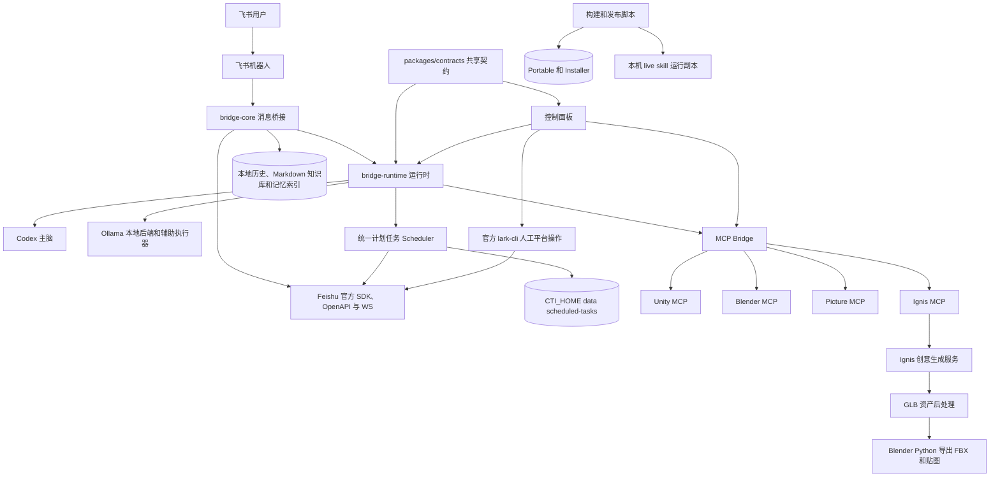

### 1.2 模块边界图

```mermaid
flowchart TD
  Panel[apps/control-panel] --> Runtime[packages/bridge-runtime]
  Panel --> Contracts[packages/contracts]
  Runtime --> Contracts
  Runtime --> Core[packages/bridge-core]
  Runtime --> ProviderLayer[Codex 和本地模型 Provider]
  Runtime --> McpLayer[MCP manifest 和调用层]
  Runtime --> SkillLifecycle[Skill Registry 和 Lifecycle]
  Runtime --> BridgeControl[受控 live Bridge 重启宿主]
  Runtime --> ScheduledEngine[Scheduler、Store、Executors 和运行账本]
  Core --> ScheduledActions[cti-scheduled-task 与 cti-reminder 可信动作]
  Panel --> ScheduledGateway[计划任务 Control API 和 CLI Gateway]
  ScheduledGateway --> ScheduledEngine
  SkillLifecycle --> OfficialSkillTools[官方 skill-creator 和 skill-installer]
  Panel --> SkillLifecycle
  McpLayer --> IgnisPackage[packages/mcp-ignis]
  Core --> FeishuAdapter[Feishu Adapter]
  Core --> BridgeFacade[bridge-manager 编排 Facade]
  BridgeFacade --> ActionBlocks[application/action-blocks 纯动作块解析]
  BridgeFacade --> ReminderParsing[application/reminders 单次提醒解析]
  BridgeFacade --> MentionParsing[application/mentions 提及意图与目标解析]
  BridgeFacade --> StickerPolicy[application/stickers 表情包意图、协议与候选门禁]
  BridgeFacade --> ChoicePrompts[application/choice-prompts 有限选项与受控回调]
  BridgeFacade --> DeliveryPreparation[application/delivery-preparation 结果块与交付候选准备]
  FeishuAdapter --> HistoryIntent[application/history-intent 历史范围与输出意图解析]
  FeishuAdapter --> StickerMediaCache[channels/feishu/media 表情包媒体缓存]
  FeishuAdapter --> IndexedHistorySync[channels/feishu/history 云历史索引同步]
  FeishuAdapter --> IndexedHistoryRetrieval[channels/feishu/history 当前群索引检索]
  FeishuAdapter --> IndexedHistoryPrompt[channels/feishu/history 索引结果 Prompt 构造]
  FeishuAdapter --> LightContextSelection[channels/feishu/history 短接话上下文选择]
  FeishuAdapter --> HistoryAttachmentRecovery[channels/feishu/history 回复附件恢复计划]
  FeishuAdapter --> CardSubsystem[channels/feishu/cards SDK 兼容与流式状态生命周期]
  CardSubsystem --> ChoiceCard[channels/feishu/cards 通用选择卡片]
  FeishuAdapter --> InboundQueueLifecycle[channels/feishu/lifecycle 入站队列生命周期]
  Core --> FeishuCardEvidence[Feishu 卡片 evidence 解析]
  Core --> PermissionBroker[权限和高危操作门禁]
  Core --> ReplyEnvelope[cti-final 结果块收口]
  Config[config/*.d 扩展和运行单元 manifest] --> Runtime
  Extensions[extensions/skills] --> Scripts[scripts/install-suite-skills.ps1]
  Extensions --> ScheduledSkill[飞书计划任务 Skill]
  Scripts --> CodexSkills[本机 Codex skills 和 live skill]
```

### 1.3 机器人分层边界

当前主要混乱点：

- `AGENTS.md`、架构文档、prompt、adapter、manager 和 runtime 都沉淀了行为规则，导致同一类策略可能在多个入口重复或互相覆盖。
- `bridge-manager.ts` 仍同时承担入站编排、权限策略、提醒/提及/表情包的 evidence 与 Host 装配、上下文拼装、结果协议和部分出站收口，文件职责过宽；结构化动作块、单次提醒文本、mention 意图/目标和表情包纯策略已迁出。
- prompt 规则分散在 `conversation-engine`、`codex-provider` 和 `local-agent-tool-protocol`，同一“主动完成 / 不外泄内部协议 / 工具证据”口径需要多处同步。
- 路径职责过去主要靠文档约定，缺少可测试的分类入口，容易把开发版、live skill、运行态数据、临时缓存和发布产物混在一起处理。

目标分层如下：

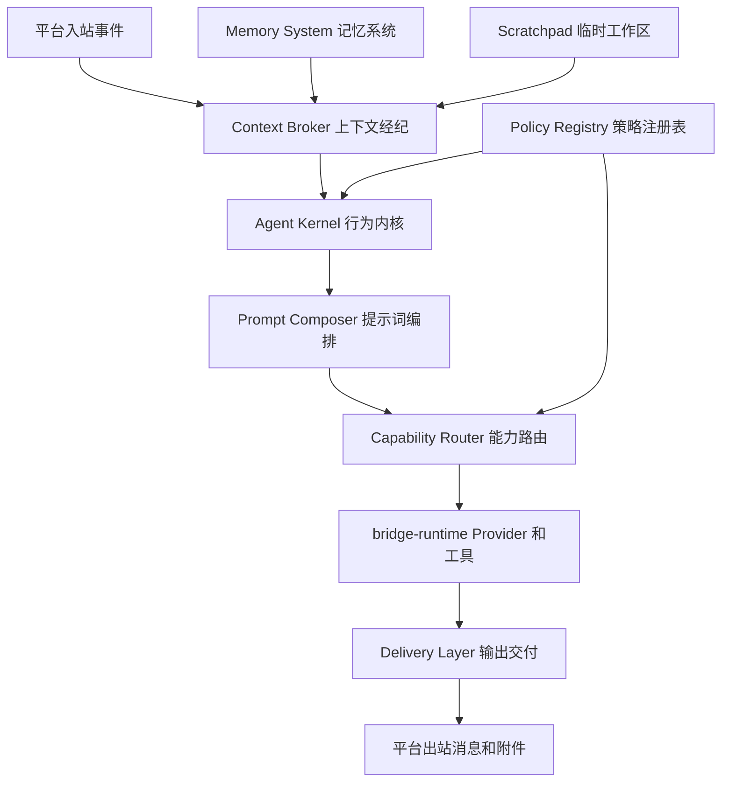

分层职责：

| 层 | 职责 | 不应承担 |
| --- | --- | --- |
| Agent Kernel | 默认执行姿态、身份无关行为、完成语义、结果真实性 | 平台 API、路径持久化、卡片渲染 |
| Policy Registry | 权限、风险、工具证据、低风险提醒和通用门禁 | adapter 事件解析、provider 进程实现 |
| Context Broker | sender/reply/附件/历史/平台身份整理成有界 evidence | 长期记忆存储、最终卡片格式 |
| Capability Router | 判断本轮需要本地读、工具、MCP、artifact 或普通对话 | 具体工具实现、出站发送 |
| Memory System | durable 记忆、历史索引、知识库、表情包语义和提醒索引 | 临时上传缓存、每轮草稿 |
| Scratchpad | 临时上传、候选附件、草稿和待提升产物 | 长期事实、发布产物 |
| Prompt Composer | 按顺序拼接 identity、policy、evidence、style、result protocol | 决策策略本身、工具执行 |
| Delivery Layer | `cti-final`、Markdown/card、附件、chunk、retry、dedup、outbound refs | 上下文检索、能力选择 |

飞书文本呈现由 Delivery Layer 双层收口：`agent-architecture.ts` 的 `delivery_layer.feishu_text_presentation` 只在飞书回合告诉 Provider 按语义选择分区、引用、粗体、斜体、删除线和列表，短聊天保持自然；`markdown/feishu.ts` 在普通卡片与 streaming final card 共用的预处理入口做平台兼容规范化。Card 2.0 文档未声明支持的 `<u>/<ins>` 只在代码块外确定性降级为蓝色强调加粗；`**标签：**正文` 这类紧邻正文的加粗标签会只在代码块外补入必要空格，普通句内加粗和代码围栏保持逐字原样。有限选择由 `delivery_layer.structured_choice_prompt` 约束：只有确实存在 2–8 个具体可理解选项时，Provider 才在 `cti-final.choices` 提交可见 `label/description`；普通选择绑定发起人，多轮选择用 `choice_flow continuous active/complete`。用户明确要求全员参与时，Provider 可额外声明受控 `choice_session vote/claim/parallel`，Bridge 负责当前群成员校验、计票/单赢家/匿名分支、截止时间和回调，模型不能提供 flow ID、`callback_data`、平台身份或动作参数。活动流程漏掉选项与终态时，Conversation Engine 只在原回合做一次禁工具的 response-only 协议修复，不从 Markdown 的编号或字母模式猜造按钮。可选 `cti-final.card_hero` 只选择同一 `images` 中的一张已交付图片；Bridge 验证、上传并签发平台 `image_key`，再由普通卡、流式终态卡和选择卡共用 Card 2.0 横幅组件。嵌入成功后同图不重复发送，上传或卡片发送失败继续走普通图片附件。`delivery_layer.analysis_view` 允许分析、监控、对比、复盘或态势类多指标结果提交只含可见文本的 `cti-final.analysis_view`；`application/analysis-view.ts` 先在受控扫描窗口内过滤无效与同名指标，再收集最多 6 个有效指标，并合并同名分区、去重条目后保留最多 4 个分区。`markdown/feishu.ts` 映射为结论标签、移动端双列指标表和风险/观察/下一步标签分区，当前值与变化信号共用 tone；普通正文中与结构化标题/结论完全相同的非代码展示行被折叠，代码块和独有依据保持原样。该结构不接受 Card JSON、颜色、URL、命令、路径、回调或平台身份，不能为填模板伪造数值；轻聊和单一事实保持普通文本。分析视图和原始正文、头图、有限选择按钮复用同一卡片链，后置证据或权限门禁将结果改为未完成时必须清除旧分析视图，避免保留过期的积极结论。自由输入、权限批准、Owner/高风险确认、密钥和身份解析继续走各自专用门禁。真实发送仍由 adapter 执行，呈现策略不接触凭据、mention 解析或平台重试。

第一阶段已落地 `packages/bridge-core/src/lib/bridge/agent-architecture.ts`：

- 声明八个架构层和 policy 归属，提供 `compileAgentArchitectureRegistry()` 作为编译/校验入口。
- 提供 `classifySuitePath()`，把开发仓库、live skill、记忆仓库、运行态数据、临时上传缓存、文档、规则、日志和发布产物分开。
- `conversation-engine` 的主动完成 prompt 已改为从 `agent_kernel.proactive_completion` policy 读取。
- `bridge-manager` 的 slash 命令最低角色表已迁入 Policy Registry 的 `getSlashCommandRequiredRole()`。
- 权限批准风险、危险执行请求和系统副作用提醒边界已迁入 Policy Registry 的 `getPermissionApprovalRequiredRole()`、`isDangerousUserRequest()` 和 `isSystemAffectingReminderRequest()`，manager 只负责读取 evidence、执行角色门禁和调用提醒/权限链路。
- `packages/bridge-core/src/lib/bridge/adaptive-action-policy.ts` 统一输出 `allow / allow_with_audit / clarify / confirm / deny`，输入只包含动作风险、evidence 强度、平台验证状态、歧义和 `strict / balanced / fluent` 档位。档位只扩大低风险动作的降级范围；伪造 evidence、身份冲突、明确查无目标、跨边界和高风险确认不受档位放宽影响。
- `packages/bridge-core/src/lib/bridge/application/action-blocks.ts` 统一解析 `cti-reminder`、`cti-scheduled-task`、`cti-direct-message`、`cti-bridge-control` 和 `cti-artifact-promote`。该模块只做 fence 清理、JSON/字段归一化和安全字段过滤；`application/direct-message-policy.ts` 统一判断当前原文授权、可靠 outbound-ref 续办授权以及动作目标是否与本轮来源 `chatId` 完全一致，`bridge-manager` 只据此编排当前会话发送或跨会话确认。模型动作块中的用户 ID、角色、工作区和陌生目标字段不成为可信事实；只有目标 ID 与可信来源 `chatId` 精确相等时才可判为当前会话。计划任务的 cron 支持规范对象与显式 `CRON_TZ/TZ` 字符串两种等价输入；裸 cron 字符串因缺少时区继续失败关闭，`agent_turn` 缺省 `sessionMode` 时只允许归一为无工作区的 `isolated`，只有模型明确声明 `bound` 后才进入 Host 的可信工作区重建。`cti-direct-message` 兼容历史命名，但 `targetType=user` 与 `targetType=chat` 分别代表私聊和群投递；“在命名群里发”等明确群目标只进入 chat resolver，不能回落成用户私聊。原生回复本机器人已持久化结果的“现在测试一次 / 继续发送 / 确认”等短动作可继承进入裁决的授权；当前群直接受控发送，真正跨群仍保留 Owner、唯一目标解析和二次确认。Feishu adapter 先查本地绑定，再通过应用身份分页读取机器人真实所在群列表，仅按精确群名或忽略末尾“群/群聊/群组”的安全别名唯一解析；零结果或多结果失败关闭并要求准确群名/chat_id。
- `packages/bridge-core/src/lib/bridge/application/reminders.ts` 统一解析高置信单次提醒、`/remind` 固定参数、时间/任务意图提示和伪完成声明。周期表达继续交给 `cti-scheduled-task`，讨论/教程文本不会被提升为提醒；平台唤醒 alias、原生通知目标、系统副作用门禁、角色和真实 Scheduler/Reminder Host 仍由 Manager 基于当前消息 evidence 装配。
- `packages/bridge-core/src/lib/bridge/application/mentions.ts` 统一处理飞书 mention ID 字段兼容、字符串/name-only 目标提示、唤醒 alias、直接执行/流程叙述/诊断语义区分、多人交互中“明确开始 + 指定首位/回答者 + 每轮原生 mention 交接”的当前动作识别、显示名目标提取以及占位符和非地址化裸 `@` 清理。字符串目标只表达模型选择，不成为可信身份；该模块不查询成员、不接受模型自造 ID，也不执行发送。Manager 在结构化 mention 校验后保留已经通过本轮 evidence 的目标，并仅把仍缺失的用户明确目标交给当前群官方 resolver，避免一个成功 mention 遮住另一个待解析目标；ID 求交集、Owner/广播门禁和最终交付仍留在平台编排边界。
- `packages/bridge-core/src/lib/bridge/application/stickers.ts` 统一处理表情包发送意图、入站/出站 hint 隔离、标注与候选分析协议清理、置信度和具体语义门禁、仅允许本轮真实附件 fileKey 的一次性选择，以及“贴纸是否足以替代冗余伴随文字”的纯裁决。明确请求可把“给你一个 / 已发送”等动作复述折叠为 sticker-only；自主贴纸只有在短社交语境中才能替代文字，不能覆盖任务结果、信息回答或失败说明。图片附件真实性、视觉模型调用、语义 revision 授权与写入、平台投递和真实 messageId 回执仍由 Manager、Sticker Host 与 Feishu adapter 共同完成，纯策略模块不能自行发送或确认语义。
- `packages/bridge-core/src/lib/bridge/application/history-intent.ts` 统一解析群历史总结、回看上方消息、时间范围、数量上限、说话人范围、引用式校对动作和文档输出意图，并允许测试注入当前时间。Feishu adapter 只保留兼容薄包装，云端消息分页、历史增量同步、受控索引检索、附件恢复和 prompt 构造仍留在 adapter/History Host；普通飞书文档权限问题不会被误路由为群历史请求。
- `packages/bridge-core/src/lib/bridge/application/delivery-preparation.ts` 统一解析最后一个 `cti-final`、结构化 assistant 文本包装、reply mode、附件相对路径、结构化 mention、不可信显示名选择提示、reply target、有限 `choices/choice_title`、通用 `choice_flow`、受控 `card_hero`、通用 `analysis_view`、机器协议块剥离和无结果块时的可见文本压缩，并返回纯 delivery candidate 与解析状态。头图路径必须与同一 envelope 的 `images` 某一项逐字一致，URL、`image_key` 和额外路径直接忽略；输入证据策略删掉图片时同步删掉头图意图。`application/analysis-view.ts` 只保留受限长度和数量的可见内容，不接受平台字段、可信动作或路径；空视图会被丢弃。协议定位不依赖 fence 位于行首：前置进度文本、同行或单行 fence 均可识别；裸 JSON 通过字符串转义与花括号深度扫描支持嵌套对象。Manager 继续负责工具输出脱敏、结尾标记、状态文件落盘、真实文件存在性/执行证据校验、平台 mention 安全层和最终发送；字符串选择提示只能进入 resolver 输入，纯模块不能把声明路径或模型身份直接提升为可信事实。
- `packages/bridge-core/src/lib/bridge/application/choice-prompts.ts` 统一清洗 `cti-final.choices/choice_flow/choice_session`、限制 2–8 个去重可见选项、生成随机 callback 与连续 flow ID。未声明群体会话时继续绑定原 channel/chat/user/session；显式 `vote / claim / parallel` 时只把范围扩到原 chat 的可信成员，投票到期统一收口、抢选同步原子单赢家、多人分线按匿名 participant branch 分别续跑。parallel 只在共享入口使用 `chat_members`；成员进入分线后，新卡降为绑定真实点击者的 `single_user`，同时把原 `groupMode` 与匿名 branch key 留在 Bridge 短期状态中继续注入 Provider，平台用户 ID 不作为模型可见分支协议。Runtime Host 使用统一 UTF-8 原子写入在 `CTI_HOME/runtime/choice-prompts.json` 保存未过期 entry、每人选择、绝对截止时间、匿名续办分支、原卡 message ID、待入队 finalization 和 consumed tombstone；Bridge 重启后恢复 timer 与个人分线绑定，已收口结果成功进入 adapter FIFO 后才确认删除，防止重复、丢失或串线。模型提供的 flow ID、callback、命令、URL、平台 ID 和动作字段全部忽略；旧会话、跨群、非成员、代点和过期点击失败关闭。`channels/feishu/cards/choice-card.ts` 是工作目录和 Agent 有限选择共用的 Card 2.0 格式入口，群体模式显示绝对截止时间、参与数与票数，截止只更新原卡一次并移除按钮，终态明确展示唯一赢家、平票或无人参与，不每秒刷卡；投票已持久化但原卡更新失败时只给点击者最小确认，不回滚选票。可信横幅头图在更新时保留。权限、安装、高风险确认等专用卡片不被通用选择替代。
- 全员投票在首次合法点击时由 Adapter 读取官方群真人成员并冻结稳定参与者快照，卡片随后显示“已选 / 应选”进度；只有快照中所有身份都已选择时才会提前原子收口，成员接口失败时不猜人数并继续由绝对截止时间兜底。参与者快照、应参与人数和 `deadline / all_participants_selected` 收口原因与选票一同持久化，因此 Bridge 重启后仍能恢复覆盖判断；点击回调路径复用当前已验证 Adapter 投递聚合续办，后台截止与重启恢复继续从运行态 Adapter Registry 投递。
- `packages/bridge-core/src/lib/bridge/channels/feishu/media/card-image-file.ts` 负责头图上传前的真实文件头、PNG/JPEG/GIF/WebP 尺寸、大小和非符号链接检查；`channels/feishu/cards/card-hero.ts` 是普通卡、选择卡和流式终态卡共用的 Card 2.0 `img` 横幅元素，通栏使用 2.0 支持的负横向 `margin`，不得恢复已废弃的 `size=stretch_without_padding`。Adapter 只上传本地文件并返回真实 `image_key`，Delivery receipt 决定是否从后续普通附件中去重；组合卡被平台拒绝时先精确移除本轮上传的首个头图并重发原正文与按钮，仍失败才降级为富文本 post，去头图成功不产生嵌入回执并保留普通图片附件，因此任何兼容回退都不会吞图或裸露 Markdown。
- `packages/bridge-core/src/lib/bridge/channels/feishu/media/sticker-media-cache.ts` 独占表情包媒体文件的稳定哈希命名、兼容扩展查找、文件头 MIME 嗅探、大小门禁、第一份缓存复用和 `FileAttachment` 恢复。Feishu adapter 仍负责调用平台资源 API、15 分钟失败冷却和 sticker record 状态写入；对同一真实 `messageId/fileKey`，sticker 先尝试 image transport，失败后再尝试 file transport，`application/octet-stream` 返回只有经 PNG/JPEG/GIF/WebP 文件头确认后才作为图片缓存和注入。缓存模块不读取聊天语义、不选择表情包，也不把 media 目录提升为工作区。
- `packages/bridge-core/src/lib/bridge/channels/feishu/stickers/sticker-store-schema.ts` 定义 sticker record、用户解释 evidence、删除 tombstone、历史回填水位和 store v1 的唯一 TypeScript schema，并统一执行 NFKC/长度/数量清洗、乱码语义剔除、置信度截断、视觉媒体 key 一致性降级、旧文本教学迁入 `userAnnotation`、归档字段约束以及 malformed tombstone/backfill 过滤。adapter 仍负责从受控记忆路径读取、按 mtime 尝试备份、写前快照和 Windows 原子替换；schema 模块不访问文件系统、不选择发送候选、不调用 Provider 或 Feishu API。
- `packages/bridge-core/src/lib/bridge/channels/feishu/stickers/sticker-selection-policy.ts` 统一判断 active/deleted、可信 vision/manual 来源、最低视觉置信度、具体语义、中文口语 n-gram、元描述停用词、上下文重合和 `avoidWhen`，并负责同群优先、使用次数/最近使用轮换、精确 file key/别名/通用请求解析、自主贴纸会话冷却及状态库 retention 去重裁剪。明确用户请求由上游标记后可绕过自主冷却；普通轻聊必须同时通过语义和冷却，避免换候选后仍每回合发贴纸。候选 evidence 构造也使用该策略结合当前请求生成 `preferredFileKey`；它只在模型没有可靠候选分析时作为发送兜底，不能退回“当前群最近候选”。策略通过 `nowMs` 和 `hasCachedMedia(fileKey)` 接收运行时证据，因此可确定性测试且不接触文件系统、Store、Provider 或 Feishu API；adapter 只读取当前状态库并注入 chat、请求、时间和缓存 evidence，随后执行真实 sticker 投递。
- `packages/bridge-core/src/lib/bridge/channels/feishu/stickers/sticker-semantic-evolution-policy.ts` 统一解析显式用户解释、按原生 reply 精确绑定 sticker 原消息、在无 reply 时只绑定同群十分钟内的最近未核验 sticker，并以不可变 store 变换维护 `user / vision / manual` 三类语义。用户解释只写 `userAnnotation`，vision 必须绑定同一真实媒体 key，manual 保持最高覆盖优先级；adapter 仅负责读取当前 store、注入时间/缓存 evidence、原子持久化和失败审计。
- `packages/bridge-core/src/lib/bridge/channels/feishu/stickers/sticker-candidate-evidence.ts` 统一候选 evidence 排序、受控 DTO、候选摘要行和视觉检查 prompt。候选 DTO 明确排除 `userAnnotation`，避免用户说法伪装成视觉事实；adapter 继续负责缓存读取、单个候选下载和真实附件注入，Provider 只能分析本轮 `attachedFileKeys` 中的图片。
- `packages/bridge-core/src/lib/bridge/channels/feishu/documents/document-request-policy.ts` 统一飞书文档生成/列表意图、确定性草稿标题、通用标题识别、Markdown 改写 prompt、云资源链接识别与脱敏、OAuth callback 识别、五态 Host 结果裁决、读取阻塞文案、授权卡 reuse 去重和 OAuth 审计输入。链接识别使用 URL 解析并限定 `feishu.cn` / `larksuite.com` 合法主机后缀及 `docx/docs/sheets/base/bitable` 首段资源类型，伪造相似域名不会触发云文档 Host 或 OAuth；`resolved` 若缺少非空证据 Prompt 会失败关闭，同一回合不再重复调用 Host。审计投影只包含 requestId、disposition、当前可信 userId 和 scope，不携带授权 URL、卡片正文、device code 或 token；manager 继续负责真实 Host 调用、sender 绑定、授权恢复、Store 写入、文档创建和最终投递。
- `packages/bridge-core/src/lib/bridge/channels/feishu/documents/document-delivery-policy.ts` 把正文、标题、owner 和当前会话事实转换为创建计划，在平台返回文档后生成唯一记忆记录输入；同一模块还根据配置/本地 meta 生成导览 create/replace 计划与确定性 meta，并统一成功、能力缺失和异常交付文案。创建前纯裁决会拒绝 Provider 错误、意外工具执行、空正文、仅含工具失败诊断或缺少完整 Markdown 结构的内部改写结果。直接“把上一条结果做成飞书文档”固定使用 `response_only`，内部提示即使出现 Unity、截图或失败说明也不能升级为 Manifest/MCP 任务。创建异常中的 token/secret/device code 与 Windows 绝对路径在外发前脱敏。manager 在流式卡定稿前完成真实 adapter create/replace、文档索引与导览同步，再把成功链接或明确失败写入同一终态；不会先定稿 Provider 失败卡后另发文档成功，也不会回落发送原 Provider 正文或附件。
- `packages/bridge-core/src/lib/bridge/channels/feishu/history/indexed-history-sync.ts` 统一编排云历史的增量/全量分页、本地水位停止、成员显示名映射、删除/system/空消息过滤、历史 sticker 采集时序和单次索引 upsert；全量同步即使没有可读消息也写入空完成快照。Feishu adapter 只注入 OpenAPI 分页、成员查询、平台正文解析与 sticker 采集函数，模块本身不持有凭据、不检索索引、不恢复附件，也不构造 Provider prompt。
- `packages/bridge-core/src/lib/bridge/channels/feishu/history/indexed-history-retrieval.ts` 把当前 chat ID 与 `FeishuHistoryIntent` 的查询、数量、时间和说话人范围原样交给受控索引 Host；chat 身份为空或 Host 未提供检索能力时返回空结果，由统一 Prompt 显示真实边界。旧 adapter 内直接读取最近 100 条云消息并重复筛选/构造 Prompt 的旁路已删除，避免绕过索引隔离、当前群范围和说话人约束。
- `packages/bridge-core/src/lib/bridge/channels/feishu/history/indexed-history-prompt.ts` 把受控索引检索结果转换为空结果说明、飞书文档正文约束、指定说话人引用约束或普通总结 prompt，并保留历史中的英文标识、资源名、配置名、ID 与 token 原文。adapter 只负责传入 `FeishuHistoryIntent` 和真实检索结果；该纯模块不读取平台、文件、附件、工作区或 Provider 状态。
- `packages/bridge-core/src/lib/bridge/channels/feishu/history/light-context-selection.ts` 统一选择短接话的 reply/nearby 消息：以当前入站时间剔除未来消息，优先保留原生 reply，按配置决定是否纳入机器人消息，过滤 current/deleted/system/空正文，并为无 reply 的短命令选择带问句和选择语义的 best-effort 上文锚点。adapter 继续注入正文解析和当前 bot 身份判断，并负责成员名、结构化 evidence、资源壳可读性与最终 prompt 呈现。
- `packages/bridge-core/src/lib/bridge/channels/feishu/history/attachment-recovery.ts` 把已解析的被回复历史消息转换为确定性资源下载计划：image/sticker 严格绑定原消息并保持图片语义，file/audio/video/media 保留平台资源类型，post 与 interactive 按原顺序收集图片/文件并按 fileKey 去重；缺少 messageId、缺少资源 key 或不可恢复消息类型时失败关闭。Feishu adapter 继续负责解析平台正文、调用 SDK/HTTP fallback、为 sticker 执行同一 `messageId/fileKey` 的 image→file transport 兼容探测、按文件头确认真实图片、执行大小门禁、记录失败并把真实附件置于当前消息附件之前，纯模块不接触凭据、网络、文件系统或 Provider。
- `packages/bridge-core/src/lib/bridge/channels/feishu/cards/cardkit-compat.ts` 统一探测完整 CardKit v2/v1 SDK 能力面，优先 v2，并封装 card create、stream content、streaming mode 与 final update 的请求结构差异。模块只调用 adapter 注入的 SDK 方法，不持有凭据、chat/message 身份或 active card 状态；真实 IM 卡片消息创建和最终 sticker/reaction 平台动作仍由 adapter 编排。
- `packages/bridge-core/src/lib/bridge/channels/feishu/cards/streaming-card-registry.ts` 统一保存 active card 与创建中 promise，负责重复创建合并、初始状态、单卡删除和 adapter stop 全量清理，并确保 throttle/typewriter 两类 timer 总是成对释放。模块不推进 sequence、不构造可见内容，也不调用 Feishu API 或持久化出站引用。
- `packages/bridge-core/src/lib/bridge/channels/feishu/cards/streaming-card-lifecycle.ts` 统一管理文本更新的即时/尾缘节流、工具状态触发的打字机重启、字符步进、stream sequence、创建中等待、关闭 streaming、工具首次观察/完成时间、最终状态/耗时卡片构造，以及成功或失败后的状态清理。工具相对时间由 Bridge 自身时钟生成，不依赖模型或 Provider 声称；真实 CardKit 调用、表情包/reaction 解析和耐久出站引用通过 adapter 回调注入，因此生命周期模块可用确定性时钟和调度器单测，不持有 SDK Client、凭据或平台存储。
- 用户可见反馈的启动时机通过 `BaseChannelAdapter.getPreferredTurnFeedbackDelayMs()` 由 channel 提供默认提示，Store 的 `bridge_turn_feedback_delay_ms` 与 `CTI_TURN_FEEDBACK_DELAY_MS` 仍可显式覆盖。`scheduleTurnFeedback()` 将 `0ms` 解释为当前调用栈同步执行，非零值才创建可取消 timer。Bridge 先收口确定性命令、权限、危险请求、空消息和真正的本地秒回，随后立即调度 feedback，再执行 session 路由、身份/emoji/sticker Prompt 构造和 adapter/Provider 预检；因此这些本地准备可与 CardKit RTT 并行，同时不会为即时回复机械闪卡。Feishu 因 CardKit 首卡必须串行执行“分配 card_id → 发布回复消息”两次平台请求，默认提示为 `0ms`。adapter 的建卡审计分别记录 allocate、publish 与 total，用于区分本地编排等待和飞书平台 RTT。
- `packages/bridge-core/src/lib/bridge/channels/feishu/mentions/outbound-mention-resolution.ts` 统一处理新版/旧版成员 payload 的 open/user/union ID 选择、明确 `member_id_type` 时优先保留真正可 mention 的 `member_id`、app/bot ID 排除、机器人 sender `app_id/open_id/user_id/union_id` 与当前群官方候选的唯一求交、别名清洗、候选合并、`native_inbound > current_chat > current_sender > history` 证据排序、同级多 ID 歧义保留、related inspection 候选和 text/post 原生 `<at>` 标签构造。adapter 继续负责本轮原生 evidence、当前 sender、历史文件与群成员网络查询，并只把这些真实来源交给纯解析模块；上下文单人 mention 通过 `verifyOutboundMentionIdentity()` 直接按 evidence ID 查询当前群并取得最新显示名，不再把可信 ID 先降级成姓名再反查。成员接口临时失败时，Policy Registry 只允许 `balanced / fluent` 对强平台 evidence 的同群低风险 mention 做 `allow_with_audit`；明确查无成员、身份冲突和歧义仍失败关闭。普通显示名命令仍需当前回合明确授权。bot-to-bot 回合只开放“原生唤醒当前机器人后回艾特同一发送方”的窄口：事件有 app_id 时按 app_id 关联，事件只返回 open/user/union ID 时按原生平台 ID 关联；所有可用证据合并后必须唯一，冲突时失败关闭，不能解析模型写出的其他名字。模块不调用 Feishu API、不读取历史目录，也不信任模型输出的用户 ID。
- `packages/bridge-core/src/lib/bridge/channels/feishu/mentions/inbound-mention-wake.ts` 统一处理事件 `mentions` 中 open/user/union ID 与当前 bot 身份的精确匹配、text/post/card JSON 内结构化 `<at>` 的递归兼容检测、`@_user_N`/`<at>` marker 清理、bot alias 去重排序，以及原生 mention 后的纠错/无须回复裁决和通用 bot name wake 分类。人类在群里只原生 @ 当前 bot 时，该纯策略还会区分“带平台 reply/root 的引用处理”与“无正文/附件的轻聊唤醒”；后者只生成无副作用的等价轻聊输入，最终措辞仍由当前已选 Provider 的受限轻量协调器决定，其他 bot/app 的空 @ 不适用。adapter 只提供运行时设置、已验证 bot ID 和按消息类型解析出的可见正文；模块不读取 Store、不调用 Feishu API，也不允许普通显示名替代群聊原生 @ 门禁。
- `packages/bridge-core/src/lib/bridge/channels/feishu/lifecycle/inbound-queue.ts` 统一管理入站 FIFO、等待消费者、按稳定平台 messageId 删除撤回任务和 open/close 状态。`close()` 失败关闭：清空尚未处理的旧消息、把所有等待消费者解析为 `null`，并拒绝随后到达的迟到事件；adapter 显式注入当前是否运行来决定空队列是否等待未来消息。
- `packages/bridge-core/src/lib/bridge/channels/feishu/lifecycle/p2p-polling.ts` 统一管理 P2P 补捞的立即运行、固定间隔、跨 stop/start 的全局 single-flight、timer 清理、失败收口和停止后旧 idle/failed 状态抑制；同一模块纯函数过滤 deleted/system/self/seen/旧水位消息并按创建时间升序恢复。Feishu adapter 只注入 chat 索引、平台分页、身份/seen 判断、真实消息转换和审计回调；停机发生在 fetch 期间时，返回结果不得再进入消息处理链。真实 WebSocket、SDK 事件注册和平台 Client 清理由 adapter 继续编排。

渐进迁移顺序：

1. 先迁移纯函数规则：角色表、风险分类、prompt 片段、路径分类和结果协议文本。
2. 再拆 Context Broker：Feishu actor context、reply/light context、interactive card evidence、附件和历史片段只在这里生成。`feishu-interactive-card-evidence.ts` 在结构解析阶段把业务正文与卡片状态、耗时、结果徽标、运行摘要等展示元数据分离；入站、light context 与历史索引只消费清洗后的 `visibleText/textParts`，展示元数据仅保留为脱敏诊断，不依赖 Prompt 规则临时忽略，也不影响普通文本中真实的耗时讨论。
3. 再拆 Capability Router：把 `ExecutionRequirement`、action manifest、MCP schema discovery 和本地工具族选择收口到同一层。
4. 再拆 Memory System 与 Scratchpad：长期 sticker/media/knowledge/reminder 与 `.codepilot-uploads`、候选附件、草稿提升保持清晰边界。
5. 最后收薄 `bridge-manager`：只保留编排、锁、审计、状态、调用各层和错误收口。

### 1.4 运行时多 Agent 协作

运行时多 Agent 使用共享常驻 Worker 子进程池，不新增微服务。`Bridge` 仍是唯一平台收发者，`Primary Agent` 仍是唯一任务执行与工具调用者，`Delivery` 仍是唯一投递者；`Coordinator / Context / Memory / Performance` 只返回严格 Schema 的只读 findings 和 Prompt section，不能返回工具动作、发送动作、权限、平台目标或写入声明。轻聊快速路径中的“轻量会话协调器”属于 Provider 路由层，不是本节的协作 Coordinator，也不进入 Specialist Worker 图。

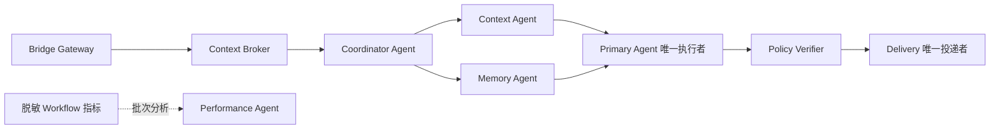

- `config/agents.d/*.json` 是 Agent Manifest 声明来源；`packages/contracts/src/agent-collaboration.ts` 与对应 JSON Schema 是跨进程和跨语言协议来源。首期四类 Agent 的 `sideEffectLevel` 固定为 `none`。
- live 同步把该目录固定复制到 `claude-to-im/config/agents.d`，portable/installer 继续复制完整 `config`；发布指纹将 `agents.d` 与其他 Manifest 目录一起规范化计数和哈希，防止源码、运行版与发布产物出现 Registry 分叉。
- `packages/bridge-runtime/src/agent-workers` 负责 Manifest Registry、UTF-8 NDJSON 校验、受限 Provider、Worker Supervisor、状态存储、协作 Host 和 Memory/Turn Reference adapter。Worker 使用 fresh classifier thread、严格 JSON Schema、禁工具、无工作目录，只接收 evidence ID 和脱敏输入。
- Supervisor 默认启动两个 Worker，可配置为 1–4；单 Worker 同时只执行一个任务。heartbeat、30 秒失联、1/5/30 秒重启退避、五分钟熔断、任务/总回合预算和 Bridge 停止时的进程树清理都由父进程掌控。
- `CollaborationEligibilityPolicy` 让简单聊天和确定性命令保持零 Worker；复杂多源 evidence、低置信引用、明确记忆候选或复合架构任务才进入 Coordinator。Coordinator 最多选择两个当前 Registry 中的 Specialist，父进程重新校验 Agent ID、能力、evidence 和预算。
- 轻量会话协调器只处理已经通过确定性硬门禁的短消息，严格输出 `reply / delegate / clarify`：`reply` 和 `clarify` 只形成无工具的候选正文并继续交给 Delivery，`delegate` 则把未经裁剪的原始回合交给 Primary。确定性门禁以真实文件、路径、附件、MCP、平台动作、读写、同步、重启、查询对象或其他明确执行目标为依据；“检查 / 测试”只在绑定真实任务对象时升级，面向机器人自身响应速度、延迟、在线接话的对话式探测继续交给协调器判断。协调器超时、低置信或 JSON 无效时同样失败关闭到 Primary。
- `off` 是默认模式且不启动 Worker；`shadow` 运行并记录完整图，但不注入 Primary Agent；`assist` 只把父进程校验后的 section 注入 Primary Agent。任一 Worker 或 Specialist 失败都写入失败/fallback 节点并继续原单 Agent 主链，内部异常不直接外发。
- `CTI_HOME/runtime/agent-collaboration.json` 保存面板需要的当前 run、最近 runs、Worker/Agent 统计和 Performance 建议；它是运行态观察数据，不是记忆、工作区或授权事实源。协作状态更新采用 best-effort，不能让文件锁或观察存储异常中断 Primary/Delivery；Bridge Manager 为正常完成、提前返回、异常和取消保留统一终态，并在 `finally` 再次兜底。Runtime 启动时会把上个进程遗留的 `running / pending` run 收口为带稳定 `bridge_restart_recovered` 错误码的 `fallback / skipped`，清除 `currentRun`，不自动重放，也不以恢复时刻计算伪长耗时。状态文件与 Workflow 事实文件共用 `atomic-text-file.ts`：Windows 文件锁先重试，原子替换持续失败时才受控直接覆盖，并在启动时清理同一状态文件产生的过期普通 `.tmp`。Performance 指标只统计带 `endedAt` 的已完成回合，建议输入在调度时冻结，并记录 `evidenceRefs=["metrics:window"]`、`snapshotUpdatedAt` 与 `analyzedThroughRunId`。批次阈值只计算该水位之后新增的已完成回合；重启时从已有建议恢复上次分析时间，避免达到历史总批次数后每轮重复分析同一窗口。
- 控制面板“机器人架构”页直接渲染 Manifest 职责和 Runtime 节点/边快照，使用轻量 SVG、CSS Grid 和始终可读的顺序时间线；会话详情按同一 `workflowRunId` 跳转并定位同一 run。前端不重新推断协作路由，也不展示隐藏推理、原始 Prompt、凭据、绝对路径或未脱敏聊天原文。
- 总览“多 Agent 协作”卡片提供真实快捷启停：Off 点击“开启”固定进入 Shadow，已启用时点击“关闭”回到 Off；机器人架构页提供 `关闭 / Shadow / Assist` 三档显式选择。所有切换都通过受控 Control Command 写配置并重启 Bridge，页面等待 Runtime 回读后再更新状态。

协作运行事实到聊天卡片使用独立的最小状态链，不能复用完整面板快照：

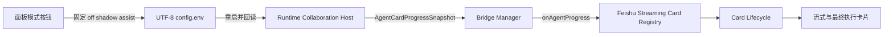

- `AgentCardProgressSnapshot` 只包含 run/mode/status、是否已注入，以及真实启动 Agent 的 ID、显示名、角色、状态、耗时和稳定错误码；不包含 findings、Prompt、evidence、模型参数、平台身份或路径。
- Runtime 在 Coordinator、并行 Specialist、Primary Agent 和 fallback 状态变化时推送快照；Bridge 只转发，Feishu Registry 负责在卡片创建较晚时缓存并恢复最新快照，Lifecycle 与工具轨迹复用同一节流、sequence、finalize 和清理路径。
- Shadow 与未实际注入 Primary 的 Assist 仍完整保留 Runtime/Registry 快照和控制面板观测，但不进入飞书流式或最终卡片。只有专业 Agent 成功且 Primary Agent 已开始消费已验证 section 的 Assist 才会在最终卡片默认折叠的“执行轨迹”中显示“已参与回答”；正常 Primary Agent 节点不重复展示。Performance Agent 是异步批次观察旁路，不伪装成本轮回答者。

### 1.5 Registry 驱动能力治理

Skill 能力治理已按“core 声明策略、runtime 实现生命周期、面板只做受控入口”落地：

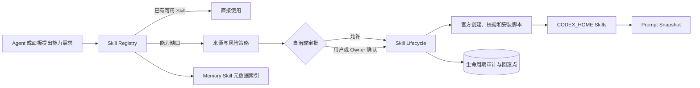

- `packages/bridge-core/src/lib/bridge/agent-architecture.ts` 声明能力缺口判断、来源分类、风险等级和审批动作，不执行下载或写目录。
- `packages/bridge-runtime/src/skill-registry.ts` 扫描正式安装、禁用目录、草稿和 manifest，持久化到 `CTI_HOME\data\skill-registry.json`；首次扫描不搬动或改写已有 `SKILL.md`。控制面板打开或刷新状态时通过 runtime CLI 重新扫描真实 `CODEX_HOME\skills`，因此机器人或官方安装器在面板外完成的安装也会进入当前 Registry，不再依赖关闭面板重开。
- `packages/bridge-runtime/src/skill-lifecycle.ts` 统一创建、验证、审批、安装、启停和回滚；飞书扩展入口与 `skill-lifecycle-cli.mjs` 共用该服务。安装使用 staging、校验、原子替换和 backup，审计写入 `CTI_HOME\data\skill-lifecycle-audit.jsonl`。
- 已安装 Skill 能满足任务时不会查询外部目录；官方精选未安装需用户确认，白名单低风险来源可自动处理，第三方、未知或高风险变更需要 Owner。
- `Prompt Composer` 按稳定顺序生成带来源标签的 section；短期只读 Snapshot 写入 `CTI_HOME\runtime\prompt-snapshots.json`，默认最多 100 条、保留 7 天，并记录脱敏、哈希和截断元数据。
- Memory 只投影 Skill ID、状态、来源类别、风险和真实路径，不读取或复制 `SKILL.md` 正文。
- live Bridge 重启通过 `cti-bridge-control` 受控动作进入 core：只接受当前用户明确提出的 `restart_live`，强制 Owner 门禁，拒绝模型伪完成。runtime 的 `BridgeControlHost` 只启动仓库自带的延迟 worker；worker 等当前回复收尾后调用既有 `daemon.ps1/daemon.sh restart`，不接受任意命令或参数，并把调度结果写入 `CTI_HOME\data\bridge-control-audit.jsonl`。Windows `daemon.ps1 restart` 在停止 Supervisor 前统一执行 Workflow drain；控制面板的手动、配置应用和模型更新重启也复用同一入口。启动/重启会产生需要脱离命令包装器继续存活的托管进程组；Supervisor 在验证 PID、状态和进程存活后写入当前命令专属回执和受控 readiness marker，daemon 据此立即结束仍被后台句柄拖住的短命包装器，且不把回执环境传给长驻进程。控制面板对 start/restart 使用临时 UTF-8 文件承接命令输出，宿主进程不再创建会被长驻后代继承的匿名输出管道。只有进程管理器、Bridge 新 PID、同一 run 的运行审计、近期心跳和已启用且具备审计能力的回调通道全部恢复后，面板才返回成功，避免等待固定 90 秒或在飞书长连接尚未可接收卡片回调时提前报完成。

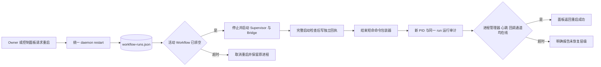

路径职责表：

| 类型 | 当前入口 | 规则 |
| --- | --- | --- |
| 开发仓库 / 隔离 worktree | `C:\Users\admin\Documents\New project\codex-im-suite` 与其 `.worktrees/*` | 主仓库是源码主线；隔离任务可在 linked worktree 修改。控制面板通过 `SuiteTargetResolver` 优先识别显式根、当前目录和运行程序集祖先，禁止默认主仓库抢占当前 worktree。 |
| live skill | `C:\Users\admin\.codex\skills\claude-to-im*` | 运行副本，只由同步脚本写入。 |
| Agent Home / 记忆仓库 | `E:\cli-md` 或配置的 memory repo | 根目录集中放身份、规则、工具、说明和总索引；真实事实写入 `memory/*` 分区，不能作为普通工作区挂载。 |
| 运行态数据 | `C:\Users\admin\.claude-to-im\data` / `runtime` | 存 sessions、bindings、workflow、permission links 等服务状态。 |
| 临时上传缓存 | `CTI_HOME\runtime\uploads\<sessionId>\<turnId>` 或 `CTI_UPLOAD_CACHE_DIR` 下的同级结构；旧 `.codepilot-uploads` 只作为遗留输入识别 | 由 runtime `TurnStorageHost` 统一暂存并生成带 SHA-256 的 `输入附件清单.json/.md`；两份文件同事务更新。Provider 不再创建 `uploads/history`、`mavis-input` 或 `runtime/ignis-attachment-*` 平铺文件。 |
| 回合产物与 Scratch | `CTI_HOME\runtime\artifacts\<sessionId>\<turnId>`、`CTI_HOME\runtime\workspaces\<sessionId>\<turnId>` | runtime 为本轮统一解析路径，生成 `回合元数据.json/.md`、`产物清单.json/.md` 和 `提升记录.jsonl/.md`；机器文件是唯一事实源，Markdown 是同事务确定性投影。它们不是项目工作区，也不能自动提升到项目。 |
| 文档 | `README.md`、`docs/PROJECT-ARCHITECTURE.md`、`docs/DEVELOPMENT-LOG.md` | 只写当前事实、入口、风险和阶段记录。 |
| 规则 | `AGENTS.md`、`config/*.d`、`agent-architecture.ts` | 存可维护规则、manifest、policy 归属和分类口径。 |
| 日志 | `.claude-to-im\logs`、runtime audit | 只读核验证据，不提交、不手工改写。 |
| 发布产物 | `release/*` | 脚本生成，不作为源码手修入口。 |

### 1.6 回合工作区与可见记忆

`packages/contracts/src/project-registry.ts` 定义结构化项目协议，`packages/bridge-runtime/src/projects/project-registry.ts` 从 `CTI_HOME\project-registry.json` 或 `CTI_PROJECT_REGISTRY_PATH` 加载并校验记录，再由 Config 注入 Bridge settings。`packages/bridge-core/src/lib/bridge/workspace-plan.ts` 是每轮工作区解析的唯一入口；Conversation Engine 根据当前消息、会话绑定目录、结构化项目、legacy 允许根和禁止根生成 `TurnWorkspacePlan`，所有 Provider 和本地文件工具消费同一计划。`workspace-chat-policy.ts` 只解析明确的工作区/工作目录/工作路径查看、选择或切换表达和稳定项目目标；裸“工作目录”仍作为 Agent 的真实当前目录查询，不进入管理快捷入口。`bridge-manager.ts` 为真实 Owner 通过通用选择卡片生成 Feishu Card 2.0 项目按钮，按钮只携带稳定项目 ID，点击回调再次核验真实 Owner、启用状态与本地目录存在性后，才允许更新当前聊天绑定。

控制面板的 `projectRegistry` 字段只读取同一个结构化 Registry 文件并报告路径、存在性、项目列表或解析错误，供人工核对；它不导入 legacy roots、不改写文件，也不参与回合挂载裁决。真正的 legacy 合并、禁止根和重叠优先级仍只由 Runtime Registry Loader 执行。

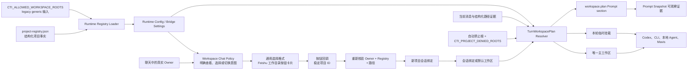

- 结构化项目记录包含稳定 `id`、显示名、类型、`workspaceRoot`、`accessMode`、可选 `unityProjectRoot / mcpProfileIds` 和启用状态；无效 JSON、重复 ID/根、越界 Unity 根或命中禁止根时启动失败关闭。
- `CTI_ALLOWED_WORKSPACE_ROOTS` 只兼容导入为 `generic` 项目；与结构化项目重叠时结构化记录优先，宽泛 legacy 父目录不能重新取得挂载资格。注册项目和 legacy 允许根都不能自动进入 Prompt、`additionalDirectories` 或普通文件工具根。
- Unity 项目命中 `unityProjectRoot` 或其内部路径时，挂载目标仍是 `workspaceRoot`。读取回合一律生成 `read_only` mount；写入回合只有项目 `accessMode=read_write` 才能继续，显式写只读项目返回 `project_read_only`。
- 当前会话工作区始终优先作为唯一主工作区；本轮明确引用的其他已注册项目只成为临时挂载，不得抢占或替换当前工作区。当前绑定目录若命中禁止根或超出项目注册上界，会跳过并选择安全默认根；所有候选都不安全时失败关闭。
- 聊天中的持久工作区管理是独立确定性入口：只有真实 Owner 可查看启用注册项目或按按钮、编号、稳定项目 ID、完整名称、唯一名称片段切换。飞书管理意图优先返回 Card 2.0 按钮卡片，当前项目与读写模式在卡片中可观察；回调不信任旧卡片上下文，必须用本轮真实点击者身份和当前 Registry 重新解析。模型输出路径、伪造回调、未注册绝对路径、禁用项目和不可访问目录都不能改变绑定。切换前中断旧会话仍在执行的任务，并创建新的 CodePilot/SDK 会话，避免跨项目历史和工具状态污染。现有 `/projects` 继续兼容 Operator 查询，但自然语言和卡片持久切换保持 Owner 门禁。
- `temporaryMounts` 带访问模式、证据 ID、理由和 `expiresAfterTurn=true`；回合结束后不形成长期挂载。
- 记忆仓库、`CTI_HOME` 运行态、上传缓存、日志和 `release/*` 按各自受控能力访问，不能提升为普通项目工作区。
- classifier 继续无工作目录、无 MCP、无附加根，避免条件解析 Agent 扩权。
- `packages/bridge-runtime/src/turn-storage.ts` 是临时输入、回合产物目录和会话 Scratch 的 runtime 所有者。Conversation Engine 每轮生成稳定 `turnId`，先通过 `TurnStorageHost.stageInputFiles()` 把非耐久附件归一化到 session/turn 目录，再把相同 `filePath`、`artifactDirectory` 和 `scratchDirectory` 传给 Codex、Mavis、Ignis 等 Provider；记忆仓库中的耐久媒体只读复用原路径。
- `packages/bridge-runtime/src/artifact-encoding-inspector.ts` 实现 `ArtifactEncodingInspectorHost`，在附件最终交付前只读检查白名单文本和 ZIP 内文本条目。它使用严格 UTF-8 解码，拦截 `U+FFFD`、连续三个以上 ASCII 问号、ZIP 路径穿越、条目数、单文本和总解压大小超限；ZIP 使用 lazy entry 流式读取，不落盘解压，二进制条目不按文本误判。
- `packages/contracts/src/artifact.ts` 定义稳定产物记录和提升请求；`packages/bridge-runtime/src/artifacts/artifact-store.ts` 负责复制外部生成物、计算 SHA-256、生成稳定 `artifactId`、维护清单和提升审计。工具结果登记成功后，Conversation Engine 把受信 `managedArtifacts` 放在工具历史前部，并覆盖模型伪造的同名字段，便于后续回合使用真实 ID。
- Mavis 的回合 Prompt 显式携带 `artifactDirectory`，要求普通生成物默认写入 Artifact Store；只有当前请求明确要求修改项目源码/资产时才写项目。Ignis 下载、结果重发和 GLB 后处理均使用当前回合 Artifact 目录，不再写平铺 `runtime/ignis-assets` 或 `runtime/asset-pipeline`，并把真实输出登记为 Provider 产物。
- `cti-artifact-promote` 是 Artifact Store 写入项目的唯一 Bridge 动作。它只接受 `artifactId / targetProjectId / targetRelativePath / expectedSha256`，Bridge 重新核对当前消息的明确写入意图与 Owner 身份，Runtime 再核对 Registry、`read_write`、禁止根、相对路径、符号链接、目标不存在和 Hash。动作成功后才增加真实 bridge action evidence。
- 尚未接入 Host 的旧宿主只允许使用 core 内的兼容回退，且同样必须按 session/turn 分层；正式 daemon 不走该回退。旧工作区 `.codepilot-uploads` 或任意外部可读文件只能被复制进受控上传目录，不能继续作为 Provider 的默认输入缓存。
- `packages/bridge-runtime/src/cleanup-plan.ts` 与 `cleanup-cli.ts` 提供工作区污染治理：默认 dry-run，逐文件记录绝对/相对路径、大小、修改时间、SHA-256、Git 状态和分类，并生成 UTF-8 中文 JSON/Markdown 清单。Apply 前通过无 CLI 自启动副作用的 `process-stop-guard.ts` 检查 Bridge 与记忆 watcher，且只允许 `legacy_upload_cache / runtime_upload_cache / test_fixture`；执行时把完整目录移动到 `CTI_HOME\backups\workspace-cleanup\<timestamp>\payload`，不做永久删除。Restore 必须读取同一 manifest、确认原路径不存在并重新校验 Hash；Unity `Assets`、源码、显式产物和未知目录失败关闭。迁移类 CLI 复用同一门禁模块，禁止互相导入可执行 CLI 入口，避免单文件 bundle 同时启动多个命令。

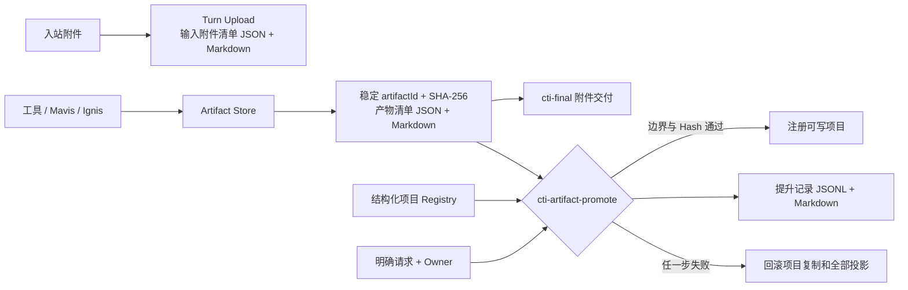

记忆根目录采用 Agent Home + 分区事实源：

```text
<memory-root>/
├─ 机器人身份.md
├─ 行为与安全规则.md
├─ 工具与环境.md
├─ 记忆总索引.md
├─ 记忆库说明.md
├─ daily-reflection/每日反思-YYYY-MM-DD.md
├─ work/<workspaceId>/工作档案.md
├─ corrections/纠错记录-YYYY-MM-DD.md
├─ memory/
│  ├─ users/<channel>/<userId>/用户印象.md
│  ├─ groups/<channel>/<chatId>/群聊记忆.md
│  └─ long-term/公共长期记忆.md
├─ archive/memory-items/
│  ├─ <scope>/<archiveId>.json
│  └─ 记忆归档索引.md
├─ backups/memory-candidate-migration/<timestamp>/
├─ .cti-memory-items/
│  ├─ migrations/<planHash>.json
│  └─ write.lock
├─ .cti-self-history/
│  ├─ versions/<timestamp>/*.md
│  ├─ transactions/<transactionId>/manifest.json
│  ├─ transactions/<transactionId>/before/*
│  ├─ rules/<target>/<key>.json
│  ├─ metrics.json
│  ├─ write.lock
│  ├─ 自维护审计.jsonl
│  └─ status.json
├─ archive/self-maintenance/
│  ├─ versions/
│  ├─ audit/
│  ├─ daily-reflection/
│  └─ corrections/
└─ .cti-index/
   ├─ knowledge.json
   ├─ memory-graph.json
   └─ status.json
```

记忆生命周期以 hidden managed state 为唯一事实源，人类 Markdown 和知识索引都是确定性投影：

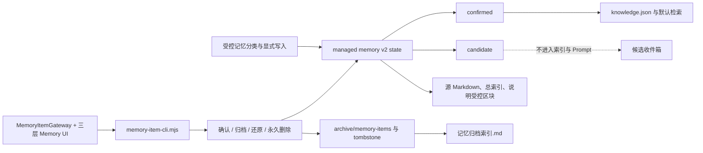

- `codex-im-suite/memory/v3` 是新写入 schema；同一用户的已确认事实和稳定印象合并在单个 `用户印象.md`，不同用户和群聊保持目录与元数据双重隔离。
- managed document 的 hidden state 区分 `confirmed` 与 `candidate`。普通 conversation profile 只属于当前 session 运行态；命令、问题、链接、mention、工具文本和历史重扫不能自动提升为长期候选。候选只在受控 classifier 授权并通过失败关闭预筛后写入，主知识索引、关系图和默认 Prompt 只消费 confirmed/兼容 legacy。
- `human-readable-projections.ts` 从同一 managed state 生成源 Markdown、`记忆总索引.md`、`记忆库说明.md` 受控区块和 `archive/memory-items/记忆归档索引.md`。`human-readable-markdown.ts` 提供共享的稳定区块合并原语，记忆生命周期、表情包语义和 Agent Home 自维护只替换各自区块；旧版整篇生成的总索引会迁移为 `cti-memory-index` 区块，并保留其他机器区块和用户内容。生命周期 mutation 会先保存 before-image；任一人类文档写入失败时回滚机器 state、归档记录、索引和全部 Markdown，避免人类文档滞后或形成第二事实源。
- `human-document-governance.ts` 每轮从真实 Agent Home 扫描五个固定入口、根目录额外 Markdown、`docs/**/*.md` 和 `archive/human-documents/**/*.md`，并确定性刷新 `记忆库说明.md` 的文档治理区块；内容未变化时不重写文件。未归类文档只展示真实相对路径，不读取正文进入 Prompt 或索引。归档使用通用相对路径、SHA-256 清单和事务回滚，固定五入口禁止归档，还原时校验 Hash 与目标冲突。
- `memory-item-cli.mjs` 是生命周期和旧 tentative 迁移的正式命令边界；控制面板 `MemoryItemGateway` 只传 opaque `itemId/archiveId`、`expectedBaseHash` 与审核后的候选 ID 数组，不接受源路径或归档路径。Memory 页直接展示“已确认 / 候选收件箱 / 已归档”，永久删除仅对已归档项开放并写 tombstone。
- tentative 迁移默认 preview，manifest 固定 source hash；Apply 复用 Bridge/watcher 停止门禁、逐源备份、成功 ledger 和 source hash 冲突保护。Apply 后 Bridge 必须保持停止，先同步支持 managed memory v2 的 live runtime，再允许启动，避免旧 v1 writer 把 `candidates` 当成空 `tentative` 覆盖。只有同一 plan hash 的有效 ledger 才可视为幂等重复执行，任意未审核的 v2 改写仍拒绝；事故恢复只能按 ledger 备份与当前 baseHash 合并缺失项，不能整文件覆盖。
- 每个可处理纯文本回合先经过独立记忆意图 classifier。成功写入、临时会话记忆、范围澄清或明确记忆请求的分类阻塞都会形成 `memoryIntentHandled`，Capability Router 随后不再把正文中的 Unity 场景名、路径或 Prefab 词解释成新的工具任务。旧 `CTI_MEMORY_INTENT_TIMEOUT_MS=4000` 会提升到 30000ms 下限；分类器使用通用兼容的 `low` 推理档位，不再向只支持 `low/medium/high/xhigh` 的模型发送 `minimal`。记忆候选的 structured-output schema 明确声明 `key/value/text/confidence`、全字段 required 和 `additionalProperties:false`，兼容当前严格 JSON Schema 校验。明确记忆请求若仍超时，进入无工具、只读、无工作区的 `response_only` 主模型回合并确定性收口为未保存，不允许回退旧目录。bridge Codex Home 默认保留健康的 `state_*.sqlite`，避免主客户端与分类器反复删除状态库、同时回填 sessions 并形成 backfill 锁；只有诊断确认状态库不兼容时才通过 `CTI_CODEX_RESET_STATE=true` 显式执行一次重置。
- bridge 专用 Codex Home 对个人 skill 使用生成态过滤目录：默认排除 `github-memory-protocol`，保留其他正常 skill，额外禁用项由 `CTI_CODEX_BLOCKED_SKILLS` 配置；全局 `C:\Users\admin\.codex\skills` 不被修改。这样 IM 记忆只能由 runtime 的受控 memory v3 host 写入，旧 `.codex\memory` 不再成为可触发入口。
- `机器人身份.md`、`行为与安全规则.md`、`工具与环境.md` 由 runtime 的 `AgentHomeHost` 每轮重新读取，分别进入 identity、policy、skills Prompt section；自维护 mutation 和核心版本回滚同时生成 `cti-agent-home-index`、`cti-agent-home-status` 人类投影，并与事实写入、版本备份和审计共用 before-image 事务，投影失败即回滚。完整 Primary 保留这些独立 section；受限轻聊 profile 提取 actor context 时把随后出现的任意 Markdown 标题视为硬边界，避免 Agent Home 正文因中文标题未命中英文 section 边界而泄漏进轻聊 Prompt。当前稳定 workspaceId 对应的 `work/<workspaceId>/工作档案.md` 以独立、限长、不可执行的只读事实 memory section 回读，超预算时保留头部与最新尾部，其他项目档案、每日反思和纠错日志不进入 Prompt。Git 项目优先用规范化 origin remote 形成稳定 ID，项目移动、改名、从子目录进入或同 remote 副本共用档案；旧路径 ID 目录只提升到稳定 ID，不复制第二事实源。Prompt Snapshot 可观察实际注入、真实来源与截断。
- `SelfMaintenanceHost` 是独立 classifier + 存储边界：纠错阶段先经过候选门禁，普通继续、确认和感谢不调用 classifier；候选纠错在主 Agent 前裁决，使通过门禁的修改可在同一回合后续 Prompt 生效。结果阶段在真实回复交付后依据 runtime evidence 更新工作档案、反思和已有规则效果。classifier 无工具、无工作目录，只输出 JSON。
- 核心文档修改必须确认是 Agent 自身错误，并提供 `correction` 双片段证据：错误片段逐字存在于真实 `assistant_output`，纠正片段逐字存在于当前 `human_message` 或 `success=false` 的 `runtime_result`；两个 ID 必须同时列入本轮 evidenceIds。引用文本、历史内容、普通自改命令、低置信结果和含密钥内容均拒绝。Owner/Operator、密钥、平台权限、工具证据和高危动作门禁仍由代码强制，Markdown 不可取消。
- 所有自维护写入由 `.cti-self-history/write.lock` 串行化，锁被占用时失败关闭且不阻塞主回复；超过超时阈值后仍会先检查持锁 PID，存活进程的锁不得删除。Provider 前的 correction 自维护保持同步，因为它可能改变本轮行为文档；最终投递后的 outcome 自维护以独立旁路任务启动，不继承本轮 task abort signal，也不占用消息 FIFO、session lock 或回复完成时刻，Host 自身继续负责超时、写锁、事务恢复和停机失败关闭。核心 mutation 必须携带 classifier 读取时的 `baseHash`，且只允许稳定 key 的受控 patch 更新 `Agent 自维护规则` 块，禁止整篇 replace 用户主体。多文件提交在首次事实源写入前持久化 `cti-self-maintenance-transaction/v1` manifest 和 before-image，后续写失败立即回滚；进程崩溃留下的 `committing` 事务在下次获取锁后恢复。核心改写前保存受控版本，审计只保存纠错类型、evidence ID 与片段哈希；回滚只能从受控 versions 目录恢复，恢复前再保存当前版本。工作档案使用 `cti-work-profile:v2` 与稳定 key upsert 当前有效状态，不把其他项目内容写入当前档案。
- 每条受控核心规则以 `target/key` 保存 `cti-self-maintenance-rule-state/v1`：首次真实纠错为 `trial`，同内容获得不同 session 的再次支持后为 `confirmed`，真实失败 runtime evidence 可标记 `regressed`；同一 evidence 和同一 session 不重复计数，内容变化会保留旧版本摘要并重新试用。`regressed` 只记录回归状态并保留受控回滚入口，不自动回滚。`.cti-self-history/metrics.json` 聚合 classifier 调用/跳过、结果、耗时和锁/哈希冲突，不保存原始 reason；活跃窗口外的版本、审计、反思和纠错记录移动到 `archive/self-maintenance`，不直接删除用户资料。

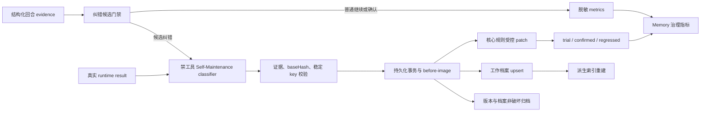

- `记忆总索引.md` 只保存真实文件链接、confirmed/candidate/archive/兼容项计数和更新时间，不复制事实，不成为第二事实源。
- `data/memory/v2` 在兼容期只读索引并标记为 legacy。`memory-layout-migration-cli` 默认 dry-run；Apply 会先在暂存根合并和校验，再备份、切换、归档旧 v2 并重建索引，已有不同值只记录冲突、不覆盖。
- 控制面板路径设置分为当前工作区、项目注册根、Agent Home/记忆库和高级诊断；旧 `CTI_CODEX_ADDITIONAL_DIRECTORIES` 只读显示。Memory 页展示五个 Agent Home 入口、v3/v2 来源数、迁移状态、根目录与 `docs/` 树下的未归类 Markdown，以及工作档案/每日反思/纠错档案/可回滚版本计数和最近自维护时间；同时展示自维护 classifier 调用/跳过、平均耗时、规则 `trial/confirmed/regressed` 数量、锁/哈希冲突和三层记忆生命周期。未归类文件只提示并提供打开入口，不自动索引、移动或删除；`archive/human-documents` 不回退为当前说明。Prompt 页将 `workspace.plan` 和 Agent Home sections 显示为本轮实际注入证据。

## 2. 运行链路

### 2.1 Feishu 入站
- 对无附件但明显引用上文媒体的 Feishu 跟进消息，bridge-manager 会从同一 session 的本地消息历史解析 `<!--files:...-->` 附件记录，读取最近可用图片并作为当前 turn 的 provider attachment 注入，同时在 system prompt 标记为 recent conversation media；这属于通用上下文回捞层，不依赖具体题目、群名或固定话术。

Feishu 接收现在是双通道：

- WS 长连是主链路。
- p2p 私聊有历史轮询补捞兜底，避免私聊事件偶发漏掉。
- Feishu 平台接入按三层分工：FeishuAdapter 通过官方 Node SDK / OpenAPI 承担 bot 长连接实时入站、自动回复、卡片、历史 evidence、权限、索引、表情包和 Agent 主链；bridge-runtime 的 OAuth host 跟随飞书官方授权页、PKCE 与 Token 协议，并由自定义治理层维护身份裁决、最小权限、每用户加密隔离、授权卡去重、任务恢复和审计；官方 `lark-cli` 承担配置、身份、doctor/whoami、scope/schema、Agent 的官方飞书 Skill 调用与控制面板发起的人工平台操作。控制面板只负责白名单编排和展示，不维护重复的 OAuth 或 OpenAPI 主链。
- 官方 `lark-cli` 不启动 `event consume`，也不接管 WS、私聊补捞、原生 @ 判断、callback 或自动消息发送，避免与 live Bridge 竞争同一事件。普通消息、原生 @、reply、reaction、sticker 和机器人卡片始终使用 bot 长连接，不触发 user OAuth；P2P 私聊补捞仍由 FeishuAdapter 负责。Agent 通过官方 `lark-*` Skill 读取待办、日历等用户私有资源时，如果真实执行 `lark-cli auth login --scope ... --no-wait --json` 并返回官方 device challenge，Conversation Engine 才生成结构化 `cti-feishu-cli-user-auth/v1` evidence；模型正文、普通 shell JSON、失败结果、非官方 URL 或缺少非阻塞参数都不能触发授权。
- `lark-cli` 用户身份属于本机共享登录态，因此只允许 Feishu Owner 发起授权。bridge-core 会拦截模型的二维码文案和 `cti-final.images`，把原进度卡按红色“未完成”收口，再让 bridge-runtime 发送 Card 2.0 `open_url` 授权卡；同一 Owner 与规范化 scope 只启动一个后台 `--device-code` 登录，重复任务合并，成功后自动逐个恢复原请求。授权卡不需要 `card.action.trigger`，也不要求新增网页应用能力；发送失败时只降级为官方 HTTPS 授权链接，不生成二维码。审计只记录 requestId、裁决和 scope，不保存 device code、授权 URL 或 token。
- 群成员身份、部门、职位与激活状态属于 Adapter 原生平台 evidence，但查询范围由 `member-profile-policy.ts` 的显式请求字段计划决定：请求解析覆盖“查/查看/列出”等动作表达、“是什么/有哪些/分别属于/各自在什么部门”等内容问句，以及长度受限、明确指向当前群成员和资料字段的短名词式低风险读取；不能因省略命令式动词跳过 Adapter evidence，也不能把教程、权限元问题或不明确对象误判为取证。`prepareForAgent` 先通过群成员接口取得本群用户与机器人记录；若只要求“身份 / 用户还是机器人”，群成员桶已经是可信证据，禁止调用 Contact v3、展示部门/职位/状态或生成字段权限建议。只有明确要求职位、激活状态或部门时，才用当前应用 `tenant_access_token` 查询对应 Contact 字段；机器人只作为机器人类型 evidence，不查询员工通讯录字段，也不转到 `lark-cli` 或 user OAuth。已请求用户字段必须按响应属性是否存在区分未授权与真实空值，激活状态优先读取官方嵌套 `user.status.is_activated`，仅保留旧顶层字段作为兼容回退；仅部门请求才读取部门 ID 和部门名称，部门接口失败返回结构化权限/平台原因，并继续处理其余已明确成员。策略在本轮明确字段的局部结果上统一选取唯一下一项：职位/状态使用 `contact:user.employee:readonly`，部门 ID 使用 `contact:user.department:readonly`，部门名称使用 `contact:department.base:readonly`；未请求字段即使未出现在响应中也不得触发权限。Contact 返回的多个 missing scope 只作为兼容 alternatives 保留。应用 scope、通讯录数据范围和版本发布属于管理员边界，用户确认前只说明唯一阻塞，不自动打开、申请或声称已通过。
- 群成员头像 evidence 也先生成目标计划：明确“群成员/大家”覆盖用户与机器人，明确用户或机器人只读取对应类型；“某成员头像”等无动作动词的短名词式读取可直接进入该计划，群聊中的“你们/各自/自己的头像”等当前机器人集合自指归为机器人目标，不能扩张成全群真人头像查询。“我/我的头像”属于 `current_sender` 结构化目标，Adapter 使用入站 `sender.open_id/user_id/union_id` 与当前群 roster 唯一求交后只读取该用户，禁止把“看到我”等句子片段截成显示名；“现在你能看到头像了吗”等能力/状态问句不进入头像 evidence。其他当前群具名成员请求可从自然语言提取一个或多个显示名，但显示名只是不可信查找提示；Adapter 先用官方群成员列表按规范化显示名精确复核，精确失败后只允许唯一的包含关系候选继续，找不到、同名或多个相关候选返回 `avatar_target_not_found / avatar_target_ambiguous`，不得查询无关成员、跨群猜测模型 ID 或申请权限。当前机器人通过启动时 Bot v3 信息与头像缓存取图，只有其他机器人且确实被请求时才进入 Application v6；因此当前机器人头像缺失不得反推 `admin:app.info:readonly`。成员 evidence 的 token、roster、Contact、Department 与 Application 官方请求共用有界重试：网络异常、408/425/429 和 5xx 最多续试一次，403、身份冲突、通讯录数据范围和确定性 4xx 直接保留 blocker；头像下载按官方尺寸 URL 候选顺序尝试，单个尺寸失败不阻断后续尺寸或其他目标。
- 用户 OAuth challenge 只接受单个精确 `--scope`，且必须来自本轮真实 `lark-cli auth login --scope ... --no-wait --json` 工具对；`--recommend`、任何 `--domain` 和多 scope 在 Core 与 Runtime 两层失败关闭。若同轮真实 bot 错误已证明该 scope 是应用权限，Conversation Engine 会将其归类为管理员处理而不是投递用户 OAuth 卡。
- Feishu 开放平台权限、事件和回调是外部前置条件，不是 bridge 能自动开通的运行时能力。消息接收依赖已发布生效的 `im.message.receive_v1` 长连接事件；权限按钮、提醒完成按钮和卡片交互依赖已发布生效的 `card.action.trigger` 回调；Markdown/streaming card、消息更新、资源下载、成员/机器人解析和云文档读取分别依赖对应 IM、CardKit、Drive、Docx、Sheets、Base 或成员 API scope。后台新增 scope、事件、回调或机器人能力后，必须创建版本、管理员审核发布，并重启 bridge 读取新配置。
- `bridge-manager` 会在进入执行链前做持久入站去重：同一 channel/chat/messageId 只允许执行一次；带附件的媒体说明文字还会写入短期文本指纹，避免 Feishu p2p 历史补捞把同一张图的 caption 当成另一个 messageId 再跑一轮 Codex。
- 群聊 `require_mention=true` 时，adapter 主入口只接受原生 @ 当前 bot 的事件：先按 `message.mentions` 中的 `open_id/user_id/union_id` 与当前 bot 身份精确匹配；飞书长连缺失 `mentions` 时，仅允许正文内 `<at ...>` / post `tag=at` 所携带的同一身份 ID 作为兼容的原生结构化 @ 证据。纯文本别名、机器人 displayName、`bridge_feishu_bot_name`、`bridge_feishu_app_name`、`bridge_feishu_bot_aliases`、`CTI_FEISHU_BOT_ALIASES`、普通文本回复/引用链及其他 bot/app 的 sender 都不能唤醒。用户在飞书话题或原生回复中只发送原生 @ 当前 bot 时，如果本轮同时带有平台 `parent_id/upper_message_id/root_id`，adapter 会生成受控的隐式处理请求，保留 `feishuReplyTo`，并以 `feishuImplicitReplyMention` 记录 reply/thread evidence，让 Context Broker 把被回复消息或话题根消息作为主要上下文；没有 reply/root 的人类普通空 @ 则写入 `feishuPureMentionWake` 并归一化为低风险轻聊输入，进入当前已选 Provider 的受限轻量协调器，不调用工具或直接写死回复。其他 bot/app 的空 @ 仍保持静默并继续服从 bot-to-bot 门禁。另一个受控例外是用户用飞书原生 reply/引用当前 bot 已发送消息补发 `sticker` 或 `image`：adapter 必须先通过 `outbound-refs` 证明目标是本地已记录的当前 bot 出站消息；本地无记录时才回查飞书消息，并要求 sender ID 精确命中当前 bot 已知身份或配置的当前 App ID，不能仅凭 `sender_type=app/bot` 放行。验证通过后才把这类媒体消息作为当前回合交互放行，并在 `raw.feishuReplyWake` 记录唤醒证据。原生 @ 仍会继续过滤真正的纠错、转述和“不要回复/先别处理”等无需响应内容，但否定词与回复/处理动作必须位于同一自然语句或 Markdown 规则项，不能跨换行、标题、列表、表格或标点拼接；“当别人回复你时……”中的“别人”也不得被误判成“别回复”。明确要求当前机器人遵守、记录或处理的长规则消息必须进入 Agent。被过滤消息写入统一审计，不触发 LLM。
- adapter 会在 WS 和历史补捞入口统一忽略 `system`、未原生 @ 当前 bot 的 `interactive` 卡片、当前 bot 自己发出的消息、邀请/加群通知等没有明确可处理文本的事件；p2p 历史补捞还会按已解析的 bot 身份 ID 过滤 `sender_type` 缺失但 sender id 属于机器人的消息。这类事件只进入审计或受控历史索引，不触发 LLM，避免机器人自己的卡片更新、出站消息或入群系统事件再次自触发。其他 `sender_type=app/bot` 的实时群消息不再一刀切忽略：只有原生 @ 当前 bot、通过既有 actionable mention 分类，并且没有超过 `bridge_feishu_bot_to_bot_max_turns` / `CTI_FEISHU_BOT_TO_BOT_MAX_TURNS` 连续跳数预算时才会进入队列；默认 5 分钟窗口内最多 2 跳，人类消息会重置预算。来自他方 app/bot 的 `interactive` 卡片会递归提取 CardKit 中 markdown、plain_text、标题、summary 等用户可见字段，并用 `<at id/user_id/open_id/union_id=...>` 或 `tag=at` 结构识别当前 bot；未 @、p2p bot 卡片或当前 bot 自己的卡片仍会被过滤。
- Feishu `interactive` 卡片统一先生成受控卡片 evidence，再进入入站、reply/light context 和历史索引链路。解析器会递归读取普通 JSON、`body.content`、转义 JSON、标题、markdown/plain_text/lark_md、按钮、summary、alt、`image_key/imageKey/img_key/imgKey/file_key/fileKey`、文件名和 `card_id/template_id` 引用，并剔除“请升级至最新版本客户端，以查看内容”这类客户端兼容占位。可取到的图片/文件作为本轮 provider attachment，`raw.feishuInteractiveCard` 记录可见文本、资源引用、raw preview、占位清理、下载数量和 `resourceDownloadFailures`。他方应用/机器人卡片里的预览资源可能被飞书开放平台判定为非当前应用资源或已删除资源，当前应用无法凭 key 强行读取图片；这种情况下错误 code/msg 只保留在审计和 raw evidence，不再作为用户可见快答正文，agent 只基于可见卡片文本、上下文和明确边界整理回复。
- 用户在群聊中明确要求查看、描述、识别或比较成员头像时，FeishuAdapter 会在 `prepareForAgent` 阶段生成受控 `feishuAvatarEvidence`；能力询问、教程/原因问题、明确否定、翻译/改写等元任务，以及“更换机器人头像”“群头像是谁设计的”等非读取意图不会触发全群头像查询。执行意图按子句裁决，子句边界同时识别标点和“只要/然后/而是/并且”等逻辑连接词，并把连接词保留给后续动作：否定识别只接受明确命令语境，不会把“分别描述、个别分析、特别查看”等普通词误判成“别描述/别分析/别查看”；“能不能帮我查看”按礼貌执行请求处理；后续肯定动作必须显式绑定头像对象，只有“不要描述只要展示出来”这类无新对象的窄省略可以继承，不能把“列出成员名字/分析聊天内容”误升成头像读取。链路先用官方群成员接口取得用户 `open_id` 与机器人 `app_id`，用户头像走 Contact v3，当前机器人头像复用 Bot v3 身份缓存，其他机器人头像走 Application v6。头像地址只接受 HTTPS 公网域名，DNS 会拒绝私网、IPv4-mapped 私网和非公网保留地址，并把已校验地址直接绑定到本次 `undici` TLS 连接 lookup，防止校验后由 HTTP 客户端二次解析形成 DNS rebinding；Host 与 SNI 仍保留原官方域名。HTTP 重定向按最多 3 跳手动逐跳校验，整次下载共享 15 秒截止时间，并设置 2 MB 流式读取上限、图片文件头校验、每轮 12 个成员上限和 10 分钟内存缓存；非 2xx、声明大小超限或其他 early rejection 会先取消未消费响应体再关闭 dispatcher，避免优雅关闭等待无限 body。成功图片以“成员类型 + 显示名 + 平台 ID 稳定哈希”命名为唯一 provider attachment，结构化 evidence 保存一一对应关系并进入高优先级 prompt，防止重名成员串位或描述未取得的头像。单个成员的网络、JSON、权限或资源失败只形成该成员 blocker，不会丢弃其他成功图片；全部失败时 Delivery Layer 在答案审查后仍会确定性补上“未完成：”并进入红色卡片，不依赖模型自觉。成员列表需要 `im:chat.members:read`，用户头像需要应用 Contact API/字段只读 scope 和通讯录数据权限范围，其他机器人头像需要 `admin:app.info:readonly`；全部使用 bot 身份，不向普通用户申请 user OAuth，`/feishu` 能力矩阵展示这些 scope 与发布审批前置条件。
- Feishu sticker 入站和历史同步通过 `MemoryArtifactStore` 按 `file_key` 去重写入设置的记忆仓库 `data/im/feishu/stickers/stickers.json`，保留聊天、消息、时间和可信语义等记录。实时收到新 sticker 时，adapter 仅在 `data/im/feishu/stickers/media` 尚无同一 `file_key` 时下载一次真实图片并写入记忆仓库，用于当前视觉识别；重复 key 直接复用，不再复制到会话工作区。历史同步只登记 key，不会批量下载媒体。sticker store 有容量裁剪时按资产价值保留：可信 `vision/manual` 语义、已缓存媒体、用户待核验解释、禁用/归档决策、下载失败状态和非默认别名优先于纯历史 key，避免历史回填把可复用表情包挤出主库。控制面板默认只展示未归档且有图、可信语义、用户解释或禁用处理的可管理资产；纯历史 key、纯媒体下载失败壳和已归档资产分别进入“仅历史 key”“媒体失败”和“已归档”筛选。`disabled` 只表示暂停自动发送，`archived/archivedAt` 表示移出日常资产列表，两者互不覆盖；归档可恢复并保留原禁用状态。全链路禁止扫描、迁入或写入工作区 `.codepilot-uploads`。群聊中的 sticker 通常必须具备原生 @ 当前 bot 的唤醒证据；若用户把 sticker 作为飞书原生 reply 发给当前 bot 的已知出站消息，则按上方媒体 reply 窄例外进入 sticker 链，普通无 @ sticker 或回复他人消息仍被过滤。
- 有真实 media 的入站 sticker 会先随本轮 provider 附件进入视觉语义标注链：主回复应追加隐藏 `cti-sticker-annotation`，由 `bridge-manager` 剥离后交给 adapter 写入 `source=vision` 可信语义。视觉标注只有在本轮存在与目标 `file_key` 精确相同的图片附件时才能持久化；同轮其他表情包候选图片、历史图片或用户文字说明都不能为目标表情包提供视觉依据。如果主回复漏掉隐藏标注，但本轮确实存在同 `file_key` 的图片附件，`bridge-manager` 只允许发起一次隐藏、只读、不进入聊天历史的视觉标注 fallback；该 fallback 只写记忆仓库语义，不改变用户可见回复，不触发表情包发送，不下载历史 key，也不调用 imagegen 或任何生成图路径。入站 sticker 回合的可见回复即使误以 `[表情包]` / `[表情包:file_key]` 开头，也会在出站前剥离动作 hint，避免“收到表情包”上下文被误解成“机器人再发一个表情包”。
- 表情包语义主库已从 adapter/C# 直接写 `stickers.json` 升级为 runtime revision store：`stickers.json` 只保留视觉事实、媒体和兼容字段，`semantic-revisions.json` 保存 `trial / confirmed / regressed / rejected`，`semantic-deliveries.json` 只记录真实平台发送成功的 `messageId + fileKey + revision + contextHash`，`semantic-feedback.jsonl` 保存与 outbound delivery 确定性绑定的 reply/reaction 反馈。所有 mutation 在 `.cti-sticker-semantics/write.lock` 下校验 `baseHash`，同步写版本、机器状态、`表情包语义档案.md`、`记忆总索引.md` 和 `记忆库说明.md` 受控区块；任一人类文档投影失败时全部 before-image 回滚。控制面板只通过 `sticker-semantic-cli.mjs` 与 `StickerSemanticGateway` 读写，`FeishuStickerLibrary` 仅保留只读兼容展示。永久删除只允许已归档资产，并写 `deletedStickers[file_key]` tombstone；`userAnnotation` 和 source-less 旧语义仍只作为 evidence。
- 用户明确要求“发/回/来个表情包”时，adapter 优先复用当前 chat 的可信视觉/人工语义记录；如该可信候选媒体尚未在记忆仓库中，最多补取一个候选并缓存，不会扫描工作区或批量回捞历史。对于“发个/来个/随机一个表情包”这类单个通用请求，可信候选只作为 `preferredFileKey` evidence 注入本轮 provider，不再由 bridge-manager 在 provider 前直接投递；只有 AI/provider 明确输出 `[表情包]` 或精确本轮候选动作后，bridge 才能把该候选补成真实 sticker。具体语义请求仍需匹配候选语义。没有可信候选时进入受控视觉分析，候选证据、禁止 imagegen/技能调用和 `cti-sticker-candidate-analysis` 协议必须排在 provider 会保留的系统提示前缀。bridge 只接受本轮真实附加、带充分置信度和具体画面/情绪/用途的 `fileKey` 发送动作。

表情包语义进化链路：

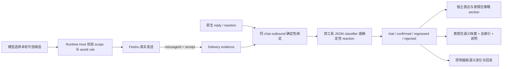
- Feishu 短指代追问（例如“这个 / 他这是 / 怎么回事 / 回复一下”）会优先使用原生 `parent_id/root_id/upper_message_id` 拉取被回复消息；原生 reply 元数据缺失时，adapter 会生成受控 light conversation evidence：当前用户短句、当前消息 native mentions、同群近邻消息和 best-effort `[可能关联上文]`。普通上下文仍避免把机器人出站消息当作用户请求；但短指代追问会把 nearby `sender_type=app/bot` 的卡片或机器人消息作为候选证据交给 agent 判断，防止用户追问上一条机器人回复时只看到孤立短句。若飞书云历史只返回本机器人 card/image 的资源壳，adapter 会按同一 channel/chat/messageId 从本地 outbound audit 读取已实际发送给用户的摘要，作为“本地已发送内容摘要”补进上下文，避免连续图片标注、命名、总结等任务只看到卡片壳而丢失上轮规则。当前消息带“也 / 继续 / 同样 / 按刚刚”等续作信号时，prompt 会要求 agent 先继承被回复消息、近邻消息和本地 outbound 摘要中的任务规则；类似“这是/这个是…”的短描述默认视为图片/文件元信息，只有用户明确要求写上该文字时才当作待标注文本。若用户明确说“看我上面消息 / 上面那条卡片 / 上文 / 前面消息 / 上一条 / 上几条”并要求查看、分析、回复、总结、对照或纠错，则不再降级为 light context，而是按有界历史范围走飞书消息页同步和历史索引检索。
- 耐久 outbound ref 的原始请求、上一轮状态和上一轮结果是续办事实，不是卡片标题的重复装饰；只有摘要与可见正文完全相同时才可去重，摘要仅“包含”标题时必须整体保留并标记 `continuationContextRecovered=true`。Context Broker 在 `reply_target / continuation` 焦点下识别短约束修改后，由 `execution-requirement.ts` 重新分类受控原始任务并继承其证据要求。明确图表、排行图、海报、表格、幻灯片等可视产物从首轮起即为 `artifact_required`；续办继承后仍需本轮成功工具结果与 Runtime 验证的新产物。缺证据时在原回合最多执行三次正式尝试：首次失败后重新规划真实工具路线，第二次恢复必须切换兼容工具、manifest 动作或修正参数/权限/产物验证，不能重复口头承诺；未知工具已经启动或可能有副作用时提前失败关闭，不为凑次数重放。三次仍无证据才由既有未完成收口替换，不能显示成已完成。该继承只接受耐久本地引用或显式恢复标记，不信任普通卡片标题和任意近邻文本。
- `turn-context.ts` 定义 Context Broker 的平台无关证据协议和纯裁决函数，`turn-context-broker.ts` 统一归一化各来源并按需调用解析 host。每轮都会生成 `cti-turn-context/v1` envelope：当前正文、原生 reply、native mention、当前/被回复附件、近邻、推测关联、历史和文档分别记录 `id/kind/relation/source/confidence`；当前消息同时携带平台时间，Feishu light context 与 Broker 都会剔除该时间之后才出现的平台消息，避免异步准备阶段把未来群聊注入当前回合；再由确定性 resolver 生成 `cti-turn-focus/v1`。唯一且正文可读的原生 reply 直接成为 primary evidence，图片/文件/卡片资源壳会标记 `contentRecovered=false` 并降为低置信，只有真实下载的 `reply_attachment` 或耐久出站摘要才能恢复可靠焦点；当前消息自带附件时仍会同时下载并保留被回复附件。近邻、历史、文档和 memory 默认只能作为 supporting evidence；多个强引用、仅有 `[可能关联上文]` 或 reply 正文未可靠恢复时，才通过 runtime host 调用独立解析 Agent。解析 Agent 使用 `interactionMode=classifier`：Hub、manifest、外部 executor 和本地工具路由全部绕过，Codex 使用独立禁用工具配置、只读沙箱、禁网和原生 JSON schema，Claude 使用 `allowedTools=[]`，本地 Codex CLI 使用 ephemeral、忽略用户配置和禁用工具特性；解析 host 接口不接收工作目录，并继承主任务 abort signal，stop 时会取消 provider reader。解析结果只能选择 envelope 中真实存在的 evidence ID，focus 必须与 primary evidence relation 一致，并复用确定性层的 reply 可读性函数，禁止重新提升不可恢复资源壳。解析 Agent 失败或返回无效结果后，纯函数回退只处理无副作用的短接话：唯一可靠近邻可成为 `continuation`；多条近邻时，仅当最后一条可读文本后紧跟不可读资源卡片，才把该文本作为卡片会话语义锚点，原生 reply 壳继续保留为 conflicting evidence，Prompt 明确不得声称引用正文已恢复。其他多候选、资源壳和执行类请求仍保持 `ambiguous`。native mention 和当前/回复附件进入 envelope 后即计为平台 evidence，不再额外注入重复的旧自由文本上下文。最终 Prompt 顺序固定为普通历史、结构化焦点、当前请求；焦点和主证据先于辅助证据进入独立字符预算，避免长历史截断后重新退化为自由文本猜测。
- `input-evidence.ts` 定义独立于工具调用的 `cti-input-evidence/v1`。当当前请求只需分析、识别或总结真实图片附件时，`ExecutionRequirement` 生成 `input_evidence_required`，记录必需附件 ID 和媒体类型；Codex SDK 在本轮 `runStreamed` 已接受包含 `local_image` 的输入后发出 receipt，不能依赖只在新线程稳定出现的 `thread.started`，因此恢复既有线程且没有该事件时仍能确认真实附件输入；Claude SDK 在 `system/init`、本地 Codex CLI 在对应输入初始化完成后由运行时发出 receipt。所有必需 ID 与类型均被接收才算证据满足，不要求视觉输入产生 `tool_use/tool_result`，也不允许模型正文、文件名、历史文本、未支持 MIME 或虚假产物声明绕过。Claude receipt 与实际 prompt 共用 PNG/JPEG/GIF/WebP 过滤结果。图片正文里仅出现 Unity/Blender/MCP/Game View/Scene View 名称，例如“查看这张 Unity 截图里的报错”，仍属于只读输入证据；只有副作用动作、明确指向 MCP/Game View/Scene View/当前场景或场景对象等实时外部状态，或显式使用“用/通过/调用 Unity、Blender、MCP”的只读动作，才升级为外部工具任务。状态目标可以位于读取动词前后；“修一下/改一下/调整/处理”等常见副作用表达同样升级。动作极性按片段和动作顺序裁决：否定只约束本片段动作，标点、转折、并列和顺序转向后可恢复肯定动作；“不得不/不能不”按肯定处理；“不需要的对象/未使用的模型”等目标属性不会否定后置删除、修改或列出动作；“不用 Unity，只分析截图”等真实否定调用仍保持输入证据任务。生成、编辑、标注、裁剪、保存、截图、导出等动作仍走 `artifact_required`；复合请求采用最强外部状态/副作用优先级，“先分析截图，再用 Unity/Blender/MCP 检查、修复或重建”继续要求对应工具证据。缺 receipt 会带原附件重试，最终仍缺失时返回明确阻塞；最终交付拦截只给用户 evidence 类型对应的简洁原因，内部工具计数、Provider 诊断和本地路径只保留在 workflow/audit。协议结构预留 `image/audio/video/file`，当前只启用 Provider 已正式承载的图片输入。
- Feishu adapter 对 agent 上下文采用两阶段入站：完成权限、原生 @、消息类型和必要附件解析后，立即把受理消息加入 bridge 队列；原生 reply、短指代、续办、显式历史请求、头像/附件恢复和 sticker library evidence 通过通用 `InboundMessage.prepareForAgent` 按需准备。群名解析在入队时后台启动，但上下文无关的问候、感谢、确认和情绪轻聊不再等待群名或增量历史，也不会因为“少于 80 字”就拉取消息列表与成员列表；普通增量历史在 adapter 仍运行时延后后台同步，避免与轻聊首包竞争。显式历史请求仍同步当前群索引后检索，表情包请求仍先完成增量/必要全量回填，原生 reply 和短指代仍取得对应受控 evidence，功能边界不因提速降级。`bridge-manager` 在等待必要准备钩子前先预备 turn feedback，平台读取较慢时不会形成无可见反馈的空窗。
- Feishu @ 投递、事件订阅、回调、入站、通知送达等诊断文本，以及引用他人消息、一般玩法规则或未来流程说明里的 `@名字`，只作为受控 evidence prompt 交给 agent。当前回合明确要求执行 @ 时，`application/mentions.ts` 提取具体显示名；“让多方现在开始互动、明确指定首位、并以每轮或强制语气要求原生 mention 交接”也只把首位视为本轮当前动作，不把后续泛称提升成目标。bridge-manager 随后调用 Feishu inspector 从当前群官方成员/机器人、本轮原生 mention、当前 sender 和受控历史 `<at>` 候选中做只读预检；Provider 只看到“唯一 / 歧义 / 未找到 / 查询失败”及显示名，不接收平台 ID。最终 Delivery 再调用 resolver 重新核验同一明确目标并生成结构化 mention；即使 Agent 漏写裸 `@`，也只会为用户本轮明确目标补 resolver 输入。`cti-final.mentions` 的字符串或 name-only 对象会保留为不可信选择提示，bot-to-bot 回合可据此补齐 resolver 文本，但最终只能回艾特由事件真实 sender app/open/user/union ID 与当前群官方候选唯一求交得到的本轮原生唤醒方。模型单方面其他名字、历史单独出现的名字、广播和关系称呼仍不能触发通知。出站结构化 mention 兼容 `userId/user_id/openId/open_id/id`（以及既有 `unionId/union_id`）；通用 `id` 与其他模型 ID 一样必须与本轮真实 evidence 精确求交集，不能直接成为平台身份。明确艾特请求缺少可信目标时，交付层只撤销原生 mention 动作并追加未投递说明，不覆盖正常答案和附件。`atAll/at_all` 属于广播动作；在建立独立 Owner 确认协议前默认拒绝。
- Feishu 显示名解析按证据来源分层：本轮原生 mention 最高，其次是当前群成员/群机器人列表、当前发送者，历史 `<at>` 映射仅作回退。同一最高层出现多个不同可原生 @ ID 才拒绝为歧义；历史中的旧同名 ID 不会覆盖当前群唯一候选。该排序是平台证据通用规则，不依赖固定机器人名。
- Feishu 出站 mention 只接受明确显示名、原生 mention evidence 或结构化 mention。类似“你自己的主人 / 开发者 / 维护者 / 某个成员 / 相关机器人”的关系描述或泛称不再被当成飞书显示名，不会补 `@目标`、不会触发 resolver/inspector 机械 blocker；模型若生成 `@关系描述`，bridge-core 会在发送前移除裸 `@`，保留自然语言语义。
- Feishu 身份/关系问题会额外注入 assistant maintainer evidence：adapter 已知的 bot/app 身份、当前发送者 bridge role、权限库和 `CTI_*_OWNER_USERS` 合并出的 owner/maintainer 线索。权限 JSON 同时兼容控制面板写出的 PascalCase 字段和 bridge 旧 camelCase 字段，并按最高角色合并，避免旧 viewer 记录覆盖 env/store owner。agent 可以据此回答“当前可确认的 bridge 维护者/Owner”，但不得把它伪称为飞书开放平台开发者/管理员；只有 admin API 明确返回的平台证据才能这么说。

收到消息后进入 `bridge-core` 的消息处理主线：

1. 记录运行审计。
2. 去重。
3. 先在 `bridge-manager` 处理无需模型自由发挥的受控系统入口，例如权限数字快捷回复、slash 命令、`/feishu` 开放平台能力诊断、扩展安装/移除确认卡、owner 二次确认、即时关机确认、平台 callback 和 `/remind` 固定格式等真实系统动作；slash 命令会先按命令影响范围做最低角色门禁：普通聊天、`/whoami` 和低风险 `/remind` 不提升门槛，会话/工作目录/模式/状态/文档/历史/停止会话等运行态管理入口至少需要 Operator，平台权限诊断和高危动作需要 Owner。权限卡片按钮、数字快捷回复和 `/perm` 文本命令都会先读取 pending permission link 里的工具名和输入 evidence，按风险决定只需 Operator 还是必须 Owner。普通自然语言内容不作为 provider 前快捷出口：自然语言扩展/模型/skill 搜索、通用表情包请求、自然语言提醒、`git status`/`git pull` 这类命令式文本都必须先进入 agent/provider 判断；提醒只有在 AI 输出 `cti-reminder` 或用户使用 `/remind` 后，bridge 才执行结构化 action 并返回可读执行摘要。“新建任务 / 创建待办 / 设置提醒 + 时间 + 叫/喊/通知某人做事”属于任务提醒语境，交给 agent 判断一次性/周期能力边界，不会被 Feishu 原生 mention 解析截走；包含未来时间的关机、关闭屏幕、运行命令、发送文件等执行型定时请求不进入低风险提醒入口，`cti-reminder` 和 `/remind` 也不能把这类副作用伪装成普通 reminder，必须继续走 owner 权限和 agent/action 链。纯问候、感谢、确认、短接话、飞书文档列表和记忆命中不作为内容快答出口。
4. 在绑定 chat/session 前预备 feedback，再完成绑定。
   - 确定性即时出口完成后立即预备统一的 turn feedback；默认通用 channel 等待 250ms，Feishu 默认 `0ms` 并在当前调用栈同步启动。session 路由、身份/表情 Prompt 和本轮确实需要的 adapter `prepareForAgent` 证据都在其后执行。上下文无关轻聊不会等待群名或普通增量历史；原生 reply、短指代、显式历史、头像/附件和表情包请求仍等待对应 evidence。如果这些必要读取、记忆意图分类、飞书云文档解析、provider 冷启动或首个 SSE 尚未完成，就复用同一张轻量状态卡并记录 `feedback_started`。后续真实 progress/tool 事件只升级这张卡，记忆写入确认也复用同一卡片生命周期，避免任何模型或平台前置 await 让用户空等或重复建卡。原生 sticker 的 adapter 生成语义属于平台 evidence，不进入用户记忆写入意图分类。
5. Feishu 入站会把 sender display name、open_id/user_id/union_id、chat type、sender bridge role、wake alias、原生 mention/reply 与第三人称/引用语义整理成 actor context 注入 agent system prompt；同时注入 assistant maintainer evidence，用于回答“谁配置/维护/拥有这个机器人”这类身份问题。这些只作为防误触和身份判断证据，不直接生成回复，避免群聊里别人讨论机器人、模仿机器人、转述指令或使用关系词时被误当成当前用户命令。
6. 记录轻量记忆事件，按 user/chat/global profile 滚动汇总事实、偏好、主题和待跟进项。
7. 如果消息里包含飞书 Docx、Sheets 或 Base 链接，bridge-core 调用 bridge-runtime 的云文档 host；runtime 先用应用 `tenant_access_token` 读取，只有应用无权时才按发起人 OAuth 用户 token 读取，并把真实内容作为本轮 system context 注入。OAuth 使用官方 `accounts.feishu.cn/open-apis/authen/v1/authorize`、PKCE 与 `accounts.feishu.cn/oauth/v3/token`，授权、换取和刷新 Token 都传入当前任务的最小规范化 scope；基础 scope 只保留刷新所需的 `offline_access`，官方 `user_info` 不需要的 `auth:user.id:read` 不再强制。Token 换取后必须用新 access token 调 `GET /open-apis/authen/v1/user_info`，返回 `open_id` 与 state 发起人完全一致才允许按用户隔离保存。自定义治理层以 `sender userId + scopes` 作为授权请求键：同一用户和 scope 只发送一张卡，后续任务合并到同一持久 state；Token、state 和等待任务按用户隔离，授权完成后逐个恢复原消息并写审计。callback/manual 两条恢复链都携带结构化 `authorizationResume`，恢复后仍缺资源分享或已发布 scope 时返回权限阻塞，不重复创建授权卡。`CTI_FEISHU_OAUTH_MODE=manual` 时不需要公网回调，用户把飞书授权后的 `code/state` 回调 URL 复制回飞书完成绑定。应用管理员权限只用于管理员身份诊断，不能替代云文档 scope 或文档本身授权。
8. Feishu Owner 可用 `/feishu` 查看开放平台能力诊断：本地配置、应用 token 直读能力、OAuth fallback 请求 scope、`CTI_FEISHU_GRANTED_SCOPES` 声明的已开通权限，以及各能力缺口。这个清单只记录后台已开通并发布的预期权限，不会自动向飞书申请或生效权限；发现缺口时按“权限开通 -> 发布审批 -> 事件/回调配置 -> 重启 bridge -> 再诊断”的顺序处理。
9. 构造上下文，只按检索命中的片段注入记忆和 Feishu 历史，不全量塞历史。普通“看一下今天群聊天记录在说什么 / 在聊什么 / 说什么”，以及“看我上面消息 / 上面那条卡片 / 上文 / 前面消息 / 上一条 / 上几条”这类明确回看上方消息的说法，会先命中 Feishu 历史意图，bridge-core 只使用 adapter/store 的历史索引和 `retrieveRelevantFeishuHistory()` 生成受控历史 evidence，由 agent 总结或回答；不把 `feishu-history/*.json` 路径交给 Codex 自行用 Bash 或 MCP 读取。当前 sender、角色、chat、原生 mention、reply、附件、近邻、历史和已解析文档会进入 `TurnEvidenceEnvelope`，Context Broker 先生成确定性 focus；只有低置信或证据冲突才调用解析 Agent。Prompt Composer 将普通历史放在结构化焦点之前，并把焦点紧贴当前请求；引用和检索文本始终只作 evidence，不能绕过权限、工具证据或当前用户明确改意图。流式最终卡片不走普通 `delivery` 时，FeishuAdapter 会以实际卡片消息 ID 写入耐久出站引用，保存有界的原始请求、终态和最终结果；用户原生回复该卡片而飞书只提供卡片资源壳时，adapter 优先从此引用精确回填续办上下文。
10. 对带有明确可读对象且具有真实查询意图的请求，`ExecutionRequirement` 会启用低风险主动探查：例如独立的“工作目录”、询问当前路径、列出明确目录、读取文件名、MCP manifest 或 `config/mcp.d` 等对象会进入 `local_read_required`，让 provider 自主调用受控读取、搜索或 shell 工具；普通陈述、报错原文、配置字段讨论即使出现“工作目录/路径”也不触发工具门禁。工作区计划或 system prompt 中已有的路径只属于路由元数据，不算成功工具证据；首轮仍由 Agent 通过真实工具核验。若首次漏调，conversation engine 使用新线程发起一次 no-evidence retry；第二轮仅对可唯一规划为 `list_dir / read_file / search_files` 的明确请求，由 runtime 复用现有 JSON 工具校验器和执行器恢复真实证据，路径权限只来自本轮 `TurnWorkspacePlan`。模糊请求、计划外绝对路径、shell、写入、MCP、Unity、Blender、产物和高风险动作不进入恢复层。没有明确对象的时效或泛问继续保持普通回答或追问。
11. 调用运行时 provider。Codex provider 继续把普通 `systemPrompt` 控制在 4000 字符预算内；当完整提示超过预算时，会先从任意位置提取同时声明为 `protocol` 且包含 fenced `cti-*` 动作标识的规则行，去重后作为关键协议块保留，再用剩余预算裁剪身份和普通上下文。短提示不重排，`priorityTurnContext` 与 provider 自带的 `cti-final` 回复契约仍使用各自独立入口。classifier 使用独立 Codex client，固定低推理、禁工具/网络/项目文档加载，并只提交 classifier instructions 与受控输入，不携带普通 Bridge reply contract、会话历史或项目工作区；避免 daemon 当前目录中的 `AGENTS.md` 把简单 JSON 裁决膨胀成长任务。这样 `cti-reminder`、`cti-direct-message` 及后续同类结构化动作不会因为位于长提示后部而在到达模型前丢失，目标解析、Owner 门禁和真实发送仍由 bridge-core / FeishuAdapter 负责。
12. Conversation Engine 会把 `tool_use_id -> tool input` 与对应 `tool_result` 配对；只有真实、成功且符合官方 URL 白名单的 `lark-cli auth login --scope ... --no-wait --json` 才生成飞书 CLI 用户授权 challenge。bridge-manager 在任何结果块或附件发送前优先接管该 challenge：非 Owner 返回红色阻塞；Owner 调用 runtime broker，禁止继续发送模型声明的二维码、本地 QR 图片或“回复好了”文案。runtime 只在内存中保留当前有效期内的 device challenge，以 `Owner userId + normalized scopes` 合并等待任务，后台执行官方 `lark-cli auth login --device-code ...`，成功后自动重新入队原请求，失败或过期则发送不含秘密的红色未完成卡。
13. 对带图片附件的 Feishu 表情包结果，先解析并剥离 `cti-sticker-annotation` 语义标注块，交由 FeishuAdapter 持久化；如果本轮真实 sticker 图片已附加但主回复漏掉标注块，bridge-manager 会用同一附件发起一次隐藏视觉标注 fallback，仅补写 `source=vision` 语义，不进入聊天历史、不改变可见回复、不触发 sticker 出站动作。非表情包回复不经过该协议，避免影响 `cti-final` 等通用结果块。
14. 解析最终结果块、`cti-reminder` 和 `cti-direct-message` 动作块。
15. 如果 Codex 明确请求创建提醒，bridge-core 只把低风险结构化动作交给 bridge-runtime 的 reminder host 执行，并把这次 bridge-owned action 的成功结果计入本轮执行证据，避免后置假完成防线误拦真实 host 摘要。用户看到的是面向人的执行摘要，包括提醒内容、时间、目标会话和到点通知对象；`reminderId`、`chatId`、状态文件路径和内部协议字段只保留在运行态状态或审计里，不外发。`cti-reminder` 的标题、sourcePrompt 或用户原文一旦呈现系统控制、文件发送、命令执行、安装发布等副作用，就不会写入 reminder host：普通用户返回 Owner 门禁，Owner 也会收到“需走受控工具/命令链和真实工具证据”的阻塞。模型只口头声称“已创建/已设置提醒”但没有动作块时一律拦截为未完成，不再从原文反向解析并补建提醒。
16. 如果 Codex 明确请求向某个 Feishu 成员、当前发送者或另一个群/会话发送消息，bridge-core 只接受 `cti-direct-message` 结构化动作，并要求用户原文存在与动作目标一致的明确私发/私信/“给某人发送表情包、图片、文件、消息”等授权；FeishuAdapter 会复用入站 mention、历史 `<at>` 映射、群成员列表、sender 上下文和本地 channel binding 解析目标。动作解析兼容字符串 `target`，也兼容官方模型可能输出的对象型 `target={display_name, open_id}`：对象同时含显示名和用户 ID 时只提取显示名，仍走本轮原生 mention / 成员 evidence 的唯一解析，不直接信任模型生成的 ID。普通一对一私发只有唯一命中真实用户 ID 时才用 `im.message.create` 的 `open_id/user_id/union_id` 收件人发送；name-only `targetType=user` 只是人员类型提示，不会单独升级跨会话确认。对“给我 / 私发给我 / 发起人 / 发送者”这类目标，群聊中即使成员列表不可用，也可以用本轮 sender open_id/user_id 作为收件人兜底，且不能把群名当成发送者姓名。若动作包含 `targetId/chatId/sessionId` 或 `targetType=chat`，则视为跨会话/id 发送，必须是 owner 发起，adapter 先返回目标名称、类型和平台 ID，bridge-core 在源会话发确认卡，只有同一 owner 在有效期内确认后才用已确认目标发送。私发表情包必须同时携带本轮真实附件和模型精确选择签发的 `VerifiedMediaAction`，FeishuAdapter 才以官方 `msg_type=sticker` 投递；未验证 file_key 不会作为文字或贴纸发送。源群只回确认/成功/失败状态，不复述待发送正文；其他目标不唯一、缺少目标、确认过期或模型只口头声称已发送时都返回阻塞，不用 Bash、临时脚本或手写平台 API 代发。
17. 通过 Feishu 原生 reply/card/image 等方式回复。reply 只表示引用消息，不自动 @ 提问人。多人机器人编排先于 Provider 执行：`orchestrated-interaction.ts` 将同一消息的原生参与者、当前 adapter assistant identity、具名先手和“发言后 @ 对方”规则合并为轮次计划；每条平台原生 mention 对象只计为一个参与者，其中 `open_id / union_id / user_id` 是同一身份的兼容别名，不能展开成多个同名参与者。当前机器人是先手时把唯一对方作为本轮 mention 目标，当前机器人不是先手时不建卡、不调用 Provider，等待先手后续原生 mention。该语义不是末端“禁止艾特自己”门禁，先手名称只描述发言角色；同名、多位对方或身份无法唯一绑定时不猜。其他出站 mention 有三类可信入口：本轮原生 mention；当前回合明确姓名经当前群官方 resolver 唯一命中；“他/她/对方/刚才那个人”等指代由 `contextual-mention-resolution.ts` 绑定到 `TurnEvidenceEnvelope` 中一个真实人物 evidence 后，优先通过 `verifyOutboundMentionIdentity()` 按相同平台 ID 查询当前群。`CTI_SAFETY_POLICY_PROFILE=balanced` 是默认档位：平台查询临时失败但 evidence 来自本轮可归因平台消息时，同群单人 mention 可带审计降级执行；`strict` 要求在线验证，`fluent` 还允许可靠 evidence 的低风险降级。模型可以选择 evidence，但模型输出的 ID 本身不能直接授权投递；无 evidence 绑定、身份冲突、明确退群/查无目标继续拒绝，多候选改为最小澄清。结构化 ID 统一兼容 camelCase/snake_case 的 user/open ID 字段，验证后的 `preparedReply.mentions` 同时进入普通 delivery 和 streaming card `onStreamEnd`，裁决结果以不含平台 ID 的 `[MENTION_RESOLUTION]` 审计记录 profile、decision、reasonCode、evidence 与 verification。诊断、流程、未来动作、广播受众、格式/规则和无证据的泛关系目标只作为上下文；无效结构化目标会移除裸 `@`，同时保留 Agent 正文、附件和明确未投递状态。Markdown card / post / text 在已有结构化目标时分别渲染飞书原生 at；Feishu streaming card 只展示高层状态，收尾时由最终结果和同一可信 mention 集合替换卡片正文。

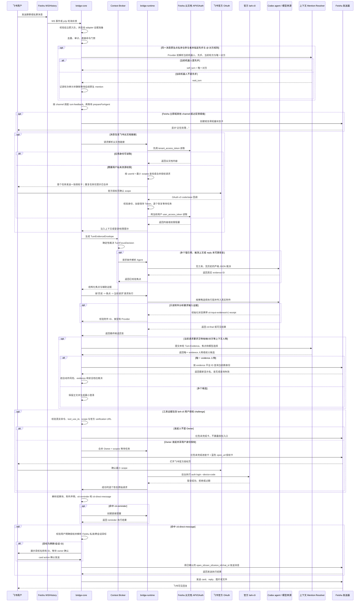

- `关机 / shutdown` 这类系统级动作不再交给模型自由发挥，而是在 `bridge-manager` 里走固定链路：
  - 仅 `Owner` 角色可发起，适用于所有 IM 渠道。
  - 第一步只记录审计并返回确认提示。
  - 第二步要求用户明确回复 `确认关机`。
  - 确认后桥接先发送执行提示，再直接调用 Windows `shutdown /s /t 0`。
  - 这条链路不经过 Codex、本地模型来源或历史本地执行器。

### 2.2 权限门禁

截至 2026-05-11，Feishu 入站不再使用 `bridge_feishu_allowed_users` 作为会话入口白名单。

- Feishu 任何用户都可以向机器人发起普通会话；群聊仍继续受 `group policy` 和 `require_mention` 约束。
- `CTI_FEISHU_ALLOWED_USERS` / `bridge_feishu_allowed_users` 只保留为兼容字段：启动和权限同步时会把其中的用户导入为 `Viewer`。
- 高权限动作统一走 `permissions.json` 的 `Viewer / Operator / Owner` 角色门禁，而不是在 adapter 入站阶段直接拒收消息。
- slash 命令入口也走统一角色门禁：`/new`、`/bind`、`/cwd`、`/mode`、`/status`、`/docs`、`/projects`、`/sessions`、`/stop` 至少需要 Operator；`/feishu` 需要 Owner；`/whoami`、普通聊天和低风险提醒保持可用，方便普通用户自查身份和继续对话。
- Owner 高危动作门禁只拦明确要求 bridge 执行的危险动作或命令；危险词出现在飞书卡片资源错误、adapter 诊断边界、日志、历史 evidence、故事/游戏规则或引用文本里时，不得在 `bridge-manager` 早退成权限拒绝，必须继续作为上下文交给 agent 判断。


截至 2026-04-27，桥接权限从 Feishu 单 owner 列表升级为三档角色模型：

- `Viewer`：允许普通聊天入口，对应各渠道 allowed users。
- `Operator`：允许中风险运维，例如批准普通工具权限、重启 bridge、启停 MCP 或本地模型。
- `Owner`：允许高危动作，例如关机、发布、越权路径、权限管理和系统级命令。

权限主数据存储在：

- `C:\Users\admin\.claude-to-im\data\permissions.json`

临时工具授权按钮和数字快捷回复使用独立运行时文件：

- `C:\Users\admin\.claude-to-im\data\permission-links.json`

兼容规则：

- JSON 权限库是主数据。
- `permissions.json` 只保存三档角色权限；`permission-links.json` 只保存待处理授权链接，两个协议不能共用同一文件。
- 启动和面板刷新时会从 `CTI_*_ALLOWED_USERS` 导入 `Viewer`，从 `CTI_*_OWNER_USERS` 导入 `Owner`。
- 保存权限后同步写回兼容 env，避免旧配置和脚本失效。
- 没有权限 JSON 且 Feishu 只有一个 allowed user 时，仍保留旧逻辑临时视为 owner。

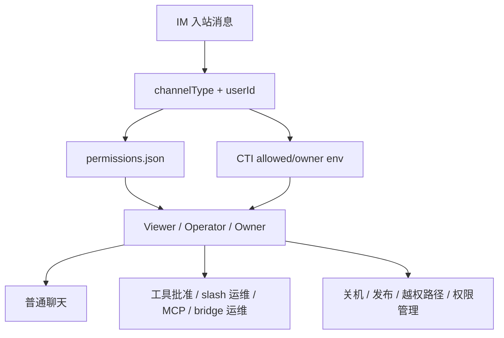

### 2.3 Provider 选择

截至 2026-04-25，运行时新增第一阶段 workflow / executor 内核。旧 provider 仍负责真实流式执行，但请求进入 provider 前会被标准化为可观察的 workflow run，并通过 executor registry 记录路由选择。当前阶段目标是先打通“入站请求 -> 执行器选择 -> 执行中 -> 成功/失败”的稳定观测闭环，后续再把真实执行实现逐步迁移到 executor adapter。

Workflow 状态：

- `received`
- `authorized`
- `contextualized`
- `routed`
- `executing`
- `finalizing`
- `delivered`
- `failed`

Workflow run 运行状态：

- `running`：当前 runtime 仍在执行。
- `succeeded`：已完成并交付。
- `failed`：执行失败，可能可恢复，也可能不可恢复。
- `retry_pending`：已排队等待自动或手动断点重试。
- `retrying`：后台 retry worker 已领取并正在重跑。

断点续跑第一版：

- provider 创建 run 后会向 `workflow-runs.json` 写入最小恢复输入，包括 prompt、工作目录、模型、system prompt、权限模式、channelType、chatId、发起人 userId、显示名和 messageId。
- 当流式执行进入 `status` / `result` 阶段后，runtime 会把模型来源、模型名、provider、codex profile、prompt profile 和 token 用量汇总为 run 顶层的 `execution` / `tokenUsage` 摘要；Codex SDK 回合额外记录 `requestedModel / submittedModel / modelMode`、请求与提交推理强度、受限回合覆盖原因、thread 模式和 `parameterEvidence=sdk_thread_options`。这些字段证明参数已经进入 SDK `ThreadOptions` 并由当前 SDK 转换为 Codex CLI 参数，但 SDK 0.132.0 不回报服务端最终模型，因此面板只能显示“已提交给 Codex”，不能写成“服务端已确认”。bridge-core 同步把兼容摘要作为 `RunSummary` 传给 Feishu streaming final card；旧 run 或旧 provider 没有这些字段时保持缺省。
- 官方 Codex 可能把进度说明和最终结果分别返回为多个 completed `agent_message`；`codex-provider.ts` 在转成 SSE `text` 时为后续消息补一个换行边界，避免 `cti-final` fence 与前一段文字粘连。该分隔只作用于 completed agent message 边界，不改写普通 token、工具事件或单条最终回复。
- 普通 Primary 回合若已收到完整 fenced `cti-final`，且严格 JSON 同时满足 `kind / text / images / files / reply_mode` 结构与非空交付条件，Provider 会启动默认 5 秒的 SDK 收尾 watchdog；正常 `turn.completed` 始终优先并取消 watchdog。若 SDK/子进程因继承输出句柄等原因不再产生 EOF，Provider 使用独立内部 AbortController 结束该 SDK run，并基于已验证 final 补唯一 `result` 终态，不外发 error；任何 final 后续 item 都会撤销旧收尾信号，用户外部取消也始终保持取消，classifier / response-only 不启用该逻辑。生产等待值可由 `CTI_CODEX_FINAL_DRAIN_TIMEOUT_MS` 在 1–60 秒范围内覆盖。
- `workflow-runs.json` 的写入仍优先走临时文件再替换；但在 Windows 上如果替换阶段遇到 `EPERM/EACCES` 文件占用，runtime 会回退为直接写目标文件，减少 retry worker 与控制面板并发读取时的写失败。
- Workflow 状态写入会在统一 JSON 持久化边界递归归一化字符串，并使用代理对安全的预览/恢复文本截断，避免 emoji 等补充平面字符被切成孤立 UTF-16 代理项。Runtime 读取历史状态时仅在检测到确凿孤立代理项后创建时间戳备份并原子写回规范化 JSON；备份或写入失败只放弃落盘迁移，仍使用安全的内存状态，正常文件不会重复改写。控制面板的通用 JSON 文件入口兼容旧状态中的非法 `\uD800-\uDFFF` 转义：只在内存投影中替换为 replacement character、保留其余记录并写脱敏诊断；WebView2 投递同时隔离序列化/平台异常，单个坏字段不再使设置页或 Control API 整体断连，面板本身不会删除或重建来源状态文件。
- `workflow-runs.json` 的物理路径不再在模块加载时写死；runtime 每次读写都会按当前 `CTI_HOME` 解析目标路径，便于单测切换到临时目录，避免测试 run 污染 live 运行记录。
- bridge-runtime 启动时会检查上一次遗留的 `running` run；有恢复输入且未耗尽次数的标为 `recoverable + retry_pending`，缺少 prompt 等关键信息的标为 `not_recoverable + failed`。
- provider 执行失败时会对可恢复 run 排队一次 `auto_pending` 自动重试；控制面板可通过 `workflow.retryRun` 把失败 run 改为 `manual_pending`。
- 自动重试只保留给值得再试的失败；`packages/bridge-runtime/src/workflow-failure-policy.ts` 统一归一化外层错误、嵌套 `cause/error` 与中英文摘要，再分类为认证、用量、Provider 协议、无效参数、主动中止、瞬时网络或未知失败。`usage limit`、认证失效、`405 Method Not Allowed`、本地 `responses` 端点不兼容、无效参数和 `operation was aborted` 不会自动排 `auto_pending`；瞬时网络与未知失败仍保留一次恢复机会。每次裁决写入 `workflow.retry.policy` 或 `workflow.retry.skipped` 事件，避免把确定性失败误诊成证据门禁过严。
- `auto_pending` 自动重试只会在 `CTI_WORKFLOW_AUTO_RETRY_MAX_AGE_MS` 新鲜度窗口内被 retry worker 领取，默认 6 小时；超过窗口后必须显式走手动重试，避免 bridge 长时间离线后继续旧任务。
- retry worker 在 bridge 启动后常驻轮询，优先领取手动 retry，再领取自动 retry；重跑前会执行同一套飞书云文档预读取，成功时注入真实内容，缺授权时发送登录/权限阻断而不让 Codex 公网抓取私有链接；重跑成功后写回会话历史，并在保留 channelType/chatId 时主动回发结果。
- 如果 retry 输出包含 `cti-final` 结果块，主动回发会复用 bridge-core 的最终回复解析层：清理协议文本，保留 replyTo 关系，并按结果块发送 Markdown、图片或文件；只有普通文本结果才加“断点续跑重试结果”说明。
- bridge 停止、重启或用户 `/stop` 前，bridge-core 会先 abort 活动任务，并在 Feishu adapter 仍可用时把已经开始的 streaming card 收尾为 `已中断`，提示后续可能断点续跑；retry worker 后续回发的是新的主动交付，不伪装成还能更新旧进程内卡片。
- 当前 retry 是“重新执行最小输入”，不是恢复原 Codex 进程；如果重跑过程中出现新的权限请求，后台 retry 会失败并把错误写回 run。
- `packages/bridge-runtime/src/workflow-contract.ts` 会把现有 `workflow-runs.json` 映射为 `packages/contracts` 中的 `WorkflowRunContract`，统一输出 input、provider、retry、delivery、finalizer checkpoint 和 trace event。当前仍不改变执行行为，只为后续 durable execution、run replay 和多节点日志聚合提供稳定契约。
- channel binding 默认允许延续既有 Codex thread，但如果同一 chat 的 `updatedAt` 超过 `CTI_SESSION_IDLE_FRESH_MS`（默认 12 小时），`channel-router` 会先重绑到 fresh session 并清空 `sdkSessionId`，避免旧会话上下文在长时间断线后继续注入。
- `packages/bridge-runtime/src/codex-execution-profile.ts` 是 Codex 模型来源、显式/默认模型、普通/受限推理强度和 thread fingerprint 的纯解析入口。官方、外部和本地来源共用同一语义：模型为空时不传 `--model`，模型非空时真实传入；classifier / response-only 固定提交 `low` 并记录 `restricted_interaction`，不伪装成全局推理设置失效。
- `config.env` 是 daemon 运行配置的跨平台事实源。Unix 启动脚本会 source 该文件；Windows runtime 在创建 Config、执行档案和 Provider 前通过 `hydrateProcessEnvironmentFromConfigFile()` 用文件值覆盖父进程继承的旧环境，避免控制面板保存新模型或推理强度后，旧进程环境继续传给 Codex SDK。只接受合法环境变量名，不执行文件内容。
- Provider 只复用 fingerprint 一致的内存 thread。模型来源、显式模型、推理强度或脱敏端点身份变化时直接创建 fresh thread；resume 自身在首个事件前失败时仍只允许一次 fresh retry。普通执行档案 fingerprint 同时并入现有 `bridge_runtime_fingerprint`，所以“保存并重启 Bridge”后会通过 channel-router 清空旧 `sdkSessionId`，但保留 CodePilot session、工作区和聊天历史。

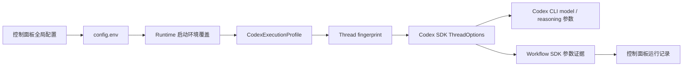

运行时状态文件：

- `C:\Users\admin\.claude-to-im\runtime\workflow-runs.json`
- `C:\Users\admin\.claude-to-im\data\scheduled-tasks\tasks|states|runs|check-ins|quarantine`
- `C:\Users\admin\.claude-to-im\data\scheduled-tasks\migrations\direct-reminders.json`
- `C:\Users\admin\.claude-to-im\runtime\executor-status.json`
- `C:\Users\admin\.claude-to-im\runtime\executor-session-defaults.json`

Executor 目录当前内置四类：

- `codex`：默认主脑 CLI / SDK 执行器，能力包含对话、代码、仓库查询、文件读写、图片输入和 artifact delivery。它可以按配置使用官方 Codex、本地 API、外部 API，或按自动切换链尝试多个模型来源。
- `claude-cli`：可切换 CLI 后端，能力包含对话、代码、仓库查询、文件读写和图片输入。
- 本地模型不再注册为独立 `local-tool-agent` 执行器；它只作为 `codex` 执行器的 `local_api` 模型来源参与。
- `codex-oss-ollama`：实验性只读执行器，仅在本地 AI 类型为 Ollama 时可用，声明 `codex exec --oss --local-provider ollama`。
- `mavis-agent`（截至本次记录新增 — v3.4 设计稿落地）：首个 **external agent executor**。Mavis / MiniMax Code 通过本地 `mavis` CLI 派发任务、轮询结果；opt-in，默认不启用，启用需在 `config.env` 设 `CTI_MAVIS_ENABLED=true` 且 `CTI_MAVIS_CLI_PATH=<path>`。真实路由来源是 `executor-registry.ts:buildExecutorManifests(config)`，依据 `Config.mavisEnabled` 和 `Config.mavisCliPath` 决定 manifest 是否注册；`config/runtime.d/executor.mavis-agent.json` 只供控制面板展示，不参与 `selectExecutor` 路由。

外部 Agent Executor 边界（v3.4）：

- 真分派点：`ExecutorProviderRegistry.resolveForRequest(config, ExecutorRequest, defaultProvider)`。registry 在 `selectExecutor` 之后立刻分派，命中 external executor 时**完全忽略** `defaultProvider`（Codex 主链），与 v1 "构造期替换 fallbackProvider" 无关。
- `ExecutorRequest` **只**含 `requestedExecutorId` / `preferredExecutorId` / `taskKind` 三个可选字段 + 必需 `sessionId/prompt/workingDirectory/permissionMode/params`。registry **不**接 `sessionDefaultId` 第 4 参；caller（`HubLlmProvider.streamChat`）通过 `resolveRequestedExecutorId(config, prompt, sessionDefaultId)` 把显式 hint、全局默认 executor 和历史 session default 折进 `requestedExecutorId`，优先级为 `@hint > CTI_DEFAULT_EXECUTOR_ID > sessionDefault > auto`。
- 两阶段错误处理（v3.2 阻断点 ②）：pre-dispatch（probe + `session new` / `communication send`）失败 → 允许回落 Codex；post-dispatch（poll + messages + diff + 终态解析）失败 → 禁止回落；判据 = `binding.mvsSessionId` 非空 + `lastDispatchAt` 已写入。
- `mavis-session-bindings.json`（`${CTI_HOME}/runtime/`）保存 `bridgeSessionId → mvsSessionId` 续聊映射；24 小时滑动窗口；写盘走 `tmp + rename`；**绝不**记录 secret、token、原始 diff 全文。
- env 主命名 `CTI_MAVIS_*`（11 条），兼容 alias `MAVIS_*`（11 条，仅在 `loadConfig` 兜底解析）；`saveConfig` 只写主命名，不写 alias。

外部 Agent Executor v3.5 修复（codex 7 轮 review 残留 P1/P2）：

- **P1 #1 真只读门禁**：`mavis-executor-provider.ts:preDispatch` 的 `mavisReadOnly` 检查从「仅 `permissionMode === 'acceptEdits'`」升级为「**capability + permissionMode 双闸**」。`inferCapabilities(params)` 推断出 `file_write` / `mcp_ops` 即抛 `MavisSafetyError('read_only_violation')`；`acceptEdits` 仍保留为 belt-and-braces 显式模式闸。`executor-registry.ts:buildExecutorManifests` 的 `mavisReadOnly` manifest capability 收敛（无 `file_write` / `mcp_ops`）继续作为上游选路闸；`preDispatch` 的 capability 闸是**显式 `@mavis` hint 绕过 manifest 选路后的最后防线**。
- **P1 #2 sessionId 形态校验**：`mavis-executor-provider.ts:isValidMvsSessionId` 校验 `mavis-cli-client.ts:createSession` 返回的 `sessionId` 必须非空、首字符为字母数字、长度 5-256、整体匹配 `^mvs_[a-zA-Z0-9][a-zA-Z0-9_\-]*$`。`preDispatchNew` 在写 binding 前调用；不合法 → 抛 `MavisSafetyError('dispatch_failed', …)`，**不写 binding**，`provider.binding` 保持 `undefined`，caller 仍可回落 Codex（v3.2 阻断点 ② 的 pre-dispatch 可回落不变）。
- **P2 #3 `mavisDefaultExecutor` 真生效**：`executor-registry.ts:applyMavisDefaultExecutor(config, sessionId, sessionDefaults)` 是兼容旧开关的纯函数消费方。条件：`config.mavisDefaultExecutor === true` AND `config.mavisEnabled === true` AND `!!config.mavisCliPath` AND 当前 session 无 sticky default → 懒写 `${CTI_HOME}/runtime/executor-session-defaults.json[sessionId] = 'mavis-agent'`，返回 `{ sessionDefaultId: 'mavis-agent', wrote: true }`。后续请求统一交给 `resolveRequestedExecutorId` 判定；显式 `@codex` / `@claude` / `@minimax` 仍能覆盖，`CTI_DEFAULT_EXECUTOR_ID` 会优先于这个历史 sticky default。失败 best-effort（写盘抛错 → `wrote: false` 但 `sessionDefaultId` 仍返回 `'mavis-agent'`，当轮请求不丢）。

外部 Agent Executor v3.6 修复（codex 8 轮 review 新增 P1）：

- **P1 #1 外部 executor 接入 workflow 观测链**：`main.ts:streamExternalDispatch` 在 `ReadableStream.start` 内补上与本地 Codex 链一致的观测生命周期：先 `startObservedWorkflow(params, 'external_agent')`（内部仍按 v3.5 selection 写 `setWorkflowExecutor('mavis-agent', reason)` + `writeExecutorStatus` + `appendWorkflowEvent('executing')`），再创建 `evidence = emptyStreamEvidence()` + `seedExecutionRequirementEvidence(evidence, params)`，所有下游写入都通过 `observedController = createObservedController(controller, evidence)` 完成；post-dispatch 阶段把 `controller.enqueue` 全部换成 `observedController.enqueue`，确保 `tool_use/tool_result/progress/result` SSE 事件被 `collectStreamEvidence` 捕获。fallback 路径在 `streamLocalFallback(observedController, ...)` 之前先 `setWorkflowExecutor(workflowRun.id, this.primaryExecutorId, '外部 executor pre-dispatch 失败，回落 Codex: …')` 再 `appendWorkflowEvent('executing', 'executor.fallback', …)`，面板上能看到「选 mavis-agent → 实际跑 Codex（pre-dispatch 失败回落）」的诚实链路；外层 `finally` 跑 `flushWorkflowEvidence` + `completeWorkflowRun`（fallback 成功时）或 `failWorkflowRun` + `requestWorkflowRetry`（fallback 也抛错时，与 v3.3 auto-retry 规则一致）。判据 = 外部 executor 实际执行时面板能看到 workflow run、executor selection、retry/audit trails 与 `bridge-runtime-audit.json` evidence 与本地链一致。
- **P1 #2 `mavisReadOnly` 改严格 capability allow-list + 扩 file_write 启发式**：v3.5 的黑名单（`required.includes('file_write') || required.includes('mcp_ops')`）有两个漏洞——一是「未来加新 capability 忘了列」会默默绕过只读；二是 `inferCapabilities` 的 file_write 模式只匹配 `修改|写入|保存|生成文件|edit|patch`，让 `delete package.json` / `create file` / `remove lockfile` / `touch script` / `rm -rf` / `mv old new` / `重命名` / `替换` 等写意图滑过 readOnly 闸。v3.6 在 `executor-registry.ts` 新增导出 `MAVIS_READ_ONLY_ALLOWED_CAPABILITIES: ReadonlySet<ExecutorCapability> = {chat, repo_query, file_read, image_input}` 和 `listMavisReadOnlyForbiddenCapabilities(required)`；`mavis-executor-provider.ts:preDispatch` 把黑名单换成「`forbidden = required.filter(c => !ALLOWED.has(c))`，非空即抛 `read_only_violation`」。同时 `inferCapabilities` 的 file_write 模式扩到 `修改|写入|保存|生成文件|edit|patch|删除|新建|创建|create|delete|remove|drop|erase|trash|unlink|rename|重命名|move|移动|write to|save to|append|追加|insert|插入|put file|replace|替换|update|modify|touch`；短命令 `rm` / `mv` 走第二条带 word boundary 的 regex（`(?<![a-z])(?:rm|mv)\s`）避免误伤 `arm` / `firm`。**仍未解决**：prompt 启发式本质是黑名单/白名单混合，绕路仍有可能；真正严谨的修法是在 `mavis-cli-client.createSession` 加 `readOnly` 字段并让 mavis daemon 端真正启用 sandbox——列为后续 P1 单独修复，本轮先锁住词表和 allow-list 不变量。
- **判据 / 不变量**：
  - 任何 capability 不在 `MAVIS_READ_ONLY_ALLOWED_CAPABILITIES` 的推理结果都必须让 `preDispatch` 抛 `read_only_violation`，**不允许**让 mavis CLI 默默接收写意图；测试在 `mavis-executor-provider.test.ts` 与 `executor-registry.test.ts` 各加一条 drift guard（manifest capabilities ⊆ allow-list）防止后续改 manifest 时忘了同步 allow-list。
  - 外部 executor 执行的 turn 必须经过 `startObservedWorkflow → writeExecutorStatus → flushWorkflowEvidence → complete/failWorkflowRun` 完整链路；`streamExternalDispatch` 不允许再绕过 `startObservedWorkflow`。`streamLocalFallback(observedController, ...)` 的 fallback 路径也允许触发 auto-retry，但失败回收只走 outer `failWorkflowRun + requestWorkflowRetry`，不让 `streamExternalDispatch` 内部产生「未观测的 workflow run」。
  - 语义点（已确认）：`applyMavisDefaultExecutor` 是旧 `mavisDefaultExecutor` 开关的兼容层；新默认入口是 `CTI_DEFAULT_EXECUTOR_ID`，由面板写入全局 executor 默认值。`@codex` / `@mavis` 等 hint 只覆盖当轮路由，不反向改写全局默认；需要长期切换时走控制面板“设为默认 / 恢复自动”。

外部 Agent Executor v3.7 修复（codex 9 轮 review 新增 P1）：

- **P1 #1 streamUntilFinish 结构化 terminal 状态 + workflow 失败态阻断**：`mavis-executor-provider.ts:streamUntilFinish` 的 timeout / aborted / error / partial_result 分支之前只 `enqueue(sse('error', ...))` 后 `return void`，外层 `main.ts:streamExternalDispatch` 完全感知不到远端失败——外层 `finally` 永远看到 `workflowFailed = false`，跑 `completeWorkflowRun` 写 `status: succeeded`，控制面板 / workflow / 审计会显示成功，但用户实际看到的是错误 SSE。这是 live 前阻断点（v3.6 workflow 外壳补了但终端语义没穿透）。修法选 A：
  - 新增导出 `MavisStreamResult` 接口和 `MavisTerminalState` union（`finished` / `timeout` / `error` / `aborted` / `partial_result`）。
  - `streamUntilFinish` 签名改为 `Promise<MavisStreamResult>`，每个 exit path（timeout / error / aborted / messages 拉取失败 / finished-but-no-text / happy path）都返回对应的 `{ terminal, errorCode?, errorShort? }`。
  - `main.ts:streamExternalDispatch` 的 post-dispatch try 块捕获 `result.terminal`；若不是 `'finished'`，置 `workflowFailed = true` + 构造 `workflowFailureError = new Error('mavis executor 终态失败：${terminal}')`；外层 `finally` 看到 `workflowFailed` 走 `failWorkflowRun(workflowRun.id, workflowFailureError)`，**retryability 决策见 v3.8 段**——v3.8 把 `shouldAutoRetryWorkflowError(workflowFailureError)` 换成了显式 per-terminal map `isMavisTerminalAutoRetryable(terminal)`，**不**调 `completeWorkflowRun`。本句 v3.8 落地前的旧表述是 `failWorkflowRun + shouldAutoRetryWorkflowError 决定 requestWorkflowRetry`，已被 v3.8 覆盖。
  - happy path（finished + text）返回 `{ terminal: 'finished' }`，workflow 仍然 `completeWorkflowRun`。
  - judge / 不变量：terminal ∈ {timeout, error, aborted, partial_result} 的 turn 必须在 `workflow-runs.json` 写 `status: failed`，且 `run.error` 包含 `mavis executor 终态失败：<terminal>` 文本——面板从 `run.status` 配合 `run.error.message` 就能区分 terminal 类别。`StreamEvidence` / `flushWorkflowEvidence` 当前**不**写 `terminal` 字段（v3.7 段初版曾提"bridge-runtime-audit.json evidence 必须含 terminal 字段"，codex 10 轮 review 指出当前实现没有该字段，本轮改为只依赖 `workflow-runs.json` 的 status + error 文本，不扩大代码面）。如果以后想让 `bridge-runtime-audit.json` 也带 terminal，那是另一轮小改：扩 `StreamEvidence` + `flushWorkflowEvidence` + 加 unit test。测试在 `mavis-executor-provider.test.ts` 加 `streamUntilFinish — structured terminal state (v3.7 P1 fix)` 6 条 case（finished / timeout / aborted / error / partial_result-messages-throw / partial_result-no-text）；每个 test 用独立 sessionId（`bridge-v37-${n}`）避免 CTI_HOME 跨 test 共享 binding 让 preDispatch 误走 resume path 消费掉预设的 infoResponse。
- **P2 `mavisReadOnly` 严格 sandbox（残留 P2）**：v3.6 的 allow-list + 扩 keyword 已经覆盖常见 case，但 prompt 启发式仍可能被 `修复 bug` / `实现功能` / `make it work` 这类抽象表达绕过去——`inferCapabilities` 推断不到 file_write / mcp_ops 时只会返回 `chat`，被 allow-list 接受。代码注释已明确「真正严密方案是给 Mavis CLI 传 read-only sandbox」——列为后续 P1 单独修复，与 v3.7 P1 解耦。如果 `mavisReadOnly` 要对外承诺安全，sandbox 应在 live 前补。

外部 Agent Executor v3.8 修复（codex 10 轮 review 新增 P2）：

- **P2 #1 streamExternalDispatch 显式 terminal → retryability map**：`mavis-executor-provider.ts` 新增导出 `MavisTerminalState` → `MAVIS_TERMINAL_AUTO_RETRYABLE: Readonly<Record<MavisTerminalState, boolean>>` 与纯函数 `isMavisTerminalAutoRetryable(terminal)`。`main.ts:streamExternalDispatch` 的 finally 块把 `shouldAutoRetryWorkflowError(workflowFailureError)` 换成 `isMavisTerminalAutoRetryable(terminal)`——`shouldAutoRetryWorkflowError` 是基于 error message 文本的黑名单启发式（usage limit / 401 / 405 / /v1/responses / invalid request parameter），**默认对未知错误返回 true**；v3.7 的 `new Error('mavis executor 终态失败：aborted')` 不在黑名单里，会返回 true 进入 `requestWorkflowRetry(..., 'auto')`，daemon 后续 claim 并重跑已取消的任务。
  - **map 设计**（每个 terminal 显式决定，不走"未知默认可重试"的隐式逻辑）：
    - `aborted` → **false**：用户/远端主动取消，重跑会绕过取消意图。
    - `timeout` → **false**：`streamUntilFinish` 在 hard timeout 时已经 best-effort abort 远端 Mavis session；自动断点续跑会重新派发同一用户 turn，可能制造可见循环，因此只标记失败，交给用户手动 retry。
    - `error` → **false**：远端 `status: error` 通常是 deterministic 失败（rate limit / content filter / tool exception），auto-retry 浪费 token；用户主动 retry 更安全。
    - `partial_result` → **false**：status=finished 但 messages 拉取失败或 assistant 无文本，重跑拿到不同部分结果难以合并。
    - `finished` → **false**：列出仅为完整性，caller 不应该传 finished 进 finally（会被短路到 `completeWorkflowRun`）。
  - **TypeScript 不变量**：`MAVIS_TERMINAL_AUTO_RETRYABLE` 类型为 `Readonly<Record<MavisTerminalState, boolean>>`，新增 `MavisTerminalState` 成员时忘记更新 map 会**编译期报错**（drift guard 双保险，单元测试也加了一条 runtime 校验）。
  - **判据 / 不变量**：`streamExternalDispatch` 永远不再调 `shouldAutoRetryWorkflowError` 走"未知默认 true"的隐式路径；retryability 决策必须经过 `isMavisTerminalAutoRetryable(terminal)`。测试：
    - 单元（`mavis-executor-provider.test.ts`，4 case）：`aborted/timeout/error/partial_result/finished` 各 1 条 + map 完整性 drift guard + 不允许任何 terminal 默认自动重试
    - 端到端 workflow 层（`hub-llm-provider.test.ts`，2 case）：构造真实 `HubLlmProvider` + mock `MavisExecutorProvider` 让 `streamUntilFinish` 返回 `{terminal: 'aborted'/'timeout'}`，调 `streamChat` 消费 stream，读 `${CTI_HOME}/runtime/workflow-runs.json` 验证 `run.status` 与 `run.retry.status`：
      - `aborted` → `run.status='failed'` 且 `run.retry.status !== 'auto_pending'/'manual_pending'/'retrying'`
      - `timeout` → `run.status='failed'` 且 `run.retry.status !== 'auto_pending'/'manual_pending'/'retrying'`
  - **附带改动**：`main.ts` 末尾加 `isEntryPoint` guard（`import.meta.url === pathToFileURL(process.argv[1]).href`）——只有直接跑 `tsx src/main.ts` 时才调 `main().catch(...)` 启 bridge；test 里 `await import('../main.js')` 不会触发桥接启动。同时 `export { HubLlmProvider }` 让 `hub-llm-provider.test.ts` 能在不破坏生产代码结构的前提下构造 HubLlmProvider 做端到端验证。

外部 Agent Executor v3.9 来源可观测与面板默认来源（2026-06-29）：

- `CTI_DEFAULT_EXECUTOR_ID` 是通用全局默认 executor 配置，可写 `codex`、`claude-cli`、`mavis-agent` 等 registry 已知 executor id；`loadConfig` / `saveConfig` 只接受规范化的小写 id，不为某个外部 agent 写死特例。该配置由控制面板“执行器”页的“设为默认 / 恢复自动”按钮和设置页“AI 执行与模型来源”统一写入。
- `executor-registry.ts:resolveRequestedExecutorId(config, prompt, sessionDefaultId)` 是唯一请求级 executor 默认解析入口，优先级固定为 `@hint > CTI_DEFAULT_EXECUTOR_ID > sessionDefault > auto`。旧 `executor.setSessionDefault` 和 `mavisDefaultExecutor` 仅作为兼容来源保留；不再要求用户通过命令才能切换长期默认执行器。
- runtime 在 external dispatch 开始时发送 `status` SSE，包含 `executorId`、`executorName`、`executorKind` 以及 manifest 暴露的模型字段；pre-dispatch 回落 Codex 时会补发 Codex 的来源状态，避免 Feishu 最终卡片误显示为外部 agent 已执行。
- `StreamEvidence`、`workflow-runs.json.execution` 与 `RunSummary` 现在保留 executor 来源字段。Feishu final card 底部按 `来源：executorName (executorId)` 与 `模型：model` 分开展示；只有模型字段真实存在时才显示模型，避免把 `mavis-agent` 误当成模型名。
- 控制面板执行器页读取 `executor-status.json.defaultExecutorId` 和配置快照，行内标记当前默认来源，详情区提供“设为默认”和“恢复自动”。设置页标题从“Codex CLI 模型来源”收口为“AI 执行与模型来源”，同页同时处理 executor 来源和 Codex 模型来源。
- 设置页“自适应安全策略”通过 `CTI_SAFETY_POLICY_PROFILE` 保存 `balanced / fluent / strict`，保存并重启 Bridge 后由 runtime 映射为 `bridge_safety_policy_profile`。该入口明确展示档位只影响可降级的低风险动作，不承诺关闭 Owner、平台授权、身份冲突、广播或高风险确认。

外部 Agent Executor v3.10 Windows CLI shim（2026-06-30）：

- `mavis-cli-client.ts` 是唯一启动 Mavis CLI 的封装层。Windows 上如果 `CTI_MAVIS_CLI_PATH` 指向 `.cmd` 或 `.bat` shim，client 通过 `ComSpec` 包装为 `cmd.exe /d /s /c <cliPath> ...args`；普通可执行文件和非 Windows 平台仍直接 spawn。这个规则只处理进程启动兼容性，不改变 executor 选择、session binding、secret 记录或 post-dispatch 禁止回落语义。
- 判据：`mavis.cmd status` 能通过 `createMavisClient(...).status()` 返回 JSON；若后续仍回落 Codex，workflow events 必须记录新的真实 pre-dispatch 错误，而不是 `spawn EINVAL`。

外部 Agent Executor v3.11 Mavis CLI 位置参数（2026-06-30）：

- 当前安装的 Mavis CLI 将 agent 声明为位置参数：`mavis session list [agentId]` 与 `mavis session new [options] <agent>`。`mavis-cli-client.ts` 统一通过 `buildMavisListSessionsArgs` / `buildMavisCreateSessionArgs` 构造这两条命令；禁止在封装层继续拼旧版 `--agent`，否则会在 pre-dispatch 阶段被 CLI 拒绝并回落 Codex。
- 判据：`createMavisClient(...).listSessions('mavis')` 能读到本机 Mavis 会话；`createSession({ agent:'mavis', from:'root', ... })` 能创建 `mvs_...` 会话并通过 `messages()` 读到 MiniMax 模型返回。Feishu 卡片显示的“来源”永远以最终实际执行链为准：pre-dispatch 回落后显示 Codex，Mavis 接单成功后显示 Mavis。

外部 Agent Executor v3.12 Mavis CLI 状态归一化（2026-06-30）：

- 当前 Mavis CLI 的 `session info/list` 将状态返回为对象（`status.type`），时间字段返回为毫秒时间戳。`mavis-cli-client.ts` 通过 `asMavisStatus` / `asTimestampString` 在封装层归一化为 `started` / `finished` / `error` / `aborted` 等字符串和可 `Date.parse` 的时间；`mavis-executor-provider.ts:streamUntilFinish` 只消费归一化后的字段。
- 判据：真实 `mvs_...` session 的 `{status:{type:'started'}}` 不得被误读为 `idle`；`finished` 必须能触发 messages 拉取和最终回复，而不是一路轮询到 timeout。

外部 Agent Executor v3.13 Mavis 完成证据与续聊 sender（2026-06-30）：

- `mavis-executor-provider.ts:streamUntilFinish` 轮询时不再只等待 `session.status === 'finished'`。真实 Mavis 会先写入 assistant `msg_type=1` 文本，再延迟刷新 session status；因此 post-dispatch 每轮同时 best-effort 拉取 `messages(limit=50)`，只要本轮 cursor 之后出现 assistant 文本，就把该消息集缓存为完成证据并进入最终 text/diff/result 收口。status 仍负责 `error` / `aborted` / hard timeout，消息窥探失败不改变原轮询路径。
- 活动时间取 `lastActiveAt` 与 `updatedAt` 中较新的一个，避免 `lastActiveAt` 停在用户消息时间、`updatedAt` 已推进到远端活动时误触 quiet timeout。
- resume path 在发送新 prompt 前会 best-effort 读取当前 Mavis 会话尾部消息，把 `lastSeenMessageId` / `lastSeenMessageTimestamp` / `lastUserMessageTimestamp` 作为本轮游标基线写入 binding；这样上一轮 timeout 后迟到的 assistant 文本不会在下一轮被误当成本轮回复。
- 续聊 `communicationSend` 支持通用配置 `CTI_MAVIS_BRIDGE_SESSION_ID`（alias：`MAVIS_BRIDGE_SESSION_ID`，仅 load 兼容；`saveConfig` 只写主命名）。当 bridge daemon 进程没有继承 `$__MAVIS_PARENT_SESSION_ID` 时，用该 Mavis sender session 调 `communication send --from ... --to <mvsSessionId>`；仍禁止传 bridge sessionId。
- 判据：MiniMax 已在 Mavis messages 中返回 assistant 文本但 status 尚未翻 `finished` 时，Feishu 不得先报“模型没有返回可展示结果”；已有 binding 的下一轮 prompt 不得因缺少 `--from` 回落 Codex。

外部 Agent Executor v3.14 Mavis communication 回复采集（2026-07-01）：

- Mavis 续聊走 `communication send` 后，真实回答不一定落成目标 session 的普通 assistant `msg_type=1` 文本；MiniMax Code 可能先把答复写入 `mavis communication messages --from <targetMvsSessionId> --to <bridgeSenderSessionId>` 的出站记录。即使该出站记录因为源 session 已 archived 而标记 `status=failed`，`content` 仍是本轮应交付给 Feishu 的用户可见结果。
- `mavis-cli-client.ts` 增加 `communicationMessages({ from, to, limit, status })` 读取封装，参数构造集中在 `buildMavisCommunicationMessagesArgs`。`mavis-executor-provider.ts:streamUntilFinish` 在普通 `messages(limit=50)` 窥探之外，best-effort 拉取 `status=all` 的 communication 出站记录，并按 `from_session === binding.mvsSessionId`、`to_session === CTI_MAVIS_BRIDGE_SESSION_ID`、`command === 'prompt'`、`content` 非空、`lastDispatchAt/lastSeenCommunication*` 之后这几个通用条件过滤。
- `mavis-session-bindings.json` 新增 `lastSeenCommunicationId` / `lastSeenCommunicationTimestamp` 游标，只记录 id 与时间，不记录 communication 原文、错误栈、secret 或 diff。普通 session message 游标和 communication 游标相互独立，避免上一轮迟到 assistant 或旧 communication 回复被下一轮复用。
- `quietTimeoutMs` 改为软空闲信号：超过 quiet 窗口只做轮询退避，不再立即 `abort` 并返回 timeout；只有 `hardTimeoutMs` 到达后才 best-effort 发送 `communication abort` 并进入 `terminal=timeout`。这保证 Mavis 已经接单但状态字段停止更新时，Feishu 卡片不会抢先报“模型没有返回可展示结果”。
- 判据：Mavis UI 已显示 reply/communication send 但 Feishu 卡片为空时，provider 必须能从 communication 出站记录收口为 `text` SSE；同一 binding 的旧 communication id/timestamp 不得被再次交付；quiet timeout 之后、hard timeout 之前到达的 communication 回复仍应完成本轮。

外部 Agent Executor v3.15 Mavis SSE 收口（2026-07-01）：

- `mavis-executor-provider.ts` 的 post-dispatch 结果已经能从普通 session messages / communication 出站记录拿到 `finalText` 后，必须通过 bridge 标准 SSE envelope 外发：`data: {"type":"text","data":"..."}`。禁止在 provider 内手写另一套 `event: text` + `data: {"text":...}` 形状；bridge-core 的 `consumeStream` 只消费统一 envelope，非标准形状会导致 binding 已记录 `lastFinalText`，但 Feishu 最终卡片仍因 `responseText` 为空显示“模型没有返回可展示结果”。
- Mavis provider 的 `sse(event, data)` 现在统一代理到 `sse-utils.ts:sseEvent`；最终 assistant 文本以字符串 data 发出，`status` / `tool_use` / `tool_result` / `result` 等结构化事件仍由 `sseEvent` 负责 JSON 序列化。新增回归断言 `mavis-executor-provider.test.ts` 中成功文本必须能解析成 bridge 标准 `text` event，避免后续 provider 再绕开统一 SSE 协议。

外部 Agent Executor v3.16 归档 sender 防护（2026-07-01）：

- `mavis-cli-client.ts` 在 `createSession()` / `info()` 的 session 归一化结果中保留 `compressed?: boolean`。Mavis CLI 用该字段表示 session 已归档/压缩；这种 session 仍可能 `status=finished`，但不能作为 `communication send --from` 的可回收件地址。
- `mavis-executor-provider.ts:preDispatch` 的 resume path 在确认目标 `mvsSessionId` 存在后，会调用 `resolveBridgeSenderForResume()` 校验 `CTI_MAVIS_BRIDGE_SESSION_ID`：缺省时仍沿用旧行为（不传 `from`，交给 Mavis CLI 环境兜底）；配置存在时必须形态合法、`info()` 可读且 `compressed !== true`。若 sender invalid / unavailable / archived，则删除旧 binding 并走 `session new --from root`，不再调用 `communicationSend`。
- 设计取舍：归档 sender 下强行续聊会让目标 MiniMax/Mavis agent 把 Feishu prompt 当成“来自另一个 Mavis session 的请求”，随后尝试把答案回报给已归档 source，造成长时间等待和“session 已归档、发不出去”的元信息。新建普通 Mavis session 会牺牲旧 target session 的内部连续性，但 bridge 仍会注入必要上下文，且能优先保证 Feishu 用户收到真实可见答案。
- 判据：配置的 sender 被 Mavis 标记 `compressed: true` 时，provider 不得调用 `communicationSend({ from: archivedSender, ... })`；必须创建新的 `mvs_...` session 并更新 `mavis-session-bindings.json`。测试覆盖归档 sender、`compressed` 归一化和坏 sender 不进入 communication resume。

外部 Agent Executor v3.17 Windows shim argv 防护（2026-07-01）：

- `mavis-cli-client.ts:buildMavisSpawnSpec` 对 Windows `.cmd/.bat` CLI 路径增加可解析 shim 的直连分支：若批处理只设置环境变量并把 `%*` 转发给真实 executable/script（例如 Electron/Node CLI shim），runtime 会读取该 shim，保留 `set KEY=VALUE` 环境变量，然后直接 `spawn(realExe, [script, ...args])`。无法解析的自定义 `.cmd/.bat` 仍回退到旧的 `ComSpec /d /s /c <cliPath> ...args` 路径。
- 根因：飞书图片/表情 prompt 会包含换行或附件描述；批处理里的 `%*` 会让 Windows shell 对参数做二次解析，可能把多行 prompt 截断，导致 `mavis session new [options] <agent>` 收不到最后的 `agent` 位置参数，pre-dispatch 报 `missing required argument 'agent'` 后诚实回落 Codex。直连真实 exe 后，prompt 仍作为单个 argv 传入，不再经过 batch `%*`。
- 判据：多行 prompt 通过 `.cmd` shim 时，`buildMavisSpawnSpec` 必须产出真实 executable、script 前缀参数和原始 `hello\r\nworld` argv；只有不可解析 shim 才允许走 `cmd.exe` fallback。测试覆盖可解析 shim、未知 shim fallback 和普通 executable 直连。

外部 Agent Executor v3.18 图片/表情附件桥接（2026-07-01）：

- `mavis-executor-provider.ts` 在 pre-dispatch 阶段统一处理 `StreamChatParams.files` 中的 `image/*` 附件；新建 session 与续聊 `communicationSend` 均调用同一套附件物化逻辑，避免一条路径能看图、另一条路径退化成 file_key 文本。
- 当前 Mavis CLI 的 `session new --prompt` 和 `communication send --content` 只提供文本入口，没有原生附件参数。因此 bridge 先通过共享 `TurnStorageHost` 把图片/表情包归一化到 `CTI_UPLOAD_CACHE_DIR\<sessionId>\<turnId>`，再把绝对本地路径附到 prompt 中，并明确要求 Mavis 使用可用的视觉工具（如 `matrix_describe_images`）读取该路径，而不是根据 file_key 猜测图像内容。
- 安全边界：记忆仓库中的耐久媒体可只读复用；旧工作区 `.codepilot-uploads`、项目内临时文件和其他外部可读路径一律复制进本轮受控 upload 目录再暴露给 Mavis。Mavis 与 Ignis 共用 Conversation Engine 已暂存的 `filePath`，不再各自生成平铺缓存，也不把临时输入图继续留在 Unity/仓库默认工作目录。
- 判据：飞书图片/表情包由 `mavis-agent` 执行时，MiniMax Code 端应看到 `Bridge-provided local input files` 与本轮 session/turn `Local path`，并能基于真实图片路径调用视觉工具；不能只收到 file_key 文本，也不能出现新的 `mavis-input` 或 `ignis-attachment-*` 平铺文件。测试覆盖 base64 落盘、旧工作区路径迁出、工作区外路径复制和 resume path 附件传递。

外部 Agent Executor v3.19 可见进度与来源会话连续性（2026-07-01）：

- `bridge-core` 的 `StreamChatParams` 现在携带 `sourceChannelType/sourceChatId/sourceThreadId`，`bridge-manager` 从入站地址传入来源身份；`mavis-session-bindings.json` 继续以 bridge session id 为主键，但 binding 会额外保存通用来源通道 / chat / thread 以及 Feishu 兼容别名。`mavis-session-store.ts:findBindingBySource()` 用这些字段查找最新 binding，不把逻辑写死到某个飞书消息文本或某个 Mavis session。
- `mavis-executor-provider.ts:preDispatch` 的续接顺序是：先按当前 bridge session id 精确命中，再按来源通道 / chat / thread 续接；若按来源找到旧 binding，会把它迁移到新的 bridge session id 后再 dispatch。这样 live 同步、fingerprint 改变、CodePilot 会话重绑或内部 session id 变化时，同一飞书会话仍优先复用原 Mavis session，避免每段对话都新建上下文。
- `streamUntilFinish()` 会把 Mavis 轮询到的工具阶段和可展示 `thinking_content` 归一化为脱敏 `progress` SSE；最终 `msg_content` 或 communication 出站正文拆成多个 `text` SSE chunk，并限制最大 chunk 数和小延迟，给 Feishu CardKit 留出可见打字机刷新窗口。该链路只展示用户可见处理过程和工具进展，不外发 secret、原始协议 JSON、未脱敏日志或不适合群聊的调试内容。
- Feishu workflow card 的等待态会同时保留固定 workflow 步骤和 provider 传来的具体 progress detail；当 Mavis 正在思考或调用工具时，卡片不再被“正在回复...”这类静态文案遮住。测试覆盖 source chat 续接、Mavis progress 外显、最终文本分块和 progress card 步骤/细节并存。

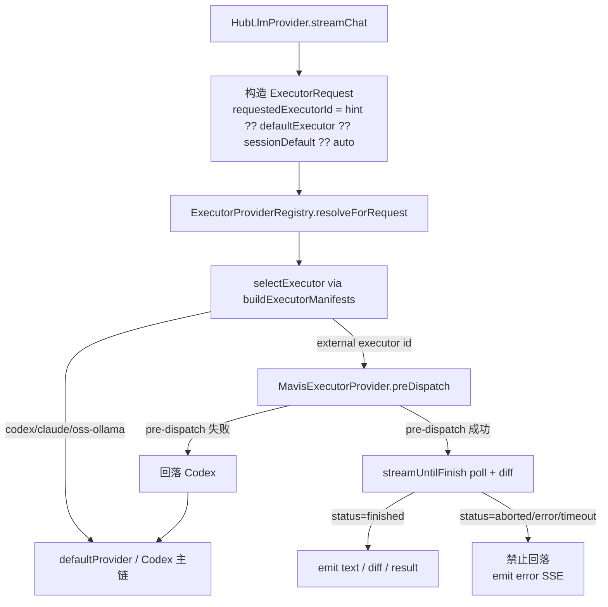

路由规则：

- `@codex`、`@claude`、`@local`、`@本地`、`@ollama`、`@codex-oss` 显式覆盖当前会话路由；`@local` / `@本地` 现在指向 `codex`，语义是本轮 Codex 使用 `local_api` 模型来源，不再进入独立 `codex-local-fallback` 执行器。
- 控制面板可写入全局默认 executor；旧 session 默认只作为兼容 fallback，优先级低于全局默认。
- 没有显式覆盖时，按 capability、executor priority 和当前真实 provider 偏好做自动选择。
- 本地 agent 的历史工具边界仍由 `ToolSandboxPolicy` 声明，但不再参与 Codex CLI 模型来源切换；本地 API 作为 Codex 模型来源时承接同等 Codex agent 工具能力。
- Feishu 轻聊天使用 `light_chat` prompt profile：确定性层先检查当前消息、真实附件、`ExecutionRequirement` 和从 Priority Context 提取出的真实 evidence 正文，不再扫描 `Focus handling rules` 等固定安全说明，避免其中的“执行 / 附件 / 文件”把普通问候误判为任务；同时把面向助手自身响应速度、延迟、在线接话的短探测识别为对话元信息，避免“检查 / 测试”等弱动词单独把测速闲聊升级成完整 Primary。省略“你 / 机器人”主语时，只有同时命中对话响应对象、快慢/延迟性能语义和当前现场探测语境才补全为测速轻聊；真实 API、服务、文件、TAPD、Unity/MCP 或平台对象仍由对象门禁判为任务。明确“继续 / 接着”类续办短句直接保留完整回合进入 Primary，不先增加协调模型调用；其他通过硬门禁的短消息进入严格 JSON 轻量会话协调器，输出 `reply / delegate / clarify`。协调器只优化 Prompt 和权限边界，不切换模型来源：控制面板选 official Codex 时协调与 Primary 都使用 official，选 external API 时都使用 external，选 `local_api` 时才使用本地来源；用户明确配置的自动 failover 链仍按该链执行，不额外插入隐藏 Ollama 请求。普通轻聊协调器只携带 assistant 身份、Feishu inbound actor context、emoji/sticker 策略、必要的近期上下文和最近 0-2 条短历史；actor section 遇到后续任意 Markdown 标题即停止，防止中文 Agent Home、workspace 或工具规则泄漏。profile 显式清空 workspace、additional directories、附件和工具证据要求；真实 evidence 已能确定“缺对象必须澄清”时，会把本轮 JSON Schema 的 `action` 收紧为 `clarify` 并使用最小提示，可见澄清文本仍由 Agent 生成。`reply/clarify` 一轮直接形成可见正文，`delegate`、无效 JSON、超时、协议矛盾或低置信结果保守进入完整 Primary/工具链，并使用未经裁剪的原始回合参数。该路径写入 route summary、`use_selected_provider_profile` 和 `WorkflowRun.execution.promptProfile=light_chat`；明确任务不额外增加协调模型调用。

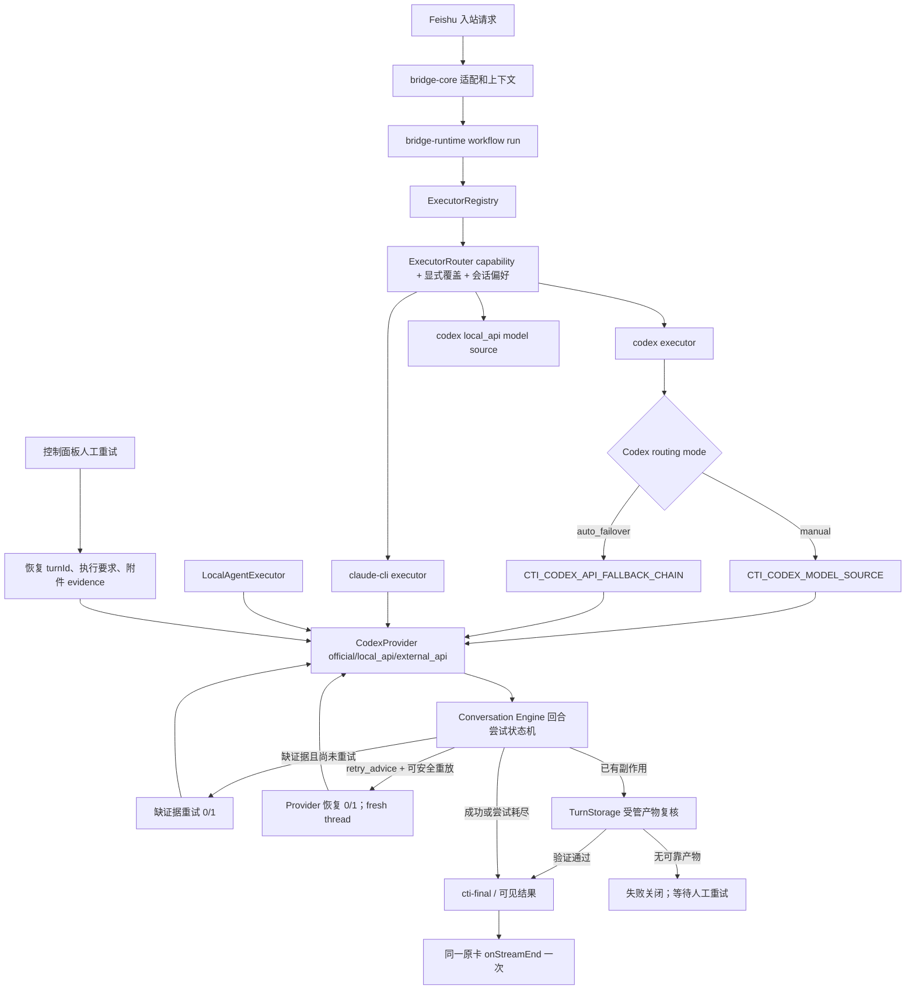

当前默认策略是 `Codex CLI agent + 可选模型 API 链`：

- `CTI_CODEX_ROUTING_MODE=manual|auto_failover` 控制是否启用自动切换；默认 `manual`。
- 手动模式只读取 `CTI_CODEX_MODEL_SOURCE=official|local_api|external_api`，不会因为工具探测、安全策略或旧兜底键自动转官方 Codex。
- 自动切换模式读取 `CTI_CODEX_API_FALLBACK_CHAIN`，默认推荐 `local_api,external_api`；链里没有 `official` 时运行时不允许调用官方 Codex。
- 自动切换只处理模型/API 层失败，例如额度、鉴权、连接失败、超时、5xx、405、本地 API 不兼容；任务执行失败、工具失败、权限失败或用户请求本身失败不会换模型重跑。
- `WorkflowRun.execution` 会记录 `attemptedSources` 和 `selectedSource`，配合 `modelSource/model/baseUrl/tokenUsage` 让控制面板展示实际执行来源。
- 活跃用户回合发生 Provider 断流时，Runtime 只发出严格内部 `retry_advice`，包含脱敏诊断码、是否可重试、`replaySafety` 和 `retryDisposition`；不会把该回合先定稿失败再交给后台 retry worker 主动补发。Conversation Engine 在同一 `turnId` 内分别限制一次缺证据重试和一次 Provider 恢复，复用工作区计划、附件、执行要求、Artifact/Scratch 目录，并为非首次尝试强制 fresh Provider thread。历史、记忆和最终交付只在状态机真正结束后写入一次。
- 自动重放安全由 `workflow-replay-safety.ts` 基于本轮真实工具轨迹、Executor Manifest 风险和统一 shell 命令风险解析裁决：无工具和明确只读/幂等工具可续跑；写入、发送或未知工具失败关闭。已有副作用时只允许 `TurnStorage` 恢复稳定 artifact ID、SHA-256、时效、受管根、非符号链接和可打开性均通过的产物；否则用户侧明确提示“可能已经部分执行，未自动重放”。
- 后台 Workflow Retry 只保留显式人工重试和执行前 Bridge 中断的安全恢复。人工重试必须恢复原 `turnId`、`executionRequirement`、工作区计划字段和受管 `inputEvidenceRefs`；附件缺失、过期或 Hash 不一致时失败关闭，不能退化为无附件、无证据门禁的裸重试。

本地 API 作为 Codex 模型来源：

- 设置页选择“本地 API”或自动链命中 `local_api` 时，运行时不再通过 `@openai/codex-sdk` 访问本地 `/v1/responses`，而是进入本地 provider registry。
- 当前 registry 内置 `ollama` 和 `lmstudio` 两个 Codex CLI OSS agent adapter，分别生成 `codex exec --oss --local-provider ollama --model <CTI_LOCAL_AI_MODEL>` 和 `codex exec --oss --local-provider lmstudio --model <CTI_LOCAL_AI_MODEL>`。
- `vllm`、`openai-compatible` 和 `custom` 当前只标记为 Chat Completions / OpenAI-compatible 能力；未接入 Codex CLI OSS agent 前，手动 `local_api` 会明确阻断，自动链只会继续尝试链内后续已配置来源，不会转官方。
- `CTI_LOCAL_AI_BASE_URL` 只用于健康检查、面板展示和 workflow 摘要；本地 Codex agent 实际执行参数由 adapter 生成，模型名完全来自 `CTI_LOCAL_AI_MODEL`，不写死具体模型。
- 各 Bridge Codex profile 默认都不共享 Codex Desktop 全局 `plugins`，生成 `config.toml` 时剥离 `[plugins.*]`、`[marketplaces.*]` 和 `[desktop.*]`；local profile 还继续剥离 `[memories]`、`personality` 和 `notify`。Computer Use、Browser 等桌面插件可能依赖 Desktop native helper/pipe，SDK/CLI Bridge 无法提供该宿主时会先失败，再诱发猜路径、手工执行缓存脚本和 ESM loader 报错。只有确认插件与当前运行时兼容时，official/external profile 才可显式设置 `CTI_CODEX_INHERIT_GLOBAL_PLUGINS=true`；local profile 始终隔离。清理旧 Bridge Home 的 `plugins` / `.tmp\plugins` 时先识别 junction/symlink，只移除生成入口，不递归修改用户全局缓存。Provider guardrail 同时禁止猜 skill 路径或手工运行插件缓存文件。
- Desktop Browser 插件隔离不等于禁用所有联网读取：正常 `official` Codex 回合通过 SDK `webSearchMode=live` 暴露服务端只读 Web Search；classifier/response-only 等受限回合、`external_api` 和 `local_api` 继续固定 `disabled`。Codex SDK 只有在 `web_search` item 真正完成后，Provider 才映射为 `web_search` 的 `tool_use/tool_result` 供 Workflow、证据门禁和进度链消费；搜索摘要或模型声明不能伪造成功回执。该入口适合公开网页时效检索，不提供登录态浏览器、Cookie、购物车、支付或页面点击能力。
- 对已经由 `config/action-manifests.d` 明确匹配出的 `mcp_tool_call`、`unity_mcp_execute_code` 和 `shell_artifact` 请求，Codex runtime 会在官方 Codex 主链路前构造 manifest-constrained task；旧 `config/local-agent-tools.d` 只作为兼容层读取，且同 id 时新目录优先。manifest 匹配支持 `keywords`、无序 `keywordGroups`、`regex` 以及需要工作区语境配合的 `contextualRegex + contextRegex`；其中 `keywordGroups` 用于“若干关键词同时出现即可命中”的短句，不要求用户按某个固定词序表达。命中后仍由 Codex 主脑负责规划，不切换到 `CodexLocalCliProvider`，也不要求官方 Codex 直接拥有内部 `mcp_call` 句柄；runtime 只负责把传给 Codex 的上下文压缩为瘦身 system prompt、空历史、新线程、选中的 JSON 工具请求、最小工作区摘要和严格 `ExecutionRequirement`。Codex 必须输出标准 `tool_request` JSON，runtime 作为工具宿主校验该 JSON 是否仍在已选 manifest 边界内，再执行 MCP 或产物工具并封装 `cti-final` 附件。因此简单产物任务不会先触发 skill 读取、全盘文件扫描或手写 MCP HTTP。这个入口只接受 manifest 声明的工具动作，不覆盖普通聊天、模糊 MCP 运维询问、只读文件探索或未配置的工具需求。
- 本地 CLI agent 环境会清理 `OPENAI_API_KEY`、`CODEX_API_KEY`、`CTI_CODEX_API_KEY` 和 `CTI_CODEX_BASE_URL`，避免本地模型任务意外继承付费侧凭据。
- 本地 CLI agent 默认追加 `--ignore-user-config`，避免桌面 Codex 插件、远程同步或全局 provider 配置干扰本地模型；需要继承用户配置时可显式设置 `CTI_CODEX_LOCAL_IGNORE_USER_CONFIG=false`。
- `codex exec --json` 的 JSONL `turn.completed.usage` 会汇总进 `WorkflowRun.tokenUsage`；`WorkflowRun.execution.provider` 记录 adapter id，例如 `ollama` 或 `lmstudio`。本地 Codex CLI 子进程有整轮超时保护，默认 5 分钟，`CTI_BRIDGE_PROCESSING_TIMEOUT_MS>0` 可覆盖，`<=0` 可显式关闭；Windows 下超时或 abort 使用进程树终止，避免只杀 `cmd.exe` 而留下 `node codex.js` / `codex.exe` 僵住会话。
- 本地 API 的 `local_read_required`、`tool_required` 和 `artifact_required` 任务会优先进入 JSON 工具协议；当用户原文和 manifest 足以安全推断出只读目录/文件/搜索、显式 shell 命令、已注册 MCP tool action、已注册 Unity MCP `execute_code` 别名或已注册产物工具时，runtime 会先生成确定性 `tool_request`，并跳过 MCP `tools/list` schema discovery，避免已配置动作为了“补 schema”先触碰外部 MCP 服务；只有无法确定工具动作时，才会把相关 MCP schema 和可用工具目录注入给本地模型，要求模型输出 `{"action":"tool_request","tool":"list_dir|read_file|search_files|shell|shell_artifact|mcp_call|unity_mcp_execute_code","args":{...}}`。`config/action-manifests.d` 的工具匹配支持普通 `keywords/regex` 和上下文匹配 `contextualRegex + contextRegex`：前者用于“Unitymcp 截一个 Game 图”“桌面截图”等明确请求；后者用于“截个图给我”这类短句，只有当前工作区、system context 或绑定上下文命中 Unity/Assets/ProjectSettings 等语境时才会选中 Unity Game View 截图动作。runtime 始终验证工具名、参数、允许根、MCP manifest 和产物路径后执行工具，并把真实 `JsonToolResult` 回填到下一轮规划上下文；如果首个结果只是搜索、读取或列表，且原始意图仍需要执行动作，模型可继续基于返回的真实 path/id/name 规划下一次 `tool_request`，最多执行受控多步工具循环。执行期间 runtime 会发出 `progress` SSE 事件，文案由本轮 `ExecutionRequirement`、工具族、MCP schema 参数和真实 `tool_result` 生成，不输出固定“处理思路 / 执行结果 / 正在组织上下文”模板；例如 `web-search` 会显示实时网页或新闻证据、实际搜索 query 和搜索工具结果阶段。bridge-core 将 provider progress、记忆证据、工具事件和 agent 收口阶段合成为默认开启的 Feishu streaming card “思考路径”预览。等待态卡片只承载用户可见的模型处理路线、依据和阶段结果，不进入最终回复、会话历史或 `cti-final` 结果块。任务完成后同一张 streaming card 会关闭流式模式并更新为结果正文；如果终答文本包含“处理思路 / 执行结果”，收尾卡片正文只保留结果段，可展示的处理思路、依据和通用工具轨迹进入默认收起的“执行过程”折叠面板，由用户手动展开查看。工具动作完成后，runtime 会把用户原文和真实工具历史交给本地模型做终答整理，并封装为 Markdown `cti-final`；该终答允许展示简短用户可见处理路线，但禁止泄漏隐藏推理链、`JsonTool`、`tool_request/tool_result` 协议或原始 MCP JSON。`JsonToolResult` 会按显式产物契约提取真实存在的本地图片/文件路径，成功时优先生成 `cti-final.images/files` 结果块；因此 MCP 截图、桌面截图、导出文件等产物会进入 Feishu 附件发送链路，而不是以普通文本路径结束。
- `deterministic-evidence-recovery-provider.ts` 包裹最终选定的 Runtime Provider，只处理 conversation engine 已标记 `noEvidenceRetryAttempted=true` 的严格 `local_read_required`。它不解析新的业务动作，而是复用 `planDeterministicJsonToolRequest()`、`validateJsonToolRequest()`、`executeJsonToolRequest()` 与统一 `cti-final` 封装；仅允许目录列举、单文件读取和有界搜索，且所有显式绝对路径与执行目标必须落在 `resolveProviderWorkspace()` 从本轮 `TurnWorkspacePlan` 得到的根内。恢复成功会发出真实 SSE `tool_use/tool_result/status`，因此继续满足现有证据审计；无法唯一规划或校验失败时原样委托底层 Provider，不用自然语言快捷答案绕过 Agent。
- MCP 查询结果还必须满足用户请求的信息粒度。若用户要求节点名称、路径或对象详情，但工具结果只包含对象 ID、分页游标和计数，没有 `name/path/title/label` 等可展示字段，runtime 会把该轮判为未完成并要求继续读取详情；若本轮没有拿到详情，最终回复必须说明具体阻塞，不能由终答整理模型把 ID 猜成对象详情。Unity `find_gameobjects` 只返回 `instanceIDs` 时适用同一条通用 ID-only 规则。
- 回复风格是独立的展示上下文：控制面板保存的 `CTI_REPLY_STYLE_HINT` 会映射为 `bridge_reply_style_hint`，bridge-core 在 `conversation-engine` 中构造 `replyPresentation.replyStyleHint` 并随 `StreamChatParams` 传给 provider。普通 Codex turn、本地 API 的 Codex CLI turn、外部 API turn 和工具后终答整理层都必须使用同一语气提示；等待态卡片可以展示用户可见处理依据，最终回复必须先判定可见 `intent/state`（`chat / investigate / need_info / done`），查证完成后只回结果，除用户明确要求 walkthrough 外不复述工具流水、路径、命令、内部协议或逐步执行过程。agent 的默认执行姿态是主动完成：可通过安全上下文、附件、reply 元数据、记忆 evidence、manifest 或低风险读/列/检查推进时先尝试，不把可执行请求退回成教程或泛泛拒绝；确实缺信息时只问最小缺口，部分完成时保留已验证进展并说明具体阻塞。这一姿态不改变 Owner/Operator 门禁、平台权限或真实工具证据要求。Feishu 艾特回复必须基于明确姓名、当前消息 native mentions、被回复消息、可能关联上文或唯一群成员匹配来反思应艾特谁；对象含糊时只问最小澄清，不猜测发起人或引用消息作者。控制面板的“回复风格快捷设置”和“自定义整理”都提供就地保存入口；本地 AI 整理会把结果写回配置并同步前端状态。
- 记忆检索不再作为最终回复快捷出口。`store.decideMemoryReply()` 仍负责判断显式记忆查询、检索相关命中并构造记忆上下文；即使命中高置信结构化记忆，bridge-core 也会把命中内容转成 agent system prompt，经 `conversation-engine` 和 provider 生成最终回复，再由出站 review 校验。显式记忆回忆的 `MemoryQueryPlan` 会同步传入 `ExecutionRequirement` 分类；这类请求以记忆命中作为证据来源，不因“场景 / 节点”等业务词误触发 Unity/MCP 工具门槛。Feishu streaming card 会展示“判断证据/工具/记忆上下文、检索到记忆、交给 agent 整理”等用户可见处理路线；这些等待态内容不写入会话历史，也不展示隐藏推理链。
- Feishu CardKit streaming card 是同一张卡片的两阶段展示：执行中卡片显示“思考路径”，以真实 workflow/progress 事件组织用户可见路线，包括记忆命中、桥接前置检查、provider `progress` SSE、工具状态、权限等待、Provider 恢复和 agent 收口阶段。可恢复断流只把原卡更新为“连接中断，正在重试”，不会提前调用 `onStreamEnd` 或清理 CardKit registry；只有回合尝试状态机真正结束后才调用一次 `onStreamEnd`，恢复成功在原卡定稿成功并继续正常附件交付，尝试耗尽才定稿“未完成”。不会因为用户文字像某类工具任务就预先创建 workflow card，也不再无条件显示“已收到请求 / 正在判断 / 会话权限 / 读取工具目录”这类系统流程。默认先走轻量状态，收到真实 progress/tool 检查点后自动升级为 workflow card；正文 token 流不触发升级，表情包结构化消息保持轻量聊天。等待态以当前一步标题、灰色正文和“理解 / 证据 / 执行 / 结果”四阶段轨迹呈现，已完成、当前和待处理阶段分别使用真实状态标记；工具区显示最近三条安全动作和完成/失败计数。工具名先转成“桌面截图 / Unity MCP 截图 / 文件读取”等通用可见标签；当 provider progress 已提供更具体的任务阶段时，泛化工具事件不会用 `MCP 工具执行` 之类占位文案覆盖它。完成后关闭 streaming mode，并把卡片替换为 schema 2.0 Markdown 内容：正式结果的 header 使用回答正文标题或首行语义摘要，不再显示固定“处理完成 / 最终结果”，且标题控制为短摘要；短、无结构、无工具/协作轨迹且非失败的轻聊会省略整个 header，正文和真实证据/footer 仍保留。标题不得用“表情回复”等字样暗示 reaction 或 sticker 已发送，只有平台真实投递成功的原生 reaction/sticker 才能代表该结果。正文直接呈现结果，但会清理正文中独立成行的 `✅`、`✔`、`☑`、`❌` 或 `×`，避免与底部状态重复；正文下方的证据状态只根据最终状态与真实工具状态显示“结果已生成 / 结果未完成”“工具证据 n/n / 工具失败 / 文本回复（无工具证据）”，不会凭模型正文宣称现场已验证。可展示的“处理思路 / 执行过程 / 处理依据”和通用工具轨迹会进入默认收起的 CardKit `collapsible_panel`，标题为“执行轨迹”，用户展开后可看到按首次观察时间排序的相对时间、终态和单步耗时。工具轨迹由 `tool_use.input` 生成安全动作摘要：Bash/PowerShell 只归类为“读取状态文件 / 查看日志 / 搜索文件 / 运行测试 / 构建项目 / 同步 live skill / 重启 bridge 服务”等可读动作，不展示原始命令、绝对路径、token 或平台内部协议。底部只用 `✅` 或 `×` 加耗时表达完成状态。最终卡片禁止显示 `JsonTool`、`tool_request`、`tool_result`、`shell_artifact`、`mcp_call` 等内部协议名。支持 streaming card 的 channel 不再同时启用旧 streaming preview，避免同一轮 Codex 结果同时落成进度卡和普通 Markdown 回复。
- Feishu final card 收口同样受编码卫生约束：runtime 终答归一化、bridge-core Markdown/card 渲染和文档记录都必须保留 UTF-8 中文可读性，不能把内部协议名、乱码占位或旧式模板段落直接展示给用户。CardKit header 是 plain text，标题摘要必须移除原生 `<at ...>` 标签并只保留可见名称，正文再按结构化 mention 渲染原生提及。
- 源码编码卫生由 `bridge-runtime/src/source-encoding.ts` 统一扫描。扫描范围覆盖 bridge-core、bridge-runtime、控制面板和脚本中的运行源码，默认排除 `__tests__`、构建产物和 release；规则检查 UTF-8 BOM、`U+FFFD`、典型 UTF-8/GBK mojibake token、异常长问号串和临时 `if (false && ...)` 分支。检测器样本只能放在 `cti-encoding-allow-start/end` 块内；`source-encoding.test.ts` 和 `scripts/update-architecture-docs.ps1` 使用同一类规则，防止中文回复、卡片文案、脚本输出和运行源码再次带入编码损坏。
- 源码扫描之外，Bridge 最终交付还会在本地附件路径解析后、Answer Review 前调用 Runtime 的 `ArtifactEncodingInspectorHost`。检查返回 issue 或 Host 异常时，回复改为明确的“未完成”，清空 images/files，只展示文件名、ZIP entry 和问题类型，不展示绝对路径，也不再发送原文件；无附件或检查通过时保持原交付行为。
- JSON 工具协议当前支持 `list_dir`、`read_file`、`search_files`、`shell`、`shell_artifact`、`mcp_call` 和 `unity_mcp_execute_code`。runtime 会先把本轮 `requiredToolFamilies` 映射成允许工具目录，例如 `mcp/unity-mcp` 只能规划 MCP 工具，`artifact` 会暴露 MCP/Unity MCP 产物动作和 `shell_artifact`，`shell` 才允许普通命令工具，`filesystem/read/search` 才允许本地读取类工具；模型输出的 `tool_request` 不在目录内时会被拒绝并要求重试，避免 Unity/MCP 或产物任务绕到 shell 假完成。读文件类工具限制在当前工作目录、默认工作区、Unity 工程路径、允许根和 Codex additional directories 内；越权路径、UNC 路径、`.env`、`auth.json`、`config.env` 等敏感文件会被拒绝。`shell` 仅校验 cwd 必须在允许根内，按当前权限模式执行用户明确要求的本地命令，并由 runtime 控制超时、输出截断和日志脱敏。`shell_artifact` 由 `config/action-manifests.d/*.json` 的 `shellArtifact` 块声明安全命令、cwd、超时、产物路径和验证规则；执行后只信任显式 `artifacts/artifactPaths`，避免把命令文本里出现的可执行文件路径误当附件。`mcp_call` 校验 manifest hint、工具名和参数大小后通过 `McpBridge.callTool()` 调用已声明的 MCP manifest；`McpBridge` 保留 HTTP/stdio MCP `tools/call` 的 `{ ok, content, error }` 结果，标准 `isError=true` 或结构化错误字段会映射为 `JsonToolResult.ok=false`，不会增加成功工具证据。
- HTTP MCP 调用由 `McpBridge` 统一维护 session、header、SSE JSON 解析和工具 discovery 缓存。对同一个 manifest endpoint，runtime 会在短 TTL 内复用 `mcp-session-id`，`tools/list` 结果也会短暂缓存；如果服务端返回 session 缺失或失效错误，会清理缓存并重新 initialize 一次。provider 和 agent 不需要用 Bash / PowerShell 手写 MCP initialize、`notifications/initialized`、`tools/list` 或 `tools/call`，所有 HTTP 与 stdio MCP 都走同一套 manifest 校验和调用收口。
- Unity Editor 内 C# 执行不走 shell/file 工具。`unity_mcp_execute_code` 会通过 `McpBridge -> Unity MCP -> execute_code` 发送 `{ action:"execute", code, compiler, safety_checks }`，适用于 Unity MCP C# 片段和 `config/action-manifests.d/*.json` 声明的 Unity MCP C# 工具别名；Game view 截图等非 C# Unity 动作使用同一 manifest 目录声明为 `mcp_tool_call`，例如 `manage_camera`。具体工具如何匹配用户文本、调用哪个 MCP tool、传什么参数都由 manifest 配置决定，provider 主逻辑不写死某个工具名或命令。
- 工具执行成功后，runtime 使用确定性最终化输出目录、文件、搜索结果或命令 stdout/stderr/exitCode，避免出现“工具已执行但用户看不到结果”的假完成；该路径必须有 runtime 或模型提出的 JSON 工具请求和成功工具结果。
- 只有模糊请求才进入本地模型 JSON 规划；如果本地模型没有输出可解析 JSON，runtime 仍只会在能从请求中保守推出只读目录/文件/搜索目标，或用户原文明确给出完整命令时补全白名单工具请求。runtime 规划或兜底补全都会在 workflow 中标记 `jsonToolFallbackUsed=true`，模型自主规划的多步 MCP 调用则保留每一步 `tool_use` / `tool_result` 证据。
- Workflow 摘要会记录 `toolUseCount`、`toolResultCount`、`successfulToolResultCount`、`failedToolResultCount`、`failedToolErrors`、`toolNames`、`evidenceProtocol=json_tool_request`、`requestedTool`、`executedTool`、`jsonToolRetryAttempted`，以及 shell / shell artifact 的 `shellExitCode` / `shellDurationMs`；恢复链额外记录 `verifiedOutputArtifactCount`、`replaySafety` 和 `retryDisposition`。失败时生成脱敏 `failureDiagnostics[]`，用稳定 `source/category/code/summary/autoRetry` 区分 Provider 认证、额度、协议、参数、取消、瞬时失败，以及工具依赖路径、模块加载和宿主 runtime/helper 不可用。失败事件只附 `failureCodes`，避免把绝对路径或底层异常全文提升成面板与自动化事实。独立 `workflow-failure-ledger/v1` 账本按 `sequence` 提供跨滚动窗口水位，并仅用 kind、stage、status、失败码、replay safety 与 retry disposition 计算规范化 SHA-256 指纹；账本不保存正文、动态 run/session/chat/user ID、错误原文或绝对路径。schema 也预留 `progressCardCreated`、`progressCardFinalized` 和 `progressCardFallbackReason`，供 CardKit 进度卡片状态写入。控制面板在最近 Workflow 与会话运行历程中显示证据状态、重放安全、重试处置、已验证产物数量、失败原因摘要和实际工具名。
- 旧键 `CTI_CODEX_LOCAL_FALLBACK_ENABLED`、`CTI_CODEX_FAILURE_FALLBACK_MODE`、`CTI_CODEX_LOCAL_FALLBACK_REASONING_EFFORT`、`CTI_LOCAL_AGENT_MODE`、`CTI_LOCAL_TOOL_CALL_REQUIRED`、`CTI_EXECUTION_REQUIRED_ROUTE` 不再作为运行时策略入口；控制面板也不再读取或写回这些本地 agent 兜底设置。
- 探测状态仍写入 `runtime\local-llm-status.json` 和 `runtime\local-model-capabilities.json`，用于说明本地模型能力，不再触发自动改交官方 Codex。本地轻量路由协议对新请求使用 `use_local_profile` 表示“选择本地模型 profile/source”，旧 `answer_local` 只在解析历史 payload 时兼容并立即归一化；状态统计主字段是 `localProfileHits`，旧 `localOnlyAnswers` 只作为运行副本和旧面板兼容镜像。
- Feishu 轻聊天同源 fast path 使用独立 3–8 秒协调预算，不继承普通任务的完整上下文和工具链。manual official/external 会创建受限 `CodexAppServerLightProvider`：Bridge 启动后异步拉起同一 Codex CLI 的 `app-server --listen stdio://`，预热一个空的 ephemeral thread，随后按 bridge session 隔离复用 thread；每条 thread 最多处理有界回合，超限或 LRU 淘汰后重新创建，避免跨会话串线和无限上下文增长。thread 固定 `approvalPolicy=never`、`sandbox=read-only`、网络关闭、空 workspace roots/附件/环境/dynamic tools、`project_doc_max_bytes=0`、禁用 shell/apps/plugins/browser/multi-agent/web search，并使用与 Primary 相同的 model source、显式模型名、认证和独立 Codex Home；任何服务端工具请求、command/file/MCP/web item、进程异常、超时、非法 JSON 或低置信结果都失败关闭并把未经裁剪的原始参数交给 Primary。`auto_failover` 继续直接使用已配置候选链，`local_api` 继续使用本地来源原链，不会被常驻进程暗中固定为 official/external。这样优化的是 CLI 冷启动和输入规模，不是通过混用另一个模型换取速度。
- Codex `auto_failover` 的每个候选都有“首个有效 text/tool/result 事件”期限，默认 2000ms。候选只输出内部 status 或完全不返回时会取消当前 reader 并切换下一来源；一旦产生真实正文或工具事件，就锁定该来源并直接流式输出，禁止在已执行后换源造成重复动作。记忆写入意图分类使用独立 4000ms 预算，超时后回到 bridge-core 既有保守结构化解析。
- 对 `git status`、当前分支、最近提交、暂存区内容、读取文件和搜索文本这类只读且有固定工具计划的请求，Codex 主模型失败后可以走受控本地工具兜底；该路径由 runtime 自己执行 shell/read/search，不让本地文本模型编造结果，也不承接写入、Unity/Blender/MCP 多步编排或高风险动作。
- 对 `artifact_required/tool_required` 且已由 manifest 匹配出确定性 JSON 工具计划的请求，runtime 会优先压缩官方 Codex 主链路上下文；Codex 主模型因登录、额度、超时或 API 错误失败后，才允许 `CodexLocalCliProvider` JSON 工具协议兜底。主路径不绕过 Codex 主脑，兜底路径只执行可验证 manifest 计划，不让本地模型自由编造产物；如果本地工具或 MCP 也失败，则返回具体阻塞。
- MCP 运维小活：状态、启动、停止、工具列表、显式 HTTP tool call。`hybrid` / `codex_only` 模式下这些请求先交给 Codex 主链路；本地 MCP 快路径只在 `local_only` 或 Codex 明确失败后的受控兜底里执行。
- Ignis 创意生成快路径：原画、生成图、视频、模型、canvas、file_id、turn_id 的提交和查询。
- 本地快路径在进入 Ignis、MCP、本地执行器前，统一先做“询问 / 操作”判定；歧义默认按询问处理，只允许只读查询，不直接触发生成、启动、停止、写入或 `git pull`。
- 所有 fast-path handler 在触碰 MCP manifest、启动服务、调用工具或执行本地计划前，都必须重新做 intent preflight；旧 MCP 快路径入口也委托到同一套判断，避免绕过新版规则。
- Ignis 的“最近几次 / 历史 / 整理成列表”优先走历史列表意图，不再因为出现 “Ignis + 检查” 就误落到状态检查。
- Ignis 状态、安装、配置、工具列表类问题不进入生成接口；只有明确创意生成意图才提交任务。
- MCP 快路径只在明确动词下才执行启动、停止、重启和显式 tool call；只说“看看 MCP”时默认返回基于合并 manifest 的动态状态/帮助，不自动操作任何 MCP，也不维护硬编码入口列表。
- Unity/Blender 场景、节点、Prefab、模型、截图、导入导出这类实际工作即使写了 `unitymcp` / `blendermcp`，也不允许被本地 MCP 状态快路径抢答，必须回到 Codex 主脑做正式工具编排。
- 历史本地执行器仍保留只读规则和 sandbox 工具边界，但不再作为普通飞书消息的最终回复 provider；需要使用本地模型时由 Codex agent 切换到 `local_api` 模型来源后继续执行。
- `关机`、`shutdown`、重启机器等系统级动作现在直接标记为高风险请求，不允许走本地省流路径。
- 对 Unity、Blender、MCP、仓库、文件、图片和历史这类可执行请求，回复契约要求“解决问题优先”：必须基于真实工具结果、真实命令结果或明确阻塞原因回报；不得用通用教程、占位表格或示例脚本替代执行结果。
- 对已经明确提到 `unitymcp`、Unity、Prefab、场景或对象名的具体工具任务，Codex / 本地 Agent 失败后的用户可见回复不能再要求用户“指定 MCP 入口”或返回 MCP 入口列表；出站收口会把这种伪澄清改写成未完成阻塞说明。
- Codex/MCP 执行链失败时，Unity/Blender/MCP/文档等需要真实工具输出的任务默认返回确定性 `未完成 + 阻塞原因`，不再降级给本地模型生成教程。自动切换只覆盖模型/API 层失败；MCP 状态类问题在失败兜底里会读取 suite manifest 与用户 overlay，并用 `codex mcp list` 判断 stdio MCP 是否已注册，已注册但未握手时显示“待 Codex 会话握手时加载”。
- Unity 截图/预览任务要求当前轮真实刷新或截图产物；如果 MCP 握手、场景刷新或截图阻塞，回复必须文本说明阻塞，不得从历史 capture 目录挑旧图回传。Unity HTTP MCP 的裸 `/mcp` 406 响应视为服务已响应但握手头不完整，后续应使用 `Accept: application/json, text/event-stream` 和正式 MCP initialize/list-tools 流程确认工具可用性。
- bridge runtime 会为 Codex 主 profile 使用独立 `CTI_CODEX_HOME`，同步全局认证和共享资源时剔除全局顶层 `model = ...`、`features.*` 和默认的 `mcp_servers.*`，避免本机 Codex UI 的模型配置或离线桌面 MCP 拖垮飞书 bridge。只有显式设置 `CTI_CODEX_INHERIT_GLOBAL_MCP=true` 时，bridge Codex 才继承桌面全局 MCP 配置；运行版通过 `CTI_CODEX_MODEL_SOURCE=official|local_api|external_api` 选择官方 Codex、本地 API 或外部 API 作为主模型来源。外部 API 继续使用 `CTI_CODEX_BASE_URL`、`CTI_CODEX_API_KEY`、`CTI_CODEX_MODEL`、`CTI_CODEX_PASS_MODEL` 和 `CTI_CODEX_REASONING_EFFORT`，本地 API 复用 `CTI_LOCAL_AI_*`。
- bridge runtime 通过外部 `@openai/codex-sdk` 启动 Codex CLI 子进程；该 SDK 版本必须跟进当前 Codex CLI 状态库 schema。live 同步流程会在复制源码和 package 后检查并安装所需 SDK 版本，避免旧 SDK 读新 `CODEX_HOME` 状态库时直接退出。
- Ignis 生成类任务提交后会等待完成并下载可回传资产，最终回复走 `cti-final`，避免向飞书裸发 CLI JSON 或大段技术字段。
- Ignis 仅在“该/这张/刚才/上一版/继续”等明确引用时复用上一轮 session 和参考图；普通新生成请求默认新开会话。
- Ignis 模型生成如果明确要求拆成 FBX/贴图，会在 GLB 下载完成后调用 `scripts/export-glb-asset-package.ps1`，输出 FBX、贴图、材质映射和 manifest，并通过 `cti-final.files` 回传不超过飞书限制的文件。
- 本地模型默认仍使用 Ollama，默认地址 `http://127.0.0.1:11434`，默认模型 `qwen2.5-coder:7b`；也可以通过 `CTI_LOCAL_AI_KIND`、`CTI_LOCAL_AI_BASE_URL`、`CTI_LOCAL_AI_MODEL`、`CTI_LOCAL_AI_API_KEY` 和 `CTI_LOCAL_AI_TIMEOUT_MS` 切到 LM Studio、vLLM 或其他 OpenAI-compatible Chat Completions 服务。旧 `llama.cpp` server、GGUF 路径和 `127.0.0.1:8080` 默认地址不再是运行来源。
- 扩展目录会把 `qwen3-coder-next:latest`、`qwen3-coder-next:q4_K_M`、`qwen3-coder:30b`、`qwen3-coder:30b-a3b-q4_K_M`、`qwen3-coder:30b-a3b-q8_0`、`qwen3:14b`、`qwen3:30b`、`qwen3:32b`、`qwen2.5:32b` 标为本地工具候选，安装后仍必须先跑工具探测；默认 `qwen2.5-coder:7b` 定位为文本、总结和保守兜底，不宣称可稳定执行工具。
- 设置页“AI 执行与模型来源 -> Codex 模型来源 -> 本地 API -> 模型”会读取控制面板在线扩展目录中的 Ollama 模型条目作为可选候选，并额外显示本机已安装模型下拉；选择后可直接保存并重启 Bridge。用户仍可手动输入任意 Ollama 模型名，避免新增模型时再改运行时路由。
- 截至 2026-06-05，`settings.saveAndRestartBridge` 会先保存 `CTI_CODEX_MODEL_SOURCE`、`CTI_CODEX_ROUTING_MODE`、`CTI_CODEX_API_FALLBACK_CHAIN` 和 `CTI_LOCAL_AI_*`。如果手动来源是 `local_api`，或自动切换链包含 `local_api`，宿主会先准备本地 API 后端再重启 Bridge；Ollama 通过 `scripts/local-llm/start-local-llm.ps1` 启动或复用服务并继承模型目录，非 Ollama 本地后端只做健康探测并记录状态。
- 扩展页的 Ollama 模型安装走控制面板后端 job：`extension.model.install.start` 启动 `ollama pull`，`extension.installJobs` 轮询进度，`extension.model.install.cancel` 暂停当前拉取，`extension.model.remove` 执行 `ollama rm`，`extension.model.use` 写入本地模型配置并重启 Bridge。模型目录通过 `CTI_OLLAMA_MODELS_DIR` / `OLLAMA_MODELS` 持久化，受控启动的 Ollama 进程会继承该目录。

不交给本地模型来源或受控本地能力自由完成的范围：

- Unity / Blender / MCP 多步编排；Ignis GLB 的固定 FBX/贴图后处理是受控例外，只走固定脚本，不让本地模型自由编排 Blender。
- 截图、渲染、导入、场景操作。
- 飞书文档创建/删除。
- 图片或附件理解，Ignis 附件只作为参考文件上传，不由本地模型理解内容。
- 项目级复杂重构和排障。

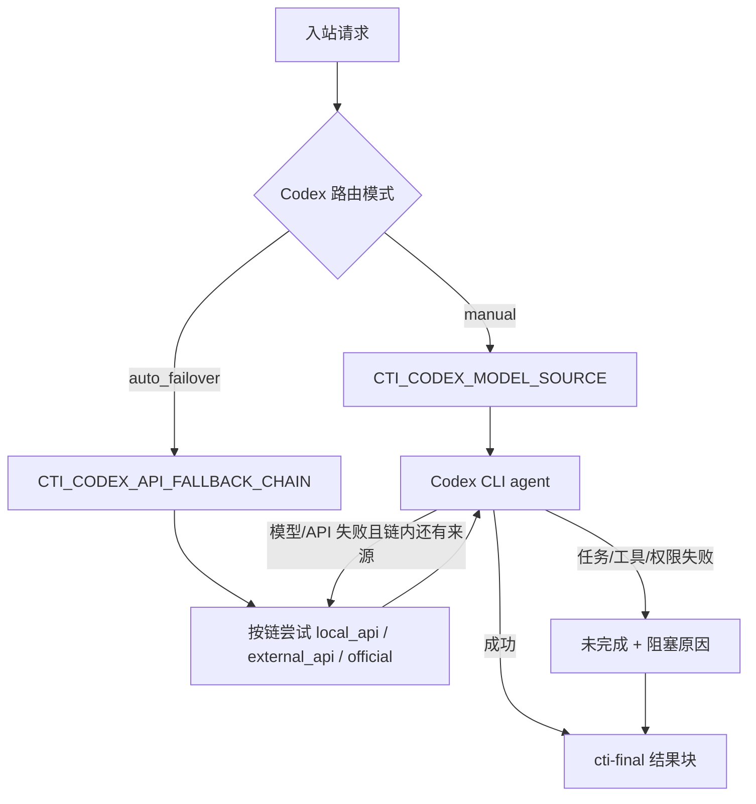

### 2.4 统一计划任务

计划任务运行态唯一位于 `CTI_HOME\data\scheduled-tasks`，不属于项目工作区、Agent Home 或记忆库。`bridge-core` 只处理结构化动作、权限、真实飞书证据和交付呈现；`bridge-runtime` 负责时间计算、持久化、slot 幂等、执行、恢复与投递。

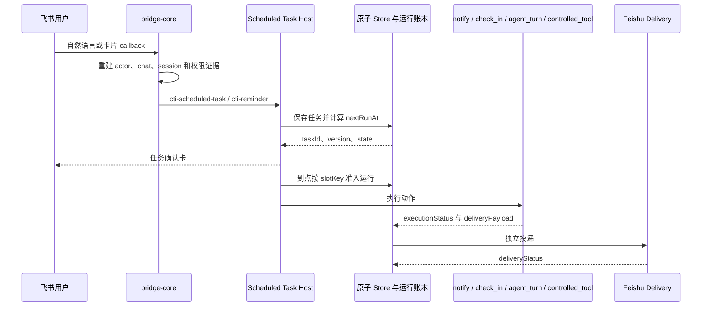

关键约束：

- `notify` 发送固定内容；`check_in` 发送固定正文和 Bridge-owned 原生按钮，每次运行按 `slotKey` 新建独立打卡账本；`agent_turn` 每次运行重新生成结果；`controlled_tool` 只调用 Runtime registry 中 Owner-only 的受控工具。模型把当前群固定通知输出为 `taskAction.kind=direct_message` 时，Core 只在目标类型仍是当前 chat/group 的情况下归一为 `notify`，真实目标继续由当前入站地址重建，模型提供的目标 ID 被审计后忽略；用户私发目标不会被错误改投当前群。
- `check_in` 的 callback 绑定真实任务、运行槽、投递 message ID、当前 chat 与原生 operator。`audience=chat_members` 时优先用群成员 API 复核，低风险成员 API 暂时失败才沿用原生 callback evidence 降级；`audience=owner` 只接受创建者。每人每轮最多一条记录，重复点击幂等返回；卡片只刷新汇总人数，不外发平台 ID，CLI/Host 历史用 `checkInCount` 查询结果。普通回复、表情、通用投票和旧 reminder 的一次性完成按钮都不能写入该账本。
- 同一计划槽使用稳定 `slotKey`，运行记录保存执行状态、投递状态和恢复信息。Bridge 重启后只恢复可证明安全的运行；未知副作用不自动重放。
- 执行成功但飞书投递失败时保存原 delivery payload，只重试投递，不重新运行 Agent。
- `agent_turn` 的绑定工作区每次重新解析，不可用时失败关闭。`workspaceMode=none` 会为当前回合创建只读临时空白沙箱，构造唯一 `TurnWorkspacePlan` 并传给所有 Provider；沙箱不挂载注册项目、`CTI_HOME`、记忆库或上传缓存，回合结束后立即清理，因此不会回退默认 cwd。
- `scheduled-task-cli.mjs` 提供 Store 级 list/get/pause/resume/delete/history/status 和旧 direct reminder 迁移；它只依赖无自启动副作用的进程停止门禁，保证单文件 bundle 向控制面板 Gateway 输出纯 JSON。需要活跃 daemon controller 的 run-now/cancel-run/retry-delivery 当前明确返回未开放，控制面板按 capabilities 禁用。
- 旧 `data\todos\direct-reminders\*.md` 只读兼容；迁移默认 dry-run，Apply 前检查 Bridge/watcher、校验 source hash、备份、冲突不覆盖并写迁移清单。新提醒不再进入记忆 Markdown。
- `extensions/skills/manage-codex-im-scheduled-tasks` 只指导 Agent 选择动作和协议，不直接操作 Store 或飞书 API；`config/skills.d/manage-codex-im-scheduled-tasks.json` 把它注册到控制面板和统一 Skill 生命周期，避免源码存在但运行入口不可发现。

## 3. 核心包职责

### 3.1 packages/bridge-core

核心职责：

- Channel adapter 抽象。
- Feishu/Lark 适配器。
- 消息路由和 session 绑定。
- 权限请求和高危操作门禁。
- 飞书 Markdown/card/image/file/reply 发送。
- 图片出站只使用当前回复显式给出的图片路径：`cti-final.images` 或当前可见文本中的本地图片路径。出站层不再扫描最近 assistant 历史消息补发旧图，避免截图/预览任务失败时把历史截图误当成当前结果。
- 最终结果块解析和出站收口。
- `cti-scheduled-task` 动作块解析、合理 `direct_message -> notify` 兼容、可信飞书目标/actor/session 重建、分层字段错误报告、权限门禁和伪完成拦截。
- `cti-reminder` 与 `/remind` 低风险单次提醒兼容，并优先转换为统一 `at + notify` 计划任务。
- `cti-direct-message` 动作块解析、Feishu 私发/跨会话目标解析、owner 二次确认、发送请求转交和伪完成拦截。
- `cti-bridge-control` 的短句“重启”确认只消费 Context Broker 裁决出的唯一可靠 `native_reply`：被回复的机器人/应用正文必须明确邀请用户重启 Bridge。普通近邻、memory、不可读卡片壳和用户消息不能扩大重启授权；Owner 与固定 `restart_live` Host 门禁继续生效。
- 运行审计落盘。

关键能力：

- Feishu 群聊原生 reply。
- 群聊 reply 只表示引用消息，不自动 @ 提问人。已有结构化 `cti-final.mentions` 仍必须与真实 mention evidence 求交集，模型不能自行创造 ID。对于没有结构化 ID 的显示名执行请求，bridge-manager 先从当前用户原文提取明确目标，用 adapter inspector 对当前群官方成员/机器人 evidence 做 Provider 前只读预检；最终交付再由 FeishuAdapter 唯一解析，Agent 是否主动写出裸 `@显示名` 不再决定平台查询是否发生。用户未明确要求执行、模型单方面出现名字、题面/引用/说明中的裸 @、历史名字、广播和关系描述不会触发 resolver。未命中、歧义或平台查询失败时只移除未验证的 `@` 标记、追加未投递状态，保留正常答案、Markdown 模式和附件。
- “怎么 at / 为什么 at 不了 / at 后不回复”这类解释或诊断型 mention 问题不会触发原生 mention 发送，正文中的 `@名字` 只作为示例或问题对象展示；其他普通出站文本同样不走 resolver 快捷解析。
- Feishu mention 规则不得写死某个机器人名或现场玩法词。紧凑称呼句只使用 adapter 当前助手身份、本轮 `feishuBotWake.alias` 或原生 @ 作为唤醒证据；流程规则、步骤说明、等待别人点名、未来“我会/主持人会/参与者会 @”和“一个/某个/另一个/你们/成员/机器人”等泛指目标只作为上下文交给 agent，不触发 native mention 补全、resolver/inspection 或假 @ 拦截。
- Feishu 私发和跨会话发送走 `cti-direct-message` 受控动作：模型只声明目标和正文，bridge-core 校验用户原文与动作目标一致的明确授权，FeishuAdapter 复用 mention 候选解析为唯一用户 ID 后调用平台一对一发送；“我 / 本人 / 发起人 / 发送者”会解析为本轮 sender ID，成员列表不可用时也能给当前发送者私发，但不会把群名当人名。name-only `targetType=user` 仍属于普通人员私发；只有声明 `targetId/chatId/sessionId` 或 `targetType=chat` 的跨群、跨会话或按 ID 发送才升级为 owner-only，并在源会话展示目标名称、类型、平台 ID 和确认卡。私发表情包只能消费 bridge 本轮基于真实候选附件签发的 `VerifiedMediaAction`，以 `msg_type=sticker` 发送；用户文字、模型 marker 或未验证 file_key 不能单独授权媒体。确认卡和源群结果不回显待发送正文，目标不唯一、确认过期、非 owner 点击或 resolver 不支持时只返回未完成。
- 群聊 mention 判定优先使用事件 `mentions`，事件缺字段时再解析正文里的飞书 at 标记，避免“已 @ 机器人但消息未入会话”。
- Feishu Markdown 默认走 card。
- Feishu streaming card 等待态只展示当前一步用户可见思考动作：卡片正文由彩色阶段标题、灰色小字正文和通用阶段轨迹组成，随着模型/provider progress、记忆证据、工具事件或收口阶段刷新，不累计历史步骤，不写入最终回复或会话历史。允许展示经过改写的“处理思路 / 依据 / 正在识别或核对的对象”，但必须过滤工具名、路径、命令、`JsonTool/tool_*`、MCP 原始事件和 `agent` 内部结果块；当 provider 已给出安全且更具体的进度内容时，不用“正在回复...”这类泛化文案遮住它。
- Feishu streaming card 会在 adapter 侧做增量刷新：每个新思考动作先显示题头，再逐步补齐灰色正文，形成可见的打字机效果；如果下一步到来，会取消上一轮增量刷新并切到新内容。
- streaming card 的传输状态与业务结果分开判定：provider 正常结束不等于任务完成。最终可见正文明确以“未完成 / 失败 / 阻塞 / 已拦截 / 无法完成”开头时，bridge-manager 会用 `error` 收尾并把 continuation 状态记为未完成；`buildFinalCardJson()` 还会从可见正文二次校验，统一使用红色 header 和 `×` footer，避免紫色完成卡包裹失败结果。
- Feishu adapter 启动时会通过 `/bot/v3/info` 读取机器人身份，保存 `open_id/bot_id` 用于 mention 识别，并提取 `name/app_name/i18n_name` 作为本通道的助手显示名。bridge-core 会把该显示名作为高优先级 system context 注入本轮 provider，并放在 system prompt 前部，避免 provider 截断长系统提示时丢失渠道身份。用户问“你是谁 / 自我介绍”时，机器人以飞书应用名作为自己的名字，`Codex` 只作为底层执行引擎说明，不再默认自称 Codex。普通聊天、自我介绍、问候和确认不再走 bridge-core 本地硬编码秒答，而是统一进入配置的 provider/API 模型，由模型结合通道身份和上下文生成回复。
- Feishu 群聊和其他共享会话仍按 session lock 串行处理普通消息；截至 2026-06-05，如果同一 session 已有未完成请求，新消息入队时会先发送一条可见确认，说明上一条还在处理且会按顺序继续回复。这条确认不替代最终回复，也不改变 provider 执行顺序。
- Feishu 文本、Markdown card 和 streaming final card 出站都支持通用 reaction hint：普通文本或最终结果开头的 `[表情]` 会先尝试转成被回复消息上的原生 reaction，再发送或渲染剥离 hint 后的正文；对于 `[微笑]`、`[赞]`、`[OK]`、`[BULL]` 等已知 hint，即使 reaction API 不可用、权限失败或没有可回复的源消息，也会剥离 hint 并用对应 Unicode emoji 作为可见兜底，避免把 `[微笑]` 这类内部发送指令展示给用户。未知 reaction 类型失败时保留原文，避免吞掉用户本来想发送的括号文本。provider prompt 会提示模型只在轻量聊天、确认、问候、表情包接话等场景偶尔使用 Feishu 原生 reaction hint，并必须按实际意图选择；不能把 `SMILE` 当默认表情，语气中性、正式、阻塞或不明确时应不加表情。
- Feishu reaction hint 不再由 adapter 内硬编码别名表维护。开发版 catalog 位于 `config/feishu-emoji.d/*.json`，`suite.manifest.json` 声明 `config.feishuEmojiCatalogDir`，live 同步脚本会复制到运行版 `config\feishu-emoji.d`；每个条目声明 `emojiType`、中英文别名、语气/意图和 Unicode fallback。adapter 加载 catalog 后解析 `[微笑]`、`[火]` 等别名，也允许合法的未知 `emoji_type` 透传给飞书 API；出站成功/失败和入站 reaction 事件会写入 `CTI_HOME\data\feishu-emoji-profile.json`，按 chat/user 统计偏好，再通过 `getEmojiPresentationPrompt()` 注入轻量聊天 prompt。profile 只影响表达选择，不作为工具执行证据，也不能覆盖正式工具结果、阻塞或安全回复的收口规则。
- Feishu 入站 `sticker` 表情包消息会先按 `file_key` 记录到记忆仓库 `data/im/feishu/stickers/stickers.json`。adapter 通过独立 `FeishuStickerMediaCache` 优先复用记忆仓库 `data/im/feishu/stickers/media` 中已经存在的同 `file_key` 图片；没有 media 时会用当前消息资源做一次图片获取尝试，成功则按文件头嗅探真实 MIME，并以 `.png/.jpg/.gif/.webp` 等真实扩展名写入 media，再作为 provider 的视觉语气参考，让模型判断情绪、态度或玩笑语气后直接接话，但最终回复不能写成“图片里是……”的说明报告。资源获取失败时在该 sticker 记录上写入 `mediaDownloadFailedAt/mediaDownloadError`，同一资源会进入 15 分钟冷却；冷却期内不重复请求，期满后可由后续消息再次尝试，避免永久放弃仍可恢复的图片。记忆 media 命中或本轮下载成功时标记 `messageKind=feishu_sticker_image`；没有 media 时退回 `messageKind=feishu_sticker_unknown|feishu_sticker_known` 和 `raw.sticker.fileKey` 元数据。历史同步只登记 `msg_type=sticker` 的 `file_key`、消息来源和水位，不批量下载媒体；对于旧本地索引中只有 `[sticker]`、没有 `file_key` 的记录，系统不会伪造图片内容。用户显式要求发/回表情包时只能复用已有可信语义；若可信候选缺媒体，最多补取一个已验证候选并缓存，不能扫描工作区、批量回捞历史或只凭 `file_key` 猜图案和意图。
- Feishu 出站 sticker 仍由模型返回的 `[表情包]` / `[表情包:别名]` hint 触发，adapter 只复用记忆仓库 `stickers.json` 里真实存在且未禁用的 `file_key`；裸 `[表情包]` 会优先通过名称、描述、意图、语气、用法、示例和避用场景与当前回复语义匹配后选择。语义分词会对中文轻聊天助词做通用归一化，例如把“啦 / 喽 / 咯”按“了”的语气变体参与 n-gram 匹配，使“来啦来啦”和“我来了”这类同义表达先命中语义候选。显式“发/回/随便来个表情包”请求会额外把候选图片交给 agent，并要求返回隐藏 `cti-sticker-candidate-analysis`：其中 `annotations` 是基于本轮候选图片的看图语义，`selectedFileKey` 只在图片语义适合当前请求时填写。bridge-manager 只接受 `attachedFileKeys` 白名单内的候选，且要求看图 annotation 同时具备有效置信度、达到自动发送门槛、包含具体画面/情绪/用途/语气语义，才会补精确 `[表情包:file_key]`；模型幻觉出的未附加 `fileKey`、缺少语义 annotation、缺置信度、低置信视觉标注、只有“表情包/用于聊天”这类泛词或不可读图片不会触发精确发送。FeishuAdapter 也会对模型直接输出的精确平台 `file_key` 做同一可信语义校验：该 key 必须存在于本地表情包库，且来自带置信度的视觉语义或人工审核语义，不能用未核验用户解释、source-less 旧语义、泛泛语义或低置信标注绕过。若这是用户明确要求“发/回/来个表情包”后由 bridge-manager 补出的轻量 hint，且剩余回复文本太泛导致没有重合命中，adapter 只允许从已有可靠语义档案且未被 `avoidWhen` 排除的 sticker 兜底选择；不会在缺少可靠语义时按最近或高频候选轮换，不能伪造别名或 file_key。
- Feishu 普通图片如果没有附带文字指令，bridge-core 不再把 provider prompt 写成 `Describe this image.`。图片-only 消息会被视为一种对话消息载体，模型需要先结合图片内容和会话上下文推断用户的沟通意图与期望动作，再回应这个意图；只有用户明确要求描述/转写时才做纯 OCR、标题化或图像说明。如果真实意图仍不明确，才问一个简短澄清问题。
- Feishu P2P 私聊 WS 可能漏事件，adapter 会通过历史轮询恢复新消息；恢复消息必须保留 `root_id`、`parent_id`、`thread_id` 和 `upper_message_id` 等 reply 元数据。若用户回复上一条图片、文件或富文本图片继续提问，adapter 会用这些元数据补取被回复消息附件，并把原图作为本轮 provider attachment 传入模型，而不是只给当前文本。
- Feishu `sticker` 入站会同时写入结构化 `messageKind=feishu_sticker_image|feishu_sticker_unknown|feishu_sticker_known`，并且只在有可信历史档案时把 `label/description/intent/tone/aliases` 作为事实参考上下文注入。可信档案必须来自人工审核或带有效置信度的视觉标注，并且不是泛泛“这是表情包”语义；source-less 旧档案、缺置信度视觉档案和用户解释只作为“待核验历史语义线索”注入，不能标成 known。`ExecutionRequirement` 和 `ReplySurfaceMode` 优先识别该结构化事件，表情包消息按轻量聊天处理，不会因为说明文本里出现“图片 / 图案 / 下载”或 adapter 复用了记忆 media 附件而误触发 `artifact_required` / workflow card；真正图片附件、截图、Unity/MCP 和文件产物请求仍按原有证据门槛执行。
- 记忆仓库中的 `stickers.json` 支持表情包语义档案字段：`label`、`description`、`intent`、`tone`、`usage`、`avoidWhen`、`examples`、`annotationConfidence`、`annotationSource`、`annotationVerifiedAt` 和未核验 `userAnnotation`，并向后兼容 `disabled`、`disabledReason`、`lastEditedAt`。用户回复某个表情包，或紧接着用自然语言说明“这个表情包表示/叫/意思是/适合用于...”时，adapter 只把名称、含义、语气和适用场景写入 `userAnnotation` evidence；其中原生 reply 必须精确指向已记录的 sticker 原消息，不能在回复机器人卡片、普通文本任务或其他消息时退回“最近未标注表情包”；无 reply 的说明必须显式出现“表情包 / 表情 / sticker”，普通“这个群是干啥的 / 这个项目是...”这类任务句不进入 sticker 学习链。如果本地已有 media，会把该图片作为本轮附件交给 agent 视觉核验。只有 `annotationSource=vision` 的看图标注或 `annotationSource=manual` 的人工审核语义会进入主字段、prompt 候选和后续发送选择；旧版本中由文本解释写入且 `learnedFromMessageId` 不等于原 sticker `messageId` 的记录会自动降级为 user evidence。控制面板“记忆”页的“Feishu 表情包库”可查看缩略图、搜索、重命名、编辑语义、合并别名、禁用或恢复误学语义，并按真实 MIME、扩展名不一致、可信语义、仅用户解释、下载失败、已缓存待视觉标注和仅历史 key 分区显示审计状态；默认列表不显示纯历史 key 或纯媒体下载失败壳，后者只在“媒体失败”筛选中作为异常证据查看；`memory.auditFeishuStickers` 用同一读库口径返回计数诊断。禁用项不会进入 prompt、语义匹配或裸 `[表情包]` 候选。
- Feishu 出站支持通用 sticker hint：模型可在最终可见结果开头输出 `[表情包]`、`[表情包:别名]`、`[sticker:file_key]`，也兼容模型偶发的 `[表情:别名]`；adapter 只会在别名或显式合法 `file_key` 解析到已记录且可信的表情包时发送真实 `msg_type=sticker`，再从文本/card 正文剥离 hint。具体别名必须命中来源为视觉/人工审核或已核验的可靠语义档案，`source=user` 的用户解释 alias、source-less 旧文本教学残留、缺置信度视觉标注和泛泛语义不会触发发送；未命中时只发送剩余普通文本，不 fallback 到任意表情包，禁止伪造或错发表情包资源。bridge-manager 会通过 `getStickerPresentationPrompt()` 注入当前 chat 已学习且未禁用、且来源为视觉/人工审核的表情包库，但只提示模型在 sticker 确有独立社交含义时偶尔使用，不能把它当每轮装饰。对于单个通用请求，adapter 已有可信 `preferredFileKey` 时只作为候选 evidence 注入 provider；AI/provider 输出 `[表情包]` 后，bridge 才可用本轮可信候选补成真实 sticker，禁止 provider 前直投或改走 imagegen。没有可信候选时，候选图片会作为本轮附件进入受控视觉分析。若模型已唯一输出属于本轮实际附图的精确 `[表情包:file_key]`，却完全漏写隐藏 `cti-sticker-candidate-analysis` 块，bridge 仅可一次性投递这一真实选择，绝不写入长期可信语义；一旦存在分析块，仍必须通过有效置信度和具体画面/情绪/用途语义门槛。sticker 发送会先尝试回复原消息；如果 reply-scoped sticker API 失败，则记录原因并退到同一 `chatId` 的 `im.message.create` 直发同一个 `file_key`，避免 hint 被卡片清理后静默退化成纯文本。
- 一次性选择通过 `VerifiedMediaAction` 跨 `bridge-manager -> BaseChannelAdapter -> FeishuAdapter` 传递，普通投递和 streaming final card 共用同一交付校验：只有 bridge 根据本轮真实附件和模型唯一精确选择构造、且动作 `key` 与可见 hint 完全一致的许可，才能临时越过长期语义档案门禁；许可不落库，模型或用户文本中的裸 key、来源不符或 key 不一致的动作仍按原门禁降级为文字。
- Feishu 出站的 sticker/reaction hint 属于用户不可见动作指令。可信 sticker 已真实发送成功后，`application/stickers` 会判断剩余正文是否只是“给你一个 / 已发送 / 来啦”等动作复述：若 sticker 已足以完成短社交回复，Card lifecycle 会撤回机器人自己的临时进度卡，只保留原生 sticker，并把 continuation/outbound ref 绑定到真实 sticker message_id；撤回失败才回退为“已回应”的正常最终卡。非明确请求还要经过 10 分钟会话冷却，连续轻聊不会每回合附加贴纸；明确“发个表情包”不受自主冷却影响。reaction 仍在成功后剥离 hint，并在失败时保留可读文字兜底。
- Feishu final card 标题从最终正文提取，但“失败 / 未完成 / 报错 / 错误 / 阻塞”只有出现在标题开头时才归类为失败标题；成功摘要正文中转述群聊里的“报错”等词，不会把卡片标题误判成“未完成”。
- 表情包发送记录区分 `lastSeenAt` 和 `lastUsedAt`。`lastSeenAt` 只表示最近收到或学习到该表情包；`lastUsedAt` 表示机器人最近发出该表情包。轻量聊天的表达顺序不是“每轮都选一种表情”，而是先判断是否真的需要表达动作：有匹配且通过自主冷却的 sticker 才可发送；否则根据意图选择明确 reaction 或自然文字，正式工具结果、错误、阻塞和文件/命令输出不主动添加表情。裸 `[表情包]` 只表示“按已学习语义为当前回复选择表情包”：候选必须有名称/描述/意图/语气/用法等可靠标注，并优先和剩余正文达到语义命中门槛；显式轻量请求的正文太泛时，也只能从已标注候选中兜底，不能用仅有 `file_key`、默认别名、最近收到时间或使用次数的资源轮换发送，未命中时降级为可读文字或 reaction。`[微笑]`、`[赞]`、`[OK]` 等 reaction hint 仍会转成 Feishu reaction 并在失败时用 Unicode 兜底，但 reaction profile 的出站成功次数只作为弱信号，`SMILE` 不再因历史成功多而成为默认首选。
- Feishu 回复展示由 `ReplySurfaceMode` 分层：`workflow_card` 由真实 workflow/progress 事件驱动，例如记忆命中、桥接前置检查、provider progress、工具事件、权限等待或已经存在的 workflow 检查点；`light_status` 用于表情包、问候、确认和暂未出现真实 workflow 事件的轻量消息，延迟短暂显示“正在回复…”状态且不展示工具选择、证据判断或上下文步骤；`plain_delivery` 用于不支持卡片或无需等待态的普通投递表面，不表示内容快答。轻量消息若很快完成，不创建进度卡；若状态卡已经出现，后续真实 progress/tool 事件会把同一张卡升级为 workflow 展示，最终结果也复用同一张卡收口。
- 飞书 Docx、Sheets、Base 入站链接会先走运行时云文档 host；bridge-core 只接收结构化结果，不持有应用 token 或用户 OAuth token。runtime 先尝试应用身份，失败且确需读取发起人私有资源时才触发官方 OAuth；普通 bot 消息链不进入 OAuth。云文档内容会被整理成 `Feishu cloud document evidence prompt (agent context, not a final reply)` 注入 agent system prompt，由 agent 回答、总结或分析，不作为固定摘要或确定性内容回复。
- `/feishu` 是 Owner 诊断入口：按飞书开放平台能力列出消息、资源、历史、reaction、CardKit、应用 token 云文档直读、用户 OAuth fallback、Docx、Sheets、Base 等所需 scope，并和 `CTI_FEISHU_GRANTED_SCOPES` 做本地差异检查；不会读取或显示 App Secret。
- 图片和文件由结果块显式声明，桥接不再靠正文猜路径。
- 飞书本地图片和本地文件分别走原生 image/file 消息回传；`.glb` 等非图片资产不能退化成仅发本地路径。
- 超过飞书 IM 单文件上传限制的生成资产改发文档链接或下载链接，不再假装“已发送文件”。
- 本地 `cti-final.files` 文件超过飞书 30MB 单文件限制时，出站层不再分卷，而是走 artifact delivery provider；飞书场景优先支持 `feishu_docx`，会自动创建新版云文档、把文件作为 `docx_file` 附件挂入文档，并回文档链接；也保留 `local_http` 作为公网目录备用方案。
- 计划任务是受控 Host action，不是内容快答：Codex 可通过 `cti-scheduled-task` 创建周期或动态任务，`cti-reminder` 只作为单次低风险兼容协议。自然语言请求必须先交给 agent 判断，不能由 bridge 在 provider 前正则直建。可见回复只展示真实 Scheduled Task Host 执行摘要，防止 Codex 或本地 profile 自行声称“已创建系统计划任务 / 已实际发送”。
- 新计划任务确认卡使用 `scheduled-task:pause|resume|run|history|delete|retry-delivery:*` callback，并复用统一任务角色门禁；逐轮打卡使用独立的 `scheduled-check-in:<taskId>:<slotKey>` callback。旧记忆待办/旧 direct reminder 的完成卡仍保留 `reminder:complete:<reminderId>` 只读兼容，三类 callback 不混用。计划任务 `notifyTargets` 只来自本轮 Feishu 原生 mention 和受控 resolver evidence，到点投递通过结构化 mentions 原生 @ 对应成员。
- 在线扩展安装只由 `/ext search`、`/ext install`、`/ext remove` 和扩展安装/移除确认卡进入确定性链路；自然语言里的“搜索模型 / 找插件 / 装 skill”必须先进入 agent/provider 判断，不再在 provider 前扫描用户文本触发目录搜索。搜索只展示候选，安装和移除必须发确认卡片。卡片按钮 callback data 使用 `extinstall:confirm:<nonce>` 或 `extinstall:remove:<nonce>`，不复用 `perm:*` 权限按钮。
- 扩展安装和移除确认只允许同一 chat、同一 Feishu user 且具备 `Owner` 角色的发起人点击；bridge-core 只做命令解析、权限和卡片交互，不直接写扩展目录。
- 用户回复到上一条图片/文件时，Feishu adapter 会尽量读取被回复消息并把附件并入本次请求。
- `bridge-runtime-audit.json` 记录最后阶段、最后消息、WS 状态、p2p 补捞状态。
- 权限门禁统一通过 `hasRole(message, role)` 判定；`Owner` 包含 `Operator` 和 `Viewer` 能力，`Operator` 包含 `Viewer` 能力。关机、发布、越权路径和 mutating 直达命令只允许 `Owner`，普通工具授权和中风险运维允许 `Operator` 或 `Owner`。

### 3.2 packages/bridge-runtime

核心职责：

- 读取 `config.env`。
- 启动 daemon/supervisor。
- 接入 Codex / Claude CLI provider。
- 接入本地模型 API 作为 Codex agent 的 `local_api` 模型来源（默认 Ollama，也支持可验证的 OpenAI-compatible 后端）。
- 保留历史本地执行器的只读和受控工具边界，不作为绕过 agent 的独立最终回复入口。
- MCP manifest 解析和调用。
- 本地 JSON store。
- 记忆检索、Feishu 历史索引、`memory-profiles.json` 轻量画像索引和 Markdown 知识库索引。
- workflow / executor 观测、运行中请求恢复信息持久化、bridge 重启后的可恢复状态识别和 retry worker。
- workflow contract adapter：保持 `workflow-runs.json` 落盘格式不变，同时映射到共享 `WorkflowRunContract`，让控制面板和后续 node agent 不再直接耦合内部 JSON 字段。
- 扩展目录 host：Skill 搜索、准备安装和确认安装转交同一 `SkillLifecycleService`；MCP、模型和 Plugin 等非 Skill 类型继续保留原 Control API 兼容入口。旧 `extension.remote.install` 即使命中 Skill 也会后端转交 lifecycle，不允许绕过来源与审批策略。
- Skill Registry / Lifecycle：扫描并合并 manifest、草稿、禁用项和正式安装项；通过官方 `skill-creator` / `skill-installer` 脚本执行创建、校验和安装，统一处理审批、审计、原子替换与回滚。
- Prompt Snapshot Store：接收 bridge-core 生成的脱敏 Snapshot，以原子 JSON 文件保存短期运行证据；Snapshot 写入失败只影响观察能力，不阻断 provider 或消息交付。
- 统一计划任务：`scheduled-tasks/*` 负责 at/every/cron、原子 Store、CAS、quarantine、slot 准入、运行账本、执行/投递分离、重试、重启恢复和旧 direct reminder 迁移；`scheduled-task-host.ts` 适配 bridge-core Host 与飞书卡片，`scheduled-task-cli.ts` 为控制面板和人工诊断提供正式入口。
- Agent Home / Self-Maintenance Host：从配置的记忆根读取三份核心 Prompt 文档和当前稳定工作区档案，调用独立 JSON classifier 裁决候选纠错、结果归档和已有规则效果，并在 runtime 存储层执行 evidence 校验、受控 patch/upsert、事务恢复、规则生命周期、版本备份、脱敏指标、非破坏归档、审计、回滚与索引重建；凡机器状态提供人类可读视图，必须在同一写锁事务内刷新确定性 Markdown 投影，投影失败回滚机器 mutation，受控区块外用户正文保持不变。每轮 `ensureAgentHome` 还会无时间戳噪声地刷新人类文档治理清单。仓库侧 `check-human-documentation.mjs` 根据真实 Git diff 拦截“实现已变但开发日志/架构文档未同步”的阶段提交，不自动生成语义正文。bridge-core 只传结构化回合事实和 classifier 跳过事件，不知道 `E:\cli-md` 等具体路径。
- Sticker Semantic Evolution Host：runtime 独占 revision、delivery、feedback、版本、迁移和人类投影写入；classifier 使用 strict JSON、禁工具、无工作目录并校验真实 evidence/scope ID。Prompt builder 只为当前 global/chat/user 范围生成独立 `expression.sticker-semantics` section，归档、拒绝、回归和未核验语义不进入可用策略；CLI stdout 保持纯 JSON。
- Feishu OAuth 和云文档 host：先用应用 `tenant_access_token` 读取 Docx / Sheets / Base，应用无权且任务需要用户私有资源时再使用发起人 OAuth token。官方层使用 `accounts.feishu.cn/open-apis/authen/v1/authorize`、PKCE 和 `accounts.feishu.cn/oauth/v3/token` 完成授权、换取与刷新；治理层按用户隔离 state，并为同一用户保存可并存的最小 scope 加密 Token grant，兼容读取旧版单 Token 文件；按任务计算最小 scope，以 `userId + normalized scopes` 去重授权卡，并将多个等待任务持久化到同一 state 后逐个恢复。callback 模式按需启动公网回调监听，manual 模式让用户把 `code/state` 回调 URL 发回飞书；读取失败时会按具体接口返回需要检查的只读 scope，避免把权限不足伪装成空内容。
- Feishu CLI 用户授权 host：接收 bridge-core 从真实工具对提取的 `cti-feishu-cli-user-auth/v1` challenge，只允许 Owner 为本机共享 `lark-cli` 用户身份授权。Windows/Codex 常见的 PowerShell `-Command '...'` 包装会让末尾 `--json` 后直接出现闭合引号，布尔 flag 解析按 shell 参数边界兼容引号、分号和右括号，但不接受相似长参数；challenge 仍须同一工具对、官方 URL、单一精确 scope 和成功结果共同验证。Card 2.0 按最小 scope 展示 `open_url` 按钮，后台 runner 用 argv 调用官方 `auth login --device-code`；同 Owner 与 scope 的并发任务共用一次轮询，成功自动恢复，拒绝/过期发送红色未完成结果。该 host 不持久化 device code、URL 或 token，也不替代 FeishuAdapter 的 bot 长连接。

关键能力：

- 默认执行器来源由 `CTI_DEFAULT_EXECUTOR_ID` 控制；面板“执行器”页可把任一已启用 executor 设为默认或恢复自动，设置页“AI 执行与模型来源”也可选择默认 executor。请求级优先级为显式 `@hint` 高于全局默认 executor，高于兼容的 session default，再进入自动选择。
- Codex CLI 主模型来源由 `CTI_CODEX_MODEL_SOURCE` 控制，可选官方 Codex、本地 API 或外部 API；本地 API 使用 `CTI_LOCAL_AI_*`，外部 API 使用 `CTI_CODEX_*`。
- Codex CLI 模型来源由 `CTI_CODEX_ROUTING_MODE`、`CTI_CODEX_MODEL_SOURCE` 和 `CTI_CODEX_API_FALLBACK_CHAIN` 控制；本地 API / 外部 API / 官方 Codex 都是同一个 Codex agent 的模型来源。自动切换只在模型/API 层失败后按链尝试，链里没有 `official` 时不会调用官方 Codex。
- 记忆索引分五层：Markdown 分区知识库索引、当前会话压缩摘要、按人/按聊天隔离的临时 profile、Feishu 历史片段、`audit.json` 已发结果；不再创建或检索 global profile。运行时按本轮 `memoryMode` 决定是否生成 `MemoryQueryPlan`：普通聊天默认 `off`，不预跑记忆检索；明确回忆请求为 `recall`，工具、Unity/MCP、文件等执行类请求可用 `augment` 少量补充上下文。检索结果会标注来源、置信度、可回答性、质量和结构化 key/value；模型上下文只注入当前用户、当前群和公共长期分区内命中的少量片段，当前请求始终优先。
- Feishu 历史回看是“远端历史 + 本地归档”的双证据链：远端 `feishu-history` 负责确认聊天消息水位和用户原话，本地 `messages` / `message-archives` 用于补回 bot 自己的 `cti-final` 最终答复。检索器不会把 `tool_use`、`tool_result`、命令、路径或日志当成用户答案；即使缺少最终结果块，主记忆摘要也只保留 assistant 的可见文本块，工具审计仍留在 workflow/audit/压缩摘要等专门通道。
- 明确回忆类请求会走 `MemoryReplyDecision`：只有 `quality=high` 的高置信结构化命中才允许作为最终回复证据进入 agent；结构化映射既支持 key 正向命中，也支持按 value/描述反查对应 key，例如“某个场景叫啥”可命中“`scene_id` == 场景描述”表项。最终回答必须按用户意图整理：问“所有 / 全部 / 列表 / 对应表”时保留命中的完整结构化项，只问单个名称时才收窄到匹配项；模糊、多命中、关系图扩展或需要综合的问题只把记忆作为受限上下文交给 Codex，并要求不跑工具、不搜仓库、不编造；未命中时由 agent 明确收口“没找到相关记忆”。普通任务只做上下文增强，不允许因为关键词命中绕过主执行链。
- 记忆意图先于任何长期写入执行：每个无附件、非 sticker 的可处理文本都会调用 `MemoryIntentHost`，独立判断 `ignore / clarify / write` 与 `temporary / user / group / long_term` 范围，不能用“记住 / 记录”等关键词正则作为写入开关。范围、对象或具体事实不能唯一确认时为 `clarify`，bridge 不写入、由主 agent 追问最小缺口；分类器不可用也不回退表格/键值解析写入。`temporary` 只保留在当前 session；持久化范围必须同时满足 human 来源、置信度阈值和结构化候选，并写入带 frontmatter `schema: codex-im-suite/memory/v3` 的白名单分区：`memory/users/<channel>/<userId>/用户印象.md`、`memory/groups/<channel>/<chatId>/群聊记忆.md` 或 `memory/long-term/公共长期记忆.md`。分类、写入与检索只提供 evidence，最终答复仍由主 agent 生成，不允许固定“已记录”回复。
- Markdown 知识库默认位于 `E:\cli-md`，生成 `E:\cli-md\.cti-index\knowledge.json`。索引器优先扫描并接受 `memory/*` 下 schema、scope、channel/user/chat 身份边界匹配的 v3 Markdown，同时在兼容期只读接受 `data/memory/v2`；旧 `data/explicit-memories`、旧 `data/memory`、`docs/*`、根目录笔记和 `data/documents` 不进入知识索引。知识单元分为 `事实 / 结论 / 待办 / 资源`，保留来源文件和片段；显式前缀优先决定分类，Markdown 表格 key/value 会按路径/链接/文件扩展名/Prefab/UIScene/预制体/路径、决策规则词、待办风险词等保守推断分类。
- 知识索引重建后会同步生成 `.cti-index/memory-graph.json`。关系图只来自通过统一 memory source policy 的结构化 key/value、同文件上下文和冲突标记；边类型包括 `maps_to`、`reverse_lookup`、`related_to`、`conflicts_with` 等。精确 key 命中仍优先，关系扩展只作为次级候选和 Codex 上下文增强，不提升为 direct memory reply。控制面板“记忆”页默认用关系树展示选中记忆的对应内容、相关对象、待办提醒、可能冲突和来源文件；TanStack Table 网格、联系权重、索引路径和需要检查的回复保留在高级诊断里。
- 记忆整理草稿保存到 `.cti-index/memory-optimization-drafts`，状态保存到 `.cti-index/memory-optimizer-state.json`。草稿 schema 为 `codex-im-suite/memory-optimization-draft/v1`，包含 `archive` 等动作、原因、置信度、风险、来源分组、默认勾选状态和源文件定位；应用草稿只执行前端传入的 `selectedActionIds`，不会默认批量应用所有动作。v2 用户记忆、群聊记忆和长期记忆可默认勾选低风险重复归档；整理器不再生成 `data/explicit-memories/memory-summary.md`，也不把 docs、根目录笔记或文档索引作为可整理来源。应用前会校验草稿生成时的 `sourceIndexGeneratedAt` 是否仍匹配当前 `knowledge.json.generatedAt`，不匹配时要求重新生成草稿。
- 出站前新增答案审查收口：`bridge-core` 把用户原文、候选回复、memory plan/hits、channel/chat/user 和执行证据交给 runtime/store 的 `reviewOutboundAnswer`。v1 规则检查 mojibake、`cti-final` 残留、低价值兜底、工具假完成、内部工具协议泄漏、缺少成功工具证据的执行完成声明、本地读取缺工具证据和 `memory_key_mismatch`，默认写 `CTI_HOME\data\answer-review-audit.json`；普通 warning 只有显式配置 `block_or_replace` 时才改变飞书可见文本。内部工具协议泄漏会硬替换：如果本轮是明确记忆召回且有高置信结构化命中，审查层先用同一套 `MemoryReplyDecision` 重组用户可见答案；否则替换为不含内部工具名的短阻塞，避免把 provider 内部状态发给用户。
- 出站前还有一层硬验证：`cti-final.images/files` 中声明的本地路径必须真实存在；对于“查看本地目录 / 读取文件 / 搜索项目 / 创建 / 生成 / 写入 / 保存 / 执行”等真实执行请求，只要候选回复声称已经执行或创建了结果，但本轮没有成功 `tool_result`，bridge 会直接把可见回复改为自然中文“未完成”阻塞。`local_read_required / tool_required / artifact_required`、Provider 英文 reason、工具名和证据计数只保留在 workflow/audit，不直接展示在飞书正文；若存在真实失败结果，用户侧最多附一条可行动的具体原因。普通聊天、问候、确认和 `feishu_sticker_*` 表情包轻量消息即使文本里出现“图片 / 已收到”等词，也不会进入这层工具证据拦截。Unity/MCP、web-search 和截图/图片产物类请求在默认模式下也会生成严格 `ExecutionRequirement`，并按 `requiredToolFamilies` 校验工具名，避免普通 `Bash/Edit` 或无关工具结果冒充 Unity MCP、MCP 搜索或产物工具成功。`cti-final` 会先交给出站层解析和本地路径校验，再决定是否拦截，避免通用 no-evidence 文案覆盖“路径不存在”等更具体阻塞。
- `application/input-evidence-delivery-policy.ts` 负责输入附件与输出附件的确定性隔离。Provider 实际收到的 `FileAttachment` 默认只是当前回合的识别、描述、分析或上下文 evidence；模型把同一绝对路径、或只读回合中唯一同名的相对路径写入 `cti-final.images/files`，不构成向用户重新发送的授权。策略按当前请求的结果目的裁决“只读输入 / 交付同一输入 / 生成或编辑新产物”，而不是依赖头像、机器人、群聊、固定文件名或单个关键词；只有请求目的确实要求把源媒体作为结果交付时才允许回传。生成、编辑、标注、转换、导出等新产物仅按完整路径与输入去重，避免误删恰好同名但位于产物目录的新文件。过滤后保留原正文并继续正常交付，编码检查和真实文件存在性验证仍作用于剩余输出。
- `bridge-core` 默认不再对所有疑似命令文本强制生成 `tool_required/local_read_required/artifact_required`，普通聊天、模糊问答和低风险判断仍交给 Codex CLI / agentcli 自主决定；但 Unity/MCP、web-search 和截图/图片产物这类必须依赖外部状态或真实产物的请求默认要求工具证据，不再依赖 `CTI_STRICT_TOOL_ROUTING=true` 才生效。`CTI_STRICT_TOOL_ROUTING=true` 仍用于扩大兼容部署的强制证据范围。Feishu 进度展示不按用户原文或工具类别提前打开 workflow card；它只跟随本轮真实 workflow/progress 事件自动升级展示。若 provider 流结束但没有任何可见最终文本，bridge 会返回“未完成：模型没有返回可展示结果。”，并把 Feishu final card 渲染成带正文的失败结果卡。
- 出站 delivery layer 默认按聊天维度限流，配置键为 `bridge_delivery_rate_limit_max_messages` 和 `bridge_delivery_rate_limit_window_ms`，默认 20 条/分钟；`max_messages<=0` 表示禁用本地限流。该配置只影响 bridge 自身发送节流，不改变平台 429 后的重试和退避。
- 历史乱码修复入口为 `scripts/repair-history-mojibake.ps1`。默认 dry-run 扫描 `CTI_HOME\data` 历史、Feishu 历史索引、记忆 Markdown、记忆仓库 `data/im` 与 `data/projects` 下的长期 JSON 资产，以及 `.cti-index`；显式 `-Apply` 时备份原文件、修复典型 mojibake、重建 `knowledge.json` 和 `reminders.json`，`-Restore <manifest>` 可回滚备份。单个历史文件读取、备份或写入失败时不会中断整轮修复，而是在 `files[].unresolved/error` 和 `unresolvedFileCount` 中报告，便于处理 Windows 锁定文件后再次运行。
- 运行时在 Feishu 历史入库/检索、记忆 profile 入库、Markdown 知识索引和待办提醒派生前会先修复或拒绝疑似坏文本，避免错码继续进入 Codex 记忆上下文或主动提醒标题。
- 控制面板可归档和恢复单个知识单元：归档时按知识单元的来源文件和片段精确删除源 Markdown 中对应行，再把原始行和元信息写入 `archive\knowledge-units\*.md`；恢复时只允许读取该归档目录内的文件，并校验归档记录的源文件仍在记忆仓库内，然后回写原始 Markdown 行并重建索引。`archive` 目录被索引器跳过，因此归档项不会在下一次重建后回到知识单元列表；归档区支持手动恢复或永久删除归档文件。
- 记忆 Markdown 中普通 `kind=todo` 仍由旧提醒索引只读兼容，用于历史待办和完成按钮；它不自动提升为通用计划任务。
- 新单次提醒、逐轮打卡、周期任务和动态 Agent job 统一进入 Scheduled Task Store。自然语言请求先由 agent 判断 `notify / check_in / agent_turn / controlled_tool`；周期请求输出 `cti-scheduled-task`，单次低风险提醒的 `cti-reminder` 和 `/remind` 由 bridge-core 转成 `at + notify`。Codex 只声明可决定字段，不直接写 Store、Windows 计划任务或飞书 API。
- 主动推送状态写入 `.cti-index\reminder-state.json`，记录 `pending`、已发送、失败、跳过原因和完成字段，保证“到点单条提醒一次”不会重复发送。
- 主动推送默认关闭；启用 `CTI_TODO_PUSH_ENABLED=true` 后按 `CTI_TODO_PUSH_CHANNELS` 加载 PushProvider。v1 飞书 provider 复用 bridge-core 的发送收口、去重和审计；微信 provider 只返回 `unsupported`，面板显示“未接入”。
- `completeReminder()` 是飞书卡片和控制面板共用的完成收口：直接提醒必须把 `data\todos\direct-reminders\*.md` 中的 `状态: 未完成` 改成 `状态: 完成` 并重建索引；普通记忆待办只在精确匹配同一待办行时自动改源文件，否则仅记录完成状态和需手动确认的原因。
- 旧 direct reminder Markdown 不再接收新写入；迁移器只转换未完成、时间和飞书目标有效的旧文件，并使用 source hash 防重复。缺失字段或损坏文件进入 `blocked`，不会猜测目标。
- 待办来源会话必须来自 Markdown frontmatter 或结构化字段 `channelType`、`chatId`、`chatType`、`messageId`、`displayName`。直接提醒创建时会把 `chatType=group/p2p` 和可选 `notifyTargets` 一并写入源 Markdown、`reminders.json` 和 `reminder-state.json`，用于区分群聊、私聊目标和到点要原生 @ 的成员。来源无法确认时进入“待补来源”状态，不回退 owner 私聊，也不猜测 chatId。
- 旧规则 Markdown 归档入口为 `scripts/memory/archive-legacy-rules.ps1`，默认 dry-run；显式 `-Apply` 时才移动到 `archive\legacy-rules` 并生成 `AUTHORITATIVE-RULES.md`。
- v2 记忆硬重置入口为 `scripts/memory/reset-memory-v2.ps1`，默认 dry-run；显式 `-Apply` 时会先检查未来 pending 提醒、bridge 运行状态和记忆索引 watcher 状态，备份旧 `knowledge.json` / `memory-graph.json` / 旧记忆分区 / 旧 `memory-profiles.json`，再清空旧索引并创建空的 `data/memory/v2` 分区。发现未来提醒或 bridge/watcher 仍在运行时默认中止；未来提醒需人工确认后传入 `-AllowFutureReminders`，运行态竞态需先停止 bridge，或显式传入 `-AllowRunningBridge` 接受写回风险。
- `bridge-core` 会在收到普通消息和生成最终回复后写入记忆事件；纯问候、感谢、确认、短接话和已学习表情包接话不再走确定性短回复，也不默认携带完整 Codex 上下文。Feishu 群聊被 @ 或回复触发时，adapter 会按需补入被回复消息和最近少量同群消息作为 `Feishu recent conversation context`，用于理解“刚刚/这个/你怎么看/怎么起名/回复一下”等轻量接话，不等同于全量历史检索；若 Feishu 事件缺少可确认的 `parent_id/root_id/upper_message_id`，短回复命令会扩大有界近邻窗口，并只把候选消息标为 `[可能关联上文]`，提醒 agent 这是 best-effort 上文锚点而非确认引用。当前消息的原生 @ 对象会进入 `Feishu inbound actor context`，用于区分发送者、被 @ 的人/机器人和可能的回复目标。明确要求总结或查看群历史的说法会先走 `parseHistoryIntentV2()`，范围词包括“群聊 / 聊天 / 消息 / 记录 / 群里 / 群内 / 本群 / 这个群”，也包括“上面消息 / 上面那条卡片 / 上文 / 前面消息 / 上一条 / 上几条”等回看上方消息表达；命中后会同步并检索 Feishu 历史索引，生成受控历史上下文 / evidence prompt 注入 agent system prompt，由 agent 总结或回答，而不是降级为 `light_chat` 的近邻上下文。默认轻量接话才进入 `light_chat` 链路，使用轻量 reply surface、短历史窗口、按需记忆策略和 Feishu 表情表达策略；只有文件、命令、MCP、Unity、Blender、飞书文档、截图/图片理解、发布、错误排障、阻塞或正式交付请求才进入完整工具链。
- `memory-profiles.json` 只用于当前用户和当前群的有界临时上下文摘要；它不创建全局档案、不能写入记忆仓库、不能把未分类的聊天内容提升为长期事实，也不能绕过主 agent 直接作答。bot/system 消息可作为有界上下文 evidence，但不能提升进入任何 durable 分区。
- MCP 工作目录检查，防止误连其他项目。
- 路径配置页只把默认工作目录、允许根目录、记忆仓库和 Codex 附加目录作为一等配置；默认工作目录只表示 agent 的起步项目，允许根目录表示可访问范围。临时图片/附件缓存默认进入 `CTI_HOME\runtime\uploads` 或 `CTI_UPLOAD_CACHE_DIR`，Feishu 表情包长期资产进入记忆仓库 `data/im/feishu/stickers`，不再把 Unity 工程或仓库根目录当缓存桶。Unity 工程、常用场景、素材目录等项目事实应通过记忆仓库的项目事实记录显式保存，避免全局路径字段把单个项目固化进 bridge。
- `workflow-runs.json` 保存最近 workflow run、事件、recovery 和 retry 状态；它是控制面板展示执行历程、手动重试失败 run 和 bridge 重启后自动续跑的事实来源。`workflow-failure-ledger.json` 是独立脱敏观察账本，最多保留 5000 条，使用 `nextSequence / retainedFromSequence` 显式证明扫描水位与可能缺口，不受最近 80 条详细 Workflow 的滚动窗口影响；账本写入失败不得阻断 Primary、Delivery 或真实 Workflow 终态。
- Windows daemon 的 `stop / restart / uninstall-service` 在终止 live 进程前统一调用 `scripts/workflow-drain.ps1` 轮询该事实源；只要仍有 `running/retrying` run 就继续等待，默认 30 秒超时后以 code 12 延期终止，避免切断正在执行、收尾或重试的任务。`CTI_WORKFLOW_DRAIN_TIMEOUT_MS`、`CTI_WORKFLOW_DRAIN_POLL_MS` 和显式恢复逃生口 `CTI_FORCE_RESTART_WITH_ACTIVE_WORKFLOWS` 从 `config.env` 优先读取，命令行 `-Force` 只作为明确人工恢复入口。控制面板和机器人受控重启向 daemon 写入固定来源，裁决结果追加到 `workflow-lifecycle-audit.jsonl`，只包含动作、来源、活动数量、阶段和 allowed/postponed/forced，不包含正文或身份。所有重启动作复用同一 daemon 入口，不再自行 stop/start 绕过 drain。
- 扩展确认动作写入 `C:\Users\admin\.claude-to-im\data\extension-install-actions.json`，默认 TTL 10 分钟；确认时校验 nonce、chat、user 和过期时间，通过后调用 Control API 的 `extension.remote.install` 或 `extension.remote.remove`。

### 3.3 packages/contracts

共享契约包，定位为控制面、runtime、node agent 和扩展市场之间的类型边界。

用途：

- 定义 Control API 通用响应、错误、命令、服务状态和运行单元 DTO。
- 定义 `WorkflowRunContract`、checkpoint、trace event、recovery、delivery，以及 `WorkflowFailureLedgerContract` 的单调水位与脱敏失败指纹字段。
- 定义 node agent heartbeat、capability inventory、action lease 和 log stream 的第一阶段 schema。
- 定义 extension capability、trust policy、credential scope 和 manifest 风险等级字段。
- 保存 JSON schema snapshot，支持后续 backward-compat fixture 和跨语言 DTO 对齐。

当前边界：

- TypeScript 是第一阶段事实来源，C# Control API 和 React 前端先消费等价字段结构。
- 第一阶段只做契约和只读状态，不引入数据库、远端执行租约或公网 marketplace。
- `scripts/build-packages.ps1` 会先构建 `contracts`，再构建 bridge/runtime/MCP 包。

### 3.4 packages/mcp-picture

图片相关 MCP，定位为独立能力包。

用途：

- 图片标注。
- 视觉布局辅助。
- 图片工作流中间能力。
- 生成图片默认或相对 `output_path` 必须结合 runtime 注入的 `artifact_root` 解析；缺少受控根时失败关闭，禁止回退 `process.cwd()\output`。显式绝对路径保留给已通过上层项目写入门禁的调用。

### 3.5 packages/mcp-unity-prefab

Unity Prefab MCP，定位为独立 Unity 资源分析/生成能力。

用途：

- Prefab 扫描。
- Prefab 数据服务。
- Unity 资源侧辅助。
- Prefab 预览图的默认/相对输出同样基于 `artifact_root`，`render-sheet.ts` 只接收解析后的受控路径，不再把相对路径拼到 MCP 进程 cwd。

### 3.6 packages/mcp-ignis

Ignis CLI MCP，定位为创意生成能力包。

用途：

- 原画、概念图、生成图、视频和 3D 模型任务提交。
- `turn_id`、`session_id`、`canvas_id`、`file_id` 的结果查询。
- 本地参考文件上传到 Ignis。
- 会话历史、可用 Ignis 内部技能和中断追问恢复。

接口：

- HTTP MCP：给面板和受控本地能力使用，默认 `http://127.0.0.1:8787/mcp`。
- stdio MCP：给 Codex `codex mcp add` 注册使用。
- 本机 CLI 配置：`C:\Users\admin\.ignis\config.json`。

安全边界：

- Ignis config URL 和 token 不进入仓库、release 包或日志。
- 生成任务默认异步提交；桥接内部保存 `turn_id`、`session_id`、`canvas_id` 和 `file_id`，飞书侧默认只发送用户可见摘要和可回传附件。
- 模型资产后处理只读取本地已下载的 Ignis GLB/GLTF；依赖本机 Blender 或 `BLENDER_EXE`，找不到 Blender 时只报告拆分失败，不伪造 FBX/贴图结果。

## 4. 控制面板

位置：

- `apps/control-panel`
- `apps/control-panel/web`

职责：

- 启停 Feishu bridge。
- 查看真实进程状态。
- 查看 Feishu WS 和私聊补捞状态。
- 查看 Codex / Ollama 模型来源和本地能力状态。
- 启停和检查 MCP。
- 自动发现 `mcp.d`、`skills.d`、`plugins.d`。
- 展示 suite 版本、扩展协议版本、启用扩展数量、缺失依赖和本机配置覆盖数量。
- 通过“设置”弹窗修改非敏感路径配置和回复风格配置。
- 通过“查看会话”弹窗查看会话、历史索引检索和同步状态。
- WebView 会话列表会合并 `bindings.json`、`sessions.json`、Feishu chat index 和 `feishu-history-index.json`：`localMessageCount` 表示本地 bridge session 消息数，`remoteMessageCount` 表示已同步的飞书远端历史条数；来源标签按远端当前可见、本地绑定和远端历史索引统一推导，避免把已有远端历史误显示成“仅本地”。
- 查看 workflow run、executor 目录、最近路由选择、全局默认 executor 和兼容的会话默认 executor。
- 查看计划任务总数、启用/暂停/运行/失败/隔离统计、nextRunAt、执行状态、投递状态和运行历史；暂停、恢复和删除只经正式 CLI Gateway，未开放的 daemon 控制动作按 capabilities 禁用。
- 查看节点拓扑、heartbeat、capability inventory 和 fake remote node 状态。
- 管理 IM 用户权限、角色和最近会话参与人。
- 本机备份发布和主干发布预检。
- 查看可操作系统蓝图、机器人八层架构、Prompt Snapshot、Memory 关系与资产索引；Memory 同时展示 Agent Home 自维护档案、版本备份、classifier 调用/跳过与耗时、规则成熟度、锁/哈希冲突和最近更新时间，专业网格、关系缓存和运行诊断默认收进高级区域。
- 通过“AI 执行与模型来源”配置默认 executor，并配置和测试官方 Codex、本地 API 或外部 API 主模型；常用模式只展示策略、服务、模型和地址，高级字段折叠保留。API key 只写入本机 `config.env`，Web 状态只返回是否已设置和掩码。

截至 2026-05-16，控制面板采用 `Control API + React/Vite + 可选 WinForms/WebView2 壳`：

- Control API 是状态读取、白名单命令分发、会话详情、媒体缓存、workflow/executor/permissions 和本机脚本调用的统一后端。
- WinForms 负责窗口生命周期、WebView2 Runtime 检测，并启动或连接本机 Control API；桌面壳不再把业务命令硬塞进 WebView 事件。
- React 前端负责四域信息架构、导航、状态展示、长任务 pending 状态和活动流；一级分区固定为“运行 / 机器人 / 能力 / 治理”，计划任务位于“运行”。
- 前端通过 `HostBridge` 自动探测传输层：WebView2 内仍可走 `window.chrome.webview`，普通浏览器走 HTTP API 和 SSE。
- 前端只能通过 HostBridge 请求后端执行白名单命令，不能直接运行 shell、PowerShell、Git 或文件系统操作。
- Control API 默认只监听 `127.0.0.1:8788`；只有显式配置 `CTI_CONTROL_API_ALLOW_REMOTE=true` 和 `CTI_CONTROL_API_AUTH_TOKEN` 后才允许非本机访问。
- 桌面 loopback 模式允许端口自动避让：如果 `8788` 已被旧面板或 API-only 服务占用，宿主会尝试后续端口并把前端加载地址切到实际端口；远程监听和显式公网 base URL 不做自动避让。
- 远程 token 默认角色是 `viewer`；`CTI_CONTROL_API_AUTH_ROLE=operator|owner` 决定远程请求能否进入中风险或高风险命令。
- 远程 Owner 高危命令默认关闭，必须额外配置 `CTI_CONTROL_API_ALLOW_REMOTE_DANGEROUS=true` 才能继续进入权限门禁。
- 本机缺少 WebView2 Runtime 时，宿主显示轻量降级页和安装提示，不回退旧完整 WinForms 面板。
- 面板主界面已取消底图依赖，统一改成高密度运营台布局；总览、服务、扩展、会话、设置和日志都按窗口宽度自适应重排。
- WinForms 宿主新增统一运行单元注册表，桥接服务、Codex CLI、Bridge Skill 更新单元、Ollama、MCP 和扩展 manifest 在前端统一收敛成一套卡片和动作模型。
- 内建服务运行单元现在从 `config/runtime.d/*.json` 读取，协议由 `suite.manifest.json` 中的 `runtime-manifest/v1` 声明；MCP / skill / plugin 继续走 `config/*.d` 的 `extension-manifest/v1`。
- 运行单元动作允许按 manifest 暴露安装入口和更新入口；skill、部分 MCP 和内建服务都只能声明白名单模板，宿主据此生成固定命令，不接受前端传入任意 shell。
- 统一 `update` 协议支持 `npm_global_package`、`skill_git_repo`、`skill_codex_copy`、`suite_live_sync` 四种模板。服务页和扩展页共用同一套可更新判断、禁用原因和 post-check 刷新逻辑。
- `service.feishuCli` 保留兼容 id，但当前显示为 Bridge Skill 更新单元，只负责 bridge skill / runtime 包的来源诊断与自更新；独立的 `tool.larkCli` 对应官方 `@larksuite/cli`，由通用 `npm_global_package` 模板维护版本并用 `version + doctor + whoami` 检查可用性。`service.bridge` 继续只负责 daemon 状态、日志和启停。
- 控制面板通过受控 `LarkCliGateway` 调用官方 CLI 的固定白名单能力：群列表、消息分页、群成员、消息资源下载、测试文本发送和已确认机器人出站消息撤回。Gateway 不接受任意命令、不暴露 `event consume`，下载只能写入面板媒体缓存的安全相对路径，撤回只在本地确认目标属于机器人出站消息后传递 `--yes`；测试发送为每次动作生成独立幂等键，避免合法重复消息被官方侧去重。
- `/feishu` 能力诊断会展示 `CTI_FEISHUCLI_ENABLED` / `CTI_FEISHUCLI_PATH` 的辅助诊断状态，但 CLI 不参与 `parseHistoryIntentV2()`、原生 @ 判断、WS/p2p 入站、自动回复或 Agent 最终投递。面板人工同步可使用 CLI 更新供用户查看的远端会话/媒体缓存；机器人运行时历史 evidence 仍由 FeishuAdapter 的 OpenAPI / 长连接链路证明。
- 复制安装的 skill 会在安装目录写入 `.cti-install.json` 保存 `installKind`、`installedAt`、`sourceRoot` 和 `installScript`；历史安装若缺失元数据，宿主会按 live 路径、`.git` 仓库和 `sourceRootHint` 回退推断来源，无法确认时禁用自动更新。
- `suite_live_sync` 触发自更新时，若当前就是 live 控制面板本体，宿主会先安排面板文件替换后的自动重开；它只保证面板自己恢复，不会把 bridge daemon 的重启偷偷并入“同步”动作。
- 能力区拆为 `Skills / MCP / 模型与插件` 三个正式页面；旧 `#extensions` 映射到 `#skills`，旧 `#nodes` / `#executors` 映射到服务页对应 tab，不继续维护平行页面。
- Skills 页只调用 `skill.*` lifecycle 命令，展示已安装、草稿、能力目录和审批队列；MCP、模型和 Plugin 仍使用各自现有命令，页面之间不重复数据和动作。
- MCP 页运行状态按健康检查、Codex 注册和托管进程综合判断；`bundled`、`external` 只作为安装来源展示，不再直接映射成“待处理”状态。
- HTTP MCP 的面板健康检查不再把裸 `/mcp` 的 406 或 HTTP 可达当作可执行可用；普通 `healthCheck.kind=http` 只证明 endpoint 或 MCP protocol 可达。需要证明后端已连接真实宿主时，manifest 必须声明 `healthCheck.kind=mcp-http-resource`、`resourceUri`、`successRegex` 和 `failureRegex`，控制面板和 runtime 都会先 MCP `initialize`，再读取该资源并按声明条件判断健康。
- Unity MCP 只是资源级健康检查的一个 manifest 配置实例：它读取 `mcpforunity://instances`，只有 `instance_count > 0` 才显示健康；如果 Unity Editor 没有注册 session，面板和 runtime 都会明确显示 session 不可用、读取失败或超时。Ignis 等非 Unity HTTP MCP 不会因为 URL 或名称相似而读取 Unity 资源。
- bridge-runtime 的 Unity MCP 执行前预检同样来自 manifest 的资源级健康条件；单纯 HTTP 在线、406 或 initialize 成功但 `instance_count=0` 不再允许进入 Unity 截图、场景刷新或 prefab 操作链路。
- 会话区新增 WebView 详情抽屉，宿主通过 `history.getSessionDetail` 返回完整消息流；旧 `ConversationViewerForm` 保留为兼容调试入口。
- 会话详情现在会解析消息类型、消息 ID 和附件元数据；对飞书图片/文件消息，宿主会通过受控 `LarkCliGateway` 调用官方消息资源下载能力，缓存到 `CTI_HOME\\runtime\\control-panel-media`，并通过 Control API `/media/*` 暴露给前端。前端直接展示图片缩略图和附件状态，不再只显示 `[图片]` 这类占位文本。
- 会话详情对 Feishu `interactive` 卡片走 `ConversationHistoryDisplay.ResolveMessageDisplay()` 展示解析：宿主从远端历史的 `RawContent` 递归提取 `header.title`、markdown/plain_text、按钮文案和 summary 等用户可见字段，返回 `cardContent` 与 `rawContentPreview` 给 WebView；前端在消息旁以“卡片内容”块展示，不再只依赖 `[卡片消息]` 或客户端升级占位。飞书返回的“请升级至最新版本客户端，以查看内容”只视为客户端兼容噪声：面板会剔除该占位并保留标题/摘要等真实前缀，纯占位时显示“卡片正文暂不可解析”，不会把升级提示当正文。`ResolveCardResourceReferences()` 会递归识别卡片里的 `image_key/imageKey/file_key/fileKey`，复用飞书消息资源下载和缓存链路把卡片内图片/文件作为附件展示。只有旧索引缺少原始卡片 payload 时才退回审计摘要或可解释的不可解析提示。
- 会话详情支持强制刷新，宿主会绕过详情缓存重新读取会话历史；旧索引中图片/文件消息缺少资源键时，会触发会话级远端重同步。
- 会话详情会读取 `data/outbound-refs.json` 中的机器人出站消息引用，只对已确认由本机器人发出的 Feishu `senderType=app` 消息显示“撤回”按钮；撤回资格必须同时匹配 channel、当前 chat 和 platform messageId。旧历史消息缺少出站引用时，只有 `senderId` 命中 `CTI_FEISHU_APP_ID` 或 `CTI_FEISHU_BOT_APP_IDS` 的当前机器人 app id 才显示撤回，避免误撤其他应用卡片。`history.recallBotMessage` 与按钮显示复用同一目标解析：已知出站 ref 直接撤回；旧历史当前 bot app 消息会先补一条 `history` 类型追踪记录，再通过受控 `LarkCliGateway` 调用官方撤回命令，并在这一已确认边界传递 `--yes`。成功后标记 `recalledAt`，失败时记录 `recallError` 并在详情页展示；前端也会显示“撤回消息”执行状态，避免按钮失败静默。
- 会话详情读取旧本地消息时仍保留显示层 mojibake 修复；需要改写历史 JSON 或记忆索引时走 `scripts/repair-history-mojibake.ps1 -Apply`，由备份 manifest 承担回滚。
- 会话详情会按 `sessionId` / `chatId` 关联 `workflow-runs.json`，展示 executor、阶段状态、prompt 摘要、prompt profile、recovery / retry 状态、模型来源、模型名、token / cache 汇总和事件时间线，方便回溯一次飞书请求从接收、路由、执行、重试到交付或失败的运行历程。
- 执行器页的“最近 Workflow”与会话详情的“运行历程”都只消费 run 顶层摘要字段，不再反向解析 `events[].data` 拼模型、token 或证据信息，避免前端与运行时事件细节耦合。run 顶层 `execution` 会展示 `requiredEvidenceKind`、`evidenceSatisfied`、`noEvidenceRetryAttempted` 和 `requiredToolFamilies`，用于定位模型是否按要求调用了工具。
- 执行器页的“最近 Workflow”默认展示最近 40 条 run，并直接显示开始时间与耗时；会话详情“运行历程”额外展示开始、结束和耗时，用来快速判断一条 run 是瞬时失败、正常完成还是仍在执行。
- 执行器页和会话详情对失败但保留恢复输入的 run 显示“重试”入口，宿主通过 `workflow.retryRun` 原子更新 `workflow-runs.json`，运行时 retry worker 再领取执行。
- 执行器页和会话详情对 `status=running` 的 run 显示“终止回复”。`workflow.cancelActiveReply` 只要求 Operator 权限，C# `ActiveReplyGateway` 调用 runtime 自带 `active-reply-control-cli.mjs`；CLI 通过 `CTI_HOME/runtime/active-reply-control` 的原子 request/response mailbox 把 opaque workflowRunId 送入当前 Bridge 进程。Runtime 重新读取 Workflow 事实源，取得持久化的 `sessionId + recovery.input.turnId + channel/chat`，再与 Core `activeTasks` 中的真实活动任务精确匹配并触发同一 AbortController。成功后原卡只定稿一次为中断，Workflow 写 `status=cancelled / workflow.cancelled / retryDisposition=not_retryable`；迟到的 Provider complete/fail 不得覆盖该终态，也不得继续发送正文或附件。已完成 run 幂等返回 `already_terminal`，非 running、缺 turnId、身份冲突或 Bridge 无匹配任务均失败关闭；整个链路不停止 Bridge，也不遍历或取消其他会话。
- 顶部栏显示 live skill 同步状态；宿主在 `state.refresh` 中读取 live `.suite-release.json.generatedAt`、suite/live commit 与关键内容 hash，必要时通过 `live.sync` 只执行 `scripts/sync-live-skill.ps1`，不打包、不提交、不推送、不重启 bridge。runtime `scripts` 目录整体进入 live、portable、installer 和发布指纹；复制安装漂移探针同时抽查 `daemon.ps1` 与 `workflow-drain.ps1`，防止安全脚本缺失时仍显示已同步。
- 控制面板唯一正式 exe 入口是 `CodexImSuiteControlPanel.exe`；live 同步、doctor、fingerprint 和内容 hash 都只认该入口。旧 `ClaudeToImControlPanel.exe` 不再发布，若 live 目录仍残留会在同步时清理。
- “权限”页读取 `permissions.json` 和最近会话参与人，支持按渠道、角色、名称或 ID 过滤，能把用户设置为 `Viewer`、`Operator` 或 `Owner`，并同步兼容 env 后重启 bridge。
- 会话详情的参与人列表不再只提供一次性“加 Owner”，而是进入同一套权限库，可直接设置三档角色；显示名优先来自飞书历史，拿不到时显示原始 ID。
- 设置页新增 `path.pickFolder` / `path.pickFile` / `path.openAny` 等目录选择协议，路径字段支持拖拽、回填和快速打开。
- 回复风格预设通过 `settings.listReplyPresets` / `settings.applyReplyPreset` / `settings.summarizeReplyStyle` 暴露给 WebView，继续沿用宿主保存语义。
- WebView 命令入口执行“一键发布”和“主干发布预检”时不再依赖 WinForms 原生确认框；桌面工具栏保留确认框。发布脚本非零退出会作为命令错误返回前端，避免发布失败被误显示为完成。
- Ollama 状态卡只展示当前 daemon 生命周期内的最近路由；bridge 重启时会清掉旧的 fallback / refusal 瞬时状态，避免把历史 `usage limit` 或旧兜底信息当成当前异常。
- bridge 启动时会立即写入 `executor-status.json` 的 executor 基线状态；即使还没有新的飞书请求进入 provider，控制面板也能看到执行器目录、全局默认 executor 和兼容的会话默认 executor，不再把缺失状态文件误解为辅助器异常。
- “节点”页通过 `nodes.list` 读取本机 node snapshot。第一阶段固定展示 `local` runtime node 和可关闭的 `fake-remote` node，用于验证多节点控制面模型、capability inventory、heartbeat 和可管理状态；当前页面只读，不向远端 node 下发动作。
- “总览”页的系统蓝图只用“正常 / 需要处理 / 未启用”展示用户入口、Bridge 收发、AI 执行、MCP/记忆/提醒辅助和最终回复链路；AI 执行节点按“Codex agent + 模型来源/自动切换链”口径解释当前状态，不再把本地 API 展示成独立兜底执行器。当前蓝图已重构为“主链路 / 辅助能力 / 处理面板”的两段式导航：上半部分负责快速定位节点状态与入口，下半部分集中承载主动作、跳转和不可用原因，仍复用 `runtime.invokeAction` 和现有页面跳转来检查状态、启动/重启服务、处理 MCP、刷新记忆或进入设置，避免普通用户先看到内部协议字段。
- “记忆索引”页第一屏优先展示关系树，左侧按来源展示 v2 用户记忆、群聊记忆、长期记忆和索引引用；右侧展开对应内容、相关对象、提醒关系、冲突和来源文件。原始知识单元表、相关对象表、联系表、路径、权重和答案审查 warning 保留在默认收起的高级诊断里。
- “记忆索引”页只保留知识/事实、会话/历史、Skill 元数据引用、关系、搜索、来源打开和表情包资产管理；知识单元行不再提供归档动作，Skill 索引固定不含正文。
- 提醒检查、完成、测试发送和来源打开迁移到“运行 → 会话”；记忆优化草稿、选择动作、应用、撤销、定期整理以及归档恢复/删除迁移到“治理 → 设置”。旧 command 名称保持不变，只调整页面归属。
- “记忆”页同时提供“表情包语义进化”和只读兼容资产视图。语义进化页通过 HostBridge 调用 `memory.stickerSemantics.*`，展示四种 revision 状态、global/chat/user scope、patch、结构化 avoid rule、独立支持/矛盾会话数、接受/拒绝/回滚以及人类档案同步状态；所有 mutation 都带 `expectedBaseHash` 进入 `StickerSemanticGateway -> sticker-semantic-cli.mjs`。旧 `memory.updateFeishuSticker` 等命令只保留到同一 Gateway 的兼容映射，C# 不再拥有 `WriteStore/SetArchived/DeleteArchived` 事实源。
- 记忆仓库路径现在强制落在默认工作目录外；如果 `CTI_MEMORY_REPO_DIR` 指向默认工作目录或其子目录，宿主和运行时都会自动回退到默认记忆仓库。Windows 默认记忆仓库为 `E:\cli-md`。原始 Feishu history、history index、message archives、审计和运行状态继续留在 `CTI_HOME\data` / `CTI_HOME\runtime`；只有主动记录或长期可复用的摘要、语义、表情包和项目事实进入记忆仓库。Codex / agent 工具环境会显式透传解析后的 `CTI_HOME`，历史检索脚本也在 env 缺失时优先发现 `%USERPROFILE%\.claude-to-im\data`，避免把旧 `E:\cli-md\data\messages` 副本当作当前飞书聊天记录。
- 记忆 Markdown 不再因为关键词命中就绕过 agent。明确“回忆 / 搜索 / 上次 / 记得”类请求和符合记忆键形态的短问题会检索记忆；是否可作为高置信答案证据由通用 `MemoryReplyDecision.type='high_confidence_evidence'` 按结构化命中、质量和置信度判断，不再在 bridge-core 里为单个词条写快路径。agent 终答整理时会继续看用户意图：列表/全量请求输出全部命中的键值，单项查询才输出单个匹配项。其他请求只把相关记忆作为上下文注入主执行链。
- 桥接运行时的 `data/memory-profiles.json` 只保留按用户 ID 与 chatId 隔离的有界会话/群聊摘要；加载旧文件时会丢弃 global profile，落盘时也不会保留全局画像。它是临时检索候选，不能代替记忆意图分类、不能写入记忆仓库，也不能绕过主 agent 形成快捷答案。可长期复用的事实只写入记忆仓库的 v2 分区路径：`data/memory/v2/users/<channel>/<userId>/`、`data/memory/v2/groups/<channel>/<chatId>/` 或 `data/memory/v2/long-term/`；旧的 `data/explicit-memories` 和未分区 `data/memory` 不参与记忆检索。

面板原则：

- 面板只做 orchestration，不承载桥接业务逻辑。
- 主窗口优先服务日常运维，只常驻服务总览、MCP 管理和日志记录。
- 服务按钮放在对应服务卡里。
- 状态优先读真实进程和运行审计，不再只信旧 `status.json`。

HostBridge 命令协议：

```json
{ "id": "request-id", "type": "command", "command": "state.refresh", "payload": {} }
```

响应：

```json
{ "id": "request-id", "type": "result", "ok": true, "data": {} }
```

宿主推送：

```json
{ "type": "state", "data": {} }
```

当前核心白名单命令分组：

- 状态与服务：`state.refresh`、`panel.*`、`bridge.*`、`codex.*`、`localLlm.*`、`ollama.*`
- Live 同步：`live.sync`
- Workflow 和执行器：`workflow.listRuns`、`workflow.getRun`、`workflow.getEvents`、`workflow.retryRun`、`executor.list`、`executor.check`、`executor.setSessionDefault`
- 节点：`nodes.list`
- 权限：`permissions.list`、`permissions.upsert`、`permissions.remove`、`permissions.syncFromConfig`、`permissions.applyAndRestart`
- 运行单元：`runtime.listUnits`、`runtime.invokeAction`
- 扩展：`extension.enable`、`extension.disable`、`extension.remove`、`extension.install`
- 扩展导入：`extension.detectImport`、`extension.importFromFolder`
- 在线扩展目录：`extension.catalog.list`、`extension.catalog.refresh`、`extension.remote.preview`、`extension.remote.install`、`extension.remote.remove`
- 会话：`history.listSessions`、`history.getSessionDetail`、`history.recallBotMessage`、`history.openConversationViewer`
- 记忆：`memory.status`、`memory.search`、`memory.openSource`、`memory.reminders`、`memory.checkReminders`、`memory.testReminder`、`memory.restoreArchive`、`memory.optimizeStatus`、`memory.optimizePreview`、`memory.optimizeApply`、`memory.optimizeUndo`、`memory.optimizeDiscard`、`memory.optimizeSchedule`
- 设置与路径：`settings.read`、`settings.save`、`settings.listReplyPresets`、`settings.applyReplyPreset`、`settings.summarizeReplyStyle`、`path.pickFolder`、`path.pickFile`、`path.openAny`
- 历史消息解析会优先提取 Feishu `text / post / interactive` 内容；`interactive` 原始卡片 JSON 会被转换为通用展示字段，卡片消息不再统一显示成 `[卡片消息]` 占位。对旧索引里遗留的卡片占位，控制面板会按 `messageId` 从 `data/audit.json` 回填可见摘要，并忽略 audit 里同样只有客户端升级提示的无效摘要。远端同步若发现 `body.content` 只有兼容占位，会保留整条 Feishu message item 作为 `RawContent`，让后续详情解析继续寻找嵌套卡片正文、summary、`image_key/file_key` 和附件资源，尽量不要求用户手动全量重同步。
- 历史消息解析会保留飞书 `image / file` 资源键和文件名，也会从 `interactive` 卡片 JSON 里递归提取内嵌 `image_key/file_key` 作为附件资源；旧索引缺少资源元数据时，详情页会触发一次会话级 full sync 尝试补齐。资源下载失败或权限不足时，前端显示明确的附件占位和状态，不伪装成已加载图片。

Control API HTTP 接口：

- `GET /healthz`
- `GET /api/state`
- `POST /api/commands`
- `GET /api/events`
- `GET /api/session/{chatId}/{sessionId}`
- `GET /media/{resourceId}`

远程部署入口：

- `scripts/start-control-api.ps1` 可直接启动 API-only 模式。
- `CTI_CONTROL_API_HOST` / `CTI_CONTROL_API_PORT` 控制监听地址。
- `CTI_CONTROL_API_PUBLIC_BASE_URL` 用于反向代理或公网地址下生成媒体 URL。
- `CTI_CONTROL_API_AUTH_ROLE` 控制远程 token 的角色等级，默认 `viewer`。
- 非本机请求通过 `Authorization: Bearer <token>` 或 `?token=<token>` 认证；浏览器模式会保存 URL 里的 token 并用于 HTTP/SSE 请求。

## 5. Manifest 驱动扩展

截至 2026-04-22，扩展 manifest 使用 `extension-manifest/v1` 协议。`suite.manifest.json` 是协议版本和 manifest 目录的入口，`scripts/validate-extension-manifests.ps1` 负责校验现有 MCP、skill、plugin 清单。

所有扩展 manifest 都必须声明：

- `id`
- `displayName`
- `type`
- `version`
- `compatibility`
- `category`
- `optional`
- `installState`
- `source`
- `enabled`
- `description`

通用字段含义：

- `compatibility.protocol` 固定为 `extension-manifest/v1`。
- `compatibility.suite` 声明兼容的 suite 版本范围。
- `category` 用于面板展示和运营分组。
- `optional` 表示缺失时是否阻断主流程。
- `installState` 表示 `bundled`、`external`、`configured` 或 `missing`。
- `source` 指向项目内路径、外部插件标识或外部安装源。
- `aliases` 给运行时提供自然语言匹配词，MCP 快路径按 manifest 动态解析目标，不再维护固定 MCP 名称列表。
- `installer` / `bootstrap` 用于声明可由控制面板触发的安装脚本；宿主通过白名单环境变量把扩展 ID、类型、source 和 manifest 路径传给安装脚本，不允许前端直接执行 shell。

截至 2026-05-22，控制面板在线扩展目录升级到 v2 三层聚合：

- 静态层来自 `config/extension-catalog.json`；动态层默认定期抓取 `npm / PyPI / GitHub / Hugging Face / Ollama Library / Official MCP Registry` 六类来源；自定义层通过 `CTI_EXTENSION_CATALOG_URLS` 追加。
- 动态层缓存落在 `C:\Users\admin\.claude-to-im\runtime\extension-catalog-dynamic-cache.json`；默认每 24 小时刷新一次，可通过 `CTI_EXTENSION_CATALOG_DYNAMIC_*` 调整来源、Top N 和刷新周期。动态刷新失败时回退到最近缓存，不阻断面板目录页。
- 下载和安装内容只落在 `C:\Users\admin\.claude-to-im\extensions`，不进入 `release` 或源码仓库。
- 用户安装生成的 manifest overlay 位于 `extensions\manifests\mcp.d`、`extensions\manifests\skills.d`、`extensions\manifests\plugins.d`，面板、`mcp-bridge`、`install-suite-skills.ps1` 和 `register-external-mcps.ps1` 会和 `config/*.d` 合并读取；`config/runtime.d` 只用于 suite 内建服务，不接受用户 overlay。
- 允许的安装 handler 固定为 `skill.copy`、`mcp.npm`、`mcp.uvx`、`mcp.zip`、`ollama.pull`、`manifest.record` 和 `codex-plugin.record`；HTTPS URL 预览只接受单个 catalog item JSON 或带 `extension.json` 的 zip。
- stdio MCP overlay manifest 可以声明 `env`；`register-external-mcps.ps1` 会把这些键值展开为 `codex mcp add --env KEY=VALUE` 参数。搜索、抓取、外部 API 这类扩展应通过 manifest/env 传入服务地址或密钥引用，不在注册脚本里写死具体 MCP 名称或参数。
- 面板快照会给每条目录项补充 `sourceLayer`、`sourceName`、`fetchedAt`、`rankBasis` 和 `rankOrder`，让用户区分“静态种子 / 动态排行 / 自定义 URL”三层来源；相同 `type + id` 冲突时按 `custom_url > seed > dynamic` 取优先项。
- 目录快照会同时识别 `installed-lock.json`、本机 Ollama `/api/tags`、内置 `config/*.d` manifest 和用户 overlay manifest。内置 config 记录显示为已安装但不可从目录删除，只有用户 overlay 或安装锁记录显示可“移除记录”。
- “移除记录”只删除 suite 生成的用户覆盖层 manifest、launcher 或安装锁记录；不删除 Ollama 模型本体、OpenAI bundled 插件缓存或外部包管理器内容。
- 精选目录条目有 `sha256` 时安装前校验；没有校验值的 URL 被标记为不可信，必须由用户确认。远程 Control API 安装和移除要求 Owner；飞书入口还会先发 Owner 确认卡片。
- Codex app plugin 条目可以出现在目录中作为 `codex-plugin.record` 记录项，例如 Browser 插件记录为 `source=codex-plugin:browser-use`；安装只写 suite 记录，移除只删除 suite 记录。

### 5.1 MCP

目录：

- `config/mcp.d`
- `C:\Users\admin\.claude-to-im\extensions\manifests\mcp.d`

当前 MCP：

- `unityMCP`
- `blenderMCP`
- `pictureMCP`
- `unityPrefabMCP`
- `ignisMCP`

每个 MCP 通过 JSON manifest 声明：

- `id`
- `displayName`
- `type`
- `version`
- `compatibility`
- `category`
- `optional`
- `installState`
- `source`
- `aliases`
- `enabled`
- `launcher`
- `stopLauncher`
- `cwd`
- `env`
- `healthCheck`
- `registerName`
- `description`
- `installer`

`healthCheck.kind=http` 只表示端口或 HTTP endpoint 可达；需要证明 MCP 后端已连接到真实宿主时，manifest 应声明 `kind=mcp-http-resource`、`resourceUri`、`successRegex` 和 `failureRegex`。控制面板和 runtime 会先按 MCP HTTP 协议 initialize，再读取该资源并按声明条件判断健康，避免把 406、空资源或 `instance_count=0` 误报为可用。Unity MCP 当前使用 `mcpforunity://instances` 作为资源证据，只有真实 Unity Editor session 已注册时才继续检查；runtime 随后会用只读 `execute_code` 读取 `UnityEngine.Application.dataPath`，推导当前 Editor 项目根，并校验它与 manifest `cwd` / `CTI_UNITY_PROJECT_PATH` 以及允许根目录一致。

MCP 安全规则：

- MCP manifest 必须显式声明 `cwd`；缺失时不再回退到 suite root 或跳过工作区校验。
- MCP manifest 的 `cwd` 必须真实存在且是目录；不存在时健康检查、启动、列工具和调用工具都会失败，不再 fallback 到 suite root 隐藏配置错误。
- MCP 的 `cwd` 必须命中当前默认工作区、允许根目录、Unity 工程路径或用户扩展包根目录。
- 不符合时拒绝启动、检查、列工具和调用工具；Unity MCP 在 `tools/list` 和 `tools/call` 前还会校验当前 Editor 项目一致性，避免把 ST3/ST4 之类错绑项目的工具目录或工具结果交给 agent。`scripts/validate-extension-manifests.ps1` 也会在发布前拦截缺 `cwd` 的 MCP manifest。
- 产物类 `mcp_call` 由 runtime 使用本轮 `TurnStorageHost` 返回的目录强制覆盖注入 `artifact_root`；模型传入的同名字段不可信。Picture MCP 与 Unity Prefab MCP 的默认或相对输出只能位于该根内，`../` 越界会拒绝，缺根会失败关闭；绝对 `output_path` 是兼容的显式输出入口，必须由后续项目注册表和写入门禁裁决，MCP 不得自行猜测项目根。
- `mcp-bridge` 对 HTTP MCP 和 stdio MCP 都提供统一的 `tools/list` 与 `tools/call` 能力；stdio MCP 通过 manifest launcher 按需启动，完成 JSON-RPC 调用后关闭进程树。
- official / external Codex Primary 继续运行在隔离 Home 中，不继承用户全局 `mcp_servers`。Runtime 只把已启用、`cwd` 通过当前工作区边界校验的 MCP manifest 转成最小受管投影：HTTP 仅接受 `http/https` endpoint，stdio 仅接受真实存在的绝对 launcher 和合法环境变量名，并在 Bridge 启动时写入 Primary 隔离 Home 的 `config.toml`，不把首条复杂消息当成初始化时机。同源轻聊 app-server 和 classifier 分别使用独立 restricted Home；它们只同步认证和受控基础配置，不接收 MCP 投影，也不会在预热、分类或重新建线程时重写 Primary Home。`local_primary` 等其他受限回合同样不接收该投影；单个可选 manifest 无效时只跳过该连接，不阻断 Primary。
- Unity MCP 完成证据只接受真实 Unity MCP 工具事件、Unity 工具动作名，或经过 Runtime manifest-family 校验的 JSON MCP 动作；Bash / PowerShell 输出中出现 `unity`、`/mcp` 或 endpoint 文本不能冒充 Unity MCP 成功。缺证据时面向用户只返回稳定能力阻塞，原始目录、命令、路径和工具错误保留在 Workflow / Audit。
- Unity 截图、Blender 操作等复杂任务默认走 Codex 主脑，不由本地 MCP 快路径接管。
- Ignis MCP 允许本地模型快路径直接提交和查询创意生成任务，但不接收仓库内保存的密钥。

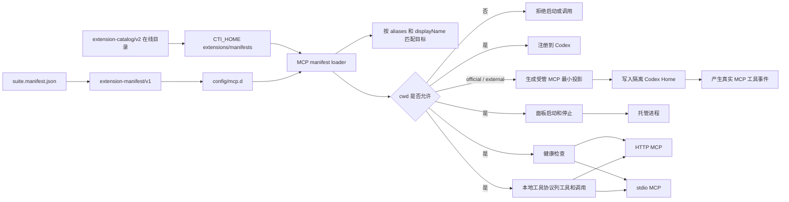

### 5.2 Skills

目录：

- `config/skills.d`
- `extensions/skills`
- `C:\Users\admin\.claude-to-im\extensions\manifests\skills.d`
- `CTI_HOME\extensions\drafts\skills`
- `CODEX_HOME\skills`

运行边界：

- `config/skills.d` 和 suite `extensions/skills` 是随项目发布的声明/备份来源；`CODEX_HOME\skills` 是正式安装事实目录。
- Registry 文件为 `CTI_HOME\data\skill-registry.json`，损坏时可从 `.bak` 恢复；禁用 Skill 迁移到 `CTI_HOME\extensions\disabled\skills` 后仍保持可见。
- 自建草稿位于 `CTI_HOME\extensions\drafts\skills`；安装 staging、backup 分别位于 `CTI_HOME\extensions\staging\skills`、`CTI_HOME\extensions\backups\skills`。
- 面板和飞书只调用 runtime lifecycle，不直接复制目录或拼接安装命令。官方脚本路径从 `CODEX_HOME` 推导，进程调用使用参数数组，不执行 shell 插值。

当前纳入项目备份的 skills：

- `memory-repo-retrieval`
- `feishu-document-generation`
- `unity-mcp-orchestrator`
- `blender-mcp-glb-unity-pipeline`
- `github-bmad-master`
- `github-memory-protocol`
- `ignis-cli`

同步到本机 Codex：

```powershell
powershell -ExecutionPolicy Bypass -File .\scripts\install-suite-skills.ps1
```

### 5.3 Plugins

目录：

- `config/plugins.d`
- `C:\Users\admin\.claude-to-im\extensions\manifests\plugins.d`

当前记录：

- `browser-use`
- `build-web-apps`
- `game-studio`

## 6. 本地 API 模型来源

当前本地 API 链路：

- 默认 Ollama server，也可配置 LM Studio、vLLM、OpenAI-compatible 或 custom
- 默认地址 `http://127.0.0.1:11434`
- 默认模型 `qwen2.5-coder:7b`
- OpenAI-compatible `/v1/chat/completions`
- 原生 `GET /api/tags` 健康检查和模型可用性检查
- Codex agent 执行能力由 provider registry 声明；当前只有 `ollama` 和 `lmstudio` 支持 `codex exec --oss --local-provider ...`

定位：

- 不是独立直答助手，而是 Codex CLI agent 的本地/自托管模型后端。
- 不作为普通飞书消息的直接回复器，不再生成 `local_best_effort` 用户可见答复。
- 面板配置写入 `CTI_LOCAL_AI_*`，本地模型 provider adapter 会读取这些值并生成 Codex CLI OSS agent 参数。
- 设置页选择“本地 API”或自动链命中 `local_api` 时，通过同一个 Codex agent 使用本地模型来源执行请求；不支持 agent 的 provider 会明确显示“仅 Chat Completions / 不可作为 Codex agent”。
- `ExecutionRequirement.requiredToolFamilies` 会驱动本地 JSON 工具协议暴露哪些工具族；`strictToolEvidence` 由工具族是否涉及本地状态、shell、文件、产物、Unity/Blender 等可验证执行面推导。严格证据任务必须拿到匹配工具族的成功 `tool_result` 才能完成，例如 Unity MCP 请求必须出现 `mcp_call` / `unity_mcp_execute_code` / Unity MCP 工具证据，不能由普通 shell、Edit 或无关工具结果满足。非严格工具族会优先尝试 manifest/MCP 工具，工具不可用时允许官方/外部模型基于自身能力回答，但不能声称工具成功。MCP discovery fallback 只读取 `requiredToolFamilies` 和 MCP catalog/schema，不在 provider 层维护另一套用户句式特例。
- `config/action-manifests.d` 是当前通用工具动作 manifest 目录，协议为 `action-manifest/v1`，用于把高置信短句映射为 `mcp_call`、`unity_mcp_execute_code` 或 `shell_artifact`。`config/local-agent-tools.d` 只作为历史兼容 overlay 读取，不再承载内置动作；同一 `id` 同时出现在新旧目录时，新目录优先，旧条目会被诊断为 duplicate 并忽略。用户安装层 `extensions\manifests\action-manifests.d` 可用同一协议覆盖内置 action，同级重复只保留优先级更高的定义并输出诊断。runtime 加载和发布前校验都会对坏 JSON、缺 `id`、缺 `mcp.tool`、缺 `shellArtifact.artifactPaths` 等问题输出诊断并跳过或拦截，不能静默丢弃。面向通用中台的新动作必须进入 `action-manifests.d` 或未来的统一 extension capability，不再扩展旧 `local-agent-tools.d`。

脚本：

- `scripts/local-llm/setup-ollama.ps1`
- `scripts/local-llm/start-local-llm.ps1`
- `scripts/local-llm/stop-local-llm.ps1`
- `scripts/local-llm/healthcheck-local-llm.ps1`
- `scripts/export-glb-asset-package.ps1`

新配置优先级：

- `CTI_LOCAL_AI_KIND`：`ollama`、`lmstudio`、`vllm`、`openai-compatible` 或 `custom`。
- `CTI_LOCAL_AI_BASE_URL` / `CTI_LOCAL_AI_MODEL` / `CTI_LOCAL_AI_API_KEY` / `CTI_LOCAL_AI_TIMEOUT_MS`：本地 AI 请求入口、模型、可选 Bearer key 和超时。
- `CTI_CODEX_ROUTING_MODE`：`manual` 或 `auto_failover`，决定手动来源还是自动切换链。
- `CTI_DEFAULT_EXECUTOR_ID`：全局默认 executor id。为空时按显式 hint、兼容 session 默认和自动选择；非空时优先于历史会话默认值，低于本轮 `@codex` / `@mavis` 等显式 hint。
- `CTI_CODEX_MODEL_SOURCE`：`official`、`local_api` 或 `external_api`，手动模式下决定 Codex CLI 模型来源。
- `CTI_CODEX_API_FALLBACK_CHAIN`：自动切换模式下的来源顺序，默认 `local_api,external_api`；只有显式包含 `official` 才允许调用官方 Codex。
- `CTI_LIGHT_CHAT_FAST_PATH_ENABLED`、`CTI_LIGHT_CHAT_FAST_PATH_TIMEOUT_MS`、`CTI_LIGHT_CHAT_HISTORY_LIMIT`、`CTI_LIGHT_CHAT_MAX_INPUT_CHARS`：控制 Feishu 轻聊天同源 fast path，默认启用、最多保留 2 条短历史、输入上限 280 字符；协调器始终使用 `CTI_CODEX_MODEL_SOURCE`、手动来源或自动 failover 链选中的 Provider，不存在独立轻聊模型设置。manual official/external 默认使用随 `@openai/codex-sdk` 安装的同版本 Codex 二进制启动常驻 app-server；仅在诊断或特殊部署时可用 `CTI_CODEX_APP_SERVER_EXECUTABLE` 显式覆盖二进制路径。禁用 fast path 后普通 provider 路由仍按原策略执行。`CTI_CODEX_FAILOVER_CANDIDATE_TIMEOUT_MS` 控制 Codex 自动来源候选首个有效事件期限，默认 2000ms；`CTI_MEMORY_INTENT_TIMEOUT_MS` 控制记忆意图分类预算，默认及最低有效值为 30000ms、最大 60000ms。`CTI_CODEX_RESET_STATE=true` 只用于诊断确认 Codex 状态库不兼容后的单次重置，默认保留健康状态库。`CTI_CODEX_BLOCKED_SKILLS` 以逗号或分号追加 bridge Codex Home 禁用 skill，`github-memory-protocol` 始终默认禁用。`CTI_FEISHU_LIGHT_CONTEXT_LIMIT` / `bridge_feishu_light_context_limit` 控制 Feishu 群聊轻量上下文补捞数量，默认 6 条、最大 12 条，只用于被 @ 或回复触发的短接话上下文。
- Feishu 轻聊天 fast path 会排除带明确可读对象或执行动词的短句，例如 URL、文件路径、当前工作目录、仓库/项目目录、MCP manifest、附件、查询、读取、搜索、修改、同步、重启或发送；这些请求即使语气很短，也会直接交给普通 provider/工具证据链判断。续接消息只检查结构化 `primary/supporting evidence` 与明确的 `[被回复消息] / [可能关联上文]` 正文，不扫描固定 guardrail 文本。
- `CTI_CODEX_INHERIT_GLOBAL_MCP`：是否让 bridge Codex 继承桌面全局 `mcp_servers.*`，默认 `false`；普通飞书运行态不依赖桌面 MCP，避免外部 MCP 离线导致主模型失败。
- `CTI_CODEX_LOCAL_IGNORE_USER_CONFIG`：本地 Codex CLI OSS agent 是否忽略桌面用户配置，默认 `true`；这不会禁用内置 shell/file agent 能力，但会减少插件和全局 provider 配置干扰。
- `@openai/codex-sdk`：bridge-runtime 的外部可选依赖，当前随 suite 锁定到 `0.132.0`；live 同步会校验运行副本中的实际安装版本。
- `CTI_CODEX_FAILURE_FALLBACK_MODE`、`CTI_CODEX_LOCAL_FALLBACK_ENABLED`、`CTI_CODEX_LOCAL_FALLBACK_REASONING_EFFORT`：历史兜底键，已退出主策略入口；当前运行时和控制面板设置不再读取或写回。
- `CTI_MEMORY_OPTIMIZER_ENABLED` / `CTI_MEMORY_OPTIMIZER_INTERVAL_DAYS` / `CTI_MEMORY_OPTIMIZER_MODEL_SOURCE`：控制记忆定期整理草稿，默认关闭、7 天、`codex_primary`。
- `CTI_OLLAMA_*` 保留兼容；未设置 `CTI_LOCAL_AI_*` 时继续作为默认值来源。

旧 `CTI_LOCAL_LLM_SERVER_EXE`、`CTI_LOCAL_LLM_MODEL_PATH`、`CTI_LOCAL_LLM_SERVER_ARGS`、`llama-server.exe` 和 GGUF 路径配置已废弃。`CTI_LOCAL_LLM_*` 中的路由键暂时保留为兼容项；用户可见配置统一通过面板“AI 执行与模型来源”写入默认 executor、官方 Codex、本地 API、外部 API或自动切换链。

Ignis 会话映射：

- `C:\Users\admin\.claude-to-im\runtime\ignis-sessions.json`
- 按飞书 chat/session 保存最近 `turn_id`、`session_id`、`canvas_id` 和 `file_id`。
- 支持“继续上一版”“查上一个结果”“等待完成”等追问；只有明确引用语义才复用上一轮参考资产。

## 7. 记忆与历史

本地桥接数据默认在：

- `C:\Users\admin\.claude-to-im\data`

主要文件：

- `sessions.json`
- `bindings.json`
- `permissions.json`
- `permission-links.json`
- `feishu-oauth-tokens.json`
- `messages`
- `message-archives`
- `feishu-chat-index.json`
- `feishu-p2p-user-index.json`
- `feishu-history-index.json`
- `feishu-history`
- `outbound-refs.json`

记忆策略：

- 远端 Feishu 历史是主来源。
- 本地索引用于检索、加速、压缩和容灾。
- 云历史索引同步由 `channels/feishu/history/indexed-history-sync.ts` 统一执行：增量模式读取本地最新时间水位，并在整页均无更新消息时停止后续分页；全量模式读取全部页面，即使过滤后为空也写入完成快照。平台鉴权、消息类型正文解析和真实 OpenAPI 分页仍留在 adapter，索引持久化由 Host 提供。
- 当前群的索引查询参数与 Host 缺失失败关闭由 `indexed-history-retrieval.ts` 统一裁决，索引结果到用户任务 prompt 由 `indexed-history-prompt.ts` 确定性构造；adapter 只触发同步、注入受控 `retrieveRelevantFeishuHistory` 能力并装配结果。旧 direct recent-message 云端旁路及重复 Prompt 已删除，不允许在索引 Host 缺失时绕开当前群隔离。
- light context 的候选选择与时间边界已迁入 `light-context-selection.ts`，确保 receive_v1 异步准备不会把当前消息之后出现的平台消息注入本轮；回复附件的资源类型、精确原消息绑定、顺序和去重由 `attachment-recovery.ts` 生成下载计划。adapter 仍维护 native mention、outbound audit/card 壳恢复、evidence 置信度、真实附件下载和 prompt 说明；这些平台/资源职责不会下沉到纯选择器。
- Feishu 云历史可能只保留或只索引到用户问题、卡片摘要或平台可见占位；bot 自己的最终回复还要从本地 `messages` / `message-archives` 回捞。运行时检索命中历史用户请求时，会把相邻 assistant 最终答复作为同一条 evidence 返回；结构化 assistant 消息优先提取 `cti-final.text` 作为用户真正看见的答案，缺少最终结果块时也只使用可见 text block，不把进度中的 `tool_use`、`tool_result`、命令、路径或日志混入主记忆文本。
- AI 不直接吃全量历史，而是按 `memoryMode=off|recall|augment` 决定是否检索相关片段；普通聊天默认不检索，显式回忆和执行类任务才按需调用记忆工具。
- 短期会话历史只保留近期窗口；普通聊天只带少量最近消息，`historyLimit=0` 表示完全不注入短期历史。runtime 会定期把过长消息流归档，默认只保留最近活跃消息，并且记忆检索读取归档时限制为最近少量归档文件，避免历史越积越长后拖慢每轮回复。
- Markdown 知识库默认位于 `E:\cli-md`，运行时优先监听并索引 `memory/*` 下通过 `codex-im-suite/memory/v3` schema 和身份边界校验的 Markdown；旧 `data/memory/v2` 只读兼容，统一生成 `.cti-index\knowledge.json`。
- IM/bridge 的长期记忆保存只能通过受控 memory v3 写入链进入上述仓库；agent 不得使用 `github-memory-protocol`、`~/.codex/memory` / `C:\Users\admin\.codex\memory`、项目 Markdown 或聊天日志来替代记忆仓库。没有成功写入 evidence 时，最终回复不能声称“已记住/已保存”：Delivery 会剥离未经证实的记忆成功行；纯记忆请求只返回未保存/最小澄清，复合请求则保留已完成的普通正文、结构化 mention、附件和其他真实动作，并追加独立记忆状态，禁止一个记忆子任务失败覆盖整轮成功结果。Agent Home 的身份/规则/工具自维护走独立 Self-Maintenance evidence 门禁：核心只做受控 patch，工作档案只做稳定 key upsert，规则回归只记录状态并走显式受控回滚，不与用户/群/公共长期记忆写入混用。
- Provider 运行态与 bridge-core 最终交付共用 `isExecutionEvidenceSatisfied()` 工具家族裁决；workflow 不再因任意 Bash/Edit 成功就宣称 Unity MCP、MCP 或其他指定能力已满足，面板状态与最终卡片保持同一证据口径。
- 运行时 watcher 同步写入 `.cti-index\status.json`，包含 `watching`、`watcherPid`、`watcherStartedAt`、`lastEventAt`、`lastIndexedAt` 和 `statusUpdatedAt`；控制面板用该心跳判断真实监听状态。
- 知识单元分为 `事实 / 结论 / 待办 / 资源`，结果保留来源路径、片段和冲突标记。
- `memory.status` 会返回 `sourceCoverage`，按 v2 来源路径汇总知识单元数、最近更新时间、来源分组、默认风险和是否可自动整理；`memory.search` 支持 `sourceGroup`、`offset`、`limit`，默认轻量显示但可分页查看完整匹配列表。控制面板直接读取旧 `knowledge.json` 时也会复用 v2 过滤口径，旧残留条目不会显示。
- 记忆整理草稿包含 `sourceSummary`、动作来源分组、默认勾选和人工复核标记；应用时必须传 `selectedActionIds`，并在 `sourceIndexGeneratedAt` 与当前 `knowledge.json.generatedAt` 不一致时拒绝旧草稿。
- 归档恢复入口只允许读取 `E:\cli-md\archive\knowledge-units` 内文件，并校验归档记录的源文件仍在记忆仓库内；单条恢复和草稿撤销都会重建知识索引和提醒索引。
- 待办提醒索引为派生文件：`.cti-index\reminders.json` 保存待发送、已发送、跳过和失败的展示数据，`.cti-index\reminder-state.json` 保存 `pending / sent / failed / skipped` 推送状态和最近结果。控制面板“会话”页显示提醒时间、来源类型、来源会话、来源片段、完成和飞书测试发送入口。
- Memory 页面额外消费控制面板从 Skill Registry 投影出的 `cti-memory-skill-asset-index/v1`；该对象只含引用和治理元数据，`skillBody` 固定为空，不参与长期记忆写入。
- `sourceType=direct` 的提醒来自 `cti-reminder` 或 `/remind`，源文件落在 `data\todos\direct-reminders`；面板会把它和普通 `sourceType=memory` 待办区分展示。
- Codex CLI 模型/API 不可用时，只有自动切换链中声明的后续来源会被尝试；任务、工具、权限或 MCP 失败不得换模型重跑，也不得降级成教程式回复。
- Provider 错误外发统一经过安全摘要收口：`tool_result` SSE、`tool_use_id`、本地路径、转义 JSON 和高乱码密度内容不会作为正文发送到 Feishu，也不会写入会话记忆。若已有 workflow/light card，只更新同一张卡为安全未完成摘要；确需补发时只发一条短文本，并按 chat 做短窗口失败熔断，避免错误被切成多条群消息。

## 8. 结果封装协议

桥接已经从“猜测裁剪结果”改成结果块协议。

Codex 应输出：

````text
```cti-final
{
  "kind": "text",
  "text": "最终发给用户的内容",
  "images": [],
  "files": [],
  "reply_mode": "markdown"
}
```
````

桥接行为：

- 优先解析 `cti-final`。
- 命中后只发送结果块内容。
- Markdown 统一走 Feishu card。
- 图片和文件由结果块显式声明。
- 协议失败时保守兜底，不再强行猜半截结果。

直接提醒动作块：

````text
```cti-reminder
{
  "title": "看电脑",
  "dueAt": "2026-04-29T19:42:00+08:00",
  "timezone": "Asia/Shanghai",
  "target": "current_chat",
  "notifyTargets": [{ "userId": "ou_xxx", "name": "刘丹" }],
  "sourcePrompt": "帮我设置个代办，两分钟后给我发消息提醒我看电脑"
}
```
````

桥接行为：

- `cti-scheduled-task` 用于周期、动态 Agent 和受控工具任务；`cti-reminder` 或 `/remind` 只创建单次低风险 `at + notify`。自然语言提醒必须先进入 agent/provider 判断，不能由 bridge-core 在 provider 前正则直建。未来关机、关闭屏幕、运行命令、发送文件等执行型定时请求不是低风险提醒，必须进入 Owner 和受控工具链。
- bridge-core 校验动作块后调用 bridge-runtime Scheduled Task Host，真实任务写入 `CTI_HOME\data\scheduled-tasks`。动作块中的 `notifyTargets` 只保留可发送 mention 所需结构化字段；模型提供的 actor、chatId、sourceSessionId 或工作区字段被忽略并审计。Host 成功后，该 bridge-owned action 计入本轮执行证据，避免真实执行摘要被无工具证据防线误判为模型伪完成。
- 如果 Codex 只声称“已创建系统计划任务 / 已实际发送 / 已设置提醒”但没有动作块，bridge-core 直接拦截原回复并返回未进入统一提醒系统；即使原请求文本能被时间解析器识别，也不会补建提醒。

## 9. 打包与发布

本机备份打包：

```powershell
powershell -ExecutionPolicy Bypass -File .\scripts\package-release.ps1
```

本机备份发布：

```powershell
powershell -ExecutionPolicy Bypass -File .\scripts\publish-backup.ps1
```

本机备份发布脚本职责：

- 构建 package；构建顺序先走 `packages/contracts`，再构建 bridge/runtime/MCP 包，保证共享 DTO 和 schema 先产出。`scripts/build-packages.ps1` 不再内联一份只生成 daemon 的 runtime esbuild 配置，而是调用 `packages/bridge-runtime` 自己的 build script，使 `daemon.mjs`、`memory-optimizer-cli.mjs` 和 `skill-lifecycle-cli.mjs` 共享同一构建事实源。
- 构建控制面板。
- 用开发版生成 live skill。
- 组装 portable。
- 生成 `release\codex-im-suite-portable.zip` 便携分发包；zip 通过 Git LFS 跟踪 `release/*.zip`，避免超过 GitHub 普通 Git blob 上限。
- 组装 installer。
- 执行发布前分叉体检，比较开发版、live skill、portable、installer payload 的关键文件 hash、manifest、构建时间、commit 和 `.suite-release.json` 指纹。
- 生成 `publish-summary.md`。
- 追加 `release-notes.md`。
- git add / commit。
- 在普通 `git push` 前按上游 remote 自动执行 Git LFS 预同步；只要仓库中存在 LFS 跟踪文件，就先补传缺失对象，避免发布产物已入库但远端缺少 LFS blob 时被 GitHub 预接收钩子拒绝。
- git push。

主干发布预检：

```powershell
powershell -ExecutionPolicy Bypass -File .\scripts\prepare-main-release.ps1
```

主干发布预检职责：

- 校验 `extension-manifest/v1`。
- 检查架构文档维护状态。
- 扫描疑似密钥和 token。
- 构建 package 和控制面板；package 构建同样先构建 `packages/contracts`，控制面板发布输出目录会先做运行进程检查并清空，避免旧 Vite hash 资产残留影响 fork health。
- 组装 portable 和 installer。
- 执行 portable / installer payload 分叉体检；live skill 按主干预检策略跳过。
- 生成 `publish-summary.md` 并追加 `release-notes.md`。
- 不同步 live skill，不自动 commit，不自动 push。

主干发行标签：

```powershell
powershell -ExecutionPolicy Bypass -File .\scripts\create-main-release-tag.ps1
```

标签脚本只做只读门禁和 `git tag -a v<version>`：要求工作区干净，默认要求位于 `main`，并重新执行扩展 manifest 严格校验。`prepare-main-release.ps1` 不负责打 tag，避免预检生成的摘要或打包产物把工作区变脏后阻断标签创建。

`main` 是稳定产品主干，`codex/dev` 是日常集成分支，功能分支使用 `codex/<topic>`。合入 `main` 前必须完成构建、测试、扩展 manifest 校验、架构文档检查和发布摘要。

```mermaid
flowchart TD
  DevTree[开发版 codex-im-suite] --> BuildPackages[build-packages.ps1]
  DevTree --> ValidateManifest[validate-extension-manifests.ps1]
  BuildPackages --> SyncLive[sync-live-skill.ps1]
  SyncLive --> LiveRuntime[本机 live skill 运行副本]
  DevTree --> ArchCheck[update-architecture-docs.ps1]
  BuildPackages --> Assemble[assemble-portable.ps1]
  Assemble --> Portable[release/portable]
  Portable --> Zip[portable zip via Git LFS]
  Portable --> Installer[Windows installer]
  LiveRuntime --> ForkHealth[test-release-fork-health.ps1]
  Portable --> ForkHealth
  Installer --> ForkHealth
  ForkHealth --> PublishSummary[publish-summary.md]
  DevTree --> MainPreflight[prepare-main-release.ps1]
  MainPreflight --> ValidateManifest
  MainPreflight --> ArchCheck
  MainPreflight --> Assemble
  PublishSummary --> ReleaseNotes[release-notes.md]
  ReleaseNotes --> Git[git commit 和 push]
  Git --> Tag[create-main-release-tag.ps1]
```

同步方向固定为 `suite -> live`。`scripts/import-live-to-suite.ps1` 只用于手动救回 live 中的历史改动，默认 dry-run，不属于主干发布链路。发布和同步脚本在覆盖控制面板发布目录、live、portable 或 installer payload 前会检查这些目录下的运行进程；默认只结束目标目录内的进程后继续更新，不按进程名全局结束。需要恢复阻断模式时，传 `-NoForceUpdate` 或设置 `CTI_RELEASE_FORCE_UPDATE=false`。

live skill 同步时，`scripts/sync-live-skill.ps1` 会先构建 `packages/bridge-core` 和 `packages/bridge-runtime`，再把开发版源码和构建产物写入：

- `C:\Users\admin\.codex\skills\claude-to-im`
- `C:\Users\admin\.codex\skills\claude-to-im-core`

其中 MCP / Skill / Plugin 扩展清单必须从开发版唯一来源 `config/mcp.d`、`config/skills.d`、`config/plugins.d` 复制到 live skill 顶层的 `mcp.d`、`skills.d`、`plugins.d`，工具动作清单必须从 `config/action-manifests.d` 复制到 live skill 的 `config\action-manifests.d`，供运行版控制面板在脱离 suiteRoot 时读取。同步脚本会清理 live 内置旧 `config\local-agent-tools.d`。发布指纹和 `test-release-fork-health.ps1` 会按逻辑 manifest 命名空间统计 extension / runtime / action 清单；开发版、portable 和 installer 使用 `config/*.d` 布局，live runtime 的顶层 `mcp.d` / `skills.d` / `plugins.d` 会规范化为同一逻辑路径后参与 hash，避免发布健康检查漏掉清单漂移。不要从旧 `packages/bridge-runtime/mcp.d` 或旧本地工具目录恢复运行版清单。

同步控制面板发布目录时必须排除 `CodexImSuiteControlPanel.exe.WebView2` 用户数据目录，避免 WebView2 Cookie/Cache 临时文件被 robocopy 镜像到 live skill。

### 9.1 入口定位

日常维护入口：

- 主源码：`C:\Users\admin\Documents\New project\codex-im-suite`
- 面板源码：`apps/control-panel`
- 目标检查：`scripts/doctor-suite-targets.ps1`
- Windows PowerShell 5.1 UTF-8 Profile：`scripts/windows-powershell-utf8-profile.ps1` 以稳定受控区块支持 Apply/Check/Remove；受控区块同时设置控制台/管道 UTF-8 与 `Get-Content:Encoding=UTF8` 默认值。Apply 先备份，并同时运行真实 `PowerShell 5.1 -> Node stdin` 与无 BOM 中文文件普通 `Get-Content -Raw` 探针，任一失败都恢复 before-image。`bootstrap-suite.ps1` 安装，doctor 只读检查并给出修复命令；显式 `-NoProfile` 的调用仍需自行声明编码。

非日常源码入口：

- `.codex\skills\claude-to-im*` 是运行副本。
- `release/portable` 和 `release/installer` 是发布产物。
- 旧 `packages/bridge-runtime/tools/ControlPanel` 和 `packages/bridge-runtime/tools/Installer` 已移除，不作为面板或安装器维护入口。

## 10. 当前安全边界

- 默认工作区来自 `CTI_DEFAULT_WORKDIR`；Unity 项目身份来自 `CTI_UNITY_PROJECT_PATH` / MCP manifest `cwd` / allowed roots，不再固定到历史 ST3。
- 非授权路径默认拒绝。
- MCP 工作目录必须在允许范围内。
- 高危操作走 `Owner` 门禁，中风险运维走 `Operator` 或 `Owner` 门禁。
- 本地模型不能绕过权限。
- 本地模型不能伪造执行结果。
- 私有 token/config 不进入 Git。
- Ignis token 只保存在 `C:\Users\admin\.ignis\config.json`，发布和同步流程不得复制该文件。

## 11. 运行状态排障入口

优先看：

- `C:\Users\admin\.claude-to-im\runtime\bridge-runtime-audit.json`
- `C:\Users\admin\.claude-to-im\runtime\workflow-runs.json`
- `C:\Users\admin\.claude-to-im\logs\bridge.log`
- 控制面板服务总览

关键字段：

- `lastStage`
- `lastInboundMessage`
- `lastActiveRequest`
- `lastCompletedRequest`
- `workflow.status`
- `workflow.recovery.kind`
- `workflow.retry.status`
- `scheduled task nextRunAt / runningRunId / lastExecutionStatus / lastDeliveryStatus`
- `feishuWs`
- `feishuP2pPoll`
- `lastUnhandledError`

### 11.1 产物证据与重启恢复边界

- `artifact_required` 不再把某个具体工具名称当成唯一成功条件。Bridge Core 解析最终 `cti-final`，Runtime Turn Storage 负责把声明路径与本轮成功工具结果精确求交，并验证文件存在、mtime 属于当前 attempt、真实路径位于当前工作区/临时挂载/回合目录且不是符号链接；通过后登记受管 Artifact，Core 才将产物证据标记为满足。
- Unity、Blender、MCP 等外部编辑器中的场景、Prefab、节点和组件修改属于 `tool_required`；参考截图只是输入 evidence，不能自动增加 `artifact`。只有明确要求图片、文档、表格等可交付输出时才使用 `artifact_required`，且必须同时存在成功工具回执和 Runtime 验证过的本轮新产物。
- 普通 tool-result Artifact 登记仍只接受显式 `artifacts / artifactPaths / images / files / filePath / localFiles` 字段；裸 `path / Path / outputPath` 只允许在最终声明求交核验中使用，不能单独把只读文件提升为生成产物。
- `tool_required`、`local_read_required` 和非产物 Unity/MCP 请求仍执行原有 tool family 门禁，产物放宽不能扩散到权限、身份、高风险或普通工具证据。
- 官方 Codex SDK 在 `turn.completed` 前断流时，Provider 不重放原请求，而是按同一受管 thread ID 跟随其 rollout，继续转发真实工具回执并等待 `task_complete`。有界恢复失败或用户取消时，必须先终止该 run 的 AbortController，再输出失败终态，禁止卡片已结束而底层 Agent 继续写入。
- Bridge 启动恢复只对尚未进入执行阶段的 run 自动排队。`executing / finalizing / retrying` 中断 run 会收口为失败并保留 recovery input 供显式手动重试，避免截图、文件写入、Unity 操作或系统动作跨重启重复执行；旧 `retrying` 也会被收口，防止恢复链级联。
- Recovery input 保存并恢复原 `turnId`、`executionRequirement`、`noEvidenceRetryAttempted`、工作目录/临时挂载和受管 `inputEvidenceRefs`。Runtime 重试前重新验证附件路径位于当前回合受管输入根、SHA-256/大小一致、未过 TTL 且不是符号链接；任一项失败都拒绝重试，防止附件丢失后绕过原证据要求。
