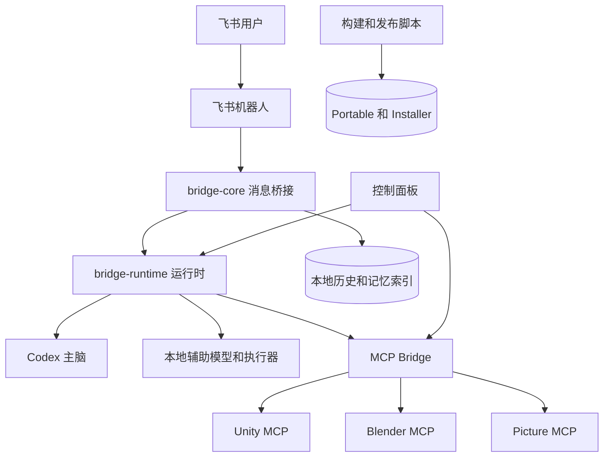
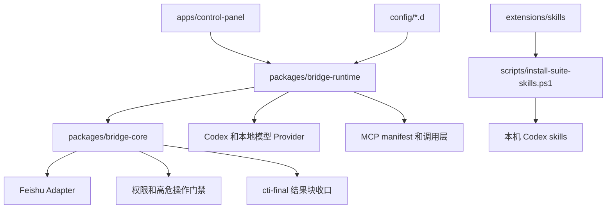
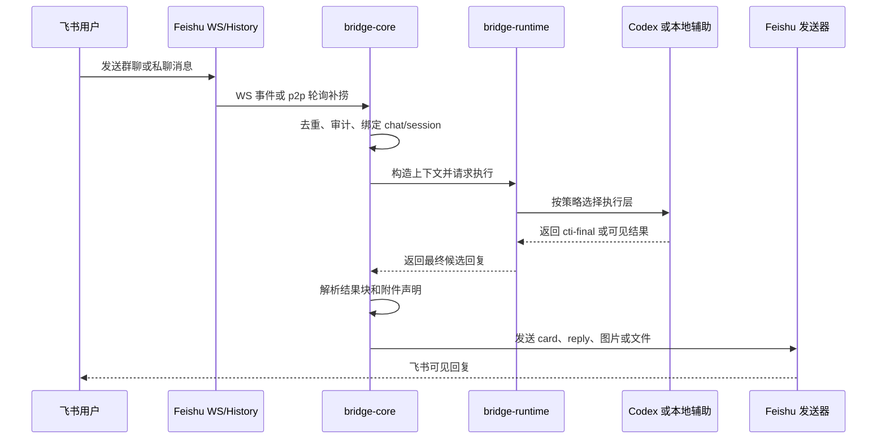
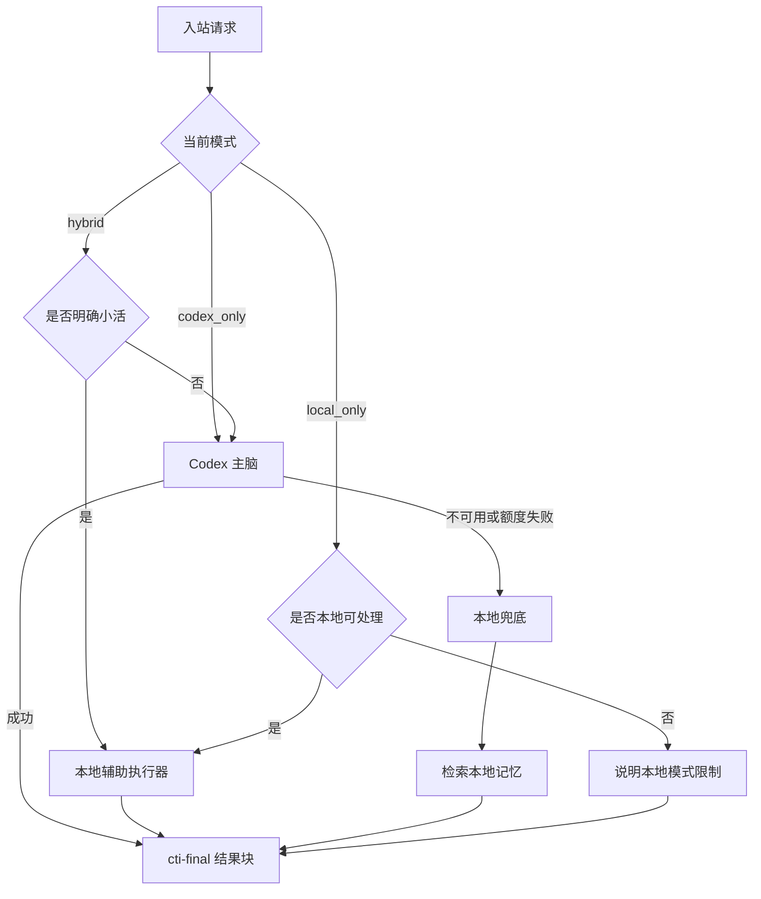
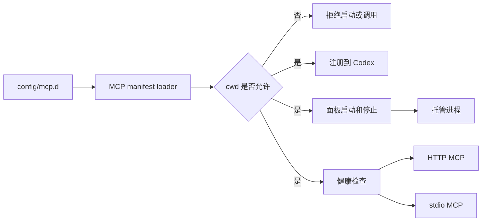
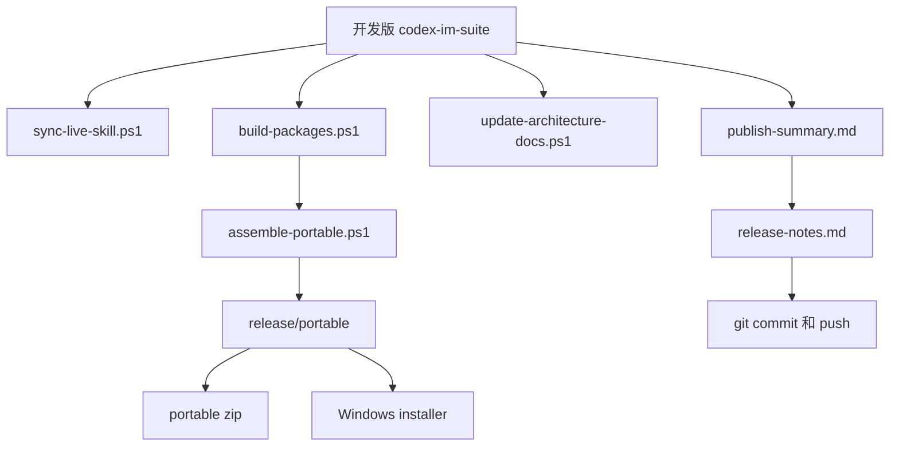

# codex-im-suite 项目架构

更新时间：2026-04-20

## 0. 架构文档维护规则

- 本文是 suite 当前架构的唯一主文档，后续不要再新增平行的架构说明文档。
- 项目内已安装 `project-architecture-diagram` skill，架构变更时优先使用该 skill 更新本文。
- 修改模块边界、运行链路、provider 路由、MCP manifest、Feishu 收发、记忆索引、打包发布链路时，必须检查本文是否需要同步。
- 检查入口：`scripts/update-architecture-docs.ps1`。
- 变更过程和阶段性风险记录到 `docs/DEVELOPMENT-LOG.md`，不要塞进本文。

## 1. 总体定位

`codex-im-suite` 是一个 Windows 优先的本地 AI 协作套件，核心目标是把飞书聊天入口、Codex 执行、MCP 工具、Unity/Blender 工作流、本地记忆和打包发布统一到一个可迁移的项目目录里。

当前不是单体应用，而是一个发行层加多个内部模块：

- `bridge-core` 负责 IM 桥接核心能力。
- `bridge-runtime` 负责把核心库、本地配置、Codex、本地模型和脚本组装成可运行服务。
- `apps/control-panel` 负责可视化运维。
- `config/*.d` 负责 manifest 驱动的扩展发现。
- `scripts` 负责构建、同步、打包、发布。

### 1.1 系统上下文图



### 1.2 模块边界图



## 2. 运行链路

### 2.1 Feishu 入站

Feishu 接收现在是双通道：

- WS 长连是主链路。
- p2p 私聊有历史轮询补捞兜底，避免私聊事件偶发漏掉。

收到消息后进入 `bridge-core` 的消息处理主线：

1. 记录运行审计。
2. 去重。
3. 绑定 chat/session。
4. 构造上下文。
5. 调用运行时 provider。
6. 解析最终结果块。
7. 通过 Feishu 原生 reply/card/image 等方式回复。



### 2.2 Provider 选择

当前默认策略是 `Codex 主脑 + 本地辅助执行器`：

- `hybrid` 模式：默认走 Codex，只有明确小活走本地。
- `local_only` 模式：只用本地能力，不能完成的任务明确拒绝。
- `codex_only` 模式：禁用本地辅助，全部走 Codex。

本地辅助范围：

- 简单 shell / PowerShell 命令。
- 简单 git 状态、fetch、pull、branch、log。
- 文件读取、文本搜索、受控单文件写入。
- MCP 运维小活：状态、启动、停止、工具列表、显式 HTTP tool call。
- Codex 不可用时的记忆类兜底回答。

不交给本地辅助直接完成的范围：

- Unity / Blender / MCP 多步编排。
- 截图、渲染、导入、场景操作。
- 飞书文档创建/删除。
- 图片或附件理解。
- 项目级复杂重构和排障。



## 3. 核心包职责

### 3.1 packages/bridge-core

核心职责：

- Channel adapter 抽象。
- Feishu/Lark 适配器。
- 消息路由和 session 绑定。
- 权限请求和高危操作门禁。
- 飞书 Markdown/card/image/reply 发送。
- 最终结果块解析和出站收口。
- 运行审计落盘。

关键能力：

- Feishu 群聊原生 reply。
- 群聊 reply 时可自动 @ 提问人。
- Feishu Markdown 默认走 card。
- 图片和文件由结果块显式声明，桥接不再靠正文猜路径。
- `bridge-runtime-audit.json` 记录最后阶段、最后消息、WS 状态、p2p 补捞状态。

### 3.2 packages/bridge-runtime

核心职责：

- 读取 `config.env`。
- 启动 daemon/supervisor。
- 接入 Codex / Claude CLI provider。
- 接入本地 llama.cpp 模型。
- 本地辅助执行器。
- MCP manifest 解析和调用。
- 本地 JSON store。
- 记忆检索和 Feishu 历史索引。

关键能力：

- Codex 失败时切本地模型兜底。
- 本地模型兜底时会检索本地记忆，不再空猜。
- MCP 工作目录检查，防止误连其他项目。
- 默认工作区和 Unity 工程路径由配置控制。

### 3.3 packages/mcp-picture

图片相关 MCP，定位为独立能力包。

用途：

- 图片标注。
- 视觉布局辅助。
- 图片工作流中间能力。

### 3.4 packages/mcp-unity-prefab

Unity Prefab MCP，定位为独立 Unity 资源分析/生成能力。

用途：

- Prefab 扫描。
- Prefab 数据服务。
- Unity 资源侧辅助。

## 4. 控制面板

位置：

- `apps/control-panel`

职责：

- 启停 Feishu bridge。
- 查看真实进程状态。
- 查看 Feishu WS 和私聊补捞状态。
- 查看 Codex / 本地辅助模式。
- 启停和检查 MCP。
- 自动发现 `mcp.d`、`skills.d`、`plugins.d`。
- 修改非敏感路径配置。
- 查看会话、历史索引、本地检索。
- 一键发布。

面板原则：

- 面板只做 orchestration，不承载桥接业务逻辑。
- 服务按钮放在对应服务卡里。
- 状态优先读真实进程和运行审计，不再只信旧 `status.json`。

## 5. Manifest 驱动扩展

### 5.1 MCP

目录：

- `config/mcp.d`

当前 MCP：

- `unityMCP`
- `blenderMCP`
- `pictureMCP`
- `unityPrefabMCP`

每个 MCP 通过 JSON manifest 声明：

- `id`
- `displayName`
- `type`
- `enabled`
- `launcher`
- `stopLauncher`
- `cwd`
- `env`
- `healthCheck`
- `registerName`
- `description`

MCP 安全规则：

- MCP 的 `cwd` 必须命中当前默认工作区、允许根目录或 Unity 工程路径。
- 不符合时拒绝启动、检查、列工具和调用工具。
- Unity 截图、Blender 操作等复杂任务默认走 Codex 主脑，不由本地 MCP 快路径接管。



### 5.2 Skills

目录：

- `config/skills.d`
- `extensions/skills`

当前纳入项目备份的 skills：

- `memory-repo-retrieval`
- `feishu-document-generation`
- `unity-mcp-orchestrator`
- `blender-mcp-glb-unity-pipeline`
- `github-bmad-master`
- `github-memory-protocol`

同步到本机 Codex：

```powershell
powershell -ExecutionPolicy Bypass -File .\scripts\install-suite-skills.ps1
```

### 5.3 Plugins

目录：

- `config/plugins.d`

当前记录：

- `build-web-apps`
- `game-studio`

## 6. 本地模型

当前本地模型链路：

- llama.cpp server
- Qwen2.5-Coder 7B GGUF
- OpenAI-compatible HTTP API

定位：

- 不是主脑。
- 是本地辅助执行器和 Codex 不可用时的兜底。
- 适合小命令、简单解释、记忆类兜底、轻量文件操作。

脚本：

- `scripts/local-llm/setup-llama-cpp.ps1`
- `scripts/local-llm/start-local-llm.ps1`
- `scripts/local-llm/stop-local-llm.ps1`
- `scripts/local-llm/healthcheck-local-llm.ps1`

## 7. 记忆与历史

本地桥接数据默认在：

- `C:\Users\admin\.claude-to-im\data`

主要文件：

- `sessions.json`
- `bindings.json`
- `messages`
- `message-archives`
- `feishu-chat-index.json`
- `feishu-p2p-user-index.json`
- `feishu-history-index.json`
- `feishu-history`

记忆策略：

- 远端 Feishu 历史是主来源。
- 本地索引用于检索、加速、压缩和容灾。
- AI 不直接吃全量历史，而是先检索相关片段。
- Codex 不可用时，本地模型会先检索本地记忆再回答记忆类问题。

## 8. 结果封装协议

桥接已经从“猜测裁剪结果”改成结果块协议。

Codex 应输出：

```text
```cti-final
{
  "kind": "text",
  "text": "最终发给用户的内容",
  "images": [],
  "files": [],
  "reply_mode": "markdown"
}
```
```

桥接行为：

- 优先解析 `cti-final`。
- 命中后只发送结果块内容。
- Markdown 统一走 Feishu card。
- 图片和文件由结果块显式声明。
- 协议失败时保守兜底，不再强行猜半截结果。

## 9. 打包与发布

打包：

```powershell
powershell -ExecutionPolicy Bypass -File .\scripts\package-release.ps1
```

发布：

```powershell
powershell -ExecutionPolicy Bypass -File .\scripts\publish-backup.ps1
```

发布脚本职责：

- 同步 live skill。
- 构建 package。
- 构建控制面板。
- 组装 portable。
- 组装 installer。
- 生成 `publish-summary.md`。
- 追加 `release-notes.md`。
- git add / commit / push。



## 10. 当前安全边界

- 默认工作区固定到配置里的 ST3。
- 非授权路径默认拒绝。
- MCP 工作目录必须在允许范围内。
- 高危操作仍走 owner/权限门禁。
- 本地模型不能绕过权限。
- 本地模型不能伪造执行结果。
- 私有 token/config 不进入 Git。

## 11. 运行状态排障入口

优先看：

- `C:\Users\admin\.claude-to-im\runtime\bridge-runtime-audit.json`
- `C:\Users\admin\.claude-to-im\logs\bridge.log`
- 控制面板服务总览

关键字段：

- `lastStage`
- `lastInboundMessage`
- `lastActiveRequest`
- `lastCompletedRequest`
- `feishuWs`
- `feishuP2pPoll`
- `lastUnhandledError`
