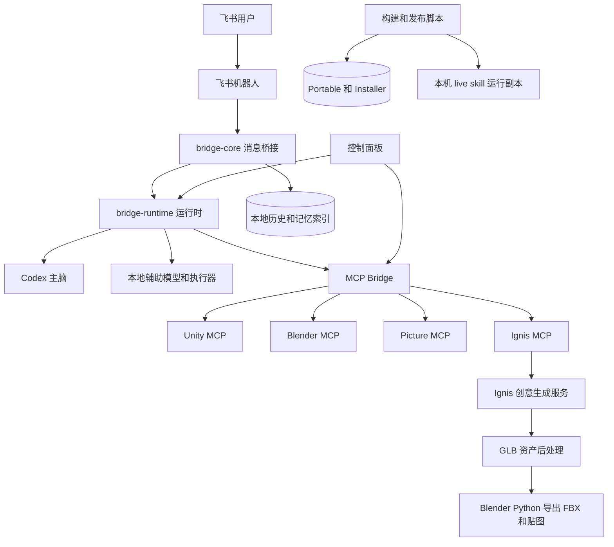
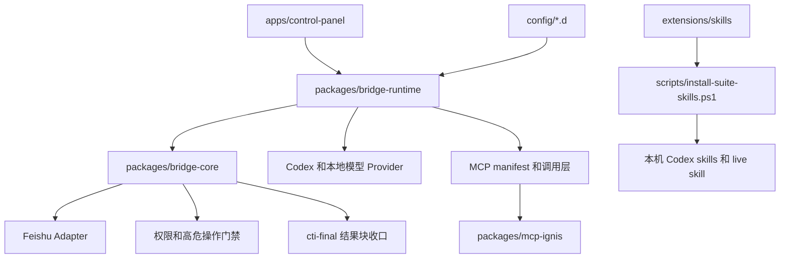
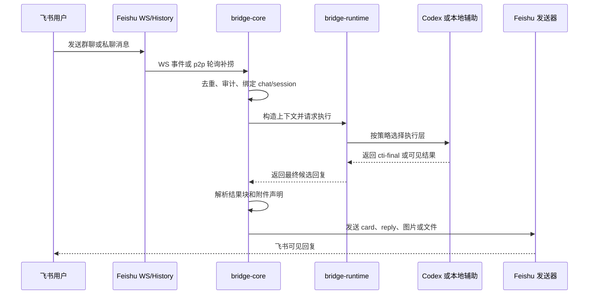
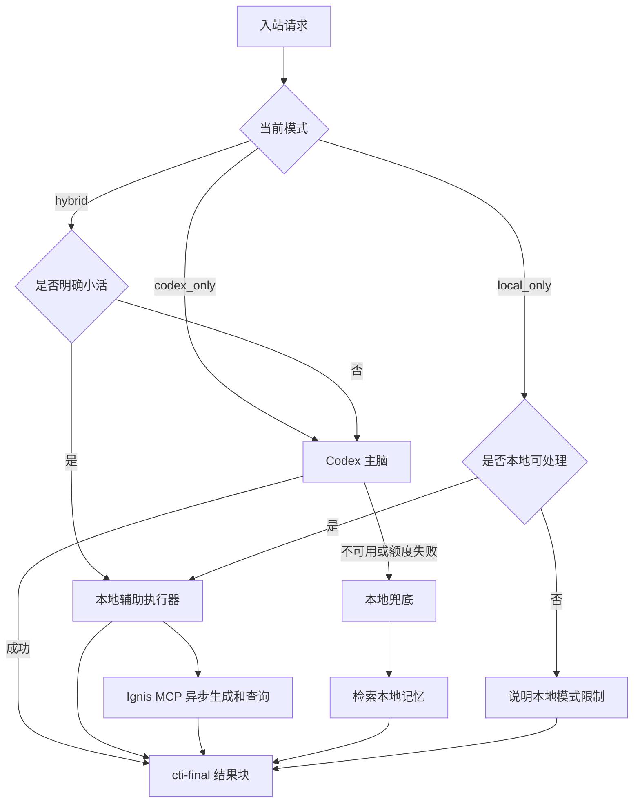
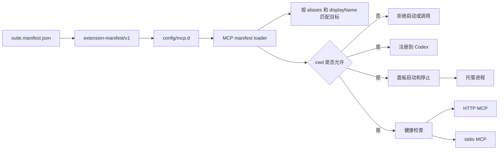
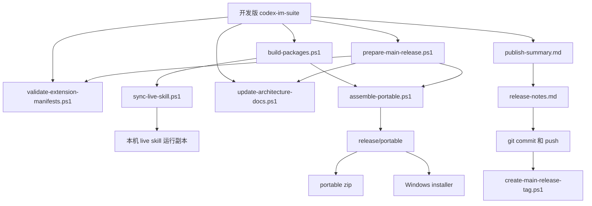

# codex-im-suite 项目架构

更新时间：2026-04-22

## 0. 架构文档维护规则

- 本文是 suite 当前架构的唯一主文档，后续不要再新增平行的架构说明文档。
- 项目内已安装 `project-architecture-diagram` skill，架构变更时优先使用该 skill 更新本文。
- 修改模块边界、运行链路、provider 路由、MCP manifest、Feishu 收发、记忆索引、打包发布链路时，必须检查本文是否需要同步。
- 检查入口：`scripts/update-architecture-docs.ps1`。
- 变更过程和阶段性风险记录到 `docs/DEVELOPMENT-LOG.md`，不要塞进本文。

## 1. 总体定位

`codex-im-suite` 是一个 Windows 优先的本地 AI 协作套件，核心目标是把飞书聊天入口、Codex 执行、MCP 工具、Unity/Blender 工作流、本地记忆和打包发布统一到一个可迁移的项目目录里。

当前不是单体应用，而是一个发行层加多个内部模块：

- `bridge-core` 负责 IM 桥接核心能力。
- `bridge-runtime` 负责把核心库、本地配置、Codex、本地模型和脚本组装成可运行服务。
- `apps/control-panel` 负责可视化运维。
- `config/*.d` 负责 manifest 驱动的扩展发现。
- `scripts` 负责构建、同步、打包、发布。

### 1.1 系统上下文图



### 1.2 模块边界图



## 2. 运行链路

### 2.1 Feishu 入站

Feishu 接收现在是双通道：

- WS 长连是主链路。
- p2p 私聊有历史轮询补捞兜底，避免私聊事件偶发漏掉。

收到消息后进入 `bridge-core` 的消息处理主线：

1. 记录运行审计。
2. 去重。
3. 绑定 chat/session。
4. 构造上下文。
5. 调用运行时 provider。
6. 解析最终结果块。
7. 通过 Feishu 原生 reply/card/image 等方式回复。



### 2.2 Provider 选择

当前默认策略是 `Codex 主脑 + 本地辅助执行器`：

- `hybrid` 模式：默认走 Codex，只有明确小活走本地。
- `local_only` 模式：只用本地能力，不能完成的任务明确拒绝。
- `codex_only` 模式：禁用本地辅助，全部走 Codex。

本地辅助范围：

- 简单 shell / PowerShell 命令。
- 简单 git 状态、fetch、pull、branch、log。
- 文件读取、文本搜索、受控单文件写入。
- MCP 运维小活：状态、启动、停止、工具列表、显式 HTTP tool call。
- Ignis 创意生成快路径：原画、生成图、视频、模型、canvas、file_id、turn_id 的提交和查询。
- 本地快路径在进入 Ignis、MCP、本地执行器前，统一先做“询问 / 操作”判定；歧义默认按询问处理，只允许只读查询，不直接触发生成、启动、停止、写入或 `git pull`。
- Ignis 的“最近几次 / 历史 / 整理成列表”优先走历史列表意图，不再因为出现 “Ignis + 检查” 就误落到状态检查。
- Ignis 状态、安装、配置、工具列表类问题不进入生成接口；只有明确创意生成意图才提交任务。
- MCP 快路径只在明确动词下才执行启动、停止、重启和显式 tool call；只说“看看 MCP”时默认返回状态/帮助，不自动操作任何 MCP。
- 本地执行器把 `git status`、`git branch --show-current`、`git log --oneline -n 10`、读文件、搜索文本视为只读查询；`git pull`、`git fetch`、写文件等 mutating 操作必须命中明确动作语义才会执行。
- 中文仓库查询会直接命中同一套只读规则，例如“帮我看看 git 状态”“当前分支是什么”“最近几条提交”会优先走本地 repo fast-path，而不是先升级到 Codex 再二次规划。
- Ignis 生成类任务提交后会等待完成并下载可回传资产，最终回复走 `cti-final`，避免向飞书裸发 CLI JSON 或大段技术字段。
- Ignis 仅在“该/这张/刚才/上一版/继续”等明确引用时复用上一轮 session 和参考图；普通新生成请求默认新开会话。
- Ignis 模型生成如果明确要求拆成 FBX/贴图，会在 GLB 下载完成后调用 `scripts/export-glb-asset-package.ps1`，输出 FBX、贴图、材质映射和 manifest，并通过 `cti-final.files` 回传不超过飞书限制的文件。
- Codex 不可用时的记忆类兜底回答。

不交给本地辅助直接完成的范围：

- Unity / Blender / MCP 多步编排；Ignis GLB 的固定 FBX/贴图后处理是受控例外，只走固定脚本，不让本地模型自由编排 Blender。
- 截图、渲染、导入、场景操作。
- 飞书文档创建/删除。
- 图片或附件理解，Ignis 附件只作为参考文件上传，不由本地模型理解内容。
- 项目级复杂重构和排障。



## 3. 核心包职责

### 3.1 packages/bridge-core

核心职责：

- Channel adapter 抽象。
- Feishu/Lark 适配器。
- 消息路由和 session 绑定。
- 权限请求和高危操作门禁。
- 飞书 Markdown/card/image/file/reply 发送。
- 最终结果块解析和出站收口。
- 运行审计落盘。

关键能力：

- Feishu 群聊原生 reply。
- 群聊 reply 时可自动 @ 提问人。
- Feishu Markdown 默认走 card。
- 图片和文件由结果块显式声明，桥接不再靠正文猜路径。
- 飞书本地图片和本地文件分别走原生 image/file 消息回传；`.glb` 等非图片资产不能退化成仅发本地路径。
- 超过飞书 IM 单文件上传限制的生成资产改发文档链接或下载链接，不再假装“已发送文件”。
- 本地 `cti-final.files` 文件超过飞书 30MB 单文件限制时，出站层不再分卷，而是走 artifact delivery provider；飞书场景优先支持 `feishu_docx`，会自动创建新版云文档、把文件作为 `docx_file` 附件挂入文档，并回文档链接；也保留 `local_http` 作为公网目录备用方案。
- 用户回复到上一条图片/文件时，Feishu adapter 会尽量读取被回复消息并把附件并入本次请求。
- `bridge-runtime-audit.json` 记录最后阶段、最后消息、WS 状态、p2p 补捞状态。

### 3.2 packages/bridge-runtime

核心职责：

- 读取 `config.env`。
- 启动 daemon/supervisor。
- 接入 Codex / Claude CLI provider。
- 接入本地 llama.cpp 模型。
- 本地辅助执行器。
- MCP manifest 解析和调用。
- 本地 JSON store。
- 记忆检索和 Feishu 历史索引。

关键能力：

- Codex 失败时切本地模型兜底。
- 本地模型兜底时会检索本地记忆，不再空猜。
- MCP 工作目录检查，防止误连其他项目。
- 默认工作区和 Unity 工程路径由配置控制。

### 3.3 packages/mcp-picture

图片相关 MCP，定位为独立能力包。

用途：

- 图片标注。
- 视觉布局辅助。
- 图片工作流中间能力。

### 3.4 packages/mcp-unity-prefab

Unity Prefab MCP，定位为独立 Unity 资源分析/生成能力。

用途：

- Prefab 扫描。
- Prefab 数据服务。
- Unity 资源侧辅助。

### 3.5 packages/mcp-ignis

Ignis CLI MCP，定位为创意生成能力包。

用途：

- 原画、概念图、生成图、视频和 3D 模型任务提交。
- `turn_id`、`session_id`、`canvas_id`、`file_id` 的结果查询。
- 本地参考文件上传到 Ignis。
- 会话历史、可用 Ignis 内部技能和中断追问恢复。

接口：

- HTTP MCP：给面板和本地模型快路径使用，默认 `http://127.0.0.1:8787/mcp`。
- stdio MCP：给 Codex `codex mcp add` 注册使用。
- 本机 CLI 配置：`C:\Users\admin\.ignis\config.json`。

安全边界：

- Ignis config URL 和 token 不进入仓库、release 包或日志。
- 生成任务默认异步提交；桥接内部保存 `turn_id`、`session_id`、`canvas_id` 和 `file_id`，飞书侧默认只发送用户可见摘要和可回传附件。
- 模型资产后处理只读取本地已下载的 Ignis GLB/GLTF；依赖本机 Blender 或 `BLENDER_EXE`，找不到 Blender 时只报告拆分失败，不伪造 FBX/贴图结果。

## 4. 控制面板

位置：

- `apps/control-panel`
- `apps/control-panel/web`

职责：

- 启停 Feishu bridge。
- 查看真实进程状态。
- 查看 Feishu WS 和私聊补捞状态。
- 查看 Codex / 本地辅助模式。
- 启停和检查 MCP。
- 自动发现 `mcp.d`、`skills.d`、`plugins.d`。
- 展示 suite 版本、扩展协议版本、启用扩展数量、缺失依赖和本机配置覆盖数量。
- 通过“设置”弹窗修改非敏感路径配置和回复风格配置。
- 通过“查看会话”弹窗查看会话、历史索引检索和同步状态。
- 本机备份发布和主干发布预检。

截至 2026-04-22，控制面板采用 `WinForms 宿主 + WebView2 + React/Vite`：

- WinForms 负责窗口生命周期、WebView2 Runtime 检测、白名单命令分发、本机脚本调用和文件系统边界。
- React 前端负责信息架构、导航、状态展示、长任务 pending 状态和活动流。
- 前端只能通过 WebView 消息协议请求宿主执行命令，不能直接运行 shell、PowerShell、Git 或文件系统操作。
- 本机缺少 WebView2 Runtime 时，宿主显示轻量降级页和安装提示，不回退旧完整 WinForms 面板。
- GPT 生成的无文字图片素材只用于启动页、空状态和发布预检氛围图，源码位于 `apps/control-panel/web/public/assets`。

面板原则：

- 面板只做 orchestration，不承载桥接业务逻辑。
- 主窗口优先服务日常运维，只常驻服务总览、MCP 管理和日志记录。
- 服务按钮放在对应服务卡里。
- 状态优先读真实进程和运行审计，不再只信旧 `status.json`。

WebView 命令协议：

```json
{ "id": "request-id", "type": "command", "command": "state.refresh", "payload": {} }
```

响应：

```json
{ "id": "request-id", "type": "result", "ok": true, "data": {} }
```

宿主推送：

```json
{ "type": "state", "data": {} }
```

## 5. Manifest 驱动扩展

截至 2026-04-22，扩展 manifest 使用 `extension-manifest/v1` 协议。`suite.manifest.json` 是协议版本和 manifest 目录的入口，`scripts/validate-extension-manifests.ps1` 负责校验现有 MCP、skill、plugin 清单。

所有扩展 manifest 都必须声明：

- `id`
- `displayName`
- `type`
- `version`
- `compatibility`
- `category`
- `optional`
- `installState`
- `source`
- `enabled`
- `description`

通用字段含义：

- `compatibility.protocol` 固定为 `extension-manifest/v1`。
- `compatibility.suite` 声明兼容的 suite 版本范围。
- `category` 用于面板展示和运营分组。
- `optional` 表示缺失时是否阻断主流程。
- `installState` 表示 `bundled`、`external`、`configured` 或 `missing`。
- `source` 指向项目内路径、外部插件标识或外部安装源。
- `aliases` 给运行时提供自然语言匹配词，MCP 快路径按 manifest 动态解析目标，不再维护固定 MCP 名称列表。

### 5.1 MCP

目录：

- `config/mcp.d`

当前 MCP：

- `unityMCP`
- `blenderMCP`
- `pictureMCP`
- `unityPrefabMCP`
- `ignisMCP`

每个 MCP 通过 JSON manifest 声明：

- `id`
- `displayName`
- `type`
- `version`
- `compatibility`
- `category`
- `optional`
- `installState`
- `source`
- `aliases`
- `enabled`
- `launcher`
- `stopLauncher`
- `cwd`
- `env`
- `healthCheck`
- `registerName`
- `description`

MCP 安全规则：

- MCP 的 `cwd` 必须命中当前默认工作区、允许根目录或 Unity 工程路径。
- 不符合时拒绝启动、检查、列工具和调用工具。
- Unity 截图、Blender 操作等复杂任务默认走 Codex 主脑，不由本地 MCP 快路径接管。
- Ignis MCP 允许本地模型快路径直接提交和查询创意生成任务，但不接收仓库内保存的密钥。



### 5.2 Skills

目录：

- `config/skills.d`
- `extensions/skills`

当前纳入项目备份的 skills：

- `memory-repo-retrieval`
- `feishu-document-generation`
- `unity-mcp-orchestrator`
- `blender-mcp-glb-unity-pipeline`
- `github-bmad-master`
- `github-memory-protocol`
- `ignis-cli`

同步到本机 Codex：

```powershell
powershell -ExecutionPolicy Bypass -File .\scripts\install-suite-skills.ps1
```

### 5.3 Plugins

目录：

- `config/plugins.d`

当前记录：

- `build-web-apps`
- `game-studio`

## 6. 本地模型

当前本地模型链路：

- llama.cpp server
- Qwen2.5-Coder 7B GGUF
- OpenAI-compatible HTTP API

定位：

- 不是主脑。
- 是本地辅助执行器和 Codex 不可用时的兜底。
- 适合小命令、简单解释、记忆类兜底、轻量文件操作。
- 在 `local_only` 模式下，原画、生成图、视频、模型等 Ignis 请求可以直接调用 Ignis MCP。

脚本：

- `scripts/local-llm/setup-llama-cpp.ps1`
- `scripts/local-llm/start-local-llm.ps1`
- `scripts/local-llm/stop-local-llm.ps1`
- `scripts/local-llm/healthcheck-local-llm.ps1`
- `scripts/export-glb-asset-package.ps1`

Ignis 会话映射：

- `C:\Users\admin\.claude-to-im\runtime\ignis-sessions.json`
- 按飞书 chat/session 保存最近 `turn_id`、`session_id`、`canvas_id` 和 `file_id`。
- 支持“继续上一版”“查上一个结果”“等待完成”等追问；只有明确引用语义才复用上一轮参考资产。

## 7. 记忆与历史

本地桥接数据默认在：

- `C:\Users\admin\.claude-to-im\data`

主要文件：

- `sessions.json`
- `bindings.json`
- `messages`
- `message-archives`
- `feishu-chat-index.json`
- `feishu-p2p-user-index.json`
- `feishu-history-index.json`
- `feishu-history`

记忆策略：

- 远端 Feishu 历史是主来源。
- 本地索引用于检索、加速、压缩和容灾。
- AI 不直接吃全量历史，而是先检索相关片段。
- Codex 不可用时，本地模型会先检索本地记忆再回答记忆类问题。

## 8. 结果封装协议

桥接已经从“猜测裁剪结果”改成结果块协议。

Codex 应输出：

```text
```cti-final
{
  "kind": "text",
  "text": "最终发给用户的内容",
  "images": [],
  "files": [],
  "reply_mode": "markdown"
}
```
```

桥接行为：

- 优先解析 `cti-final`。
- 命中后只发送结果块内容。
- Markdown 统一走 Feishu card。
- 图片和文件由结果块显式声明。
- 协议失败时保守兜底，不再强行猜半截结果。

## 9. 打包与发布

本机备份打包：

```powershell
powershell -ExecutionPolicy Bypass -File .\scripts\package-release.ps1
```

本机备份发布：

```powershell
powershell -ExecutionPolicy Bypass -File .\scripts\publish-backup.ps1
```

本机备份发布脚本职责：

- 构建 package。
- 构建控制面板。
- 用开发版生成 live skill。
- 组装 portable。
- 组装 installer。
- 生成 `publish-summary.md`。
- 追加 `release-notes.md`。
- git add / commit / push。

主干发布预检：

```powershell
powershell -ExecutionPolicy Bypass -File .\scripts\prepare-main-release.ps1
```

主干发布预检职责：

- 校验 `extension-manifest/v1`。
- 检查架构文档维护状态。
- 扫描疑似密钥和 token。
- 构建 package 和控制面板。
- 组装 portable 和 installer。
- 生成 `publish-summary.md` 并追加 `release-notes.md`。
- 不同步 live skill，不自动 commit，不自动 push。

主干发行标签：

```powershell
powershell -ExecutionPolicy Bypass -File .\scripts\create-main-release-tag.ps1
```

标签脚本只做只读门禁和 `git tag -a v<version>`：要求工作区干净，默认要求位于 `main`，并重新执行扩展 manifest 严格校验。`prepare-main-release.ps1` 不负责打 tag，避免预检生成的摘要或打包产物把工作区变脏后阻断标签创建。

`main` 是稳定产品主干，`codex/dev` 是日常集成分支，功能分支使用 `codex/<topic>`。合入 `main` 前必须完成构建、测试、扩展 manifest 校验、架构文档检查和发布摘要。



同步方向固定为 `suite -> live`。`scripts/import-live-to-suite.ps1` 只用于手动救回 live 中的历史改动，默认 dry-run，不属于主干发布链路。

### 9.1 入口定位

日常维护入口：

- 主源码：`C:\Users\admin\Documents\New project\codex-im-suite`
- 面板源码：`apps/control-panel`
- 目标检查：`scripts/doctor-suite-targets.ps1`

非日常源码入口：

- `.codex\skills\claude-to-im*` 是运行副本。
- `release/portable` 和 `release/installer` 是发布产物。
- 旧 `packages/bridge-runtime/tools/ControlPanel` 和 `packages/bridge-runtime/tools/Installer` 已移除，不作为面板或安装器维护入口。

## 10. 当前安全边界

- 默认工作区固定到配置里的 ST3。
- 非授权路径默认拒绝。
- MCP 工作目录必须在允许范围内。
- 高危操作仍走 owner/权限门禁。
- 本地模型不能绕过权限。
- 本地模型不能伪造执行结果。
- 私有 token/config 不进入 Git。
- Ignis token 只保存在 `C:\Users\admin\.ignis\config.json`，发布和同步流程不得复制该文件。

## 11. 运行状态排障入口

优先看：

- `C:\Users\admin\.claude-to-im\runtime\bridge-runtime-audit.json`
- `C:\Users\admin\.claude-to-im\logs\bridge.log`
- 控制面板服务总览

关键字段：

- `lastStage`
- `lastInboundMessage`
- `lastActiveRequest`
- `lastCompletedRequest`
- `feishuWs`
- `feishuP2pPoll`
- `lastUnhandledError`
