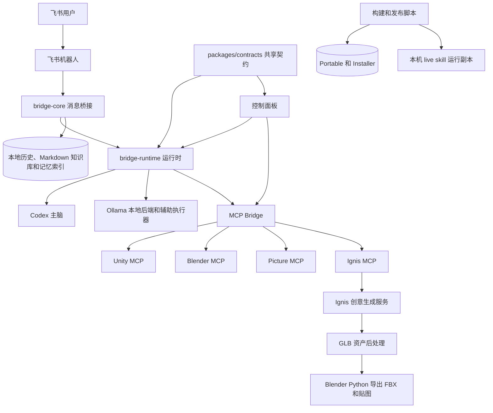
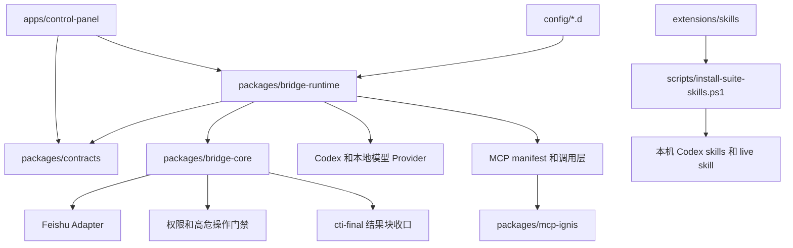
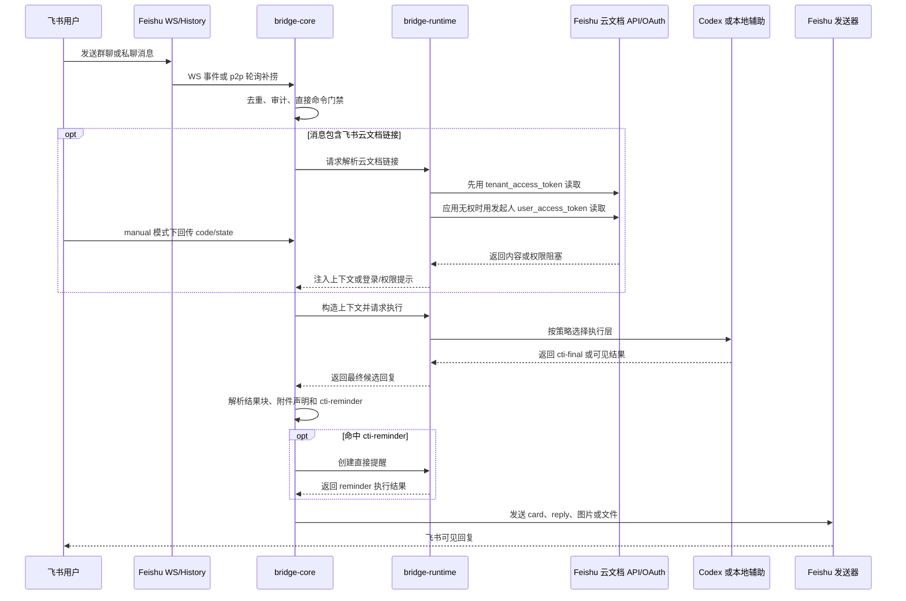
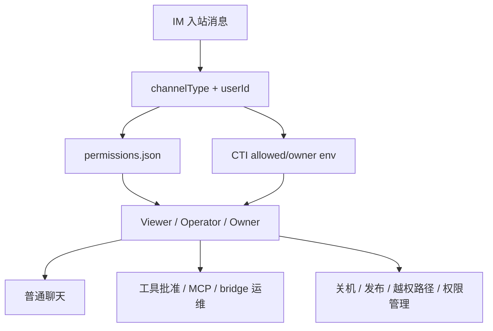
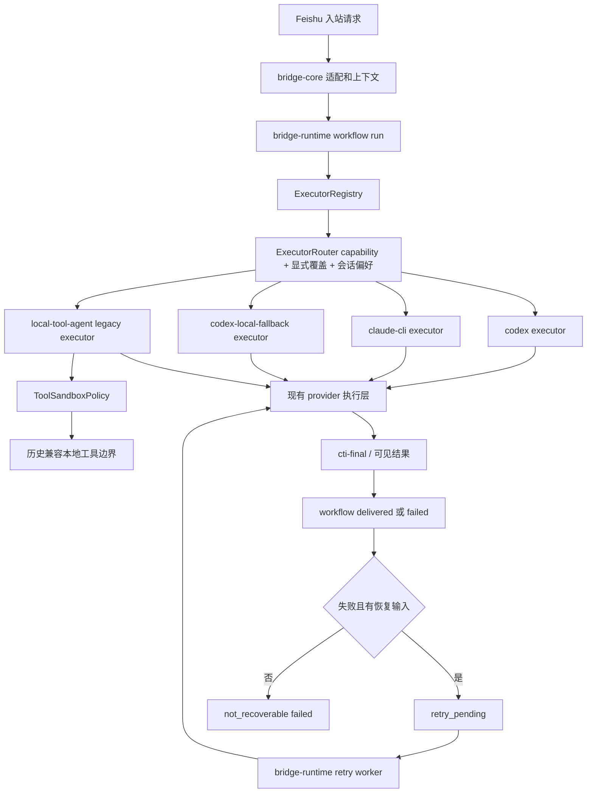
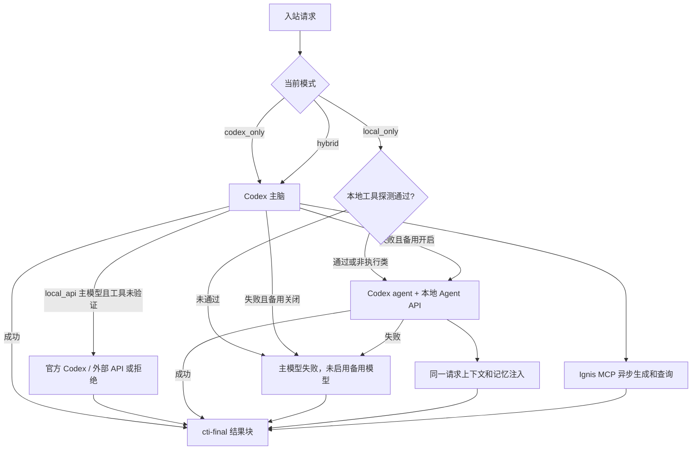
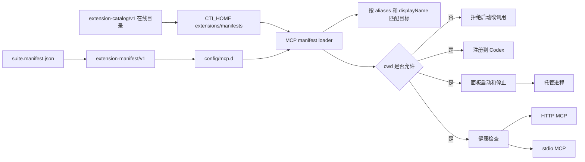
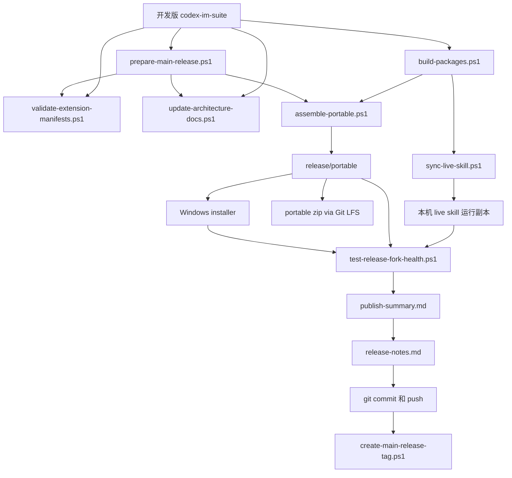

# codex-im-suite 项目架构

更新时间：2026-05-20

## 0. 架构文档维护规则

- 本文是 suite 当前架构的唯一主文档，后续不要再新增平行的架构说明文档。
- 项目内已安装 `project-architecture-diagram` skill，架构变更时优先使用该 skill 更新本文。
- 修改模块边界、运行链路、provider 路由、MCP manifest、Feishu 收发、记忆索引、打包发布链路时，必须检查本文是否需要同步。
- 检查入口：`scripts/update-architecture-docs.ps1`。
- 变更过程和阶段性风险记录到 `docs/DEVELOPMENT-LOG.md`，不要塞进本文。

## 1. 总体定位

`codex-im-suite` 是一个 Windows 优先的本地 AI 协作套件，核心目标是把飞书聊天入口、Codex 执行、MCP 工具、Unity/Blender 工作流、本地记忆和打包发布统一到一个可迁移的项目目录里。

当前不是单体应用，而是一个发行层加多个内部模块：

- `bridge-core` 负责 IM 桥接核心能力。
- `bridge-runtime` 负责把核心库、本地配置、Codex、本地模型和脚本组装成可运行服务。
- `packages/contracts` 负责 Control API、workflow、node agent 和 extension capability 的共享契约。
- `apps/control-panel` 负责可视化运维。
- `config/*.d` 负责 manifest 驱动的扩展发现。
- `scripts` 负责构建、同步、打包、发布。

### 1.1 系统上下文图



### 1.2 模块边界图



## 2. 运行链路

### 2.1 Feishu 入站

Feishu 接收现在是双通道：

- WS 长连是主链路。
- p2p 私聊有历史轮询补捞兜底，避免私聊事件偶发漏掉。
- 群聊 `require_mention=true` 时，adapter 先读事件自带 `message.mentions`，缺失时再从正文里的飞书 `<at ...>` / post `tag=at` 结构兜底识别 bot mention，避免长连事件缺少 mentions 数组时把真实 @bot 消息误丢弃。

收到消息后进入 `bridge-core` 的消息处理主线：

1. 记录运行审计。
2. 去重。
3. 先在 `bridge-manager` 处理无需模型参与的确定性入口，例如权限数字快捷回复、纯闲聊问候、飞书文档列表、`/feishu` 开放平台能力诊断、在线扩展搜索/安装确认、owner 二次确认系统动作和高置信直接提醒。
4. 绑定 chat/session。
5. 记录轻量记忆事件，按 user/chat/global profile 滚动汇总事实、偏好、主题和待跟进项。
6. 如果消息里包含飞书 Docx、Sheets 或 Base 链接，bridge-core 调用 bridge-runtime 的云文档 host；runtime 先用应用 `tenant_access_token` 读取，应用无权时再按发起人 OAuth 用户 token 读取，并把真实内容作为本轮 system context 注入。缺用户 token 时发送登录授权卡片；`CTI_FEISHU_OAUTH_MODE=manual` 时不需要公网回调，用户把飞书授权后的 `code/state` 回调 URL 复制回飞书完成绑定。登录后仍无权限时返回明确阻塞。
7. Feishu Owner 可用 `/feishu` 查看开放平台能力诊断：本地配置、应用 token 直读能力、OAuth fallback 请求 scope、`CTI_FEISHU_GRANTED_SCOPES` 声明的已开通权限，以及各能力缺口。
8. 构造上下文，只按检索命中的片段注入记忆和 Feishu 历史，不全量塞历史。
9. 调用运行时 provider。
10. 解析最终结果块和 `cti-reminder` 动作块。
11. 如果 Codex 明确请求创建提醒，bridge-core 只把结构化动作交给 bridge-runtime 的 reminder host 执行，用户看到的是 bridge 执行结果。
12. 通过 Feishu 原生 reply/card/image 等方式回复。



- `关机 / shutdown` 这类系统级动作不再交给模型自由发挥，而是在 `bridge-manager` 里走固定链路：
  - 仅 `Owner` 角色可发起，适用于所有 IM 渠道。
  - 第一步只记录审计并返回确认提示。
  - 第二步要求用户明确回复 `确认关机`。
  - 确认后桥接先发送执行提示，再直接调用 Windows `shutdown /s /t 0`。
  - 这条链路不经过 Codex、本地模型或本地辅助执行器。

### 2.2 权限门禁

截至 2026-05-11，Feishu 入站不再使用 `bridge_feishu_allowed_users` 作为会话入口白名单。

- Feishu 任何用户都可以向机器人发起普通会话；群聊仍继续受 `group policy` 和 `require_mention` 约束。
- `CTI_FEISHU_ALLOWED_USERS` / `bridge_feishu_allowed_users` 只保留为兼容字段：启动和权限同步时会把其中的用户导入为 `Viewer`。
- 高权限动作统一走 `permissions.json` 的 `Viewer / Operator / Owner` 角色门禁，而不是在 adapter 入站阶段直接拒收消息。


截至 2026-04-27，桥接权限从 Feishu 单 owner 列表升级为三档角色模型：

- `Viewer`：允许普通聊天入口，对应各渠道 allowed users。
- `Operator`：允许中风险运维，例如批准普通工具权限、重启 bridge、启停 MCP 或本地模型。
- `Owner`：允许高危动作，例如关机、发布、越权路径、权限管理和系统级命令。

权限主数据存储在：

- `C:\Users\admin\.claude-to-im\data\permissions.json`

临时工具授权按钮和数字快捷回复使用独立运行时文件：

- `C:\Users\admin\.claude-to-im\data\permission-links.json`

兼容规则：

- JSON 权限库是主数据。
- `permissions.json` 只保存三档角色权限；`permission-links.json` 只保存待处理授权链接，两个协议不能共用同一文件。
- 启动和面板刷新时会从 `CTI_*_ALLOWED_USERS` 导入 `Viewer`，从 `CTI_*_OWNER_USERS` 导入 `Owner`。
- 保存权限后同步写回兼容 env，避免旧配置和脚本失效。
- 没有权限 JSON 且 Feishu 只有一个 allowed user 时，仍保留旧逻辑临时视为 owner。



### 2.3 Provider 选择

截至 2026-04-25，运行时新增第一阶段 workflow / executor 内核。旧 provider 仍负责真实流式执行，但请求进入 provider 前会被标准化为可观察的 workflow run，并通过 executor registry 记录路由选择。当前阶段目标是先打通“入站请求 -> 执行器选择 -> 执行中 -> 成功/失败”的稳定观测闭环，后续再把真实执行实现逐步迁移到 executor adapter。

Workflow 状态：

- `received`
- `authorized`
- `contextualized`
- `routed`
- `executing`
- `finalizing`
- `delivered`
- `failed`

Workflow run 运行状态：

- `running`：当前 runtime 仍在执行。
- `succeeded`：已完成并交付。
- `failed`：执行失败，可能可恢复，也可能不可恢复。
- `retry_pending`：已排队等待自动或手动断点重试。
- `retrying`：后台 retry worker 已领取并正在重跑。

断点续跑第一版：

- provider 创建 run 后会向 `workflow-runs.json` 写入最小恢复输入，包括 prompt、工作目录、模型、system prompt、权限模式、channelType、chatId、发起人 userId、显示名和 messageId。
- bridge-runtime 启动时会检查上一次遗留的 `running` run；有恢复输入且未耗尽次数的标为 `recoverable + retry_pending`，缺少 prompt 等关键信息的标为 `not_recoverable + failed`。
- provider 执行失败时会对可恢复 run 排队一次 `auto_pending` 自动重试；控制面板可通过 `workflow.retryRun` 把失败 run 改为 `manual_pending`。
- `auto_pending` 自动重试只会在 `CTI_WORKFLOW_AUTO_RETRY_MAX_AGE_MS` 新鲜度窗口内被 retry worker 领取，默认 6 小时；超过窗口后必须显式走手动重试，避免 bridge 长时间离线后继续旧任务。
- retry worker 在 bridge 启动后常驻轮询，优先领取手动 retry，再领取自动 retry；重跑前会执行同一套飞书云文档预读取，成功时注入真实内容，缺授权时发送登录/权限阻断而不让 Codex 公网抓取私有链接；重跑成功后写回会话历史，并在保留 channelType/chatId 时主动回发结果。
- 如果 retry 输出包含 `cti-final` 结果块，主动回发会复用 bridge-core 的最终回复解析层：清理协议文本，保留 replyTo 关系，并按结果块发送 Markdown、图片或文件；只有普通文本结果才加“断点续跑重试结果”说明。
- 当前 retry 是“重新执行最小输入”，不是恢复原 Codex 进程；如果重跑过程中出现新的权限请求，后台 retry 会失败并把错误写回 run。
- `packages/bridge-runtime/src/workflow-contract.ts` 会把现有 `workflow-runs.json` 映射为 `packages/contracts` 中的 `WorkflowRunContract`，统一输出 input、provider、retry、delivery、finalizer checkpoint 和 trace event。当前仍不改变执行行为，只为后续 durable execution、run replay 和多节点日志聚合提供稳定契约。
- channel binding 默认允许延续既有 Codex thread，但如果同一 chat 的 `updatedAt` 超过 `CTI_SESSION_IDLE_FRESH_MS`（默认 12 小时），`channel-router` 会先重绑到 fresh session 并清空 `sdkSessionId`，避免旧会话上下文在长时间断线后继续注入。

运行时状态文件：

- `C:\Users\admin\.claude-to-im\runtime\workflow-runs.json`
- `C:\Users\admin\.claude-to-im\runtime\executor-status.json`
- `C:\Users\admin\.claude-to-im\runtime\executor-session-defaults.json`

Executor 目录当前内置五类：

- `codex`：默认主脑 CLI / SDK 执行器，能力包含对话、代码、仓库查询、文件读写、图片输入和 artifact delivery。
- `claude-cli`：可切换 CLI 后端，能力包含对话、代码、仓库查询、文件读写和图片输入。
- `codex-local-fallback`：本地 Agent API 兜底执行器，复用 Codex agent 执行链，只把 API profile 切到本地 OpenAI-compatible 后端。
- `local-tool-agent`：历史兼容执行器，保留 sandbox 声明但普通用户消息不再选择它作为本地直答入口。
- `codex-oss-ollama`：实验性只读执行器，仅在本地 AI 类型为 Ollama 时可用，声明 `codex exec --oss --local-provider ollama`。

路由规则：

- `@codex`、`@claude`、`@local`、`@本地`、`@ollama`、`@codex-oss` 显式覆盖当前会话路由；`@local` / `@本地` 指向 `codex-local-fallback`。
- 控制面板可按 session 写入默认 executor。
- 没有显式覆盖时，按 capability、executor priority 和当前真实 provider 偏好做自动选择。
- 本地 agent 的工具边界由 `ToolSandboxPolicy` 声明，当前允许只读 git、文件读取、文本搜索、受限单文件写入和 MCP 运维入口；高风险动作必须进入权限策略。



当前默认策略是 `Codex CLI 主模型 + 显式备用模型`：

- `hybrid` 模式：默认先由 Codex CLI 主模型判断和执行；主模型失败后默认直接暴露明确错误，不再自动降级。
- `local_only` 模式：默认直接走本地 Agent API primary profile，不再让本地模型绕过 Codex CLI 生成用户可见回复。
- `codex_only` 模式：禁用本地辅助，全部走 Codex。

本地 Agent API 范围：

- 可以作为 Codex CLI 主模型来源，也可以作为用户显式开启的备用模型来源。
- 显式 `local_only`、`@local` 或设置页选择“本地 API 作为主模型”时使用本地 Agent API primary profile，强制传递 `CTI_LOCAL_AI_MODEL`。
- 本地主模型使用独立 `CODEX_HOME`：`CTI_HOME\runtime\codex-home-local-primary`；备用模型使用 `CTI_HOME\runtime\codex-home-local-fallback`，避免主 Codex 会话、模型名和 resume thread 混用。
- 失败后备用模型由 `CTI_CODEX_FAILURE_FALLBACK_MODE=local_agent` 和 `CTI_CODEX_LOCAL_FALLBACK_ENABLED=true` 共同启用，默认关闭；`CTI_CODEX_LOCAL_FALLBACK_REASONING_EFFORT` 默认 `minimal`。
- 本地 API 承接执行类任务前必须通过结构化工具调用探测：`localLlm.probeTools` / 设置页“测试工具调用”会向 OpenAI-compatible `/chat/completions` 发送 `tools` 探针，只有返回真实 `tool_calls` 时才把 `runtime\local-model-capabilities.json` 标为 `passed`。
- `CTI_LOCAL_AGENT_MODE=text_only|agent_verified` 控制本地模型心智，默认 `text_only`；`CTI_LOCAL_TOOL_CALL_REQUIRED=true` 时，即使本地 API 在线，只要未通过探测就不能承接“创建文件 / 生成图片 / 调 Unity 或 MCP / 执行命令”这类需要真实工具结果的任务。
- `CTI_EXECUTION_REQUIRED_ROUTE=codex_or_external|refuse|primary` 控制本地工具未验证时的处理。默认 `codex_or_external`：如果主模型来源是 `local_api` 且任务需要工具结果，运行时会改交官方 Codex / 外部 API profile；`refuse` 会直接返回“未执行 + 原因”；`primary` 只是显式风险开关。
- 探测状态同步写入 `runtime\local-llm-status.json`，Executor Registry 会在 `codex`、`codex-local-fallback` 和 `local-tool-agent` 的 metadata 中暴露 `toolCallingState`、`recommendedMode` 和 `localExecutionTrusted`，供控制面板解释当前模型是否能作为工具型 agent。
- 对 `git status`、当前分支、最近提交、暂存区内容、读取文件和搜索文本这类只读且有固定工具计划的请求，Codex 主模型失败后可以走受控本地工具兜底；该路径由 runtime 自己执行 shell/read/search，不让本地文本模型编造结果，也不承接写入、Unity/Blender/MCP 多步编排或高风险动作。
- MCP 运维小活：状态、启动、停止、工具列表、显式 HTTP tool call。`hybrid` / `codex_only` 模式下这些请求先交给 Codex 主链路；本地 MCP 快路径只在 `local_only` 或 Codex 明确失败后的受控兜底里执行。
- Ignis 创意生成快路径：原画、生成图、视频、模型、canvas、file_id、turn_id 的提交和查询。
- 本地快路径在进入 Ignis、MCP、本地执行器前，统一先做“询问 / 操作”判定；歧义默认按询问处理，只允许只读查询，不直接触发生成、启动、停止、写入或 `git pull`。
- 所有 fast-path handler 在触碰 MCP manifest、启动服务、调用工具或执行本地计划前，都必须重新做 intent preflight；旧 MCP 快路径入口也委托到同一套判断，避免绕过新版规则。
- Ignis 的“最近几次 / 历史 / 整理成列表”优先走历史列表意图，不再因为出现 “Ignis + 检查” 就误落到状态检查。
- Ignis 状态、安装、配置、工具列表类问题不进入生成接口；只有明确创意生成意图才提交任务。
- MCP 快路径只在明确动词下才执行启动、停止、重启和显式 tool call；只说“看看 MCP”时默认返回基于合并 manifest 的动态状态/帮助，不自动操作任何 MCP，也不维护硬编码入口列表。
- Unity/Blender 场景、节点、Prefab、模型、截图、导入导出这类实际工作即使写了 `unitymcp` / `blendermcp`，也不允许被本地 MCP 状态快路径抢答，必须回到 Codex 主脑做正式工具编排。
- 历史本地执行器仍保留只读规则和 sandbox 工具边界，但不再作为普通飞书消息的最终回复 provider；需要兜底时由 Codex agent 切本地 API 后继续执行。
- `关机`、`shutdown`、重启机器等系统级动作现在直接标记为高风险请求，不允许走本地省流路径。
- 对 Unity、Blender、MCP、仓库、文件、图片和历史这类可执行请求，回复契约要求“解决问题优先”：必须基于真实工具结果、真实命令结果或明确阻塞原因回报；不得用通用教程、占位表格或示例脚本替代执行结果。
- 对已经明确提到 `unitymcp`、Unity、Prefab、场景或对象名的具体工具任务，Codex / 本地 Agent 失败后的用户可见回复不能再要求用户“指定 MCP 入口”或返回 MCP 入口列表；出站收口会把这种伪澄清改写成未完成阻塞说明。
- Codex/MCP 执行链失败时，Unity/Blender/MCP/文档等需要真实工具输出的任务默认返回确定性 `未完成 + 阻塞原因`，不再降级给本地模型生成教程；只有用户明确开启备用本地 Agent API 时才会切换备用 profile。MCP 状态类问题在失败兜底里会读取 suite manifest 与用户 overlay，并用 `codex mcp list` 判断 stdio MCP 是否已注册，已注册但未握手时显示“待 Codex 会话握手时加载”。
- Unity 截图/预览任务要求当前轮真实刷新或截图产物；如果 MCP 握手、场景刷新或截图阻塞，回复必须文本说明阻塞，不得从历史 capture 目录挑旧图回传。Unity HTTP MCP 的裸 `/mcp` 406 响应视为服务已响应但握手头不完整，后续应使用 `Accept: application/json, text/event-stream` 和正式 MCP initialize/list-tools 流程确认工具可用性。
- bridge runtime 会为 Codex 主 profile 使用独立 `CTI_CODEX_HOME`，同步全局认证和共享资源时剔除全局顶层 `model = ...`、`features.*` 和默认的 `mcp_servers.*`，避免本机 Codex UI 的模型配置或离线桌面 MCP 拖垮飞书 bridge。只有显式设置 `CTI_CODEX_INHERIT_GLOBAL_MCP=true` 时，bridge Codex 才继承桌面全局 MCP 配置；运行版通过 `CTI_CODEX_MODEL_SOURCE=official|local_api|external_api` 选择官方 Codex、本地 API 或外部 API 作为主模型来源。外部 API 继续使用 `CTI_CODEX_BASE_URL`、`CTI_CODEX_API_KEY`、`CTI_CODEX_MODEL`、`CTI_CODEX_PASS_MODEL` 和 `CTI_CODEX_REASONING_EFFORT`，本地 API 复用 `CTI_LOCAL_AI_*`。
- bridge runtime 通过外部 `@openai/codex-sdk` 启动 Codex CLI 子进程；该 SDK 版本必须跟进当前 Codex CLI 状态库 schema。live 同步流程会在复制源码和 package 后检查并安装所需 SDK 版本，避免旧 SDK 读新 `CODEX_HOME` 状态库时直接退出。
- Ignis 生成类任务提交后会等待完成并下载可回传资产，最终回复走 `cti-final`，避免向飞书裸发 CLI JSON 或大段技术字段。
- Ignis 仅在“该/这张/刚才/上一版/继续”等明确引用时复用上一轮 session 和参考图；普通新生成请求默认新开会话。
- Ignis 模型生成如果明确要求拆成 FBX/贴图，会在 GLB 下载完成后调用 `scripts/export-glb-asset-package.ps1`，输出 FBX、贴图、材质映射和 manifest，并通过 `cti-final.files` 回传不超过飞书限制的文件。
- 本地模型默认仍使用 Ollama，默认地址 `http://127.0.0.1:11434`，默认模型 `qwen2.5-coder:7b`；也可以通过 `CTI_LOCAL_AI_KIND`、`CTI_LOCAL_AI_BASE_URL`、`CTI_LOCAL_AI_MODEL`、`CTI_LOCAL_AI_API_KEY` 和 `CTI_LOCAL_AI_TIMEOUT_MS` 切到 LM Studio、vLLM 或其他 OpenAI-compatible Chat Completions 服务。旧 `llama.cpp` server、GGUF 路径和 `127.0.0.1:8080` 默认地址不再是运行来源。
- 扩展目录会把 `qwen3:14b`、`qwen3:30b`、`qwen3:32b`、`qwen2.5:32b` 标为本地工具候选，安装后仍必须先跑工具探测；默认 `qwen2.5-coder:7b` 定位为文本、总结和保守兜底，不宣称可稳定执行工具。

不交给本地辅助直接完成的范围：

- Unity / Blender / MCP 多步编排；Ignis GLB 的固定 FBX/贴图后处理是受控例外，只走固定脚本，不让本地模型自由编排 Blender。
- 截图、渲染、导入、场景操作。
- 飞书文档创建/删除。
- 图片或附件理解，Ignis 附件只作为参考文件上传，不由本地模型理解内容。
- 项目级复杂重构和排障。



## 3. 核心包职责

### 3.1 packages/bridge-core

核心职责：

- Channel adapter 抽象。
- Feishu/Lark 适配器。
- 消息路由和 session 绑定。
- 权限请求和高危操作门禁。
- 飞书 Markdown/card/image/file/reply 发送。
- 图片出站只使用当前回复显式给出的图片路径：`cti-final.images` 或当前可见文本中的本地图片路径。出站层不再扫描最近 assistant 历史消息补发旧图，避免截图/预览任务失败时把历史截图误当成当前结果。
- 最终结果块解析和出站收口。
- `cti-reminder` 动作块解析、提醒创建请求转交和伪完成拦截。
- 运行审计落盘。

关键能力：

- Feishu 群聊原生 reply。
- 群聊 reply 时可自动 @ 提问人。
- 群聊 mention 判定优先使用事件 `mentions`，事件缺字段时再解析正文里的飞书 at 标记，避免“已 @ 机器人但消息未入会话”。
- Feishu Markdown 默认走 card。
- 飞书 Docx、Sheets、Base 入站链接会先走运行时云文档 host；bridge-core 只接收结构化结果，不持有应用 token 或用户 OAuth token。
- `/feishu` 是 Owner 诊断入口：按飞书开放平台能力列出消息、资源、历史、reaction、CardKit、应用 token 云文档直读、用户 OAuth fallback、Docx、Sheets、Base 等所需 scope，并和 `CTI_FEISHU_GRANTED_SCOPES` 做本地差异检查；不会读取或显示 App Secret。
- 图片和文件由结果块显式声明，桥接不再靠正文猜路径。
- 飞书本地图片和本地文件分别走原生 image/file 消息回传；`.glb` 等非图片资产不能退化成仅发本地路径。
- 超过飞书 IM 单文件上传限制的生成资产改发文档链接或下载链接，不再假装“已发送文件”。
- 本地 `cti-final.files` 文件超过飞书 30MB 单文件限制时，出站层不再分卷，而是走 artifact delivery provider；飞书场景优先支持 `feishu_docx`，会自动创建新版云文档、把文件作为 `docx_file` 附件挂入文档，并回文档链接；也保留 `local_http` 作为公网目录备用方案。
- 直接提醒由 Codex 判断意图，但只允许通过 `cti-reminder` 动作块请求；bridge-core 校验动作后调用运行时 reminder host，防止 Codex 自行声称“已创建系统计划任务 / 已实际发送”。
- 到点提醒的飞书出站优先使用互动卡片，卡片按钮 callback data 为 `reminder:complete:<reminderId>`；`card.action.trigger` 回调在 `bridge-manager` 内直接转给 reminder host，不进入 Codex，也不复用普通权限按钮链路。
- 在线扩展安装由 `/ext search`、`/ext install`、`/ext remove` 和高置信自然语言触发进入确定性链路；搜索只展示候选，安装和移除必须发确认卡片。卡片按钮 callback data 使用 `extinstall:confirm:<nonce>` 或 `extinstall:remove:<nonce>`，不复用 `perm:*` 权限按钮。
- 扩展安装和移除确认只允许同一 chat、同一 Feishu user 且具备 `Owner` 角色的发起人点击；bridge-core 只做命令解析、权限和卡片交互，不直接写扩展目录。
- 用户回复到上一条图片/文件时，Feishu adapter 会尽量读取被回复消息并把附件并入本次请求。
- `bridge-runtime-audit.json` 记录最后阶段、最后消息、WS 状态、p2p 补捞状态。
- 权限门禁统一通过 `hasRole(message, role)` 判定；`Owner` 包含 `Operator` 和 `Viewer` 能力，`Operator` 包含 `Viewer` 能力。关机、发布、越权路径和 mutating 直达命令只允许 `Owner`，普通工具授权和中风险运维允许 `Operator` 或 `Owner`。

### 3.2 packages/bridge-runtime

核心职责：

- 读取 `config.env`。
- 启动 daemon/supervisor。
- 接入 Codex / Claude CLI provider。
- 接入本地 Agent API profile（默认 Ollama，也支持 OpenAI-compatible）。
- 保留历史本地辅助执行器边界。
- MCP manifest 解析和调用。
- 本地 JSON store。
- 记忆检索、Feishu 历史索引、`memory-profiles.json` 轻量画像索引和 Markdown 知识库索引。
- workflow / executor 观测、运行中请求恢复信息持久化、bridge 重启后的可恢复状态识别和 retry worker。
- workflow contract adapter：保持 `workflow-runs.json` 落盘格式不变，同时映射到共享 `WorkflowRunContract`，让控制面板和后续 node agent 不再直接耦合内部 JSON 字段。
- 扩展目录 host：接收 bridge-core 的搜索、URL 预览、准备安装、确认安装和确认移除请求，通过本机 Control API 调用控制面板，不在运行时重新实现安装器。
- Feishu OAuth 和云文档 host：先用应用 `tenant_access_token` 读取 Docx / Sheets / Base，应用无权时再使用发起人 OAuth token；保存加密用户 token。callback 模式按需启动公网回调监听，manual 模式使用飞书官方 `authen/v1/authorize` 授权页并让用户把 `code/state` 回调 URL 发回飞书；读取失败时会按具体接口返回需要检查的只读 scope，避免把权限不足伪装成空内容。

关键能力：

- Codex CLI 主模型来源由 `CTI_CODEX_MODEL_SOURCE` 控制，可选官方 Codex、本地 API 或外部 API；本地 API 使用 `CTI_LOCAL_AI_*`，外部 API 使用 `CTI_CODEX_*`。
- 主模型失败默认返回明确阻塞，不再生成本地模型直答；只有 `CTI_CODEX_FAILURE_FALLBACK_MODE=local_agent` 且 `CTI_CODEX_LOCAL_FALLBACK_ENABLED=true` 时才切到 `codex_local_fallback`。
- 记忆索引分五层：Markdown 知识库索引、当前会话压缩摘要、按人/按聊天/全局 profile、Feishu 历史片段、`audit.json` 已发结果。运行时先生成 `MemoryQueryPlan`，再把检索结果标注来源、置信度、可回答性、质量和结构化 key/value；模型上下文只注入检索命中的少量片段，当前请求始终优先。
- 明确回忆类请求会走 `MemoryReplyDecision`：只有 `quality=high` 的高置信结构化命中才直接由记忆层回复；模糊、多命中、关系图扩展或需要综合的问题只把记忆作为受限上下文交给 Codex，并要求不跑工具、不搜仓库、不编造；未命中时快速返回“没找到相关记忆”。普通任务只做上下文增强，不允许因为关键词命中绕过主执行链。
- 明确“记住 / 记一下 / 保存记忆”类写入不只进入 `memory-profiles.json`，还会写入 Markdown 知识库 `data/explicit-memories/*.md` 并重建知识索引，确保控制面板“记忆”页可见。
- Markdown 知识库默认读取 `E:\cli-md`，生成 `E:\cli-md\.cti-index\knowledge.json`。知识单元分为 `事实 / 结论 / 待办 / 资源`，保留来源文件和片段；显式前缀优先决定分类，Markdown 表格 key/value 会按路径/链接/文件扩展名/Prefab/UIScene/预制体/路径、决策规则词、待办风险词等保守推断分类；单纯的 Scene 标识到常用名映射按事实处理，无法确认时归为事实。
- 知识索引重建后会同步生成 `.cti-index/memory-graph.json`。关系图只来自可解释来源：结构化 key/value、同文件上下文、冲突标记和显式记忆写入；边类型包括 `maps_to`、`reverse_lookup`、`related_to`、`conflicts_with` 等。精确 key 命中仍优先，关系扩展只作为次级候选和 Codex 上下文增强，不提升为 direct memory reply。控制面板“记忆”页默认用关系树展示选中记忆的对应内容、相关对象、待办提醒、可能冲突和来源文件；TanStack Table 网格、联系权重、索引路径和需要检查的回复保留在高级诊断里。
- 记忆整理草稿保存到 `.cti-index/memory-optimization-drafts`，状态保存到 `.cti-index/memory-optimizer-state.json`。草稿 schema 为 `codex-im-suite/memory-optimization-draft/v1`，包含 `add/update/archive` 动作、原因、置信度、风险、来源分组、默认勾选状态和源文件定位；应用草稿只执行前端传入的 `selectedActionIds`，不会默认批量应用所有动作。`data/explicit-memories` 和 `data/todos/direct-reminders` 可默认勾选低风险整理；`docs/*`、根目录笔记和文档索引类来源只展示建议，默认需要人工勾选。应用前会校验草稿生成时的 `sourceIndexGeneratedAt` 是否仍匹配当前 `knowledge.json.generatedAt`，不匹配时要求重新生成草稿。
- 出站前新增答案审查收口：`bridge-core` 把用户原文、候选回复、memory plan/hits、channel/chat/user 和执行证据交给 runtime/store 的 `reviewOutboundAnswer`。v1 规则检查 mojibake、`cti-final` 残留、低价值兜底、工具假完成、缺少成功工具证据的执行完成声明和 `memory_key_mismatch`，默认写 `CTI_HOME\data\answer-review-audit.json`；只有显式配置 `block_or_replace` 时才按审查结果改变飞书可见文本。
- 出站前还有一层硬验证：`cti-final.images/files` 中声明的本地路径必须真实存在；对于“创建 / 生成 / 写入 / 保存 / 执行”等需要真实工具结果的回复，若本轮没有成功 `tool_result`，bridge 会直接把可见回复改为“未完成：已拦截可能的假完成”，并附上本轮工具证据计数。该层不依赖答案审查模式，避免本地 API 主模型或备用模型在未执行工具时编造成果。
- 历史乱码修复入口为 `scripts/repair-history-mojibake.ps1`。默认 dry-run 扫描 `CTI_HOME\data` 历史、Feishu 历史索引、记忆 Markdown 和 `.cti-index`；显式 `-Apply` 时备份原文件、修复典型 mojibake、重建 `knowledge.json` 和 `reminders.json`，`-Restore <manifest>` 可回滚备份。
- 运行时在 Feishu 历史入库/检索、记忆 profile 入库、Markdown 知识索引和待办提醒派生前会先修复或拒绝疑似坏文本，避免错码继续进入 Codex 记忆上下文或主动提醒标题。
- 控制面板可归档和恢复单个知识单元：归档时按知识单元的来源文件和片段精确删除源 Markdown 中对应行，再把原始行和元信息写入 `archive\knowledge-units\*.md`；恢复时只允许读取该归档目录内的文件，并校验归档记录的源文件仍在记忆仓库内，然后回写原始 Markdown 行并重建索引。`archive` 目录被索引器跳过，因此归档项不会在下一次重建后回到知识单元列表；归档区支持手动恢复或永久删除归档文件。
- 待办提醒从 Markdown 知识索引派生：运行时读取 `kind=todo` 的知识单元，解析 `@YYYY-MM-DD HH:mm`、`提醒时间: YYYY-MM-DD HH:mm`、`状态: 未完成|完成|取消` 和来源元信息，生成 `.cti-index\reminders.json`。
- 直接提醒由高置信自然语言 fast-path、`cti-reminder` 动作或 `/remind` 命令创建；其中自然语言入口复用时间短语解析层，支持相对时间、数字/中文数字绝对时刻、半点/刻、上午/下午/晚上/今晚、今天/明天/后天和年月日时刻。运行时写入 `E:\cli-md\data\todos\direct-reminders\*.md`，随后重建 `knowledge.json` 和 `reminders.json`。Codex 只做意图判断，不直接写 Windows 计划任务，也不直接调用飞书 API。
- 主动推送状态写入 `.cti-index\reminder-state.json`，记录 `pending`、已发送、失败、跳过原因和完成字段，保证“到点单条提醒一次”不会重复发送。
- 主动推送默认关闭；启用 `CTI_TODO_PUSH_ENABLED=true` 后按 `CTI_TODO_PUSH_CHANNELS` 加载 PushProvider。v1 飞书 provider 复用 bridge-core 的发送收口、去重和审计；微信 provider 只返回 `unsupported`，面板显示“未接入”。
- `completeReminder()` 是飞书卡片和控制面板共用的完成收口：直接提醒必须把 `data\todos\direct-reminders\*.md` 中的 `状态: 未完成` 改成 `状态: 完成` 并重建索引；普通记忆待办只在精确匹配同一待办行时自动改源文件，否则仅记录完成状态和需手动确认的原因。
- 直接提醒的创建和推送由 `CTI_DIRECT_REMINDER_ENABLED`、`CTI_DIRECT_REMINDER_PUSH_ENABLED`、`CTI_DIRECT_REMINDER_DECISION_MODE` 和 `CTI_DIRECT_REMINDER_ALLOW_SLASH_COMMAND` 控制；默认使用 Codex action 判断和 bridge 统一执行。
- 待办来源会话必须来自 Markdown frontmatter 或结构化字段 `channelType`、`chatId`、`messageId`、`displayName`。来源无法确认时进入“待补来源”状态，不回退 owner 私聊，也不猜测 chatId。
- 旧规则 Markdown 归档入口为 `scripts/memory/archive-legacy-rules.ps1`，默认 dry-run；显式 `-Apply` 时才移动到 `archive\legacy-rules` 并生成 `AUTHORITATIVE-RULES.md`。
- `bridge-core` 会在收到普通消息和生成最终回复后写入记忆事件；纯问候、感谢、确认等闲聊会走确定性短回复，不启动 Codex/本地工具链。
- MCP 工作目录检查，防止误连其他项目。
- 默认工作区和 Unity 工程路径由配置控制。
- `workflow-runs.json` 保存最近 workflow run、事件、recovery 和 retry 状态；它是控制面板展示执行历程、手动重试失败 run 和 bridge 重启后自动续跑的事实来源。
- 扩展确认动作写入 `C:\Users\admin\.claude-to-im\data\extension-install-actions.json`，默认 TTL 10 分钟；确认时校验 nonce、chat、user 和过期时间，通过后调用 Control API 的 `extension.remote.install` 或 `extension.remote.remove`。

### 3.3 packages/contracts

共享契约包，定位为控制面、runtime、node agent 和扩展市场之间的类型边界。

用途：

- 定义 Control API 通用响应、错误、命令、服务状态和运行单元 DTO。
- 定义 `WorkflowRunContract`、checkpoint、trace event、recovery 和 delivery 字段。
- 定义 node agent heartbeat、capability inventory、action lease 和 log stream 的第一阶段 schema。
- 定义 extension capability、trust policy、credential scope 和 manifest 风险等级字段。
- 保存 JSON schema snapshot，支持后续 backward-compat fixture 和跨语言 DTO 对齐。

当前边界：

- TypeScript 是第一阶段事实来源，C# Control API 和 React 前端先消费等价字段结构。
- 第一阶段只做契约和只读状态，不引入数据库、远端执行租约或公网 marketplace。
- `scripts/build-packages.ps1` 会先构建 `contracts`，再构建 bridge/runtime/MCP 包。

### 3.4 packages/mcp-picture

图片相关 MCP，定位为独立能力包。

用途：

- 图片标注。
- 视觉布局辅助。
- 图片工作流中间能力。

### 3.5 packages/mcp-unity-prefab

Unity Prefab MCP，定位为独立 Unity 资源分析/生成能力。

用途：

- Prefab 扫描。
- Prefab 数据服务。
- Unity 资源侧辅助。

### 3.6 packages/mcp-ignis

Ignis CLI MCP，定位为创意生成能力包。

用途：

- 原画、概念图、生成图、视频和 3D 模型任务提交。
- `turn_id`、`session_id`、`canvas_id`、`file_id` 的结果查询。
- 本地参考文件上传到 Ignis。
- 会话历史、可用 Ignis 内部技能和中断追问恢复。

接口：

- HTTP MCP：给面板和本地模型快路径使用，默认 `http://127.0.0.1:8787/mcp`。
- stdio MCP：给 Codex `codex mcp add` 注册使用。
- 本机 CLI 配置：`C:\Users\admin\.ignis\config.json`。

安全边界：

- Ignis config URL 和 token 不进入仓库、release 包或日志。
- 生成任务默认异步提交；桥接内部保存 `turn_id`、`session_id`、`canvas_id` 和 `file_id`，飞书侧默认只发送用户可见摘要和可回传附件。
- 模型资产后处理只读取本地已下载的 Ignis GLB/GLTF；依赖本机 Blender 或 `BLENDER_EXE`，找不到 Blender 时只报告拆分失败，不伪造 FBX/贴图结果。

## 4. 控制面板

位置：

- `apps/control-panel`
- `apps/control-panel/web`

职责：

- 启停 Feishu bridge。
- 查看真实进程状态。
- 查看 Feishu WS 和私聊补捞状态。
- 查看 Codex / Ollama 本地辅助模式。
- 启停和检查 MCP。
- 自动发现 `mcp.d`、`skills.d`、`plugins.d`。
- 展示 suite 版本、扩展协议版本、启用扩展数量、缺失依赖和本机配置覆盖数量。
- 通过“设置”弹窗修改非敏感路径配置和回复风格配置。
- 通过“查看会话”弹窗查看会话、历史索引检索和同步状态。
- 查看 workflow run、executor 目录、最近路由选择和会话默认 executor。
- 查看节点拓扑、heartbeat、capability inventory 和 fake remote node 状态。
- 管理 IM 用户权限、角色和最近会话参与人。
- 本机备份发布和主干发布预检。
- 查看可操作系统蓝图、记忆关系树、记忆整理草稿、索引来源总览、记忆知识库索引状态、监听状态、关键词搜索、来源分组筛选、分页列表和来源片段；专业网格和关系缓存细节默认收进高级诊断。
- 通过“Codex CLI 模型来源”配置和测试官方 Codex、本地 API 或外部 API 主模型；常用模式只展示策略、服务、模型和地址，高级字段折叠保留。API key 只写入本机 `config.env`，Web 状态只返回是否已设置和掩码。

截至 2026-05-16，控制面板采用 `Control API + React/Vite + 可选 WinForms/WebView2 壳`：

- Control API 是状态读取、白名单命令分发、会话详情、媒体缓存、workflow/executor/permissions 和本机脚本调用的统一后端。
- WinForms 负责窗口生命周期、WebView2 Runtime 检测，并启动或连接本机 Control API；桌面壳不再把业务命令硬塞进 WebView 事件。
- React 前端负责信息架构、导航、状态展示、长任务 pending 状态和活动流。
- 前端通过 `HostBridge` 自动探测传输层：WebView2 内仍可走 `window.chrome.webview`，普通浏览器走 HTTP API 和 SSE。
- 前端只能通过 HostBridge 请求后端执行白名单命令，不能直接运行 shell、PowerShell、Git 或文件系统操作。
- Control API 默认只监听 `127.0.0.1:8788`；只有显式配置 `CTI_CONTROL_API_ALLOW_REMOTE=true` 和 `CTI_CONTROL_API_AUTH_TOKEN` 后才允许非本机访问。
- 桌面 loopback 模式允许端口自动避让：如果 `8788` 已被旧面板或 API-only 服务占用，宿主会尝试后续端口并把前端加载地址切到实际端口；远程监听和显式公网 base URL 不做自动避让。
- 远程 token 默认角色是 `viewer`；`CTI_CONTROL_API_AUTH_ROLE=operator|owner` 决定远程请求能否进入中风险或高风险命令。
- 远程 Owner 高危命令默认关闭，必须额外配置 `CTI_CONTROL_API_ALLOW_REMOTE_DANGEROUS=true` 才能继续进入权限门禁。
- 本机缺少 WebView2 Runtime 时，宿主显示轻量降级页和安装提示，不回退旧完整 WinForms 面板。
- 面板主界面已取消底图依赖，统一改成高密度运营台布局；总览、服务、扩展、会话、设置和日志都按窗口宽度自适应重排。
- WinForms 宿主新增统一运行单元注册表，桥接服务、Codex CLI、Ollama、MCP 和扩展 manifest 在前端统一收敛成一套卡片和动作模型。
- 运行单元动作现在允许按 manifest 暴露安装入口；skill 和部分 MCP 只要声明 `installer` / `bootstrap`，面板就会显示“安装”按钮并走宿主白名单执行。
- CLI 工具更新也走 `runtime.invokeAction` 白名单。当前 Codex CLI 只有在检测到 npm 全局 `@openai/codex` 安装时才显示“更新”，宿主固定执行 `npm install -g @openai/codex@latest`，不接受前端传入任意命令。
- 扩展页新增“导入本地目录”入口：可选择或拖入本地目录，宿主会先按 `SKILL.md` / `package.json` / 目录名规则识别为 `skill` 或 `mcp`，预览生成的 manifest，再写入 `config/skills.d` 或 `config/mcp.d`。
- 扩展页的 MCP 运行状态按健康检查、Codex 注册和托管进程综合判断；`bundled`、`external` 只作为安装来源展示，不再直接映射成“待处理”状态。
- Unity HTTP MCP 的面板健康检查不再把裸 `/mcp` 的 406 或 HTTP 可达当作可用；只有 Unity MCP 会在 MCP `initialize` 后读取 `mcpforunity://instances`，区分 endpoint 在线、MCP protocol 可用、Unity Editor session 可用三层状态。Ignis 等非 Unity HTTP MCP 只做自身 MCP initialize 检查，不读取 Unity 资源。
- Unity MCP 的运行单元“修复”动作会重启 `mcp-for-unity` helper，并优先使用 Unity 工程 `Library\MCPForUnity\TerminalScripts\mcp-terminal.cmd` 拉起 HTTP server；如果 Unity Editor 没有注册 session，面板会明确显示 session 不可用或读取超时。
- bridge-runtime 的 Unity MCP 执行前预检同样要求 `mcpforunity://instances` 返回 `instance_count > 0`；单纯 HTTP 在线或 406 不再允许进入 Unity 截图、场景刷新或 prefab 操作链路。
- 会话区新增 WebView 详情抽屉，宿主通过 `history.getSessionDetail` 返回完整消息流；旧 `ConversationViewerForm` 保留为兼容调试入口。
- 会话详情现在会解析消息类型、消息 ID 和附件元数据；对飞书图片/文件消息，宿主会按消息资源接口拉取原始资源，缓存到 `CTI_HOME\\runtime\\control-panel-media`，并通过 Control API `/media/*` 暴露给前端。前端直接展示图片缩略图和附件状态，不再只显示 `[图片]` 这类占位文本。
- 会话详情支持强制刷新，宿主会绕过详情缓存重新读取会话历史；旧索引中图片/文件消息缺少资源键时，会触发会话级远端重同步。
- 会话详情读取旧本地消息时仍保留显示层 mojibake 修复；需要改写历史 JSON 或记忆索引时走 `scripts/repair-history-mojibake.ps1 -Apply`，由备份 manifest 承担回滚。
- 会话详情会按 `sessionId` / `chatId` 关联 `workflow-runs.json`，展示 executor、阶段状态、prompt 摘要、recovery / retry 状态和事件时间线，方便回溯一次飞书请求从接收、路由、执行、重试到交付或失败的运行历程。
- 执行器页和会话详情对失败但保留恢复输入的 run 显示“重试”入口，宿主通过 `workflow.retryRun` 原子更新 `workflow-runs.json`，运行时 retry worker 再领取执行。
- 顶部栏显示 live skill 同步状态；宿主在 `state.refresh` 中读取 live `.suite-release.json.generatedAt`、suite/live commit 与关键内容 hash，必要时通过 `live.sync` 只执行 `scripts/sync-live-skill.ps1`，不打包、不提交、不推送、不重启 bridge。
- 控制面板唯一正式 exe 入口是 `CodexImSuiteControlPanel.exe`；live 同步、doctor、fingerprint 和内容 hash 都只认该入口。旧 `ClaudeToImControlPanel.exe` 不再发布，若 live 目录仍残留会在同步时清理。
- “权限”页读取 `permissions.json` 和最近会话参与人，支持按渠道、角色、名称或 ID 过滤，能把用户设置为 `Viewer`、`Operator` 或 `Owner`，并同步兼容 env 后重启 bridge。
- 会话详情的参与人列表不再只提供一次性“加 Owner”，而是进入同一套权限库，可直接设置三档角色；显示名优先来自飞书历史，拿不到时显示原始 ID。
- 设置页新增 `path.pickFolder` / `path.pickFile` / `path.openAny` 等目录选择协议，路径字段支持拖拽、回填和快速打开。
- 回复风格预设通过 `settings.listReplyPresets` / `settings.applyReplyPreset` / `settings.summarizeReplyStyle` 暴露给 WebView，继续沿用宿主保存语义。
- WebView 命令入口执行“一键发布”和“主干发布预检”时不再依赖 WinForms 原生确认框；桌面工具栏保留确认框。发布脚本非零退出会作为命令错误返回前端，避免发布失败被误显示为完成。
- Ollama 状态卡只展示当前 daemon 生命周期内的最近路由；bridge 重启时会清掉旧的 fallback / refusal 瞬时状态，避免把历史 `usage limit` 或旧兜底信息当成当前异常。
- bridge 启动时会立即写入 `executor-status.json` 的 executor 基线状态；即使还没有新的飞书请求进入 provider，控制面板也能看到执行器目录和会话默认 executor，不再把缺失状态文件误解为辅助器异常。
- “节点”页通过 `nodes.list` 读取本机 node snapshot。第一阶段固定展示 `local` runtime node 和可关闭的 `fake-remote` node，用于验证多节点控制面模型、capability inventory、heartbeat 和可管理状态；当前页面只读，不向远端 node 下发动作。
- “总览”页的系统蓝图只用“正常 / 需要处理 / 未启用”展示用户入口、Bridge 收发、AI 执行、MCP/记忆/提醒辅助和最终回复链路；点击节点会打开处理面板，复用 `runtime.invokeAction` 和现有页面跳转来检查状态、启动/重启服务、处理 MCP、刷新记忆或进入设置，避免普通用户先看到内部协议字段。
- “记忆”页第一屏优先展示关系树，左侧按来源把普通记忆、生成摘要、上下文/索引资料分组；显式记忆和直接提醒默认展开，`AI_BRIDGE_CONTEXT.md`、根目录笔记、文档索引和生成摘要默认降级到折叠分组。右侧围绕选中的知识单元展开对应内容、相关对象、待办提醒、可能冲突和来源文件；树内提供“生成整理草稿”主入口。原始知识单元表、相关对象表、联系表、路径、权重和答案审查 warning 保留在默认收起的高级诊断里。
- “记忆”页保留默认折叠的索引来源说明，解释面板搜索显示数、`knowledge.json` 全量知识单元数、来源文件分组、默认可整理风险和跳过目录，避免把默认前 40 条搜索结果误解为全部记忆，但不作为主流程界面。
- “记忆”页新增“记忆整理”面板，通过 `memory.optimizePreview` 生成待确认草稿，用户只能应用已勾选动作；显式记忆和直接提醒可默认勾选，文档、根目录笔记和索引类来源默认只作为建议展示。已应用草稿可通过 `memory.optimizeUndo` 批量恢复归档动作，新增/更新动作只标为需要人工确认；定期草稿开关只改变 `.cti-index\memory-optimizer-state.json`，不会自动应用。
- 记忆仓库路径现在强制落在工作目录外；如果 `CTI_MEMORY_REPO_DIR` 指向默认工作目录、Unity 项目目录或其子目录，宿主和运行时都会自动回退到默认记忆仓库。Windows 默认记忆仓库为 `E:\cli-md`。
- 记忆 Markdown 不再因为关键词命中就绕过 Codex 直答。明确“回忆 / 搜索 / 上次 / 记得”类请求和符合记忆键形态的短问题会检索记忆；是否直答由通用 `MemoryReplyDecision` 按结构化命中、质量和置信度判断，不再在 bridge-core 里为单个词条写快路径。其他请求只把相关记忆作为上下文注入主执行链。
- 桥接运行时新增 `data/memory-profiles.json`：按用户 ID、chatId 和全局 scope 维护事实/偏好、近期主题和待跟进项。该索引由消息事件和 Feishu 历史同步增量更新，只作为检索候选，不会整体注入模型上下文。

面板原则：

- 面板只做 orchestration，不承载桥接业务逻辑。
- 主窗口优先服务日常运维，只常驻服务总览、MCP 管理和日志记录。
- 服务按钮放在对应服务卡里。
- 状态优先读真实进程和运行审计，不再只信旧 `status.json`。

HostBridge 命令协议：

```json
{ "id": "request-id", "type": "command", "command": "state.refresh", "payload": {} }
```

响应：

```json
{ "id": "request-id", "type": "result", "ok": true, "data": {} }
```

宿主推送：

```json
{ "type": "state", "data": {} }
```

当前核心白名单命令分组：

- 状态与服务：`state.refresh`、`panel.*`、`bridge.*`、`codex.*`、`localLlm.*`、`ollama.*`
- Live 同步：`live.sync`
- Workflow 和执行器：`workflow.listRuns`、`workflow.getRun`、`workflow.getEvents`、`workflow.retryRun`、`executor.list`、`executor.check`、`executor.setSessionDefault`
- 节点：`nodes.list`
- 权限：`permissions.list`、`permissions.upsert`、`permissions.remove`、`permissions.syncFromConfig`、`permissions.applyAndRestart`
- 运行单元：`runtime.listUnits`、`runtime.invokeAction`
- 扩展：`extension.enable`、`extension.disable`、`extension.remove`、`extension.install`
- 扩展导入：`extension.detectImport`、`extension.importFromFolder`
- 在线扩展目录：`extension.catalog.list`、`extension.catalog.refresh`、`extension.remote.preview`、`extension.remote.install`、`extension.remote.remove`
- 会话：`history.listSessions`、`history.getSessionDetail`、`history.openConversationViewer`
- 记忆：`memory.status`、`memory.search`、`memory.openSource`、`memory.reminders`、`memory.checkReminders`、`memory.testReminder`、`memory.restoreArchive`、`memory.optimizeStatus`、`memory.optimizePreview`、`memory.optimizeApply`、`memory.optimizeUndo`、`memory.optimizeDiscard`、`memory.optimizeSchedule`
- 设置与路径：`settings.read`、`settings.save`、`settings.listReplyPresets`、`settings.applyReplyPreset`、`settings.summarizeReplyStyle`、`path.pickFolder`、`path.pickFile`、`path.openAny`
- 历史消息解析会优先提取 Feishu `text / post / interactive` 内容；卡片消息不再统一显示成 `[卡片消息]` 占位。对旧索引里遗留的卡片占位，控制面板会按 `messageId` 从 `data/audit.json` 回填可见摘要，尽量不要求用户手动全量重同步。
- 历史消息解析会保留飞书 `image / file` 资源键和文件名；旧索引缺少资源元数据时，详情页会触发一次会话级 full sync 尝试补齐。资源下载失败或权限不足时，前端显示明确的附件占位和状态，不伪装成已加载图片。

Control API HTTP 接口：

- `GET /healthz`
- `GET /api/state`
- `POST /api/commands`
- `GET /api/events`
- `GET /api/session/{chatId}/{sessionId}`
- `GET /media/{resourceId}`

远程部署入口：

- `scripts/start-control-api.ps1` 可直接启动 API-only 模式。
- `CTI_CONTROL_API_HOST` / `CTI_CONTROL_API_PORT` 控制监听地址。
- `CTI_CONTROL_API_PUBLIC_BASE_URL` 用于反向代理或公网地址下生成媒体 URL。
- `CTI_CONTROL_API_AUTH_ROLE` 控制远程 token 的角色等级，默认 `viewer`。
- 非本机请求通过 `Authorization: Bearer <token>` 或 `?token=<token>` 认证；浏览器模式会保存 URL 里的 token 并用于 HTTP/SSE 请求。

## 5. Manifest 驱动扩展

截至 2026-04-22，扩展 manifest 使用 `extension-manifest/v1` 协议。`suite.manifest.json` 是协议版本和 manifest 目录的入口，`scripts/validate-extension-manifests.ps1` 负责校验现有 MCP、skill、plugin 清单。

所有扩展 manifest 都必须声明：

- `id`
- `displayName`
- `type`
- `version`
- `compatibility`
- `category`
- `optional`
- `installState`
- `source`
- `enabled`
- `description`

通用字段含义：

- `compatibility.protocol` 固定为 `extension-manifest/v1`。
- `compatibility.suite` 声明兼容的 suite 版本范围。
- `category` 用于面板展示和运营分组。
- `optional` 表示缺失时是否阻断主流程。
- `installState` 表示 `bundled`、`external`、`configured` 或 `missing`。
- `source` 指向项目内路径、外部插件标识或外部安装源。
- `aliases` 给运行时提供自然语言匹配词，MCP 快路径按 manifest 动态解析目标，不再维护固定 MCP 名称列表。
- `installer` / `bootstrap` 用于声明可由控制面板触发的安装脚本；宿主通过白名单环境变量把扩展 ID、类型、source 和 manifest 路径传给安装脚本，不允许前端直接执行 shell。

截至 2026-05-08，控制面板新增在线扩展目录 v1：

- 本地种子是 `config/extension-catalog.json`，远端精选目录通过 `CTI_EXTENSION_CATALOG_URLS` 追加。
- 下载和安装内容只落在 `C:\Users\admin\.claude-to-im\extensions`，不进入 `release` 或源码仓库。
- 用户安装生成的 manifest overlay 位于 `extensions\manifests\mcp.d`、`extensions\manifests\skills.d`、`extensions\manifests\plugins.d`，面板、`mcp-bridge`、`install-suite-skills.ps1` 和 `register-external-mcps.ps1` 会和 `config/*.d` 合并读取。
- 允许的安装 handler 固定为 `skill.copy`、`mcp.npm`、`mcp.uvx`、`mcp.zip`、`ollama.pull`、`manifest.record` 和 `codex-plugin.record`；HTTPS URL 预览只接受单个 catalog item JSON 或带 `extension.json` 的 zip。
- 目录快照会同时识别 `installed-lock.json`、本机 Ollama `/api/tags`、内置 `config/*.d` manifest 和用户 overlay manifest。内置 config 记录显示为已安装但不可从目录删除，只有用户 overlay 或安装锁记录显示可“移除记录”。
- “移除记录”只删除 suite 生成的用户覆盖层 manifest、launcher 或安装锁记录；不删除 Ollama 模型本体、OpenAI bundled 插件缓存或外部包管理器内容。
- 精选目录条目有 `sha256` 时安装前校验；没有校验值的 URL 被标记为不可信，必须由用户确认。远程 Control API 安装和移除要求 Owner；飞书入口还会先发 Owner 确认卡片。
- Codex app plugin 条目可以出现在目录中作为 `codex-plugin.record` 记录项，例如 Browser 插件记录为 `source=codex-plugin:browser-use`；安装只写 suite 记录，移除只删除 suite 记录。

### 5.1 MCP

目录：

- `config/mcp.d`
- `C:\Users\admin\.claude-to-im\extensions\manifests\mcp.d`

当前 MCP：

- `unityMCP`
- `blenderMCP`
- `pictureMCP`
- `unityPrefabMCP`
- `ignisMCP`

每个 MCP 通过 JSON manifest 声明：

- `id`
- `displayName`
- `type`
- `version`
- `compatibility`
- `category`
- `optional`
- `installState`
- `source`
- `aliases`
- `enabled`
- `launcher`
- `stopLauncher`
- `cwd`
- `env`
- `healthCheck`
- `registerName`
- `description`
- `installer`

MCP 安全规则：

- MCP 的 `cwd` 必须命中当前默认工作区、允许根目录或 Unity 工程路径。
- 不符合时拒绝启动、检查、列工具和调用工具。
- Unity 截图、Blender 操作等复杂任务默认走 Codex 主脑，不由本地 MCP 快路径接管。
- Ignis MCP 允许本地模型快路径直接提交和查询创意生成任务，但不接收仓库内保存的密钥。



### 5.2 Skills

目录：

- `config/skills.d`
- `extensions/skills`
- `C:\Users\admin\.claude-to-im\extensions\manifests\skills.d`

当前纳入项目备份的 skills：

- `memory-repo-retrieval`
- `feishu-document-generation`
- `unity-mcp-orchestrator`
- `blender-mcp-glb-unity-pipeline`
- `github-bmad-master`
- `github-memory-protocol`
- `ignis-cli`

同步到本机 Codex：

```powershell
powershell -ExecutionPolicy Bypass -File .\scripts\install-suite-skills.ps1
```

### 5.3 Plugins

目录：

- `config/plugins.d`
- `C:\Users\admin\.claude-to-im\extensions\manifests\plugins.d`

当前记录：

- `browser-use`
- `build-web-apps`
- `game-studio`

## 6. 本地 Agent API

当前本地 Agent API 链路：

- 默认 Ollama server，也支持 OpenAI-compatible Chat Completions
- 默认地址 `http://127.0.0.1:11434`
- 默认模型 `qwen2.5-coder:7b`
- OpenAI-compatible `/v1/chat/completions`
- 原生 `GET /api/tags` 健康检查和模型可用性检查

定位：

- 不是主脑。
- 是 Codex CLI 的本地/自托管 API 后端，可作为主模型来源，也可作为用户显式开启后的备用模型。
- 不作为普通飞书消息的直接回复器，不再生成 `local_best_effort` 用户可见答复。
- 面板配置写入 `CTI_LOCAL_AI_*`，Codex local primary / fallback profile 会读取这些值并强制传递本地模型名。
- 在 `local_only` 模式或设置页选择“本地 API 作为主模型”时，通过 Codex agent + 本地 Agent API 执行请求。

脚本：

- `scripts/local-llm/setup-ollama.ps1`
- `scripts/local-llm/start-local-llm.ps1`
- `scripts/local-llm/stop-local-llm.ps1`
- `scripts/local-llm/healthcheck-local-llm.ps1`
- `scripts/export-glb-asset-package.ps1`

新配置优先级：

- `CTI_LOCAL_AI_KIND`：`ollama`、`lmstudio`、`vllm`、`openai-compatible` 或 `custom`。
- `CTI_LOCAL_AI_BASE_URL` / `CTI_LOCAL_AI_MODEL` / `CTI_LOCAL_AI_API_KEY` / `CTI_LOCAL_AI_TIMEOUT_MS`：本地 AI 请求入口、模型、可选 Bearer key 和超时。
- `CTI_CODEX_MODEL_SOURCE`：`official`、`local_api` 或 `external_api`，决定 Codex CLI 主模型来源。
- `CTI_CODEX_INHERIT_GLOBAL_MCP`：是否让 bridge Codex 继承桌面全局 `mcp_servers.*`，默认 `false`；普通飞书运行态不依赖桌面 MCP，避免外部 MCP 离线导致主模型失败。
- `@openai/codex-sdk`：bridge-runtime 的外部可选依赖，当前随 suite 锁定到 `0.132.0`；live 同步会校验运行副本中的实际安装版本。
- `CTI_CODEX_FAILURE_FALLBACK_MODE`：主模型失败后的备用策略，默认 `none`；设置为 `local_agent` 时才允许切到备用本地 Agent API。
- `CTI_CODEX_LOCAL_FALLBACK_ENABLED`：控制主模型失败后是否启用备用本地 Agent API，默认 `false`。
- `CTI_CODEX_LOCAL_FALLBACK_REASONING_EFFORT`：本地 fallback profile 的 reasoning effort，默认 `minimal`。
- `CTI_MEMORY_OPTIMIZER_ENABLED` / `CTI_MEMORY_OPTIMIZER_INTERVAL_DAYS` / `CTI_MEMORY_OPTIMIZER_MODEL_SOURCE`：控制记忆定期整理草稿，默认关闭、7 天、`codex_primary`。
- `CTI_OLLAMA_*` 保留兼容；未设置 `CTI_LOCAL_AI_*` 时继续作为默认值来源。

旧 `CTI_LOCAL_LLM_SERVER_EXE`、`CTI_LOCAL_LLM_MODEL_PATH`、`CTI_LOCAL_LLM_SERVER_ARGS`、`llama-server.exe` 和 GGUF 路径配置已废弃。`CTI_LOCAL_LLM_*` 中的路由键暂时保留为兼容项；用户可见配置统一通过面板“Codex CLI 模型来源”写入官方 Codex、本地 API、外部 API 和可选备用模型。

Ignis 会话映射：

- `C:\Users\admin\.claude-to-im\runtime\ignis-sessions.json`
- 按飞书 chat/session 保存最近 `turn_id`、`session_id`、`canvas_id` 和 `file_id`。
- 支持“继续上一版”“查上一个结果”“等待完成”等追问；只有明确引用语义才复用上一轮参考资产。

## 7. 记忆与历史

本地桥接数据默认在：

- `C:\Users\admin\.claude-to-im\data`

主要文件：

- `sessions.json`
- `bindings.json`
- `permissions.json`
- `permission-links.json`
- `feishu-oauth-tokens.json`
- `messages`
- `message-archives`
- `feishu-chat-index.json`
- `feishu-p2p-user-index.json`
- `feishu-history-index.json`
- `feishu-history`

记忆策略：

- 远端 Feishu 历史是主来源。
- 本地索引用于检索、加速、压缩和容灾。
- AI 不直接吃全量历史，而是先检索相关片段。
- Markdown 知识库默认位于 `E:\cli-md`，运行时监听 Markdown 并生成 `.cti-index\knowledge.json`。
- 运行时 watcher 同步写入 `.cti-index\status.json`，包含 `watching`、`watcherPid`、`watcherStartedAt`、`lastEventAt`、`lastIndexedAt` 和 `statusUpdatedAt`；控制面板用该心跳判断真实监听状态。
- 知识单元分为 `事实 / 结论 / 待办 / 资源`，结果保留来源路径、片段和冲突标记。
- `memory.status` 会返回 `sourceCoverage`，按来源路径汇总知识单元数、最近更新时间、来源分组、默认风险和是否可自动整理；`memory.search` 支持 `sourceGroup`、`offset`、`limit`，默认轻量显示但可分页查看完整匹配列表。
- 记忆整理草稿包含 `sourceSummary`、动作来源分组、默认勾选和人工复核标记；应用时必须传 `selectedActionIds`，并在 `sourceIndexGeneratedAt` 与当前 `knowledge.json.generatedAt` 不一致时拒绝旧草稿。
- 归档恢复入口只允许读取 `E:\cli-md\archive\knowledge-units` 内文件，并校验归档记录的源文件仍在记忆仓库内；单条恢复和草稿撤销都会重建知识索引和提醒索引。
- 待办提醒索引为派生文件：`.cti-index\reminders.json` 保存待发送、已发送、跳过和失败的展示数据，`.cti-index\reminder-state.json` 保存 `pending / sent / failed / skipped` 推送状态和最近结果。控制面板“记忆”页显示提醒时间、来源类型、来源会话、来源片段、跳过原因和飞书测试发送入口。
- `sourceType=direct` 的提醒来自 `cti-reminder` 或 `/remind`，源文件落在 `data\todos\direct-reminders`；面板会把它和普通 `sourceType=memory` 待办区分展示。
- Codex CLI 主模型不可用时，默认报告真实阻塞；只有用户显式开启备用本地 Agent API 时，才由 Codex agent 切到本地 Agent API 继续执行。工具链、写文件、发布和 Unity/Blender/MCP 任务不得降级成教程式回复。

## 8. 结果封装协议

桥接已经从“猜测裁剪结果”改成结果块协议。

Codex 应输出：

````text
```cti-final
{
  "kind": "text",
  "text": "最终发给用户的内容",
  "images": [],
  "files": [],
  "reply_mode": "markdown"
}
```
````

桥接行为：

- 优先解析 `cti-final`。
- 命中后只发送结果块内容。
- Markdown 统一走 Feishu card。
- 图片和文件由结果块显式声明。
- 协议失败时保守兜底，不再强行猜半截结果。

直接提醒动作块：

````text
```cti-reminder
{
  "title": "看电脑",
  "dueAt": "2026-04-29T19:42:00+08:00",
  "timezone": "Asia/Shanghai",
  "target": "current_chat",
  "sourcePrompt": "帮我设置个代办，两分钟后给我发消息提醒我看电脑"
}
```
````

桥接行为：

- 高置信自然语言提醒、`cti-reminder` 或 `/remind` 显式入口会创建直接提醒。高置信自然语言提醒必须同时包含明确创建意图、可解析未来时间和提醒内容；bridge-core 支持相对时间、当天/明天/后天时刻和年月日时刻，提醒内容可出现在时间前或时间后；普通任务讨论、脚本请求、待办查询不进入该链路。
- bridge-core 校验动作块后调用 bridge-runtime reminder host，写入 Markdown 源文件、派生索引和 `reminder-state.json`。
- 如果 Codex 只声称“已创建系统计划任务 / 已实际发送”但没有动作块，bridge-core 会先尝试从原请求高置信解析提醒；可解析则转成真实 reminder，不可解析才拦截原回复并返回未进入统一提醒系统。

## 9. 打包与发布

本机备份打包：

```powershell
powershell -ExecutionPolicy Bypass -File .\scripts\package-release.ps1
```

本机备份发布：

```powershell
powershell -ExecutionPolicy Bypass -File .\scripts\publish-backup.ps1
```

本机备份发布脚本职责：

- 构建 package；构建顺序先走 `packages/contracts`，再构建 bridge/runtime/MCP 包，保证共享 DTO 和 schema 先产出。
- 构建控制面板。
- 用开发版生成 live skill。
- 组装 portable。
- 生成 `release\codex-im-suite-portable.zip` 便携分发包；zip 通过 Git LFS 跟踪 `release/*.zip`，避免超过 GitHub 普通 Git blob 上限。
- 组装 installer。
- 执行发布前分叉体检，比较开发版、live skill、portable、installer payload 的关键文件 hash、manifest、构建时间、commit 和 `.suite-release.json` 指纹。
- 生成 `publish-summary.md`。
- 追加 `release-notes.md`。
- git add / commit / push。

主干发布预检：

```powershell
powershell -ExecutionPolicy Bypass -File .\scripts\prepare-main-release.ps1
```

主干发布预检职责：

- 校验 `extension-manifest/v1`。
- 检查架构文档维护状态。
- 扫描疑似密钥和 token。
- 构建 package 和控制面板；package 构建同样先构建 `packages/contracts`，控制面板发布输出目录会先做运行进程检查并清空，避免旧 Vite hash 资产残留影响 fork health。
- 组装 portable 和 installer。
- 执行 portable / installer payload 分叉体检；live skill 按主干预检策略跳过。
- 生成 `publish-summary.md` 并追加 `release-notes.md`。
- 不同步 live skill，不自动 commit，不自动 push。

主干发行标签：

```powershell
powershell -ExecutionPolicy Bypass -File .\scripts\create-main-release-tag.ps1
```

标签脚本只做只读门禁和 `git tag -a v<version>`：要求工作区干净，默认要求位于 `main`，并重新执行扩展 manifest 严格校验。`prepare-main-release.ps1` 不负责打 tag，避免预检生成的摘要或打包产物把工作区变脏后阻断标签创建。

`main` 是稳定产品主干，`codex/dev` 是日常集成分支，功能分支使用 `codex/<topic>`。合入 `main` 前必须完成构建、测试、扩展 manifest 校验、架构文档检查和发布摘要。



同步方向固定为 `suite -> live`。`scripts/import-live-to-suite.ps1` 只用于手动救回 live 中的历史改动，默认 dry-run，不属于主干发布链路。发布和同步脚本在覆盖控制面板发布目录、live、portable 或 installer payload 前会检查这些目录下的运行进程；默认只结束目标目录内的进程后继续更新，不按进程名全局结束。需要恢复阻断模式时，传 `-NoForceUpdate` 或设置 `CTI_RELEASE_FORCE_UPDATE=false`。

live skill 同步时，`scripts/sync-live-skill.ps1` 只把开发版源码和构建产物写入：

- `C:\Users\admin\.codex\skills\claude-to-im`
- `C:\Users\admin\.codex\skills\claude-to-im-core`

其中 MCP / Skill / Plugin 扩展清单必须从开发版唯一来源 `config/mcp.d`、`config/skills.d`、`config/plugins.d` 复制到 live skill 顶层的 `mcp.d`、`skills.d`、`plugins.d`，供运行版控制面板在脱离 suiteRoot 时读取。不要从旧 `packages/bridge-runtime/mcp.d` 恢复运行版清单。

同步控制面板发布目录时必须排除 `CodexImSuiteControlPanel.exe.WebView2` 用户数据目录，避免 WebView2 Cookie/Cache 临时文件被 robocopy 镜像到 live skill。

### 9.1 入口定位

日常维护入口：

- 主源码：`C:\Users\admin\Documents\New project\codex-im-suite`
- 面板源码：`apps/control-panel`
- 目标检查：`scripts/doctor-suite-targets.ps1`

非日常源码入口：

- `.codex\skills\claude-to-im*` 是运行副本。
- `release/portable` 和 `release/installer` 是发布产物。
- 旧 `packages/bridge-runtime/tools/ControlPanel` 和 `packages/bridge-runtime/tools/Installer` 已移除，不作为面板或安装器维护入口。

## 10. 当前安全边界

- 默认工作区固定到配置里的 ST3。
- 非授权路径默认拒绝。
- MCP 工作目录必须在允许范围内。
- 高危操作走 `Owner` 门禁，中风险运维走 `Operator` 或 `Owner` 门禁。
- 本地模型不能绕过权限。
- 本地模型不能伪造执行结果。
- 私有 token/config 不进入 Git。
- Ignis token 只保存在 `C:\Users\admin\.ignis\config.json`，发布和同步流程不得复制该文件。

## 11. 运行状态排障入口

优先看：

- `C:\Users\admin\.claude-to-im\runtime\bridge-runtime-audit.json`
- `C:\Users\admin\.claude-to-im\runtime\workflow-runs.json`
- `C:\Users\admin\.claude-to-im\logs\bridge.log`
- 控制面板服务总览

关键字段：

- `lastStage`
- `lastInboundMessage`
- `lastActiveRequest`
- `lastCompletedRequest`
- `workflow.status`
- `workflow.recovery.kind`
- `workflow.retry.status`
- `feishuWs`
- `feishuP2pPoll`
- `lastUnhandledError`
