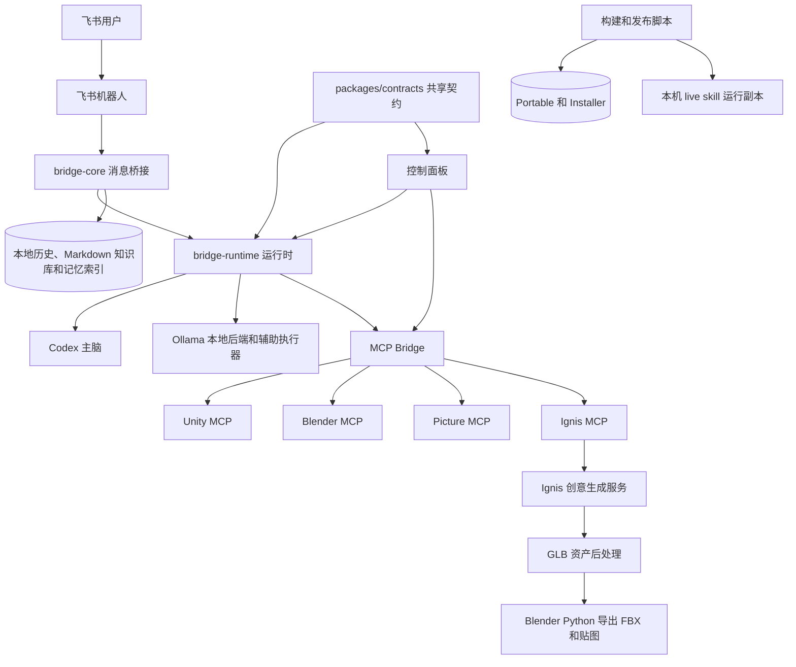
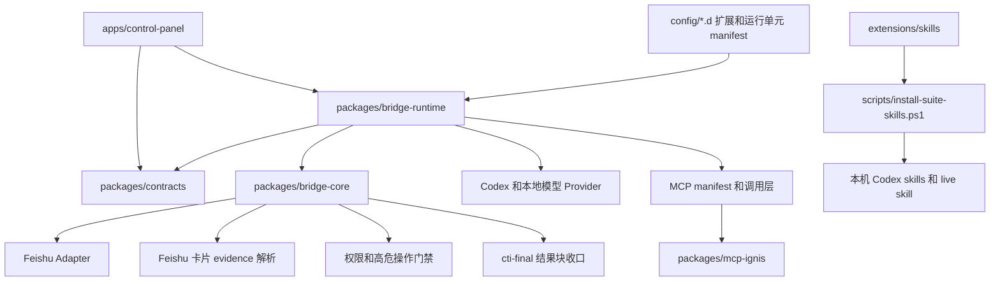
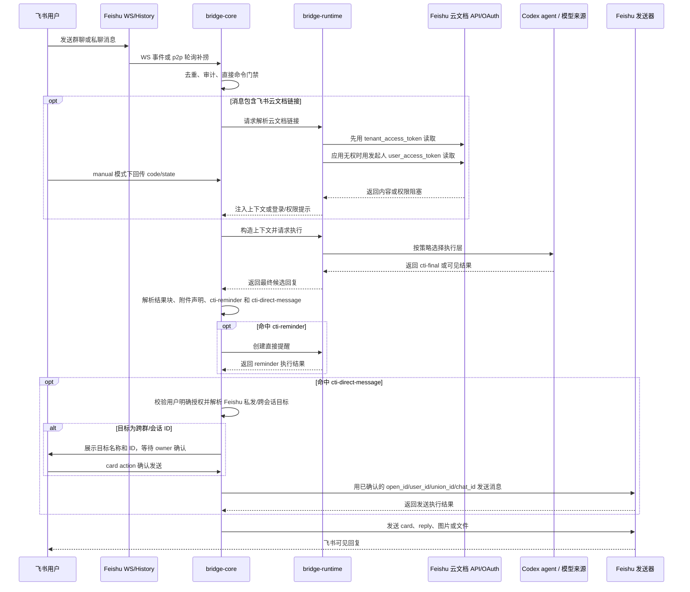
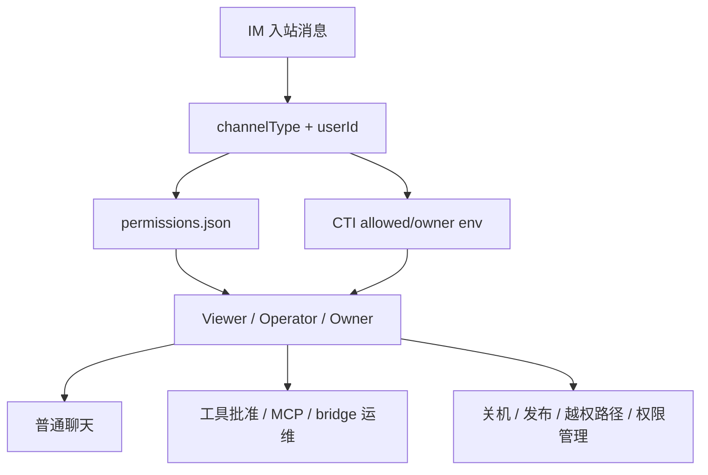
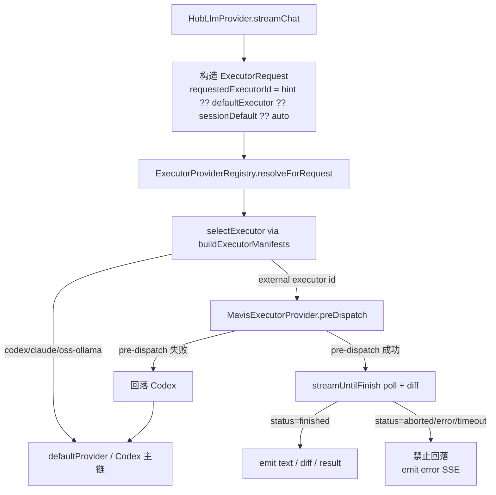
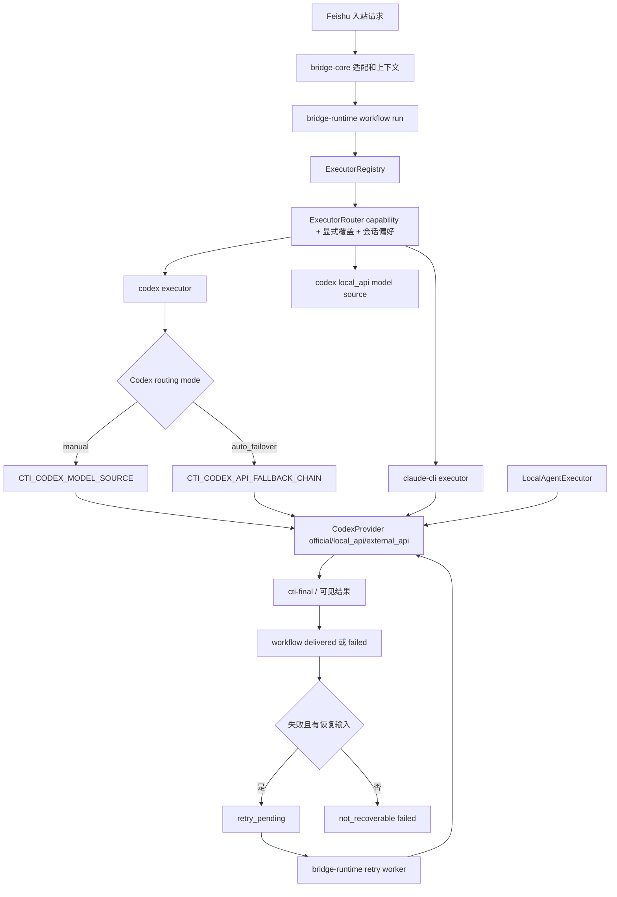
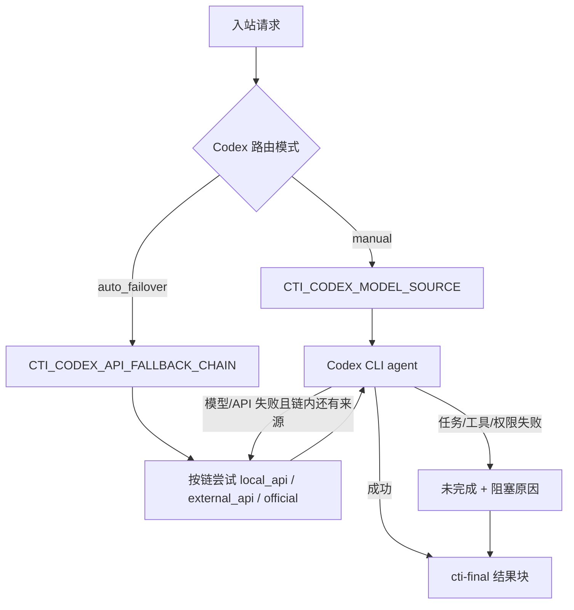
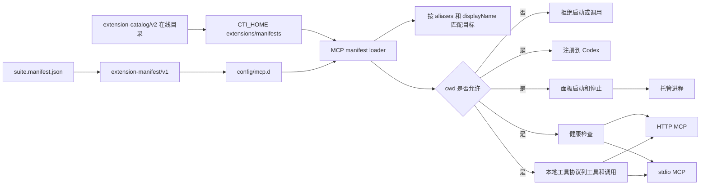
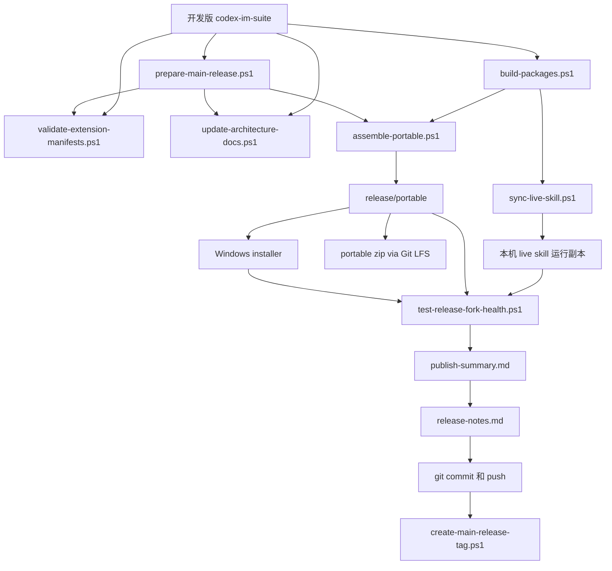

# codex-im-suite 项目架构

更新时间：2026-07-09

## 0. 架构文档维护规则

- 本文是 suite 当前架构的唯一主文档，后续不要再新增平行的架构说明文档。
- 项目内已安装 `project-architecture-diagram` skill，架构变更时优先使用该 skill 更新本文。
- 修改模块边界、运行链路、provider 路由、MCP manifest、Feishu 收发、记忆索引、打包发布链路时，必须检查本文是否需要同步。
- 检查入口：`scripts/update-architecture-docs.ps1`。
- 变更过程和阶段性风险记录到 `docs/DEVELOPMENT-LOG.md`，不要塞进本文。

## 1. 总体定位

`codex-im-suite` 是一个 Windows 优先的本地 AI 协作套件，核心目标是把飞书聊天入口、Codex 执行、MCP 工具、Unity/Blender 工作流、本地记忆和打包发布统一到一个可迁移的项目目录里。

当前不是单体应用，而是一个发行层加多个内部模块：

- `bridge-core` 负责 IM 桥接核心能力。
- `bridge-runtime` 负责把核心库、本地配置、Codex、本地模型和脚本组装成可运行服务。
- `packages/contracts` 负责 Control API、workflow、node agent 和 extension capability 的共享契约。
- `apps/control-panel` 负责可视化运维。
- `config/*.d` 负责 manifest 驱动的扩展与内建运行单元发现。
- `scripts` 负责构建、同步、打包、发布。

### 1.1 系统上下文图



### 1.2 模块边界图



## 2. 运行链路

### 2.1 Feishu 入站
- 对无附件但明显引用上文媒体的 Feishu 跟进消息，bridge-manager 会从同一 session 的本地消息历史解析 `<!--files:...-->` 附件记录，读取最近可用图片并作为当前 turn 的 provider attachment 注入，同时在 system prompt 标记为 recent conversation media；这属于通用上下文回捞层，不依赖具体题目、群名或固定话术。

Feishu 接收现在是双通道：

- WS 长连是主链路。
- p2p 私聊有历史轮询补捞兜底，避免私聊事件偶发漏掉。
- Feishu 开放平台权限、事件和回调是外部前置条件，不是 bridge 能自动开通的运行时能力。消息接收依赖已发布生效的 `im.message.receive_v1` 长连接事件；权限按钮、提醒完成按钮和卡片交互依赖已发布生效的 `card.action.trigger` 回调；Markdown/streaming card、消息更新、资源下载、成员/机器人解析和云文档读取分别依赖对应 IM、CardKit、Drive、Docx、Sheets、Base 或成员 API scope。后台新增 scope、事件、回调或机器人能力后，必须创建版本、管理员审核发布，并重启 bridge 读取新配置。
- `bridge-manager` 会在进入执行链前做持久入站去重：同一 channel/chat/messageId 只允许执行一次；带附件的媒体说明文字还会写入短期文本指纹，避免 Feishu p2p 历史补捞把同一张图的 caption 当成另一个 messageId 再跑一轮 Codex。
- 群聊 `require_mention=true` 时，adapter 先读事件自带 `message.mentions`，缺失时再从正文里的飞书 `<at ...>` / post `tag=at` 结构兜底识别 bot mention，避免长连事件缺少 mentions 数组时把真实 @bot 消息误丢弃。原生 @ 只作为候选入口，还会继续过滤纠错、抱怨、无需回复、把机器人名当成“at/喷/叫/问”对象的转述请求；没有原生 @ 时，adapter 只用 bot 真实 displayName、`bridge_feishu_bot_name`、`bridge_feishu_app_name`、`bridge_feishu_bot_aliases` 或 `CTI_FEISHU_BOT_ALIASES` 配置出的别名做保守名字唤醒，并先分类为 `chat / investigate / need_info / done`：明确请求、直接称呼或模糊艾特请求才进入队列并写入 `raw.feishuBotWake`；第三人称提到机器人名、复述机器人发言、纠错反馈或“问过机器人了吗”这类不需要机器人回应的消息只写 `[FILTERED] bot/name mention not actionable` 审计，不触发 LLM。用户使用飞书“回复/引用”接本机器人已发送消息时，`parent_id/upper_message_id/root_id` 会先命中本地 `outbound-refs`，必要时再拉被回复消息检查 sender 是否为当前 bot；命中后即使没有新的 @ 也视为明确唤醒，可让文本、图片、表情包等消息进入后续 agent/sticker 链路。普通回复其他人的无 @ 群消息仍被过滤。
- adapter 会在 WS 和历史补捞入口统一忽略 `system`、未原生 @ 当前 bot 的 `interactive` 卡片、当前 bot 自己发出的消息、邀请/加群通知等没有明确可处理文本的事件；p2p 历史补捞还会按已解析的 bot 身份 ID 过滤 `sender_type` 缺失但 sender id 属于机器人的消息。这类事件只进入审计或受控历史索引，不触发 LLM，避免机器人自己的卡片更新、出站消息或入群系统事件再次自触发。其他 `sender_type=app/bot` 的实时群消息不再一刀切忽略：只有原生 @ 当前 bot、通过既有 actionable mention 分类，并且没有超过 `bridge_feishu_bot_to_bot_max_turns` / `CTI_FEISHU_BOT_TO_BOT_MAX_TURNS` 连续跳数预算时才会进入队列；默认 5 分钟窗口内最多 2 跳，人类消息会重置预算。来自他方 app/bot 的 `interactive` 卡片会递归提取 CardKit 中 markdown、plain_text、标题、summary 等用户可见字段，并用 `<at id/user_id/open_id/union_id=...>` 或 `tag=at` 结构识别当前 bot；未 @、p2p bot 卡片或当前 bot 自己的卡片仍会被过滤。
- Feishu `interactive` 卡片统一先生成受控卡片 evidence，再进入入站、reply/light context 和历史索引链路。解析器会递归读取普通 JSON、`body.content`、转义 JSON、标题、markdown/plain_text/lark_md、按钮、summary、alt、`image_key/imageKey/img_key/imgKey/file_key/fileKey`、文件名和 `card_id/template_id` 引用，并剔除“请升级至最新版本客户端，以查看内容”这类客户端兼容占位。可取到的图片/文件作为本轮 provider attachment，`raw.feishuInteractiveCard` 记录可见文本、资源引用、raw preview、占位清理、下载数量和 `resourceDownloadFailures`。他方应用/机器人卡片里的预览资源可能被飞书开放平台判定为非当前应用资源或已删除资源，当前应用无法凭 key 强行读取图片；这种情况下错误 code/msg 只保留在审计和 raw evidence，不再作为用户可见快答正文，agent 只基于可见卡片文本、上下文和明确边界整理回复。
- Feishu sticker 入站会通过 `MemoryArtifactStore` 按 `file_key` 写入记忆仓库 `data/im/feishu/stickers/stickers.json`；`data/im/feishu/stickers/media` 保存已迁移、人工补充或资源接口成功返回的表情包图片。飞书官方 sticker 事件只提供可复用 `file_key`，因此 adapter 先复用记忆仓库已有 media；缺失时只对同一 `file_key` 做一次消息资源图片获取尝试，成功则缓存并作为本轮 provider attachment 注入，失败则记录 `mediaDownloadFailedAt`，后续不反复重试，也不会凭 `file_key` 猜语义。在群聊中，回复本机器人已发送消息的 sticker 会先通过 reply 唤醒门禁再进入这条 sticker 链，避免只因没有新 @ 就丢失表情包。存在图片附件时，`bridge-manager` 会要求视觉模型在自然回复后附带 `cti-sticker-annotation` JSON 块；该块只在 `fileKey` 匹配当前入站表情时被 adapter 记录到 sticker 语义库的 label/description/intent/tone/usage/aliases/confidence 字段，发送前会从可见回复剥离。没有可靠语义标注时，裸 `[表情包]` 不会随机选最近或默认 sticker；只有语义库明确可匹配当前上下文时才允许语义选择。
- Feishu 历史索引同步现在也会 harvest `msg_type=sticker`：历史列表里的每个 sticker 会写入同一份表情包库，并在有消息资源权限时下载到 `stickers/media`。历史索引、light context 和总结链路中的 sticker 不再只显示 `[sticker]`，而是写成包含 `file_key`、已知语义或“语义待图片/人工核验”的受控边界，防止 agent 凭资源键猜图。用户明确要求“发/回/来个表情包”时，adapter 会先同步当前聊天历史，再把当前 chat 优先、全局最近兜底的可用候选表情包图片作为 `feishuStickerLibraryContext` 和 provider attachments 注入 agent；prompt 要求 agent 根据图片事实、可信视觉/人工标注和当前语境判断是否合适，合适才输出 `[表情包:file_key]`，不合适则只回文字或合适 reaction。
- Feishu 短指代追问（例如“这个 / 他这是 / 怎么回事 / 回复一下”）会优先使用原生 `parent_id/root_id/upper_message_id` 拉取被回复消息；原生 reply 元数据缺失时，adapter 会生成受控 light conversation evidence：当前用户短句、当前消息 native mentions、同群近邻消息和 best-effort `[可能关联上文]`。普通上下文仍避免把机器人出站消息当作用户请求；但短指代追问会把 nearby `sender_type=app/bot` 的卡片或机器人消息作为候选证据交给 agent 判断，防止用户追问上一条机器人回复时只看到孤立短句。
- Feishu @ 投递、事件订阅、回调、入站、通知送达等诊断文本，以及引用他人消息、玩法规则或流程说明里的 `@名字`，不会进入出站原生 mention 执行链。bridge-core 会先把这类文本视为受控 evidence prompt 交给 agent，由 agent 解释投递/配置/上下文问题；只有当前用户明确命令机器人“请艾特 / 通知 / 叫某个具体目标参与”时，才会补 `@目标` 并交给 resolver 做唯一候选校验。
- Feishu 出站 mention 只接受明确显示名、原生 mention evidence 或结构化 mention。类似“你自己的主人 / 开发者 / 维护者 / 某个成员 / 相关机器人”的关系描述或泛称不再被当成飞书显示名，不会补 `@目标`、不会触发 resolver/inspector 机械 blocker；模型若生成 `@关系描述`，bridge-core 会在发送前移除裸 `@`，保留自然语言语义。
- Feishu 身份/关系问题会额外注入 assistant maintainer evidence：adapter 已知的 bot/app 身份、当前发送者 bridge role、权限库和 `CTI_*_OWNER_USERS` 合并出的 owner/maintainer 线索。权限 JSON 同时兼容控制面板写出的 PascalCase 字段和 bridge 旧 camelCase 字段，并按最高角色合并，避免旧 viewer 记录覆盖 env/store owner。agent 可以据此回答“当前可确认的 bridge 维护者/Owner”，但不得把它伪称为飞书开放平台开发者/管理员；只有 admin API 明确返回的平台证据才能这么说。

收到消息后进入 `bridge-core` 的消息处理主线：

1. 记录运行审计。
2. 去重。
3. 先在 `bridge-manager` 处理无需模型自由发挥的受控系统入口，例如权限数字快捷回复、`/feishu` 开放平台能力诊断、在线扩展搜索/安装确认、owner 二次确认、即时关机确认和低风险高置信提醒创建等真实系统动作；提醒入口只负责执行结构化 action 并返回可读执行摘要，不再作为内容快答模板。“新建任务 / 创建待办 / 设置提醒 + 时间 + 叫/喊/通知某人做事”属于任务提醒语境，优先走提醒链或交给 agent 明确周期能力边界，不会被 Feishu 原生 mention 解析截走；包含未来时间的关机、关闭屏幕、运行命令、发送文件等执行型定时请求不进入低风险提醒入口，必须继续走权限和 agent/action 链。纯问候、感谢、确认、短接话、飞书文档列表和记忆命中不作为内容快答出口。
4. 绑定 chat/session。
5. Feishu 入站会把 sender display name、open_id/user_id/union_id、chat type、sender bridge role、wake alias、原生 mention/reply 与第三人称/引用语义整理成 actor context 注入 agent system prompt；同时注入 assistant maintainer evidence，用于回答“谁配置/维护/拥有这个机器人”这类身份问题。这些只作为防误触和身份判断证据，不直接生成回复，避免群聊里别人讨论机器人、模仿机器人、转述指令或使用关系词时被误当成当前用户命令。
6. 记录轻量记忆事件，按 user/chat/global profile 滚动汇总事实、偏好、主题和待跟进项。
7. 如果消息里包含飞书 Docx、Sheets 或 Base 链接，bridge-core 调用 bridge-runtime 的云文档 host；runtime 先用应用 `tenant_access_token` 读取，应用无权时再按发起人 OAuth 用户 token 读取，并把真实内容作为本轮 system context 注入。缺用户 token 时发送登录授权卡片；`CTI_FEISHU_OAUTH_MODE=manual` 时不需要公网回调，用户把飞书授权后的 `code/state` 回调 URL 复制回飞书完成绑定。登录后仍无权限时返回明确阻塞。应用管理员权限只用于管理员身份诊断，不能替代云文档 scope 或文档本身授权。
8. Feishu Owner 可用 `/feishu` 查看开放平台能力诊断：本地配置、应用 token 直读能力、OAuth fallback 请求 scope、`CTI_FEISHU_GRANTED_SCOPES` 声明的已开通权限，以及各能力缺口。这个清单只记录后台已开通并发布的预期权限，不会自动向飞书申请或生效权限；发现缺口时按“权限开通 -> 发布审批 -> 事件/回调配置 -> 重启 bridge -> 再诊断”的顺序处理。
9. 构造上下文，只按检索命中的片段注入记忆和 Feishu 历史，不全量塞历史。普通“看一下今天群聊天记录在说什么 / 在聊什么 / 说什么”会先命中 Feishu 历史意图，bridge-core 只使用 adapter/store 的历史索引和 `retrieveRelevantFeishuHistory()` 生成受控历史上下文 / evidence prompt，由 agent 总结；不把 `feishu-history/*.json` 路径交给 Codex 自行用 Bash 或 MCP 读取。
10. 对带有明确可读对象的请求，`ExecutionRequirement` 会在不依赖关键词硬触发的前提下启用低风险主动探查：例如当前工作区、明确路径、文件名、MCP manifest、`config/mcp.d` 等对象会进入 `local_read_required`，让 provider 先做受控读取/列目录/检查；没有明确对象的时效或泛问仍保持普通回答或追问。
11. 调用运行时 provider。
12. 对带图片附件的 Feishu 表情包结果，先解析并剥离 `cti-sticker-annotation` 语义标注块，交由 FeishuAdapter 持久化；非表情包回复不经过该协议，避免影响 `cti-final` 等通用结果块。
13. 解析最终结果块、`cti-reminder` 和 `cti-direct-message` 动作块。
14. 如果 Codex 明确请求创建提醒，bridge-core 只把结构化动作交给 bridge-runtime 的 reminder host 执行，用户看到的是面向人的执行摘要，包括提醒内容、时间、目标会话和到点通知对象；`reminderId`、`chatId`、状态文件路径和内部协议字段只保留在运行态状态或审计里，不外发。
15. 如果 Codex 明确请求向某个 Feishu 成员、当前发送者或另一个群/会话发送消息，bridge-core 只接受 `cti-direct-message` 结构化动作，并要求用户原文存在明确私发/私信/发给某人/发到会话的授权；FeishuAdapter 会复用入站 mention、历史 `<at>` 映射、群成员列表、sender 上下文和本地 channel binding 解析目标。普通一对一私发只有唯一命中真实用户 ID 时才用 `im.message.create` 的 `open_id/user_id/union_id` 收件人发送；对“给我 / 私发给我 / 发起人 / 发送者”这类目标，群聊中即使成员列表不可用，也可以用本轮 sender open_id/user_id 作为收件人兜底，且不能把群名当成发送者姓名。若动作包含 `targetId/chatId/sessionId` 或 `targetType=chat/user`，则视为跨会话/id 发送，必须是 owner 发起，adapter 先返回目标名称、类型和平台 ID，bridge-core 在源会话发确认卡，只有同一 owner 在有效期内确认后才用已确认目标发送。源群只回确认/成功/失败状态，不复述待发送正文；其他目标不唯一、缺少目标、确认过期或模型只口头声称已发送时都返回阻塞，不用 Bash、临时脚本或手写平台 API 代发。
16. 通过 Feishu 原生 reply/card/image 等方式回复。Feishu 出站 mention 统一走结构化 `mentions`，来源包括模型返回的 `cti-final.mentions`，以及 `BaseChannelAdapter.resolveOutboundMentions()` 钩子在最终发送前做的通用解析：FeishuAdapter 会把最终正文中的裸 `@显示名` 按本轮入站原生 mention、本地 Feishu 历史索引里已验证的 `<at user_id=...>显示名</at>`、旧群成员列表、新版 `members/list` 的 `users[]/bots[]` 候选和 sender 上下文解析成真实 open_id/user_id；只有唯一命中时才补入 `OutboundMention`，同名多候选或未命中不会伪造原生艾特。若用户文本明确要求“艾特 / mention / 通知 / 叫 / 喊”某个具体目标，或用“让/叫/喊/请/找/通知 X 说话/发言/回复/回应/出来/吱一声/看一下/处理一下”请求目标参与，而模型最终回复没有结构化 `mentions` 或可见 `@显示名`，bridge-core 会先抽取目标并把回复补成 `@目标` 前缀，再交给同一 resolver 解析；但当同一用户文本同时命中任务/待办/提醒创建意图和时间或周期表达时，“叫/喊/通知 X 做事”会被视为提醒标题内容，不触发补 @、裸 @ 解析或假 @ 拦截。若模型误把飞书历史里的 `@_user_N` 临时占位、结构化假 ID 或字符串型 `cti-final.mentions` 当成可发送 mention，bridge-core 会丢弃非结构化/占位 mentions，并在单个占位符场景用用户明确目标替换后再解析，解析失败提示也使用用户目标名，最终发送前还会兜底移除任何未解析的 `@_user_N` 文本，不把 `_user_N` 当真实成员 ID 外发。目标抽取会把“让/叫/喊/通知 + 代词/对方/成员”“跟/和 + 人称”“去/来/帮 + 动作”等后续从句当作边界，并把“这个机器人 / 智能体 / bot / agent / 应用”等尾部类型词当作说明剥离，避免无标点口语里把整句误当显示名，且不绑定具体姓名。用户问“怎么 at / 为什么不能 at / at 后没反应 / 对方不回复”这类解释或诊断问题时，只把 `@名字` 当示例文本或问题对象，不触发裸 `@显示名` 原生解析、补 @ 或假 @ 拦截；解析成功就发送原生 mention，解析失败则提示用户直接点选 TA 或提供准确显示名，不发送普通文本假 @。平台原生 mention 需要可发送的 Feishu mention ID 或 `@所有人`；明显的 `cli_` / app / bot 标识不会进入候选，`members/list` 里的机器人也只有返回 `open_id/user_id/union_id` 或明确类型 `member_id` 时才会进入候选，不会把 `app_id/bot_id` 伪造成原生 @；机器人或智能体只要历史、结构化结果或群机器人列表里存在有效 `ou_` 等 mention ID，也可以被解析为原生 mention。Markdown card 会渲染为 `<at id="..."></at>`，post/text 会渲染为飞书原生 `at` 节点或 `<at user_id="...">`，`replyToMessageId` 只表示引用回复，不再自动推断为艾特发起人；目标含糊的“另一个人 / 别人 / 其他成员”请求会先要求用户给出明确对象，且没有结构化 mention 时任何裸 `@名字` 都会被拦截为澄清回复。Feishu streaming card 只展示“核对可用信息 / 整理成可读回复 / 需要确认 / 遇到阻塞”这类高层状态；工具名、路径、命令、agent 阶段名和原始工具事件只进入审计或最终阻塞摘要，不直接作为进度直播内容。



- `关机 / shutdown` 这类系统级动作不再交给模型自由发挥，而是在 `bridge-manager` 里走固定链路：
  - 仅 `Owner` 角色可发起，适用于所有 IM 渠道。
  - 第一步只记录审计并返回确认提示。
  - 第二步要求用户明确回复 `确认关机`。
  - 确认后桥接先发送执行提示，再直接调用 Windows `shutdown /s /t 0`。
  - 这条链路不经过 Codex、本地模型来源或历史本地执行器。

### 2.2 权限门禁

截至 2026-05-11，Feishu 入站不再使用 `bridge_feishu_allowed_users` 作为会话入口白名单。

- Feishu 任何用户都可以向机器人发起普通会话；群聊仍继续受 `group policy` 和 `require_mention` 约束。
- `CTI_FEISHU_ALLOWED_USERS` / `bridge_feishu_allowed_users` 只保留为兼容字段：启动和权限同步时会把其中的用户导入为 `Viewer`。
- 高权限动作统一走 `permissions.json` 的 `Viewer / Operator / Owner` 角色门禁，而不是在 adapter 入站阶段直接拒收消息。
- Owner 高危动作门禁只拦明确要求 bridge 执行的危险动作或命令；危险词出现在飞书卡片资源错误、adapter 诊断边界、日志、历史 evidence、故事/游戏规则或引用文本里时，不得在 `bridge-manager` 早退成权限拒绝，必须继续作为上下文交给 agent 判断。


截至 2026-04-27，桥接权限从 Feishu 单 owner 列表升级为三档角色模型：

- `Viewer`：允许普通聊天入口，对应各渠道 allowed users。
- `Operator`：允许中风险运维，例如批准普通工具权限、重启 bridge、启停 MCP 或本地模型。
- `Owner`：允许高危动作，例如关机、发布、越权路径、权限管理和系统级命令。

权限主数据存储在：

- `C:\Users\admin\.claude-to-im\data\permissions.json`

临时工具授权按钮和数字快捷回复使用独立运行时文件：

- `C:\Users\admin\.claude-to-im\data\permission-links.json`

兼容规则：

- JSON 权限库是主数据。
- `permissions.json` 只保存三档角色权限；`permission-links.json` 只保存待处理授权链接，两个协议不能共用同一文件。
- 启动和面板刷新时会从 `CTI_*_ALLOWED_USERS` 导入 `Viewer`，从 `CTI_*_OWNER_USERS` 导入 `Owner`。
- 保存权限后同步写回兼容 env，避免旧配置和脚本失效。
- 没有权限 JSON 且 Feishu 只有一个 allowed user 时，仍保留旧逻辑临时视为 owner。



### 2.3 Provider 选择

截至 2026-04-25，运行时新增第一阶段 workflow / executor 内核。旧 provider 仍负责真实流式执行，但请求进入 provider 前会被标准化为可观察的 workflow run，并通过 executor registry 记录路由选择。当前阶段目标是先打通“入站请求 -> 执行器选择 -> 执行中 -> 成功/失败”的稳定观测闭环，后续再把真实执行实现逐步迁移到 executor adapter。

Workflow 状态：

- `received`
- `authorized`
- `contextualized`
- `routed`
- `executing`
- `finalizing`
- `delivered`
- `failed`

Workflow run 运行状态：

- `running`：当前 runtime 仍在执行。
- `succeeded`：已完成并交付。
- `failed`：执行失败，可能可恢复，也可能不可恢复。
- `retry_pending`：已排队等待自动或手动断点重试。
- `retrying`：后台 retry worker 已领取并正在重跑。

断点续跑第一版：

- provider 创建 run 后会向 `workflow-runs.json` 写入最小恢复输入，包括 prompt、工作目录、模型、system prompt、权限模式、channelType、chatId、发起人 userId、显示名和 messageId。
- 当流式执行进入 `status` / `result` 阶段后，runtime 会把模型来源、模型名、provider、codex profile、prompt profile 和 token 用量汇总为 run 顶层的 `execution` / `tokenUsage` 摘要；bridge-core 同步把同一份摘要作为 `RunSummary` 传给 Feishu streaming final card，在卡片底部显示当前模型、输入 / 输出 token，以及 provider 上报的 cache 读写 token；旧 run 或旧 provider 没有这些字段时保持缺省，由控制面板或卡片显示为未知/不展示。
- `workflow-runs.json` 的写入仍优先走临时文件再替换；但在 Windows 上如果替换阶段遇到 `EPERM/EACCES` 文件占用，runtime 会回退为直接写目标文件，减少 retry worker 与控制面板并发读取时的写失败。
- `workflow-runs.json` 的物理路径不再在模块加载时写死；runtime 每次读写都会按当前 `CTI_HOME` 解析目标路径，便于单测切换到临时目录，避免测试 run 污染 live 运行记录。
- bridge-runtime 启动时会检查上一次遗留的 `running` run；有恢复输入且未耗尽次数的标为 `recoverable + retry_pending`，缺少 prompt 等关键信息的标为 `not_recoverable + failed`。
- provider 执行失败时会对可恢复 run 排队一次 `auto_pending` 自动重试；控制面板可通过 `workflow.retryRun` 把失败 run 改为 `manual_pending`。
- 自动重试只保留给值得再试的失败；`usage limit`、认证失效、`405 Method Not Allowed`、本地 `responses` 端点不兼容等确定性配置错误不会再自动排 `auto_pending`，避免单条消息在坏配置下重复消耗执行资源。
- `auto_pending` 自动重试只会在 `CTI_WORKFLOW_AUTO_RETRY_MAX_AGE_MS` 新鲜度窗口内被 retry worker 领取，默认 6 小时；超过窗口后必须显式走手动重试，避免 bridge 长时间离线后继续旧任务。
- retry worker 在 bridge 启动后常驻轮询，优先领取手动 retry，再领取自动 retry；重跑前会执行同一套飞书云文档预读取，成功时注入真实内容，缺授权时发送登录/权限阻断而不让 Codex 公网抓取私有链接；重跑成功后写回会话历史，并在保留 channelType/chatId 时主动回发结果。
- 如果 retry 输出包含 `cti-final` 结果块，主动回发会复用 bridge-core 的最终回复解析层：清理协议文本，保留 replyTo 关系，并按结果块发送 Markdown、图片或文件；只有普通文本结果才加“断点续跑重试结果”说明。
- bridge 停止、重启或用户 `/stop` 前，bridge-core 会先 abort 活动任务，并在 Feishu adapter 仍可用时把已经开始的 streaming card 收尾为 `已中断`，提示后续可能断点续跑；retry worker 后续回发的是新的主动交付，不伪装成还能更新旧进程内卡片。
- 当前 retry 是“重新执行最小输入”，不是恢复原 Codex 进程；如果重跑过程中出现新的权限请求，后台 retry 会失败并把错误写回 run。
- `packages/bridge-runtime/src/workflow-contract.ts` 会把现有 `workflow-runs.json` 映射为 `packages/contracts` 中的 `WorkflowRunContract`，统一输出 input、provider、retry、delivery、finalizer checkpoint 和 trace event。当前仍不改变执行行为，只为后续 durable execution、run replay 和多节点日志聚合提供稳定契约。
- channel binding 默认允许延续既有 Codex thread，但如果同一 chat 的 `updatedAt` 超过 `CTI_SESSION_IDLE_FRESH_MS`（默认 12 小时），`channel-router` 会先重绑到 fresh session 并清空 `sdkSessionId`，避免旧会话上下文在长时间断线后继续注入。

运行时状态文件：

- `C:\Users\admin\.claude-to-im\runtime\workflow-runs.json`
- `C:\Users\admin\.claude-to-im\runtime\executor-status.json`
- `C:\Users\admin\.claude-to-im\runtime\executor-session-defaults.json`

Executor 目录当前内置四类：

- `codex`：默认主脑 CLI / SDK 执行器，能力包含对话、代码、仓库查询、文件读写、图片输入和 artifact delivery。它可以按配置使用官方 Codex、本地 API、外部 API，或按自动切换链尝试多个模型来源。
- `claude-cli`：可切换 CLI 后端，能力包含对话、代码、仓库查询、文件读写和图片输入。
- 本地模型不再注册为独立 `local-tool-agent` 执行器；它只作为 `codex` 执行器的 `local_api` 模型来源参与。
- `codex-oss-ollama`：实验性只读执行器，仅在本地 AI 类型为 Ollama 时可用，声明 `codex exec --oss --local-provider ollama`。
- `mavis-agent`（截至本次记录新增 — v3.4 设计稿落地）：首个 **external agent executor**。Mavis / MiniMax Code 通过本地 `mavis` CLI 派发任务、轮询结果；opt-in，默认不启用，启用需在 `config.env` 设 `CTI_MAVIS_ENABLED=true` 且 `CTI_MAVIS_CLI_PATH=<path>`。真实路由来源是 `executor-registry.ts:buildExecutorManifests(config)`，依据 `Config.mavisEnabled` 和 `Config.mavisCliPath` 决定 manifest 是否注册；`config/runtime.d/executor.mavis-agent.json` 只供控制面板展示，不参与 `selectExecutor` 路由。

外部 Agent Executor 边界（v3.4）：

- 真分派点：`ExecutorProviderRegistry.resolveForRequest(config, ExecutorRequest, defaultProvider)`。registry 在 `selectExecutor` 之后立刻分派，命中 external executor 时**完全忽略** `defaultProvider`（Codex 主链），与 v1 "构造期替换 fallbackProvider" 无关。
- `ExecutorRequest` **只**含 `requestedExecutorId` / `preferredExecutorId` / `taskKind` 三个可选字段 + 必需 `sessionId/prompt/workingDirectory/permissionMode/params`。registry **不**接 `sessionDefaultId` 第 4 参；caller（`HubLlmProvider.streamChat`）通过 `resolveRequestedExecutorId(config, prompt, sessionDefaultId)` 把显式 hint、全局默认 executor 和历史 session default 折进 `requestedExecutorId`，优先级为 `@hint > CTI_DEFAULT_EXECUTOR_ID > sessionDefault > auto`。
- 两阶段错误处理（v3.2 阻断点 ②）：pre-dispatch（probe + `session new` / `communication send`）失败 → 允许回落 Codex；post-dispatch（poll + messages + diff + 终态解析）失败 → 禁止回落；判据 = `binding.mvsSessionId` 非空 + `lastDispatchAt` 已写入。
- `mavis-session-bindings.json`（`${CTI_HOME}/runtime/`）保存 `bridgeSessionId → mvsSessionId` 续聊映射；24 小时滑动窗口；写盘走 `tmp + rename`；**绝不**记录 secret、token、原始 diff 全文。
- env 主命名 `CTI_MAVIS_*`（11 条），兼容 alias `MAVIS_*`（11 条，仅在 `loadConfig` 兜底解析）；`saveConfig` 只写主命名，不写 alias。

外部 Agent Executor v3.5 修复（codex 7 轮 review 残留 P1/P2）：

- **P1 #1 真只读门禁**：`mavis-executor-provider.ts:preDispatch` 的 `mavisReadOnly` 检查从「仅 `permissionMode === 'acceptEdits'`」升级为「**capability + permissionMode 双闸**」。`inferCapabilities(params)` 推断出 `file_write` / `mcp_ops` 即抛 `MavisSafetyError('read_only_violation')`；`acceptEdits` 仍保留为 belt-and-braces 显式模式闸。`executor-registry.ts:buildExecutorManifests` 的 `mavisReadOnly` manifest capability 收敛（无 `file_write` / `mcp_ops`）继续作为上游选路闸；`preDispatch` 的 capability 闸是**显式 `@mavis` hint 绕过 manifest 选路后的最后防线**。
- **P1 #2 sessionId 形态校验**：`mavis-executor-provider.ts:isValidMvsSessionId` 校验 `mavis-cli-client.ts:createSession` 返回的 `sessionId` 必须非空、首字符为字母数字、长度 5-256、整体匹配 `^mvs_[a-zA-Z0-9][a-zA-Z0-9_\-]*$`。`preDispatchNew` 在写 binding 前调用；不合法 → 抛 `MavisSafetyError('dispatch_failed', …)`，**不写 binding**，`provider.binding` 保持 `undefined`，caller 仍可回落 Codex（v3.2 阻断点 ② 的 pre-dispatch 可回落不变）。
- **P2 #3 `mavisDefaultExecutor` 真生效**：`executor-registry.ts:applyMavisDefaultExecutor(config, sessionId, sessionDefaults)` 是兼容旧开关的纯函数消费方。条件：`config.mavisDefaultExecutor === true` AND `config.mavisEnabled === true` AND `!!config.mavisCliPath` AND 当前 session 无 sticky default → 懒写 `${CTI_HOME}/runtime/executor-session-defaults.json[sessionId] = 'mavis-agent'`，返回 `{ sessionDefaultId: 'mavis-agent', wrote: true }`。后续请求统一交给 `resolveRequestedExecutorId` 判定；显式 `@codex` / `@claude` / `@minimax` 仍能覆盖，`CTI_DEFAULT_EXECUTOR_ID` 会优先于这个历史 sticky default。失败 best-effort（写盘抛错 → `wrote: false` 但 `sessionDefaultId` 仍返回 `'mavis-agent'`，当轮请求不丢）。

外部 Agent Executor v3.6 修复（codex 8 轮 review 新增 P1）：

- **P1 #1 外部 executor 接入 workflow 观测链**：`main.ts:streamExternalDispatch` 在 `ReadableStream.start` 内补上与本地 Codex 链一致的观测生命周期：先 `startObservedWorkflow(params, 'external_agent')`（内部仍按 v3.5 selection 写 `setWorkflowExecutor('mavis-agent', reason)` + `writeExecutorStatus` + `appendWorkflowEvent('executing')`），再创建 `evidence = emptyStreamEvidence()` + `seedExecutionRequirementEvidence(evidence, params)`，所有下游写入都通过 `observedController = createObservedController(controller, evidence)` 完成；post-dispatch 阶段把 `controller.enqueue` 全部换成 `observedController.enqueue`，确保 `tool_use/tool_result/progress/result` SSE 事件被 `collectStreamEvidence` 捕获。fallback 路径在 `streamLocalFallback(observedController, ...)` 之前先 `setWorkflowExecutor(workflowRun.id, this.primaryExecutorId, '外部 executor pre-dispatch 失败，回落 Codex: …')` 再 `appendWorkflowEvent('executing', 'executor.fallback', …)`，面板上能看到「选 mavis-agent → 实际跑 Codex（pre-dispatch 失败回落）」的诚实链路；外层 `finally` 跑 `flushWorkflowEvidence` + `completeWorkflowRun`（fallback 成功时）或 `failWorkflowRun` + `requestWorkflowRetry`（fallback 也抛错时，与 v3.3 auto-retry 规则一致）。判据 = 外部 executor 实际执行时面板能看到 workflow run、executor selection、retry/audit trails 与 `bridge-runtime-audit.json` evidence 与本地链一致。
- **P1 #2 `mavisReadOnly` 改严格 capability allow-list + 扩 file_write 启发式**：v3.5 的黑名单（`required.includes('file_write') || required.includes('mcp_ops')`）有两个漏洞——一是「未来加新 capability 忘了列」会默默绕过只读；二是 `inferCapabilities` 的 file_write 模式只匹配 `修改|写入|保存|生成文件|edit|patch`，让 `delete package.json` / `create file` / `remove lockfile` / `touch script` / `rm -rf` / `mv old new` / `重命名` / `替换` 等写意图滑过 readOnly 闸。v3.6 在 `executor-registry.ts` 新增导出 `MAVIS_READ_ONLY_ALLOWED_CAPABILITIES: ReadonlySet<ExecutorCapability> = {chat, repo_query, file_read, image_input}` 和 `listMavisReadOnlyForbiddenCapabilities(required)`；`mavis-executor-provider.ts:preDispatch` 把黑名单换成「`forbidden = required.filter(c => !ALLOWED.has(c))`，非空即抛 `read_only_violation`」。同时 `inferCapabilities` 的 file_write 模式扩到 `修改|写入|保存|生成文件|edit|patch|删除|新建|创建|create|delete|remove|drop|erase|trash|unlink|rename|重命名|move|移动|write to|save to|append|追加|insert|插入|put file|replace|替换|update|modify|touch`；短命令 `rm` / `mv` 走第二条带 word boundary 的 regex（`(?<![a-z])(?:rm|mv)\s`）避免误伤 `arm` / `firm`。**仍未解决**：prompt 启发式本质是黑名单/白名单混合，绕路仍有可能；真正严谨的修法是在 `mavis-cli-client.createSession` 加 `readOnly` 字段并让 mavis daemon 端真正启用 sandbox——列为后续 P1 单独修复，本轮先锁住词表和 allow-list 不变量。
- **判据 / 不变量**：
  - 任何 capability 不在 `MAVIS_READ_ONLY_ALLOWED_CAPABILITIES` 的推理结果都必须让 `preDispatch` 抛 `read_only_violation`，**不允许**让 mavis CLI 默默接收写意图；测试在 `mavis-executor-provider.test.ts` 与 `executor-registry.test.ts` 各加一条 drift guard（manifest capabilities ⊆ allow-list）防止后续改 manifest 时忘了同步 allow-list。
  - 外部 executor 执行的 turn 必须经过 `startObservedWorkflow → writeExecutorStatus → flushWorkflowEvidence → complete/failWorkflowRun` 完整链路；`streamExternalDispatch` 不允许再绕过 `startObservedWorkflow`。`streamLocalFallback(observedController, ...)` 的 fallback 路径也允许触发 auto-retry，但失败回收只走 outer `failWorkflowRun + requestWorkflowRetry`，不让 `streamExternalDispatch` 内部产生「未观测的 workflow run」。
  - 语义点（已确认）：`applyMavisDefaultExecutor` 是旧 `mavisDefaultExecutor` 开关的兼容层；新默认入口是 `CTI_DEFAULT_EXECUTOR_ID`，由面板写入全局 executor 默认值。`@codex` / `@mavis` 等 hint 只覆盖当轮路由，不反向改写全局默认；需要长期切换时走控制面板“设为默认 / 恢复自动”。

外部 Agent Executor v3.7 修复（codex 9 轮 review 新增 P1）：

- **P1 #1 streamUntilFinish 结构化 terminal 状态 + workflow 失败态阻断**：`mavis-executor-provider.ts:streamUntilFinish` 的 timeout / aborted / error / partial_result 分支之前只 `enqueue(sse('error', ...))` 后 `return void`，外层 `main.ts:streamExternalDispatch` 完全感知不到远端失败——外层 `finally` 永远看到 `workflowFailed = false`，跑 `completeWorkflowRun` 写 `status: succeeded`，控制面板 / workflow / 审计会显示成功，但用户实际看到的是错误 SSE。这是 live 前阻断点（v3.6 workflow 外壳补了但终端语义没穿透）。修法选 A：
  - 新增导出 `MavisStreamResult` 接口和 `MavisTerminalState` union（`finished` / `timeout` / `error` / `aborted` / `partial_result`）。
  - `streamUntilFinish` 签名改为 `Promise<MavisStreamResult>`，每个 exit path（timeout / error / aborted / messages 拉取失败 / finished-but-no-text / happy path）都返回对应的 `{ terminal, errorCode?, errorShort? }`。
  - `main.ts:streamExternalDispatch` 的 post-dispatch try 块捕获 `result.terminal`；若不是 `'finished'`，置 `workflowFailed = true` + 构造 `workflowFailureError = new Error('mavis executor 终态失败：${terminal}')`；外层 `finally` 看到 `workflowFailed` 走 `failWorkflowRun(workflowRun.id, workflowFailureError)`，**retryability 决策见 v3.8 段**——v3.8 把 `shouldAutoRetryWorkflowError(workflowFailureError)` 换成了显式 per-terminal map `isMavisTerminalAutoRetryable(terminal)`，**不**调 `completeWorkflowRun`。本句 v3.8 落地前的旧表述是 `failWorkflowRun + shouldAutoRetryWorkflowError 决定 requestWorkflowRetry`，已被 v3.8 覆盖。
  - happy path（finished + text）返回 `{ terminal: 'finished' }`，workflow 仍然 `completeWorkflowRun`。
  - judge / 不变量：terminal ∈ {timeout, error, aborted, partial_result} 的 turn 必须在 `workflow-runs.json` 写 `status: failed`，且 `run.error` 包含 `mavis executor 终态失败：<terminal>` 文本——面板从 `run.status` 配合 `run.error.message` 就能区分 terminal 类别。`StreamEvidence` / `flushWorkflowEvidence` 当前**不**写 `terminal` 字段（v3.7 段初版曾提"bridge-runtime-audit.json evidence 必须含 terminal 字段"，codex 10 轮 review 指出当前实现没有该字段，本轮改为只依赖 `workflow-runs.json` 的 status + error 文本，不扩大代码面）。如果以后想让 `bridge-runtime-audit.json` 也带 terminal，那是另一轮小改：扩 `StreamEvidence` + `flushWorkflowEvidence` + 加 unit test。测试在 `mavis-executor-provider.test.ts` 加 `streamUntilFinish — structured terminal state (v3.7 P1 fix)` 6 条 case（finished / timeout / aborted / error / partial_result-messages-throw / partial_result-no-text）；每个 test 用独立 sessionId（`bridge-v37-${n}`）避免 CTI_HOME 跨 test 共享 binding 让 preDispatch 误走 resume path 消费掉预设的 infoResponse。
- **P2 `mavisReadOnly` 严格 sandbox（残留 P2）**：v3.6 的 allow-list + 扩 keyword 已经覆盖常见 case，但 prompt 启发式仍可能被 `修复 bug` / `实现功能` / `make it work` 这类抽象表达绕过去——`inferCapabilities` 推断不到 file_write / mcp_ops 时只会返回 `chat`，被 allow-list 接受。代码注释已明确「真正严密方案是给 Mavis CLI 传 read-only sandbox」——列为后续 P1 单独修复，与 v3.7 P1 解耦。如果 `mavisReadOnly` 要对外承诺安全，sandbox 应在 live 前补。

外部 Agent Executor v3.8 修复（codex 10 轮 review 新增 P2）：

- **P2 #1 streamExternalDispatch 显式 terminal → retryability map**：`mavis-executor-provider.ts` 新增导出 `MavisTerminalState` → `MAVIS_TERMINAL_AUTO_RETRYABLE: Readonly<Record<MavisTerminalState, boolean>>` 与纯函数 `isMavisTerminalAutoRetryable(terminal)`。`main.ts:streamExternalDispatch` 的 finally 块把 `shouldAutoRetryWorkflowError(workflowFailureError)` 换成 `isMavisTerminalAutoRetryable(terminal)`——`shouldAutoRetryWorkflowError` 是基于 error message 文本的黑名单启发式（usage limit / 401 / 405 / /v1/responses / invalid request parameter），**默认对未知错误返回 true**；v3.7 的 `new Error('mavis executor 终态失败：aborted')` 不在黑名单里，会返回 true 进入 `requestWorkflowRetry(..., 'auto')`，daemon 后续 claim 并重跑已取消的任务。
  - **map 设计**（每个 terminal 显式决定，不走"未知默认可重试"的隐式逻辑）：
    - `aborted` → **false**：用户/远端主动取消，重跑会绕过取消意图。
    - `timeout` → **false**：`streamUntilFinish` 在 hard timeout 时已经 best-effort abort 远端 Mavis session；自动断点续跑会重新派发同一用户 turn，可能制造可见循环，因此只标记失败，交给用户手动 retry。
    - `error` → **false**：远端 `status: error` 通常是 deterministic 失败（rate limit / content filter / tool exception），auto-retry 浪费 token；用户主动 retry 更安全。
    - `partial_result` → **false**：status=finished 但 messages 拉取失败或 assistant 无文本，重跑拿到不同部分结果难以合并。
    - `finished` → **false**：列出仅为完整性，caller 不应该传 finished 进 finally（会被短路到 `completeWorkflowRun`）。
  - **TypeScript 不变量**：`MAVIS_TERMINAL_AUTO_RETRYABLE` 类型为 `Readonly<Record<MavisTerminalState, boolean>>`，新增 `MavisTerminalState` 成员时忘记更新 map 会**编译期报错**（drift guard 双保险，单元测试也加了一条 runtime 校验）。
  - **判据 / 不变量**：`streamExternalDispatch` 永远不再调 `shouldAutoRetryWorkflowError` 走"未知默认 true"的隐式路径；retryability 决策必须经过 `isMavisTerminalAutoRetryable(terminal)`。测试：
    - 单元（`mavis-executor-provider.test.ts`，4 case）：`aborted/timeout/error/partial_result/finished` 各 1 条 + map 完整性 drift guard + 不允许任何 terminal 默认自动重试
    - 端到端 workflow 层（`hub-llm-provider.test.ts`，2 case）：构造真实 `HubLlmProvider` + mock `MavisExecutorProvider` 让 `streamUntilFinish` 返回 `{terminal: 'aborted'/'timeout'}`，调 `streamChat` 消费 stream，读 `${CTI_HOME}/runtime/workflow-runs.json` 验证 `run.status` 与 `run.retry.status`：
      - `aborted` → `run.status='failed'` 且 `run.retry.status !== 'auto_pending'/'manual_pending'/'retrying'`
      - `timeout` → `run.status='failed'` 且 `run.retry.status !== 'auto_pending'/'manual_pending'/'retrying'`
  - **附带改动**：`main.ts` 末尾加 `isEntryPoint` guard（`import.meta.url === pathToFileURL(process.argv[1]).href`）——只有直接跑 `tsx src/main.ts` 时才调 `main().catch(...)` 启 bridge；test 里 `await import('../main.js')` 不会触发桥接启动。同时 `export { HubLlmProvider }` 让 `hub-llm-provider.test.ts` 能在不破坏生产代码结构的前提下构造 HubLlmProvider 做端到端验证。

外部 Agent Executor v3.9 来源可观测与面板默认来源（2026-06-29）：

- `CTI_DEFAULT_EXECUTOR_ID` 是通用全局默认 executor 配置，可写 `codex`、`claude-cli`、`mavis-agent` 等 registry 已知 executor id；`loadConfig` / `saveConfig` 只接受规范化的小写 id，不为某个外部 agent 写死特例。该配置由控制面板“执行器”页的“设为默认 / 恢复自动”按钮和设置页“AI 执行与模型来源”统一写入。
- `executor-registry.ts:resolveRequestedExecutorId(config, prompt, sessionDefaultId)` 是唯一请求级 executor 默认解析入口，优先级固定为 `@hint > CTI_DEFAULT_EXECUTOR_ID > sessionDefault > auto`。旧 `executor.setSessionDefault` 和 `mavisDefaultExecutor` 仅作为兼容来源保留；不再要求用户通过命令才能切换长期默认执行器。
- runtime 在 external dispatch 开始时发送 `status` SSE，包含 `executorId`、`executorName`、`executorKind` 以及 manifest 暴露的模型字段；pre-dispatch 回落 Codex 时会补发 Codex 的来源状态，避免 Feishu 最终卡片误显示为外部 agent 已执行。
- `StreamEvidence`、`workflow-runs.json.execution` 与 `RunSummary` 现在保留 executor 来源字段。Feishu final card 底部按 `来源：executorName (executorId)` 与 `模型：model` 分开展示；只有模型字段真实存在时才显示模型，避免把 `mavis-agent` 误当成模型名。
- 控制面板执行器页读取 `executor-status.json.defaultExecutorId` 和配置快照，行内标记当前默认来源，详情区提供“设为默认”和“恢复自动”。设置页标题从“Codex CLI 模型来源”收口为“AI 执行与模型来源”，同页同时处理 executor 来源和 Codex 模型来源。

外部 Agent Executor v3.10 Windows CLI shim（2026-06-30）：

- `mavis-cli-client.ts` 是唯一启动 Mavis CLI 的封装层。Windows 上如果 `CTI_MAVIS_CLI_PATH` 指向 `.cmd` 或 `.bat` shim，client 通过 `ComSpec` 包装为 `cmd.exe /d /s /c <cliPath> ...args`；普通可执行文件和非 Windows 平台仍直接 spawn。这个规则只处理进程启动兼容性，不改变 executor 选择、session binding、secret 记录或 post-dispatch 禁止回落语义。
- 判据：`mavis.cmd status` 能通过 `createMavisClient(...).status()` 返回 JSON；若后续仍回落 Codex，workflow events 必须记录新的真实 pre-dispatch 错误，而不是 `spawn EINVAL`。

外部 Agent Executor v3.11 Mavis CLI 位置参数（2026-06-30）：

- 当前安装的 Mavis CLI 将 agent 声明为位置参数：`mavis session list [agentId]` 与 `mavis session new [options] <agent>`。`mavis-cli-client.ts` 统一通过 `buildMavisListSessionsArgs` / `buildMavisCreateSessionArgs` 构造这两条命令；禁止在封装层继续拼旧版 `--agent`，否则会在 pre-dispatch 阶段被 CLI 拒绝并回落 Codex。
- 判据：`createMavisClient(...).listSessions('mavis')` 能读到本机 Mavis 会话；`createSession({ agent:'mavis', from:'root', ... })` 能创建 `mvs_...` 会话并通过 `messages()` 读到 MiniMax 模型返回。Feishu 卡片显示的“来源”永远以最终实际执行链为准：pre-dispatch 回落后显示 Codex，Mavis 接单成功后显示 Mavis。

外部 Agent Executor v3.12 Mavis CLI 状态归一化（2026-06-30）：

- 当前 Mavis CLI 的 `session info/list` 将状态返回为对象（`status.type`），时间字段返回为毫秒时间戳。`mavis-cli-client.ts` 通过 `asMavisStatus` / `asTimestampString` 在封装层归一化为 `started` / `finished` / `error` / `aborted` 等字符串和可 `Date.parse` 的时间；`mavis-executor-provider.ts:streamUntilFinish` 只消费归一化后的字段。
- 判据：真实 `mvs_...` session 的 `{status:{type:'started'}}` 不得被误读为 `idle`；`finished` 必须能触发 messages 拉取和最终回复，而不是一路轮询到 timeout。

外部 Agent Executor v3.13 Mavis 完成证据与续聊 sender（2026-06-30）：

- `mavis-executor-provider.ts:streamUntilFinish` 轮询时不再只等待 `session.status === 'finished'`。真实 Mavis 会先写入 assistant `msg_type=1` 文本，再延迟刷新 session status；因此 post-dispatch 每轮同时 best-effort 拉取 `messages(limit=50)`，只要本轮 cursor 之后出现 assistant 文本，就把该消息集缓存为完成证据并进入最终 text/diff/result 收口。status 仍负责 `error` / `aborted` / hard timeout，消息窥探失败不改变原轮询路径。
- 活动时间取 `lastActiveAt` 与 `updatedAt` 中较新的一个，避免 `lastActiveAt` 停在用户消息时间、`updatedAt` 已推进到远端活动时误触 quiet timeout。
- resume path 在发送新 prompt 前会 best-effort 读取当前 Mavis 会话尾部消息，把 `lastSeenMessageId` / `lastSeenMessageTimestamp` / `lastUserMessageTimestamp` 作为本轮游标基线写入 binding；这样上一轮 timeout 后迟到的 assistant 文本不会在下一轮被误当成本轮回复。
- 续聊 `communicationSend` 支持通用配置 `CTI_MAVIS_BRIDGE_SESSION_ID`（alias：`MAVIS_BRIDGE_SESSION_ID`，仅 load 兼容；`saveConfig` 只写主命名）。当 bridge daemon 进程没有继承 `$__MAVIS_PARENT_SESSION_ID` 时，用该 Mavis sender session 调 `communication send --from ... --to <mvsSessionId>`；仍禁止传 bridge sessionId。
- 判据：MiniMax 已在 Mavis messages 中返回 assistant 文本但 status 尚未翻 `finished` 时，Feishu 不得先报“模型没有返回可展示结果”；已有 binding 的下一轮 prompt 不得因缺少 `--from` 回落 Codex。

外部 Agent Executor v3.14 Mavis communication 回复采集（2026-07-01）：

- Mavis 续聊走 `communication send` 后，真实回答不一定落成目标 session 的普通 assistant `msg_type=1` 文本；MiniMax Code 可能先把答复写入 `mavis communication messages --from <targetMvsSessionId> --to <bridgeSenderSessionId>` 的出站记录。即使该出站记录因为源 session 已 archived 而标记 `status=failed`，`content` 仍是本轮应交付给 Feishu 的用户可见结果。
- `mavis-cli-client.ts` 增加 `communicationMessages({ from, to, limit, status })` 读取封装，参数构造集中在 `buildMavisCommunicationMessagesArgs`。`mavis-executor-provider.ts:streamUntilFinish` 在普通 `messages(limit=50)` 窥探之外，best-effort 拉取 `status=all` 的 communication 出站记录，并按 `from_session === binding.mvsSessionId`、`to_session === CTI_MAVIS_BRIDGE_SESSION_ID`、`command === 'prompt'`、`content` 非空、`lastDispatchAt/lastSeenCommunication*` 之后这几个通用条件过滤。
- `mavis-session-bindings.json` 新增 `lastSeenCommunicationId` / `lastSeenCommunicationTimestamp` 游标，只记录 id 与时间，不记录 communication 原文、错误栈、secret 或 diff。普通 session message 游标和 communication 游标相互独立，避免上一轮迟到 assistant 或旧 communication 回复被下一轮复用。
- `quietTimeoutMs` 改为软空闲信号：超过 quiet 窗口只做轮询退避，不再立即 `abort` 并返回 timeout；只有 `hardTimeoutMs` 到达后才 best-effort 发送 `communication abort` 并进入 `terminal=timeout`。这保证 Mavis 已经接单但状态字段停止更新时，Feishu 卡片不会抢先报“模型没有返回可展示结果”。
- 判据：Mavis UI 已显示 reply/communication send 但 Feishu 卡片为空时，provider 必须能从 communication 出站记录收口为 `text` SSE；同一 binding 的旧 communication id/timestamp 不得被再次交付；quiet timeout 之后、hard timeout 之前到达的 communication 回复仍应完成本轮。

外部 Agent Executor v3.15 Mavis SSE 收口（2026-07-01）：

- `mavis-executor-provider.ts` 的 post-dispatch 结果已经能从普通 session messages / communication 出站记录拿到 `finalText` 后，必须通过 bridge 标准 SSE envelope 外发：`data: {"type":"text","data":"..."}`。禁止在 provider 内手写另一套 `event: text` + `data: {"text":...}` 形状；bridge-core 的 `consumeStream` 只消费统一 envelope，非标准形状会导致 binding 已记录 `lastFinalText`，但 Feishu 最终卡片仍因 `responseText` 为空显示“模型没有返回可展示结果”。
- Mavis provider 的 `sse(event, data)` 现在统一代理到 `sse-utils.ts:sseEvent`；最终 assistant 文本以字符串 data 发出，`status` / `tool_use` / `tool_result` / `result` 等结构化事件仍由 `sseEvent` 负责 JSON 序列化。新增回归断言 `mavis-executor-provider.test.ts` 中成功文本必须能解析成 bridge 标准 `text` event，避免后续 provider 再绕开统一 SSE 协议。

外部 Agent Executor v3.16 归档 sender 防护（2026-07-01）：

- `mavis-cli-client.ts` 在 `createSession()` / `info()` 的 session 归一化结果中保留 `compressed?: boolean`。Mavis CLI 用该字段表示 session 已归档/压缩；这种 session 仍可能 `status=finished`，但不能作为 `communication send --from` 的可回收件地址。
- `mavis-executor-provider.ts:preDispatch` 的 resume path 在确认目标 `mvsSessionId` 存在后，会调用 `resolveBridgeSenderForResume()` 校验 `CTI_MAVIS_BRIDGE_SESSION_ID`：缺省时仍沿用旧行为（不传 `from`，交给 Mavis CLI 环境兜底）；配置存在时必须形态合法、`info()` 可读且 `compressed !== true`。若 sender invalid / unavailable / archived，则删除旧 binding 并走 `session new --from root`，不再调用 `communicationSend`。
- 设计取舍：归档 sender 下强行续聊会让目标 MiniMax/Mavis agent 把 Feishu prompt 当成“来自另一个 Mavis session 的请求”，随后尝试把答案回报给已归档 source，造成长时间等待和“session 已归档、发不出去”的元信息。新建普通 Mavis session 会牺牲旧 target session 的内部连续性，但 bridge 仍会注入必要上下文，且能优先保证 Feishu 用户收到真实可见答案。
- 判据：配置的 sender 被 Mavis 标记 `compressed: true` 时，provider 不得调用 `communicationSend({ from: archivedSender, ... })`；必须创建新的 `mvs_...` session 并更新 `mavis-session-bindings.json`。测试覆盖归档 sender、`compressed` 归一化和坏 sender 不进入 communication resume。

外部 Agent Executor v3.17 Windows shim argv 防护（2026-07-01）：

- `mavis-cli-client.ts:buildMavisSpawnSpec` 对 Windows `.cmd/.bat` CLI 路径增加可解析 shim 的直连分支：若批处理只设置环境变量并把 `%*` 转发给真实 executable/script（例如 Electron/Node CLI shim），runtime 会读取该 shim，保留 `set KEY=VALUE` 环境变量，然后直接 `spawn(realExe, [script, ...args])`。无法解析的自定义 `.cmd/.bat` 仍回退到旧的 `ComSpec /d /s /c <cliPath> ...args` 路径。
- 根因：飞书图片/表情 prompt 会包含换行或附件描述；批处理里的 `%*` 会让 Windows shell 对参数做二次解析，可能把多行 prompt 截断，导致 `mavis session new [options] <agent>` 收不到最后的 `agent` 位置参数，pre-dispatch 报 `missing required argument 'agent'` 后诚实回落 Codex。直连真实 exe 后，prompt 仍作为单个 argv 传入，不再经过 batch `%*`。
- 判据：多行 prompt 通过 `.cmd` shim 时，`buildMavisSpawnSpec` 必须产出真实 executable、script 前缀参数和原始 `hello\r\nworld` argv；只有不可解析 shim 才允许走 `cmd.exe` fallback。测试覆盖可解析 shim、未知 shim fallback 和普通 executable 直连。

外部 Agent Executor v3.18 图片/表情附件桥接（2026-07-01）：

- `mavis-executor-provider.ts` 在 pre-dispatch 阶段统一处理 `StreamChatParams.files` 中的 `image/*` 附件；新建 session 与续聊 `communicationSend` 均调用同一套附件物化逻辑，避免一条路径能看图、另一条路径退化成 file_key 文本。
- 当前 Mavis CLI 的 `session new --prompt` 和 `communication send --content` 只提供文本入口，没有原生附件参数。因此 bridge 会把图片/表情包落成工作区内 `.codepilot-uploads/mavis-input` 文件，再把绝对本地路径附到 prompt 中，并明确要求 Mavis 使用可用的视觉工具（如 `matrix_describe_images`）读取该路径，而不是根据 file_key 猜测图像内容。
- 安全边界：如果上游已经提供工作区内 `filePath`，provider 直接复用；如果 `filePath` 指向工作区外但可读，先复制进当前工作区再暴露给 Mavis；如果没有 `filePath`，用 base64 `data` 重建文件。Mavis prompt 中只出现工作区内可读路径，不把任意外部路径直接交给 external agent。
- 判据：飞书图片/表情包由 `mavis-agent` 执行时，MiniMax Code 端应看到 `Bridge-provided local input files` 与 `Local path: ...`，并能基于真实图片路径调用视觉工具；不能只收到“用户发送了一个飞书表情包，file_key=...”这类纯文本提示。测试覆盖 base64 落盘、工作区路径复用、工作区外路径复制和 resume path 附件传递。

外部 Agent Executor v3.19 可见进度与来源会话连续性（2026-07-01）：

- `bridge-core` 的 `StreamChatParams` 现在携带 `sourceChannelType/sourceChatId/sourceThreadId`，`bridge-manager` 从入站地址传入来源身份；`mavis-session-bindings.json` 继续以 bridge session id 为主键，但 binding 会额外保存通用来源通道 / chat / thread 以及 Feishu 兼容别名。`mavis-session-store.ts:findBindingBySource()` 用这些字段查找最新 binding，不把逻辑写死到某个飞书消息文本或某个 Mavis session。
- `mavis-executor-provider.ts:preDispatch` 的续接顺序是：先按当前 bridge session id 精确命中，再按来源通道 / chat / thread 续接；若按来源找到旧 binding，会把它迁移到新的 bridge session id 后再 dispatch。这样 live 同步、fingerprint 改变、CodePilot 会话重绑或内部 session id 变化时，同一飞书会话仍优先复用原 Mavis session，避免每段对话都新建上下文。
- `streamUntilFinish()` 会把 Mavis 轮询到的工具阶段和可展示 `thinking_content` 归一化为脱敏 `progress` SSE；最终 `msg_content` 或 communication 出站正文拆成多个 `text` SSE chunk，并限制最大 chunk 数和小延迟，给 Feishu CardKit 留出可见打字机刷新窗口。该链路只展示用户可见处理过程和工具进展，不外发 secret、原始协议 JSON、未脱敏日志或不适合群聊的调试内容。
- Feishu workflow card 的等待态会同时保留固定 workflow 步骤和 provider 传来的具体 progress detail；当 Mavis 正在思考或调用工具时，卡片不再被“正在回复...”这类静态文案遮住。测试覆盖 source chat 续接、Mavis progress 外显、最终文本分块和 progress card 步骤/细节并存。



路由规则：

- `@codex`、`@claude`、`@local`、`@本地`、`@ollama`、`@codex-oss` 显式覆盖当前会话路由；`@local` / `@本地` 现在指向 `codex`，语义是本轮 Codex 使用 `local_api` 模型来源，不再进入独立 `codex-local-fallback` 执行器。
- 控制面板可写入全局默认 executor；旧 session 默认只作为兼容 fallback，优先级低于全局默认。
- 没有显式覆盖时，按 capability、executor priority 和当前真实 provider 偏好做自动选择。
- 本地 agent 的历史工具边界仍由 `ToolSandboxPolicy` 声明，但不再参与 Codex CLI 模型来源切换；本地 API 作为 Codex 模型来源时承接同等 Codex agent 工具能力。
- Feishu 轻聊天新增 `light_chat` prompt profile：当 reply surface 为轻量状态、`ExecutionRequirement.kind=none`、无附件/工具/图片理解/文档/仓库意图且输入较短时，runtime 先用本地或低成本 provider 处理；本地不可用时仍回退 official Codex，但只传 assistant 身份、Feishu inbound actor context（sender/chat/wake/native mentions/第三人称防误触证据）、Feishu emoji/sticker 策略、轻量回复契约、必要的 `Feishu recent conversation context` 和最近 0-2 条历史，不再携带 workspace、MCP、Unity、文件产物等长上下文。该路径写入 route summary 和 `WorkflowRun.execution.promptProfile=light_chat`；复杂任务继续走原 Codex / JSON 工具证据链。



当前默认策略是 `Codex CLI agent + 可选模型 API 链`：

- `CTI_CODEX_ROUTING_MODE=manual|auto_failover` 控制是否启用自动切换；默认 `manual`。
- 手动模式只读取 `CTI_CODEX_MODEL_SOURCE=official|local_api|external_api`，不会因为工具探测、安全策略或旧兜底键自动转官方 Codex。
- 自动切换模式读取 `CTI_CODEX_API_FALLBACK_CHAIN`，默认推荐 `local_api,external_api`；链里没有 `official` 时运行时不允许调用官方 Codex。
- 自动切换只处理模型/API 层失败，例如额度、鉴权、连接失败、超时、5xx、405、本地 API 不兼容；任务执行失败、工具失败、权限失败或用户请求本身失败不会换模型重跑。
- `WorkflowRun.execution` 会记录 `attemptedSources` 和 `selectedSource`，配合 `modelSource/model/baseUrl/tokenUsage` 让控制面板展示实际执行来源。

本地 API 作为 Codex 模型来源：

- 设置页选择“本地 API”或自动链命中 `local_api` 时，运行时不再通过 `@openai/codex-sdk` 访问本地 `/v1/responses`，而是进入本地 provider registry。
- 当前 registry 内置 `ollama` 和 `lmstudio` 两个 Codex CLI OSS agent adapter，分别生成 `codex exec --oss --local-provider ollama --model <CTI_LOCAL_AI_MODEL>` 和 `codex exec --oss --local-provider lmstudio --model <CTI_LOCAL_AI_MODEL>`。
- `vllm`、`openai-compatible` 和 `custom` 当前只标记为 Chat Completions / OpenAI-compatible 能力；未接入 Codex CLI OSS agent 前，手动 `local_api` 会明确阻断，自动链只会继续尝试链内后续已配置来源，不会转官方。
- `CTI_LOCAL_AI_BASE_URL` 只用于健康检查、面板展示和 workflow 摘要；本地 Codex agent 实际执行参数由 adapter 生成，模型名完全来自 `CTI_LOCAL_AI_MODEL`，不写死具体模型。
- local profile 使用独立 `CODEX_HOME`：`CTI_HOME\runtime\codex-home-local-primary`，避免与官方 / 外部 API 的会话、模型名和 resume thread 混用。local primary / fallback 不共享全局 `plugins`，生成 `config.toml` 时也会剥离 `[plugins.*]`、`[marketplaces.*]`、`[desktop.*]`、`[memories]`、`personality` 和 `notify` 等桌面配置，并清理旧 local HOME 下的 `plugins` 与 `.tmp\plugins`，避免桌面插件市场同步、坏 manifest、通知 hook 或桌面 profile 配置拖住本地 Codex agent。
- 对已经由 `config/action-manifests.d` 明确匹配出的 `mcp_tool_call`、`unity_mcp_execute_code` 和 `shell_artifact` 请求，Codex runtime 会在官方 Codex 主链路前构造 manifest-constrained task；旧 `config/local-agent-tools.d` 只作为兼容层读取，且同 id 时新目录优先。manifest 匹配支持 `keywords`、无序 `keywordGroups`、`regex` 以及需要工作区语境配合的 `contextualRegex + contextRegex`；其中 `keywordGroups` 用于“若干关键词同时出现即可命中”的短句，不要求用户按某个固定词序表达。命中后仍由 Codex 主脑负责规划，不切换到 `CodexLocalCliProvider`，也不要求官方 Codex 直接拥有内部 `mcp_call` 句柄；runtime 只负责把传给 Codex 的上下文压缩为瘦身 system prompt、空历史、新线程、选中的 JSON 工具请求、最小工作区摘要和严格 `ExecutionRequirement`。Codex 必须输出标准 `tool_request` JSON，runtime 作为工具宿主校验该 JSON 是否仍在已选 manifest 边界内，再执行 MCP 或产物工具并封装 `cti-final` 附件。因此简单产物任务不会先触发 skill 读取、全盘文件扫描或手写 MCP HTTP。这个入口只接受 manifest 声明的工具动作，不覆盖普通聊天、模糊 MCP 运维询问、只读文件探索或未配置的工具需求。
- 本地 CLI agent 环境会清理 `OPENAI_API_KEY`、`CODEX_API_KEY`、`CTI_CODEX_API_KEY` 和 `CTI_CODEX_BASE_URL`，避免本地模型任务意外继承付费侧凭据。
- 本地 CLI agent 默认追加 `--ignore-user-config`，避免桌面 Codex 插件、远程同步或全局 provider 配置干扰本地模型；需要继承用户配置时可显式设置 `CTI_CODEX_LOCAL_IGNORE_USER_CONFIG=false`。
- `codex exec --json` 的 JSONL `turn.completed.usage` 会汇总进 `WorkflowRun.tokenUsage`；`WorkflowRun.execution.provider` 记录 adapter id，例如 `ollama` 或 `lmstudio`。本地 Codex CLI 子进程有整轮超时保护，默认 5 分钟，`CTI_BRIDGE_PROCESSING_TIMEOUT_MS>0` 可覆盖，`<=0` 可显式关闭；Windows 下超时或 abort 使用进程树终止，避免只杀 `cmd.exe` 而留下 `node codex.js` / `codex.exe` 僵住会话。
- 本地 API 的 `local_read_required`、`tool_required` 和 `artifact_required` 任务会优先进入 JSON 工具协议；当用户原文和 manifest 足以安全推断出只读目录/文件/搜索、显式 shell 命令、已注册 MCP tool action、已注册 Unity MCP `execute_code` 别名或已注册产物工具时，runtime 会先生成确定性 `tool_request`，并跳过 MCP `tools/list` schema discovery，避免已配置动作为了“补 schema”先触碰外部 MCP 服务；只有无法确定工具动作时，才会把相关 MCP schema 和可用工具目录注入给本地模型，要求模型输出 `{"action":"tool_request","tool":"list_dir|read_file|search_files|shell|shell_artifact|mcp_call|unity_mcp_execute_code","args":{...}}`。`config/action-manifests.d` 的工具匹配支持普通 `keywords/regex` 和上下文匹配 `contextualRegex + contextRegex`：前者用于“Unitymcp 截一个 Game 图”“桌面截图”等明确请求；后者用于“截个图给我”这类短句，只有当前工作区、system context 或绑定上下文命中 Unity/Assets/ProjectSettings 等语境时才会选中 Unity Game View 截图动作。runtime 始终验证工具名、参数、允许根、MCP manifest 和产物路径后执行工具，并把真实 `JsonToolResult` 回填到下一轮规划上下文；如果首个结果只是搜索、读取或列表，且原始意图仍需要执行动作，模型可继续基于返回的真实 path/id/name 规划下一次 `tool_request`，最多执行受控多步工具循环。执行期间 runtime 会发出 `progress` SSE 事件，文案由本轮 `ExecutionRequirement`、工具族、MCP schema 参数和真实 `tool_result` 生成，不输出固定“处理思路 / 执行结果 / 正在组织上下文”模板；例如 `web-search` 会显示实时网页或新闻证据、实际搜索 query 和搜索工具结果阶段。bridge-core 将 provider progress、记忆证据、工具事件和 agent 收口阶段合成为默认开启的 Feishu streaming card “思考路径”预览。等待态卡片只承载用户可见的模型处理路线、依据和阶段结果，不进入最终回复、会话历史或 `cti-final` 结果块。任务完成后同一张 streaming card 会关闭流式模式并更新为结果正文；如果终答文本包含“处理思路 / 执行结果”，收尾卡片正文只保留结果段，可展示的处理思路、依据和通用工具轨迹进入默认收起的“执行过程”折叠面板，由用户手动展开查看。工具动作完成后，runtime 会把用户原文和真实工具历史交给本地模型做终答整理，并封装为 Markdown `cti-final`；该终答允许展示简短用户可见处理路线，但禁止泄漏隐藏推理链、`JsonTool`、`tool_request/tool_result` 协议或原始 MCP JSON。`JsonToolResult` 会按显式产物契约提取真实存在的本地图片/文件路径，成功时优先生成 `cti-final.images/files` 结果块；因此 MCP 截图、桌面截图、导出文件等产物会进入 Feishu 附件发送链路，而不是以普通文本路径结束。
- MCP 查询结果还必须满足用户请求的信息粒度。若用户要求节点名称、路径或对象详情，但工具结果只包含对象 ID、分页游标和计数，没有 `name/path/title/label` 等可展示字段，runtime 会把该轮判为未完成并要求继续读取详情；若本轮没有拿到详情，最终回复必须说明具体阻塞，不能由终答整理模型把 ID 猜成对象详情。Unity `find_gameobjects` 只返回 `instanceIDs` 时适用同一条通用 ID-only 规则。
- 回复风格是独立的展示上下文：控制面板保存的 `CTI_REPLY_STYLE_HINT` 会映射为 `bridge_reply_style_hint`，bridge-core 在 `conversation-engine` 中构造 `replyPresentation.replyStyleHint` 并随 `StreamChatParams` 传给 provider。普通 Codex turn、本地 API 的 Codex CLI turn、外部 API turn 和工具后终答整理层都必须使用同一语气提示；等待态卡片可以展示用户可见处理依据，最终回复必须先判定可见 `intent/state`（`chat / investigate / need_info / done`），查证完成后只回结果，除用户明确要求 walkthrough 外不复述工具流水、路径、命令、内部协议或逐步执行过程。Feishu 艾特回复必须基于明确姓名、当前消息 native mentions、被回复消息、可能关联上文或唯一群成员匹配来反思应艾特谁；对象含糊时只问最小澄清，不猜测发起人或引用消息作者。控制面板的“回复风格快捷设置”和“自定义整理”都提供就地保存入口；本地 AI 整理会把结果写回配置并同步前端状态。
- 记忆检索不再作为最终回复快捷出口。`store.decideMemoryReply()` 仍负责判断显式记忆查询、检索相关命中并构造记忆上下文；即使命中高置信结构化记忆，bridge-core 也会把命中内容转成 agent system prompt，经 `conversation-engine` 和 provider 生成最终回复，再由出站 review 校验。显式记忆回忆的 `MemoryQueryPlan` 会同步传入 `ExecutionRequirement` 分类；这类请求以记忆命中作为证据来源，不因“场景 / 节点”等业务词误触发 Unity/MCP 工具门槛。Feishu streaming card 会展示“判断证据/工具/记忆上下文、检索到记忆、交给 agent 整理”等用户可见处理路线；这些等待态内容不写入会话历史，也不展示隐藏推理链。
- Feishu CardKit streaming card 是同一张卡片的两阶段展示：执行中卡片显示“思考路径”，以真实 workflow/progress 事件组织用户可见路线，包括记忆命中、桥接前置检查、provider `progress` SSE、工具状态、权限等待和 agent 收口阶段；不会因为用户文字像某类工具任务就预先创建 workflow card，也不再无条件显示“已收到请求 / 正在判断 / 会话权限 / 读取工具目录”这类系统流程。默认先走轻量状态，收到真实 progress/tool 检查点后自动升级为 workflow card；正文 token 流不触发升级，表情包结构化消息保持轻量聊天。等待态以当前一步标题、灰色正文和“依据确认 / 工具完成 / 结果生成”阶段轨迹呈现；工具名先转成“桌面截图 / Unity MCP 截图 / 文件读取”等通用可见标签；当 provider progress 已提供更具体的任务阶段时，泛化工具事件不会用 `MCP 工具执行` 之类占位文案覆盖它。完成后关闭 streaming mode，并把卡片替换为 schema 2.0 Markdown 内容：header 使用回答正文标题或首行语义摘要，不再显示固定“处理完成 / 最终结果”，且标题控制为短摘要；只有清理状态符后仍存在正文内容时，首行才会被提取为标题，长首句或轻量表情回复不会被搬进 header 后留下空正文。正文直接呈现结果，但会清理正文中独立成行的 `✅`、`✔`、`☑`、`❌` 或 `×`，避免与底部状态重复；可展示的“处理思路 / 执行过程 / 处理依据”和通用工具轨迹会进入默认收起的 CardKit `collapsible_panel`，标题为“执行过程”，用户需要时手动展开。工具轨迹由 `tool_use.input` 生成安全动作摘要：Bash/PowerShell 只归类为“读取状态文件 / 查看日志 / 搜索文件 / 运行测试 / 构建项目 / 同步 live skill / 重启 bridge 服务”等可读动作，不展示原始命令、绝对路径、token 或平台内部协议。底部只用 `✅` 或 `×` 加耗时表达完成状态。最终卡片禁止显示 `JsonTool`、`tool_request`、`tool_result`、`shell_artifact`、`mcp_call` 等内部协议名。支持 streaming card 的 channel 不再同时启用旧 streaming preview，避免同一轮 Codex 结果同时落成进度卡和普通 Markdown 回复。
- Feishu final card 收口同样受编码卫生约束：runtime 终答归一化、bridge-core Markdown/card 渲染和文档记录都必须保留 UTF-8 中文可读性，不能把内部协议名、乱码占位或旧式模板段落直接展示给用户。
- 源码编码卫生由 `bridge-runtime/src/source-encoding.ts` 统一扫描。扫描范围覆盖 bridge-core、bridge-runtime、控制面板和脚本中的运行源码，默认排除 `__tests__`、构建产物和 release；规则检查 UTF-8 BOM、`U+FFFD`、典型 UTF-8/GBK mojibake token、异常长问号串和临时 `if (false && ...)` 分支。检测器样本只能放在 `cti-encoding-allow-start/end` 块内；`source-encoding.test.ts` 和 `scripts/update-architecture-docs.ps1` 使用同一类规则，防止中文回复、卡片文案、脚本输出和运行源码再次带入编码损坏。
- JSON 工具协议当前支持 `list_dir`、`read_file`、`search_files`、`shell`、`shell_artifact`、`mcp_call` 和 `unity_mcp_execute_code`。runtime 会先把本轮 `requiredToolFamilies` 映射成允许工具目录，例如 `mcp/unity-mcp` 只能规划 MCP 工具，`artifact` 会暴露 MCP/Unity MCP 产物动作和 `shell_artifact`，`shell` 才允许普通命令工具，`filesystem/read/search` 才允许本地读取类工具；模型输出的 `tool_request` 不在目录内时会被拒绝并要求重试，避免 Unity/MCP 或产物任务绕到 shell 假完成。读文件类工具限制在当前工作目录、默认工作区、Unity 工程路径、允许根和 Codex additional directories 内；越权路径、UNC 路径、`.env`、`auth.json`、`config.env` 等敏感文件会被拒绝。`shell` 仅校验 cwd 必须在允许根内，按当前权限模式执行用户明确要求的本地命令，并由 runtime 控制超时、输出截断和日志脱敏。`shell_artifact` 由 `config/action-manifests.d/*.json` 的 `shellArtifact` 块声明安全命令、cwd、超时、产物路径和验证规则；执行后只信任显式 `artifacts/artifactPaths`，避免把命令文本里出现的可执行文件路径误当附件。`mcp_call` 校验 manifest hint、工具名和参数大小后通过 `McpBridge.callTool()` 调用已声明的 MCP manifest；`McpBridge` 保留 HTTP/stdio MCP `tools/call` 的 `{ ok, content, error }` 结果，标准 `isError=true` 或结构化错误字段会映射为 `JsonToolResult.ok=false`，不会增加成功工具证据。
- HTTP MCP 调用由 `McpBridge` 统一维护 session、header、SSE JSON 解析和工具 discovery 缓存。对同一个 manifest endpoint，runtime 会在短 TTL 内复用 `mcp-session-id`，`tools/list` 结果也会短暂缓存；如果服务端返回 session 缺失或失效错误，会清理缓存并重新 initialize 一次。provider 和 agent 不需要用 Bash / PowerShell 手写 MCP initialize、`notifications/initialized`、`tools/list` 或 `tools/call`，所有 HTTP 与 stdio MCP 都走同一套 manifest 校验和调用收口。
- Unity Editor 内 C# 执行不走 shell/file 工具。`unity_mcp_execute_code` 会通过 `McpBridge -> Unity MCP -> execute_code` 发送 `{ action:"execute", code, compiler, safety_checks }`，适用于 Unity MCP C# 片段和 `config/action-manifests.d/*.json` 声明的 Unity MCP C# 工具别名；Game view 截图等非 C# Unity 动作使用同一 manifest 目录声明为 `mcp_tool_call`，例如 `manage_camera`。具体工具如何匹配用户文本、调用哪个 MCP tool、传什么参数都由 manifest 配置决定，provider 主逻辑不写死某个工具名或命令。
- 工具执行成功后，runtime 使用确定性最终化输出目录、文件、搜索结果或命令 stdout/stderr/exitCode，避免出现“工具已执行但用户看不到结果”的假完成；该路径必须有 runtime 或模型提出的 JSON 工具请求和成功工具结果。
- 只有模糊请求才进入本地模型 JSON 规划；如果本地模型没有输出可解析 JSON，runtime 仍只会在能从请求中保守推出只读目录/文件/搜索目标，或用户原文明确给出完整命令时补全白名单工具请求。runtime 规划或兜底补全都会在 workflow 中标记 `jsonToolFallbackUsed=true`，模型自主规划的多步 MCP 调用则保留每一步 `tool_use` / `tool_result` 证据。
- Workflow 摘要会记录 `toolUseCount`、`toolResultCount`、`successfulToolResultCount`、`failedToolResultCount`、`failedToolErrors`、`toolNames`、`evidenceProtocol=json_tool_request`、`requestedTool`、`executedTool`、`jsonToolRetryAttempted`，以及 shell / shell artifact 的 `shellExitCode` / `shellDurationMs`；schema 也预留 `progressCardCreated`、`progressCardFinalized` 和 `progressCardFallbackReason`，供 CardKit 进度卡片状态写入。控制面板在最近 Workflow 与会话运行历程中显示“JSON 工具协议已满足”、工具计数、失败原因摘要和实际工具名。
- 旧键 `CTI_CODEX_LOCAL_FALLBACK_ENABLED`、`CTI_CODEX_FAILURE_FALLBACK_MODE`、`CTI_CODEX_LOCAL_FALLBACK_REASONING_EFFORT`、`CTI_LOCAL_AGENT_MODE`、`CTI_LOCAL_TOOL_CALL_REQUIRED`、`CTI_EXECUTION_REQUIRED_ROUTE` 不再作为运行时策略入口；控制面板也不再读取或写回这些本地 agent 兜底设置。
- 探测状态仍写入 `runtime\local-llm-status.json` 和 `runtime\local-model-capabilities.json`，用于说明本地模型能力，不再触发自动改交官方 Codex。本地轻量路由协议对新请求使用 `use_local_profile` 表示“选择本地模型 profile/source”，旧 `answer_local` 只在解析历史 payload 时兼容并立即归一化；状态统计主字段是 `localProfileHits`，旧 `localOnlyAnswers` 只作为运行副本和旧面板兼容镜像。
- 对 `git status`、当前分支、最近提交、暂存区内容、读取文件和搜索文本这类只读且有固定工具计划的请求，Codex 主模型失败后可以走受控本地工具兜底；该路径由 runtime 自己执行 shell/read/search，不让本地文本模型编造结果，也不承接写入、Unity/Blender/MCP 多步编排或高风险动作。
- 对 `artifact_required/tool_required` 且已由 manifest 匹配出确定性 JSON 工具计划的请求，runtime 会优先压缩官方 Codex 主链路上下文；Codex 主模型因登录、额度、超时或 API 错误失败后，才允许 `CodexLocalCliProvider` JSON 工具协议兜底。主路径不绕过 Codex 主脑，兜底路径只执行可验证 manifest 计划，不让本地模型自由编造产物；如果本地工具或 MCP 也失败，则返回具体阻塞。
- MCP 运维小活：状态、启动、停止、工具列表、显式 HTTP tool call。`hybrid` / `codex_only` 模式下这些请求先交给 Codex 主链路；本地 MCP 快路径只在 `local_only` 或 Codex 明确失败后的受控兜底里执行。
- Ignis 创意生成快路径：原画、生成图、视频、模型、canvas、file_id、turn_id 的提交和查询。
- 本地快路径在进入 Ignis、MCP、本地执行器前，统一先做“询问 / 操作”判定；歧义默认按询问处理，只允许只读查询，不直接触发生成、启动、停止、写入或 `git pull`。
- 所有 fast-path handler 在触碰 MCP manifest、启动服务、调用工具或执行本地计划前，都必须重新做 intent preflight；旧 MCP 快路径入口也委托到同一套判断，避免绕过新版规则。
- Ignis 的“最近几次 / 历史 / 整理成列表”优先走历史列表意图，不再因为出现 “Ignis + 检查” 就误落到状态检查。
- Ignis 状态、安装、配置、工具列表类问题不进入生成接口；只有明确创意生成意图才提交任务。
- MCP 快路径只在明确动词下才执行启动、停止、重启和显式 tool call；只说“看看 MCP”时默认返回基于合并 manifest 的动态状态/帮助，不自动操作任何 MCP，也不维护硬编码入口列表。
- Unity/Blender 场景、节点、Prefab、模型、截图、导入导出这类实际工作即使写了 `unitymcp` / `blendermcp`，也不允许被本地 MCP 状态快路径抢答，必须回到 Codex 主脑做正式工具编排。
- 历史本地执行器仍保留只读规则和 sandbox 工具边界，但不再作为普通飞书消息的最终回复 provider；需要使用本地模型时由 Codex agent 切换到 `local_api` 模型来源后继续执行。
- `关机`、`shutdown`、重启机器等系统级动作现在直接标记为高风险请求，不允许走本地省流路径。
- 对 Unity、Blender、MCP、仓库、文件、图片和历史这类可执行请求，回复契约要求“解决问题优先”：必须基于真实工具结果、真实命令结果或明确阻塞原因回报；不得用通用教程、占位表格或示例脚本替代执行结果。
- 对已经明确提到 `unitymcp`、Unity、Prefab、场景或对象名的具体工具任务，Codex / 本地 Agent 失败后的用户可见回复不能再要求用户“指定 MCP 入口”或返回 MCP 入口列表；出站收口会把这种伪澄清改写成未完成阻塞说明。
- Codex/MCP 执行链失败时，Unity/Blender/MCP/文档等需要真实工具输出的任务默认返回确定性 `未完成 + 阻塞原因`，不再降级给本地模型生成教程。自动切换只覆盖模型/API 层失败；MCP 状态类问题在失败兜底里会读取 suite manifest 与用户 overlay，并用 `codex mcp list` 判断 stdio MCP 是否已注册，已注册但未握手时显示“待 Codex 会话握手时加载”。
- Unity 截图/预览任务要求当前轮真实刷新或截图产物；如果 MCP 握手、场景刷新或截图阻塞，回复必须文本说明阻塞，不得从历史 capture 目录挑旧图回传。Unity HTTP MCP 的裸 `/mcp` 406 响应视为服务已响应但握手头不完整，后续应使用 `Accept: application/json, text/event-stream` 和正式 MCP initialize/list-tools 流程确认工具可用性。
- bridge runtime 会为 Codex 主 profile 使用独立 `CTI_CODEX_HOME`，同步全局认证和共享资源时剔除全局顶层 `model = ...`、`features.*` 和默认的 `mcp_servers.*`，避免本机 Codex UI 的模型配置或离线桌面 MCP 拖垮飞书 bridge。只有显式设置 `CTI_CODEX_INHERIT_GLOBAL_MCP=true` 时，bridge Codex 才继承桌面全局 MCP 配置；运行版通过 `CTI_CODEX_MODEL_SOURCE=official|local_api|external_api` 选择官方 Codex、本地 API 或外部 API 作为主模型来源。外部 API 继续使用 `CTI_CODEX_BASE_URL`、`CTI_CODEX_API_KEY`、`CTI_CODEX_MODEL`、`CTI_CODEX_PASS_MODEL` 和 `CTI_CODEX_REASONING_EFFORT`，本地 API 复用 `CTI_LOCAL_AI_*`。
- bridge runtime 通过外部 `@openai/codex-sdk` 启动 Codex CLI 子进程；该 SDK 版本必须跟进当前 Codex CLI 状态库 schema。live 同步流程会在复制源码和 package 后检查并安装所需 SDK 版本，避免旧 SDK 读新 `CODEX_HOME` 状态库时直接退出。
- Ignis 生成类任务提交后会等待完成并下载可回传资产，最终回复走 `cti-final`，避免向飞书裸发 CLI JSON 或大段技术字段。
- Ignis 仅在“该/这张/刚才/上一版/继续”等明确引用时复用上一轮 session 和参考图；普通新生成请求默认新开会话。
- Ignis 模型生成如果明确要求拆成 FBX/贴图，会在 GLB 下载完成后调用 `scripts/export-glb-asset-package.ps1`，输出 FBX、贴图、材质映射和 manifest，并通过 `cti-final.files` 回传不超过飞书限制的文件。
- 本地模型默认仍使用 Ollama，默认地址 `http://127.0.0.1:11434`，默认模型 `qwen2.5-coder:7b`；也可以通过 `CTI_LOCAL_AI_KIND`、`CTI_LOCAL_AI_BASE_URL`、`CTI_LOCAL_AI_MODEL`、`CTI_LOCAL_AI_API_KEY` 和 `CTI_LOCAL_AI_TIMEOUT_MS` 切到 LM Studio、vLLM 或其他 OpenAI-compatible Chat Completions 服务。旧 `llama.cpp` server、GGUF 路径和 `127.0.0.1:8080` 默认地址不再是运行来源。
- 扩展目录会把 `qwen3-coder-next:latest`、`qwen3-coder-next:q4_K_M`、`qwen3-coder:30b`、`qwen3-coder:30b-a3b-q4_K_M`、`qwen3-coder:30b-a3b-q8_0`、`qwen3:14b`、`qwen3:30b`、`qwen3:32b`、`qwen2.5:32b` 标为本地工具候选，安装后仍必须先跑工具探测；默认 `qwen2.5-coder:7b` 定位为文本、总结和保守兜底，不宣称可稳定执行工具。
- 设置页“AI 执行与模型来源 -> Codex 模型来源 -> 本地 API -> 模型”会读取控制面板在线扩展目录中的 Ollama 模型条目作为可选候选，并额外显示本机已安装模型下拉；选择后可直接保存并重启 Bridge。用户仍可手动输入任意 Ollama 模型名，避免新增模型时再改运行时路由。
- 截至 2026-06-05，`settings.saveAndRestartBridge` 会先保存 `CTI_CODEX_MODEL_SOURCE`、`CTI_CODEX_ROUTING_MODE`、`CTI_CODEX_API_FALLBACK_CHAIN` 和 `CTI_LOCAL_AI_*`。如果手动来源是 `local_api`，或自动切换链包含 `local_api`，宿主会先准备本地 API 后端再重启 Bridge；Ollama 通过 `scripts/local-llm/start-local-llm.ps1` 启动或复用服务并继承模型目录，非 Ollama 本地后端只做健康探测并记录状态。
- 扩展页的 Ollama 模型安装走控制面板后端 job：`extension.model.install.start` 启动 `ollama pull`，`extension.installJobs` 轮询进度，`extension.model.install.cancel` 暂停当前拉取，`extension.model.remove` 执行 `ollama rm`，`extension.model.use` 写入本地模型配置并重启 Bridge。模型目录通过 `CTI_OLLAMA_MODELS_DIR` / `OLLAMA_MODELS` 持久化，受控启动的 Ollama 进程会继承该目录。

不交给本地模型来源或受控本地能力自由完成的范围：

- Unity / Blender / MCP 多步编排；Ignis GLB 的固定 FBX/贴图后处理是受控例外，只走固定脚本，不让本地模型自由编排 Blender。
- 截图、渲染、导入、场景操作。
- 飞书文档创建/删除。
- 图片或附件理解，Ignis 附件只作为参考文件上传，不由本地模型理解内容。
- 项目级复杂重构和排障。



## 3. 核心包职责

### 3.1 packages/bridge-core

核心职责：

- Channel adapter 抽象。
- Feishu/Lark 适配器。
- 消息路由和 session 绑定。
- 权限请求和高危操作门禁。
- 飞书 Markdown/card/image/file/reply 发送。
- 图片出站只使用当前回复显式给出的图片路径：`cti-final.images` 或当前可见文本中的本地图片路径。出站层不再扫描最近 assistant 历史消息补发旧图，避免截图/预览任务失败时把历史截图误当成当前结果。
- 最终结果块解析和出站收口。
- `cti-reminder` 动作块解析、提醒创建请求转交和伪完成拦截。
- `cti-direct-message` 动作块解析、Feishu 私发/跨会话目标解析、owner 二次确认、发送请求转交和伪完成拦截。
- 运行审计落盘。

关键能力：

- Feishu 群聊原生 reply。
- 群聊 reply 只表示引用消息，不自动 @ 提问人；原生 @ 必须来自结构化 `mentions`，可由 `cti-final.mentions` 显式提供，或由 Feishu 出站 resolver 按入站原生 mention、本地历史中已验证的 at 标记、旧群成员列表、新版 `members/list` 的 `users[]/bots[]` 候选和 sender 上下文把最终正文里的裸 `@显示名` 解析为唯一真实目标。用户明确要求艾特某个具体目标而模型漏写 `@显示名` 时，bridge-core 会补上可见 `@目标` 后再解析；无标点口语里的后续动作从句会作为目标边界处理，避免把“让他/跟你/帮忙处理”等指令粘进显示名；目标解析不到真实 Feishu mention ID 时，FeishuAdapter 会复用同一候选集合做受控 inspection，向用户说明已检查本轮入站 @、本地历史 @ 记录、当前群成员和当前群机器人，并只展示相关候选显示名，不发送假 @ 或暴露平台 ID；机器人/智能体候选只接受可发送的 `open_id/user_id/union_id` 或明确类型 `member_id`，不会把 `app_id/bot_id/cli_` 当原生 @ ID。
- “怎么 at / 为什么 at 不了 / at 后不回复”这类解释或诊断型 mention 问题不会触发原生 mention 发送，正文中的 `@名字` 只作为示例或问题对象展示；只有明确执行型“请艾特 / 艾特 X 让他……”才走补 @ 与 resolver。
- Feishu mention 执行意图不能写死某个机器人名或现场玩法词。紧凑称呼句只使用 adapter 当前助手身份、本轮 `feishuBotWake.alias` 或原生 @ 作为唤醒证据；流程规则、步骤说明、等待别人点名、未来“我会/主持人会/参与者会 @”和“一个/某个/另一个/你们/成员/机器人”等泛指目标只作为上下文交给 agent，不触发补 @、裸 @ 解析、候选 inspection 或假 @ 拦截。
- Feishu 私发和跨会话发送走 `cti-direct-message` 受控动作：模型只声明目标和正文，bridge-core 校验用户明确授权，FeishuAdapter 复用 mention 候选解析为唯一用户 ID 后调用平台一对一发送；“我 / 本人 / 发起人 / 发送者”会解析为本轮 sender ID，成员列表不可用时也能给当前发送者私发，但不会把群名当人名。若动作声明 `targetId/chatId/sessionId` 或 `targetType=chat/user` 这类跨群、跨会话或按 ID 发送目标，则升级为 owner-only：adapter 先解析出目标名称、类型和平台 ID，bridge-core 在源会话发确认卡，只有同一 owner 在有效期内确认后才用已确认的 `chat_id/open_id/user_id/union_id` 发送。确认卡和源群结果不回显待发送正文，目标不唯一、确认过期、非 owner 点击或 resolver 不支持时只返回未完成。
- 群聊 mention 判定优先使用事件 `mentions`，事件缺字段时再解析正文里的飞书 at 标记，避免“已 @ 机器人但消息未入会话”。
- Feishu Markdown 默认走 card。
- Feishu streaming card 等待态只展示当前一步用户可见思考动作：卡片正文由彩色阶段标题、灰色小字正文和通用阶段轨迹组成，随着模型/provider progress、记忆证据、工具事件或收口阶段刷新，不累计历史步骤，不写入最终回复或会话历史。允许展示经过改写的“处理思路 / 依据 / 正在识别或核对的对象”，但必须过滤工具名、路径、命令、`JsonTool/tool_*`、MCP 原始事件和 `agent` 内部结果块；当 provider 已给出安全且更具体的进度内容时，不用“正在回复...”这类泛化文案遮住它。
- Feishu streaming card 会在 adapter 侧做增量刷新：每个新思考动作先显示题头，再逐步补齐灰色正文，形成可见的打字机效果；如果下一步到来，会取消上一轮增量刷新并切到新内容。
- Feishu adapter 启动时会通过 `/bot/v3/info` 读取机器人身份，保存 `open_id/bot_id` 用于 mention 识别，并提取 `name/app_name/i18n_name` 作为本通道的助手显示名。bridge-core 会把该显示名作为高优先级 system context 注入本轮 provider，并放在 system prompt 前部，避免 provider 截断长系统提示时丢失渠道身份。用户问“你是谁 / 自我介绍”时，机器人以飞书应用名作为自己的名字，`Codex` 只作为底层执行引擎说明，不再默认自称 Codex。普通聊天、自我介绍、问候和确认不再走 bridge-core 本地硬编码秒答，而是统一进入配置的 provider/API 模型，由模型结合通道身份和上下文生成回复。
- Feishu 群聊和其他共享会话仍按 session lock 串行处理普通消息；截至 2026-06-05，如果同一 session 已有未完成请求，新消息入队时会先发送一条可见确认，说明上一条还在处理且会按顺序继续回复。这条确认不替代最终回复，也不改变 provider 执行顺序。
- Feishu 文本、Markdown card 和 streaming final card 出站都支持通用 reaction hint：普通文本或最终结果开头的 `[表情]` 会先尝试转成被回复消息上的原生 reaction，再发送或渲染剥离 hint 后的正文；对于 `[微笑]`、`[赞]`、`[OK]`、`[BULL]` 等已知 hint，即使 reaction API 不可用、权限失败或没有可回复的源消息，也会剥离 hint 并用对应 Unicode emoji 作为可见兜底，避免把 `[微笑]` 这类内部发送指令展示给用户。未知 reaction 类型失败时保留原文，避免吞掉用户本来想发送的括号文本。provider prompt 会提示模型只在轻量聊天、确认、问候、表情包接话等场景偶尔使用 Feishu 原生 reaction hint，并必须按实际意图选择；不能把 `SMILE` 当默认表情，语气中性、正式、阻塞或不明确时应不加表情。
- Feishu reaction hint 不再由 adapter 内硬编码别名表维护。开发版 catalog 位于 `config/feishu-emoji.d/*.json`，`suite.manifest.json` 声明 `config.feishuEmojiCatalogDir`，live 同步脚本会复制到运行版 `config\feishu-emoji.d`；每个条目声明 `emojiType`、中英文别名、语气/意图和 Unicode fallback。adapter 加载 catalog 后解析 `[微笑]`、`[火]` 等别名，也允许合法的未知 `emoji_type` 透传给飞书 API；出站成功/失败和入站 reaction 事件会写入 `CTI_HOME\data\feishu-emoji-profile.json`，按 chat/user 统计偏好，再通过 `getEmojiPresentationPrompt()` 注入轻量聊天 prompt。profile 只影响表达选择，不作为工具执行证据，也不能覆盖正式工具结果、阻塞或安全回复的收口规则。
- Feishu 入站 `sticker` 表情包消息会先按 `file_key` 记录到记忆仓库 `data/im/feishu/stickers/stickers.json`。adapter 会优先复用记忆仓库 `data/im/feishu/stickers/media` 中已经存在的同 `file_key` 图片；没有 media 时会用当前消息资源做一次图片获取尝试，成功则写入 media 并作为 provider 的视觉语气参考，让模型判断情绪、态度或玩笑语气后直接接话，但最终回复不能写成“图片里是……”的说明报告。资源获取失败时在该 sticker 记录上写入 `mediaDownloadFailedAt/mediaDownloadError`，同一 `file_key` 后续不自动重试，避免反复打失败接口。记忆 media 命中或本轮下载成功时标记 `messageKind=feishu_sticker_image`；没有 media 时退回 `messageKind=feishu_sticker_unknown|feishu_sticker_known` 和 `raw.sticker.fileKey` 元数据。历史同步会 harvest `msg_type=sticker`，并把 `file_key`、消息来源和可下载 media 写入同一表情包库；对于旧本地索引中只有 `[sticker]`、没有 `file_key` 的记录，系统不会伪造图片内容，而是在用户显式要求发/回表情包时按 chat 的历史同步水位执行远端 full backfill，能从飞书历史页回捞到真实资源才进入候选。backfill 水位写在 `stickers.json.historyBackfills`，同一 `latestMessageTime` 不重复全量翻页，水位变化后才重新回扫。任何情况下都禁止只凭 `file_key` 猜图案或意图。
- Feishu 出站 sticker 仍由模型返回的 `[表情包]` / `[表情包:别名]` hint 触发，adapter 只复用记忆仓库 `stickers.json` 里真实存在且未禁用的 `file_key`；裸 `[表情包]` 会优先通过名称、描述、意图、语气、用法、示例和避用场景与当前回复语义匹配后选择。语义分词会对中文轻聊天助词做通用归一化，例如把“啦 / 喽 / 咯”按“了”的语气变体参与 n-gram 匹配，使“来啦来啦”和“我来了”这类同义表达先命中语义候选。显式“发/回/随便来个表情包”请求会额外把候选图片交给 agent，并要求返回隐藏 `cti-sticker-candidate-analysis`：其中 `annotations` 是基于本轮候选图片的看图语义，`selectedFileKey` 只在图片语义适合当前请求时填写。bridge-manager 只接受 `attachedFileKeys` 白名单内的候选，且要求看图 annotation 同时具备有效置信度、达到自动发送门槛、包含具体画面/情绪/用途/语气语义，才会补精确 `[表情包:file_key]`；模型幻觉出的未附加 `fileKey`、缺少语义 annotation、缺置信度、低置信视觉标注、只有“表情包/用于聊天”这类泛词或不可读图片不会触发精确发送。FeishuAdapter 也会对模型直接输出的精确平台 `file_key` 做同一可信语义校验：该 key 必须存在于本地表情包库，且来自带置信度的视觉语义或人工审核语义，不能用未核验用户解释、source-less 旧语义、泛泛语义或低置信标注绕过。若这是用户明确要求“发/回/来个表情包”后由 bridge-manager 补出的轻量 hint，且剩余回复文本太泛导致没有重合命中，adapter 只允许从已有可靠语义档案且未被 `avoidWhen` 排除的 sticker 兜底选择；不会在缺少可靠语义时按最近或高频候选轮换，不能伪造别名或 file_key。
- Feishu 普通图片如果没有附带文字指令，bridge-core 不再把 provider prompt 写成 `Describe this image.`。图片-only 消息会被视为一种对话消息载体，模型需要先结合图片内容和会话上下文推断用户的沟通意图与期望动作，再回应这个意图；只有用户明确要求描述/转写时才做纯 OCR、标题化或图像说明。如果真实意图仍不明确，才问一个简短澄清问题。
- Feishu P2P 私聊 WS 可能漏事件，adapter 会通过历史轮询恢复新消息；恢复消息必须保留 `root_id`、`parent_id`、`thread_id` 和 `upper_message_id` 等 reply 元数据。若用户回复上一条图片、文件或富文本图片继续提问，adapter 会用这些元数据补取被回复消息附件，并把原图作为本轮 provider attachment 传入模型，而不是只给当前文本。
- Feishu `sticker` 入站会同时写入结构化 `messageKind=feishu_sticker_image|feishu_sticker_unknown|feishu_sticker_known`，并且只在有可信历史档案时把 `label/description/intent/tone/aliases` 作为事实参考上下文注入。可信档案必须来自人工审核或带有效置信度的视觉标注，并且不是泛泛“这是表情包”语义；source-less 旧档案、缺置信度视觉档案和用户解释只作为“待核验历史语义线索”注入，不能标成 known。`ExecutionRequirement` 和 `ReplySurfaceMode` 优先识别该结构化事件，表情包消息按轻量聊天处理，不会因为说明文本里出现“图片 / 图案 / 下载”或 adapter 复用了记忆 media 附件而误触发 `artifact_required` / workflow card；真正图片附件、截图、Unity/MCP 和文件产物请求仍按原有证据门槛执行。
- 记忆仓库中的 `stickers.json` 支持表情包语义档案字段：`label`、`description`、`intent`、`tone`、`usage`、`avoidWhen`、`examples`、`annotationConfidence`、`annotationSource`、`annotationVerifiedAt` 和未核验 `userAnnotation`，并向后兼容 `disabled`、`disabledReason`、`lastEditedAt`。用户回复某个表情包，或紧接着用自然语言说明“这个表情包表示/叫/意思是/适合用于...”时，adapter 只把名称、含义、语气和适用场景写入 `userAnnotation` evidence；如果本地已有 media，会把该图片作为本轮附件交给 agent 视觉核验。只有 `annotationSource=vision` 的看图标注或 `annotationSource=manual` 的人工审核语义会进入主字段、prompt 候选和后续发送选择；旧版本中由文本解释写入且 `learnedFromMessageId` 不等于原 sticker `messageId` 的记录会自动降级为 user evidence。控制面板“记忆”页的“Feishu 表情包库”可查看缩略图、搜索、重命名、编辑语义、合并别名、禁用或恢复误学语义。禁用项不会进入 prompt、语义匹配或裸 `[表情包]` 候选。
- Feishu 出站支持通用 sticker hint：模型可在最终可见结果开头输出 `[表情包]`、`[表情包:别名]` 或 `[sticker:file_key]`，adapter 只会在命中已记录表情包或显式合法 `file_key` 时发送真实 `msg_type=sticker`，再从文本/card 正文剥离 hint；具体 `[表情包:别名]` 必须命中来源为视觉/人工审核或已核验的可靠语义档案，`source=user` 的用户解释 alias、source-less 旧文本教学残留、缺置信度视觉标注和泛泛语义不会触发发送，未命中时只发送剩余普通文本，不 fallback 到任意表情包，禁止伪造或错发表情包资源。bridge-manager 会通过 `getStickerPresentationPrompt()` 注入当前 chat 已学习且未禁用、且来源为视觉/人工审核的表情包库，轻量聊天优先鼓励模型使用语义匹配的 `[表情包:别名]`；如果用户明确要求“发/回/来个表情包”而模型只给出很短的轻量文字回复，bridge-manager 会在发送前补一个裸 `[表情包]` hint 交给 adapter 做语义选择。若本轮 sticker library 候选图片已经由 agent 看图分析并返回可信 `selectedFileKey`，bridge-manager 会优先补成精确 `[表情包:file_key]`，同时剥离隐藏分析块并把候选语义写库；可信 `selectedFileKey` 必须来自本轮真实附件、置信度达到阈值且语义具体，缺置信度或只说“发个表情包”会被剥离 hint 并改成“不乱发”的可见文字。裸候选按剩余回复文本与可信 `label/aliases/intent/tone/usage/examples/avoidWhen/annotationConfidence/chatId/useCount/lastUsedAt` 做通用语义评分，短中文轻量回复允许较低但仍需有语义档案的匹配阈值，并通过中文口语助词归一化减少“来啦 / 来了”这类等价表达的漏匹配；若显式轻量请求没有任何文本重合命中，只能在已有可信语义档案候选中按上下文排除和排序兜底，不再只按最近或高频轮换；若剩余回复含明确夸赞、安慰、吐槽、疑惑等语义约束但没有达到匹配阈值，则不发送 sticker，避免把唯一旧候选硬套到不合时宜的场景。sticker 发送会先尝试回复原消息；如果 reply-scoped sticker API 失败，则记录原因并退到同一 `chatId` 的 `im.message.create` 直发同一个 `file_key`，避免 hint 被卡片清理后静默退化成纯文本。
- Feishu 出站的 sticker/reaction hint 属于用户不可见动作指令。若 hint 已成功转换为原生表情包或 reaction，而剩余正文只有独立完成/失败标记（例如 bridge 追加的 `✅`），adapter 会把最终卡片收口为通用动作结果，例如“表情包已发送。”或“已回应。”，不会再把剥离状态标记后的空正文误判为“模型没有返回可展示结果”；普通文本发送路径也会抑制这类单独状态标记，避免动作成功后多发一条无意义文本。
- Feishu final card 标题从最终正文提取，但“失败 / 未完成 / 报错 / 错误 / 阻塞”只有出现在标题开头时才归类为失败标题；成功摘要正文中转述群聊里的“报错”等词，不会把卡片标题误判成“未完成”。
- 表情包发送记录区分 `lastSeenAt` 和 `lastUsedAt`。`lastSeenAt` 只表示最近收到或学习到该表情包；`lastUsedAt` 表示机器人最近发出该表情包。轻量聊天的表达优先级为“语义匹配表情包 > 非 SMILE 的明确 reaction > 文本回复 > SMILE 兜底”，正式工具结果、错误、阻塞和文件/命令输出不主动添加表情。裸 `[表情包]` 只表示“按已学习语义为当前回复选择表情包”：候选必须有名称/描述/意图/语气/用法等可靠标注，并优先和剩余正文达到语义命中门槛；显式轻量请求的正文太泛时，也只能从已标注候选中兜底，不能用仅有 `file_key`、默认别名、最近收到时间或使用次数的资源轮换发送，未命中时降级为可读文字或 reaction。`[微笑]`、`[赞]`、`[OK]` 等 reaction hint 仍会转成 Feishu reaction 并在失败时用 Unicode 兜底，但 reaction profile 的出站成功次数只作为弱信号，`SMILE` 不再因历史成功多而成为默认首选。
- Feishu 回复展示由 `ReplySurfaceMode` 分层：`workflow_card` 由真实 workflow/progress 事件驱动，例如记忆命中、桥接前置检查、provider progress、工具事件、权限等待或已经存在的 workflow 检查点；`light_status` 用于表情包、问候、确认和暂未出现真实 workflow 事件的轻量消息，延迟短暂显示“正在回复…”状态且不展示工具选择、证据判断或上下文步骤；`plain_delivery` 用于不支持卡片或无需等待态的普通投递表面，不表示内容快答。轻量消息若很快完成，不创建进度卡；若状态卡已经出现，后续真实 progress/tool 事件会把同一张卡升级为 workflow 展示，最终结果也复用同一张卡收口。
- 飞书 Docx、Sheets、Base 入站链接会先走运行时云文档 host；bridge-core 只接收结构化结果，不持有应用 token 或用户 OAuth token。云文档内容会被整理成 `Feishu cloud document evidence prompt (agent context, not a final reply)` 注入 agent system prompt，由 agent 回答、总结或分析，不作为固定摘要或确定性内容回复。
- `/feishu` 是 Owner 诊断入口：按飞书开放平台能力列出消息、资源、历史、reaction、CardKit、应用 token 云文档直读、用户 OAuth fallback、Docx、Sheets、Base 等所需 scope，并和 `CTI_FEISHU_GRANTED_SCOPES` 做本地差异检查；不会读取或显示 App Secret。
- 图片和文件由结果块显式声明，桥接不再靠正文猜路径。
- 飞书本地图片和本地文件分别走原生 image/file 消息回传；`.glb` 等非图片资产不能退化成仅发本地路径。
- 超过飞书 IM 单文件上传限制的生成资产改发文档链接或下载链接，不再假装“已发送文件”。
- 本地 `cti-final.files` 文件超过飞书 30MB 单文件限制时，出站层不再分卷，而是走 artifact delivery provider；飞书场景优先支持 `feishu_docx`，会自动创建新版云文档、把文件作为 `docx_file` 附件挂入文档，并回文档链接；也保留 `local_http` 作为公网目录备用方案。
- 直接提醒是受控 reminder action，不是内容快答：Codex 可通过 `cti-reminder` 动作块请求，bridge-core 校验动作后调用运行时 reminder host；低风险高置信自然语言提醒也会进入同一 host 执行。可见回复只展示执行摘要，防止 Codex 或本地 profile 自行声称“已创建系统计划任务 / 已实际发送”。
- 到点提醒的飞书出站优先使用互动卡片，卡片按钮 callback data 为 `reminder:complete:<reminderId>`；`card.action.trigger` 回调在 `bridge-manager` 内直接转给 reminder host，不进入 Codex，也不复用普通权限按钮链路。直接提醒可携带结构化 `notifyTargets`，来源包括本轮 Feishu 原生 mention、唯一可解析裸 `@显示名` 和群聊自提醒发送者；到点推送会通过 `mentions` 原生 @ 对应成员，避免只在群里发普通文本导致对方看不见。
- 在线扩展安装由 `/ext search`、`/ext install`、`/ext remove` 和高置信自然语言触发进入确定性链路；自然语言搜索必须明确出现“扩展 / 插件 / MCP / 模型 / skill / plugin”等领域词，并且只读取用户原始意图文本，不扫描 adapter 生成的历史、文档或记忆 evidence prompt，避免群聊历史里出现“查找 adapter”等上下文时误触扩展目录。搜索只展示候选，安装和移除必须发确认卡片。卡片按钮 callback data 使用 `extinstall:confirm:<nonce>` 或 `extinstall:remove:<nonce>`，不复用 `perm:*` 权限按钮。
- 扩展安装和移除确认只允许同一 chat、同一 Feishu user 且具备 `Owner` 角色的发起人点击；bridge-core 只做命令解析、权限和卡片交互，不直接写扩展目录。
- 用户回复到上一条图片/文件时，Feishu adapter 会尽量读取被回复消息并把附件并入本次请求。
- `bridge-runtime-audit.json` 记录最后阶段、最后消息、WS 状态、p2p 补捞状态。
- 权限门禁统一通过 `hasRole(message, role)` 判定；`Owner` 包含 `Operator` 和 `Viewer` 能力，`Operator` 包含 `Viewer` 能力。关机、发布、越权路径和 mutating 直达命令只允许 `Owner`，普通工具授权和中风险运维允许 `Operator` 或 `Owner`。

### 3.2 packages/bridge-runtime

核心职责：

- 读取 `config.env`。
- 启动 daemon/supervisor。
- 接入 Codex / Claude CLI provider。
- 接入本地模型 API 作为 Codex agent 的 `local_api` 模型来源（默认 Ollama，也支持可验证的 OpenAI-compatible 后端）。
- 保留历史本地执行器的只读和受控工具边界，不作为绕过 agent 的独立最终回复入口。
- MCP manifest 解析和调用。
- 本地 JSON store。
- 记忆检索、Feishu 历史索引、`memory-profiles.json` 轻量画像索引和 Markdown 知识库索引。
- workflow / executor 观测、运行中请求恢复信息持久化、bridge 重启后的可恢复状态识别和 retry worker。
- workflow contract adapter：保持 `workflow-runs.json` 落盘格式不变，同时映射到共享 `WorkflowRunContract`，让控制面板和后续 node agent 不再直接耦合内部 JSON 字段。
- 扩展目录 host：接收 bridge-core 的搜索、URL 预览、准备安装、确认安装和确认移除请求，通过本机 Control API 调用控制面板，不在运行时重新实现安装器。
- Feishu OAuth 和云文档 host：先用应用 `tenant_access_token` 读取 Docx / Sheets / Base，应用无权时再使用发起人 OAuth token；保存加密用户 token。callback 模式按需启动公网回调监听，manual 模式使用飞书官方 `authen/v1/authorize` 授权页并让用户把 `code/state` 回调 URL 发回飞书；读取失败时会按具体接口返回需要检查的只读 scope，避免把权限不足伪装成空内容。

关键能力：

- 默认执行器来源由 `CTI_DEFAULT_EXECUTOR_ID` 控制；面板“执行器”页可把任一已启用 executor 设为默认或恢复自动，设置页“AI 执行与模型来源”也可选择默认 executor。请求级优先级为显式 `@hint` 高于全局默认 executor，高于兼容的 session default，再进入自动选择。
- Codex CLI 主模型来源由 `CTI_CODEX_MODEL_SOURCE` 控制，可选官方 Codex、本地 API 或外部 API；本地 API 使用 `CTI_LOCAL_AI_*`，外部 API 使用 `CTI_CODEX_*`。
- Codex CLI 模型来源由 `CTI_CODEX_ROUTING_MODE`、`CTI_CODEX_MODEL_SOURCE` 和 `CTI_CODEX_API_FALLBACK_CHAIN` 控制；本地 API / 外部 API / 官方 Codex 都是同一个 Codex agent 的模型来源。自动切换只在模型/API 层失败后按链尝试，链里没有 `official` 时不会调用官方 Codex。
- 记忆索引分五层：Markdown 知识库索引、当前会话压缩摘要、按人/按聊天/全局 profile、Feishu 历史片段、`audit.json` 已发结果。运行时按本轮 `memoryMode` 决定是否生成 `MemoryQueryPlan`：普通聊天默认 `off`，不预跑记忆检索；明确回忆请求为 `recall`，工具、Unity/MCP、文件等执行类请求可用 `augment` 少量补充上下文。检索结果会标注来源、置信度、可回答性、质量和结构化 key/value；模型上下文只注入检索命中的少量片段，当前请求始终优先。
- 明确回忆类请求会走 `MemoryReplyDecision`：只有 `quality=high` 的高置信结构化命中才允许作为最终回复证据进入 agent；结构化映射既支持 key 正向命中，也支持按 value/描述反查对应 key，例如“某个场景叫啥”可命中“`scene_id` == 场景描述”表项。最终回答必须按用户意图整理：问“所有 / 全部 / 列表 / 对应表”时保留命中的完整结构化项，只问单个名称时才收窄到匹配项；模糊、多命中、关系图扩展或需要综合的问题只把记忆作为受限上下文交给 Codex，并要求不跑工具、不搜仓库、不编造；未命中时由 agent 明确收口“没找到相关记忆”。普通任务只做上下文增强，不允许因为关键词命中绕过主执行链。
- 显式记忆写入不只进入 `memory-profiles.json`，还会写入 Markdown 知识库 `data/explicit-memories/*.md` 并重建知识索引，确保控制面板“记忆”页可见。写入入口只在用户文本明确表达“记住 / 记录 / 写入记忆 / 这个表示或叫作...”等持久化意图时调用 `MemoryIntentHost`，让模型按当前消息和最近上下文输出结构化 `MemoryWriteCandidate`；例如用户用“这个 / 重新记一下”指代上一条事实时，由模型补全 key/value 后交给 store 落库。store 只接受结构化候选或可解析的显式表格/键值，并在成功落库后才允许返回“已记录”。规则识别只作为模型不可用时的保守兜底，不能让普通 agent 自由声称已经记住。
- Markdown 知识库默认读取 `E:\cli-md`，生成 `E:\cli-md\.cti-index\knowledge.json`。知识单元分为 `事实 / 结论 / 待办 / 资源`，保留来源文件和片段；显式前缀优先决定分类，Markdown 表格 key/value 会按路径/链接/文件扩展名/Prefab/UIScene/预制体/路径、决策规则词、待办风险词等保守推断分类；单纯的 Scene 标识到常用名映射按事实处理，无法确认时归为事实。
- 知识索引重建后会同步生成 `.cti-index/memory-graph.json`。关系图只来自可解释来源：结构化 key/value、同文件上下文、冲突标记和显式记忆写入；边类型包括 `maps_to`、`reverse_lookup`、`related_to`、`conflicts_with` 等。精确 key 命中仍优先，关系扩展只作为次级候选和 Codex 上下文增强，不提升为 direct memory reply。控制面板“记忆”页默认用关系树展示选中记忆的对应内容、相关对象、待办提醒、可能冲突和来源文件；TanStack Table 网格、联系权重、索引路径和需要检查的回复保留在高级诊断里。
- 记忆整理草稿保存到 `.cti-index/memory-optimization-drafts`，状态保存到 `.cti-index/memory-optimizer-state.json`。草稿 schema 为 `codex-im-suite/memory-optimization-draft/v1`，包含 `add/update/archive` 动作、原因、置信度、风险、来源分组、默认勾选状态和源文件定位；应用草稿只执行前端传入的 `selectedActionIds`，不会默认批量应用所有动作。`data/explicit-memories` 和 `data/todos/direct-reminders` 可默认勾选低风险整理；`docs/*`、根目录笔记和文档索引类来源只展示建议，默认需要人工勾选。应用前会校验草稿生成时的 `sourceIndexGeneratedAt` 是否仍匹配当前 `knowledge.json.generatedAt`，不匹配时要求重新生成草稿。
- 出站前新增答案审查收口：`bridge-core` 把用户原文、候选回复、memory plan/hits、channel/chat/user 和执行证据交给 runtime/store 的 `reviewOutboundAnswer`。v1 规则检查 mojibake、`cti-final` 残留、低价值兜底、工具假完成、内部工具协议泄漏、缺少成功工具证据的执行完成声明、本地读取缺工具证据和 `memory_key_mismatch`，默认写 `CTI_HOME\data\answer-review-audit.json`；普通 warning 只有显式配置 `block_or_replace` 时才改变飞书可见文本。内部工具协议泄漏会硬替换：如果本轮是明确记忆召回且有高置信结构化命中，审查层先用同一套 `MemoryReplyDecision` 重组用户可见答案；否则替换为不含内部工具名的短阻塞，避免把 provider 内部状态发给用户。
- 出站前还有一层硬验证：`cti-final.images/files` 中声明的本地路径必须真实存在；对于“查看本地目录 / 读取文件 / 搜索项目 / 创建 / 生成 / 写入 / 保存 / 执行”等真实执行请求，只要候选回复声称已经执行或创建了结果，但本轮没有成功 `tool_result`，bridge 会直接把可见回复改为“未完成”，并附上本轮工具证据计数。普通聊天、问候、确认和 `feishu_sticker_*` 表情包轻量消息即使文本里出现“图片 / 已收到”等词，也不会进入这层工具证据拦截。`cti-final` 会先交给出站层解析和本地路径校验，再决定是否拦截，避免通用 no-evidence 文案覆盖“路径不存在”等更具体阻塞。该层不依赖答案审查模式，也不要求 bridge-core 先强制生成 `ExecutionRequirement`，避免本地 API 主模型或备用模型在未执行工具时编造成果。
- `bridge-core` 默认不再按用户原文强制生成 `tool_required/local_read_required/artifact_required`，而是把 MCP、本地文件、Unity/Blender、时效信息等是否需要工具的判断交给 Codex CLI / agentcli 自身。旧的强制工具门槛只在显式设置 `CTI_STRICT_TOOL_ROUTING=true` 时启用，用于兼容需要桥接层预先要求工具证据的部署。默认模式下，桥接层仍保留出站真实性收口：`cti-final.images/files` 声明的本地路径必须真实存在；如果候选回复声称已经执行、创建、修改、保存、生成或完成，但本轮没有成功工具记录，会被改写为未完成阻塞。Feishu 进度展示不再使用“执行意图”预分类，不按用户原文或工具类别提前打开 workflow card；它只跟随本轮真实 workflow/progress 事件自动升级展示。若 provider 流结束但没有任何可见最终文本，bridge 会返回“未完成：模型没有返回可展示结果。”，并把 Feishu final card 渲染成带正文的失败结果卡。
- 出站 delivery layer 默认按聊天维度限流，配置键为 `bridge_delivery_rate_limit_max_messages` 和 `bridge_delivery_rate_limit_window_ms`，默认 20 条/分钟；`max_messages<=0` 表示禁用本地限流。该配置只影响 bridge 自身发送节流，不改变平台 429 后的重试和退避。
- 历史乱码修复入口为 `scripts/repair-history-mojibake.ps1`。默认 dry-run 扫描 `CTI_HOME\data` 历史、Feishu 历史索引、记忆 Markdown、记忆仓库 `data/im` 与 `data/projects` 下的长期 JSON 资产，以及 `.cti-index`；显式 `-Apply` 时备份原文件、修复典型 mojibake、重建 `knowledge.json` 和 `reminders.json`，`-Restore <manifest>` 可回滚备份。单个历史文件读取、备份或写入失败时不会中断整轮修复，而是在 `files[].unresolved/error` 和 `unresolvedFileCount` 中报告，便于处理 Windows 锁定文件后再次运行。
- 运行时在 Feishu 历史入库/检索、记忆 profile 入库、Markdown 知识索引和待办提醒派生前会先修复或拒绝疑似坏文本，避免错码继续进入 Codex 记忆上下文或主动提醒标题。
- 控制面板可归档和恢复单个知识单元：归档时按知识单元的来源文件和片段精确删除源 Markdown 中对应行，再把原始行和元信息写入 `archive\knowledge-units\*.md`；恢复时只允许读取该归档目录内的文件，并校验归档记录的源文件仍在记忆仓库内，然后回写原始 Markdown 行并重建索引。`archive` 目录被索引器跳过，因此归档项不会在下一次重建后回到知识单元列表；归档区支持手动恢复或永久删除归档文件。
- 待办提醒从 Markdown 知识索引派生：运行时读取 `kind=todo` 的知识单元，解析 `@YYYY-MM-DD HH:mm`、`提醒时间: YYYY-MM-DD HH:mm`、`状态: 未完成|完成|取消` 和来源元信息，生成 `.cti-index\reminders.json`。
- 直接提醒由低风险自然语言 action 入口、`cti-reminder` 动作或 `/remind` 命令创建；其中自然语言入口复用时间短语解析层，支持相对时间、数字/中文数字绝对时刻、半点/刻、上午/下午/晚上/今晚、今天/明天/后天和年月日时刻。Feishu 群聊里已经通过原生 @ 或 bot 名唤醒的消息，如果包含未来时间和可执行提醒内容，也会在 bridge-core 内被视为隐式直接提醒，并使用本轮 `msg.address` 作为唯一目标来源；若语义包含关机、关闭屏幕、运行命令、发送文件等未来副作用动作，则退出提醒 action，按高危/工具请求继续走权限和 agent 执行链。运行时写入 `E:\cli-md\data\todos\direct-reminders\*.md`，随后重建 `knowledge.json` 和 `reminders.json`。Codex 只做意图判断，不直接写 Windows 计划任务，也不直接调用飞书 API。
- 主动推送状态写入 `.cti-index\reminder-state.json`，记录 `pending`、已发送、失败、跳过原因和完成字段，保证“到点单条提醒一次”不会重复发送。
- 主动推送默认关闭；启用 `CTI_TODO_PUSH_ENABLED=true` 后按 `CTI_TODO_PUSH_CHANNELS` 加载 PushProvider。v1 飞书 provider 复用 bridge-core 的发送收口、去重和审计；微信 provider 只返回 `unsupported`，面板显示“未接入”。
- `completeReminder()` 是飞书卡片和控制面板共用的完成收口：直接提醒必须把 `data\todos\direct-reminders\*.md` 中的 `状态: 未完成` 改成 `状态: 完成` 并重建索引；普通记忆待办只在精确匹配同一待办行时自动改源文件，否则仅记录完成状态和需手动确认的原因。
- 直接提醒的创建和推送由 `CTI_DIRECT_REMINDER_ENABLED`、`CTI_DIRECT_REMINDER_PUSH_ENABLED`、`CTI_DIRECT_REMINDER_DECISION_MODE` 和 `CTI_DIRECT_REMINDER_ALLOW_SLASH_COMMAND` 控制；默认使用 Codex action 判断和 bridge 统一执行。
- 待办来源会话必须来自 Markdown frontmatter 或结构化字段 `channelType`、`chatId`、`chatType`、`messageId`、`displayName`。直接提醒创建时会把 `chatType=group/p2p` 和可选 `notifyTargets` 一并写入源 Markdown、`reminders.json` 和 `reminder-state.json`，用于区分群聊、私聊目标和到点要原生 @ 的成员。来源无法确认时进入“待补来源”状态，不回退 owner 私聊，也不猜测 chatId。
- 旧规则 Markdown 归档入口为 `scripts/memory/archive-legacy-rules.ps1`，默认 dry-run；显式 `-Apply` 时才移动到 `archive\legacy-rules` 并生成 `AUTHORITATIVE-RULES.md`。
- `bridge-core` 会在收到普通消息和生成最终回复后写入记忆事件；纯问候、感谢、确认、短接话和已学习表情包接话不再走确定性短回复，也不默认携带完整 Codex 上下文。Feishu 群聊被 @ 或回复触发时，adapter 会按需补入被回复消息和最近少量同群消息作为 `Feishu recent conversation context`，用于理解“刚刚/上面/你怎么看/怎么起名/回复一下”等轻量接话，不等同于全量历史检索；若 Feishu 事件缺少可确认的 `parent_id/root_id/upper_message_id`，短回复命令会扩大有界近邻窗口，并只把候选消息标为 `[可能关联上文]`，提醒 agent 这是 best-effort 上文锚点而非确认引用。当前消息的原生 @ 对象会进入 `Feishu inbound actor context`，用于区分发送者、被 @ 的人/机器人和可能的回复目标。明确要求总结或查看群历史的说法会先走 `parseHistoryIntentV2()`，范围词包括“群聊 / 聊天 / 消息 / 记录 / 群里 / 群内 / 本群 / 这个群”等；命中后会同步并检索 Feishu 历史索引，生成受控历史上下文 / evidence prompt 注入 agent system prompt，由 agent 总结或回答，而不是降级为 `light_chat` 的近邻上下文。默认轻量接话才进入 `light_chat` 链路，使用轻量 reply surface、短历史窗口、按需记忆策略和 Feishu 表情表达策略；只有文件、命令、MCP、Unity、Blender、飞书文档、截图/图片理解、发布、错误排障、阻塞或正式交付请求才进入完整工具链。
- MCP 工作目录检查，防止误连其他项目。
- 路径配置页只把默认工作目录、允许根目录、记忆仓库和 Codex 附加目录作为一等配置；Unity 工程、常用场景、素材目录等项目事实应通过记忆仓库的项目事实记录显式保存，避免全局路径字段把单个项目固化进 bridge。
- `workflow-runs.json` 保存最近 workflow run、事件、recovery 和 retry 状态；它是控制面板展示执行历程、手动重试失败 run 和 bridge 重启后自动续跑的事实来源。
- 扩展确认动作写入 `C:\Users\admin\.claude-to-im\data\extension-install-actions.json`，默认 TTL 10 分钟；确认时校验 nonce、chat、user 和过期时间，通过后调用 Control API 的 `extension.remote.install` 或 `extension.remote.remove`。

### 3.3 packages/contracts

共享契约包，定位为控制面、runtime、node agent 和扩展市场之间的类型边界。

用途：

- 定义 Control API 通用响应、错误、命令、服务状态和运行单元 DTO。
- 定义 `WorkflowRunContract`、checkpoint、trace event、recovery 和 delivery 字段。
- 定义 node agent heartbeat、capability inventory、action lease 和 log stream 的第一阶段 schema。
- 定义 extension capability、trust policy、credential scope 和 manifest 风险等级字段。
- 保存 JSON schema snapshot，支持后续 backward-compat fixture 和跨语言 DTO 对齐。

当前边界：

- TypeScript 是第一阶段事实来源，C# Control API 和 React 前端先消费等价字段结构。
- 第一阶段只做契约和只读状态，不引入数据库、远端执行租约或公网 marketplace。
- `scripts/build-packages.ps1` 会先构建 `contracts`，再构建 bridge/runtime/MCP 包。

### 3.4 packages/mcp-picture

图片相关 MCP，定位为独立能力包。

用途：

- 图片标注。
- 视觉布局辅助。
- 图片工作流中间能力。

### 3.5 packages/mcp-unity-prefab

Unity Prefab MCP，定位为独立 Unity 资源分析/生成能力。

用途：

- Prefab 扫描。
- Prefab 数据服务。
- Unity 资源侧辅助。

### 3.6 packages/mcp-ignis

Ignis CLI MCP，定位为创意生成能力包。

用途：

- 原画、概念图、生成图、视频和 3D 模型任务提交。
- `turn_id`、`session_id`、`canvas_id`、`file_id` 的结果查询。
- 本地参考文件上传到 Ignis。
- 会话历史、可用 Ignis 内部技能和中断追问恢复。

接口：

- HTTP MCP：给面板和受控本地能力使用，默认 `http://127.0.0.1:8787/mcp`。
- stdio MCP：给 Codex `codex mcp add` 注册使用。
- 本机 CLI 配置：`C:\Users\admin\.ignis\config.json`。

安全边界：

- Ignis config URL 和 token 不进入仓库、release 包或日志。
- 生成任务默认异步提交；桥接内部保存 `turn_id`、`session_id`、`canvas_id` 和 `file_id`，飞书侧默认只发送用户可见摘要和可回传附件。
- 模型资产后处理只读取本地已下载的 Ignis GLB/GLTF；依赖本机 Blender 或 `BLENDER_EXE`，找不到 Blender 时只报告拆分失败，不伪造 FBX/贴图结果。

## 4. 控制面板

位置：

- `apps/control-panel`
- `apps/control-panel/web`

职责：

- 启停 Feishu bridge。
- 查看真实进程状态。
- 查看 Feishu WS 和私聊补捞状态。
- 查看 Codex / Ollama 模型来源和本地能力状态。
- 启停和检查 MCP。
- 自动发现 `mcp.d`、`skills.d`、`plugins.d`。
- 展示 suite 版本、扩展协议版本、启用扩展数量、缺失依赖和本机配置覆盖数量。
- 通过“设置”弹窗修改非敏感路径配置和回复风格配置。
- 通过“查看会话”弹窗查看会话、历史索引检索和同步状态。
- WebView 会话列表会合并 `bindings.json`、`sessions.json`、Feishu chat index 和 `feishu-history-index.json`：`localMessageCount` 表示本地 bridge session 消息数，`remoteMessageCount` 表示已同步的飞书远端历史条数；来源标签按远端当前可见、本地绑定和远端历史索引统一推导，避免把已有远端历史误显示成“仅本地”。
- 查看 workflow run、executor 目录、最近路由选择、全局默认 executor 和兼容的会话默认 executor。
- 查看节点拓扑、heartbeat、capability inventory 和 fake remote node 状态。
- 管理 IM 用户权限、角色和最近会话参与人。
- 本机备份发布和主干发布预检。
- 查看可操作系统蓝图、记忆关系树、记忆整理草稿、索引来源总览、记忆知识库索引状态、监听状态、关键词搜索、来源分组筛选、分页列表和来源片段；专业网格和关系缓存细节默认收进高级诊断。
- 通过“AI 执行与模型来源”配置默认 executor，并配置和测试官方 Codex、本地 API 或外部 API 主模型；常用模式只展示策略、服务、模型和地址，高级字段折叠保留。API key 只写入本机 `config.env`，Web 状态只返回是否已设置和掩码。

截至 2026-05-16，控制面板采用 `Control API + React/Vite + 可选 WinForms/WebView2 壳`：

- Control API 是状态读取、白名单命令分发、会话详情、媒体缓存、workflow/executor/permissions 和本机脚本调用的统一后端。
- WinForms 负责窗口生命周期、WebView2 Runtime 检测，并启动或连接本机 Control API；桌面壳不再把业务命令硬塞进 WebView 事件。
- React 前端负责信息架构、导航、状态展示、长任务 pending 状态和活动流。
- 前端通过 `HostBridge` 自动探测传输层：WebView2 内仍可走 `window.chrome.webview`，普通浏览器走 HTTP API 和 SSE。
- 前端只能通过 HostBridge 请求后端执行白名单命令，不能直接运行 shell、PowerShell、Git 或文件系统操作。
- Control API 默认只监听 `127.0.0.1:8788`；只有显式配置 `CTI_CONTROL_API_ALLOW_REMOTE=true` 和 `CTI_CONTROL_API_AUTH_TOKEN` 后才允许非本机访问。
- 桌面 loopback 模式允许端口自动避让：如果 `8788` 已被旧面板或 API-only 服务占用，宿主会尝试后续端口并把前端加载地址切到实际端口；远程监听和显式公网 base URL 不做自动避让。
- 远程 token 默认角色是 `viewer`；`CTI_CONTROL_API_AUTH_ROLE=operator|owner` 决定远程请求能否进入中风险或高风险命令。
- 远程 Owner 高危命令默认关闭，必须额外配置 `CTI_CONTROL_API_ALLOW_REMOTE_DANGEROUS=true` 才能继续进入权限门禁。
- 本机缺少 WebView2 Runtime 时，宿主显示轻量降级页和安装提示，不回退旧完整 WinForms 面板。
- 面板主界面已取消底图依赖，统一改成高密度运营台布局；总览、服务、扩展、会话、设置和日志都按窗口宽度自适应重排。
- WinForms 宿主新增统一运行单元注册表，桥接服务、Codex CLI、飞书 CLI、Ollama、MCP 和扩展 manifest 在前端统一收敛成一套卡片和动作模型。
- 内建服务运行单元现在从 `config/runtime.d/*.json` 读取，协议由 `suite.manifest.json` 中的 `runtime-manifest/v1` 声明；MCP / skill / plugin 继续走 `config/*.d` 的 `extension-manifest/v1`。
- 运行单元动作允许按 manifest 暴露安装入口和更新入口；skill、部分 MCP 和内建服务都只能声明白名单模板，宿主据此生成固定命令，不接受前端传入任意 shell。
- 统一 `update` 协议支持 `npm_global_package`、`skill_git_repo`、`skill_codex_copy`、`suite_live_sync` 四种模板。服务页和扩展页共用同一套可更新判断、禁用原因和 post-check 刷新逻辑。
- `service.feishuCli` 是独立运行单元，只负责 bridge skill / 飞书 CLI 的来源诊断与自更新；`service.bridge` 继续只负责 daemon 状态、日志和启停。
- 复制安装的 skill 会在安装目录写入 `.cti-install.json` 保存 `installKind`、`installedAt`、`sourceRoot` 和 `installScript`；历史安装若缺失元数据，宿主会按 live 路径、`.git` 仓库和 `sourceRootHint` 回退推断来源，无法确认时禁用自动更新。
- `suite_live_sync` 触发自更新时，若当前就是 live 控制面板本体，宿主会先安排面板文件替换后的自动重开；它只保证面板自己恢复，不会把 bridge daemon 的重启偷偷并入“同步”动作。
- 扩展页新增“导入本地目录”入口：可选择或拖入本地目录，宿主会先按 `SKILL.md` / `package.json` / 目录名规则识别为 `skill` 或 `mcp`，预览生成的 manifest，再写入 `config/skills.d` 或 `config/mcp.d`。
- 扩展页的 MCP 运行状态按健康检查、Codex 注册和托管进程综合判断；`bundled`、`external` 只作为安装来源展示，不再直接映射成“待处理”状态。
- HTTP MCP 的面板健康检查不再把裸 `/mcp` 的 406 或 HTTP 可达当作可执行可用；普通 `healthCheck.kind=http` 只证明 endpoint 或 MCP protocol 可达。需要证明后端已连接真实宿主时，manifest 必须声明 `healthCheck.kind=mcp-http-resource`、`resourceUri`、`successRegex` 和 `failureRegex`，控制面板和 runtime 都会先 MCP `initialize`，再读取该资源并按声明条件判断健康。
- Unity MCP 只是资源级健康检查的一个 manifest 配置实例：它读取 `mcpforunity://instances`，只有 `instance_count > 0` 才显示健康；如果 Unity Editor 没有注册 session，面板和 runtime 都会明确显示 session 不可用、读取失败或超时。Ignis 等非 Unity HTTP MCP 不会因为 URL 或名称相似而读取 Unity 资源。
- bridge-runtime 的 Unity MCP 执行前预检同样来自 manifest 的资源级健康条件；单纯 HTTP 在线、406 或 initialize 成功但 `instance_count=0` 不再允许进入 Unity 截图、场景刷新或 prefab 操作链路。
- 会话区新增 WebView 详情抽屉，宿主通过 `history.getSessionDetail` 返回完整消息流；旧 `ConversationViewerForm` 保留为兼容调试入口。
- 会话详情现在会解析消息类型、消息 ID 和附件元数据；对飞书图片/文件消息，宿主会按消息资源接口拉取原始资源，缓存到 `CTI_HOME\\runtime\\control-panel-media`，并通过 Control API `/media/*` 暴露给前端。前端直接展示图片缩略图和附件状态，不再只显示 `[图片]` 这类占位文本。
- 会话详情对 Feishu `interactive` 卡片走 `ConversationHistoryDisplay.ResolveMessageDisplay()` 展示解析：宿主从远端历史的 `RawContent` 递归提取 `header.title`、markdown/plain_text、按钮文案和 summary 等用户可见字段，返回 `cardContent` 与 `rawContentPreview` 给 WebView；前端在消息旁以“卡片内容”块展示，不再只依赖 `[卡片消息]` 或客户端升级占位。飞书返回的“请升级至最新版本客户端，以查看内容”只视为客户端兼容噪声：面板会剔除该占位并保留标题/摘要等真实前缀，纯占位时显示“卡片正文暂不可解析”，不会把升级提示当正文。`ResolveCardResourceReferences()` 会递归识别卡片里的 `image_key/imageKey/file_key/fileKey`，复用飞书消息资源下载和缓存链路把卡片内图片/文件作为附件展示。只有旧索引缺少原始卡片 payload 时才退回审计摘要或可解释的不可解析提示。
- 会话详情支持强制刷新，宿主会绕过详情缓存重新读取会话历史；旧索引中图片/文件消息缺少资源键时，会触发会话级远端重同步。
- 会话详情会读取 `data/outbound-refs.json` 中的机器人出站消息引用，只对已确认由本机器人发出的 Feishu `senderType=app` 消息显示“撤回”按钮；撤回资格必须同时匹配 channel、当前 chat 和 platform messageId。旧历史消息缺少出站引用时，只有 `senderId` 命中 `CTI_FEISHU_APP_ID` 或 `CTI_FEISHU_BOT_APP_IDS` 的当前机器人 app id 才显示撤回，避免误撤其他应用卡片。`history.recallBotMessage` 与按钮显示复用同一目标解析：已知出站 ref 直接撤回；旧历史当前 bot app 消息会先补一条 `history` 类型追踪记录，再调用 Feishu 消息删除接口。成功后标记 `recalledAt`，失败时记录 `recallError` 并在详情页展示；前端也会显示“撤回消息”执行状态，避免按钮失败静默。
- 会话详情读取旧本地消息时仍保留显示层 mojibake 修复；需要改写历史 JSON 或记忆索引时走 `scripts/repair-history-mojibake.ps1 -Apply`，由备份 manifest 承担回滚。
- 会话详情会按 `sessionId` / `chatId` 关联 `workflow-runs.json`，展示 executor、阶段状态、prompt 摘要、prompt profile、recovery / retry 状态、模型来源、模型名、token / cache 汇总和事件时间线，方便回溯一次飞书请求从接收、路由、执行、重试到交付或失败的运行历程。
- 执行器页的“最近 Workflow”与会话详情的“运行历程”都只消费 run 顶层摘要字段，不再反向解析 `events[].data` 拼模型、token 或证据信息，避免前端与运行时事件细节耦合。run 顶层 `execution` 会展示 `requiredEvidenceKind`、`evidenceSatisfied`、`noEvidenceRetryAttempted` 和 `requiredToolFamilies`，用于定位模型是否按要求调用了工具。
- 执行器页的“最近 Workflow”默认展示最近 40 条 run，并直接显示开始时间与耗时；会话详情“运行历程”额外展示开始、结束和耗时，用来快速判断一条 run 是瞬时失败、正常完成还是仍在执行。
- 执行器页和会话详情对失败但保留恢复输入的 run 显示“重试”入口，宿主通过 `workflow.retryRun` 原子更新 `workflow-runs.json`，运行时 retry worker 再领取执行。
- 顶部栏显示 live skill 同步状态；宿主在 `state.refresh` 中读取 live `.suite-release.json.generatedAt`、suite/live commit 与关键内容 hash，必要时通过 `live.sync` 只执行 `scripts/sync-live-skill.ps1`，不打包、不提交、不推送、不重启 bridge。
- 控制面板唯一正式 exe 入口是 `CodexImSuiteControlPanel.exe`；live 同步、doctor、fingerprint 和内容 hash 都只认该入口。旧 `ClaudeToImControlPanel.exe` 不再发布，若 live 目录仍残留会在同步时清理。
- “权限”页读取 `permissions.json` 和最近会话参与人，支持按渠道、角色、名称或 ID 过滤，能把用户设置为 `Viewer`、`Operator` 或 `Owner`，并同步兼容 env 后重启 bridge。
- 会话详情的参与人列表不再只提供一次性“加 Owner”，而是进入同一套权限库，可直接设置三档角色；显示名优先来自飞书历史，拿不到时显示原始 ID。
- 设置页新增 `path.pickFolder` / `path.pickFile` / `path.openAny` 等目录选择协议，路径字段支持拖拽、回填和快速打开。
- 回复风格预设通过 `settings.listReplyPresets` / `settings.applyReplyPreset` / `settings.summarizeReplyStyle` 暴露给 WebView，继续沿用宿主保存语义。
- WebView 命令入口执行“一键发布”和“主干发布预检”时不再依赖 WinForms 原生确认框；桌面工具栏保留确认框。发布脚本非零退出会作为命令错误返回前端，避免发布失败被误显示为完成。
- Ollama 状态卡只展示当前 daemon 生命周期内的最近路由；bridge 重启时会清掉旧的 fallback / refusal 瞬时状态，避免把历史 `usage limit` 或旧兜底信息当成当前异常。
- bridge 启动时会立即写入 `executor-status.json` 的 executor 基线状态；即使还没有新的飞书请求进入 provider，控制面板也能看到执行器目录、全局默认 executor 和兼容的会话默认 executor，不再把缺失状态文件误解为辅助器异常。
- “节点”页通过 `nodes.list` 读取本机 node snapshot。第一阶段固定展示 `local` runtime node 和可关闭的 `fake-remote` node，用于验证多节点控制面模型、capability inventory、heartbeat 和可管理状态；当前页面只读，不向远端 node 下发动作。
- “总览”页的系统蓝图只用“正常 / 需要处理 / 未启用”展示用户入口、Bridge 收发、AI 执行、MCP/记忆/提醒辅助和最终回复链路；AI 执行节点按“Codex agent + 模型来源/自动切换链”口径解释当前状态，不再把本地 API 展示成独立兜底执行器。当前蓝图已重构为“主链路 / 辅助能力 / 处理面板”的两段式导航：上半部分负责快速定位节点状态与入口，下半部分集中承载主动作、跳转和不可用原因，仍复用 `runtime.invokeAction` 和现有页面跳转来检查状态、启动/重启服务、处理 MCP、刷新记忆或进入设置，避免普通用户先看到内部协议字段。
- “记忆”页第一屏优先展示关系树，左侧按来源把普通记忆、受控上下文和索引资料分组；显式记忆和直接提醒默认展开，`AI_BRIDGE_CONTEXT.md`、根目录笔记、文档索引和受控上下文资料默认降级到折叠分组。右侧围绕选中的知识单元展开对应内容、相关对象、待办提醒、可能冲突和来源文件；树内提供“生成整理草稿”主入口。原始知识单元表、相关对象表、联系表、路径、权重和答案审查 warning 保留在默认收起的高级诊断里。
- “记忆”页保留默认折叠的索引来源说明，解释面板搜索显示数、`knowledge.json` 全量知识单元数、来源文件分组、默认可整理风险和跳过目录，避免把默认前 40 条搜索结果误解为全部记忆，但不作为主流程界面。
- “记忆”页新增“记忆整理”面板，通过 `memory.optimizePreview` 生成待确认草稿，用户只能应用已勾选动作；显式记忆和直接提醒可默认勾选，文档、根目录笔记和索引类来源默认只作为建议展示。已应用草稿可通过 `memory.optimizeUndo` 批量恢复归档动作，新增/更新动作只标为需要人工确认；定期草稿开关只改变 `.cti-index\memory-optimizer-state.json`，不会自动应用。
- “记忆”页新增“Feishu 表情包库”视图，复用现有 HostBridge `/api/commands` 链路，不新增独立应用。后端通过 `MemoryArtifactStore` 只操作记忆仓库 `data/im/feishu/stickers/stickers.json` 和 `data/im/feishu/stickers/media`，命令包括只读 `memory.feishuStickers`，以及 operator 权限的 `memory.updateFeishuSticker`、`memory.mergeFeishuStickerAliases`；前端可按 chat、启用状态和语义字段搜索，显示本地 sticker 缩略图，编辑名称/描述/意图/语气/用法/避免场景，合并别名并禁用或恢复误学语义。`file_key`、media 路径、`mediaCachedAt` 和 `mediaDownloadFailedAt` 只作为折叠诊断字段展示。
- 记忆仓库路径现在强制落在默认工作目录外；如果 `CTI_MEMORY_REPO_DIR` 指向默认工作目录或其子目录，宿主和运行时都会自动回退到默认记忆仓库。Windows 默认记忆仓库为 `E:\cli-md`。原始 Feishu history、history index、审计和运行状态继续留在 `CTI_HOME\data` / `CTI_HOME\runtime`；只有主动记录或长期可复用的摘要、语义、表情包和项目事实进入记忆仓库。
- 记忆 Markdown 不再因为关键词命中就绕过 agent。明确“回忆 / 搜索 / 上次 / 记得”类请求和符合记忆键形态的短问题会检索记忆；是否可作为高置信答案证据由通用 `MemoryReplyDecision.type='high_confidence_evidence'` 按结构化命中、质量和置信度判断，不再在 bridge-core 里为单个词条写快路径。agent 终答整理时会继续看用户意图：列表/全量请求输出全部命中的键值，单项查询才输出单个匹配项。其他请求只把相关记忆作为上下文注入主执行链。
- 桥接运行时新增 `data/memory-profiles.json`：按用户 ID、chatId 和全局 scope 维护事实/偏好、近期主题和待跟进项。该索引由消息事件和 Feishu 历史同步增量更新，只作为检索候选，不会整体注入模型上下文。

面板原则：

- 面板只做 orchestration，不承载桥接业务逻辑。
- 主窗口优先服务日常运维，只常驻服务总览、MCP 管理和日志记录。
- 服务按钮放在对应服务卡里。
- 状态优先读真实进程和运行审计，不再只信旧 `status.json`。

HostBridge 命令协议：

```json
{ "id": "request-id", "type": "command", "command": "state.refresh", "payload": {} }
```

响应：

```json
{ "id": "request-id", "type": "result", "ok": true, "data": {} }
```

宿主推送：

```json
{ "type": "state", "data": {} }
```

当前核心白名单命令分组：

- 状态与服务：`state.refresh`、`panel.*`、`bridge.*`、`codex.*`、`localLlm.*`、`ollama.*`
- Live 同步：`live.sync`
- Workflow 和执行器：`workflow.listRuns`、`workflow.getRun`、`workflow.getEvents`、`workflow.retryRun`、`executor.list`、`executor.check`、`executor.setSessionDefault`
- 节点：`nodes.list`
- 权限：`permissions.list`、`permissions.upsert`、`permissions.remove`、`permissions.syncFromConfig`、`permissions.applyAndRestart`
- 运行单元：`runtime.listUnits`、`runtime.invokeAction`
- 扩展：`extension.enable`、`extension.disable`、`extension.remove`、`extension.install`
- 扩展导入：`extension.detectImport`、`extension.importFromFolder`
- 在线扩展目录：`extension.catalog.list`、`extension.catalog.refresh`、`extension.remote.preview`、`extension.remote.install`、`extension.remote.remove`
- 会话：`history.listSessions`、`history.getSessionDetail`、`history.recallBotMessage`、`history.openConversationViewer`
- 记忆：`memory.status`、`memory.search`、`memory.openSource`、`memory.reminders`、`memory.checkReminders`、`memory.testReminder`、`memory.restoreArchive`、`memory.optimizeStatus`、`memory.optimizePreview`、`memory.optimizeApply`、`memory.optimizeUndo`、`memory.optimizeDiscard`、`memory.optimizeSchedule`
- 设置与路径：`settings.read`、`settings.save`、`settings.listReplyPresets`、`settings.applyReplyPreset`、`settings.summarizeReplyStyle`、`path.pickFolder`、`path.pickFile`、`path.openAny`
- 历史消息解析会优先提取 Feishu `text / post / interactive` 内容；`interactive` 原始卡片 JSON 会被转换为通用展示字段，卡片消息不再统一显示成 `[卡片消息]` 占位。对旧索引里遗留的卡片占位，控制面板会按 `messageId` 从 `data/audit.json` 回填可见摘要，并忽略 audit 里同样只有客户端升级提示的无效摘要。远端同步若发现 `body.content` 只有兼容占位，会保留整条 Feishu message item 作为 `RawContent`，让后续详情解析继续寻找嵌套卡片正文、summary、`image_key/file_key` 和附件资源，尽量不要求用户手动全量重同步。
- 历史消息解析会保留飞书 `image / file` 资源键和文件名，也会从 `interactive` 卡片 JSON 里递归提取内嵌 `image_key/file_key` 作为附件资源；旧索引缺少资源元数据时，详情页会触发一次会话级 full sync 尝试补齐。资源下载失败或权限不足时，前端显示明确的附件占位和状态，不伪装成已加载图片。

Control API HTTP 接口：

- `GET /healthz`
- `GET /api/state`
- `POST /api/commands`
- `GET /api/events`
- `GET /api/session/{chatId}/{sessionId}`
- `GET /media/{resourceId}`

远程部署入口：

- `scripts/start-control-api.ps1` 可直接启动 API-only 模式。
- `CTI_CONTROL_API_HOST` / `CTI_CONTROL_API_PORT` 控制监听地址。
- `CTI_CONTROL_API_PUBLIC_BASE_URL` 用于反向代理或公网地址下生成媒体 URL。
- `CTI_CONTROL_API_AUTH_ROLE` 控制远程 token 的角色等级，默认 `viewer`。
- 非本机请求通过 `Authorization: Bearer <token>` 或 `?token=<token>` 认证；浏览器模式会保存 URL 里的 token 并用于 HTTP/SSE 请求。

## 5. Manifest 驱动扩展

截至 2026-04-22，扩展 manifest 使用 `extension-manifest/v1` 协议。`suite.manifest.json` 是协议版本和 manifest 目录的入口，`scripts/validate-extension-manifests.ps1` 负责校验现有 MCP、skill、plugin 清单。

所有扩展 manifest 都必须声明：

- `id`
- `displayName`
- `type`
- `version`
- `compatibility`
- `category`
- `optional`
- `installState`
- `source`
- `enabled`
- `description`

通用字段含义：

- `compatibility.protocol` 固定为 `extension-manifest/v1`。
- `compatibility.suite` 声明兼容的 suite 版本范围。
- `category` 用于面板展示和运营分组。
- `optional` 表示缺失时是否阻断主流程。
- `installState` 表示 `bundled`、`external`、`configured` 或 `missing`。
- `source` 指向项目内路径、外部插件标识或外部安装源。
- `aliases` 给运行时提供自然语言匹配词，MCP 快路径按 manifest 动态解析目标，不再维护固定 MCP 名称列表。
- `installer` / `bootstrap` 用于声明可由控制面板触发的安装脚本；宿主通过白名单环境变量把扩展 ID、类型、source 和 manifest 路径传给安装脚本，不允许前端直接执行 shell。

截至 2026-05-22，控制面板在线扩展目录升级到 v2 三层聚合：

- 静态层来自 `config/extension-catalog.json`；动态层默认定期抓取 `npm / PyPI / GitHub / Hugging Face / Ollama Library / Official MCP Registry` 六类来源；自定义层通过 `CTI_EXTENSION_CATALOG_URLS` 追加。
- 动态层缓存落在 `C:\Users\admin\.claude-to-im\runtime\extension-catalog-dynamic-cache.json`；默认每 24 小时刷新一次，可通过 `CTI_EXTENSION_CATALOG_DYNAMIC_*` 调整来源、Top N 和刷新周期。动态刷新失败时回退到最近缓存，不阻断面板目录页。
- 下载和安装内容只落在 `C:\Users\admin\.claude-to-im\extensions`，不进入 `release` 或源码仓库。
- 用户安装生成的 manifest overlay 位于 `extensions\manifests\mcp.d`、`extensions\manifests\skills.d`、`extensions\manifests\plugins.d`，面板、`mcp-bridge`、`install-suite-skills.ps1` 和 `register-external-mcps.ps1` 会和 `config/*.d` 合并读取；`config/runtime.d` 只用于 suite 内建服务，不接受用户 overlay。
- 允许的安装 handler 固定为 `skill.copy`、`mcp.npm`、`mcp.uvx`、`mcp.zip`、`ollama.pull`、`manifest.record` 和 `codex-plugin.record`；HTTPS URL 预览只接受单个 catalog item JSON 或带 `extension.json` 的 zip。
- stdio MCP overlay manifest 可以声明 `env`；`register-external-mcps.ps1` 会把这些键值展开为 `codex mcp add --env KEY=VALUE` 参数。搜索、抓取、外部 API 这类扩展应通过 manifest/env 传入服务地址或密钥引用，不在注册脚本里写死具体 MCP 名称或参数。
- 面板快照会给每条目录项补充 `sourceLayer`、`sourceName`、`fetchedAt`、`rankBasis` 和 `rankOrder`，让用户区分“静态种子 / 动态排行 / 自定义 URL”三层来源；相同 `type + id` 冲突时按 `custom_url > seed > dynamic` 取优先项。
- 目录快照会同时识别 `installed-lock.json`、本机 Ollama `/api/tags`、内置 `config/*.d` manifest 和用户 overlay manifest。内置 config 记录显示为已安装但不可从目录删除，只有用户 overlay 或安装锁记录显示可“移除记录”。
- “移除记录”只删除 suite 生成的用户覆盖层 manifest、launcher 或安装锁记录；不删除 Ollama 模型本体、OpenAI bundled 插件缓存或外部包管理器内容。
- 精选目录条目有 `sha256` 时安装前校验；没有校验值的 URL 被标记为不可信，必须由用户确认。远程 Control API 安装和移除要求 Owner；飞书入口还会先发 Owner 确认卡片。
- Codex app plugin 条目可以出现在目录中作为 `codex-plugin.record` 记录项，例如 Browser 插件记录为 `source=codex-plugin:browser-use`；安装只写 suite 记录，移除只删除 suite 记录。

### 5.1 MCP

目录：

- `config/mcp.d`
- `C:\Users\admin\.claude-to-im\extensions\manifests\mcp.d`

当前 MCP：

- `unityMCP`
- `blenderMCP`
- `pictureMCP`
- `unityPrefabMCP`
- `ignisMCP`

每个 MCP 通过 JSON manifest 声明：

- `id`
- `displayName`
- `type`
- `version`
- `compatibility`
- `category`
- `optional`
- `installState`
- `source`
- `aliases`
- `enabled`
- `launcher`
- `stopLauncher`
- `cwd`
- `env`
- `healthCheck`
- `registerName`
- `description`
- `installer`

`healthCheck.kind=http` 只表示端口或 HTTP endpoint 可达；需要证明 MCP 后端已连接到真实宿主时，manifest 应声明 `kind=mcp-http-resource`、`resourceUri`、`successRegex` 和 `failureRegex`。控制面板和 runtime 会先按 MCP HTTP 协议 initialize，再读取该资源并按声明条件判断健康，避免把 406、空资源或 `instance_count=0` 误报为可用。Unity MCP 当前使用 `mcpforunity://instances` 作为资源证据，只有真实 Unity Editor session 已注册时才显示健康。

MCP 安全规则：

- MCP manifest 必须显式声明 `cwd`；缺失时不再回退到 suite root 或跳过工作区校验。
- MCP 的 `cwd` 必须命中当前默认工作区、允许根目录、Unity 工程路径或用户扩展包根目录。
- 不符合时拒绝启动、检查、列工具和调用工具；`scripts/validate-extension-manifests.ps1` 也会在发布前拦截缺 `cwd` 的 MCP manifest。
- `mcp-bridge` 对 HTTP MCP 和 stdio MCP 都提供统一的 `tools/list` 与 `tools/call` 能力；stdio MCP 通过 manifest launcher 按需启动，完成 JSON-RPC 调用后关闭进程树。
- Unity 截图、Blender 操作等复杂任务默认走 Codex 主脑，不由本地 MCP 快路径接管。
- Ignis MCP 允许本地模型快路径直接提交和查询创意生成任务，但不接收仓库内保存的密钥。



### 5.2 Skills

目录：

- `config/skills.d`
- `extensions/skills`
- `C:\Users\admin\.claude-to-im\extensions\manifests\skills.d`

当前纳入项目备份的 skills：

- `memory-repo-retrieval`
- `feishu-document-generation`
- `unity-mcp-orchestrator`
- `blender-mcp-glb-unity-pipeline`
- `github-bmad-master`
- `github-memory-protocol`
- `ignis-cli`

同步到本机 Codex：

```powershell
powershell -ExecutionPolicy Bypass -File .\scripts\install-suite-skills.ps1
```

### 5.3 Plugins

目录：

- `config/plugins.d`
- `C:\Users\admin\.claude-to-im\extensions\manifests\plugins.d`

当前记录：

- `browser-use`
- `build-web-apps`
- `game-studio`

## 6. 本地 API 模型来源

当前本地 API 链路：

- 默认 Ollama server，也可配置 LM Studio、vLLM、OpenAI-compatible 或 custom
- 默认地址 `http://127.0.0.1:11434`
- 默认模型 `qwen2.5-coder:7b`
- OpenAI-compatible `/v1/chat/completions`
- 原生 `GET /api/tags` 健康检查和模型可用性检查
- Codex agent 执行能力由 provider registry 声明；当前只有 `ollama` 和 `lmstudio` 支持 `codex exec --oss --local-provider ...`

定位：

- 不是独立直答助手，而是 Codex CLI agent 的本地/自托管模型后端。
- 不作为普通飞书消息的直接回复器，不再生成 `local_best_effort` 用户可见答复。
- 面板配置写入 `CTI_LOCAL_AI_*`，本地模型 provider adapter 会读取这些值并生成 Codex CLI OSS agent 参数。
- 设置页选择“本地 API”或自动链命中 `local_api` 时，通过同一个 Codex agent 使用本地模型来源执行请求；不支持 agent 的 provider 会明确显示“仅 Chat Completions / 不可作为 Codex agent”。
- `ExecutionRequirement.requiredToolFamilies` 会驱动本地 JSON 工具协议暴露哪些工具族；`strictToolEvidence` 由工具族是否涉及本地状态、shell、文件、产物、Unity/Blender 等可验证执行面推导。严格证据任务必须拿到成功 `tool_result` 才能完成；非严格工具族会优先尝试 manifest/MCP 工具，工具不可用时允许官方/外部模型基于自身能力回答，但不能声称工具成功。MCP discovery fallback 只读取 `requiredToolFamilies` 和 MCP catalog/schema，不在 provider 层维护另一套用户句式特例。
- `config/action-manifests.d` 是当前通用工具动作 manifest 目录，协议为 `action-manifest/v1`，用于把高置信短句映射为 `mcp_call`、`unity_mcp_execute_code` 或 `shell_artifact`。`config/local-agent-tools.d` 只作为历史兼容 overlay 读取，不再承载内置动作；同一 `id` 同时出现在新旧目录时，新目录优先，旧条目会被诊断为 duplicate 并忽略。用户安装层 `extensions\manifests\action-manifests.d` 可用同一协议覆盖内置 action，同级重复只保留优先级更高的定义并输出诊断。runtime 加载和发布前校验都会对坏 JSON、缺 `id`、缺 `mcp.tool`、缺 `shellArtifact.artifactPaths` 等问题输出诊断并跳过或拦截，不能静默丢弃。面向通用中台的新动作必须进入 `action-manifests.d` 或未来的统一 extension capability，不再扩展旧 `local-agent-tools.d`。

脚本：

- `scripts/local-llm/setup-ollama.ps1`
- `scripts/local-llm/start-local-llm.ps1`
- `scripts/local-llm/stop-local-llm.ps1`
- `scripts/local-llm/healthcheck-local-llm.ps1`
- `scripts/export-glb-asset-package.ps1`

新配置优先级：

- `CTI_LOCAL_AI_KIND`：`ollama`、`lmstudio`、`vllm`、`openai-compatible` 或 `custom`。
- `CTI_LOCAL_AI_BASE_URL` / `CTI_LOCAL_AI_MODEL` / `CTI_LOCAL_AI_API_KEY` / `CTI_LOCAL_AI_TIMEOUT_MS`：本地 AI 请求入口、模型、可选 Bearer key 和超时。
- `CTI_CODEX_ROUTING_MODE`：`manual` 或 `auto_failover`，决定手动来源还是自动切换链。
- `CTI_DEFAULT_EXECUTOR_ID`：全局默认 executor id。为空时按显式 hint、兼容 session 默认和自动选择；非空时优先于历史会话默认值，低于本轮 `@codex` / `@mavis` 等显式 hint。
- `CTI_CODEX_MODEL_SOURCE`：`official`、`local_api` 或 `external_api`，手动模式下决定 Codex CLI 模型来源。
- `CTI_CODEX_API_FALLBACK_CHAIN`：自动切换模式下的来源顺序，默认 `local_api,external_api`；只有显式包含 `official` 才允许调用官方 Codex。
- `CTI_LIGHT_CHAT_FAST_PATH_ENABLED`、`CTI_LIGHT_CHAT_HISTORY_LIMIT`、`CTI_LIGHT_CHAT_MAX_INPUT_CHARS`：控制 Feishu 轻聊天 fast path，默认启用，最多保留 2 条短历史，输入上限 280 字符；禁用后普通 provider 路由仍按原策略执行。`CTI_FEISHU_LIGHT_CONTEXT_LIMIT` / `bridge_feishu_light_context_limit` 控制 Feishu 群聊轻量上下文补捞数量，默认 6 条、最大 12 条，只用于被 @ 或回复触发的短接话上下文。
- Feishu 轻聊天 fast path 会排除带明确可读对象的短句，例如 URL、文件路径、当前工作目录、仓库/项目目录、MCP manifest 或附件语义；这些请求即使语气很短，也会交给普通 provider/工具证据链判断，避免把“帮我看一下这个对象”误当闲聊。
- `CTI_CODEX_INHERIT_GLOBAL_MCP`：是否让 bridge Codex 继承桌面全局 `mcp_servers.*`，默认 `false`；普通飞书运行态不依赖桌面 MCP，避免外部 MCP 离线导致主模型失败。
- `CTI_CODEX_LOCAL_IGNORE_USER_CONFIG`：本地 Codex CLI OSS agent 是否忽略桌面用户配置，默认 `true`；这不会禁用内置 shell/file agent 能力，但会减少插件和全局 provider 配置干扰。
- `@openai/codex-sdk`：bridge-runtime 的外部可选依赖，当前随 suite 锁定到 `0.132.0`；live 同步会校验运行副本中的实际安装版本。
- `CTI_CODEX_FAILURE_FALLBACK_MODE`、`CTI_CODEX_LOCAL_FALLBACK_ENABLED`、`CTI_CODEX_LOCAL_FALLBACK_REASONING_EFFORT`：历史兜底键，已退出主策略入口；当前运行时和控制面板设置不再读取或写回。
- `CTI_MEMORY_OPTIMIZER_ENABLED` / `CTI_MEMORY_OPTIMIZER_INTERVAL_DAYS` / `CTI_MEMORY_OPTIMIZER_MODEL_SOURCE`：控制记忆定期整理草稿，默认关闭、7 天、`codex_primary`。
- `CTI_OLLAMA_*` 保留兼容；未设置 `CTI_LOCAL_AI_*` 时继续作为默认值来源。

旧 `CTI_LOCAL_LLM_SERVER_EXE`、`CTI_LOCAL_LLM_MODEL_PATH`、`CTI_LOCAL_LLM_SERVER_ARGS`、`llama-server.exe` 和 GGUF 路径配置已废弃。`CTI_LOCAL_LLM_*` 中的路由键暂时保留为兼容项；用户可见配置统一通过面板“AI 执行与模型来源”写入默认 executor、官方 Codex、本地 API、外部 API或自动切换链。

Ignis 会话映射：

- `C:\Users\admin\.claude-to-im\runtime\ignis-sessions.json`
- 按飞书 chat/session 保存最近 `turn_id`、`session_id`、`canvas_id` 和 `file_id`。
- 支持“继续上一版”“查上一个结果”“等待完成”等追问；只有明确引用语义才复用上一轮参考资产。

## 7. 记忆与历史

本地桥接数据默认在：

- `C:\Users\admin\.claude-to-im\data`

主要文件：

- `sessions.json`
- `bindings.json`
- `permissions.json`
- `permission-links.json`
- `feishu-oauth-tokens.json`
- `messages`
- `message-archives`
- `feishu-chat-index.json`
- `feishu-p2p-user-index.json`
- `feishu-history-index.json`
- `feishu-history`
- `outbound-refs.json`

记忆策略：

- 远端 Feishu 历史是主来源。
- 本地索引用于检索、加速、压缩和容灾。
- AI 不直接吃全量历史，而是按 `memoryMode=off|recall|augment` 决定是否检索相关片段；普通聊天默认不检索，显式回忆和执行类任务才按需调用记忆工具。
- 短期会话历史只保留近期窗口；普通聊天只带少量最近消息，`historyLimit=0` 表示完全不注入短期历史。runtime 会定期把过长消息流归档，默认只保留最近活跃消息，并且记忆检索读取归档时限制为最近少量归档文件，避免历史越积越长后拖慢每轮回复。
- Markdown 知识库默认位于 `E:\cli-md`，运行时监听 Markdown 并生成 `.cti-index\knowledge.json`。
- 运行时 watcher 同步写入 `.cti-index\status.json`，包含 `watching`、`watcherPid`、`watcherStartedAt`、`lastEventAt`、`lastIndexedAt` 和 `statusUpdatedAt`；控制面板用该心跳判断真实监听状态。
- 知识单元分为 `事实 / 结论 / 待办 / 资源`，结果保留来源路径、片段和冲突标记。
- `memory.status` 会返回 `sourceCoverage`，按来源路径汇总知识单元数、最近更新时间、来源分组、默认风险和是否可自动整理；`memory.search` 支持 `sourceGroup`、`offset`、`limit`，默认轻量显示但可分页查看完整匹配列表。
- 记忆整理草稿包含 `sourceSummary`、动作来源分组、默认勾选和人工复核标记；应用时必须传 `selectedActionIds`，并在 `sourceIndexGeneratedAt` 与当前 `knowledge.json.generatedAt` 不一致时拒绝旧草稿。
- 归档恢复入口只允许读取 `E:\cli-md\archive\knowledge-units` 内文件，并校验归档记录的源文件仍在记忆仓库内；单条恢复和草稿撤销都会重建知识索引和提醒索引。
- 待办提醒索引为派生文件：`.cti-index\reminders.json` 保存待发送、已发送、跳过和失败的展示数据，`.cti-index\reminder-state.json` 保存 `pending / sent / failed / skipped` 推送状态和最近结果。控制面板“记忆”页显示提醒时间、来源类型、来源会话、来源片段、跳过原因和飞书测试发送入口。
- `sourceType=direct` 的提醒来自 `cti-reminder` 或 `/remind`，源文件落在 `data\todos\direct-reminders`；面板会把它和普通 `sourceType=memory` 待办区分展示。
- Codex CLI 模型/API 不可用时，只有自动切换链中声明的后续来源会被尝试；任务、工具、权限或 MCP 失败不得换模型重跑，也不得降级成教程式回复。
- Provider 错误外发统一经过安全摘要收口：`tool_result` SSE、`tool_use_id`、本地路径、转义 JSON 和高乱码密度内容不会作为正文发送到 Feishu，也不会写入会话记忆。若已有 workflow/light card，只更新同一张卡为安全未完成摘要；确需补发时只发一条短文本，并按 chat 做短窗口失败熔断，避免错误被切成多条群消息。

## 8. 结果封装协议

桥接已经从“猜测裁剪结果”改成结果块协议。

Codex 应输出：

````text
```cti-final
{
  "kind": "text",
  "text": "最终发给用户的内容",
  "images": [],
  "files": [],
  "reply_mode": "markdown"
}
```
````

桥接行为：

- 优先解析 `cti-final`。
- 命中后只发送结果块内容。
- Markdown 统一走 Feishu card。
- 图片和文件由结果块显式声明。
- 协议失败时保守兜底，不再强行猜半截结果。

直接提醒动作块：

````text
```cti-reminder
{
  "title": "看电脑",
  "dueAt": "2026-04-29T19:42:00+08:00",
  "timezone": "Asia/Shanghai",
  "target": "current_chat",
  "notifyTargets": [{ "userId": "ou_xxx", "name": "刘丹" }],
  "sourcePrompt": "帮我设置个代办，两分钟后给我发消息提醒我看电脑"
}
```
````

桥接行为：

- 高置信自然语言提醒、`cti-reminder` 或 `/remind` 显式入口会创建直接提醒。高置信自然语言提醒必须同时包含明确创建意图、可解析未来时间和提醒内容；Feishu 群聊的 bot-wake 消息可在没有“提醒/待办”字样时按“未来时间 + 可执行内容”进入同一链路，但会先剥离唤醒别名并排除问句、解释、代码、查询类标题，避免把任务讨论误判成提醒。bridge-core 支持相对时间、当天/明天/后天时刻和年月日时刻，提醒内容可出现在时间前或时间后；普通任务讨论、脚本请求、待办查询不进入该链路。未来关机、关闭屏幕、运行命令、发送文件等执行型定时请求不是低风险提醒，必须进入权限和 agent/action 链。
- bridge-core 校验动作块后调用 bridge-runtime reminder host，写入 Markdown 源文件、派生索引和 `reminder-state.json`。动作块或自然语言入口解析出的 `notifyTargets` 只保存可发送 mention 所需结构化字段；用户可见执行摘要不展示 `reminderId`、`chatId`、状态文件路径或内部协议名。
- 如果 Codex 只声称“已创建系统计划任务 / 已实际发送”但没有动作块，bridge-core 会先尝试从原请求高置信解析提醒；可解析则转成真实 reminder，不可解析才拦截原回复并返回未进入统一提醒系统。

## 9. 打包与发布

本机备份打包：

```powershell
powershell -ExecutionPolicy Bypass -File .\scripts\package-release.ps1
```

本机备份发布：

```powershell
powershell -ExecutionPolicy Bypass -File .\scripts\publish-backup.ps1
```

本机备份发布脚本职责：

- 构建 package；构建顺序先走 `packages/contracts`，再构建 bridge/runtime/MCP 包，保证共享 DTO 和 schema 先产出。
- 构建控制面板。
- 用开发版生成 live skill。
- 组装 portable。
- 生成 `release\codex-im-suite-portable.zip` 便携分发包；zip 通过 Git LFS 跟踪 `release/*.zip`，避免超过 GitHub 普通 Git blob 上限。
- 组装 installer。
- 执行发布前分叉体检，比较开发版、live skill、portable、installer payload 的关键文件 hash、manifest、构建时间、commit 和 `.suite-release.json` 指纹。
- 生成 `publish-summary.md`。
- 追加 `release-notes.md`。
- git add / commit。
- 在普通 `git push` 前按上游 remote 自动执行 Git LFS 预同步；只要仓库中存在 LFS 跟踪文件，就先补传缺失对象，避免发布产物已入库但远端缺少 LFS blob 时被 GitHub 预接收钩子拒绝。
- git push。

主干发布预检：

```powershell
powershell -ExecutionPolicy Bypass -File .\scripts\prepare-main-release.ps1
```

主干发布预检职责：

- 校验 `extension-manifest/v1`。
- 检查架构文档维护状态。
- 扫描疑似密钥和 token。
- 构建 package 和控制面板；package 构建同样先构建 `packages/contracts`，控制面板发布输出目录会先做运行进程检查并清空，避免旧 Vite hash 资产残留影响 fork health。
- 组装 portable 和 installer。
- 执行 portable / installer payload 分叉体检；live skill 按主干预检策略跳过。
- 生成 `publish-summary.md` 并追加 `release-notes.md`。
- 不同步 live skill，不自动 commit，不自动 push。

主干发行标签：

```powershell
powershell -ExecutionPolicy Bypass -File .\scripts\create-main-release-tag.ps1
```

标签脚本只做只读门禁和 `git tag -a v<version>`：要求工作区干净，默认要求位于 `main`，并重新执行扩展 manifest 严格校验。`prepare-main-release.ps1` 不负责打 tag，避免预检生成的摘要或打包产物把工作区变脏后阻断标签创建。

`main` 是稳定产品主干，`codex/dev` 是日常集成分支，功能分支使用 `codex/<topic>`。合入 `main` 前必须完成构建、测试、扩展 manifest 校验、架构文档检查和发布摘要。



同步方向固定为 `suite -> live`。`scripts/import-live-to-suite.ps1` 只用于手动救回 live 中的历史改动，默认 dry-run，不属于主干发布链路。发布和同步脚本在覆盖控制面板发布目录、live、portable 或 installer payload 前会检查这些目录下的运行进程；默认只结束目标目录内的进程后继续更新，不按进程名全局结束。需要恢复阻断模式时，传 `-NoForceUpdate` 或设置 `CTI_RELEASE_FORCE_UPDATE=false`。

live skill 同步时，`scripts/sync-live-skill.ps1` 会先构建 `packages/bridge-core` 和 `packages/bridge-runtime`，再把开发版源码和构建产物写入：

- `C:\Users\admin\.codex\skills\claude-to-im`
- `C:\Users\admin\.codex\skills\claude-to-im-core`

其中 MCP / Skill / Plugin 扩展清单必须从开发版唯一来源 `config/mcp.d`、`config/skills.d`、`config/plugins.d` 复制到 live skill 顶层的 `mcp.d`、`skills.d`、`plugins.d`，工具动作清单必须从 `config/action-manifests.d` 复制到 live skill 的 `config\action-manifests.d`，供运行版控制面板在脱离 suiteRoot 时读取。同步脚本会清理 live 内置旧 `config\local-agent-tools.d`。发布指纹和 `test-release-fork-health.ps1` 会按逻辑 manifest 命名空间统计 extension / runtime / action 清单；开发版、portable 和 installer 使用 `config/*.d` 布局，live runtime 的顶层 `mcp.d` / `skills.d` / `plugins.d` 会规范化为同一逻辑路径后参与 hash，避免发布健康检查漏掉清单漂移。不要从旧 `packages/bridge-runtime/mcp.d` 或旧本地工具目录恢复运行版清单。

同步控制面板发布目录时必须排除 `CodexImSuiteControlPanel.exe.WebView2` 用户数据目录，避免 WebView2 Cookie/Cache 临时文件被 robocopy 镜像到 live skill。

### 9.1 入口定位

日常维护入口：

- 主源码：`C:\Users\admin\Documents\New project\codex-im-suite`
- 面板源码：`apps/control-panel`
- 目标检查：`scripts/doctor-suite-targets.ps1`

非日常源码入口：

- `.codex\skills\claude-to-im*` 是运行副本。
- `release/portable` 和 `release/installer` 是发布产物。
- 旧 `packages/bridge-runtime/tools/ControlPanel` 和 `packages/bridge-runtime/tools/Installer` 已移除，不作为面板或安装器维护入口。

## 10. 当前安全边界

- 默认工作区固定到配置里的 ST3。
- 非授权路径默认拒绝。
- MCP 工作目录必须在允许范围内。
- 高危操作走 `Owner` 门禁，中风险运维走 `Operator` 或 `Owner` 门禁。
- 本地模型不能绕过权限。
- 本地模型不能伪造执行结果。
- 私有 token/config 不进入 Git。
- Ignis token 只保存在 `C:\Users\admin\.ignis\config.json`，发布和同步流程不得复制该文件。

## 11. 运行状态排障入口

优先看：

- `C:\Users\admin\.claude-to-im\runtime\bridge-runtime-audit.json`
- `C:\Users\admin\.claude-to-im\runtime\workflow-runs.json`
- `C:\Users\admin\.claude-to-im\logs\bridge.log`
- 控制面板服务总览

关键字段：

- `lastStage`
- `lastInboundMessage`
- `lastActiveRequest`
- `lastCompletedRequest`
- `workflow.status`
- `workflow.recovery.kind`
- `workflow.retry.status`
- `feishuWs`
- `feishuP2pPoll`
- `lastUnhandledError`
