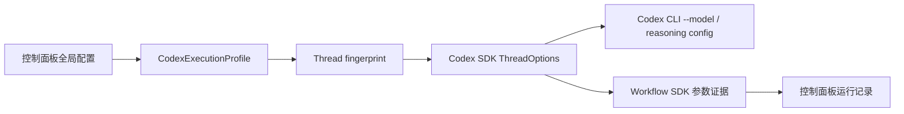

# Codex 模型与推理强度真实生效 Implementation Plan

> **For agentic workers:** REQUIRED SUB-SKILL: Use superpowers:subagent-driven-development (recommended) or superpowers:executing-plans to implement this plan task-by-task. Steps use checkbox (`- [ ]`) syntax for tracking.

**Goal:** 让控制面板选择的 Codex 模型和普通任务推理强度真实进入 Codex SDK/CLI，并在配置变化、thread 复用和 workflow 展示中形成可验证闭环。

**Architecture:** 在 `bridge-runtime` 新增纯函数 `CodexExecutionProfile` 作为模型来源、模型、推理强度和 thread 兼容性的唯一解析入口；`codex-provider` 只消费该档案并发出诚实的 SDK 参数证据。共享 workflow contract 承载请求值、提交值和 thread 模式，控制面板通过纯 view-model 展示这些证据，C# 设置层只负责规范化持久化和 Bridge 重启回读。

**Tech Stack:** TypeScript、Node.js test runner、React/Vite、C#/.NET 9 WinForms、`@openai/codex-sdk@0.132.0`、PowerShell、Git。

---

## 文件结构

### 新建

- `packages/bridge-runtime/src/codex-execution-profile.ts`：模型来源、请求模型、提交模型、请求/提交推理强度、受限覆盖和 fingerprint 的纯解析。
- `packages/bridge-runtime/src/__tests__/codex-execution-profile.test.ts`：执行档案和 fingerprint 单元测试。
- `apps/control-panel/web/src/codex-model-settings.ts`：策略切换、模型提交状态和 workflow 显示的浏览器安全纯函数。
- `apps/control-panel/web/src/codex-model-settings.test.ts`：控制面板模型设置与运行证据文案测试。
- `apps/control-panel/CodexModelSettingsSupport.cs`：C# 设置持久化所需的模型传递派生和加载摘要，不包含业务路由。
- `apps/control-panel/ControlPanel.Tests/CodexModelSettingsSupportTests.cs`：C# 规范化与摘要测试。

### 修改

- `packages/bridge-runtime/src/codex-provider.ts`：消费执行档案、保存 thread binding、发出 SDK 参数证据。
- `packages/bridge-runtime/src/__tests__/codex-provider.test.ts`：official 模型、推理强度、profile 变化 fresh thread 和兼容 retry 回归。
- `packages/contracts/src/workflow.ts`：扩展 `WorkflowExecutionSummaryContract`。
- `packages/contracts/src/__tests__/contracts.test.ts`：编译时和运行样例覆盖新增字段。
- `packages/bridge-runtime/src/main.ts`：采集/刷新新 telemetry 字段。
- `packages/bridge-runtime/src/workflow-status.ts`：规范化新 execution summary 字段。
- `packages/bridge-runtime/src/__tests__/workflow-status.test.ts`：workflow 持久化新字段。
- `apps/control-panel/web/src/main.tsx`：移除用户可见 `codexPassModel` 开关，显示模型、推理强度和 thread 证据。
- `apps/control-panel/Program.cs`：保存时由模型是否为空派生 `CTI_CODEX_PASS_MODEL`，保存并重启后返回加载摘要。
- `README.md`：说明模型留空/显式模型和“保存并重启 Bridge”。
- `docs/PROJECT-ARCHITECTURE.md`：记录执行档案、thread fingerprint 和 SDK 参数证据流。
- `docs/DEVELOPMENT-LOG.md`：记录根因、实现结果与 SDK 不回报服务端模型的限制。
- `AGENTS.md`：固化“配置值、SDK 提交值、Provider 回报值分层”约束。

---

### Task 1: 建立 Codex 执行档案纯函数

**Files:**
- Create: `packages/bridge-runtime/src/codex-execution-profile.ts`
- Create: `packages/bridge-runtime/src/__tests__/codex-execution-profile.test.ts`

- [ ] **Step 1: 写执行档案失败测试**

创建测试，覆盖 official 显式模型、空模型、受限回合和 fingerprint：

```ts
import assert from 'node:assert/strict';
import { describe, it } from 'node:test';
import {
  createCodexExecutionProfile,
  type CodexExecutionProfileInput,
} from '../codex-execution-profile.js';

const base: CodexExecutionProfileInput = {
  providerProfile: 'official',
  configuredModelSource: 'official',
  configuredModel: 'gpt-5.4',
  configuredReasoningEffort: 'xhigh',
};

describe('codex execution profile', () => {
  it('submits an explicit model for official Codex', () => {
    const profile = createCodexExecutionProfile(base);
    assert.equal(profile.modelSource, 'official');
    assert.equal(profile.modelMode, 'explicit');
    assert.equal(profile.requestedModel, 'gpt-5.4');
    assert.equal(profile.submittedModel, 'gpt-5.4');
    assert.equal(profile.submittedReasoningEffort, 'xhigh');
  });

  it('leaves model unset when source default is requested', () => {
    const profile = createCodexExecutionProfile({ ...base, configuredModel: '  ' });
    assert.equal(profile.modelMode, 'source_default');
    assert.equal(profile.submittedModel, undefined);
  });

  it('records restricted reasoning override without losing requested value', () => {
    const profile = createCodexExecutionProfile({ ...base, restrictedInteraction: true });
    assert.equal(profile.requestedReasoningEffort, 'xhigh');
    assert.equal(profile.submittedReasoningEffort, 'low');
    assert.equal(profile.overrideReason, 'restricted_interaction');
  });

  it('changes fingerprint when model or reasoning changes', () => {
    const original = createCodexExecutionProfile(base);
    const modelChanged = createCodexExecutionProfile({ ...base, configuredModel: 'gpt-5.5' });
    const effortChanged = createCodexExecutionProfile({ ...base, configuredReasoningEffort: 'high' });
    assert.notEqual(original.fingerprint, modelChanged.fingerprint);
    assert.notEqual(original.fingerprint, effortChanged.fingerprint);
  });
});
```

- [ ] **Step 2: 运行测试确认失败**

Run:

```powershell
node --test --import tsx packages/bridge-runtime/src/__tests__/codex-execution-profile.test.ts
```

Expected: FAIL，提示找不到 `../codex-execution-profile.js`。

- [ ] **Step 3: 实现最小执行档案**

创建纯模块：

```ts
import crypto from 'node:crypto';

export type CodexProviderProfile = 'primary' | 'official' | 'external' | 'local_primary';
export type CodexModelSource = 'official' | 'external_api' | 'local_api';
export type CodexReasoningEffort = 'minimal' | 'low' | 'medium' | 'high' | 'xhigh';

export interface CodexExecutionProfileInput {
  providerProfile: CodexProviderProfile;
  configuredModelSource?: string;
  configuredModel?: string;
  localModel?: string;
  configuredReasoningEffort?: string;
  baseUrl?: string;
  restrictedInteraction?: boolean;
}

export interface CodexExecutionProfile {
  providerProfile: CodexProviderProfile;
  modelSource: CodexModelSource;
  requestedModel?: string;
  submittedModel?: string;
  modelMode: 'source_default' | 'explicit';
  requestedReasoningEffort: CodexReasoningEffort;
  submittedReasoningEffort: CodexReasoningEffort;
  overrideReason?: 'restricted_interaction';
  baseUrl?: string;
  fingerprint: string;
}

export function normalizeCodexReasoningEffort(value?: string): CodexReasoningEffort {
  const normalized = (value || 'low').trim().toLowerCase();
  return normalized === 'minimal' || normalized === 'low' || normalized === 'medium'
    || normalized === 'high' || normalized === 'xhigh'
    ? normalized
    : 'low';
}

function resolveModelSource(input: CodexExecutionProfileInput): CodexModelSource {
  if (input.providerProfile === 'official') return 'official';
  if (input.providerProfile === 'external') return 'external_api';
  if (input.providerProfile === 'local_primary') return 'local_api';
  const configured = (input.configuredModelSource || '').trim().toLowerCase();
  return configured === 'local_api' || configured === 'external_api' ? configured : 'official';
}

function endpointIdentity(baseUrl?: string): string {
  if (!baseUrl?.trim()) return '';
  try {
    const url = new URL(baseUrl);
    return `${url.protocol}//${url.host}${url.pathname.replace(/\/+$/, '')}`;
  } catch {
    return baseUrl.trim().split('?')[0];
  }
}

export function createCodexExecutionProfile(input: CodexExecutionProfileInput): CodexExecutionProfile {
  const modelSource = resolveModelSource(input);
  const requestedModel = (modelSource === 'local_api' ? input.localModel : input.configuredModel)?.trim() || undefined;
  const requestedReasoningEffort = normalizeCodexReasoningEffort(input.configuredReasoningEffort);
  const submittedReasoningEffort = input.restrictedInteraction ? 'low' : requestedReasoningEffort;
  const fingerprintPayload = JSON.stringify({
    providerProfile: input.providerProfile,
    modelSource,
    model: requestedModel || 'source_default',
    reasoning: submittedReasoningEffort,
    endpoint: endpointIdentity(input.baseUrl),
  });
  return {
    providerProfile: input.providerProfile,
    modelSource,
    requestedModel,
    submittedModel: requestedModel,
    modelMode: requestedModel ? 'explicit' : 'source_default',
    requestedReasoningEffort,
    submittedReasoningEffort,
    ...(input.restrictedInteraction ? { overrideReason: 'restricted_interaction' as const } : {}),
    ...(input.baseUrl?.trim() ? { baseUrl: input.baseUrl.trim() } : {}),
    fingerprint: crypto.createHash('sha256').update(fingerprintPayload).digest('hex').slice(0, 16),
  };
}
```

- [ ] **Step 4: 运行测试确认通过**

Run:

```powershell
node --test --import tsx packages/bridge-runtime/src/__tests__/codex-execution-profile.test.ts
```

Expected: 4 tests PASS。

- [ ] **Step 5: 提交并推送 Runtime 纯函数阶段**

```powershell
git add packages/bridge-runtime/src/codex-execution-profile.ts packages/bridge-runtime/src/__tests__/codex-execution-profile.test.ts
git commit -m "feat: define codex execution profiles"
git push origin codex/workspace-pollution-governance
```

---

### Task 2: 让 Codex Provider 使用执行档案并主动切换 thread

**Files:**
- Modify: `packages/bridge-runtime/src/codex-provider.ts`
- Modify: `packages/bridge-runtime/src/__tests__/codex-provider.test.ts`
- Modify: `packages/bridge-runtime/src/main.ts`
- Test: `packages/bridge-core/src/__tests__/unit/bridge-channel-router.test.ts`

- [ ] **Step 1: 写 official 模型与 thread fingerprint 失败测试**

在 `codex-provider.test.ts` 增加：

```ts
function completedThread(threadId: string) {
  return {
    runStreamed: () => ({
      events: (async function* () {
        yield { type: 'thread.started', thread_id: threadId };
        yield { type: 'turn.completed', usage: { input_tokens: 1, output_tokens: 1, cached_input_tokens: 0 } };
      })(),
    }),
  };
}

function restoreOptionalEnv(name: string, value: string | undefined): void {
  if (value === undefined) delete process.env[name];
  else process.env[name] = value;
}

it('passes configured model and reasoning to official Codex', async () => {
  const saved = {
    source: process.env.CTI_CODEX_MODEL_SOURCE,
    model: process.env.CTI_CODEX_MODEL,
    effort: process.env.CTI_CODEX_REASONING_EFFORT,
  };
  process.env.CTI_CODEX_MODEL_SOURCE = 'official';
  process.env.CTI_CODEX_MODEL = 'gpt-5.4';
  process.env.CTI_CODEX_REASONING_EFFORT = 'xhigh';
  try {
    const provider = new CodexProvider(new PendingPermissions(), { profile: 'official' });
    let options: Record<string, unknown> | undefined;
    (provider as any).sdk = { Codex: class { constructor() {} } };
    (provider as any).codex = {
      startThread(value: Record<string, unknown>) {
        options = value;
        return completedThread('official-thread');
      },
    };
    await collectStream(provider.streamChat({ prompt: 'hello', sessionId: 'official-model' }));
    assert.equal(options?.model, 'gpt-5.4');
    assert.equal(options?.modelReasoningEffort, 'xhigh');
  } finally {
    restoreOptionalEnv('CTI_CODEX_MODEL_SOURCE', saved.source);
    restoreOptionalEnv('CTI_CODEX_MODEL', saved.model);
    restoreOptionalEnv('CTI_CODEX_REASONING_EFFORT', saved.effort);
  }
});

it('starts fresh when the execution profile changes', async () => {
  process.env.CTI_CODEX_RESUME_THREADS = 'true';
  process.env.CTI_CODEX_MODEL = 'gpt-5.4';
  const provider = new CodexProvider(new PendingPermissions(), { profile: 'official' });
  let resumes = 0;
  let starts = 0;
  (provider as any).threadBindings.set('profile-session', {
    threadId: 'old-thread',
    profileFingerprint: 'stale-fingerprint',
  });
  (provider as any).sdk = { Codex: class { constructor() {} } };
  (provider as any).codex = {
    resumeThread() { resumes += 1; return completedThread('old-thread'); },
    startThread() { starts += 1; return completedThread('new-thread'); },
  };
  const events = parseSSEChunks(await collectStream(provider.streamChat({
    prompt: 'use new profile',
    sessionId: 'profile-session',
  })));
  assert.equal(resumes, 0);
  assert.equal(starts, 1);
  const status = events.find((event) => event.type === 'status' && event.data?.parameterEvidence);
  assert.equal(status?.data?.threadMode, 'fresh_profile_changed');
});
```

测试辅助函数应沿用文件已有的 `collectStream` / `parseSSEChunks`；只新增小型 `completedThread()` 和 `restoreEnv()`，不要复制整套 SSE 工具。

- [ ] **Step 2: 运行 Provider 定向测试确认失败**

Run:

```powershell
node --test --import tsx packages/bridge-runtime/src/__tests__/codex-provider.test.ts
```

Expected: 新测试 FAIL；official 未传模型，且 `threadBindings` 尚不存在。

- [ ] **Step 3: 用执行档案替换散落判断**

在 `codex-provider.ts`：

```ts
import {
  createCodexExecutionProfile,
  type CodexExecutionProfile,
  type CodexProviderProfile,
} from './codex-execution-profile.js';

type CodexThreadBinding = {
  threadId: string;
  profileFingerprint: string;
};

private threadBindings = new Map<string, CodexThreadBinding>();
```

删除 `shouldPassModelToCodex()`、`getCodexModelOverride()` 和本文件重复的 `normalizeReasoningEffort()`；`buildCodexClientOptions()` 与 `streamChat()` 均通过同一个 helper 构造 profile：

```ts
function resolveExecutionProfile(
  profile: CodexProviderProfile,
  restrictedInteraction = false,
): CodexExecutionProfile {
  const localAiKind = (process.env.CTI_LOCAL_AI_KIND || 'ollama').trim().toLowerCase();
  const configuredSource = profile === 'official'
    ? 'official'
    : profile === 'external'
      ? 'external_api'
      : profile === 'local_primary'
        ? 'local_api'
        : (process.env.CTI_CODEX_MODEL_SOURCE || 'official').trim().toLowerCase();
  const baseUrl = configuredSource === 'local_api'
    ? normalizeLocalFallbackBaseUrl(
        process.env.CTI_LOCAL_AI_BASE_URL || process.env.CTI_OLLAMA_BASE_URL || 'http://127.0.0.1:11434',
        localAiKind,
      )
    : configuredSource === 'external_api'
      ? process.env.CTI_CODEX_BASE_URL || undefined
      : undefined;
  return createCodexExecutionProfile({
    providerProfile: profile,
    configuredModelSource: process.env.CTI_CODEX_MODEL_SOURCE,
    configuredModel: process.env.CTI_CODEX_MODEL,
    localModel: process.env.CTI_LOCAL_AI_MODEL || process.env.CTI_OLLAMA_MODEL || 'qwen2.5-coder:7b',
    configuredReasoningEffort: process.env.CTI_CODEX_REASONING_EFFORT,
    baseUrl,
    restrictedInteraction,
  });
}
```

导出只读 helper：

```ts
export function getOrdinaryCodexExecutionProfile(
  profile: CodexProviderProfile = 'primary',
): CodexExecutionProfile {
  return resolveExecutionProfile(profile, false);
}
```

Thread 选择改为：

```ts
const binding = self.threadBindings.get(params.sessionId);
const executionProfile = resolveExecutionProfile(profile, restrictedMode);
let threadMode: 'fresh' | 'resumed' | 'fresh_profile_changed' | 'fresh_resume_failed' = 'fresh';
let savedThreadId: string | undefined;
if (!restrictedMode && !params.forceFreshThread && resumeThreads && binding) {
  if (binding.profileFingerprint === executionProfile.fingerprint) {
    savedThreadId = binding.threadId;
    threadMode = 'resumed';
  } else {
    self.threadBindings.delete(params.sessionId);
    threadMode = 'fresh_profile_changed';
  }
}
```

`threadOptions` 使用：

```ts
const threadOptions: Record<string, unknown> = {
  ...(executionProfile.submittedModel ? { model: executionProfile.submittedModel } : {}),
  modelReasoningEffort: executionProfile.submittedReasoningEffort,
  // 保留已有 workingDirectory / approvalPolicy / sandbox 等字段
};
```

在 SDK 调用前发出参数证据：

```ts
controller.enqueue(sseEvent('status', {
  provider: 'codex',
  codexProfile: profile,
  modelSource: executionProfile.modelSource,
  requestedModel: executionProfile.requestedModel,
  submittedModel: executionProfile.submittedModel,
  modelMode: executionProfile.modelMode,
  requestedReasoningEffort: executionProfile.requestedReasoningEffort,
  submittedReasoningEffort: executionProfile.submittedReasoningEffort,
  executionOverrideReason: executionProfile.overrideReason,
  threadMode,
  parameterEvidence: 'sdk_thread_options',
}));
```

收到 `thread.started` 后才保存：

```ts
if (!restrictedMode) {
  self.threadBindings.set(params.sessionId, {
    threadId,
    profileFingerprint: executionProfile.fingerprint,
  });
}
```

resume 失败转 fresh 时同时设置 `threadMode='fresh_resume_failed'`，且最多重试一次。

- [ ] **Step 4: 让配置变化在 Bridge 重启后清空持久化 SDK thread**

`main.ts:computeRuntimeFingerprints()` 把普通执行档案 fingerprint 纳入现有 bridge fingerprint，不新增状态文件：

```ts
const codexProfileFingerprint = getOrdinaryCodexExecutionProfile('primary').fingerprint;
return {
  bridgeFingerprint: crypto.createHash('sha256')
    .update(computeFingerprint(bridgeFiles))
    .update('\n')
    .update(codexProfileFingerprint)
    .digest('hex')
    .slice(0, 16),
  toolingFingerprint: computeFingerprint(toolingFiles),
};
```

这样 `channel-router:refreshBindingForRuntimeChanges()` 会走已经存在的 `bridgeChanged` 分支，只清空 `sdkSessionId` 并更新 fingerprint，不调用 `rebindToFreshSession()`。先对测试 mock 做以下精确修改。

把函数返回类型替换为：

```ts
function createMockStore(): BridgeStore & {
  bindings: Map<string, ChannelBinding>;
  sessions: Map<string, { id: string; working_directory: string; model: string }>;
  settings: Map<string, string>;
}
```

在 `sessions` 声明后加入：

```ts
const settings = new Map<string, string>([
  ['bridge_default_work_dir', '/tmp/test'],
  ['bridge_allowed_workspace_roots', '/tmp/test'],
  ['bridge_default_model', 'claude-3'],
  ['bridge_default_provider_id', ''],
  ['bridge_runtime_fingerprint', 'profile-old'],
  ['bridge_tooling_fingerprint', 'tooling-stable'],
]);
```

在返回对象的 `bindings, sessions,` 后加入 `settings,`，并把原 `getSetting` 整段替换为：

```ts
getSetting(key: string) {
  return settings.get(key) ?? null;
},
```

在 `upsertChannelBinding` 创建的完整 binding 对象中加入：

```ts
bridgeFingerprint: data.bridgeFingerprint,
toolingFingerprint: data.toolingFingerprint,
```

然后增加完整测试：

```ts
it('clears only sdkSessionId when bridge fingerprint changes', () => {
  const first = router.resolve({ channelType: 'telegram', chatId: 'profile-chat' });
  store.bindings.set('telegram:profile-chat', {
    ...first,
    sdkSessionId: 'old-codex-thread',
    bridgeFingerprint: 'profile-old',
    toolingFingerprint: 'tooling-stable',
  });
  store.settings.set('bridge_runtime_fingerprint', 'profile-new');

  const refreshed = router.resolve({ channelType: 'telegram', chatId: 'profile-chat' });
  assert.equal(refreshed.sdkSessionId, '');
  assert.equal(refreshed.codepilotSessionId, first.codepilotSessionId);
  assert.equal(refreshed.workingDirectory, first.workingDirectory);
  assert.equal(refreshed.bridgeFingerprint, 'profile-new');
});
```

- [ ] **Step 5: 更新旧测试对 thread map 和 official 行为的预期**

把直接访问 `(provider as any).threadIds` 的测试改为：

```ts
(provider as any).threadBindings.set('sticky-codex-session', {
  threadId: 'codex-thread-123',
  profileFingerprint: createCodexExecutionProfile({
    providerProfile: 'primary',
    configuredModelSource: process.env.CTI_CODEX_MODEL_SOURCE,
    configuredModel: process.env.CTI_CODEX_MODEL,
    localModel: process.env.CTI_LOCAL_AI_MODEL || process.env.CTI_OLLAMA_MODEL,
    configuredReasoningEffort: process.env.CTI_CODEX_REASONING_EFFORT,
    baseUrl: process.env.CTI_CODEX_BASE_URL,
  }).fingerprint,
});
```

优先从执行档案模块导出测试 helper 或在测试中调用 `createCodexExecutionProfile()` 获取 fingerprint，禁止硬编码生产 hash。

- [ ] **Step 6: 运行 Provider、router 与类型检查**

Run:

```powershell
node --test --import tsx packages/bridge-runtime/src/__tests__/codex-execution-profile.test.ts packages/bridge-runtime/src/__tests__/codex-provider.test.ts
node --test --import tsx packages/bridge-core/src/__tests__/unit/bridge-channel-router.test.ts
npm --workspace packages/bridge-runtime run typecheck
```

Expected: tests PASS，TypeScript 0 errors。

- [ ] **Step 7: 提交并推送 Provider 阶段**

```powershell
git add packages/bridge-runtime/src/codex-execution-profile.ts packages/bridge-runtime/src/codex-provider.ts packages/bridge-runtime/src/main.ts packages/bridge-runtime/src/__tests__/codex-execution-profile.test.ts packages/bridge-runtime/src/__tests__/codex-provider.test.ts packages/bridge-core/src/__tests__/unit/bridge-channel-router.test.ts
git commit -m "fix: apply codex model execution profiles"
git push origin codex/workspace-pollution-governance
```

---

### Task 3: 把 SDK 参数证据持久化到 Workflow

**Files:**
- Modify: `packages/contracts/src/workflow.ts`
- Modify: `packages/contracts/src/__tests__/contracts.test.ts`
- Modify: `packages/bridge-runtime/src/main.ts`
- Modify: `packages/bridge-runtime/src/workflow-status.ts`
- Modify: `packages/bridge-runtime/src/__tests__/workflow-status.test.ts`

- [ ] **Step 1: 写 contract 和 workflow 持久化失败测试**

在 `contracts.test.ts` 的运行样例中加入：

```ts
const panelRun: WorkflowPanelRunContract = {
  id: 'run-1',
  sessionId: 'session-1',
  promptPreview: 'hello',
  stage: 'executing',
  status: 'running',
  startedAt: new Date().toISOString(),
  updatedAt: new Date().toISOString(),
  execution: {
    provider: 'codex',
    modelSource: 'official',
    requestedModel: 'gpt-5.4',
    submittedModel: 'gpt-5.4',
    modelMode: 'explicit',
    requestedReasoningEffort: 'xhigh',
    submittedReasoningEffort: 'xhigh',
    threadMode: 'fresh_profile_changed',
    parameterEvidence: 'sdk_thread_options',
  },
  events: [],
};
assert.equal(panelRun.execution?.submittedModel, 'gpt-5.4');
```

在 `workflow-status.test.ts` 追加：

```ts
it('persists Codex SDK parameter evidence from workflow events', () => {
  const run = startWorkflowRun({ sessionId: 'codex-profile', prompt: 'hello' });
  appendWorkflowEvent(run.id, 'finalizing', 'execution.evidence', '执行证据已记录', {
    requestedModel: 'gpt-5.4',
    submittedModel: 'gpt-5.4',
    modelMode: 'explicit',
    requestedReasoningEffort: 'xhigh',
    submittedReasoningEffort: 'xhigh',
    threadMode: 'fresh_profile_changed',
    parameterEvidence: 'sdk_thread_options',
  });
  const stored = readWorkflowStatus().runs.find((item) => item.id === run.id);
  assert.equal(stored?.execution?.submittedModel, 'gpt-5.4');
  assert.equal(stored?.execution?.threadMode, 'fresh_profile_changed');
});
```

- [ ] **Step 2: 运行测试确认失败**

Run:

```powershell
npm run test:contracts
node --test --import tsx packages/bridge-runtime/src/__tests__/workflow-status.test.ts
```

Expected: TypeScript 或断言 FAIL，新增字段尚未定义/持久化。

- [ ] **Step 3: 扩展共享 contract**

在 `WorkflowExecutionSummaryContract` 增加：

```ts
requestedModel?: string;
submittedModel?: string;
modelMode?: 'source_default' | 'explicit';
requestedReasoningEffort?: 'minimal' | 'low' | 'medium' | 'high' | 'xhigh';
submittedReasoningEffort?: 'minimal' | 'low' | 'medium' | 'high' | 'xhigh';
executionOverrideReason?: 'restricted_interaction';
threadMode?: 'fresh' | 'resumed' | 'fresh_profile_changed' | 'fresh_resume_failed';
parameterEvidence?: 'sdk_thread_options';
```

本阶段不修改 `workflow-run.schema.json`：该 schema 描述的是导出的 trace contract，不包含 `WorkflowPanelRunContract.execution`。如果实现中决定把 execution summary 加入 trace contract，必须同一提交更新 schema 和 `ControlApiContractTests`，不得只改 TypeScript。

- [ ] **Step 4: 扩展 runtime telemetry 采集**

在 `StreamEvidence` 增加同名字段，并在 `collectStreamEvidence()` 的 status 分支使用严格枚举判断：

```ts
if (typeof data.requestedModel === 'string') evidence.requestedModel = data.requestedModel;
if (typeof data.submittedModel === 'string') evidence.submittedModel = data.submittedModel;
if (data.modelMode === 'source_default' || data.modelMode === 'explicit') evidence.modelMode = data.modelMode;
if (isCodexReasoningEffort(data.requestedReasoningEffort)) evidence.requestedReasoningEffort = data.requestedReasoningEffort;
if (isCodexReasoningEffort(data.submittedReasoningEffort)) evidence.submittedReasoningEffort = data.submittedReasoningEffort;
if (data.executionOverrideReason === 'restricted_interaction') evidence.executionOverrideReason = data.executionOverrideReason;
if (isCodexThreadMode(data.threadMode)) evidence.threadMode = data.threadMode;
if (data.parameterEvidence === 'sdk_thread_options') evidence.parameterEvidence = data.parameterEvidence;
```

`flushWorkflowEvidence()` 把已定义值写入 payload；`workflow-status.ts:normalizeExecutionSummary()` 用相同枚举白名单读取，禁止任意字符串进入 workflow。

- [ ] **Step 5: 运行 contract、workflow 和边界测试**

Run:

```powershell
npm run test:contracts
node --test --import tsx packages/bridge-runtime/src/__tests__/workflow-status.test.ts packages/bridge-runtime/src/__tests__/workflow-contract.test.ts
npm run test:boundaries
npm run check:boundaries
```

Expected: all PASS。

- [ ] **Step 6: 提交并推送 Workflow 证据阶段**

```powershell
git add packages/contracts/src/workflow.ts packages/contracts/src/__tests__/contracts.test.ts packages/bridge-runtime/src/main.ts packages/bridge-runtime/src/workflow-status.ts packages/bridge-runtime/src/__tests__/workflow-status.test.ts
git commit -m "feat: record codex model execution evidence"
git push origin codex/workspace-pollution-governance
```

---

### Task 4: 修复控制面板设置语义与运行证据展示

**Files:**
- Create: `apps/control-panel/web/src/codex-model-settings.ts`
- Create: `apps/control-panel/web/src/codex-model-settings.test.ts`
- Modify: `apps/control-panel/web/src/main.tsx`
- Create: `apps/control-panel/CodexModelSettingsSupport.cs`
- Create: `apps/control-panel/ControlPanel.Tests/CodexModelSettingsSupportTests.cs`
- Modify: `apps/control-panel/Program.cs`

- [ ] **Step 1: 写 Web view-model 失败测试**

```ts
import assert from 'node:assert/strict';
import { describe, it } from 'node:test';
import {
  applyCodexSourceStrategy,
  describeCodexWorkflowExecution,
} from './codex-model-settings.js';

describe('Codex model settings', () => {
  it('keeps model and reasoning when switching to official', () => {
    const current = {
      codexModelSource: 'external_api',
      codexRoutingMode: 'manual',
      codexBaseUrl: 'https://example.test/v1',
      codexModel: 'gpt-5.4',
      codexReasoningEffort: 'xhigh',
    };
    const next = applyCodexSourceStrategy(current, 'official');
    assert.equal(next.codexModel, 'gpt-5.4');
    assert.equal(next.codexReasoningEffort, 'xhigh');
    assert.equal(next.codexBaseUrl, '');
  });

  it('describes source default without guessing a model', () => {
    const summary = describeCodexWorkflowExecution({
      modelMode: 'source_default',
      submittedReasoningEffort: 'high',
      parameterEvidence: 'sdk_thread_options',
      threadMode: 'fresh',
    });
    assert.equal(summary.model, 'Codex 来源默认模型（未显式传 model）');
    assert.equal(summary.reasoning, 'high（已提交给 Codex）');
  });

  it('shows restricted override honestly', () => {
    const summary = describeCodexWorkflowExecution({
      requestedReasoningEffort: 'xhigh',
      submittedReasoningEffort: 'low',
      executionOverrideReason: 'restricted_interaction',
    });
    assert.match(summary.reasoning, /请求 xhigh/);
    assert.match(summary.reasoning, /受限回合使用 low/);
  });
});
```

- [ ] **Step 2: 运行 Web 测试确认失败**

Run:

```powershell
npm --workspace codex-im-suite-control-panel-web test
```

Expected: FAIL，找不到 `codex-model-settings.js`。

- [ ] **Step 3: 实现 Web 纯函数并接入 main.tsx**

`applyCodexSourceStrategy()` 只调整来源特有字段，不清空模型和推理强度：

```ts
export function applyCodexSourceStrategy<T extends CodexStrategySettings>(current: T, strategy: AiStrategy): T {
  if (strategy === 'official') {
    return { ...current, codexModelSource: 'official', codexRoutingMode: 'manual', codexBaseUrl: '' };
  }
  if (strategy === 'local_api') {
    return { ...current, codexModelSource: 'local_api', codexRoutingMode: 'manual', codexBaseUrl: '' };
  }
  if (strategy === 'auto_failover') {
    return { ...current, codexRoutingMode: 'auto_failover' };
  }
  return { ...current, codexModelSource: 'external_api', codexRoutingMode: 'manual' };
}
```

`main.tsx`：

- 使用该纯函数替换内联 `applyAiStrategy` 字段重置。
- 删除“向 Codex 显式传递 model”复选框。
- official 时显示可选模型输入；空值提示“跟随 Codex 默认模型”。
- 推理字段标题改为“普通 Codex 任务推理强度”。
- 增加说明“classifier / response-only 固定 low，并在运行记录标注”。
- `WorkflowRunCard` 增加“推理”“Thread”“参数证据”三项，统一使用 `describeCodexWorkflowExecution()`。

- [ ] **Step 4: 写 C# 派生逻辑失败测试**

```csharp
using Xunit;

namespace CodexImSuite.ControlPanel.Tests;

public sealed class CodexModelSettingsSupportTests
{
    [Theory]
    [InlineData("", false)]
    [InlineData("   ", false)]
    [InlineData("gpt-5.4", true)]
    public void ShouldPassModel_IsDerivedFromModelText(string model, bool expected)
    {
        Assert.Equal(expected, ClaudeToImControlPanel.CodexModelSettingsSupport.ShouldPassModel(model));
    }

    [Fact]
    public void BuildLoadedSummary_DoesNotClaimProviderConfirmation()
    {
        var summary = ClaudeToImControlPanel.CodexModelSettingsSupport.BuildLoadedSummary(
            "official", "gpt-5.4", "xhigh");
        Assert.Contains("Bridge 已加载", summary);
        Assert.Contains("gpt-5.4", summary);
        Assert.DoesNotContain("服务端已确认", summary);
    }
}
```

- [ ] **Step 5: 运行 C# 测试确认失败**

Run:

```powershell
dotnet test apps/control-panel/ControlPanel.Tests/CodexImSuite.ControlPanel.Tests.csproj --filter CodexModelSettingsSupportTests
```

Expected: FAIL，找不到 `CodexModelSettingsSupport`。

- [ ] **Step 6: 实现 C# 支持类并接入保存**

```csharp
namespace ClaudeToImControlPanel;

internal static class CodexModelSettingsSupport
{
    internal static bool ShouldPassModel(string? model) => !string.IsNullOrWhiteSpace(model);

    internal static string BuildLoadedSummary(string source, string model, string effort)
    {
        var modelText = string.IsNullOrWhiteSpace(model) ? "来源默认模型" : model.Trim();
        return $"Bridge 已加载 Codex 配置：来源={source}，模型={modelText}，普通任务推理强度={effort}。实际任务参数请查看 Workflow。";
    }
}
```

`Program.cs:SaveSettingsFromDialog()` 改为：

```csharp
SetOrAppendEnv(lines, "CTI_CODEX_MODEL", settings.CodexModel.Trim());
SetOrAppendEnv(lines, "CTI_CODEX_PASS_MODEL",
    CodexModelSettingsSupport.ShouldPassModel(settings.CodexModel) ? "true" : "false");
```

`GetSettingsSnapshot()` 的兼容字段也从当前模型文本派生，避免旧 env 矛盾：

```csharp
CodexModelSettingsSupport.ShouldPassModel(GetConfig("CTI_CODEX_MODEL", "")),
```

`settings.saveAndRestartBridge` 在 `RestartBridgeAsync()` 成功并刷新状态后返回：

```csharp
return new {
    settings = GetSettingsSnapshot(),
    applySummary = CodexModelSettingsSupport.BuildLoadedSummary(
        settingsForRestart.CodexModelSource,
        settingsForRestart.CodexModel,
        settingsForRestart.CodexReasoningEffort)
};
```

Web `saveSettings()` 兼容普通 `SettingsState` 和 `{ settings, applySummary }` 两种结果，并把 `applySummary` 显示为成功通知。

- [ ] **Step 7: 运行 Web、C# 构建与测试**

Run:

```powershell
npm --workspace codex-im-suite-control-panel-web test
npm --workspace codex-im-suite-control-panel-web run build
dotnet test apps/control-panel/ControlPanel.Tests/CodexImSuite.ControlPanel.Tests.csproj
dotnet build apps/control-panel/CodexImSuite.ControlPanel.csproj -c Release
```

Expected: all PASS / build succeeded。

- [ ] **Step 8: 提交并推送控制面板阶段**

```powershell
git add apps/control-panel/web/src/codex-model-settings.ts apps/control-panel/web/src/codex-model-settings.test.ts apps/control-panel/web/src/main.tsx apps/control-panel/CodexModelSettingsSupport.cs apps/control-panel/ControlPanel.Tests/CodexModelSettingsSupportTests.cs apps/control-panel/Program.cs
git commit -m "fix: apply codex model settings from control panel"
git push origin codex/workspace-pollution-governance
```

---

### Task 5: 更新架构、人类文档和维护约束

**Files:**
- Modify: `docs/PROJECT-ARCHITECTURE.md`
- Modify: `docs/DEVELOPMENT-LOG.md`
- Modify: `README.md`
- Modify: `AGENTS.md`

- [ ] **Step 1: 运行架构检查确认更新范围**

Run:

```powershell
powershell -ExecutionPolicy Bypass -File .\scripts\update-architecture-docs.ps1
```

Expected: `Architecture review: REQUIRED`，因为 Provider 路由、thread 生命周期和 workflow 数据流发生变化。

- [ ] **Step 2: 更新架构文档**

在 Codex provider / workflow 段落加入小型 Mermaid：



文字明确：

- 模型为空表示来源默认，不猜模型名。
- 模型/推理/来源变化主动 fresh thread。
- classifier 固定 low 并记录覆盖原因。
- SDK 0.132.0 只能证明参数已提交，不能证明服务端回报了实际模型。

- [ ] **Step 3: 更新 README、开发日志和 AGENTS**

README 增加用户入口：

```markdown
- 官方 Codex 的“模型”可以留空（跟随 Codex 默认）或填写显式模型；“保存并重启 Bridge”后，后续普通任务使用新配置。会话页 Workflow 展示本轮已提交给 Codex 的模型、推理强度和 thread 切换原因。
```

AGENTS 增加长期约束：

```markdown
- 涉及模型和推理强度时，必须区分“配置请求值”“Runtime/SDK 实际提交值”“Provider/服务端回报值”；没有服务端回报时只能声称已提交，不得把配置文件或面板文本描述为模型已确认生效。模型来源、模型或推理强度改变时，不得复用 profile fingerprint 不匹配的 Codex thread。
```

开发日志记录日期、根因、测试覆盖、SDK 限制和 live 验收待办，不复制完整设计文档。

- [ ] **Step 4: 运行人类文档与乱码门禁**

Run:

```powershell
npm run check:human-docs
rg -n '锟|烫烫|屯屯|�' README.md AGENTS.md docs/PROJECT-ARCHITECTURE.md docs/DEVELOPMENT-LOG.md
git diff --check
```

Expected: 文档检查 PASS；`rg` 无输出；`git diff --check` 无错误。

- [ ] **Step 5: 提交并推送文档阶段**

```powershell
git add README.md AGENTS.md docs/PROJECT-ARCHITECTURE.md docs/DEVELOPMENT-LOG.md
git commit -m "docs: document codex model execution evidence"
git push origin codex/workspace-pollution-governance
```

---

### Task 6: 全量验证、同步 live 和真实入口验收

**Files:**
- Verify: `packages/bridge-runtime/src/codex-execution-profile.ts`
- Verify: `packages/bridge-runtime/src/codex-provider.ts`
- Verify: `packages/contracts/src/workflow.ts`
- Verify: `apps/control-panel/web/src/main.tsx`
- Verify: `C:\Users\admin\.codex\skills\claude-to-im`
- Verify: `C:\Users\admin\.claude-to-im\runtime\status.json`
- Verify: `C:\Users\admin\.claude-to-im\runtime\bridge-runtime-audit.json`
- Verify: `C:\Users\admin\.claude-to-im\runtime\workflow-runs.json`
- Verify: `C:\Users\admin\.claude-to-im\logs\bridge.log`

- [ ] **Step 1: 运行完整代码门禁**

Run:

```powershell
npm run test:contracts
npm run test:runtime
npm run test:boundaries
npm run check:boundaries
npm run check:human-docs
npm --workspace codex-im-suite-control-panel-web test
npm --workspace codex-im-suite-control-panel-web run build
dotnet test apps/control-panel/ControlPanel.Tests/CodexImSuite.ControlPanel.Tests.csproj
powershell -ExecutionPolicy Bypass -File .\scripts\update-architecture-docs.ps1
```

Expected: all PASS；架构脚本不再报告未审阅的必要变化。

- [ ] **Step 2: 构建并同步 live**

Run:

```powershell
powershell -ExecutionPolicy Bypass -File .\scripts\sync-live-skill.ps1
```

Expected: bridge-core、bridge-runtime 和控制面板构建成功；suite -> live 同步成功；正式控制面板入口为 `CodexImSuiteControlPanel.exe`。

- [ ] **Step 3: 重启 live Bridge 并验证连接**

Run:

```powershell
powershell -ExecutionPolicy Bypass -File C:\Users\admin\.codex\skills\claude-to-im\scripts\daemon.ps1 restart
```

随后 UTF-8 读取四个运行态文件，确认：

```text
Bridge running
Feishu WS connected
lastUnhandledError = null
live commit = 当前 HEAD
```

- [ ] **Step 4: 通过实际控制面板应用一组可验证配置**

在用户实际访问的 live 面板：

1. 选择 official。
2. 模型填写当前账号已知可用的模型；若没有第二个可验证模型，使用当前有效模型。
3. 推理强度选择非默认值，例如 `high`。
4. 点击“保存并重启 Bridge”。
5. 确认页面显示“Bridge 已加载”，而不是“服务端已确认”。
6. 验证 `config.env` 中模型、派生的 `CTI_CODEX_PASS_MODEL=true` 和推理强度一致。

- [ ] **Step 5: 从真实 Feishu 私聊发起普通 Agent 回合**

发送一个不会触发 classifier-only 的普通只读问题，例如：

```text
请回复当前任务已收到，并说明这是一次模型配置验收，不要修改文件。
```

检查最新 workflow run：

```text
execution.modelSource = official
execution.submittedModel = 面板显式模型
execution.submittedReasoningEffort = high
execution.parameterEvidence = sdk_thread_options
execution.threadMode = fresh 或 fresh_profile_changed
```

再次在同一会话追问，确认相同 fingerprint 时 `threadMode=resumed`。

- [ ] **Step 6: 验证受限回合覆盖与错误不静默降级**

- 触发一个已有 classifier 路径，确认 `requestedReasoningEffort=high`、`submittedReasoningEffort=low`、`executionOverrideReason=restricted_interaction`。
- 在不影响长期配置的受控测试中传入不存在模型，确认任务失败且 workflow 保留显式模型，不回落来源默认；随后立即恢复有效模型并重启。
- 如果无法安全验证不存在模型，只保留自动测试证据并在开发日志说明未执行破坏性 live 失败验证，不能伪造结果。

- [ ] **Step 7: 完成最终反向审计**

逐项核对设计验收：

- official 模型非空真实进入 SDK。
- 模型留空不传 `--model`。
- 普通推理强度真实进入 SDK。
- 受限回合固定 low 且有覆盖原因。
- profile 变化不复用旧 thread。
- Workflow 和面板区分请求值、提交值和来源默认。
- 保存、重启、live 副本、实际端口和 Feishu 运行入口一致。
- 文档没有展示未实现能力。

- [ ] **Step 8: 提交并推送最终验收记录**

把真实验证结果补入 `docs/DEVELOPMENT-LOG.md`，然后：

```powershell
git add docs/DEVELOPMENT-LOG.md
git commit -m "test: verify live codex model settings"
git push origin codex/workspace-pollution-governance
```

最后确认：

```powershell
git status --short --branch
git rev-list --left-right --count HEAD...origin/codex/workspace-pollution-governance
```

Expected: 工作区干净，ahead/behind 为 `0 0`。
