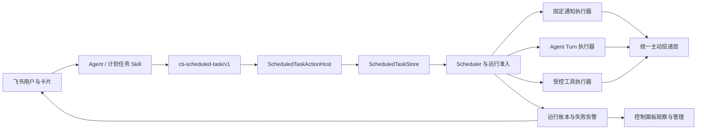
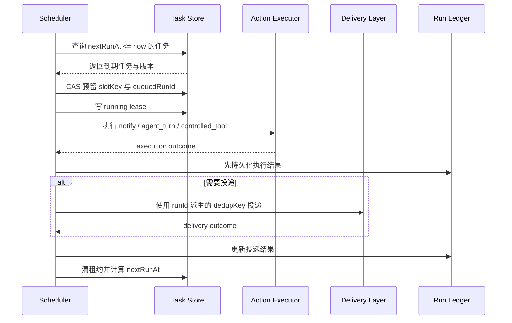

# 统一计划任务设计

## 1. 目标

截至 2026-07-18，`codex-im-suite` 的直接提醒只支持单次 `dueAt`。用户通过飞书提出“每个工作日早上十点半给我发每日的单子”时，Agent 会生成周期时间描述，但运行时 `createDirectReminder()` 只能把字符串归一化成单个 ISO 时间，因此返回“无效提醒时间”。

本设计新增运行时拥有的统一计划任务系统，使以下需求进入同一条可靠执行链：

- 单次固定提醒。
- 周期固定通知。
- 到点启动 Agent，动态查询、整理并发送结果。
- Owner 授权的受控工具任务。
- 飞书中的创建、暂停、恢复、立即运行、删除、历史查询和失败诊断。

目标不是只补充“工作日 10:30”这一种解析，而是建立通用的计划、执行、投递、恢复和审计协议。

## 2. 已验证事实

### 2.1 当前项目

- `cti-reminder`、`/remind` 和 `packages/bridge-runtime/src/todo-reminders.ts` 只保存单次 `dueAt`。
- 当前提醒服务按固定间隔轮询，并使用一个时间窗口判断是否到期。
- 当前状态只有 `pending / sent / failed / skipped`，缺少周期规则、运行实例、执行锁、重试计划和重启恢复。
- 当前直接提醒写入记忆仓库中的 Markdown，再重建提醒索引；计划任务运行状态与长期记忆职责混在一起。
- 飞书主动投递、结构化 mention、互动卡片回调和角色门禁已经存在，可以复用。

### 2.2 OpenClaw 参考

本次参考 OpenClaw 提交 `347ee45895033b461649b1bcd2035b23fd221d5b` 的实际实现：

- [Cron 概念与运行说明](https://github.com/openclaw/openclaw/blob/347ee45895033b461649b1bcd2035b23fd221d5b/docs/automation/cron-jobs.md)
- [计划任务数据协议](https://github.com/openclaw/openclaw/blob/347ee45895033b461649b1bcd2035b23fd221d5b/src/cron/types.ts)
- [时间计算](https://github.com/openclaw/openclaw/blob/347ee45895033b461649b1bcd2035b23fd221d5b/src/cron/schedule.ts)
- [运行时定时器、重试和漏跑恢复](https://github.com/openclaw/openclaw/blob/347ee45895033b461649b1bcd2035b23fd221d5b/src/cron/service/timer.ts)

采用的原则：

- 调度必须由常驻运行时负责，不能依赖模型保持在线。
- 任务定义、可变状态、每次运行记录和投递结果应分离。
- 执行成功和消息投递成功必须分别记录。
- 重试只针对可恢复错误，避免重复执行有副作用的动作。
- 重启后必须识别漏跑、执行中断和已经完成但状态未落盘的运行。
- 每次运行必须有稳定身份，避免同一计划时间槽重复执行。

不直接照搬的部分：

- 当前项目支持 Node.js 20，且发布链不包含 SQLite 原生依赖。首版使用可替换的存储接口和原子文件实现，不引入 `better-sqlite3` 等原生模块。
- 当前项目以飞书为主要主动投递渠道，协议优先复用现有 `deliverProactiveMessage()`、mention 和 CardKit 回调能力。

## 3. 方案决策

选择独立的 `Scheduled Task Engine`，不把周期能力继续塞进 `todo-reminders.ts`。

### 3.1 不采用：直接扩展 reminder

问题：

- reminder 的语义是通知，无法自然承载动态 Agent turn 和受控工具执行。
- 单个提醒状态不能表达一次周期任务的多次运行。
- 继续把运行状态写进记忆 Markdown 会扩大记忆库、运行态和审计边界混用。

### 3.2 不采用：Windows 计划任务

问题：

- Windows 专用，不利于跨平台和 portable 发布。
- 无法自然复用飞书会话证据、Owner 门禁、Agent session 和统一投递。
- 外部任务只能证明进程被启动，不能证明 Agent 执行和飞书投递成功。

### 3.3 采用：运行时统一计划任务引擎



## 4. 职责边界

### 4.1 `bridge-core`

- 声明 `ScheduledTaskActionHost` 和跨运行时数据协议。
- 解析 Agent 输出的 `cti-scheduled-task` 动作块。
- 校验本轮飞书目标、原生 mention、reply 和创建者证据。
- 根据 action 类型执行 Viewer、Operator、Owner 门禁。
- 拦截只有口头声明、没有真实 Host 成功结果的伪完成回复。
- 处理飞书卡片 callback，并调用同一个 Host，不在 callback 中复制业务逻辑。

### 4.2 `bridge-runtime`

- 保存任务定义、可变状态和运行账本。
- 计算单次、固定间隔和 cron 的下一次运行时间。
- 负责排队、并发限制、运行租约、超时、取消、重试和恢复。
- 调用固定通知、Agent turn 或受控工具执行器。
- 将最终结果交给统一主动投递层。
- 提供创建、查询、暂停、恢复、立即运行、删除和运行历史接口。

### 4.3 `apps/control-panel`

- 只提供状态观察和管理入口。
- 不解析自然语言，不计算 cron，不直接启动 Agent，不直接发送飞书消息。
- 展示未实现或不可用能力时必须明确禁用，不能提供假入口。

### 4.4 Skill

- 理解用户的计划任务意图。
- 判断应使用固定通知、动态 Agent turn 还是受控工具。
- 把自然语言时间转换成结构化 schedule。
- 调用 Host 提供的确定性工具并根据真实结果回复。
- 诊断失败时读取运行账本，不扫描工作区、聊天下载目录或记忆库冒充任务状态。

Skill 不负责：

- 自己写任务文件。
- 创建 Windows 计划任务。
- 直接调用飞书 API。
- 绕过 Owner/Operator 门禁。
- 在没有 Host 成功结果时声称任务已经创建或执行。

## 5. 数据协议

### 5.1 任务定义

```ts
type ScheduledTask = {
  schema: 'codex-im-suite/scheduled-task/v1';
  id: string;
  name: string;
  enabled: boolean;
  schedule: ScheduledTaskSchedule;
  action: ScheduledTaskAction;
  delivery: ScheduledTaskDelivery;
  misfirePolicy: ScheduledTaskMisfirePolicy;
  retryPolicy: ScheduledTaskRetryPolicy;
  owner: ScheduledTaskOwner;
  createdAt: string;
  updatedAt: string;
};
```

### 5.2 时间规则

```ts
type ScheduledTaskSchedule =
  | { kind: 'at'; at: string; timezone: string }
  | { kind: 'every'; everyMs: number; anchorAt: string }
  | { kind: 'cron'; expression: string; timezone: string };
```

规则：

- `at` 必须是带时区或可结合显式 `timezone` 解析的 ISO 时间。
- `every` 必须保存稳定锚点，重启后不能以“当前启动时间”重新起算。
- `cron` 首版使用标准 5 字段表达式。
- 时区使用 IANA 名称；飞书中文请求默认 `Asia/Shanghai`，但协议不写死中国时区。
- “每个工作日早上十点半”规范化为 `30 10 * * 1-5` 和 `Asia/Shanghai`。
- 首版“工作日”指周一至周五，不自动推断中国法定节假日；节假日日历作为后续独立 calendar provider，不在 v1 硬编码。

### 5.3 动作类型

```ts
type ScheduledTaskAction =
  | { kind: 'notify'; text: string }
  | { kind: 'agent_turn'; prompt: string; sessionMode: 'isolated' | 'bound'; timeoutMs?: number }
  | { kind: 'controlled_tool'; toolName: string; input: unknown; timeoutMs?: number };
```

- `notify`：低风险固定文字通知。
- `agent_turn`：到点动态查询和生成结果。默认使用隔离运行会话，避免长期污染用户聊天上下文；明确要求连续上下文时才使用受控绑定会话。
- `controlled_tool`：只能使用运行时 allowlist 中明确支持的计划任务工具。创建、修改、立即运行均要求 Owner，并保留真实工具证据。

### 5.4 飞书投递目标

```ts
type ScheduledTaskDelivery = {
  channelType: 'feishu' | string;
  chatId: string;
  chatType?: string;
  threadId?: string;
  accountId?: string;
  notifyTargets?: Array<{ userId?: string; name?: string; atAll?: boolean }>;
  mode: 'result' | 'summary' | 'none';
};
```

- `chatId`、`threadId`、`userId` 只能来自 adapter、resolver 或真实工具返回。
- 模型输出的平台 ID 不作为可信事实。
- 创建时保存当时的真实飞书投递目标，不能在执行时从小写 session key 反推平台 ID。
- `mode=result` 发送完整结果；`summary` 发送受限摘要；`none` 只保留账本。

### 5.5 可变状态

```ts
type ScheduledTaskState = {
  taskId: string;
  nextRunAt?: string;
  queuedRunId?: string;
  runningRunId?: string;
  runningLeaseUntil?: string;
  lastRunAt?: string;
  lastRunStatus?: 'ok' | 'error' | 'skipped' | 'cancelled';
  lastExecutionStatus?: 'ok' | 'error' | 'skipped' | 'cancelled';
  lastDeliveryStatus?: 'delivered' | 'failed' | 'not_requested' | 'unknown';
  consecutiveErrors: number;
  consecutiveSkipped: number;
  lastError?: string;
};
```

### 5.6 运行账本

每个计划时间槽生成稳定身份：

```text
slotKey = sha256(taskId + scheduledFor)
runId  = taskId + ':' + scheduledFor + ':' + attempt
```

运行记录至少包含：

- `taskId`、`runId`、`slotKey`、`scheduledFor`。
- `trigger=scheduled|manual|catch_up|retry`。
- 排队、开始、结束时间。
- attempt、执行状态、投递状态。
- Agent sessionId、provider、model 和受限 usage 摘要。
- 脱敏错误、诊断摘要和下一次重试时间。
- 飞书目标摘要和真实发送返回的 message/card 标识。
- 取消者、暂停者或人工重跑者的受控 actor 证据。

运行账本不得保存密钥、token、完整工具日志或未脱敏用户文件内容。

## 6. 存储设计

新增通用接口：

```ts
interface ScheduledTaskStore {
  listTasks(filter?: ScheduledTaskFilter): Promise<ScheduledTask[]>;
  getTask(taskId: string): Promise<ScheduledTask | null>;
  createTask(task: ScheduledTask): Promise<void>;
  updateTask(taskId: string, expectedVersion: number, patch: ScheduledTaskPatch): Promise<void>;
  deleteTask(taskId: string, expectedVersion: number): Promise<void>;
  readState(taskId: string): Promise<ScheduledTaskState | null>;
  compareAndSetState(taskId: string, expectedVersion: number, next: ScheduledTaskState): Promise<void>;
  appendRun(run: ScheduledTaskRun): Promise<void>;
  listRuns(filter: ScheduledTaskRunFilter): Promise<ScheduledTaskRun[]>;
}
```

首版文件实现位置：

```text
CTI_HOME/data/scheduled-tasks/
├── tasks/
├── states/
├── runs/
└── quarantine/
```

约束：

- 该目录属于运行态，不属于项目工作区、记忆库、上传缓存或发布产物。
- 采用临时文件、flush、原子替换保存 JSON。
- 每个任务独立文件，避免一个损坏文件破坏全部任务。
- 乐观版本号和进程内串行写队列共同防止覆盖。
- 解析失败的任务进入 `quarantine`，控制面板显式展示，不能静默删除。
- Store 接口不暴露文件路径，上层以后可替换为 SQLite。

## 7. 调度与执行流程



关键规则：

- 同一个 `slotKey` 只能有一个获准运行。
- 执行结果先落盘，再投递；投递失败时只重试投递，不重新执行已经成功的 Agent 或工具动作。
- 手动“立即运行”生成独立 manual slot，不修改周期锚点。
- 暂停只阻止新运行，不粗暴终止已开始任务；终止运行使用单独的 Owner/Operator 取消动作。
- 删除任务前保留运行历史；默认软删除，明确永久删除才清理历史。

## 8. 漏跑与重启恢复

### 8.1 Misfire policy

```ts
type ScheduledTaskMisfirePolicy = {
  mode: 'run_latest' | 'skip';
  maxLatenessMs: number;
};
```

- 默认 `run_latest`：重启后只补最近一个错过的时间槽，不补齐全部历史次数。
- 超过 `maxLatenessMs` 后记录 `skipped` 并计算下一个自然时间。
- 动态日报默认允许在 24 小时内补跑一次。
- 用户可选择 `skip`，适合过时后没有意义的即时通知。

### 8.2 运行中断

- 启动时发现 `runningLeaseUntil` 已过期，先检查同一 `runId` 是否已有终态账本。
- 有终态账本：恢复任务状态，不重复执行。
- 无终态账本：记录 `interrupted_by_restart`。
- `notify` 且没有投递成功证据时可以按策略重试投递。
- `agent_turn` 或 `controlled_tool` 如果已经开始执行但结果未知，默认不自动重放，进入人工复核，避免重复副作用。

## 9. 重试、超时与失败告警

默认重试策略：

```ts
type ScheduledTaskRetryPolicy = {
  maxAttempts: 3;
  backoffMs: [30000, 60000, 300000];
  retryOn: ['rate_limit', 'overloaded', 'network', 'timeout', 'server_error'];
};
```

- 只重试明确可恢复错误。
- 参数错误、权限错误、目标不存在和工具不在 allowlist 属于永久错误。
- `executionStarted=true` 的受控工具失败不能自动重跑，除非工具声明幂等且 Host 生成了稳定 idempotency key。
- 周期任务的失败重试属于当前时间槽；重试完成后仍回到原始 cron 节奏。
- 如果下一个自然时间先到但旧运行仍在执行，默认跳过重叠运行并记录 `overlap_skipped`。
- Agent turn 有统一 wall-clock timeout，并通过同一个 abort signal 取消 provider、工具和子进程。
- 连续失败达到阈值后，向独立失败目标发送飞书告警；告警有冷却时间，防止刷屏。

## 10. 飞书交互

### 10.1 创建确认卡

展示：

- 任务名称和任务类型。
- 时间规则、时区和下次运行时间。
- 发送会话和 @ 目标。
- 当前状态。
- 暂停、恢复、立即运行、查看历史和删除按钮。

### 10.2 卡片权限

- 查看任务和运行历史：至少 Operator；任务创建者可以查看自己创建的低风险任务。
- 暂停、恢复、删除低风险任务：创建者或 Operator。
- 修改投递目标、取消运行、永久删除：至少 Operator。
- `controlled_tool` 的创建、修改、立即运行、恢复和删除：Owner。
- 所有按钮、数字快捷回复和文本命令复用同一个结构化 action 门禁。

### 10.3 最终投递

- `notify` 直接使用固定文字构造卡片。
- `agent_turn` 的最终正文必须来自真实 Agent 运行结果。
- 文件和图片继续使用 `cti-final.files/images` 的真实路径声明。
- 投递 dedupKey 使用 `scheduled-task:<runId>:delivery`。
- Agent 已经通过受控消息工具发送到同一目标时，Delivery Layer 不再重复发送最终结果。
- 执行成功但飞书失败时，任务状态显示“执行成功 / 投递失败”，并允许只重试投递。

## 11. Agent 动作协议

新增：

```text
cti-scheduled-task
```

支持 action：

- `create`
- `list`
- `get`
- `pause`
- `resume`
- `run_now`
- `cancel_run`
- `delete`
- `history`
- `retry_delivery`

Agent 只提交用户可理解的任务定义和本轮 evidence ID。Host 必须重新解析角色、目标和风险，不信任模型输出的角色、路径、平台 ID 或权限字段。

现有 `cti-reminder` 和 `/remind` 保持兼容，并在 Host 内转换成：

```text
schedule.kind = at
action.kind = notify
```

## 12. Skill 设计

目录：

```text
extensions/skills/manage-codex-im-scheduled-tasks/
├── SKILL.md
└── agents/openai.yaml
```

Skill 名称：`manage-codex-im-scheduled-tasks`

触发条件：

- 创建单次或周期提醒。
- 到点动态查询并发送日报、待办、单据或项目摘要。
- 查看、暂停、恢复、立即运行、删除计划任务。
- 诊断任务未运行、运行失败、飞书未投递或重复发送。

核心决策：

| 用户目标 | action |
|---|---|
| 到点发固定文字 | `notify` |
| 到点查询当前数据并整理 | `agent_turn` |
| 到点修改外部状态或执行工具 | `controlled_tool` |

Skill 必须先通过失败场景测试再编写：

- 周期请求被错误降级成单次 reminder。
- 固定通知和动态查询无法区分。
- 模型编造飞书 chatId/open_id。
- 没有 Host 结果却声称创建成功。
- Agent 执行成功但投递失败时重新执行 Agent，造成重复副作用。
- 普通用户通过计划任务绕过 Owner 工具门禁。
- Bridge 重启后同一时间槽重复执行。

不使用 subagent 进行测试；本仓库约束禁止在用户未要求时擅自派生 subagent。采用脚本化提示场景、协议解析单测和 Skill validator 完成 RED/GREEN 验证。

## 13. 控制面板

在现有运行态管理界面增加“计划任务”视图：

- 汇总：启用、暂停、运行中、失败、隔离中的任务数量。
- 列表：名称、规则、类型、下次运行、上次执行、投递状态、连续失败。
- 详情：完整规则、创建者、目标、近期运行历史和诊断摘要。
- 动作：暂停、恢复、立即运行、取消运行、软删除、重试投递。

面板调用 runtime Control API，不直接读写任务目录。若 runtime 不支持某项操作，按钮必须禁用并显示真实原因。

## 14. 迁移策略

- 旧 direct reminder Markdown 继续只读兼容。
- 新创建的直接提醒写入 Scheduled Task Store，不再写入记忆 Markdown。
- 提供默认 dry-run 的迁移器，将未完成且时间有效的旧 direct reminder 转换为单次 `notify` 任务。
- Apply 前停止 reminder watcher，建立备份和转换清单；冲突不覆盖。
- 记忆 Markdown 中普通待办继续由知识索引管理，不自动全部转成计划任务。
- 迁移完成后，`todo-reminders.ts` 只保留旧记忆待办兼容，不再承担通用计划任务调度。

## 15. 测试策略

### 15.1 时间计算

- `at`、`every`、cron 和 IANA 时区。
- 工作日、跨日、月末、夏令时跳变。
- 非法表达式、非法时区和过去时间。
- 固定锚点在重启后保持不变。

### 15.2 存储与幂等

- 原子写入失败保留旧版本。
- 版本冲突不能覆盖新状态。
- 同一个 `slotKey` 并发准入只有一个成功。
- 损坏任务隔离且不阻断其他任务。

### 15.3 执行与恢复

- notify、agent_turn、controlled_tool 三种执行器。
- 执行超时和统一取消。
- 重启恢复已有终态、过期租约和未知副作用运行。
- 漏跑只补最近一次。
- 手动运行不改变周期锚点。

### 15.4 重试与投递

- 暂时性错误按策略重试。
- 永久错误不重试。
- 执行成功、投递失败时只重试投递。
- 相同 runId 不重复向飞书发送。
- 连续失败告警和冷却。

### 15.5 权限与飞书

- Viewer、Operator、Owner 的创建和管理边界。
- 卡片、文本、数字快捷入口使用同一个门禁。
- chatId/open_id 只能来自真实 evidence。
- 群聊、私聊、thread 和结构化 @。
- 飞书 API 失败返回真实阻塞，不伪造成功。

### 15.6 Skill

- 先运行无 Skill 的失败场景并保存基线结果。
- 编写最小 Skill 后运行相同场景。
- 使用 `quick_validate.py` 验证结构。
- 检查 SKILL.md 与 `agents/openai.yaml` 一致。

## 16. 文档与架构同步

实现涉及运行时链路、飞书动作协议、控制面板、默认存储边界和 live 同步，必须同步维护：

- `docs/PROJECT-ARCHITECTURE.md`
- `docs/DEVELOPMENT-LOG.md`
- `README.md`
- 必要时更新 `AGENTS.md`

实现完成前运行：

```powershell
powershell -ExecutionPolicy Bypass -File .\scripts\update-architecture-docs.ps1
```

## 17. 阶段性 Git 存档

1. 设计规格：独立 commit 并 push。
2. 调度协议、存储和时间计算：独立 commit 并 push。
3. 运行准入、账本、重试、超时和重启恢复：独立 commit 并 push。
4. bridge-core 动作协议、飞书卡片和权限门禁：独立 commit 并 push。
5. 飞书兼容 Skill：完成 RED/GREEN 验证后独立 commit 并 push。
6. 控制面板、迁移、文档、live 同步和最终验收：独立 commit 并 push。

每次提交前必须确认：

- 当前分支和 ahead/behind。
- 未提交及未跟踪文件边界。
- 本阶段相关测试真实通过。
- 没有把临时下载、截图、上传缓存、日志或研究副本加入 Git。

## 18. 验收标准

以下条件全部满足才算完成：

- 飞书请求“每个工作日早上十点半给我发每日的单子”能创建周期 `agent_turn` 任务。
- 创建确认卡显示 `Asia/Shanghai`、工作日 10:30 和正确飞书目标。
- 到点真实启动 Agent，并把动态结果发送到原会话。
- Bridge 重启后任务仍存在，漏跑策略和下次时间正确。
- 同一时间槽不会重复执行或重复发送。
- 暂时性失败会重试，永久失败会停止当前运行并给出真实诊断。
- Agent 成功但飞书失败时能够只重试投递。
- 飞书可以暂停、恢复、立即运行、查看历史和删除任务。
- 普通用户不能通过周期任务执行 Owner 专属工具。
- 现有 `cti-reminder` 和 `/remind` 单次提醒保持兼容。
- Skill 通过基线失败场景、应用场景和结构验证。
- 控制面板只展示真实已实现入口。
- 架构文档、开发日志、README、live skill 和运行中 Bridge 已同步并验证。
