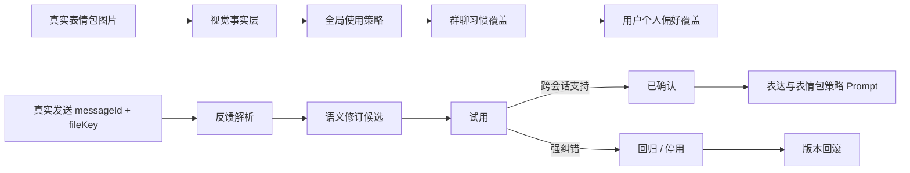

# 表情包语义进化与回滚设计

## 1. 目标

截至 2026-07-18，飞书表情包库已经支持真实图片视觉标注、人工语义、用户待核验解释、`avoidWhen`、归档、恢复、永久删除和可信语义门禁，但语义仍主要依赖一次视觉分析或人工编辑。`useCount` 与 `lastUsedAt` 只能证明表情包被发送过，不能证明当时选得正确，也没有把后续用户反馈转成可审计、可回滚的语义优化。

本设计新增受控的表情包语义进化系统：机器人可以根据真实发送结果和后续反馈持续优化使用语义、群聊习惯、用户个人避免项和 `avoidWhen`，同时禁止把沉默、模型自述或未绑定具体表情包的文本伪造成“用户认可”。

目标不是让 Agent 任意改写 Agent Home，而是复用 Agent Home 自维护的证据、试用、确认、回归、版本和回滚纪律，在表情包资产层维护独立语义生命周期。

## 2. 当前事实

- 表情包主库位于记忆仓库 `data/im/feishu/stickers/stickers.json`。
- 可信语义来源目前包括 `vision`、`manual` 和带 `annotationVerifiedAt` 的受控记录。
- `userAnnotation` 只作为未核验 evidence，不能直接成为自动发送语义。
- 当前记录已有 `label / description / intent / tone / usage / avoidWhen / aliases / examples`。
- `useCount` 和 `lastUsedAt` 会在真实发送后更新，但没有保存当时上下文、选择理由或后续反馈。
- 飞书 adapter 已保存 outbound refs、消息 ID、file key、reply、reaction 和近邻上下文，可作为反馈绑定基础。
- Agent Home 核心文档只允许受控安全自维护，不适合保存每个表情包的资产语义。

## 3. 方案决策

采用“视觉事实 + 使用策略 + 偏好覆盖”三级模型，并对使用策略实行证据加权的版本化进化。

### 3.1 不采用：没人反驳立即视为正确

用户可能离线、没看到、没有回复习惯或已经结束话题。一次沉默不能证明语义正确，更不能修改图片视觉事实。

### 3.2 不采用：使用次数等于正确次数

重复发送错误表情包只会扩大错误。`useCount` 只能用于频率和冷却，不作为正确性证据。

### 3.3 采用：证据加权、分层覆盖、可回滚进化



## 4. 三级语义模型

### 4.1 视觉事实层

描述图片本身：

- 画面主体、动作和可读文字。
- 基础情绪与情绪强度。
- 是否明显包含讽刺、攻击、冒犯或敏感内容。

规则：

- 只能来自目标 `fileKey` 的真实图片视觉分析或人工编辑。
- 沉默、发送次数、聊天 reaction 和文本反馈不能修改视觉事实。
- `manual` 视觉事实自动锁定；自动系统只能提出建议，不能覆盖。

### 4.2 使用策略层

描述如何使用：

- `intent`
- `tone`
- `usage`
- `aliases`
- `examples`
- `avoidWhen`

使用策略允许根据真实反馈进化，但每次修改先生成 revision，不直接覆盖当前确认版本。

### 4.3 偏好覆盖层

语义按以下优先级合成：

```text
全局基础语义 < 群聊使用习惯 < 用户个人偏好
```

- 全局层保存图片通用表达和通常用途。
- 群聊层保存该群特有的玩笑、称呼和使用习惯。
- 用户层保存个人禁用、喜欢或避免项。
- 用户个人“不喜欢”不会让整个表情包全局失效。
- 群聊和用户覆盖只在对应真实 chatId/userId 边界内生效，不进入其他会话 Prompt。

## 5. 反馈证据

每条反馈必须绑定：

```ts
type StickerDeliveryEvidence = {
  deliveryId: string;
  fileKey: string;
  outboundMessageId: string;
  channelType: 'feishu';
  chatId: string;
  targetUserId?: string;
  semanticRevisionId: string;
  contextHash: string;
  sentAt: string;
};
```

模型正文、文件名、历史摘要或未验证平台 ID 不能生成 delivery evidence。

### 5.1 强正反馈

- 用户原生 reply 精确指向该表情包并说“对、就是这个、这个合适”。
- 用户在后续独立请求中明确要求同一个 alias/fileKey。
- 用户对该消息添加配置为正向的 reaction。

### 5.2 弱正反馈

- 用户在同一主题中自然继续，并没有纠错或重复请求。
- 表情包在多个独立 session 的相似语义上下文中使用后，没有出现负反馈。

弱反馈规则：

- 单次沉默只记录为 neutral，不直接加确认分。
- 同一 session 对同一 revision 最多贡献一次弱支持。
- 只有多个独立 session、不同时间窗口的弱支持才能推动 `trial → confirmed`。
- 历史重扫、daemon 重启和重复回调不得重复计数。

### 5.3 强负反馈

- 用户原生 reply 精确指向表情包并说“不对、不是这个意思、别在这种情况发”。
- 用户明确说某个 alias/语义对应错误，并能唯一解析到本轮实际发送的表情包。
- 用户对该消息添加配置为负向的 reaction，且语义没有歧义。

一次强负反馈可以立即停止该 revision 在相同 scope 下继续自动使用，但语义修改仍必须进入 `trial` 或回滚，不允许自由文本直接覆盖。

### 5.4 不可用反馈

- 没有指向具体表情包的泛泛抱怨。
- 引用、转述、规则说明或历史文本中的“对/不对”。
- assistant 自己声称“用户没有反对”。
- bot/app sender 的普通文本。
- delivery evidence 之外的旧 fileKey。

## 6. 语义修订协议

```ts
type StickerSemanticRevision = {
  schema: 'codex-im-suite/sticker-semantic-revision/v1';
  revisionId: string;
  fileKey: string;
  scope: 'global' | 'chat' | 'user';
  scopeId?: string;
  status: 'trial' | 'confirmed' | 'regressed' | 'rejected';
  baseHash: string;
  patch: {
    intent?: string;
    tone?: string;
    usage?: string;
    aliases?: string[];
    examples?: string[];
    avoidRules?: StickerAvoidRule[];
  };
  supportEvidenceHashes: string[];
  contradictionEvidenceHashes: string[];
  createdAt: string;
  updatedAt: string;
};
```

规则：

- classifier 只输出结构化 patch，不输出完整表情包记录。
- revision 必须携带读取时 `baseHash`；写入锁内重新校验，防止覆盖人工编辑。
- 自动 revision 不能覆盖 `manual` 字段，只能显示建议。
- 内容改变后重新进入 `trial`，不得继承旧版本支持数。
- 同一 evidence hash 和同一 session 不重复计数。
- 强负反馈可标记 `regressed` 并恢复上一个确认版本。

## 7. 结构化 `avoidWhen`

自由文本 `avoidWhen` 继续作为兼容展示，但运行时权威数据改为规则列表：

```ts
type StickerAvoidRule = {
  id: string;
  condition: string;
  scope: 'global' | 'chat' | 'user';
  scopeId?: string;
  status: 'trial' | 'confirmed' | 'regressed';
  confidence: number;
  supportCount: number;
  contradictionCount: number;
  evidenceHashes: string[];
  createdAt: string;
  updatedAt: string;
};
```

允许从真实负反馈生成的通用规则包括：

- 正式通知或严肃故障时避免。
- 用户正在表达愤怒、悲伤或投诉时避免。
- 同一表情包刚刚连续发送过时避免。
- 当前用户明确表示不喜欢时避免。
- 某群只在特定内部玩笑语境使用。

这些是 classifier 可选择的语义类别，不通过现场截图、具体群名或固定用户写死。

## 8. Agent Home 融合

不新增 Agent Home 根目录文件，也不把表情包语义写入：

- `机器人身份.md`
- `行为与安全规则.md`
- `工具与环境.md`

Runtime 每轮按当前 channel/chat/user 动态生成独立、限长的 Prompt section：

```text
表达与表情包策略
- 当前可用表情包及已确认语义
- 当前群聊覆盖规则
- 当前用户个人避免项
- 允许试用的低权重 revision
- 最近冷却与重复发送限制
```

该 section：

- 只包含当前身份边界内的数据。
- 不包含完整反馈正文、原始 messageId、open_id 或内部审计。
- 只影响表达选择，不覆盖工具证据、权限、安全和正式结果。
- 归档、禁用或 regressed 的表情包不会进入可发送候选。

控制面板 Agent Home 页面增加“表达进化”观察区，但事实源仍是表情包语义库和 revision store。

## 9. 存储与回滚

建议新增：

```text
<memoryRoot>/data/im/feishu/stickers/
├─ stickers.json
├─ semantic-revisions.json
├─ semantic-feedback.jsonl
├─ semantic-versions/
├─ 表情包语义档案.md
└─ media/
```

- `semantic-feedback.jsonl` 只保存 evidence hash、反馈类型、scope、时间和 revisionId，不保存完整聊天正文。
- `semantic-versions` 保存受控 before-image，用于单表情包回滚。
- revision 和主库写入复用单一排他锁、临时文件和 rename。
- 主库与 `.bak` 同步，避免旧备份复活已回归或删除语义。
- 归档表情包停止收集反馈；恢复后延续原版本历史。
- 永久删除表情包时同时删除 revision 活跃索引，但保留最小 tombstone 和脱敏删除审计。
- `表情包语义档案.md` 是由主库和 revision store 确定性生成的人类可读投影，按表情包展示当前视觉事实、已确认使用策略、群聊/用户覆盖摘要、`avoidWhen`、状态和最近版本；不复制完整反馈正文、open_id、messageId 或内部 evidence hash。
- 语义主库、revision、版本记录和中文档案使用同一事务；档案刷新失败时语义修改回滚，禁止“机器人已学会但人类文档看不到”。
- Agent Home 根目录 `记忆总索引.md` 只增加“表情包语义档案”的真实链接、资产/试用/争议数量和更新时间，不复制表情包具体语义。
- `记忆库说明.md` 的受控状态区块同步说明表情包语义版本和进化开关，保留用户手写内容。

## 10. 控制面板

表情包管理增加“语义进化”视图：

- `trial / confirmed / regressed / disputed` 数量。
- 当前全局、群聊和用户覆盖层。
- 正向、弱支持、负向和中性反馈趋势。
- 自动新增的 `avoidWhen` 候选。
- 每次 revision 的差异、证据计数和生效范围。
- 接受建议、拒绝建议、手动编辑、回滚、禁用和归档。

人工操作优先级：

- 人工确认后标记 `manual`，自动系统不能覆盖。
- 人工拒绝的相同 patch 保存拒绝指纹，避免反复提出。
- 回滚只恢复指定表情包和指定 scope，不影响其他资产。

## 11. 运行时数据流

1. Adapter 实际发送 sticker 后记录 delivery evidence。
2. 后续 reply、reaction 或当前主题消息进入反馈候选门禁。
3. 确定性层先验证 outboundMessageId、fileKey、sender 和 scope。
4. 只有语义仍有歧义时调用 JSON-only、禁工具反馈 classifier。
5. Feedback Host 更新计数或生成 revision。
6. revision 达到跨 session 支持条件后确认；出现强负反馈时回归或生成 `avoidWhen` 候选。
7. 下一轮 Prompt 只注入当前已确认和允许试用的有效语义。
8. 所有自动修改可在控制面板查看和回滚。

## 12. 验收标准

- 一次沉默不会把语义提升为确认。
- 同一会话重复消息和历史重扫不会重复计分。
- 明确 reply 纠错能唯一绑定真实发送的表情包。
- “这种情况别发”可生成带 scope 的 `avoidWhen` trial 规则。
- 群聊规则不会泄漏到其他群，用户个人偏好不会全局禁用资产。
- 自动 revision 不能覆盖人工语义。
- trial、confirmed、regressed 均有版本、证据计数和回滚入口。
- 归档后不再选择或学习；恢复后版本历史仍存在。
- Agent Home Prompt Snapshot 能观察独立“表达与表情包策略”section，且不含原始敏感标识。
- 飞书实际验收覆盖正确使用、沉默、正向 reaction、明确纠错、自动避免规则和回滚。
- 每次 revision 确认、回归、人工编辑、归档和还原后，`表情包语义档案.md` 与控制面板展示一致。
- 人类可读档案更新失败时，主库和 revision 不得留下半完成状态。

## 13. 与记忆治理的关系

本设计与《记忆候选与归档中心设计》共享以下原则：

- 未确认内容不进入主长期事实。
- 自动修改先进入候选/试用。
- 归档可恢复，永久删除需二次确认。
- evidence 去重、身份边界、原子写入和回滚优先。

但表情包语义不进入普通知识索引，也不写入用户印象、群聊记忆或公共长期记忆。它属于独立的资产语义层，通过限长 Prompt section 服务表达选择。

实现时按“反馈协议与存储 → 确定性绑定 → classifier → revision 生命周期 → Prompt 注入 → 控制面板 → live 验收”的顺序分阶段提交并推送 Git 存档。
