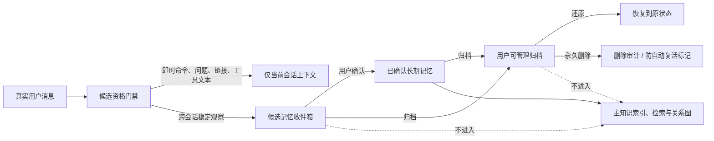

# 记忆候选与归档中心设计

## 1. 目标

截至 2026-07-18，控制面板“记忆索引”把已确认事实、自动生成的暂定印象、资源、待办和关系对象放在同一主列表中。真实用户文件 `memory/users/<channel>/<userId>/用户印象.md` 已出现大量普通提问、Unity 操作命令、链接总结请求、群聊玩法和 Skill 正文；这些内容并不是稳定长期事实，却被展示为普通记忆并参与知识索引。

本设计同时解决两个问题：

- 收紧长期记忆入口：普通对话不能未经确认进入主记忆索引、检索 Prompt 或关系图。
- 提供明显的生命周期入口：用户能在“记忆索引”页查看候选、归档、还原和永久删除，不需要去“治理 → 设置”的折叠区寻找。

目标不是只增加一个“归档”按钮，而是建立“已确认 / 候选 / 已归档”三层记忆协议，保证归档后不会被历史同步或自动观察重新写回主索引。

## 2. 已验证根因

### 2.1 自动观察范围过宽

`packages/bridge-runtime/src/store.ts` 的 `extractMemoryProfileItems()` 目前只要文本包含 `prefab / scene / mcp / unity / codex / feishu / 家具 / 场景 / 权限 / 发布` 等词，就可能把整条消息加入 `facts`。

这会把以下内容误判为事实：

- “Unity MCP 截一张 game 图”一类即时命令。
- “pve 关卡场景叫啥”一类问题。
- 飞书链接总结、工具 doctor、截图和连接检查请求。
- 群聊游戏规则、机器人回复格式和 mention 文本。
- 大段 Skill、Markdown、命令或文档正文。

### 2.2 同一历史重复读取会抬高置信度

`observationCounts` 只按规范化文本累计次数，不记录独立 session、消息 ID 或来源。历史同步、重复索引或同一会话重复消息都可能提高计数。达到 3 次后，`materializeDerivedUserImpression()` 会把整条对话写成 `暂定-<hash>`。

### 2.3 暂定印象与确认事实共用主索引

`knowledge-indexer.ts` 会解析受支持记忆 Markdown 中的所有表格行。它不知道表格属于“已确认事实”还是“暂定印象”，因此为两者生成相同的 `KnowledgeItem`，并给普通表格项默认 `0.75` 置信度。

结果是：

- 暂定印象出现在“普通记忆”。
- 暂定印象参与搜索、关系图和记忆回捞。
- UI 显示的置信度与隐藏状态里的真实置信度不一致。
- 归档单条知识行只能处理结果，自动观察仍可能重新生成同类条目。

### 2.4 归档入口分散且隐藏

- 知识归档恢复/删除位于“治理 → 设置”的折叠区域。
- 表情包归档只通过表情包筛选器查看。
- “记忆索引”页本身没有清晰的候选与归档生命周期入口。
- 系统级会话归档、自维护历史和备份与用户可管理记忆归档没有明确区分。

## 3. 方案选择

采用“候选记忆收件箱 + 主记忆索引 + 用户可管理归档”方案。

### 3.1 不采用：只增加归档按钮

优点是改动小，但自动观察仍会继续制造错误记忆，归档后相似内容还会重新出现，属于治标不治本。

### 3.2 不采用：完全关闭自动观察

可以立刻降低污染，但会失去发现稳定用户偏好和重复项目约束的能力，也无法让用户审核后转为正式记忆。

### 3.3 采用：三层生命周期



核心原则：

- 只有已确认长期记忆进入主知识索引。
- 候选记忆默认不进入 Agent Prompt、记忆搜索、关系图或待办提醒。
- 归档是非破坏操作；永久删除只允许对归档项执行。
- 系统归档与用户记忆归档分开，不给普通 UI 提供删除运行审计、会话归档或自维护历史的入口。

## 4. 记忆分层协议

### 4.1 已确认记忆

来源只能是：

- 用户明确要求“记住/保存/记录”，且独立记忆分类器给出高置信、结构化候选和明确 scope。
- 用户在候选记忆收件箱中手动点击“确认为记忆”。
- 受控迁移中已经能证明为明确事实的旧记录。

已确认记忆：

- 写入 `confirmed` 状态。
- 渲染在 Markdown 的“已确认事实”区域。
- 进入 `knowledge.json`、关系图和受身份边界约束的记忆检索。
- 保留真实来源类型、创建时间和最近更新时间，但不复制完整聊天正文到索引。

### 4.2 候选记忆

候选只代表“可能值得长期保存”，不代表事实已经成立。

候选必须同时满足：

- 来源是当前身份边界内的真实 human 消息。
- 归一化后是短、完整、可独立理解的陈述。
- 不包含密钥、token、精确私密信息或其他敏感内容。
- 来自至少两个不同 session 的独立证据，或由用户明确触发但 scope/键值仍需确认。
- 候选分类器输出结构化 `key/value/scope/reason`，不能保存整段原始消息。

以下内容不能自动成为候选：

- 疑问句、命令句、截图/打开/检查/总结/生成/修复等即时任务。
- 单独 URL、飞书授权链接、文件下载链接和链接总结请求。
- shell、PowerShell、MCP、工具调用参数或日志。
- mention、机器人玩法、回复格式、群聊临时规则。
- Markdown frontmatter、Skill 正文、代码块、长文档和引用内容。
- 待办、提醒和计划任务；它们属于运行系统，不属于长期事实。
- assistant 输出、历史摘要或模型自行推断。

候选记忆：

- 存储在受控 managed state 中。
- 在人类可读 Markdown 中放入“候选记忆（不参与索引）”区域。
- 不进入主知识索引。
- UI 展示候选原因、独立 session 数、最后证据时间和置信度。
- 支持确认、归档和批量归档。

### 4.3 已归档记忆

用户可管理归档存放于：

```text
<memoryRoot>/archive/memory-items/<scope>/<itemId>.json
```

每条归档记录使用 `codex-im-suite/memory-item-archive/v1`，至少保存：

```ts
type MemoryItemArchive = {
  schema: 'codex-im-suite/memory-item-archive/v1';
  itemId: string;
  previousStatus: 'confirmed' | 'candidate';
  scope: 'user' | 'group' | 'long_term';
  sourcePath: string;
  key: string;
  entry: MemoryDocumentEntry;
  archivedAt: string;
  archivedBy: 'control-panel' | 'migration';
};
```

规则：

- 归档时从活动 managed state 移除，再原子写入归档记录并重建索引。
- 还原时验证归档路径和原 sourcePath 都在记忆仓库内。
- 还原默认回到 `previousStatus`；如果 key 已存在且值不同，失败关闭并提示冲突，不覆盖现有事实。
- 永久删除只删除归档记录，并写入最小删除审计；不会删除其他用户、群聊或系统归档。
- 自动观察对已永久删除内容保存稳定指纹 tombstone，防止相同候选再次自动复活；用户明确要求记住时仍可经过确认链重新建立。

## 5. 自动观察改造

### 5.1 运行态与长期记忆分离

`memoryProfiles` 中的 topics、pending 和普通对话摘要只作为运行态会话辅助信息，继续保存在 `CTI_HOME`，不得直接物化为长期记忆 Markdown。

删除当前“关键词命中 → facts → 计数三次 → 写入暂定印象”的直接链路。

### 5.2 独立证据计数

候选证据按稳定观察键保存：

```ts
type CandidateObservation = {
  key: string;
  value: string;
  scope: 'user';
  sessionIds: string[];
  sourceMessageHashes: string[];
  firstSeenAt: string;
  lastSeenAt: string;
};
```

- 同一 session 重复消息只计一次。
- Feishu 云历史重扫同一 message 不重复计数。
- assistant、引用正文和历史摘要不计数。
- 不把原始 messageId、open_id 或完整聊天正文写进用户可见归档；只保留去重哈希和脱敏来源类型。

### 5.3 候选分类

记忆意图分类器仍是唯一长期记忆语义入口。候选扩展不能恢复关键词正则直写：

- `confirmed_write`：用户明确保存且证据充分，进入确认记忆。
- `candidate_observation`：稳定但未明确确认，只进入候选收件箱。
- `temporary`：仅当前 session。
- `ignore`：普通任务或聊天，不持久化。
- `clarify`：缺 scope、键值或事实主体，由主 Agent 询问最小问题。

分类器只输出 JSON、禁用工具、无工作目录，结果必须引用本轮真实 human evidence。

## 6. 索引器改造

### 6.1 Managed v3 文档按状态读取

对于包含 `cti-memory-state` 的 v3 managed 文档，`knowledge-indexer.ts` 不再盲目解析全部 Markdown 表格，而是：

- 解码并校验 managed state。
- 只从 `confirmed` 构建 `KnowledgeItem`。
- 使用 entry 的真实置信度、key、value 和更新时间。
- `candidate` 和归档记录不进入索引。

没有 managed state 的合法 v2/v3 用户手写文件继续按现有前缀和表格规则兼容读取。

### 6.2 索引展示统计

控制 API 分开返回：

- `confirmedCount`
- `candidateCount`
- `archivedCount`
- `legacyCount`
- `conflictCount`

“普通记忆”不再把候选数量算入主记忆数量。

## 7. 控制面板设计

“记忆索引”页面增加一级状态切换：

```text
[已确认记忆] [候选收件箱] [已归档]
```

### 7.1 已确认记忆

- 保留搜索、类型、来源和关系图。
- 每条提供“打开来源”和“归档”。
- 支持多选后批量归档。
- 归档确认框说明：归档后不再参与 Agent 记忆检索，可在“已归档”恢复。

### 7.2 候选收件箱

- 默认按低置信、最近生成排序。
- 展示候选 key/value、候选原因、独立 session 数和最后观察时间。
- 操作：确认为记忆、归档、批量归档。
- 不展示为“事实”，统一标记“未确认”。
- 提供“一键归档全部旧候选”，但不提供无确认的永久批量删除。

### 7.3 已归档

- 展示原状态、scope、归档时间和来源文件。
- 操作：还原、永久删除。
- 永久删除需要二次确认，并明确不可恢复。
- 支持按“原为已确认 / 原为候选”筛选。

### 7.4 系统档案边界

消息归档、运行日志、自维护版本、发布备份、迁移备份和 workspace cleanup 隔离备份不进入该页面。它们只能在各自受控诊断或恢复入口中管理，避免用户把“删除一条记忆”误操作成删除系统证据链。

## 8. Control API 与服务边界

新增 runtime-owned `MemoryItemLifecycleService`，控制面板只调用命令，不直接编辑 Markdown 或 JSON：

- `memory.items.status`
- `memory.items.listCandidates`
- `memory.items.listArchives`
- `memory.items.confirmCandidate`
- `memory.items.archive`
- `memory.items.restore`
- `memory.items.deleteArchive`
- `memory.items.archiveCandidatesBatch`

所有写操作：

- 使用 source hash / baseHash 防止并发覆盖。
- 采用临时文件 + rename 原子写入。
- 写入后重建知识索引和记忆总索引。
- 返回真实变更数量和失败项，不允许 UI 乐观伪完成。
- 校验 actor、scope 和路径边界；模型提供的路径或 itemId 不作为可信事实。

`apps/control-panel` 只负责展示、确认和调用 Gateway，不复制 managed state 解析、索引或迁移逻辑。

## 9. 旧数据迁移

新增默认 dry-run 的迁移：

```text
memory-candidate-migration preview
memory-candidate-migration apply --manifest <reviewed.json>
```

迁移步骤：

1. 扫描 v3 managed 文档中的现有 `tentative`。
2. 生成包含 source hash、条目数量、目标状态和冲突的 UTF-8 清单。
3. Apply 前要求 Bridge 和 memory watcher 停止。
4. 备份原文件。
5. 将现有 `暂定-*` 保留为候选记忆，不直接删除。
6. 重写文档标题为“候选记忆（不参与索引）”。
7. 重建索引；迁移后主索引不得包含任何 `暂定-*`。
8. 记录 migration manifest，重复 Apply 保持幂等。

现有错误候选不会自动确认为长期事实。用户可在候选收件箱批量归档，必要时再永久删除。

## 10. 错误处理与安全

- managed state 损坏时失败关闭，不从可见表格猜测状态后覆盖源文件。
- 归档记录损坏时隔离到 quarantine，并在 UI 显示数量和原因。
- source hash 变化时拒绝使用旧页面数据写入，要求刷新。
- 还原冲突不覆盖现有 key；显示两侧值供用户处理。
- 永久删除只接受已归档 itemId，不接受任意本地路径。
- 所有中文 Markdown、JSON 和报告显式 UTF-8。
- 不在日志和审计中保存完整对话正文、token、open_id 或私有链接参数。

## 11. 验收标准

### 11.1 主索引纯度

- 截图、MCP 检查、Unity 操作命令、问题和链接总结请求不会进入候选或主索引。
- 普通对话重复出现不会因为同一 session 或历史重扫提高候选证据数。
- `暂定-*` 不出现在主知识索引、关系图、默认搜索和 Agent 记忆 Prompt。
- 明确确认的场景映射和用户偏好仍能进入主索引并被准确回捞。

### 11.2 生命周期

- 已确认项可从记忆索引页归档。
- 候选可确认、归档和批量归档。
- 已归档项在同一页面可见，可还原或永久删除。
- 还原后回到原状态；候选还原后仍不进入主索引。
- 永久删除后历史同步和自动观察不会复活同一候选。

### 11.3 迁移

- 默认 dry-run 不修改任何文件。
- Apply 有备份、source hash、冲突不覆盖和幂等证据。
- 现有用户文件中的候选不丢失，但主索引数量显著下降到已确认事实口径。

### 11.4 UI

- 用户无需进入“治理 → 设置”即可完成记忆归档、还原和永久删除。
- 三个状态数量独立展示，候选不再标成普通事实。
- 当前浏览器实际访问的 bundle 能看到新入口，并完成一次真实归档/还原测试。

## 12. 文档与发布

实现完成后同步维护：

- `docs/PROJECT-ARCHITECTURE.md`：记忆三层生命周期、索引和归档数据流。
- `docs/DEVELOPMENT-LOG.md`：迁移结果、风险和未决问题。
- `README.md`：控制面板用户入口和迁移命令。
- `AGENTS.md`：禁止普通对话、命令、问题或历史重扫直接提升为长期记忆。

运行时改动完成并验证后，按仓库规则构建、同步 live、重启 Bridge，并检查记忆索引、日志和飞书连接。阶段性完成设计、协议/存储、索引、Control API、UI、迁移和 live 验收时分别提交并推送 Git 存档。
