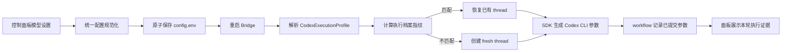

# Codex 模型与推理强度真实生效设计

## 1. 目标

截至 2026-07-21，控制面板虽然提供 Codex 模型和推理强度设置，但官方 Codex 模式会主动清空模型并关闭模型传递，Provider 也会对 `official` profile 强制忽略 `CTI_CODEX_MODEL`。用户看到的是可编辑控件，实际执行却未必使用所选模型，属于配置入口与运行行为不一致。

本设计建立“配置、应用、执行证据、用户可见状态”闭环：

- 官方 Codex、本地 API、外部 API 都按同一套规则解析模型和推理强度。
- 模型留空表示使用该来源的默认模型；模型非空表示显式传递。
- 普通 Agent 回合真实传递用户配置；classifier / response-only 等受限回合允许安全降级，但必须展示覆盖原因。
- 模型或推理强度变化后不复用不匹配的旧 Codex thread。
- 控制面板和 workflow 展示“配置请求值”和“本轮实际提交给 Codex 进程的值”，不能把配置文件内容冒充运行证据。
- 保持通用设计，不为某个具体模型名称、账号或会话硬编码。

本次采用全局默认作用域。配置保存并重启 Bridge 后影响后续新任务；暂不增加每会话覆盖，避免全局配置、会话配置和旧 thread 三层状态互相覆盖。

## 2. 已验证根因

### 2.1 官方模式在面板中主动丢弃配置

`apps/control-panel/web/src/main.tsx` 的 `applyAiStrategy('official')` 当前会写入：

```text
codexModel=''
codexPassModel=false
codexReasoningEffort='low'
```

因此用户切换到官方 Codex 时，原来选择的模型和推理强度会被重置，而不是作为官方 Codex 的可选执行参数保存。

### 2.2 Provider 对官方 profile 强制忽略模型

`packages/bridge-runtime/src/codex-provider.ts` 当前包含两条强制规则：

- `shouldPassModelToCodex('official')` 永远返回 `false`。
- `getCodexModelOverride('official')` 永远返回 `undefined`。

即使配置文件存在 `CTI_CODEX_MODEL` 和 `CTI_CODEX_PASS_MODEL=true`，官方 profile 也不会把模型交给 SDK。

### 2.3 推理强度有传递链，但没有诚实的生效证据

当前普通回合会把 `CTI_CODEX_REASONING_EFFORT` 写入：

- bridge 专用 Codex Home 的 `config.toml`；
- Codex client 的 `model_reasoning_effort`；
- `startThread` / `resumeThread` 的 `modelReasoningEffort`。

已安装的 `@openai/codex-sdk@0.132.0` 会把模型转换为 `--model <value>`，把推理强度转换为 `--config model_reasoning_effort=\"<value>\"`。这能证明参数已提交给 Codex 子进程，但 SDK 的 `thread.started` / `turn.completed` 事件不返回实际模型或推理强度，不能进一步声称远端模型已经回报确认。

### 2.4 旧 thread 只在失败后被动切换

当前会优先 `resumeThread(savedThreadId, threadOptions)`。只有执行在尚未产生事件前抛出“different model / no such session / resume”一类错误时，才重试 fresh thread。配置变化后没有主动比较旧 thread 的执行档案，因此可能先尝试复用不匹配的 thread，也无法在面板解释为什么新开会话。

### 2.5 已有“保存并重启 Bridge”，但缺少应用回读

控制面板已经提供 `settings.saveAndRestartBridge`，会保存配置并真实重启 Bridge。问题不在于完全没有重启入口，而在于：

- 官方模式保存前已清空模型；
- Provider 仍忽略官方模型；
- 重启后没有把规范化配置和后续实际提交值投影回面板；
- 用户无法区分“已保存”“Bridge 已加载”“某次任务已提交给 Codex”。

## 3. 方案选择

采用“统一执行档案 + thread 指纹 + workflow 证据闭环”。

### 3.1 不采用：只删除 official 特判

只删除两处特判可以让模型开始传递，但仍留下旧 thread、面板误导、受限回合覆盖和运行证据缺失问题。它能修复单点，却不能证明整个功能真实可靠。

### 3.2 不采用：立即增加每会话覆盖

每会话覆盖需要额外持久化配置、继承优先级、清除入口和旧 thread 迁移策略。当前用户首先需要全局设置真正生效；本次加入会话级覆盖会扩大状态空间并削弱可观察性。

### 3.3 采用：全局默认与运行证据闭环



## 4. 统一执行档案

在 `bridge-runtime` 建立纯解析函数，生成不可变的 `CodexExecutionProfile`。Provider、状态事件、thread 决策和测试必须消费同一对象，不得分别读取环境变量后各自推断。

建议结构：

```ts
type CodexReasoningEffort = 'minimal' | 'low' | 'medium' | 'high' | 'xhigh';

type CodexExecutionProfile = {
  modelSource: 'official' | 'local_api' | 'external_api';
  codexProfile: 'official' | 'local_primary' | 'external' | 'primary';
  requestedModel?: string;
  submittedModel?: string;
  modelMode: 'source_default' | 'explicit';
  requestedReasoningEffort: CodexReasoningEffort;
  submittedReasoningEffort: CodexReasoningEffort;
  overrideReason?: 'restricted_interaction';
  baseUrl?: string;
  fingerprint: string;
};
```

字段语义：

- `requestedModel`：控制面板 / Config 请求的模型；空值不伪造默认模型名称。
- `submittedModel`：本轮实际交给 SDK `ThreadOptions.model` 的值；为空表示没有发送 `--model`，由来源默认值决定。
- `requestedReasoningEffort`：全局配置值。
- `submittedReasoningEffort`：本轮实际交给 SDK 的值。
- `overrideReason`：受限回合强制 `low` 时记录确定性原因。
- `fingerprint`：由会影响 thread 兼容性的规范化字段计算，不含 API key、token 或完整 base URL 查询参数。

模型解析规则：

| 来源 | 模型为空 | 模型非空 |
|---|---|---|
| official | 使用 Codex 当前默认，不传 `--model` | 真实传入 `--model` |
| external_api | 不传 `--model`，由端点默认值决定；端点无默认值时由真实请求明确报错 | 真实传入 `--model` |
| local_api | 使用本地模型配置的规范值 | 真实传入本地模型 |

废弃 `codexPassModel` 作为用户可见开关。兼容读取旧配置时，仅用于迁移判断；保存新配置时由“模型是否为空”确定是否显式传递。不得让一个布尔开关和模型文本互相矛盾。

## 5. 推理强度与受限回合

普通 Agent 回合：

- `submittedReasoningEffort = requestedReasoningEffort`。
- 同一个值同时进入 Codex client config 和 `ThreadOptions.modelReasoningEffort`。
- 非法旧值在配置加载阶段规范化为明确默认值，并在设置快照中展示规范化结果。

受限回合：

- `classifier` 和 `response_only` 继续固定使用 `low`，保持低延迟和通用模型兼容性。
- `requestedReasoningEffort` 仍保留用户全局值。
- `submittedReasoningEffort='low'`，并写入 `overrideReason='restricted_interaction'`。
- 受限回合不得改变普通 Agent thread 的指纹或复用其 thread。

面板文案必须明确：全局推理强度作用于普通 Codex Agent 任务；安全分类器会固定使用 `low`，这不是配置失效。

## 6. Thread 切换规则

Provider 为每个可恢复 session 保存：

```ts
type CodexThreadBinding = {
  threadId: string;
  profileFingerprint: string;
};
```

每轮行为：

1. 解析当前 `CodexExecutionProfile`。
2. 如果绑定不存在，创建 fresh thread。
3. 如果 fingerprint 相同，允许 resume。
4. 如果 fingerprint 不同，主动丢弃该 session 的旧 thread 绑定并创建 fresh thread。
5. 如果 fingerprint 相同但 Codex 返回不可恢复的 resume 错误，保留现有“一次 fresh retry”兜底。
6. 新 thread 启动成功后才写入新的 binding；失败时不能把旧 thread 错误标成已切换成功。

fingerprint 至少覆盖：

- 模型来源；
- submitted model 或 `source_default` 标记；
- submitted reasoning effort；
- 会影响官方 / 外部端点身份的脱敏 endpoint 标识；
- Codex profile。

API key 不进入 fingerprint、日志或 workflow。仅 API key 轮换时 Bridge 重启已经会重建 Provider 实例，不需要记录密钥派生值。

## 7. Workflow 与控制面板证据

扩展共享 `WorkflowExecutionSummaryContract`，建议增加：

```ts
requestedModel?: string;
submittedModel?: string;
modelMode?: 'source_default' | 'explicit';
requestedReasoningEffort?: CodexReasoningEffort;
submittedReasoningEffort?: CodexReasoningEffort;
executionOverrideReason?: 'restricted_interaction';
threadMode?: 'fresh' | 'resumed' | 'fresh_profile_changed' | 'fresh_resume_failed';
parameterEvidence?: 'sdk_thread_options';
```

显示口径：

- 配置页显示“下次普通任务配置”：来源、显式模型或“跟随来源默认”、推理强度。
- 保存并重启成功后显示“Bridge 已加载配置”，不能提前显示“模型已运行”。
- Workflow 卡片显示本轮 `submittedModel`、`submittedReasoningEffort` 和 `threadMode`。
- `parameterEvidence='sdk_thread_options'` 表示这些值已进入 SDK 并由 SDK 转换为 Codex CLI 参数。
- SDK 0.132.0 不返回服务端实际模型标识，因此 UI 文案使用“已提交给 Codex”，不得显示“服务端已确认模型”。未来若官方事件增加权威字段，再单独增加 `providerReportedModel`。
- `source_default` 时显示“Codex 来源默认模型（未显式传 model）”，不能猜测 `gpt-*` 名称。

现有 `execution.model` 可继续作为兼容展示字段，但新代码应优先读取 `submittedModel`；没有新字段的旧 workflow 保持可读。

## 8. 控制面板交互

### 8.1 官方 Codex

官方策略不再清空模型和推理强度。展示：

- “模型（可选）”：留空时跟随 Codex 默认；填写时显式传递。
- “普通任务推理强度”：`minimal / low / medium / high / xhigh`。
- 说明：“分类器和只读裁决固定使用 low，并会在运行记录中注明。”

### 8.2 外部 API

保留 Base URL、Model、API Key 和推理强度。Model 留空时不传 `--model`，由外部端点决定是否存在默认模型；“测试真实请求”必须展示端点的真实成功或失败，不能由面板猜测模型，也不能静默补入硬编码名称。

### 8.3 本地 API

本地来源继续使用本地模型字段作为执行模型。控制面板不得同时显示另一套会影响本地来源的 `codexModel` 开关。

### 8.4 保存与应用

“保存并重启 Bridge”仍是模型设置的主动作，并增加回读：

1. 原子保存配置。
2. 重启 Bridge。
3. 等待 runtime health 恢复。
4. 读取 runtime 加载后的规范化配置摘要。
5. 返回“Bridge 已加载”或真实失败原因。

只点普通“保存”时，页面明确标记“已保存，尚未由 Bridge 重新加载”。

## 9. 错误处理

- 显式模型不存在或账号无权使用：保留 Provider 原始错误的安全摘要，workflow 标记失败，不偷偷改回默认模型。
- 推理档位不被目标模型支持：明确显示提交档位和模型错误；自动 failover 只按既有来源失败策略执行，不在同一来源内悄悄降低强度。
- classifier 的固定 `low` 属于确定性安全覆盖，不参与失败降级。
- Bridge 重启失败：配置可以显示“已保存但未应用”，不得显示“生效”。
- runtime health 恢复但尚无新任务：只证明配置已加载，不证明某模型已运行。
- workflow 状态不得记录 API key、完整授权信息、用户 Prompt 或未脱敏端点参数。

## 10. 测试设计

按 TDD 先补失败测试，再实现。

### 10.1 Runtime 单元测试

- official + 模型非空时，`startThread` 收到该模型。
- official + 模型为空时，`startThread` 不包含 `model`。
- 普通 official 回合收到所选推理强度。
- external / local 使用同一执行档案解析规则。
- classifier / response-only 提交 `low`，同时保留请求值和覆盖原因。
- profile fingerprint 相同会 resume。
- 模型、来源或推理强度变化会直接 fresh，不先尝试旧 thread。
- resume 自身失败仍只 fresh retry 一次。
- status / result telemetry 包含 requested、submitted、threadMode 和 parameterEvidence。

### 10.2 Config 与控制面板测试

- 切换 official 不清空模型和推理强度。
- 模型留空自动表示 source default，不再依赖 `codexPassModel`。
- 旧 `CTI_CODEX_PASS_MODEL` 可读但不会继续制造矛盾状态。
- 保存并重启会回读 Bridge 已加载配置；重启失败显示未应用。
- Workflow 卡片区分“来源默认”“显式提交”“受限回合覆盖”。

### 10.3 协议与文档门禁

- 更新共享 workflow contract 和相关 schema / contract tests。
- 运行 `npm run test:boundaries`、`npm run check:boundaries`。
- 运行 `npm run check:human-docs`。
- 运行 `scripts/update-architecture-docs.ps1` 并根据结果更新 `docs/PROJECT-ARCHITECTURE.md`。

## 11. 真实验收

完成不能只以单测和构建为依据，必须经过 live 入口验证：

1. 在开发版面板选择 official，填写一个当前账号可用的显式模型和非默认推理强度。
2. 点击“保存并重启 Bridge”，确认 health、Feishu WS 和 runtime audit 恢复。
3. 从真实 Feishu 私聊发起一个普通 Agent 任务。
4. 检查 workflow：模型和推理强度与设置一致，`parameterEvidence=sdk_thread_options`。
5. 检查新任务的 threadMode；配置变化后必须为 `fresh_profile_changed` 或新的 fresh thread。
6. 再发起同配置续问，允许 `resumed`。
7. 运行一个 classifier 路径，确认其显示请求值、实际 `low` 和覆盖原因。
8. 用不存在的模型做一次受控失败验证，确认不会静默回退默认模型；测试后恢复有效配置。
9. 检查最终用户卡片与控制面板不再把“已保存”描述成“服务端已确认”。

如果官方账号当前没有可用于切换验证的第二个模型，仍必须至少通过 SDK 参数证据、CLI 错误行为和 thread 指纹验证；不能伪造服务端模型确认。

## 12. 文档、发布与阶段存档

实现阶段同步维护：

- `docs/PROJECT-ARCHITECTURE.md`：Codex 执行档案、thread 切换和 workflow 参数证据。
- `docs/DEVELOPMENT-LOG.md`：根因、验证结果、SDK 无服务端模型回报的限制。
- `README.md`：模型留空 / 显式模型、保存并重启和运行记录入口。
- `AGENTS.md`：长期约束——配置值、SDK 提交值和 Provider 回报值必须分层，不得把配置文本当作执行事实。

阶段性 Git 存档：

1. 设计规格提交并推送。
2. Runtime 执行档案、thread 指纹和单测提交并推送。
3. Contracts、控制面板和人类文档提交并推送。
4. 构建、live 同步、重启和真实飞书验收完成后提交最终验证记录并推送。

本次运行时修改完成后，按仓库规则同步开发版到 live skill、重启 Bridge，并复核 `status.json`、`bridge-runtime-audit.json`、`workflow-runs.json` 和 `bridge.log`。
