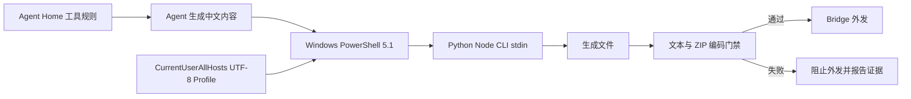

# Windows PowerShell 5.1 UTF-8 根因防线设计

## 目标

从系统默认、Agent 执行规范和产物交付三层阻断 Windows PowerShell 5.1 把中文管道内容降级为 ASCII `?` 的问题，并提供可检查、可重复安装、可回滚的维护入口。

## 已确认事实

- Windows PowerShell 5.1 的 `$OutputEncoding` 默认会让中文经原生程序 stdin 变成 `0x3F`。
- 设置 `$OutputEncoding = New-Object System.Text.UTF8Encoding($false)` 后，同一探针会得到正确 UTF-8 字节。
- 受损 Skill 的原始 Codex 会话仍保留正确中文；损坏发生在 PowerShell here-string 经管道传入 Python 的边界。
- ZIP、飞书下载和记事本不是成因：源文件、ZIP 和下载副本 Hash 一致，源文件本身已经只有 ASCII 问号。
- 结构校验和业务脚本测试没有回读中文文档，因此产生了“测试通过但人类文档损坏”的假阳性。

## 总体方案

采用三层纵深防御，不把正确性依赖在某个 Skill 是否被模型选择。

### 1. PowerShell 5.1 用户 Profile

新增 suite 管理脚本，通过真实 Windows PowerShell 5.1 查询 `$PROFILE.CurrentUserAllHosts`，在该文件中维护一个稳定受控区块：

```powershell
# BEGIN codex-im-suite PowerShell UTF-8
$OutputEncoding = New-Object System.Text.UTF8Encoding($false)
try { [Console]::InputEncoding = New-Object System.Text.UTF8Encoding($false) } catch {}
try { [Console]::OutputEncoding = New-Object System.Text.UTF8Encoding($false) } catch {}
# END codex-im-suite PowerShell UTF-8
```

约束：

- 不覆盖受控区块之外的用户 Profile 内容。
- 首次 Apply 前创建带时间戳的 UTF-8 备份。
- 重复 Apply 幂等，内容无变化时不重写文件。
- Remove 只删除受控区块，不删除用户 Profile。
- 无控制台宿主时，Console 编码设置失败不得阻止 `$OutputEncoding` 生效。

### 2. suite 安装、诊断与 Agent 规范

脚本提供 `-Apply`、`-Check`、`-Remove` 三种模式。`-Check` 必须启动真实 `powershell.exe` 5.1，把 Unicode 环境变量经管道交给 Python 或 Node，并核对收到的字节是 UTF-8。

`bootstrap-suite.ps1` 调用 Apply；suite doctor 输出 Profile 路径、受控区块状态和真实 stdin 探针结果。

Agent Home 的“工具与环境”规则加入以下通用约束：

- 中文不得通过未配置 UTF-8 的 PowerShell here-string/管道传给原生程序。
- 使用 `powershell.exe -NoProfile` 时必须在命令内显式设置 `$OutputEncoding`。
- `chcp 65001`、`PYTHONUTF8=1` 和目标文件声明 UTF-8 不能替代原生 stdin 字节验证。
- 优先使用直接 `apply_patch`、UTF-8 文件、Unicode 环境变量或 base64 传递中文。

### 3. 文本与 ZIP 交付门禁

新增纯检测模块，检查即将交付的文本文件和受支持 ZIP 文本条目：

- 严格 UTF-8 解码失败。
- Unicode replacement character `U+FFFD`。
- 连续多个 ASCII 问号形成的疑似字符丢失片段。
- 中文任务生成的 Markdown/YAML 在大段说明区完全 ASCII 化且问号比例异常。

门禁只检查有限大小、白名单扩展的文本条目；ZIP 必须限制条目数量、单条和总解压大小，并拒绝路径穿越条目。二进制文件、正则中的单个 `?`、URL 查询参数和正常英文问句不得误报。

检测失败时：

- 不发送文件或 ZIP。
- 不声称测试或交付完成。
- 返回具体文件、规则和建议修复方式。

## 数据流



## 测试设计

1. RED：未安装 Profile 时，真实 PowerShell 5.1 探针得到 `3f3f3f3f`。
2. GREEN：Apply 后探针得到“中文测试”的 UTF-8 字节。
3. Profile 已有用户内容时，Apply/Remove 均原样保留用户区块。
4. Apply 两次文件 Hash 不变。
5. `-NoProfile` 探针证明 Profile 会被绕过，同时 Agent 规则和内联 `$OutputEncoding` 示例可通过。
6. 产物检测拒绝连续 `???` 的 Markdown/YAML。
7. 产物检测接受 PowerShell 正则量词、URL 和正常英文问句。
8. ZIP 检测拒绝损坏文本条目，接受正常 UTF-8 文本与二进制混合包。
9. bootstrap/doctor 测试验证安装与状态投影，不依赖固定用户名或固定 Documents 路径。

## 迁移与回滚

- 安装前备份当前 Profile。
- Apply 完成后立即执行真实 stdin 探针；失败则恢复 before-image，并报告阻塞。
- Remove 删除受控区块并再次探测，明确提示 PowerShell 5.1 已恢复原默认行为。
- 现有受损 Skill 不在系统安装事务中自动覆盖；系统防线验证通过后，再从原始会话 evidence 恢复并重新打包。

## 非目标

- 不修改 `C:\Windows\System32\WindowsPowerShell\v1.0\powershell.exe`。
- 不依赖修改系统 PATH 或用同名可执行文件劫持 PowerShell。
- 不把 Unity、Ignis、具体文件名或单个群聊写入编码规则。
- 不尝试从已经变成 `?` 的文件猜回中文；恢复必须使用原始会话或其他真实来源。
