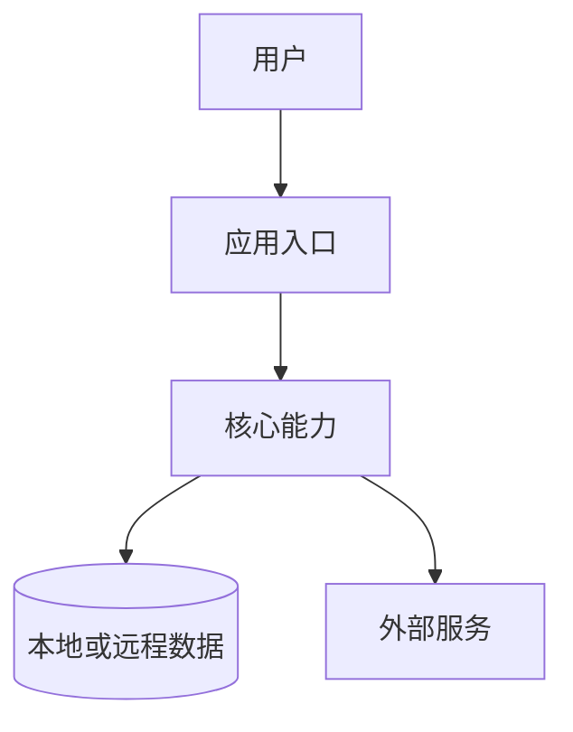
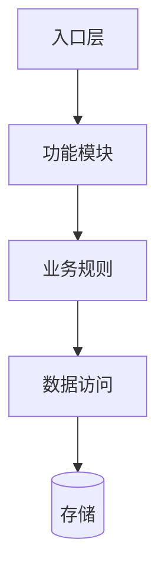
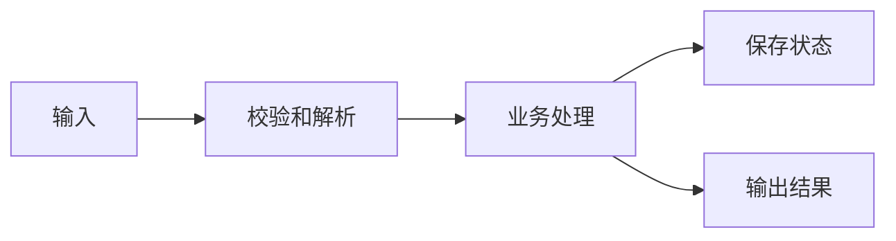
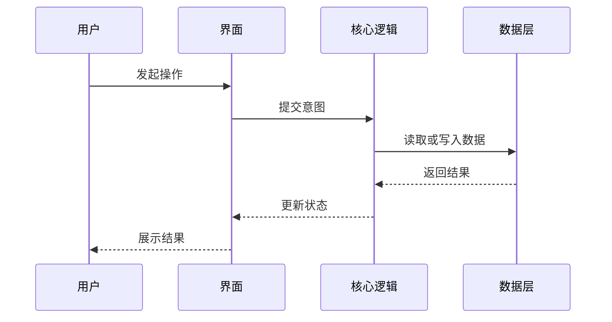

# Architecture Document Template

Use this template when creating or substantially rewriting a project architecture document. Adapt section names to the project's existing language and documentation style.

~~~markdown
# 项目架构

## 项目目标

用 2-5 句话说明项目解决什么问题、主要用户是谁、运行环境是什么。

## 系统上下文



说明系统边界、用户入口、外部服务和数据存储。

## 模块关系



说明每个核心模块的职责，以及模块之间允许的依赖方向。

## 核心数据流



说明关键数据从哪里来、如何转换、保存在哪里、输出到哪里。

## 关键运行流程



说明最重要的一条用户路径或系统流程。

## 目录结构

```text
.
├── src/
├── docs/
└── tests/
```

说明关键目录用途。不要罗列无关生成物、缓存目录或第三方依赖目录。

## 外部依赖

列出影响架构判断的依赖，例如数据库、认证服务、支付服务、游戏引擎、图形库、云服务、队列、AI 模型或第三方 API。

## 维护规则

- 修改模块边界、公共接口、数据流、存储结构、外部依赖或运行流程时，同步更新本文档。
- 新增核心功能时，检查是否需要新增或调整 Mermaid 图。
- 删除模块或替换依赖时，移除过时节点和说明。
~~~
