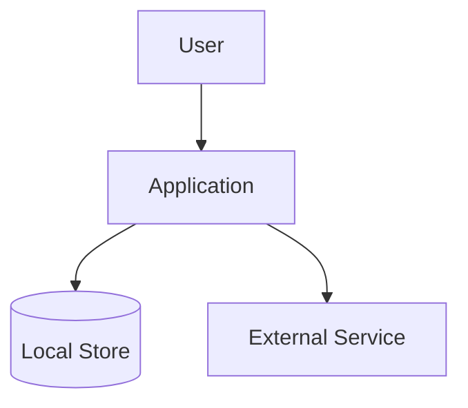
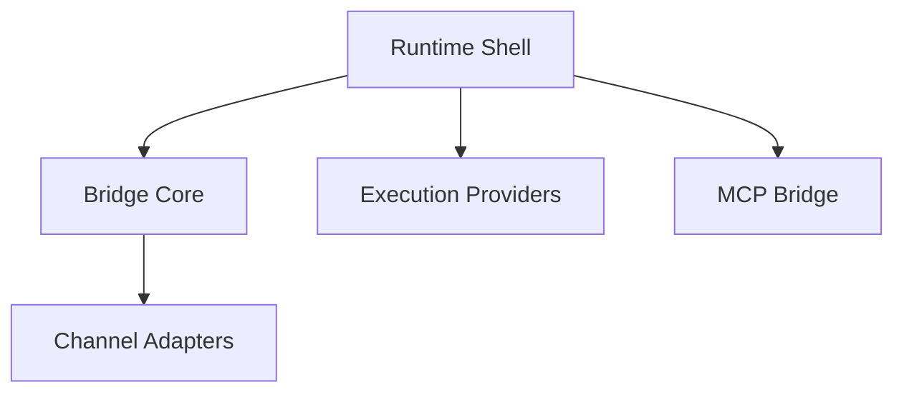
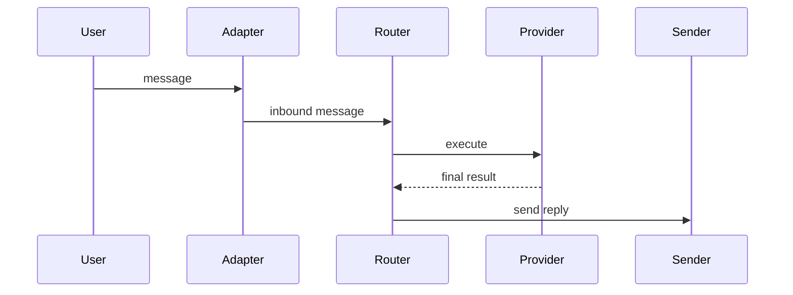

# Mermaid Patterns

Use small diagrams that answer one architectural question at a time.

## System Context

Use for project boundaries, external dependencies, and top-level responsibilities.

## Module Relationship

Use for package/module boundaries and dependency direction.

## Request Flow

Use for runtime event paths and async handoffs.

## Data Flow

Use for memory, cache, persistence, indexing, and context compression.

## Rules

- Split a dense diagram into multiple diagrams instead of adding many crossing edges.
- Label nodes with domain meaning, not class names only.
- Label edges when the transferred data or action is not obvious.
- Avoid documenting implementation details that are likely to change weekly.
